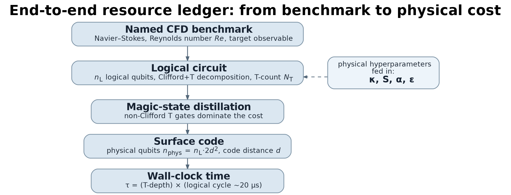
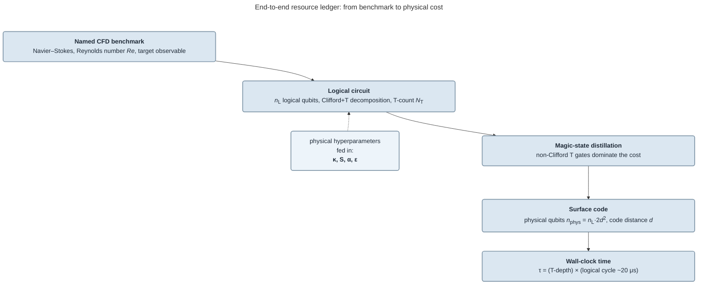

# 科研配图工具链（代码/spec 出图 → 矢量 PDF，投 LaTeX 论文用）

面向**模式 A（论文 / 期刊投稿 / 长篇综述）**的配图工具选型与实操。目标产物几乎总是
**矢量 PDF**，直接 `\includegraphics` 进 LaTeX。

> 与《配图与 AI 标注》里 **codex-image**（图像模型"画"插画/实景/概念图）是**两条互补路线**：
> - **codex-image**：概念示意、实景插画、信息图底 —— 追求美感，画面内**不放精确文字**（会乱码）。
> - **本 reference（代码/spec 出图）**：坐标图、示意流程图、框图、图论图 —— 追求**精确、可复现、矢量、字体与正文一致**。含精确数字/公式的科研图走这条线，不要用图像模型画。

> 本文结论与内联示例均为**实测所得**：用 7 条工具链**并行**复现某物理论文（QCFD 容错资源估计综述）的两张代表图，
> 各导出 PDF，`pdftoppm` 转 PNG 后逐张读图评判，`pdffonts`/`pdfimages` 验矢量与字体。
> 两张代表图：**(S)** 5 框"资源账本"示意图（竖向流程 + 侧注框 + 少量数学），
> **(P)** 带阴影带与标注框的 log–log 折线图。§5 的排名表来自这次对比。下面各工具的示例代码就是这两张图的实测源。
> 版本（2026-07）：TeX Live 2025、matplotlib 3.11 + SciencePlots 2.2、Typst 0.15（cetz 0.5.2 / cetz-plot 0.1.4）、
> Altair 6.2 + vl-convert 1.9、WeasyPrint 69、Playwright 1.61。

---

## 0. 先记住的铁律

1. **只交矢量 PDF，别交截图。** 文字仍是文字、线条仍是矢量。栅格 PNG 只在期刊强制时兜底（≥300 DPI）。
2. **按栏宽出图。** 单栏 ≈ 85 mm（`\columnwidth`），字号 8–9 pt。在生成阶段就定好物理尺寸，
   别先出大图再 `\includegraphics` 缩放 —— 否则字号/线宽和正文对不上。
3. **字体对齐正文。** CM 系论文用 **Latin Modern / (New) Computer Modern**；IEEE/ACS 等用 Times/Nimbus。
   下面每个工具都能嵌 LM/CM。
4. **pdfLaTeX/xeLaTeX 不认 SVG。** `\includegraphics` 只吃 **PDF / PNG / JPG**。SVG 必须先转 PDF
   （`inkscape` / `rsvg-convert` / `cairosvg`），别依赖 `\usepackage{svg}` 在编译时调 Inkscape（慢且脆）。
5. **验收命令**：`pdffonts fig.pdf`（字体都 `emb=yes`）、`pdfimages -list fig.pdf`（**没有**整页大图 = 真矢量）。

---

## 1. 按图类型选工具（TL;DR）

| 图类型 | 首选 | 也不错 | 投稿慎用 |
|---|---|---|---|
| **数据图**（折线/散点/柱/箱线、对数轴、误差棒） | **matplotlib + SciencePlots**（原生矢量 PDF、CM 字体） | **PGFPlots**（LaTeX 原生）、**Altair/Vega-Lite → vl-convert**（声明式） | Chromium 截图 PNG |
| **示意图 / 流程 / 框图** | **TikZ**（金标准）或 **Typst + CeTZ/Fletcher**（对 agent 友好） | **HTML/CSS → WeasyPrint**（无浏览器、字体干净）；**HTML/CSS → Playwright**（设计感最强） | D2（PDF 是栅格） |
| **图 / 树 / DAG / 自动机** | **Graphviz**（`-Tpdf`） | TikZ（`graphs`/`forest`） | — |
| **流程图、快速迭代** | **Mermaid**（`mmdc`） | D2、Graphviz | Mermaid 直接投终稿（字体不搭） |
| **交换图 / 费曼图 / 电路** | **TikZ**（`tikz-cd`、CircuiTikZ）或 **Typst Fletcher** | schemdraw（电路，Python） | — |

---

## 2. 数据图（坐标图）

### 2.1 matplotlib + SciencePlots —— 推荐默认
原生矢量 PDF、无需浏览器、`usetex` 可得真 Computer Modern、控制力最强。本次实测出图最佳，
基本等同手工期刊图。matplotlib 太常用，这里不贴完整脚本，只说清一张 LaTeX-ready 图该怎么配：

- **样式**：`plt.style.use(["science"])`（SciencePlots）打底，去掉花哨网格、用衬线字体。
- **字体对齐正文**：开 `text.usetex=True` + preamble 里 `\usepackage{lmodern}`，得真 CM/LM；
  或不装 LaTeX 时用 `font.serif=["Latin Modern Roman"]` + `pdf.fonttype=42`（`$…$` 走 mathtext）。
- **物理尺寸**：`figsize=(3.35, 2.55)`（英寸，≈85 mm 单栏），标题/轴/刻度/图例字号 7–9 pt。
- **对数轴 + 阴影带 + 标注框**：`set_xscale/yscale("log")`、`ax.axvspan(...)` 画阴影区间、
  `ax.annotate(text, xy=..., xytext=..., bbox=dict(boxstyle="round"), arrowprops=...)` 画带箭头的圆角标注框。
- **出图**：`fig.savefig("fig.pdf", bbox_inches="tight", pad_inches=0.025)` —— 直接矢量 PDF。

即：**SciencePlots 样式 + LM/CM 字体 + 按栏宽尺寸 + savefig 到 PDF**，其余就是常规 matplotlib 画线/标注。
（本次实测还画了第二张"量子优势交叉点"图，用 `transData.transform` 算屏幕角度做沿线旋转贴标，思路同上。）

### 2.2 PGFPlots（TikZ）—— LaTeX 原生、整合最好
图由 LaTeX 亲自绘制 → 字体/线宽与正文**完美一致**、零转换。略啰嗦，但 LLM 很熟。
`latexmk -pdf fig.tex` 编译；可**内联**进论文（字体绝对一致），或把 standalone PDF `\includegraphics`。
图多时用 PGFPlots `externalize` 或预编译 standalone，避免拖慢论文构建。下面是实测那张 log–log 图（目标 P）的完整源：

```latex
\documentclass[border=2pt]{standalone}
\usepackage[T1]{fontenc}
\usepackage[utf8]{inputenc}
\usepackage{lmodern}
\usepackage{amsmath}
\usepackage{amssymb}
\usepackage{tikz}
\usepackage{pgfplots}
\usetikzlibrary{arrows.meta,calc}
\pgfplotsset{compat=1.18}

\definecolor{linknavy}{RGB}{20,60,120}
\definecolor{depthred}{RGB}{222,42,42}
\definecolor{bandyellow}{RGB}{255,244,202}
\definecolor{goldline}{RGB}{188,143,32}
\definecolor{ink}{RGB}{24,32,44}

\begin{document}
\begin{tikzpicture}[font=\sffamily]
\begin{loglogaxis}[
  width=85mm, height=58mm,
  xmin=1e1, xmax=1e8, ymin=1e0, ymax=1e40,
  title={The qubit count is cheap; the depth is not},
  title style={font=\sffamily\fontsize{9.0}{10.2}\selectfont,text=black,yshift=1mm},
  xlabel={Reynolds number $\mathrm{Re}$},
  ylabel={Resource estimate (schematic)},
  label style={font=\sffamily\fontsize{8.1}{9.1}\selectfont},
  tick label style={font=\sffamily\fontsize{7.1}{8.1}\selectfont,text=ink},
  xtickten={1,2,3,4,5,6,7,8}, ytickten={0,5,10,15,20,25,30,35,40},
  minor tick num=8, grid=both,
  major grid style={draw=gray!35,line width=.28pt},
  minor grid style={draw=gray!14,line width=.18pt},
  legend style={at={(0.025,0.975)},anchor=north west,draw=gray!45,fill=white,
    rounded corners=1pt,font=\sffamily\fontsize{7.4}{8.4}\selectfont},
  legend cell align=left, clip=false,
]
% 湍流区阴影带 Re >= 1e3
\addplot[draw=none,fill=bandyellow,fill opacity=.72,forget plot]
  coordinates {(1e3,1e0) (1e8,1e0) (1e8,1e40) (1e3,1e40)} -- cycle;
% 逻辑比特：近乎平
\addplot[linknavy,line width=1.15pt]
  coordinates {(1e1,30) (1e2,34) (1e3,39) (1e4,46) (1e5,56) (1e6,70) (1e7,86) (1e8,105)};
\addlegendentry{logical qubits}
% 电路深度 / T 计数：陡幂律
\addplot[depthred,line width=1.2pt]
  coordinates {(1e1,1e7) (1e2,3.73e11) (1e3,1.39e16) (1e4,5.18e20)
               (1e5,1.93e25) (1e6,7.20e29) (1e7,2.68e34) (1e8,1e39)};
\addlegendentry{circuit depth / $T$-count}
% 三个圆角标注框（带箭头）
\node[anchor=center,draw=goldline,fill=white,rounded corners=2pt,inner xsep=3pt,inner ysep=2.3pt,
      text=black!55!orange,font=\sffamily\fontsize{7.1}{8.1}\selectfont]
      at (axis cs:1.35e7,5.2e38) {engineering turbulence $\mathrm{Re}\gtrsim10^3$};
\node[anchor=west,draw=depthred,fill=white,rounded corners=2pt,inner sep=3pt,
      text=black!45!red,text width=31mm,align=left,font=\sffamily\fontsize{7.0}{8.2}\selectfont] (redcall)
      at (axis cs:2.2e2,3.0e24) {depth \& $T$-count:\\[-.35mm] polynomial in $\mathrm{Re}$ $\to$ the real bottleneck};
\draw[depthred,line width=.65pt,-{Stealth[length=1.7mm,width=1.35mm]}]
      (redcall.south) -- (axis cs:7.0e3,1.1e21);
\node[anchor=south west,draw=linknavy,fill=white,rounded corners=2pt,inner sep=3pt,
      text=linknavy,text width=33mm,align=center,font=\sffamily\fontsize{7.0}{8.1}\selectfont] (bluecall)
      at (axis cs:1.45e3,3.0e2) {qubits $\sim\log N$:\\[-.35mm] stays modest, tens--hundreds};
\draw[linknavy,line width=.65pt,-{Stealth[length=1.7mm,width=1.35mm]}]
      (bluecall.east) -- (axis cs:2.5e5,62);
\end{loglogaxis}
\end{tikzpicture}
\end{document}
```

### 2.3 Altair / Vega-Lite → vl-convert —— 声明式、无浏览器
适合想用纯 JSON spec 的场景。`vl_convert.vegalite_to_pdf` **直接产真矢量 PDF**（不用浏览器）。
实测：正确、干净，但在 Vega-Lite 里**逐个手工摆标注框很啰嗦**，比 matplotlib 费劲；且无原生数学
（用 unicode，个别 `≳`/上标会触发字体回退）。标准图很合适，重标注图不如 matplotlib。

```python
import vl_convert as vlc
vlc.register_font_directory("/path/to/fonts")     # 让它找到 LM
spec = { "$schema":"https://vega.github.io/schema/vega-lite/v5.json",
         "layer":[ ... ], "config":{"font":"Latin Modern Roman"} }
open("fig.pdf","wb").write(vlc.vegalite_to_pdf(spec))         # 矢量
open("fig.png","wb").write(vlc.vegalite_to_png(spec, scale=3))
```
对数轴：`"scale":{"type":"log","domain":[…],"nice":false}`。Python 侧可写 `altair` 再 `chart.to_dict()`。

### 2.4 Plotly + Kaleido —— 只在坐标轴要 LaTeX 公式时才用
Plotly 是唯一原生支持坐标轴/刻度里 LaTeX 的主流 JS 库。但 Kaleido v1 现在需**外部 Chrome**（CI 更重）。
除非图内要放公式，否则优先 2.1–2.3。

---

## 3. 示意图 / 框图 / 图论图

### 3.1 TikZ —— 示意图金标准
全 LaTeX 数学、字体完美、摆放随心。啰嗦但 LLM 极熟，实测出图一流。中文标签改用 `xelatex` +
`\usepackage{ctex}`（或 fontspec 设中文字体）编译。下面是实测那张 5 框资源账本示意图（目标 S）的完整源：

```latex
\documentclass[border=2pt]{standalone}
\usepackage[T1]{fontenc}
\usepackage[utf8]{inputenc}
\usepackage{lmodern}
\usepackage{amsmath}
\usepackage{tikz}
\usetikzlibrary{arrows.meta,calc}

\definecolor{linknavy}{RGB}{20,60,120}
\definecolor{ink}{RGB}{27,38,54}
\definecolor{boxfill}{RGB}{221,232,242}
\definecolor{sidefill}{RGB}{242,247,252}
\definecolor{boxline}{RGB}{126,148,167}
\definecolor{arrowcol}{RGB}{78,100,122}

\newcommand{\LedgerBox}[3]{%
  \node[mainbox] (#1) at (30,#2) {};
  \node[boxtitle] at ($(#1.center)+(0,2.35mm)$) {#3};}
\newcommand{\BoxSub}[2]{\node[subtitle] at ($(#1.center)+(0,-2.05mm)$) {#2};}

\begin{document}
\begin{tikzpicture}[x=1mm,y=1mm,>=Stealth,font=\sffamily,
  maintitle/.style={text=ink,font=\sffamily\bfseries\fontsize{8.35}{9.4}\selectfont,align=center},
  mainbox/.style={draw=boxline,fill=boxfill,line width=.55pt,rounded corners=1.9mm,
    minimum width=60mm,minimum height=10.9mm,inner sep=0pt},
  sidebox/.style={draw=boxline,fill=sidefill,line width=.52pt,rounded corners=1.7mm,
    minimum width=21mm,minimum height=14mm,inner sep=0pt},
  boxtitle/.style={text=linknavy!45!black,font=\sffamily\bfseries\fontsize{8.35}{9.1}\selectfont,align=center},
  subtitle/.style={text=ink,font=\sffamily\fontsize{5.65}{6.45}\selectfont,align=center},
  sidetext/.style={text=ink,font=\sffamily\fontsize{5.75}{6.45}\selectfont,align=center},
  sidemath/.style={text=ink,font=\sffamily\itshape\fontsize{7.05}{7.8}\selectfont,align=center}]
\node[maintitle,text width=85mm,anchor=north] at (42.5,0)
  {End-to-end resource ledger: from benchmark to physical cost};
\LedgerBox{b1}{-13.8}{Named CFD benchmark}
\BoxSub{b1}{Navier--Stokes, Reynolds number $\mathrm{Re}$, target observable}
\LedgerBox{b2}{-27.2}{Logical circuit}
\BoxSub{b2}{$n_L$ logical qubits, Clifford+$T$ decomposition, $T$-count $N_T$}
\LedgerBox{b3}{-40.6}{Magic-state distillation}
\BoxSub{b3}{non-Clifford $T$ gates dominate the cost}
\LedgerBox{b4}{-54.0}{Surface code}
\BoxSub{b4}{physical qubits $n_{\mathrm{phys}} = n_L\!\cdot\!2d^2$, code distance $d$}
\LedgerBox{b5}{-67.4}{Wall-clock time}
\BoxSub{b5}{$\tau = (T\text{-depth})\times(\text{logical cycle }\sim20\,\mu\mathrm{s})$}
\node[sidebox] (side) at (75,-27.2) {};
\node[sidetext] at ($(side.center)+(0,3.25mm)$) {physical hyperparameters};
\node[sidetext] at ($(side.center)+(0,0mm)$) {fed in:};
\node[sidemath] at ($(side.center)+(0,-3.65mm)$) {$\kappa,\; S,\; \alpha,\; \varepsilon$};
\foreach \a/\b in {b1/b2,b2/b3,b3/b4,b4/b5}{
  \draw[arrowcol,line width=.6pt,-{Stealth[length=2.0mm,width=1.65mm]}]
    ($(\a.south)+(0,-.25mm)$) -- ($(\b.north)+(0,.25mm)$);}
\draw[arrowcol,line width=.58pt,densely dashed,-{Stealth[length=2.0mm,width=1.65mm]}]
  ($(side.west)+(-.15mm,0)$) -- ($(b2.east)+(.15mm,0)$);
\end{tikzpicture}
\end{document}
```

### 3.2 Typst + CeTZ / Fletcher —— 2026 对 agent 最友好的折中
语法比 LaTeX 简单得多、编译亚秒级、报错友好，单个二进制直接出矢量 **PDF**（内置 New Computer Modern）。
Python 调用（无需 CLI）：`import typst; typst.compile("f.typ", output="f.pdf")`（或 `output="f.png", ppi=300`）。
`@preview` 包首次编译**联网**下载、缓存到 `~/.cache/typst`。中文：`#set text(font: "Noto Serif CJK SC")`。
带标签箭头/交换图用 **Fletcher**（`@preview/fletcher`）。

实测示意图（目标 S，CeTZ 画）完整源：

```typ
#import "@preview/cetz:0.5.2"
#set page(width: 88mm, height: auto, margin: 3pt)
#set text(font: "New Computer Modern", size: 9pt, fill: rgb("#1f2937"))

#let navy = rgb("#172537")
#let boxfill = rgb("#dce8f1")
#let sidefill = rgb("#eef5fa")
#let border = rgb("#7f97aa")
#let arrow = rgb("#5d7488")
#let body = rgb("#223142")

#align(center)[#text(size: 7.55pt, weight: "bold", fill: navy)[End-to-end resource ledger: from benchmark to physical cost]]
#v(2pt)
#cetz.canvas({
  import cetz.draw: *
  let x0 = 0.05; let x1 = 6.15; let cx = (x0 + x1) / 2; let w = x1 - x0; let h = 0.83
  let ys = (4.42, 3.43, 2.44, 1.45, 0.46)
  let flow-box(y, title, subtitle) = {
    rect((x0, y - h/2), (x1, y + h/2), radius: 0.15, fill: boxfill, stroke: (paint: border, thickness: 0.72pt))
    content((cx, y), box(width: (w - 0.26) * 1cm, align(center, stack(dir: ttb, spacing: 1.5pt,
      text(size: 8.05pt, weight: "bold", fill: navy, title), text(size: 5.95pt, fill: body, subtitle),
    ))), anchor: "center")
  }
  flow-box(ys.at(0), [Named CFD benchmark], [Navier--Stokes, Reynolds number #emph[Re], target observable])
  flow-box(ys.at(1), [Logical circuit], [$n_L$ logical qubits, Clifford+$T$ decomposition, $T$-count $N_T$])
  flow-box(ys.at(2), [Magic-state distillation], [non-Clifford $T$ gates dominate the cost])
  flow-box(ys.at(3), [Surface code], [physical qubits $n_"phys" = n_L "·" 2 d^2$, code distance $d$])
  flow-box(ys.at(4), [Wall-clock time], [$tau$ = (T-depth) × (logical cycle ~20 µs)])
  for i in range(0, 4) {
    line((cx, ys.at(i) - h/2 - 0.018), (cx, ys.at(i + 1) + h/2 + 0.018),
      stroke: (paint: arrow, thickness: 0.82pt), mark: (end: ">", fill: arrow, length: 0.15cm, width: 0.11cm))
  }
  let sx0 = 6.60; let sx1 = 8.55; let sy = ys.at(1); let sh = 0.94
  rect((sx0, sy - sh/2), (sx1, sy + sh/2), radius: 0.14, fill: sidefill, stroke: (paint: border, thickness: 0.70pt))
  content(((sx0 + sx1) / 2, sy), box(width: (sx1 - sx0 - 0.16) * 1cm, align(center, stack(dir: ttb, spacing: 1.2pt,
    text(size: 5.75pt, fill: body)[physical hyperparameters], text(size: 5.75pt, fill: body)[fed in:],
    text(size: 7.2pt, fill: navy)[$kappa, S, alpha, epsilon$],
  ))), anchor: "center")
  line((sx0, sy), (x1, sy), stroke: (paint: arrow, thickness: 0.75pt, dash: "dashed"),
    mark: (end: ">", fill: arrow, length: 0.14cm, width: 0.10cm))
})
```

对数折线图用 `cetz-plot`。实测其对数轴较别扭 —— 稳妥做法是**把 `log10(值)` 画在线性轴上、刻度写 `10^k`**（下例即如此），坐标轴样式用 `"scientific"`：

```typ
#import "@preview/cetz:0.5.2"
#import "@preview/cetz-plot:0.1.4": plot
#set page(width: 88mm, height: auto, margin: 3pt)
#set text(font: "New Computer Modern", size: 9pt, fill: rgb("#111827"))

#let blue = rgb("#1f77b4"); #let red = rgb("#d92828")
#let band = rgb(255, 235, 148, 82); #let gold = rgb("#a97900")
#let grid-major = rgb(206, 213, 221, 165); #let grid-minor = rgb(231, 235, 240, 125)
#let x-ticks = ((1,[$10^1$]),(2,[$10^2$]),(3,[$10^3$]),(4,[$10^4$]),(5,[$10^5$]),(6,[$10^6$]),(7,[$10^7$]),(8,[$10^8$]))
#let y-ticks = ((0,[$10^0$]),(5,[$10^5$]),(10,[$10^10$]),(15,[$10^15$]),(20,[$10^20$]),(25,[$10^25$]),(30,[$10^30$]),(35,[$10^35$]),(40,[$10^40$]))
#let red-data = ((1,7.0),(2,11.6),(3,16.15),(4,20.72),(5,25.28),(6,29.85),(7,34.42),(8,39.0))   // log10(depth)
#let blue-data = ((1,1.34),(2,1.42),(3,1.50),(4,1.60),(5,1.71),(6,1.83),(7,1.96),(8,2.10))       // log10(qubits)

#align(center)[#text(size: 10.2pt)[The qubit count is cheap; the depth is not]]
#v(1pt)
#cetz.canvas({
  import cetz.draw: *
  plot.plot(size: (7.05, 4.45), x-min: 1, x-max: 8, y-min: 0, y-max: 40,
    x-tick-step: none, y-tick-step: none, x-ticks: x-ticks, y-ticks: y-ticks,
    x-label: [Reynolds number Re], y-label: [Resource estimate (schematic)],
    axis-style: "scientific", legend: "inner-north-west",
    legend-style: (fill: rgb(255,255,255,235), stroke: (paint: rgb("#c4cbd4"), thickness: 0.45pt), scale: 78%),
    name: "main",
    {
      // 阴影带 + 手绘对数网格（annotate 层）
      plot.annotate(background: true, resize: false, {
        rect((3, 0), (8, 40), fill: band, stroke: none)
        for k in range(1, 9) { line((k,0),(k,40), stroke: (paint: grid-major, thickness: 0.32pt)) }
        for y in range(0, 41) {
          let s = if calc.rem(y,5)==0 { (paint: grid-major, thickness: 0.32pt) } else { (paint: grid-minor, thickness: 0.22pt) }
          line((1,y),(8,y), stroke: s)
        }
      })
      plot.add(blue-data, label: [logical qubits], line: "linear", style: (stroke: (paint: blue, thickness: 1.35pt)))
      plot.add(red-data, label: [circuit depth / T-count], line: "linear", style: (stroke: (paint: red, thickness: 1.35pt)))
      // 三个圆角标注框（带箭头），略 —— 用 rect + content + line(mark:(end:">")) 摆放
    },
  )
})
```

### 3.3 HTML/CSS → WeasyPrint —— 无浏览器的 HTML→PDF，字体干净
让 agent 用 HTML/CSS "设计"图，得到**真矢量 PDF**、OTF 子集正确内嵌，**不需要浏览器**。
实测干净、对齐好。**注意**：不支持 JS；**flexbox 不稳** → 用绝对定位 / CSS table / `inline-block`；
`box-shadow` 偏弱；箭头/连接线用**内联 SVG** 最稳。中文直接写进 HTML、`font-family` 设中文字体即可。
可移植配方（用系统已装字体族名，无需字体文件）：

```python
from weasyprint import HTML
html = """<!doctype html><html><head><meta charset=utf-8><style>
@page { size: 92mm 108mm; margin: 0 }              /* 页面 = 图尺寸 */
body { font-family:'Latin Modern Sans','Latin Modern Roman',sans-serif; color:#1f2937 }
.box { position:absolute; box-sizing:border-box; border:.55mm solid #8398aa;
       border-radius:3mm; background:#dce8f2; text-align:center; padding:2mm }
.b1{left:5mm;top:18mm;width:60mm} .b2{left:5mm;top:36mm;width:60mm}
.side{left:70mm;top:35mm;width:19mm;background:#eef5fa}
</style></head><body>
  <div class="box b1"><b>Named CFD benchmark</b><br>Navier–Stokes, <i>Re</i>, observable</div>
  <div class="box b2"><b>Logical circuit</b><br><i>n</i><sub>L</sub> qubits, T-count <i>N</i><sub>T</sub></div>
  <div class="box side">physical hyperparams<br>κ, S, α, ε</div>
  <svg style="position:absolute;left:0;top:0;width:92mm;height:108mm" viewBox="0 0 92 108">
    <defs><marker id="a" viewBox="0 0 5 5" refX="4" refY="2.5" markerWidth="2.5"
      markerHeight="2.5" orient="auto" markerUnits="userSpaceOnUse">
      <path d="M0,0 L5,2.5 L0,5 Z" fill="#5f7286"/></marker></defs>
    <path d="M35 32.5 L35 35.4" stroke="#5f7286" stroke-width=".4" marker-end="url(#a)"/>
    <path d="M70 43.6 L66 43.6" stroke="#607489" stroke-width=".36" stroke-dasharray="0.7 0.55"/>
  </svg>
</body></html>"""
HTML(string=html).write_pdf("fig.pdf")     # 再：pdfcrop --margins 2 fig.pdf fig.pdf
```

### 3.4 HTML/CSS → Playwright（Chromium `page.pdf()`）—— 设计感最强
全套现代 CSS（flexbox、渐变、阴影、`@font-face`、KaTeX/MathJax）。实测出图最惊艳
（渐变卡片 + 柔和阴影），适合 slides/博客，很多场合投稿也可。**实测坑（`pdffonts` 查出）**：
Chromium 把文字嵌成 **Type 3 字体**。Type 3 仍是矢量，但**部分 arXiv/期刊 preflight 会拦 Type 3**——
严格终稿优先 WeasyPrint/TikZ/matplotlib，或后处理转换。容器里需 `--no-sandbox`。
关键手法（量元素尺寸 → 把页面设成正好那么大）：

```python
from playwright.sync_api import sync_playwright
with sync_playwright() as p:
    b = p.chromium.launch(args=["--no-sandbox"])
    page = b.new_page()
    page.set_content(html, wait_until="load")
    page.evaluate("document.fonts.ready")          # 防止渲染没完成就导出
    box = page.locator("#figure").bounding_box()
    mm = lambda px: px/96*25.4
    page.pdf(path="fig.pdf", print_background=True,
             width=f"{mm(box['width'])+0.25}mm", height=f"{mm(box['height'])+0.25}mm",
             margin={"top":"0","right":"0","bottom":"0","left":"0"})
    b.close()
```

### 3.5 Graphviz（`dot`）—— 自动布局图论图
依赖图、树、DAG、自动机的不二之选。`dot -Tpdf g.dot -o g.pdf` 即真矢量。实测忠实还原竖向流程
（`rank=same` + 虚线侧边），"简单三工具"里标签控制最好——**但**默认字体是 Arial/Helvetica（不搭）。
设 `fontname="Latin Modern Roman"`（已装）或 `"Times-Roman"`，用 HTML-like label 做粗体标题 + 副标题。
实测把示意图（目标 S）也用它复现了一版，源如下：



### 3.6 Mermaid（`mmdc`）—— 上手最快、精修最弱
`flowchart TD` 对 agent 极易写，`mmdc -i s.mmd -o s.pdf` 出 PDF/SVG（`mmdc` 靠 Puppeteer/Chromium）。
实测能用，但排版较通用、需布局 hack（用透明 `ghost` 节点把侧框摆到右边）、字体是 Arial（不搭）。
适合草稿/文档；直出 PDF 有问题时用 `cairosvg` 把 SVG 转 PDF。终稿优先 TikZ/Typst/WeasyPrint。实测源：



---

## 4. AI 标注

代码/spec 出的图属于"作者自绘 / 作者据真实数据制图"，标注措辞参见 SKILL.md《AI 标注的措辞 gradient》：
- 纯代码手绘、无 AI 介入 → **不标 AI**（"作者自绘"）。
- agent 据真实数据用代码制图 → "数据来源：文献[X]；作者据 X 数据制图（AI 辅助）"。
- 用了 HTML→Playwright/codex 做视觉排版 → "作者编辑 + AI 排版"。

---

## 5. 实测排名（本次对比）

**示意图（目标 S），按出图质量 + LaTeX 契合度：**

| 工具 | 观感 | 矢量/字体 | 字体匹配 | agent 成本 | 结论 |
|---|---|---|---|---|---|
| **TikZ** | ★★★★★ | Type 1 LM | 原生 CM | 中（啰嗦） | 综合最佳，金标准 |
| **HTML→Playwright** | ★★★★★ | 矢量但 **Type 3** | LM（Type 3） | 低–中 | 最漂亮；严格投稿有 Type-3 顾虑 |
| **HTML→WeasyPrint** | ★★★★☆ | CID/Type0C 子集 | LM | 低–中 | 无浏览器 HTML→PDF 最佳 |
| **Typst + CeTZ** | ★★★★☆ | Type0C New CM | New CM | **低** | 现代折中，很香 |
| **Graphviz** | ★★★☆☆ | 矢量 | Arial（可改） | 低 | 图论图强；记得设 fontname |
| **Mermaid** | ★★★☆☆ | 矢量 | Arial | **最低** | 草稿/文档，非终稿 |

**数据图（目标 P），按出图质量 + LaTeX 契合度：**

| 工具 | 观感 | 矢量/字体 | 数学 | agent 成本 | 结论 |
|---|---|---|---|---|---|
| **matplotlib + SciencePlots** | ★★★★★ | Type 1 LM | mathtext/usetex | 低–中 | 数据图默认最佳 |
| **PGFPlots** | ★★★★★ | Type 1 LM | 全 LaTeX | 中 | LaTeX 整合最佳 |
| **Vega-Lite → vl-convert** | ★★★☆☆ | Type0C LM | 仅 unicode | 中–高（标注啰嗦） | 标准图不错 |
| **Typst cetz-plot** | ★★★☆☆ | Type0C New CM | Typst 数学 | 中 | 对数轴别扭，简单图 OK |

八份 PDF 均经 `pdffonts`/`pdfimages` 确认为真矢量；只有 Chromium 那份用了 Type 3 字体。

---

## 6. 验收与收尾

```bash
pdffonts fig.pdf        # 每个字体 emb=yes；留意 "Type 3"（Chromium）
pdfimages -list fig.pdf # 无整页栅格 => 真矢量
pdfcrop --margins 2 fig.pdf fig.pdf     # 裁到内容框
pdftoppm -png -r 200 fig.pdf preview    # -> preview-1.png 逐张读图核验
```
论文里：`\includegraphics[width=\columnwidth]{fig.pdf}`（或 `0.6\linewidth`）。
先在草稿里 `\the\columnwidth` 打印真实栏宽，按它出图，避免任何缩放。

---

## 7. 环境搭建（无 sudo 也能装）

无 root 时避开 `apt`，全部装到用户空间：

```bash
# 1) Python 工具装进 venv（uv 绕开 python3-venv/ensurepip 依赖）
uv venv --system-site-packages ~/.figvenv
uv pip install --python ~/.figvenv/bin/python \
    matplotlib SciencePlots altair vl-convert-python weasyprint playwright typst pandas cairosvg
~/.figvenv/bin/python -m playwright install chromium   # 装到用户缓存，无需 sudo

# 2) 从 TeX Live 取 Latin Modern / New Computer Modern（给 HTML/matplotlib 用，无需 sudo）
mkdir -p ~/.local/share/fonts/fig
cp "$(kpsewhich lmroman10-regular.otf)" "$(kpsewhich lmsans10-regular.otf)" \
   "$(kpsewhich NewCM10-Regular.otf)"  "$(kpsewhich NewCMMath-Regular.otf)" \
   ~/.local/share/fonts/fig/ && fc-cache -f ~/.local/share/fonts
# fc-list | grep -i "latin modern\|new computer modern"  # 验证

# 3) PDF 工具：pdftoppm/pdftocairo（poppler）+ pdfcrop（TeX Live）通常已装。
```
说明：WeasyPrint 需 libpango/libcairo/libgdk-pixbuf（多数环境预装，本次直接可用）；
Typst `@preview` 包首次用需联网；容器里 Chromium 起不来就退回 WeasyPrint（无浏览器）。

---

## 8. 常见坑与修法

| 现象 | 原因 | 修法 |
|---|---|---|
| `\includegraphics` 打不开 `.svg` | pdf/xelatex 不读 SVG | 进 LaTeX 前先把 SVG 转 PDF（`inkscape`/`rsvg-convert`/`cairosvg`） |
| 字体像"贴上去的"、大小不对 | 没按栏宽出图 | 按 ~85 mm / `\columnwidth` 出图，别在 `\includegraphics` 里缩放 |
| arXiv/preflight 拦字体 | **Chromium `page.pdf` 出 Type 3** | 改用 WeasyPrint/TikZ/matplotlib，或重蒸馏；`pdffonts` 自查 |
| 图糊 | 嵌进去的是 PNG 截图 | 出矢量 PDF，或 PNG ≥300 DPI |
| HTML 截图空白/半张 | 渲染/字体没就绪就截 | `page.evaluate("document.fonts.ready")` + 略等 |
| WeasyPrint 布局塌 | 不支持 flexbox/JS | 用绝对定位/表格；连接线用内联 SVG；无 JS |
| 论文里 D2 图发虚 | D2 的 PDF 是 PNG 套壳 | 论文别用 D2；非要用则 D2→SVG（纯文本标签）→Inkscape→PDF |
| Mermaid/Graphviz 文字≠正文字体 | 默认 Arial/Helvetica | 设 `fontname="Latin Modern Roman"`/`"Times-Roman"`；或改用 TikZ/Typst |
| Vega `≳`/上标显示成方块 | 所选字体缺字形 | 用普通 unicode，或换含该字形的字体；先 `register_font_directory` |
| 大片白边 | 工具页面 ≠ 内容 | `pdfcrop --margins 2` |
| matplotlib `usetex` 慢/报错 | 构建环境没 LaTeX | 去掉 `usetex`，`font.serif=LM` + `pdf.fonttype=42`，走 mathtext |

---

## 9. 一句话选型

- **数据图** → matplotlib/SciencePlots 或 PGFPlots（终稿）；要声明式 JSON 用 Altair/Vega-Lite + vl-convert；图内要公式才上 Plotly+Kaleido。
- **示意图** → TikZ（质量）或 Typst+CeTZ（省心）；想"设计"图又不想开浏览器用 HTML→WeasyPrint；要最强视觉用 Playwright（注意 Type 3）。
- **图论/流程** → Graphviz/Mermaid 图快；终稿升级到 TikZ。
