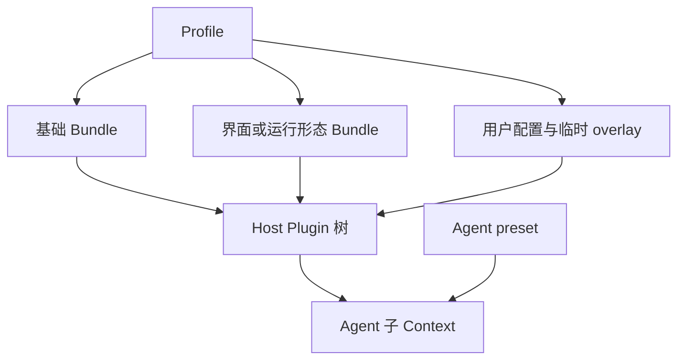

# DeepSeek Harness（dsh）运行时

本文从使用者和集成者视角说明 DeepSeek Harness 的运行方式、组合模型、内置扩展、程序化入口和权限边界。编写、测试和分发 Plugin 的代码路径见 [DeepSeek Harness Plugin 开发](deepseek-plugin-development.md)。

> **来源口径：** 本文按 2026-08-16 的[官方仓库源码状态](https://github.com/deepseek-ai/deepseek-harness/commit/47f943859bef60e4160492346772ded9b24f765a)核对。源码与文档链接固定到该状态，但可读文字不展示内部 ref；社区数据在开发篇另标截止日期。

## <a id="product-position"></a>产品定位与来源口径

DeepSeek Harness（`dsh`）是 DeepSeek 开源的 agent harness。它以 Cordis 为 Plugin 运行框架：模型适配、system prompt、工具、agent loop、Session、持久化、沙箱、审批和界面都通过同一棵 Plugin 树组合，因此部署可以替换实现或增加策略，而不必修改一个特权核心。

项目处于 developer preview（开发者预览），会继续发生兼容性破坏；Session 格式也没有跨版本兼容承诺。仓库采用 MIT 许可，官方安装入口是 npm 包 [`@deepseek-ai/dsh`](https://registry.npmjs.org/%40deepseek-ai%2Fdsh)。截至本次核验，官方仓库尚无 Git tag 或 GitHub Release。

> 来源：[DeepSeek Harness 的产品定位、预览状态和许可](https://github.com/deepseek-ai/deepseek-harness/blob/47f943859bef60e4160492346772ded9b24f765a/README.md#L5-L55)；[Cordis Plugin 树与可替换能力](https://github.com/deepseek-ai/deepseek-harness/blob/47f943859bef60e4160492346772ded9b24f765a/docs/architecture.md#L9-L37)。

## <a id="install-and-run"></a>安装与启动

运行要求是 Node.js `^22.19.0 || >=24.0.0`。只需使用安装版时，可直接启动 Web UI：

```sh
npx @deepseek-ai/dsh web
```

源码 checkout 需要先安装依赖并构建运行产物：

```sh
pnpm install
pnpm run build
pnpm dsh web
```

### npm 安装与源码构建

安装版从 npm 取得已构建的 CLI；源码模式则以仓库中的 TypeScript 入口启动，但仍依赖预先生成的 Host、Client 和前端产物。源码改变后若没有重新构建，CLI 可能读取旧的浏览器 bundle，因此源码开发应把 `pnpm run build` 看成运行前置，而不是由启动命令自动完成的步骤。

### Web 与 headless

| 运行形态 | 启动方式 | 适用场景 |
|---|---|---|
| Web | `dsh web` 或 `dsh --profile web` | 交互式会话、设置、trajectory 和 Plugin UI；默认监听 `127.0.0.1:3080` |
| headless | `dsh --profile headless "<task>"` | 一次性任务；等待 Agent idle 后输出最后一条 assistant 文本，不启动 HTTP 服务 |

两种形态都以启动命令所在目录作为默认 workspace。Web 与 headless 是不同的 Profile：它们共享基础 Bundle，再分别叠加浏览器应用或一次性 runner。

> 来源：[npm 与源码启动命令](https://github.com/deepseek-ai/deepseek-harness/blob/47f943859bef60e4160492346772ded9b24f765a/README.md#L13-L35)；[Profile、Web alias 与源码运行行为](https://github.com/deepseek-ai/deepseek-harness/blob/47f943859bef60e4160492346772ded9b24f765a/apps/cli/reference/README.md#L7-L84)。

## <a id="runtime-composition"></a>运行时组合

dsh 的组合分成 Host 运行时与 Agent 作用域两层。Profile 先把 Bundle、用户配置和临时 overlay 叠成 Host Plugin 树；创建 Agent 时，Agent preset 再把 prompt、tools 和策略挂到该 Agent 的子 Context。



### Cordis Plugin 树

| 对象 | 负责什么 | 存放形式 |
|---|---|---|
| Plugin | 提供服务、事件监听、工具、策略或 UI | TypeScript / JavaScript module |
| Bundle | 分发一层可安装的 Plugin 配置 | 带 `dsh.bundle` manifest 的 package |
| Profile | 选择 Bundle 并保存部署覆盖 | `$DSH_HOME/profiles/<name>` |
| Agent preset | 为单个 Agent 组合 prompt、tools 与策略 | preset 目录中的 Cordis composition |

#### Plugin、Context 与 Fiber

每个已加载 Plugin 都在一个 Cordis Context 中运行，并由一个 Fiber 管理生命周期。Plugin 通过 Context 注册 service、event listener 或 effect；Fiber 卸载时，这些注册随其一起撤销。运行时因此可以热替换一个实现，也可以在同一扩展点叠加审批、重试、日志或压缩策略。

运行时篇只解释这套关系。`apply`、`Config`、依赖注入、effect 和 HMR 的代码写法见 [Plugin 基础](deepseek-plugin-development.md#plugin-basics)。

#### Bundle 与 Profile

Profile 从空根开始按顺序应用配置层：

1. Profile manifest 中列出的各个 Bundle patch；
2. Profile 自己的 `cordis.patch.yml`；
3. Harness home 下的全局 `cordis.patch.yml`；
4. 命令行中的各个 `--patch` overlay。

后层按 row id 覆盖前层；`config` 是整项替换，不是深合并。普通 dependency 即使安装成功，也不会成为配置层，只有声明 `dsh.bundle` 的 package 才会被加入 Profile。

```sh
dsh plugin --profile web add <package-or-git-spec>
dsh plugin --profile web remove <package>
dsh --profile web --dump-config
```

#### Agent preset

官方随附四种 preset：

| preset | 模型获得的工作方式 |
|---|---|
| `standard` | 完整 coding agent，包括 shell、文件、jobs、plan、todo、Skills、Web、Subagent 与 workflow |
| `code` | 只直接暴露 `run_code` 和生成的 TypeScript SDK，由代码组合工具调用 |
| `minimal` | 固定 system prompt，只保留 persistent Bash 与 `str_replace_editor` |
| `cordis` | 在 standard 上增加运行时检查和临时动态 Plugin 工具 |

Preset 只改变 Agent 子 Context，不替换 Host 的浏览器、Session、持久化或权限服务。空白 Session 可以原子重组到另一 preset；一旦 Session 已产生任何记录便拒绝切换，避免历史工具调用与当前能力集合不一致。修改默认 preset 只影响之后创建的 Session。

> 来源：[Plugin 组合、Profile、Bundle 与 Agent 执行](https://github.com/deepseek-ai/deepseek-harness/blob/47f943859bef60e4160492346772ded9b24f765a/docs/architecture.md#L9-L104)；[CLI 的配置层顺序](https://github.com/deepseek-ai/deepseek-harness/blob/47f943859bef60e4160492346772ded9b24f765a/apps/cli/reference/README.md#L7-L19)；[Agent preset 的重组边界](https://github.com/deepseek-ai/deepseek-harness/blob/47f943859bef60e4160492346772ded9b24f765a/packages/preset/agent-presets/README.md#L135-L153)。

### Agent 执行与会话

#### Turn、step 与 Agent loop

一个 **turn** 是 Agent 从领取输入到没有后续工作为止的一次响应过程；一个 **step** 是其中的一次模型请求及其工具调用。工具结果可能要求再次请求模型，因此一个 turn 可以包含多个 step。

默认 agent loop 负责推进这条流程，Plugin 则在 prompt 组装、模型请求、工具执行和 turn 收尾等扩展点加入策略。审批、重试、超时、压缩和观测不需要写进 loop；它们通过 service 或 event 与 loop 组合。

#### Session 日志与持久化

Session 是只追加的事件日志。模型历史、Trajectory、恢复、分叉、回放和遥测都从同一条记录推导；**model-visible means logged** 表示进入模型请求的信息必须能够从日志重建。

默认 Profile 使用每 Session 一份压缩 JSONL；SQLite backend 可以把多个 Session 集中到一个数据库。两种 backend 共享同一套事件语义，但当前格式仍处于预发布阶段，没有跨版本迁移承诺。

开发新的 durable event、projection 或 replay 逻辑时，转到 [会话数据 Plugin](deepseek-plugin-development.md#session-data-plugins)。

> 来源：[Agent turn flow 与 Session log](https://github.com/deepseek-ai/deepseek-harness/blob/47f943859bef60e4160492346772ded9b24f765a/docs/architecture.md#L53-L97)；[Session subsystem 的类型与持久化语义](https://github.com/deepseek-ai/deepseek-harness/blob/47f943859bef60e4160492346772ded9b24f765a/docs/subsystems/session.md#L1-L120)。

## <a id="builtin-extensions"></a>内置扩展

这些能力在实现上仍是 Plugin，但本节只讲部署者和使用者看到的行为。对应 package 的开发模式会在开发篇作为 Tool、Provider 或协议驱动案例出现。

### 模型配置

Web 的 **Settings → Models** 可以配置 DeepSeek、已安装 catalog provider 和自定义兼容端点。Settings 只保存 credential reference；密钥写入 `$DSH_HOME/.credentials.yaml`，页面读回的是脱敏描述而不是明文。

自定义 provider 需要 Provider ID、base URL、API 协议、凭据和模型列表。手工添加的模型默认按 text-only 处理；需要图片输入时，必须在模型或 route metadata 中显式声明，dsh 不会探测端点能力。模型和凭据变化在下一次请求生效，不要求重启服务。

> 来源：[模型与凭据配置指南](https://github.com/deepseek-ai/deepseek-harness/blob/47f943859bef60e4160492346772ded9b24f765a/docs/user/guide/providers.md#L5-L98)。

### Skills

`dsh-skill-filesystem` 从项目级和用户级目录发现 Skills，支持 `<name>/SKILL.md` 目录 bundle 和 `<name>.md` 平铺文件。发现只看根目录下一层，不递归扫描嵌套 Skill 树；项目内容优先于用户内容。

项目可使用 `.dsh/skills` 或通用的 `.agents/skills`。Provider 监听目录条目和 `SKILL.md` frontmatter 的变化；正文与 `references/`、`scripts/`、`assets/` 等资源在真正调用 Skill 时再读取。

> 来源：[文件系统 Skill provider 的目录、格式与监听边界](https://github.com/deepseek-ai/deepseek-harness/blob/47f943859bef60e4160492346772ded9b24f765a/packages/skill/skill-filesystem/README.md#L5-L73)。

### MCP

内置 MCP client 支持 `stdio` 和 `streamable-http`。每个 server 以独立 Plugin 连接并把远端工具注册进 `ctx.tools`，公开名称带 server namespace，避免不同 server 的同名工具冲突。

当前只桥接 **Tools**，不桥接 Resources 或 Prompts。非文本 MCP result 在执行期仍保留结构化值，但进入模型历史时图片、音频和 resource 会变成占位文本，因此不能把 MCP transport 等同于完整多媒体上下文通道。

默认 Profile 不启动任何 MCP server。`stdio` server 是 Host 直接启动的可执行程序，不受 Agent 工具沙箱约束。

> 来源：[MCP transport、工具同步与结果映射](https://github.com/deepseek-ai/deepseek-harness/blob/47f943859bef60e4160492346772ded9b24f765a/packages/mcp/mcp-client/README.md#L5-L114)。

### Subagent

`ctx.subagents` 是可并存多个命名 provider 的能力。模型侧 `subagent` tool 只绑定其中一个 provider；替换 provider 可以改变进程和传输方式，而不改变委派工具的基本调用形状。

| provider | child 形态 | 上下文关系 |
|---|---|---|
| spawn in-process | 当前 dsh 进程中的新 Agent | 继承 cwd、lineage、模型与 Host 服务，不继承父对话 |
| fork in-process | 当前进程中的新 Agent | 以父 Session 已完成的 turns 作为一次性 seed |
| ACP | 新 subprocess 中的 Agent | 独立 runtime、Session、模型和工具，通过 ACP 驱动 |
| Codex | 真实 Codex app-server child | 独立产品上下文，parent 主要获得最终结果 |
| Claude Code | 官方 Claude Agent SDK child | 独立产品上下文，认证与配置由 Claude Code 负责 |
| dsh SDK | TypeScript SDK 启动的 dsh runtime | 独立完整 Plugin 树，通过 SDK 协议驱动 |

Provider 可以声明 structured output、persona、tool filter、depth limit 或 continuation 等能力；调用者要求 provider 不支持的能力时应显式失败，而不是静默忽略。

> 来源：[Subagent provider 家族与职责](https://github.com/deepseek-ai/deepseek-harness/blob/47f943859bef60e4160492346772ded9b24f765a/packages/subagent/README.md#L5-L23)；[in-process spawn 与 fork 的上下文差异](https://github.com/deepseek-ai/deepseek-harness/blob/47f943859bef60e4160492346772ded9b24f765a/packages/subagent/subagent-in-process-driver/README.md#L5-L63)。

## <a id="programmatic-access"></a>程序化接入

这些入口驱动的是完整 Harness，而不是直接调用模型 API。外部程序创建或连接 Agent、发送输入、观察 Session event，并负责 runtime subprocess 的配置和生命周期。

### ACP

内置 ACP server 通过 JSON-RPC stdio 提供基础自动化：客户端可以创建 fresh Session、发送文本 prompt、接收已提交的 assistant 文本、处理一次性 permission request 和取消工作。

ACP 不等同 Web UI。它不提供历史 Session 的 list/resume/delete/fork，也不传输 reasoning、tool activity、plans、titles 或 UI presentation；一个连接拥有其创建的全部 Session，并在断开时负责清理。

> 来源：[ACP 的协议范围、生命周期和已知限制](https://github.com/deepseek-ai/deepseek-harness/blob/47f943859bef60e4160492346772ded9b24f765a/packages/acp/acp/README.md#L5-L81)。

### TypeScript 与 Python SDK

| SDK | 客户端接口 | runtime 来源 |
|---|---|---|
| TypeScript | 高层 `DeepSeekHarness.run()`；低层 `HarnessClient` 协议 API | 调用者显式提供 command 与 args |
| Python | 高层 turns API 与低层 JSON-RPC client | 可随 Python distribution 取得匹配的 runtime binary |

两者都通过 stdio JSON-RPC 驱动 subprocess。高层 API 可以把一次调用定义为“消息入队到下一次全 Agent idle”的活动区间，但结果不是严格归因于单个 prompt：steering、注入内容或其他排队输入也可能在该区间内贡献输出。低层 client 则暴露 enqueue receipt、event stream、notification 和显式 teardown。

TypeScript SDK 是纯 client library，不向 Cordis 注册 Plugin；它启动的 child 才是完整 Harness。Python 侧把 SDK 与可分发 runtime 拆成两个 package，方便应用不依赖源码 checkout。

> 来源：[TypeScript SDK 的高低层接口与进程生命周期](https://github.com/deepseek-ai/deepseek-harness/blob/47f943859bef60e4160492346772ded9b24f765a/packages/sdk/client/README.md#L5-L49)；[Python SDK 与 runtime package 的分工](https://github.com/deepseek-ai/deepseek-harness/blob/47f943859bef60e4160492346772ded9b24f765a/python/README.md#L5-L16)。

## <a id="trust-boundaries"></a>信任边界

Host Plugin、Agent 工具、MCP server 和遥测处理的是不同权限主体。工具沙箱不是进程总沙箱，也不能撤销已经授予 Plugin 或安装脚本的 Host 权限。

### Plugin 与安装脚本

#### Host 进程权限

普通第三方 Plugin 在 `dsh` Host 进程中运行，拥有启动该进程的用户权限。它可以注册工具或监听器，也可以直接执行自身代码；tool approval 只约束 Agent 通过工具管线发起的调用。

`cordis` preset 的动态 Plugin 在 VM 中执行，但该 VM 只用于约束诚实代码，不是安全边界。Host-realm helper 仍可能让代码到达 Node 能力，因此应把它视作临时 Host Plugin，而不是沙箱中的低权限脚本。

#### Git 依赖的构建授权

从 Git 安装 TypeScript Plugin 时，包通常依赖 `prepare` 生成构建产物。pnpm 会要求用户在 Profile 的 `pnpm-workspace.yaml` 中加入 `allowBuilds`；这项授权意味着安装期直接执行 package 代码，发生在 Agent sandbox 之外。

不希望用户授权构建脚本时，应发布已经包含产物的 npm package 或 tarball。具体打包流程见开发篇的 [打包、安装与社区生态](deepseek-plugin-development.md#packaging-and-community)。

> 来源：[Git 安装的构建脚本与授权边界](https://github.com/deepseek-ai/deepseek-harness/blob/47f943859bef60e4160492346772ded9b24f765a/docs/user/develop/basic/publish.md#L153-L178)；[动态 Cordis VM 的信任说明](https://github.com/deepseek-ai/deepseek-harness/blob/47f943859bef60e4160492346772ded9b24f765a/packages/extensions/tool-cordis/README.md#L19-L27)。

### Agent 工具执行

#### 工具沙箱与审批

默认 `workspace-write` 限制 Bash 和 filesystem mutation 的写入范围；读取、网络访问和进程可见性没有被同样封闭。Sandbox backend 负责执行层隔离，approval service 负责一次工具调用的 allow / ask / deny 决策，两者缺一都不能推导出完整权限模型。

部分平台只能提供有限隔离。没有可用 backend 时，负责强制隔离的执行器应显式失败，而不是悄悄退回无约束执行。

#### MCP 进程权限

`stdio` MCP server 是 Host 启动的独立可执行程序。Agent 看到的是它桥接出的 tool，但 server 本身不在 Agent 工具沙箱里；HTTP MCP server 则把同等信任转移到远端服务和认证 header。默认 Profile 因此不启用任何 MCP server。

> 来源：[CLI 对默认权限和未受限能力的说明](https://github.com/deepseek-ai/deepseek-harness/blob/47f943859bef60e4160492346772ded9b24f765a/apps/cli/reference/README.md#L68-L80)。

### 遥测数据

Session telemetry 默认是 `DISABLED`，不会因为启动 Web 或运行 Agent 自动上传数据。显式启用时：

- `FULL` 持续把投影后的 Session records 交给 OpenTelemetry backend；
- `FEEDBACK_ONLY` 只在记录反馈时回放并导出相关 Session log 后缀。

Telemetry seam 提供 `session-telemetry/record` waterfall，让部署挂载脱敏规则；官方默认组合没有挂载任何规则。因此上传模式会按捕获值转发 message、tool arguments/results、文件内容和 workspace path 中可能存在的敏感信息。`DSH_TELEMETRY_DISABLED` 是硬关闭，collector 可由 `DSH_TELEMETRY_OTLP_URL` 选择。

> 来源：[默认遥测模式与部署行为](https://github.com/deepseek-ai/deepseek-harness/blob/47f943859bef60e4160492346772ded9b24f765a/apps/cli/reference/README.md#L74-L80)；[脱敏扩展点与默认无规则的边界](https://github.com/deepseek-ai/deepseek-harness/blob/47f943859bef60e4160492346772ded9b24f765a/packages/session/session-telemetry/README.md#L21-L49)。
