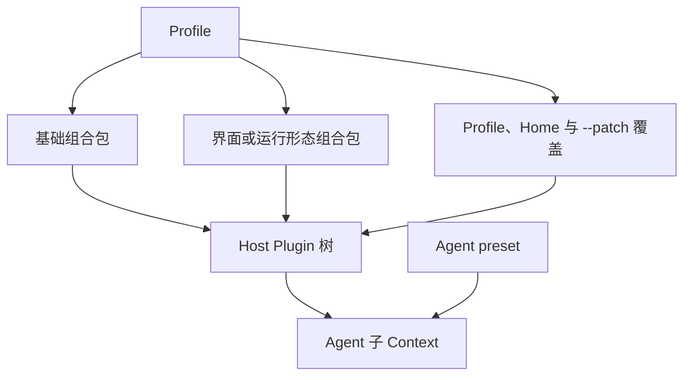
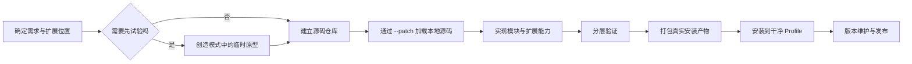

# DeepSeek Harness（dsh）Plugin 开发

本文面向 Plugin 作者，集中说明 Cordis 插件框架的组成、配置合成和生命周期，再给出从临时原型到源码工程、分层验证、打包安装与版本维护的完整开发流程。运行 DSH、安装或卸载现成 Plugin、使用内置扩展以及判断完整权限边界见 [DeepSeek Harness 运行时](dsh.md)；现成扩展与社区项目见 [DeepSeek Harness Plugin 调研记录](dsh-plugin-research.md)。

> **来源口径：** 模块与生命周期的原有结论按 2026-08-16 的[仓库源码状态](https://github.com/deepseek-ai/deepseek-harness/commit/47f943859bef60e4160492346772ded9b24f765a)保留；开发、安装和测试流程另按 2026-08-26 的[仓库源码状态](https://github.com/deepseek-ai/deepseek-harness/commit/b150a551b8d465e31e418e1b2eaf5e79bbb7d28e)复核。每条具体引用都链接到对应 commit。

## <a id="plugin-objects"></a>Plugin、配置与安装包的关系

本节先把运行代码、配置实例、安装包、Host 配置和 Agent 工作模式放进同一张关系图。后续所说的“临时”“持久”和“已安装”，都取决于开发者维护的是哪类对象，以及它保存在哪里。

### <a id="plugin-entry-package"></a>Plugin 开发中的基本概念

后文会反复操作以下对象；表格关注开发者维护什么，以及它会形成什么运行或交付结果：

| 对象 | 开发者维护的内容 | 运行或交付结果 |
|---|---|---|
| Plugin module | TypeScript / JavaScript 导出与具体实现 | Loader 可以按多条配置重复加载同一个 module |
| Loader entry | `id`、`name`、`config` 和可选的 `disabled` | `name` 指向 module；成功加载后由 Fiber 记录这次运行状态 |
| package（安装包） | module、浏览器代码、依赖、manifest 和构建产物 | 可通过 npm、Git、本地目录或 tarball 安装，也可以只提供普通库 |
| Bundle | package manifest 中的 `dsh.bundle.patch` 与默认 patch | 安装后为目标 Profile 提供一层默认 Plugin 配置 |
| Profile | 开发或验收环境中的依赖、lockfile、Bundle 列表和用户 patch | 固定这套部署实际安装并启用的 package 与配置 |
| Agent preset | `agent.cordis.yml` 与可选的 `preset.yml` | 为新 Agent 选择 prompt、tools、策略和显示信息，不改变 Host 已安装的 package |

`cordis.patch.yml` 可以插入、修改或停用多条配置，每条最终配置都是一个 Loader entry。Loader 根据 entry 的 `name` 导入 module，并为这次加载创建 Fiber；配置怎样逐层形成这些 entry，见下一节的加载路径。

开发验收时，官方 Web Settings 的“插件配置”标签页用于修改已运行 Host Plugin 主动开放的设置；“插件列表”标签页只读展示每条 Plugin 配置的启停状态和 Fiber 状态，点击卡片可以展开详情。package 的安装、删除和更新由 `dsh plugin` 负责；某条 Plugin 配置是否启用则写在 patch 中。社区 Settings 扩展可以增加其他操作入口，相关项目见调研篇的[插件市场与主题](dsh-plugin-research.md#plugin-market)。

因此，设置页清单中的一项对应一条 Plugin 配置。package 与配置是一对多关系：一个 package 可以加入多条 Plugin 配置，同一个 Plugin module 也可以按不同配置加载多次；普通库 package 则只提供依赖。

> 来源：[Plugin、Bundle 与 Profile 的关系](https://github.com/deepseek-ai/deepseek-harness/blob/47f943859bef60e4160492346772ded9b24f765a/docs/architecture.md#L9-L29)；[官方 Plugin 配置页的范围](https://github.com/deepseek-ai/deepseek-harness/blob/47f943859bef60e4160492346772ded9b24f765a/packages/client/ui-settings-plugins/README.md#L5-L25)；[官方 Plugin inventory 的只读边界](https://github.com/deepseek-ai/deepseek-harness/blob/47f943859bef60e4160492346772ded9b24f765a/packages/client/ui-settings-plugin-inventory/README.md#L5-L20)；[Bundle、普通依赖与配置层顺序](https://github.com/deepseek-ai/deepseek-harness/blob/b150a551b8d465e31e418e1b2eaf5e79bbb7d28e/docs/user/develop/basic/publish.md#L9-L128)。

### <a id="plugin-loading-paths"></a>Plugin 的加载方式、保存位置与生效时间

DSH 启动时先组成 Host Plugin 树，创建 Agent 时再把所选 preset 挂到 Agent 子 Context。Profile 负责 Host 已安装的 package、共享服务和部署覆盖；Agent preset 只从当前部署可解析的 module 中选择 prompt、tools 与策略，两者分别保存、分别生效。



Profile 从空条目列表开始按顺序应用配置层：

1. Profile manifest 中列出的各个 Bundle patch；
2. Profile 自己的 `cordis.patch.yml`；
3. Harness home 下的全局 `cordis.patch.yml`；
4. 命令行通过 `--patch` 临时加载的 overlay。

后层按 row id 覆盖前层，`config` 是整项替换；普通 dependency 只有在 package manifest 声明 `dsh.bundle` 后才会成为 Profile 的配置层。合成后的每条 Loader entry 在 Cordis Context 中启动为一个 Fiber；Plugin 通过它注册 service、event listener 和 effect，Fiber 卸载时再撤销这些注册。模块形式与完整清理规则见后文的[实现 Plugin 模块](#plugin-runtime)。

Agent preset 存放为包含 `agent.cordis.yml` 的目录，可选的 `preset.yml` 提供显示名称与说明。用户自建 preset 通常放在 `$DSH_HOME/.agent-presets/<id>/`，由随附 preset 复制后修改；它只影响之后选择该 preset 的 Agent，不负责安装 Host package。

同一段 Plugin 代码可以通过创造模式、`--patch`、Profile/Home 的 `cordis.patch.yml` 或已安装 Bundle 加载。这些入口都会指定要加载的 module、使用的配置以及是否停用；区别在于信息保存在哪里、什么时候生效。

| 入口 | 代码来源 | 写入位置 | 何时生效 |
|---|---|---|---|
| `dsh plugin --profile <name> add <spec>` | npm、Git、本地目录或 tarball package | Profile 的依赖、lockfile 和 Bundle 列表 | 安装结果持久保存；新的 Bundle 集合在下次启动使用 |
| Profile 的 `cordis.patch.yml` | 已安装 package 或绝对路径 module | 当前 Profile 的 patch 文件 | 保存后持续有效；运行进程会监视有效改动 |
| `$DSH_HOME/cordis.patch.yml` | 已安装 package 或绝对路径 module | Harness home 的 patch 文件 | 对所有 Profile 持续有效；运行进程会监视有效改动 |
| `--patch <path>` | 参数指定的 patch 文件 | 本次命令参数；Profile 保持原样 | 当前启动期间有效，适合本地开发和临时覆盖 |
| 创造模式 | 进程内的临时代码 | 当前 dsh 进程内存 | 运行后立即生效，停用、删除或重启后消失 |

上面的配置层次解释最终 Plugin 树从哪里形成；表格则用于选择开发入口。每项操作对源码、Profile 和当前进程的具体影响见后文的[操作影响表](#operation-effects)。

> 来源：[Cordis 的 Plugin、Context、Fiber 与可逆注册](https://github.com/deepseek-ai/deepseek-harness/blob/b150a551b8d465e31e418e1b2eaf5e79bbb7d28e/docs/cordis-primer.zh.md#L5-L13)；[Bundle、Profile 与配置层顺序](https://github.com/deepseek-ai/deepseek-harness/blob/b150a551b8d465e31e418e1b2eaf5e79bbb7d28e/docs/architecture.zh.md#L15-L37)；[Agent preset 的组成与保存位置](https://github.com/deepseek-ai/deepseek-harness/blob/b150a551b8d465e31e418e1b2eaf5e79bbb7d28e/packages/preset/agent-presets/README.zh.md#L5-L85)；[Bundle 安装与 Profile manifest](https://github.com/deepseek-ai/deepseek-harness/blob/b150a551b8d465e31e418e1b2eaf5e79bbb7d28e/docs/user/develop/basic/publish.md#L9-L128)；[Profile、`--patch` 与运行时重载](https://github.com/deepseek-ai/deepseek-harness/blob/b150a551b8d465e31e418e1b2eaf5e79bbb7d28e/apps/cli/reference/README.md#L7-L84)。

## <a id="plugin-development-workflow"></a>Plugin 开发流程

一条完整开发链路从需求和扩展位置开始。开发者可以直接建立源码仓库，也可以先在创造模式中验证原型；源码通过 `--patch` 挂载并逐层实现、验证后，再生成安装包、安装到 Profile、完成部署验收，最后发布可追踪的版本。每个阶段都有对应的产物和验收标准。



### <a id="workflow-entry"></a>开发入口的选择

无论从哪个入口开始，源码 Plugin 最终都要经过相同的构建、测试和安装验收。

| 当前目标 | 开发入口 | 下一阶段 |
|---|---|---|
| 扩展位置或可行性还不确定 | 在创造模式中检查真实接口并制作临时原型 | 将确认过的行为提炼成源码工程 |
| 功能边界已经明确，或一开始就需要依赖、测试和构建 | 直接建立独立源码仓库 | 用 `--patch` 挂载最小 module |
| 修改 dsh 官方能力并准备向上游贡献 | 在 dsh 官方仓库中新增或修改 package | 按官方 package、测试和文档清单注册 |
| 安装、更新或移除现成 package | 使用 `dsh plugin --profile <name> ...` 管理 package | 重启目标 Profile 验证新 Bundle 集合 |
| 启停 Plugin 配置或修改用户设置 | 修改 Profile/Home patch 或官方 Settings | 观察热重载和 Fiber 状态 |

创造模式把 **临时 Plugin** 保存在当前进程中，用来验证扩展位置和行为；源码 Plugin 则把实现、依赖、测试、构建产物和发布说明保存在磁盘上。两者都遵循 Cordis 的加载与生命周期规则，确认过的原型可以继续整理成长期工程。

> 来源：[创造模式的定位与能力](https://github.com/deepseek-ai/deepseek-harness/blob/47f943859bef60e4160492346772ded9b24f765a/apps/cli/config/agent-presets/cordis/agent.cordis.yml#L1-L27)；[创造模式与源码开发的环境差异](https://github.com/deepseek-ai/deepseek-harness/blob/47f943859bef60e4160492346772ded9b24f765a/apps/cli/config/agent-presets/cordis/skills/cordis-plugin-development/SKILL.md#L10-L80)。

### <a id="operation-effects"></a>开发步骤与操作影响

下面逐项说明每个操作会修改源码、Profile 还是当前进程，并列出对应的恢复方式。

| 操作 | 源码或产物 | Profile 磁盘状态 | 当前运行进程 | 恢复与下一步 |
|---|---|---|---|---|
| 创建或更新临时 Plugin | 只增加进程内 Package 版本 | 不变 | 激活成功后立即提供能力 | 可切回旧 Package；重启会清空整个实验 |
| 暂停临时 Plugin | 临时版本保留 | 不变 | 撤销当前注册和界面 | 可再次运行已有 Package |
| 删除临时 Plugin | 删除进程内全部版本 | 不变 | 撤销当前效果 | 只能从另有保存的源码重新创建 |
| 建立或修改源码仓库 | 文件和 Git 工作区改变 | 不变 | 未挂载时无影响 | Git commit 只保存源码历史，不会安装 Plugin |
| 以 `--patch` 启动本地 module | 源码文件保留在原处 | Profile 依赖与 Bundle 列表不变 | 只对本次启动加入 overlay；有效改动可由 HMR 重载 | 退出进程即失去挂载关系，源码仍在 |
| 修改 Profile/Home `cordis.patch.yml` | package 源码不变 | patch 持久改变 | 有效修改通常热重载对应 entry | 回退 patch 即可；无需改 package |
| `dsh --dump-config` | 不变 | 不变 | 不启动应用或 Plugin | 只验证配置合成，不能替代实际启动 |
| `pnpm pack` 或等价打包 | 新增可审查的安装产物 | 不变 | 不变 | 检查 tarball 后再装进干净 Profile |
| `dsh plugin ... add` | 安装 npm、Git、目录或 tarball package | 写依赖、lockfile 和 Bundle 列表 | 已运行进程保持原 Bundle 集合 | 重启目标 Profile 后验证 |
| `dsh plugin ... update/remove` | 更新或移除已安装 package | 重写依赖和 Bundle 列表 | 已运行进程保持原 Bundle 集合 | 重启后切换；回滚 package 版本需再次安装旧版本 |
| Git commit、tag 或 GitHub Release | 保存或标记仓库版本，可附发布产物 | 不变 | 不变 | 仍需单独安装；发布动作不会替用户更新 Profile |

> 来源：[创造模式的版本、停用与删除语义](https://github.com/deepseek-ai/deepseek-harness/blob/47f943859bef60e4160492346772ded9b24f765a/apps/cli/config/agent-presets/cordis/skills/cordis-plugin-development/SKILL.md#L368-L420)；[配置 dump 的非启动语义](https://github.com/deepseek-ai/deepseek-harness/blob/b150a551b8d465e31e418e1b2eaf5e79bbb7d28e/apps/cli/src/dump-config.ts#L1-L52)；[Profile 安装和重启边界](https://github.com/deepseek-ai/deepseek-harness/blob/b150a551b8d465e31e418e1b2eaf5e79bbb7d28e/apps/cli/reference/README.md#L41-L64)。

### <a id="creation-mode-plugin-development"></a>创造模式中的临时原型

切换到 [`cordis` preset（创造模式）](dsh.md#creation-mode)后，Agent 会保留标准模式的编码能力，并获得一组专门面向 DSH 自身的开发上下文。Agent 再根据用户目标，利用这些开发能力创建具体扩展。

#### 创造模式提供的开发上下文

切换到创造模式后，Agent 会获得以下开发信息：

| 内容来源 | 加载时机 | 作用 |
|---|---|---|
| 专用角色提示 | 自动加入 | 告诉 Agent 可以检查和修改当前 DSH，区分 Host 与 Agent preset 的职责，并要求复制后再修改官方 preset |
| 运行时开发提示与工具说明 | 自动加入 | 说明临时 Plugin 的用途、版本和批准规则、检查与修改流程、后台与网页界面的分工，以及常见错误和恢复方式 |
| 模式专用 Skill | 先加入名称与摘要，正文按需加载 | `cordis-plugin-development` 负责临时 Plugin 开发；`editing-cordis-compositions` 负责 Agent preset 与 Cordis 组合 |

创造模式直接提供工具调用顺序、版本处理、浏览器批准、生命周期和故障恢复规则；更长的示例和组合规范保存在 Skill 正文中，按任务需要加载。开发时用这些上下文检查实际扩展点、保存新版本并读取失败诊断；网页界面的临时扩展仍需用户批准后才会加载。动态 Plugin 的完整权限边界见运行时篇的[信任边界](dsh.md#trust-boundaries)。

> 来源：[创造模式自动加入的 persona 与 preset 创作规则](https://github.com/deepseek-ai/deepseek-harness/blob/47f943859bef60e4160492346772ded9b24f765a/apps/cli/config/agent-presets/cordis/agent.cordis.yml#L1-L30)；[动态 Plugin 系统提示词的注册](https://github.com/deepseek-ai/deepseek-harness/blob/47f943859bef60e4160492346772ded9b24f765a/packages/extensions/tool-cordis/src/index.ts#L35-L43)与[提示内容](https://github.com/deepseek-ai/deepseek-harness/blob/47f943859bef60e4160492346772ded9b24f765a/packages/extensions/tool-cordis/src/prompt.ts#L3-L110)；[模式专用 Skill 的挂载](https://github.com/deepseek-ai/deepseek-harness/blob/47f943859bef60e4160492346772ded9b24f765a/apps/cli/config/agent-presets/cordis/agent.cordis.yml#L241-L262)、[动态 Plugin 开发 Skill](https://github.com/deepseek-ai/deepseek-harness/blob/47f943859bef60e4160492346772ded9b24f765a/apps/cli/config/agent-presets/cordis/skills/cordis-plugin-development/SKILL.md#L1-L10)与[组合创作 Skill](https://github.com/deepseek-ai/deepseek-harness/blob/47f943859bef60e4160492346772ded9b24f765a/apps/cli/config/agent-presets/cordis/skills/editing-cordis-compositions/SKILL.md#L1-L10)；[Skill 目录消息只包含摘要、正文按需加载](https://github.com/deepseek-ai/deepseek-harness/blob/47f943859bef60e4160492346772ded9b24f765a/packages/skill/tool-skill/README.md#L5-L31)。

#### 创建、修改与验证临时 Plugin

创造模式创建的临时 Plugin 可以作为源码 Plugin 的原型。先检查实际 Host/Client 接口，再定义一个版本并运行；失败时读取该版本的诊断，并追加一个新版本修复，旧版本继续用于比较和回退。两者使用同一套 Cordis Plugin 思路，所以已经确认的行为、扩展位置和部分代码可以继续利用；临时 Plugin 保存在当前 DSH 进程中，源码 Plugin 则把源码、配置、依赖、测试和发布方式保存在磁盘上。

临时原型负责验证扩展位置、接口契约和用户行为；TypeScript 编译、package resolution、安装脚本、干净 Profile 和发布包留到源码阶段逐项验证。

#### 临时版本的保留、停用与清理

每次修改临时 Plugin 时，创造模式都会保留一份新的代码版本，旧版本仍可用于比较或恢复。创造模式把每个不可变的代码版本称为 **Package**，并为它分配 `packageId`。本文其余位置的小写 package 指 `package.json` 声明的安装包。

- **临时停用**：撤销 Plugin 当前提供的工具、监听和界面，但保留它及其代码版本，之后可以重新启用；
- **删除实验**：移除这个临时 Plugin 和它的全部版本；
- **重启 DSH**：清空创造模式保存在进程内存中的临时 Plugin。

需要跨重启保留的功能，应在重启前落成源码 Plugin；需要长期保留的 Agent 组合，则写入用户自己的 Agent preset。

> 来源：[创造模式随 preset 提供的运行时工具和开发指导](https://github.com/deepseek-ai/deepseek-harness/blob/47f943859bef60e4160492346772ded9b24f765a/apps/cli/config/agent-presets/cordis/agent.cordis.yml#L241-L258)；[动态 Plugin 的开发范围与版本处理](https://github.com/deepseek-ai/deepseek-harness/blob/47f943859bef60e4160492346772ded9b24f765a/apps/cli/config/agent-presets/cordis/skills/cordis-plugin-development/SKILL.md#L10-L47)；[版本切换、恢复和清理](https://github.com/deepseek-ai/deepseek-harness/blob/47f943859bef60e4160492346772ded9b24f765a/apps/cli/config/agent-presets/cordis/skills/cordis-plugin-development/SKILL.md#L368-L420)；[临时停用并保留版本](https://github.com/deepseek-ai/deepseek-harness/blob/47f943859bef60e4160492346772ded9b24f765a/packages/extensions/cordis-host-runner/src/index.ts#L455-L490)、[删除整个实验](https://github.com/deepseek-ai/deepseek-harness/blob/47f943859bef60e4160492346772ded9b24f765a/packages/extensions/cordis-host-runner/src/index.ts#L202-L235)与[进程重启后的缺失状态](https://github.com/deepseek-ai/deepseek-harness/blob/47f943859bef60e4160492346772ded9b24f765a/packages/extensions/cordis-host-runner/src/index.ts#L1240-L1250)。

#### 从临时原型提炼源码工程

长期工程需要根据原型单独建立。迁移时先记录已经确认的扩展位置、接口、配置字段、错误行为和清理方式，再把必要代码整理进源码仓库。源码工程随后补齐依赖声明、类型、测试、构建、README、许可证、Bundle patch 和安装验收；发布产物保存这些长期文件，临时版本的批准记录、Package id 和运行状态继续属于进程状态。

如果原型只证明了其中一半，例如 Host 能返回数据但 Client 还未渲染，就把已证实的结论带入源码工程，并把另一半留作待验证项。最终兼容承诺与已经完成的验证保持一致。

### <a id="source-plugin-development"></a>建立源码仓库

源码仓库、安装包和 Profile 分别保存三类状态：仓库保存人可读源码、依赖和测试；安装包固定某个源码版本生成的交付内容；Profile 记录某台部署实际安装和启用的版本。三者分别版本化并相互追溯。

#### <a id="code-location"></a>代码位置与贡献边界

源码 Plugin 可以放在独立仓库中，作为 package 通过 npm、Git、本地目录或 tarball 分发；也可以放在 dsh 官方仓库中，随 dsh 一起构建、测试和发布。两种位置使用相同的 Cordis Plugin 模块与生命周期。

##### 独立 GitHub 仓库中的 Plugin

独立开发的 Plugin 从普通 TypeScript / JavaScript module 开始。本地检查完成后，再把代码与 `cordis.patch.yml` 打成声明 `dsh.bundle` 的 package，使用者通过 `dsh plugin --profile <name> add` 安装。一个 package 也可以同时服务多个宿主，只把 dsh 适配 module 和 Bundle 配置放在对应入口中。

##### dsh 官方仓库中的 package

官方仓库 package 通常位于 `packages/<group>/<pkg>/`，需要 `package.json`、TypeScript project reference、README、约束声明（invariant）和测试。主进程代码与浏览器代码分别编译，普通 package 只能注册到其中一侧。

目录路径负责源码分类，`package.json` 的 `name` 提供依赖和导入名称。例如 `packages/core/session` 的 package 名称是 `@deepseek-ai/dsh-session`；其他 package 通过这个名称声明依赖。官方仓库中的 package 可以实现可直接加载的 Plugin，也可以只提供类型、公共接口或基础库；Bundle 配置决定其中的 Plugin 是否随某个 Profile 加载。

新增 package 时应先找相同角色的现有实现作为模板。工具可看 `packages/shell/tool-bash`，能力的具体实现可看 `packages/shell/bash-local`，模型适配器可看 `packages/llm/llm-deepseek`，Web 界面 Plugin 可看 `packages/client/ui-workflow-run`。

> 来源：[官方仓库 package 的文件、角色与注册清单](https://github.com/deepseek-ai/deepseek-harness/blob/47f943859bef60e4160492346772ded9b24f765a/docs/cookbook/adding-a-package.md#L7-L43)；[`dsh-session` 的目录与 package 名称](https://github.com/deepseek-ai/deepseek-harness/blob/47f943859bef60e4160492346772ded9b24f765a/packages/core/session/package.json#L1-L12)；[纯类型 package 示例](https://github.com/deepseek-ai/deepseek-harness/blob/47f943859bef60e4160492346772ded9b24f765a/packages/util/brand/README.md#L1-L5)；[Bundle、Profile 与配置层的关系](https://github.com/deepseek-ai/deepseek-harness/blob/47f943859bef60e4160492346772ded9b24f765a/docs/architecture.md#L17-L29)。

#### 独立仓库的目录与文件职责

独立仓库通常直接以 package 根目录作为项目根目录。各类文件分别承担以下职责：

```text
.
├── package.json
├── pnpm-lock.yaml
├── tsconfig.json
├── .gitignore
├── src/
├── test/
├── cordis.patch.yml
├── README.md
├── LICENSE
└── .github/workflows/ci.yml
```

- `src/` 是人维护的实现；`test/` 覆盖配置、生命周期、错误和真实入口。
- `package.json` 声明运行入口、导出、文件清单、依赖、Node 版本、构建测试命令和可选的 `dsh.bundle`。
- `cordis.patch.yml` 只表达 Bundle 默认配置；用户部署差异留给 Profile/Home patch，不写回 package。
- lockfile 固定开发和 CI 的依赖解析；README 说明安装、兼容、权限、更新和卸载；LICENSE 与实际发布包一致。
- `dist/` 或 `lib/` 是生成物。若提交它，CI 要验证源码重建后没有漂移；若不提交，Git 安装必须能自包含地构建，预构建分发则必须在打包检查中确认产物已进入 tarball。
- 本地 `artifacts/` 可以存放待检查的 tarball，但不代替 release/tag；是否提交生成包由仓库策略决定。

#### 依赖、构建与兼容范围

运行时直接导入的普通库进入 `dependencies`；由宿主提供且必须共享同一实例的接口放入 `peerDependencies`，并在开发依赖中提供可测试版本；编译器和测试框架只属于开发依赖。不要依靠未声明的全局包、开发机缓存或 monorepo 相邻目录。

`engines`、peer range、README 的支持范围和 CI/烟雾测试矩阵应描述同一组环境。宿主升级后即使旧代码还能导入，也要重新验证 Config、Fiber、真实入口和用户行为，再扩大兼容声明。

构建脚本按分发路线设计：支持 Git 安装时，用 `prepare` 在独立 checkout 中生成所有运行入口；分发预构建 npm package 或 tarball 时，用 `prepack` 在作者侧构建并检查产物。`package.json` 中的实际 script 决定构建时机，README 负责说明这条安装路线。

> 来源：[Git 安装和预构建分发](https://github.com/deepseek-ai/deepseek-harness/blob/b150a551b8d465e31e418e1b2eaf5e79bbb7d28e/docs/user/develop/basic/publish.md#L153-L178)；[npm lifecycle scripts](https://docs.npmjs.com/cli/v11/using-npm/scripts/)（2026-08-26 查阅）；[官方仓库的依赖约束示例](https://github.com/deepseek-ai/deepseek-harness/blob/b150a551b8d465e31e418e1b2eaf5e79bbb7d28e/docs/cookbook/adding-a-package.md#L7-L35)。

#### 分支、提交与版本记录

主分支保存能够通过仓库检查的源码；功能分支和 pull request 承载待审改动。提交按可独立审查和回退的行为边界拆分，不把生成包、无关格式化和功能修改混成一条。一次版本发布应从一个明确提交产生，使 `package.json` 版本、tag、release notes 和安装产物能互相追溯。

Git revert 生成新的源码状态；部署回滚重新安装一个已知 package 版本，并恢复与该版本匹配的用户 patch。已经发布的 tag 继续指向原 release，修正通过新版本发布。

#### 持续集成与发布产物

独立仓库的 CI 至少从 lockfile 安装依赖，运行类型/静态检查、单元测试和构建，再生成 npm tarball，检查其中的 manifest、运行入口、类型声明和 patch。随后把这个 tarball 安装进临时 Profile，启动目标 Profile，检查 Fiber 状态和用户行为，最后执行卸载测试。

无凭据 CI 覆盖可重复的模块、配置、生命周期和打包行为；必须访问外部服务的 smoke test 按凭据条件运行，并检查真实结果或外部状态。单元测试只在网络、时钟等不确定边界使用 mock；最终验收使用真实下游实现和实际安装入口。

GitHub Actions 可以保存 tarball、测试报告或截图为 workflow artifact，方便在发布前检查。CI 通过后，这个 commit 具有完整的检查记录；tag、GitHub Release 或 registry 版本在后续发布步骤中创建。

> 来源：[DSH 测试层级与真实入口](https://github.com/deepseek-ai/deepseek-harness/blob/b150a551b8d465e31e418e1b2eaf5e79bbb7d28e/docs/testing.md#L7-L49)；[GitHub Actions 的 Node.js 构建、测试与 artifact](https://docs.github.com/en/actions/tutorials/build-and-test-code/nodejs)（2026-08-26 查阅）。

### <a id="local-source-loading"></a>加载本地源码

先用 `--patch` 加载一个最小 module，确认 dsh 能找到它、运行 `apply()`，并在卸载时完成清理；随后再逐步增加功能。Profile 的依赖和 Bundle 清单在这一阶段保持原样。

#### 通过 `--patch` 加载最小 Plugin

本地源码开发时，可以用 `--patch` 直接加载绝对路径指向的 Plugin module。它的持久性和其他配置入口见前文的[Plugin 的加载方式、保存位置与生效时间](#plugin-loading-paths)；这里给出最小开发示例。

```yaml
- insert:
    - id: hello
      name: '/absolute/path/to/my-plugin.ts'
```

```sh
dsh web --patch ./cordis.patch.yml
```

先确认最简单的 module 能成功加载，再逐步加入 Config、service、Tool 或 UI。这个顺序把导入、配置、依赖和业务逻辑问题分开验证。模块形式和生命周期规则见后文的[实现 Plugin 模块](#plugin-runtime)。

> 来源：[仓库外第一个 Plugin 与 overlay 加载路径](https://github.com/deepseek-ai/deepseek-harness/blob/47f943859bef60e4160492346772ded9b24f765a/docs/user/develop/basic/index.md#L7-L64)。

#### 源码与 patch 修改的生效范围

`--patch` 只在当前启动中应用指定的 patch。源码文件和 patch 文件继续保存在仓库中，Profile 的依赖和 Bundle 列表保持原样；下次运行同一命令即可再次加载。

开发期 HMR 会在 module 或配置发生有效变化时卸载旧 Fiber、清理注册并加载新版本。浏览器端代码通过对应 client bundle 的构建或 watcher 更新。每次引入新的依赖、入口或构建产物后，再做一次完整重启，从干净进程验证结果。

> 来源：[Profile 与命令行 overlay](https://github.com/deepseek-ai/deepseek-harness/blob/b150a551b8d465e31e418e1b2eaf5e79bbb7d28e/apps/cli/reference/README.md#L7-L43)；[Plugin 清理与 HMR](https://github.com/deepseek-ai/deepseek-harness/blob/47f943859bef60e4160492346772ded9b24f765a/docs/user/develop/framework/index.md#L7-L131)。

### <a id="plugin-runtime"></a>实现 Plugin 模块

源码 module 先满足 Cordis 的导出、配置和生命周期契约，再注册具体能力。这里的规则对后续 Tool、Provider、协议、界面和 Session 扩展共同生效。

#### 模块形式与配置

module 的导出形式决定 Loader 使用哪个导出作为 Plugin 实现；Config schema 负责校验部署配置并填充默认值。

##### 函数式 Plugin 与 Service 类

函数式 Plugin 通过 `name`、`inject`、`Config` 和 `apply` 等具名导出组成完整实现：

```ts
import type { Context } from '@deepseek-ai/cordis'
import Schema from '@deepseek-ai/schemastery'

export const name = 'greet-plugin'
export const inject = ['tools']

export interface Config {
  greeting: string
}

export const Config: Schema<Config> = Schema.object({
  greeting: Schema.string().default('Hello'),
})

export function apply(ctx: Context, config: Config): void {
  // Register effects through ctx.
}
```

提供 Cordis service 的 package 通常使用 default export 导出一个 `Service` 子类：

```ts
import { Service, type Context } from '@deepseek-ai/cordis'

declare module '@deepseek-ai/cordis' {
  interface Context {
    metrics: MetricsService
  }
}

export default class MetricsService extends Service {
  static inject = ['llm']

  constructor(ctx: Context) {
    super(ctx, 'metrics')
  }

  record(name: string, value: number): void {
    // ...
  }
}
```

函数式 module 一旦增加 default export，Loader 会优先使用它，具名导出的 `inject`、`Config` 和 `apply` 将不再组成同一个 Plugin。

##### 配置 Schema 与加载校验

所有部署可能调整的值都应进入 `Config`，由 Schemastery 在加载时验证并填充默认值：

```ts
export interface Config {
  timeoutMs: number
  mode: 'fast' | 'accurate'
}

export const Config = Schema.object({
  timeoutMs: Schema.number().default(30_000),
  mode: Schema.union(['fast', 'accurate']).default('fast'),
})
```

Schema 无法表达的跨字段或数值约束，应在 Plugin 加载时显式检查。无效配置要让 Fiber 进入失败状态并报告原因，不要静默跳过 Plugin，也不要在第一次真实请求时才暴露本可提前发现的问题。

> 来源：[Plugin 的 module 形式、依赖和 class form](https://github.com/deepseek-ai/deepseek-harness/blob/47f943859bef60e4160492346772ded9b24f765a/docs/user/develop/basic/index.md#L15-L138)；[Config schema、默认值和失败策略](https://github.com/deepseek-ai/deepseek-harness/blob/47f943859bef60e4160492346772ded9b24f765a/docs/user/develop/basic/config.md#L7-L100)；[Function Plugin 与 Service class 的 export 规则](https://github.com/deepseek-ai/deepseek-harness/blob/47f943859bef60e4160492346772ded9b24f765a/packages/AGENTS.md#L3-L17)。

#### 生命周期与协作

Fiber 管理 Plugin 的加载与清理，service 与 event 负责连接不同 Fiber。

##### Plugin 生命周期与热更新

每条 Loader entry 启动后对应一个 Fiber。Fiber 等待必需 service，执行 Plugin，并记录这次加载注册的监听器、工具和清理函数；卸载时按记录撤销这些资源。

```ts
export function apply(ctx: Context): void {
  ctx.on('session/event', handler)

  ctx.effect(() => {
    const socket = openSocket()
    return async () => {
      await socket.close()
    }
  })
}
```

`ctx.on()`、registry 的 `register()` 和 `ctx.effect()` 都会把清理函数绑定到当前 Fiber。热更新时，Cordis 先卸载旧 Fiber、完成清理，再加载新代码；新代码抛错时 Fiber 进入 `FAILED`，不会自动恢复旧模块。放在 module 顶层的 singleton、没有登记的 timer，或没有等待退出的子进程会绕过这套清理机制。

> 代码落点：[Cordis Fiber 状态与 effect 实现](https://github.com/deepseek-ai/deepseek-harness/blob/47f943859bef60e4160492346772ded9b24f765a/vendor/cordis/src/fiber.ts#L142-L220)；[启动失败与 `FAILED` 状态](https://github.com/deepseek-ai/deepseek-harness/blob/47f943859bef60e4160492346772ded9b24f765a/vendor/cordis/src/fiber.ts#L646-L667)；[Plugin 清理、dispose 与 HMR 语义](https://github.com/deepseek-ai/deepseek-harness/blob/47f943859bef60e4160492346772ded9b24f765a/docs/user/develop/framework/index.md#L7-L131)。

##### Service 依赖与隔离

Service 是一个 Plugin 提供给其他 Plugin 的具名能力。使用方通过 `inject` 声明自己必须依赖哪些 service：

```ts
export const inject = ['tools', 'metrics']

export function apply(ctx: Context): void {
  ctx.metrics.record('loaded', 1)
}
```

必需 service 尚未出现时，使用方保持 `PENDING`；提供方消失时，使用方自动卸载，并在 service 恢复后重新加载。可选 service 不写进 `inject`，而是在使用点通过 `ctx.get(name)` 查询。

同名 service 可以在不同 Cordis group 中隔离。一个 Agent preset 或子树需要自己的 shell、tools 或 policy 时，应使用 isolate realm，而不是给 service 发明新的全局名称。

> 来源：[Service 提供、消费与依赖消失后的行为](https://github.com/deepseek-ai/deepseek-harness/blob/47f943859bef60e4160492346772ded9b24f765a/docs/user/develop/framework/service.md#L7-L110)；[Service isolation](https://github.com/deepseek-ai/deepseek-harness/blob/47f943859bef60e4160492346772ded9b24f765a/docs/user/develop/framework/service.md#L111-L139)。

##### 事件与拦截点

Event 让 Plugin 在不直接依赖彼此的情况下通信。常见模式：

| 模式 | 行为 | 适合 |
|---|---|---|
| `emit` | 广播给全部 listener | 通知和观察 |
| `bail` | 第一个有效返回值结束分发 | 查询或短路选择 |
| `serial` | 按顺序 await，首个有效值停止 | 顺序决策 |
| `waterfall` | listener 包裹下游结果 | 可组合的拦截与策略 |

Waterfall listener 必须调用 `next()` 才会把控制权交给下游；不调用表示有意截断：

```ts
ctx.on('tools/pre-execute', async (exec, next) => {
  if (!isAllowed(exec)) {
    return { kind: 'deny', reason: 'Denied by policy.' }
  }
  return next()
})
```

Cordis event 与写入 Session 日志的事件不同。`agent/*`、`tools/*` 等 Cordis event 只描述当前运行过程；`turn/*`、`step/*`、`tool/result` 等 Session event 会持久保存，用于恢复和回放。

> 来源：[Event 模式、typed events 与 effect 清理](https://github.com/deepseek-ai/deepseek-harness/blob/47f943859bef60e4160492346772ded9b24f765a/docs/user/develop/framework/events.md#L23-L138)；[运行时扩展点地图](https://github.com/deepseek-ai/deepseek-harness/blob/47f943859bef60e4160492346772ded9b24f765a/docs/architecture.md#L53-L129)。

### <a id="tool-and-providers"></a>实现工具与可替换能力

直接供模型调用的功能实现为 Tool。需要支持多种底层实现时，把稳定接口、Provider 和使用方分开；单一实现的简单功能保留在一个 package 中。

#### 工具 Plugin

Tool 同时定义模型参数、程序化返回值、模型可见内容和界面呈现，四者保持分层才能稳定测试和回放。

##### 参数、结构化结果与显示方式

Tool Plugin 注入 `ctx.tools`，用 `defineTool()` 声明模型看到的参数和程序化返回值：

```ts
import { defineTool } from '@deepseek-ai/dsh-tools'

export const name = 'tool-greet'
export const inject = ['tools']

export function apply(ctx: Context): void {
  ctx.tools.register(defineTool({
    name: 'greet',
    description: 'Greet someone by name.',
    parameters: {
      name: { type: 'string', required: true },
    },
    output: {
      schema: { type: 'string' },
      render: (_args, value) => [{ type: 'text', text: value }],
    },
    async execute(args, exec) {
      exec.signal.throwIfAborted()
      return `Hello, ${args.name}!`
    },
  }))
}
```

`execute()` 返回由 `output.schema` 定义的稳定 JSON 值，`output.render()` 再把它转换成模型能看到的内容。id、状态和其他字段应保留为结构化数据，不要藏进自然语言，也不要为了显示一张 UI 卡片而改写原始返回值。

界面如何显示工具结果是另一层逻辑。以后回放仍需要的信息通过 `presentationMeta` 写入持久化结果，再由 `presentCall` / `presentResult` 选择普通文本、终端、diff、搜索或网页卡片。

##### 执行策略与后台任务

| 扩展点 | 用途 |
|---|---|
| `tools/pre-execute` | 可组合的 allow / ask / deny 策略 |
| `ctx.tools.guard()` | 后续 listener 不能撤销的最终拒绝 |
| `tools/execute` | 包裹真实 dispatch，用于 deadline、retry 或 metrics |
| `tools/post-execute` | 改写 value、模型内容或附加上下文 |
| `tools/result` | 观察不可变的最终结果 |

前台工作必须响应 `exec.signal`。一旦工具返回 job id，后续后台任务就不再由这次工具调用负责；应把它注册进 `ctx.jobs`，由 job 自己处理取消、所属 Plugin 卸载和完成状态。

> 来源：[Tool 最小形态与 execute contract](https://github.com/deepseek-ai/deepseek-harness/blob/47f943859bef60e4160492346772ded9b24f765a/docs/cookbook/adding-a-tool.md#L7-L56)；[执行策略、Code Mode 与 UI presentation](https://github.com/deepseek-ai/deepseek-harness/blob/47f943859bef60e4160492346772ded9b24f765a/docs/cookbook/adding-a-tool.md#L57-L94)。

#### 可替换能力接口

可替换能力把稳定调用契约与具体实现分开，使不同 Provider 能在相同使用方下切换。

##### 接口定义、Provider 与使用方

需要替换实现而不改变调用方式时，把能力拆成三个角色：

| 角色 | 负责什么 | shell 示例 |
|---|---|---|
| 接口定义 | 定义稳定接口和请求 / 返回类型 | `dsh-shell` |
| Provider | 提供一种具体实现 | `dsh-bash-local`、`dsh-pwsh-local` |
| 使用方 | 把能力暴露给模型或其他调用者 | `dsh-tool-bash` |

Provider 和使用方都依赖接口定义，但彼此不直接依赖。替换 Provider 时，Tool schema 和调用方式可以保持不变；修改使用方呈现给模型的内容时，也不要求改执行器。

##### 能力实现的 package 拆分

只有角色确实需要独立演进或替换时才拆成多个 package。一个简单 Tool 同时拥有输入校验和执行逻辑并不违规；过早拆分会增加 manifest、project reference、tests 和版本协调成本。

公共接口应满足所有现有使用方，不把某个 Tool、UI 或传输协议的私有字段塞进 service。Provider 负责把调用请求整理成完整参数，并在入口处应用默认值与上限；不要把默认行为零散地藏在执行函数中。

> 来源：[三角色能力设计与 Bash 示例](https://github.com/deepseek-ai/deepseek-harness/blob/47f943859bef60e4160492346772ded9b24f765a/docs/user/develop/practice/index.md#L7-L155)；[仓库中的 capability seam 清单](https://github.com/deepseek-ai/deepseek-harness/blob/47f943859bef60e4160492346772ded9b24f765a/docs/capability-seams.md#L1-L40)。

#### 模型适配器

模型适配器是 LLM 能力的一种 Provider，重点是协议转换、流式顺序、取消、凭据和 provider 路由，而不是重新实现 Agent loop。

##### 流式协议与错误处理

模型适配器是 `ctx.llm` 的 Provider，负责把某家模型服务的协议转换成 dsh 的统一接口：

```ts
class MyAdapter extends LlmAdapter {
  async *stream(options: GenerateOptions): AsyncIterable<StreamChunk> {
    // Translate provider wire events into StreamChunk.
  }
}

export const name = 'llm-my-provider'
export const inject = ['llm']

export function apply(ctx: Context, config: Config): void {
  ctx.llm.registerAdapter(['my-provider'], new MyAdapter(config))
}
```

适配器必须遵守统一的流式输出顺序：usage 出现在 finish 之前，finish 之后不再输出；工具参数以原始 JSON 字符串逐段传递；block index 第一次出现后不再改变；不支持的 `GenerateOptions` 要明确报错。网络或协议本身失败可以抛异常，模型服务在正常响应里返回的失败则用 error / aborted finish 表达。

适配器需要响应 `options.signal`。模型服务要求保留的 response id、signature 等专用状态，只保存为能够完整还原的最小 JSON，并由同一个适配器实例判断能否用于后续请求。

##### 注册、配置与验证

一个适配器可以服务多个 provider 路由，但同一路由不能重复注册。凭据应通过 Config 和 dsh 的凭据接口解析，不在代码中读取自创 key 文件。

实现时应把协议类型、请求序列化、响应解析、流片段转换和 adapter class 分开。检查至少覆盖片段顺序、usage / finish、工具参数、取消、不支持的字段、模型服务报错，以及一次连接真实服务的 smoke test。

> 来源：[LLM adapter 形态和协议义务](https://github.com/deepseek-ai/deepseek-harness/blob/47f943859bef60e4160492346772ded9b24f765a/docs/cookbook/adding-an-llm-adapter.md#L7-L43)；[DeepSeek adapter 的注册实现](https://github.com/deepseek-ai/deepseek-harness/blob/47f943859bef60e4160492346772ded9b24f765a/packages/llm/llm-deepseek/src/index.ts#L240-L276)。

### <a id="protocol-and-ui-plugins"></a>实现协议与界面 Plugin

协议 Plugin 负责把外部客户端接到 Agent/Session 生命周期；Web 界面 Plugin 负责把已经存在的运行状态投影成浏览器交互。两者可以配合，但不互相替代。

#### 接入外部协议

外部协议先定义连接、Agent 所有权、输入时段和输出观察范围，再映射具体命令和 Session event。

##### Agent 控制与 Session 事件

协议 Plugin 把外部客户端接到 `ctx.agents`。它通常负责：

1. 创建或恢复 Agent；
2. 把外部输入交给 `followup()`、`steer()` 或取消接口；
3. 订阅 `session/event`，把已写入 Session 日志的输出转换回外部协议；
4. 在连接关闭时释放自己创建的 Agent，并等待清理完成。

```ts
export const inject = ['agents']

export function apply(ctx: Context): void {
  ctx.on('session/event', (session, event) => {
    if (event.type === 'assistant/message') {
      sendCommittedText(session.id, event.data.message)
    }
  })

  // Wire handlers create agents and feed input through ctx.agents.
}
```

`followup()` 把新输入加入正在运行的 Agent。排队输入、steering 输入和系统注入可能共同产生后续输出，因此协议需要自行定义一次运行从何时开始观察、到何时结束。

##### ACP 实现案例

`dsh-acp` 展示了协议到 Harness 接口的完整映射：连接建立时创建 Agent，handler 接入权限请求和取消操作，`session/event` listener 转发已经提交的 assistant message，连接关闭时再清理该连接创建的 Session。ACP 对外提供哪些能力、哪些界面信息不进入协议，统一见运行时篇的 [ACP](dsh.md#programmatic-access)。

> 来源：[协议驱动 Plugin 形态](https://github.com/deepseek-ai/deepseek-harness/blob/47f943859bef60e4160492346772ded9b24f765a/docs/cookbook/extension-cookbook.md#L63-L93)；[ACP Plugin 的连接关闭与 Agent / Session 清理](https://github.com/deepseek-ai/deepseek-harness/blob/47f943859bef60e4160492346772ded9b24f765a/packages/acp/acp/src/index.ts#L348-L414)。

#### Web 界面 Plugin

浏览器扩展分成 Node 侧入口与 Client 入口，并通过 slot 和可回放事件接入已有页面。

##### 浏览器端 package 与界面插槽

Web 界面 Plugin 分成 Node 侧加载入口和浏览器 `/client` 入口。package 通过 `dsh.client` 声明浏览器代码，并在 `apply(ctx)` 中把组件注册到 slot（预留的界面插槽）；普通业务组件不直接获得 `ctx`。

```ts
export const inject = ['conversationEvents', 'slots']

export function apply(ctx: ClientContext): void {
  ctx.conversationEvents.register(reviewDefinition)
  ctx.slots.inject('conversation.chat.node', () =>
    ctx.slots.register({
      name: 'conversation.chat.node',
      key: 'review-job',
    }, ReviewNodeView))
}
```

在 dsh 官方仓库中新增浏览器端 package 时，还要加入 `tsconfig.client.json`、Web Bundle 的 Cordis 配置和依赖清单；独立仓库不修改这些上游聚合文件，而是由自己的 package 和 Bundle 携带 Client 入口及加载配置。`dsh.client.inject` 只说明浏览器端依赖哪些 package，不决定加载顺序；是否真正启用仍由 Cordis 的 service 依赖决定。

##### 对话节点与历史回放

“对话节点”（Conversation Node）把一组已经写入 Session 日志的事件按顺序归并成稳定状态，再生成带稳定 key 的界面节点：

```ts
const reviewDefinition: ConversationNodeDefinition<ReviewState> = {
  kind: 'review-job',
  target: 'chat',
  match: event => event.type === 'review/start'
    ? { id: String(event.data.reviewId), role: 'start' }
    : event.type === 'review/progress'
      ? { id: String(event.data.reviewId), role: 'update' }
      : null,
  start: (_context, match) => initialState(match.event),
  update: (context, match) => reduceState(context.state, match.event),
  buildViewNode: context => buildNode(context),
}
```

每个相关 event 都要携带稳定业务 id；`match()` 只检查当前 event，不能扫描整段 Session 历史。State 必须能按日志顺序得到同样结果，renderer 只读取最终节点数据。测试同时覆盖完整回放、只有更新事件的日志尾部、向前补找起始事件，以及实时追加与从头回放结果一致。

> 来源：[Web Client package 与 slot 规则](https://github.com/deepseek-ai/deepseek-harness/blob/47f943859bef60e4160492346772ded9b24f765a/packages/client/AGENTS.md#L1-L83)；[Conversation Node 的事件、State 与测试路径](https://github.com/deepseek-ai/deepseek-harness/blob/47f943859bef60e4160492346772ded9b24f765a/docs/cookbook/adding-a-conversation-node.md#L9-L231)。

### <a id="session-data-plugins"></a>实现会话数据 Plugin

运行时篇的 [Session 日志与持久化](dsh.md#agent-execution)定义了日志、恢复和默认存储语义。本节只讲 Plugin 怎样增加可回放事件，并从这些事件派生界面或查询状态。

#### 扩展 Session 事件类型

模型能看到、或恢复会话时必须重建的事实，都应写入 Session 日志。Plugin 通过 TypeScript 的 declaration merging（声明合并）扩展 `SessionEventMap`，增加自己的事件类型：

```ts
declare module '@deepseek-ai/dsh-session/types' {
  interface SessionEventMap {
    'review/start': {
      reviewId: ReviewId
      title: string
    }
    'review/end': {
      reviewId: ReviewId
      summary: string
    }
  }
}
```

新 event 要有稳定 id、可序列化数据和明确的回放方式。只有实时观察价值、无需恢复的过程信号才留在 Cordis event；不要把运行中的对象、callback 或仅主进程可用的 handle 写进 Session。

#### 持久状态与回放

用于查询、界面和遥测的 reducer 从 Plugin 自己声明的 Session event 计算状态；缓存同时记录已经处理到的日志位置，以便从后续事件继续重建。向模型加入新内容时，Plugin 也先提交相应 event，再由日志生成请求；直接改写 prompt 会绕过运行时篇定义的回放不变量。

> 来源：[Session log 与 model-visible invariant](https://github.com/deepseek-ai/deepseek-harness/blob/47f943859bef60e4160492346772ded9b24f765a/docs/architecture.md#L63-L97)；[Session subsystem 的事件类型与存储语义](https://github.com/deepseek-ai/deepseek-harness/blob/47f943859bef60e4160492346772ded9b24f765a/docs/subsystems/session.md#L1-L120)。

### <a id="verification-and-debugging"></a>分层验证 Plugin

按配置合成、module/Fiber、用户行为和发布包顺序验证。配置 dump 证明配置树正确；Fiber 状态证明 Plugin 已加载；行为测试证明功能可用；干净 Profile 安装证明发布包完整。

#### 配置层合成检查

```sh
dsh --profile <name> --dump-config
```

`--dump-config` 展示 Bundle、Profile、Harness home 与 `--patch` overlay 合成后的配置树，并报告未匹配的 patch 目标。它不会启动应用、导入 Plugin、求值 `!!js` 或执行 Config schema，因此只用来确认配置项是否插入、覆盖顺序是否符合预期。

#### 模块导入、配置校验与 Fiber 状态

通过实际 Loader 和目标 `cordis.yml` 启动 Plugin，依次确认 package 名或绝对路径能解析、module 入口可导入、Config 校验通过、必需 service 存在，并检查 Fiber 状态：

| 状态 | 通常表示 | 下一项检查 |
|---|---|---|
| `ACTIVE` | `apply()` 已完成，必需依赖已满足 | 验证注册的能力和用户可见行为 |
| `PENDING` | 某个必需 service 尚未提供 | 核对 `inject`、分组和加载该 provider 的 entry |
| `FAILED` | 导入、Config 或 `apply()` 抛错 | 读取该 Fiber 的原始诊断，不用配置 dump 猜原因 |

包含浏览器部分的 Plugin 还要在真实 Web 启动方式中确认 Client package、Slot 注册和渲染行为，不能用 Host Fiber 或配置 dump 代替。

#### 单元测试与资源清理

每项注册到 Cordis 注册表中的能力都应有热更新安全测试：加载 Plugin、确认注册出现，再卸载它并确认注册消失。生命周期测试还要等待异步清理真正结束，不能只断言 abort 或 kill 已被调用。

Tool、Provider 和 event policy 的单元测试覆盖错误路径、顺序、取消和重复注册。只 mock network、clock 等昂贵或非确定边界，尽量使用真实下游实现。配置测试同时覆盖默认值、无效值和跨字段约束，避免把本可在加载期发现的问题拖到第一次真实请求。

#### 用户界面与真实能力

用户可见的 Plugin 要通过 Loader 启动实际 composition，验证页面、协议、模型可见输入或外部副作用。外部能力的 smoke test 应检查真实返回或再次读取外部状态，不以 Plugin 自报“成功”作为证据。

模型、协议或 UI 输出发生变化时，增加不需要真实凭据的 snapshot；依赖真实服务的路径再用有凭据 smoke test 补足。无凭据测试证明组装和回放，有凭据测试证明当前服务仍接受真实请求，两者不能互相替代。

#### 发布包与干净 Profile

最后从实际 tarball、npm 版本或 Git spec 安装到隔离的 Harness home 或测试 Profile，不从源码工作区的 `node_modules` 借依赖。检查至少覆盖：

- package 清单包含 manifest 指向的入口、类型声明、patch、浏览器 bundle 和运行文件；
- `dsh --profile <name> --dump-config` 能看到预期 Bundle layer；
- 完整启动后目标 Fiber 进入预期状态，真实入口和 CLI `bin` 使用构建后的文件；
- remove 后依赖和 Bundle layer 消失，重启后不再加载；
- 不应被修改的 Profile、默认模型或其他 entry 保持不变。

官方仓库新增 package 还要按其新增 package 清单注册构建、类型检查和文档入口，再运行仓库级检查：

```sh
pnpm install
pnpm run doc-sync
pnpm run constraints
pnpm run typecheck
pnpm run lint
pnpm run build
pnpm run hygiene
```

> 来源：[配置 dump 的非启动语义](https://github.com/deepseek-ai/deepseek-harness/blob/b150a551b8d465e31e418e1b2eaf5e79bbb7d28e/apps/cli/src/dump-config.ts#L1-L52)；[Fiber 状态与缺失依赖诊断](https://github.com/deepseek-ai/deepseek-harness/blob/47f943859bef60e4160492346772ded9b24f765a/docs/cordis-tutorial/06-composition-and-hmr.md#L63-L109)；[测试层级、真实入口与 snapshot](https://github.com/deepseek-ai/deepseek-harness/blob/b150a551b8d465e31e418e1b2eaf5e79bbb7d28e/docs/testing.md#L7-L49)；[官方仓库 package 检查](https://github.com/deepseek-ai/deepseek-harness/blob/b150a551b8d465e31e418e1b2eaf5e79bbb7d28e/docs/cookbook/adding-a-package.md#L109-L118)。

### <a id="packaging-and-installation"></a>打包并安装到 Profile

[Plugin 开发中的基本概念](#plugin-entry-package)已经区分源码 module、安装包和 Profile。本阶段把源码生成可检查的 package，再把 package 及其 Bundle layer 安装到验收 Profile。

#### Bundle 声明与 Profile 清单

要让安装命令自动把 package 加入 Profile 的 Bundle 列表，package 用 `dsh.bundle` 指向 patch：

```json
{
  "name": "dsh-hello-plugin",
  "type": "module",
  "main": "dist/index.js",
  "files": ["dist", "cordis.patch.yml"],
  "dsh": {
    "bundle": {
      "patch": "./cordis.patch.yml"
    }
  }
}
```

```yaml
- insert:
    - id: hello
      name: dsh-hello-plugin
```

Profile 清单保存按顺序应用的 Bundle 列表，由 `dsh plugin` 创建和维护。声明 `dsh.bundle` 的 package 在安装后自动加入 Profile 的 Bundle 列表，并在启动时应用 patch。普通 package 作为依赖安装后，可以由用户 patch 挂载其中的 module；绝对路径 module 可以直接由 patch 加载。

#### Bundle 默认值与用户覆盖

完整配置层次见本篇的[加载方式、保存位置与生效时间](#plugin-loading-paths)。Bundle patch 只提供可直接使用的默认配置，并把某台部署的凭据、路径和偏好留给用户 patch；修改 `config` 时需要写出该 Plugin 所需的完整配置，因为后层的新值会整体替换旧值。

#### 分发形式与安装期构建

`dsh plugin --profile <name> add <spec>` 把 spec 交给 pnpm，再根据安装后 manifest 中的 `dsh.bundle` 对齐 Bundle 列表。四种常见 spec 的主要差别是安装端拿到什么、是否执行代码和后续能否复现：

| 分发形式 | 安装端取得 | 构建时机 | 主要影响与边界 |
|---|---|---|---|
| npm package | registry 中的 package tarball | 发布前构建 | 可按版本安装；package 应已包含运行产物，不靠用户 checkout |
| Git spec，宜固定 commit | 仓库源码 | Git 安装时由 `prepare` 构建 | pnpm 需要用户授权 `allowBuilds`；授权等于允许 package 在安装期执行代码 |
| 本地 checkout | 指向当前源码目录的 link | 使用前由开发者构建 | 不需要 Git 安装构建授权，但源码或生成物变化会改变下一次加载结果，适合本地迭代 |
| `pnpm pack` tarball | manifest `files` 选出的固定 package 内容 | 作者打包前由 `prepack`/`prepare` 构建 | 安装端不需要现场构建；原 tarball 通常只在安装、更新或重装时再次使用 |

`prepack` 在作者机器上生成并检查 tarball；`prepare` 在用户通过 Git 安装源码时运行，并需要 `allowBuilds` 授权。希望安装端直接使用现成文件时，可以发布预构建 npm package 或 `pnpm pack` tarball。依赖 package 自己的安装脚本仍需单独审查。`.tgz` 是标准 npm 安装产物，和 npm、Git、本地目录一样都是 DSH 支持的安装来源；安装脚本与 Host 进程的完整权限模型见运行时篇的[信任边界](dsh.md#trust-boundaries)。

> 来源：[Package、Profile 和 Git 构建授权](https://github.com/deepseek-ai/deepseek-harness/blob/b150a551b8d465e31e418e1b2eaf5e79bbb7d28e/docs/user/develop/basic/publish.md#L9-L178)；[npm lifecycle 的 `prepare` 与 `prepack`](https://docs.npmjs.com/cli/v11/using-npm/scripts/)（2026-08-26 查阅）。

#### Profile 安装与实际加载路径

安装成功后，Profile manifest 会把 package 记为依赖，并在 package 声明 Bundle 时把名称加入 `dsh.profile.bundles`；lockfile 记录实际解析的版本、路径或完整性信息。正在运行的 Profile 继续使用本次启动时的 Bundle 集合；添加、更新和移除后，重启目标 Profile 即可加载新的集合。

安装时，pnpm 从 npm、Git、本地目录或 tarball 取得 package，并把它放进 Profile 可解析的安装树。Profile 启动时，dsh 读取已安装 package 的 `dsh.bundle.patch`，生成 Loader entry，再由 entry 的 `name` 导入运行入口。后续请求直接使用已经加载的 Plugin。package manager 可以用链接或内容寻址存储实现 `node_modules`，Loader 仍然通过 Profile 解析 package。

tarball 固定 package 自身的文件。最终运行结果还由普通 dependencies、宿主 peer、Node/DSH 版本、外部服务和用户 patch 共同决定；lockfile 负责记录当前安装解析到的版本和完整性信息。

> 来源：[Bundle manifest、Profile manifest 和 Node resolution](https://github.com/deepseek-ai/deepseek-harness/blob/b150a551b8d465e31e418e1b2eaf5e79bbb7d28e/docs/user/develop/basic/publish.md#L9-L128)；[Bundle 变更的重启边界](https://github.com/deepseek-ai/deepseek-harness/blob/b150a551b8d465e31e418e1b2eaf5e79bbb7d28e/apps/cli/reference/README.md#L41-L64)。

### <a id="plugin-maintenance"></a>维护和发布 Plugin

安装完成后，源码历史、package 版本和 Profile 配置继续独立演进。维护时先确认要回退的是哪一层，再选择 Git、package manager 或 patch 操作。

#### 更新、回滚与卸载

| 目标 | 操作层 | 结果 |
|---|---|---|
| 修正后续源码历史 | 新 commit 或 revert | 只改变仓库；已安装版本不动 |
| 临时回到旧实验版本 | 创造模式中的旧 Package | 只影响当前进程；重启后实验仍会消失 |
| 撤销用户配置 | Profile/Home patch | 持久修改配置，通常经 HMR 生效 |
| 更新已安装 package | `dsh plugin --profile <name> update ...` 或安装明确新版本 | 改 Profile 依赖/lockfile；重启后使用新 Bundle 集合 |
| 回滚已安装 package | 重新安装明确旧版本、旧 commit 或旧 tarball | 改 Profile 依赖/lockfile；重启后回到旧 package |
| 完全卸载 | `dsh plugin --profile <name> remove <package>` | 删除依赖和 Bundle 成员；重启后不再加载 |

同一 package 版本应对应固定内容；已经发布的 tag 或 registry version 不用移动和覆盖来表达修正，而是发布新版本。回滚后还要核对用户 patch：旧 package 的 Config schema 可能不接受新版本留下的字段。

#### 发布前检查

发布前至少确认：

- `package.json` 的名称、版本、Node 入口、类型声明、`bin`、`files` 和 `dsh.bundle` / `dsh.client` 都指向真实发布文件；
- README 给出每条受支持的安装命令、目标 Profile、Node/DSH 兼容范围、更新和卸载方式；
- 主进程权限、网络或子进程行为、凭据保存位置、安装脚本和 `allowBuilds` 条件写清楚；
- package、许可证、测试结果和干净 Profile 安装验收一致；
- release notes 说明用户可见变化、配置迁移和已知限制，不用源码提交列表代替升级说明。

#### GitHub Release、npm 与 tarball

GitHub Release 基于 Git tag，适合把一个源码点、release notes 和额外构建产物放在一起。GitHub 自动生成的 ZIP/tar.gz 包含 tag 对应的源码。`pnpm pack` 根据 package manifest 生成可供 npm/pnpm 安装的 `.tgz`；需要提供 `.tgz` 时，把 CI 验收过的文件作为独立 Release asset 上传。

CI workflow artifact 保存某次 CI 运行的检查结果。稳定分发可以选择固定 Git commit、GitHub Release 中的 tarball，或 npm 版本；README 说明项目实际支持的安装和更新路线。

> 来源：[GitHub Release、tag、源码归档与 release asset](https://docs.github.com/en/repositories/releasing-projects-on-github/about-releases)（2026-08-26 查阅）；[DSH 支持的 Git、npm 与 tarball 路线](https://github.com/deepseek-ai/deepseek-harness/blob/b150a551b8d465e31e418e1b2eaf5e79bbb7d28e/docs/user/develop/basic/publish.md#L153-L178)。

#### <a id="plugin-community-discovery"></a>社区发现信息

公开仓库可以添加 [`dsh-plugin`](https://github.com/topics/dsh-plugin) topic，并在 README 写清 package 名、目标 Profile 和安装入口。这个操作只改变仓库的发现信息，不改变 package 或任何 Profile；调研时怎样使用 topic、目录和市场发现项目，见调研篇的[社区项目发现入口](dsh-plugin-research.md#community-discovery)。

开发流程到这里完成：仓库保存可维护源码，release/tag 标记可追踪版本，package 承载可安装字节，Profile 记录部署选择，启动后的 Loader/Fiber 决定实际运行状态。任何一层改变，都回到对应验收门验证，不用另一层的“成功”代替。
