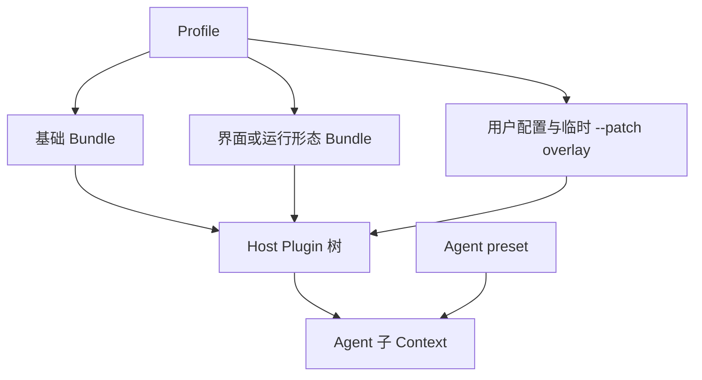

# DeepSeek Harness（dsh）运行时

本文从使用者和集成者视角说明 DeepSeek Harness 的运行方式、组合模型、内置扩展、程序化入口和权限边界。编写、测试和分发 Plugin 的代码路径见 [DeepSeek Harness Plugin 开发](dsh-plugin.md)。

> **来源口径：** 架构与运行时主体按 2026-08-16 的[官方仓库源码状态](https://github.com/deepseek-ai/deepseek-harness/commit/47f943859bef60e4160492346772ded9b24f765a)核对。安装、分发和 systemd 部署部分另按 npm `0.1.1-rc.2`、tag [`dsh-v0.1.1-rc.2`](https://github.com/deepseek-ai/deepseek-harness/tree/b150a551b8d465e31e418e1b2eaf5e79bbb7d28e) 与 2026-08-21 至 2026-08-23 的 Ubuntu 现场实测核对；这一段明确写出日期和版本，是因为 developer preview 的分发面变化快，不能把一次现场结果冒充永久行为。源码与文档链接固定到相应状态；社区项目链接在开发篇固定到各自调研时的仓库状态。

## <a id="product-position"></a>产品定位与来源口径

DeepSeek Harness（`dsh`）是 DeepSeek 开源的 agent harness。它以 Cordis 为 Plugin 运行框架：模型适配、system prompt、工具、agent loop、Session、持久化、沙箱、审批和界面都通过同一棵 Plugin 树组合，因此部署可以替换实现或增加策略，而不必修改一个特权核心。

项目处于 developer preview（开发者预览），会继续发生兼容性破坏；Session 格式也没有跨版本兼容承诺。仓库采用 MIT 许可，官方安装入口是 npm 包 [`@deepseek-ai/dsh`](https://registry.npmjs.org/%40deepseek-ai%2Fdsh)。架构快照时仓库尚无 tag；到 2026-08-22 已发布 `dsh-v0.1.0-rc.7`、`dsh-v0.1.0-rc.8`、`dsh-v0.1.1-rc.1` 和 `dsh-v0.1.1-rc.2` 四个 tag。

> 来源：[DeepSeek Harness 的产品定位、预览状态和许可](https://github.com/deepseek-ai/deepseek-harness/blob/47f943859bef60e4160492346772ded9b24f765a/README.md#L5-L55)；[Cordis Plugin 树与可替换能力](https://github.com/deepseek-ai/deepseek-harness/blob/47f943859bef60e4160492346772ded9b24f765a/docs/architecture.md#L9-L37)。

## <a id="install-and-run"></a>安装与启动

运行要求是 Node.js `^22.19.0 || >=24.0.0`。官方 README 给出的安装版入口是：

```sh
npx @deepseek-ai/dsh web
```

无版本号会跟随 npm `latest`；可复现部署应显式钉版本。**不能把这条 `npx` 命令直接放进长期服务**：多个隔离测试在 95 或 150 秒内仍停留于 npm Arborist 的 peer dependency 求解，一次最终成功的真实运行则耗时约 14 分 50 秒才执行 dsh。它不是已经证明的死循环，但启动时延极高且没有进度反馈；`legacy-peer-deps` 之类绕过求解的办法又会暴露缺失 runtime peer。完整证据见下面的[发布面现场报告](#npm-publish-field-report)。

源码 checkout 需要先安装依赖并构建运行产物：

```sh
pnpm install
pnpm run build
pnpm dsh web
```

### npm 安装与源码构建

安装版从 npm 取得已构建的 CLI；源码模式则以仓库中的 TypeScript 入口启动，但仍依赖预先生成的 Host、Client 和前端产物。源码改变后若没有重新构建，CLI 可能读取旧的浏览器 bundle，因此源码开发应把 `pnpm run build` 看成运行前置，而不是由启动命令自动完成的步骤。

### 分发与运行路径

| 路径 | 2026-08-22 现场结果 | 适用边界 |
|---|---|---|
| `npx @deepseek-ai/dsh@<version> …` | npm 可在 `idealTree/placeDep` 阶段单核计算约 15 分钟后才启动 dsh | 仍是官方 README 的安装版入口；适合人工等待的临时运行，不放进 service |
| `pnpm dlx @deepseek-ai/dsh@<version> …` | Linux 冷 store 47 秒完成，热 store 约 1 秒；Web 返回 HTTP 200，`node-pty` 实际 PTY 通过 | 临时体验或预热后运行；首次启动依赖网络和可写 cache，不是最稳的开机路径 |
| 固定 tag 的源码 checkout + `pnpm install && pnpm run build` | 官方支持的源码路径，使用仓库锁文件和 `allowBuilds` | 当前更适合长期 service；升级前要重建，且 Session 格式无跨版本承诺 |
| `npm install -g @deepseek-ai/dsh@<version>` | 普通全局安装可完成，随后 `dsh web` 已在 Linux 实机运行 | README 未把它列为主入口，但固定可执行路径适合 user service；**不需要 `--allow-scripts`** |
| `pnpm add -g @deepseek-ai/dsh` | 社区报告动态裸 import 在 pnpm 全局链接布局下找不到包 | 不用；`pnpm dlx` 与 `pnpm add -g` 不是同一种布局 |

已有普通 npm 全局安装时，长期服务可以固定该 NVM 版本下的 `dsh` 绝对路径；追求锁文件和源码可审计时，则固定 tag、从源码构建，并让 unit 直接执行构建后的 `apps/cli/lib/bin.js`。两种方式都把 `WorkingDirectory` 留给 Agent 的项目 workspace，不在每次 service 启动时重新解析 package。快速试用可用 `pnpm dlx`，但应先人工预热并确认版本、Web 和终端能力。

### <a id="npm-publish-field-report"></a>npm 发布面现场报告

以下结论来自 Ubuntu 24.04、48 个逻辑 CPU、Node `v24.19.0` / `v26.5.0`、npm `11.17.0`、Arborist `9.8.0` 和隔离的 HOME、cwd、npmrc、cache、`DSH_HOME`。实验只写 `/tmp`，结束后删除测试树；原始日志另存为独立的会话产物。

#### 历史版本、Node 与 cache 对照

隔离矩阵中的 `npx --yes @deepseek-ai/dsh@<version> --version` 最多运行 150 秒，之后先 TERM、5 秒后 KILL。`137` 因而表示实验主动强杀，**不是 OOM**；超时是“完成时间大于观测窗口”的删失数据，不能单凭它写成死循环或不收敛。

| dsh | Node | 结果 | `_npx` 安装树 |
|---|---:|---|---:|
| `0.0.1-rc.1` | 24 | 150 秒内未完成；同时请求到多个未发布 package 的 404 | 0 文件 |
| `0.0.1-rc.5` | 24 | 150 秒内未完成，停留于 `idealTree` | 0 文件 |
| `0.1.0-rc.2` | 24 | 150 秒内未完成，停留于 `idealTree` | 0 文件 |
| `0.1.0-rc.6` | 24 | 150 秒内未完成，停留于 `idealTree` | 0 文件 |
| `0.1.0-rc.7` | 24 | 150 秒内未完成，停留于 `idealTree` | 0 文件 |
| `0.1.0-rc.8` | 24 | 150 秒内未完成，停留于 `idealTree` | 0 文件 |
| `0.1.1-rc.2` | 24 | 150 秒内未完成，停留于 `idealTree` | 0 文件 |
| `0.1.1-rc.2` | 26 | 150 秒内未完成，停留于 `idealTree` | 0 文件 |

Node 24 与 26 下的 npm、npx、Arborist 版本以及 `npm exec` / `can-place-dep.js` / `node.js` 文件哈希完全相同；换 Node 只换 V8，不会换求解算法。完整 Node 26 对照同样在 155 秒后仍未写出安装树。

随后在另一真实用户环境中，Node `22.23.1`、npm `11.18.0`、混合 cache、`@latest → 0.1.1-rc.2` 的同一类命令**最终成功**。内核 start tick 显示 npm 父进程到 dsh 子进程相差 890.19 秒，即 14 分 50.19 秒；`_npx/node_modules` 在启动后约 14 分 39 秒才创建，`.bin/dsh` 和 dsh 子进程又约 13 秒后出现。已有 TCP 活动把开始监听的上界收紧到约 14 分 50～53 秒，dsh 自身启动只占最后几秒。

这两轮环境不能混为一谈：成功现场同时改变了 Node、npm、HOME 和 cache，不能把收敛归因于其中任一变量。冷 cache 已复现极慢；以同一隔离 cache 重跑又得到 `128 cache hit / 0 cache miss`，95 秒后仍停在相同位置且安装树仍为 0 文件。这说明 cache 命中不能保证快速完成，也不能由此证明 cache 对 15 分钟总时延毫无影响。没有损坏证据时不要先清空 `~/.npm`：它会丢掉可复用下载，却不会改变 peer 图本身。

#### 单核热点与依赖图

`ps` 的 `80%–97% CPU` 表示约一个逻辑核，不是 48 核整机满载；当时整机 load average 约 `1.1`。进程处于 `R`，磁盘计数不再前进，内存从约 476 MiB 增到 779 MiB。`silly + timing` 的最后阶段是：

```text
npm timing idealTree:init Completed in 4ms
npm silly idealTree buildDeps
npm silly placeDep ROOT @deepseek-ai/dsh-base@0.1.1-rc.2 ...
```

另一轮 Node 24 隔离进程的 17 秒 Node Inspector CPU profile self samples：

```text
42.72%  URL          node:internal/url
20.47%  getBundler   @npmcli/arborist/lib/node.js
19.31%  SemVer       semver/classes/semver.js
```

热点调用链是 `CanPlaceDep → satisfiedBy → depValid → npm-package-arg.resolve → SemVer/URL`，以及 `canPlacePeers → inBundle → getBundler` 的递归遍历。`0.1.1-rc.2` 源码图量化为 199 个传递内部 package、1472 条内部边，其中 1138 条是 peer dependency；`@deepseek-ai/cordis` 被 192 个内部包引用，图中还存在强连通环。tag `rc.7 → rc.8 → 0.1.1-rc.1 → rc.2` 的 peer 边数为 `1121 → 1130 → 1136 → 1138`，所以这不是最新一个版本突然引入的问题。

这些证据把延迟主体定位到 npm 执行 dsh 之前的 Arborist 依赖树构造阶段，并证明其中大量 CPU 花在 peer 放置、bundle 归属和 package spec/semver 解析上；它们没有单独锁定“哪一条 peer 环”或“哪一次 fixed point”决定了 15 分钟总时延。准确说法是**求解极慢且反馈缺失**，不是已证明永久不收敛。

安装策略对照也没有得到正确 workaround：

| 对照 | 结果 |
|---|---|
| npm 11 默认 | 隔离测试窗口内未完成；另一真实环境约 14 分 50 秒后完成 |
| `install-strategy=nested` / `shallow` | 测试窗口内仍未完成 |
| 隔离 npm 12.0.2 | 测试窗口内仍未完成 |
| `legacy-peer-deps=true` | 约 67 秒装完，但运行时报缺包 |

`legacy-peer-deps` 的失败是：

```text
ERR_MODULE_NOT_FOUND: Cannot find package '@deepseek-ai/cordis-plugin-group'
imported from @deepseek-ai/dsh-app-boot/lib/index.js
```

`dsh-app-boot` 顶层静态 import 该包，却只把它列为 peer；绕过 peer 求解自然不会安装它。官方 Discussions 还报告它只是第一批缺失 runtime package。

#### `allow-scripts` 与安装模式

**安装和运行 dsh 不需要 `--allow-scripts`。** 官方 README 的 `npx` 命令不带它；Linux 上普通全局安装与 `dsh web` 也已经在不手工追加该 option 的路径下工作。全局安装应保持为普通命令：

```sh
npm install --global @deepseek-ai/dsh@<verified-version>
```

`allow-scripts` 是 npm 11 的安装期代码白名单，值应列**真正拥有 lifecycle script 的依赖包**；顶层 `@deepseek-ai/dsh` 没有这些脚本，只允许顶层包不会向依赖传递授权。它不是 dsh 官方安装步骤，也不能把 npm warning 当成“全部批准”的命令。现场全局安装曾提示：

```text
@deepseek-ai/dsh-subprocess-local
koffi
node-pty
@google/genai
protobufjs
```

官方源码的 `pnpm-workspace.yaml` 明确允许 `node-pty`、`koffi`、`dsh-subprocess-local`，明确拒绝不需要的 `@google/genai`、`protobufjs` 和 `node-addon-require-builtin` 脚本。这是**源码仓库自身的 pnpm 供应链策略**，不是要求 npm 安装版用户翻译成 `--allow-scripts`。现场最初把五项全部放行，是错误判断，不能复制进部署 SOP。

另一个容易照抄出错的命令是：

```sh
npm install -g --allow-scripts=<packages>
```

`--allow-scripts` 只是 option，没有提供安装目标；`npm install -g` 因而解释成“把当前目录的 package 全局安装”，会读取 cwd 的 `package.json`。在 `$HOME` 没有该文件时得到 `/home/<user>/package.json ENOENT`。dsh 部署不应使用这条命令，也不应靠手工全放行来修 warning。

现场还看到 npm 11 的**全局安装**在空 `allow-scripts` 下完成，而 npx 的**本地临时安装**在 `legacy-peer-deps` 走到 reify 后自动执行了这些脚本。不同 install mode 的实测行为不同；warning 本身不改变正确的安装命令。若某个 native 能力实际失败，应针对具体 package、平台和预编译产物诊断，不能先 blanket-allow（整批放行）所有脚本。

#### 官方报告与 release gate

官方仓库关闭 Issues / PR，只开 Discussions。到 2026-08-22，相关帖子包括：

- [#176：首次 `npx` 8 分钟无进度](https://github.com/deepseek-ai/deepseek-harness/discussions/176)；
- [#223：Cordis 互相 peer，严格求解 fixed point 不收敛](https://github.com/deepseek-ai/deepseek-harness/discussions/223)；
- [#1032：`cordis-plugin-group` 静态 import 却只声明 peer](https://github.com/deepseek-ai/deepseek-harness/discussions/1032)，以及 macOS [#982](https://github.com/deepseek-ai/deepseek-harness/discussions/982)、Windows [#1030](https://github.com/deepseek-ai/deepseek-harness/discussions/1030) 和早期 [#273](https://github.com/deepseek-ai/deepseek-harness/discussions/273)；
- [#55：`pnpm add -g` 链接布局导致动态加载失败](https://github.com/deepseek-ai/deepseek-harness/discussions/55)。

这些帖子当时没有 DeepSeek maintainer 回复；四个 release note 也没有宣称修复。`rc.7` 的[安装瘦身提交](https://github.com/deepseek-ai/deepseek-harness/commit/93a95e838da235c1c519ee8c6bf8f5ac1778394e)把 79 个 browser-only 声明移走、减少 103 个 tarball 和 6.05 MB，但现场矩阵证明它没有消除 npm peer 求解退化。

官方 packed-install gate 没复现 README 的单包 consumer。它生成的临时项目把**全部** tarball 都列为顶层依赖：

```ts
dependencies: Object.fromEntries(
  [...packed].map(([name, entry]) => [name, entry.url])
)
```

这会预先满足大量 peer，也补齐按名称动态挂载但不在普通代码依赖闭包里的 package；与只安装 `@deepseek-ai/dsh` 的 `npx` 图不同。因此“CI 安装通过”和“真实 npx 卡死/缺包”可以同时成立。

> 来源：[官方安装命令](https://github.com/deepseek-ai/deepseek-harness/blob/b150a551b8d465e31e418e1b2eaf5e79bbb7d28e/README.md#L13-L35)；[`dsh` 聚合包依赖](https://github.com/deepseek-ai/deepseek-harness/blob/b150a551b8d465e31e418e1b2eaf5e79bbb7d28e/apps/cli/package.json#L20-L103)；[`dsh-app-boot` 的 peer 声明](https://github.com/deepseek-ai/deepseek-harness/blob/b150a551b8d465e31e418e1b2eaf5e79bbb7d28e/packages/boot/app-boot/package.json#L31-L61)；[packed-install consumer 的构造](https://github.com/deepseek-ai/deepseek-harness/blob/b150a551b8d465e31e418e1b2eaf5e79bbb7d28e/scripts/release/verify-packed-install.ts#L88-L109)；[源码 `allowBuilds`](https://github.com/deepseek-ai/deepseek-harness/blob/b150a551b8d465e31e418e1b2eaf5e79bbb7d28e/pnpm-workspace.yaml#L34-L55)。

#### pnpm 隔离结果

用与 tag 对应的 pnpm `11.7.0`，在独立 HOME、cwd、store、cache 与 `DSH_HOME` 中执行：

```sh
pnpm dlx @deepseek-ai/dsh@0.1.1-rc.2 --version
```

冷 store 47 秒解析 504 个包、下载 449 个、加入 447 个，退出 0；热 store 再跑约 1.028 秒。随后以同一隔离树启动 `dsh web`，`127.0.0.1:3081` 返回 HTTP 200；直接调用安装树中的 `node-pty` 创建 `/bin/sh` PTY，退出 0 并输出 `PNPM_PTY_OK`。

pnpm 没有 npm Arborist 的单核退化，但报告一项真实 peer 不一致：`react-dom@19.2.8` 要求 `react ^19.2.8`，安装树为 `react 18.3.1`。它还在自己的 dlx cache 中生成 `allowBuilds` 待决项；Linux 所需预编译 `node-pty` / Koffi binary 已随包存在，所以本次版本、Web、PTY smoke 均通过，不能据此保证别的平台无需构建脚本。

结论是 **`pnpm dlx` 可用，不等于 `pnpm add -g` 可用**。长期服务仍以固定源码 tag + build 更可控。

### Web 与 headless

| 运行形态 | 启动方式 | 适用场景 |
|---|---|---|
| Web | `dsh web` 或 `dsh --profile web` | 交互式会话、设置、trajectory 和 Plugin UI；默认监听 `127.0.0.1:3080` |
| headless | `dsh --profile headless "<task>"` | 一次性任务；等待 Agent idle 后输出最后一条 assistant 文本，不启动 HTTP 服务 |

`dsh web` 和 `dsh --profile headless` 都把启动命令所在目录设为 Agent 的默认 workspace。先进入目标项目再启动 dsh，Agent 的相对文件路径和命令便以该项目目录为起点：

```sh
cd /path/to/project
dsh web
```

这里的 workspace 表示 Agent 操作的项目目录。Plugin 的运行实例、配置项和可安装 package 之间的关系见 Plugin 开发篇的 [Plugin、Loader entry 与 package](dsh-plugin.md#plugin-entry-package)。

Web 与 headless 是两个 Profile。两者加载共同的基础 Bundle；Web 继续加入浏览器应用和 HTTP 服务，headless 继续加入一次性 runner，并在 Agent idle 后输出结果。

> 来源：[npm 与源码启动命令](https://github.com/deepseek-ai/deepseek-harness/blob/47f943859bef60e4160492346772ded9b24f765a/README.md#L13-L35)；[Profile、Web alias 与源码运行行为](https://github.com/deepseek-ai/deepseek-harness/blob/47f943859bef60e4160492346772ded9b24f765a/apps/cli/reference/README.md#L7-L84)。

### <a id="systemd-user-service"></a>新设备上的 systemd 用户服务

dsh 的配置、凭据和 Session 都归普通用户 HOME，Web 又不需要 root，因此个人服务器优先使用 **user service**（用户级服务）。它由 `systemd --user` 托管，不需要把 agent 进程交给 root；若要求无人登录也开机启动，则还要启用 linger。

下面先给**固定 npm 全局安装 + 绝对入口**的完整模板；这适合已经完成全局安装的机器。需要锁文件和源码审计时，再换成固定 tag 的源码入口。两条路径都不在 service 启动时运行 npx：网络下载和依赖求解放在部署阶段，service 启动才是确定性的。

#### Node 与 pnpm 的固定版本

NVM 允许多个 Node 版本并存；目录里同时有 `v24`、`v26` 只表示都安装过，不表示 service 应用哪一个。`default` alias 才是新 shell 默认选择：

```sh
export NVM_DIR="$HOME/.nvm"
. "$NVM_DIR/nvm.sh"
nvm alias default
nvm version default
nvm current
node --version
command -v node
```

例如现场主机在 2026-08-22 是：

```text
default -> lts/* -> v24.19.0
nvm version default -> v24.19.0
```

Node 24 当时是 LTS，Node 26 只是另一个已安装版本。unit 中应写**解析后的精确版本目录**，而不是 `lts/*`，否则 alias 日后移动到新 LTS，旧版本下安装的全局包和 service 路径会不同步。

systemd 不会加载 NVM，不是因为 `.bashrc` 缺少 `~/.local/bin`：user manager 直接 `execve()` `ExecStart`，不会启动交互 Bash，也不会 source `~/.bashrc` / `nvm.sh`。NVM 的 Node 在 `~/.nvm/versions/node/<version>/bin`，所以要把精确目录写进 unit。

只有源码路径需要 pnpm。源码 tag 会在[根 `package.json` 的 `packageManager`](https://github.com/deepseek-ai/deepseek-harness/blob/b150a551b8d465e31e418e1b2eaf5e79bbb7d28e/package.json#L1-L10)钉 pnpm 版本，优先匹配它：

```sh
grep '"packageManager"' package.json
pnpm --version
```

Node 发行版若带 Corepack，可用相应 tag 声明的版本，例如：

```sh
corepack prepare pnpm@11.7.0 --activate
```

有些新 Node 发行版不再附 Corepack；这时按 pnpm 官方安装方式取得相同版本，不要静默换另一个 major。

#### 固定版本的 npm 全局安装

全局安装不需要 `--allow-scripts`：

```sh
npm install --global @deepseek-ai/dsh@<verified-version>
command -v dsh
dsh --version
readlink -f "$(command -v dsh)"
```

确认 `dsh` 位于前面选定的 NVM 版本目录，例如 `%h/.nvm/versions/node/v24.19.0/bin/dsh`。在写 unit 前先人工 smoke：

```sh
install -d -m 0755 "$HOME/dsh-workspace"
cd "$HOME/dsh-workspace"
dsh web --no-open --host 127.0.0.1 --port 3080
```

看到 `dsh web: http://127.0.0.1:3080` 并确认 HTTP 200 后，用 `Ctrl+C` 停止手工进程，再交给 systemd；不能让手工进程和 service 同时争用 3080。

#### 固定 tag 的安装与构建

目录只是示例，可按机器布局调整；关键是 tag 与构建产物固定：

```sh
install -d -m 0755 "$HOME/src" "$HOME/dsh-workspace"
git clone https://github.com/deepseek-ai/deepseek-harness.git \
  "$HOME/src/deepseek-harness"
git -C "$HOME/src/deepseek-harness" fetch --tags
git -C "$HOME/src/deepseek-harness" switch --detach <verified-tag>

cd "$HOME/src/deepseek-harness"
pnpm install --frozen-lockfile
pnpm run build
test -f apps/cli/lib/bin.js
```

`pnpm run build` 是必要前置；源码启动不会替你重建前端和 Host/Client 产物。升级 tag 后同样要重新 install/build。

不要把 dsh 源码目录直接设为 service 的 `WorkingDirectory`，否则 Agent 默认 workspace 就会变成 dsh 自己的仓库。构建后的 CLI `apps/cli/lib/bin.js` 是 [package 声明的 `bin` 入口](https://github.com/deepseek-ai/deepseek-harness/blob/b150a551b8d465e31e418e1b2eaf5e79bbb7d28e/apps/cli/package.json#L11-L18)，可以由绝对 Node 路径从另一个 workspace 启动。

#### User manager 与 linger

```sh
loginctl show-user "$USER" -p Linger
sudo loginctl enable-linger "$USER"
loginctl show-user "$USER" -p Linger    # 应为 Linger=yes
```

开启 linger 需要管理员权限。没有 linger 时，user service 只在该用户 login session 存活；最后一个 SSH session 退出或机器重启后无人登录，服务不会持续运行。

**不要在 user unit 里写 `After=network-online.target` / `Wants=network-online.target`。** 这是 system manager 的 target，user manager 看不见，写了不会获得网络顺序保证。dsh Web 本身先监听本地端口，模型网络失败可在请求时暴露；需要启动重试就用 `Restart=always` / `RestartSec=`。systemd 用户服务的一般生命周期与凭据边界归 `software` skill 维护。

#### User unit 模板

先把示例里的 `v24.19.0` 换成前面 `nvm version default` 得到并实际验证过的精确版本：

```ini
[Unit]
Description=DeepSeek Harness Web

[Service]
Type=simple
WorkingDirectory=%h/dsh-workspace
Environment=PATH=%h/.nvm/versions/node/v24.19.0/bin:/usr/local/bin:/usr/bin:/bin
ExecStart=%h/.nvm/versions/node/v24.19.0/bin/dsh web --no-open --host 127.0.0.1 --port 3080
Restart=always
RestartSec=5
StandardOutput=journal
StandardError=journal
SyslogIdentifier=dsh

[Install]
WantedBy=default.target
```

保存为：

```text
~/.config/systemd/user/dsh.service
```

这几项各有独立用途：

| 项 | 为什么需要 |
|---|---|
| 绝对 `dsh` | service 不依赖 NVM shell function，也不在启动时做 package resolution |
| `Environment=PATH=…` | 全局 npm bin 指向的 `lib/bin.js` 首行是 `#!/usr/bin/env node`：绝对 `dsh` 只解决“脚本在哪”，`env` 仍靠 PATH 找 Node；该 PATH 还会被 Plugin、MCP 和子进程继承 |
| `WorkingDirectory` | 它就是 Agent 默认 workspace；必须与 dsh 源码/安装目录分开 |
| `--no-open` | 无头 service 不应尝试打开桌面浏览器 |
| `--host 127.0.0.1` | dsh Web 没有内置认证/TLS，默认只给本机和 SSH tunnel |
| `Restart=always` | clean exit 或失败后都恢复；显式 `systemctl stop` 不会被它反向拉起 |
| `default.target` | user manager 的启用目标；配合 linger 才能无人登录开机启动 |

若选用固定源码 tag，只替换 `ExecStart`，其余 service 语义不变：

```ini
# 固定源码 tag 构建后的入口
ExecStart=%h/.nvm/versions/node/v24.19.0/bin/node %h/src/deepseek-harness/apps/cli/lib/bin.js web --no-open --host 127.0.0.1 --port 3080
```

不把 `pnpm dlx` 直接写进开机 service：它的首次运行会下载数百个包，cache miss 或 registry 故障会变成启动故障。`pnpm dlx` 适合人工试用和对照；不要使用已知有链接布局问题的 `pnpm add -g`。

#### 遥测环境变量

默认 Session telemetry 已是 `DISABLED`，所以模板**不主动**加入：

```ini
Environment=DSH_TELEMETRY_DISABLED=1
```

只有组织策略要求进程级硬关闭、并且明确接受今后不能通过普通配置开启 telemetry 时才加。它不是 dsh 能否启动的条件；擅自加入会把可配置策略变成 unit 强制策略。显式启用 telemetry 时又要注意当前默认没有脱敏规则，详见[遥测数据](#telemetry-data)。

#### 加载、启用与验收

先确认 3080 没有被此前手工启动的 dsh 占用：

```sh
ss -ltnp | grep '127.0.0.1:3080' || true
ps -u "$(id -u)" -o pid=,cmd= | grep '[d]sh web' || true
```

若有手工进程，先让其正常退出；无法回到原终端时，核对 PID 后执行 `kill <pid>`。否则新 unit 会因 `EADDRINUSE` 进入重启循环。然后加载并启动：

```sh
install -d -m 0755 "$HOME/.config/systemd/user"
systemd-analyze --user verify "$HOME/.config/systemd/user/dsh.service"
systemctl --user daemon-reload
systemctl --user enable --now dsh.service
```

不要只看 `enable --now` 的退出码；一个 unit 可以启动后立即重启循环。至少核对：

```sh
systemctl --user show dsh.service \
  -p LoadState -p UnitFileState -p ActiveState -p SubState \
  -p MainPID -p ExecMainStatus -p NRestarts -p FragmentPath
systemctl --user status dsh.service --no-pager --lines=30
ss -ltnp | grep '127.0.0.1:3080'
curl -fsS -o /dev/null -w 'HTTP %{http_code}\n' http://127.0.0.1:3080/
journalctl --user -u dsh.service -n 100 --no-pager
```

预期是 `enabled`、`active/running`、`NRestarts=0`、loopback listener 和 HTTP 200。再做一次 `systemctl --user restart dsh.service`，确认固定入口和 cache 不依赖当前交互 shell。

远端浏览器最安全的普通入口是 SSH tunnel：

```sh
ssh -N -L 3080:127.0.0.1:3080 <host>
```

然后访问本机 `http://127.0.0.1:3080`。要走非 loopback 域名或反向代理，继续看下一节；`--trusted-host` 只做 authority/Origin 检查，不是认证。

#### 升级、回滚和残留状态

升级前先停 unit并备份实际的 DSH home（默认 `~/.dsh`）。npm 全局路径显式安装目标版本：

```sh
systemctl --user stop dsh.service
npm install --global @deepseek-ai/dsh@<new-verified-version>
dsh --version
systemctl --user start dsh.service
```

源码路径则切到明确 tag，重新 `pnpm install --frozen-lockfile && pnpm run build`，再启动并重复验收。developer preview 没有 Session 跨版本迁移承诺；不要让 unversioned `latest` 在重启时自动换版本。

卸载 executable 或 unit 不会自动删除 `~/.dsh`；删除运行时和删除 Session/配置是两项独立操作。回滚时同样显式安装旧版本或切回旧 tag，并在恢复数据前核对该版本的 Session 兼容性。

### <a id="web-trusted-host"></a>Web 域名信任与反向代理

浏览器通过非 loopback 域名访问时，用可重复的 `--trusted-host <host[:port]>` 声明 `/api` 接受的 authority；值只能是规范化的裸主机名或 `host:port`，不能带 scheme、路径或用户信息。请求的 `Host` 必须是 loopback 或命中该清单；浏览器带 `Origin` 时，其 authority 还必须与 `Host` 相同，显式的 cross-site 请求会被拒绝。这个开关只处理 DNS rebinding（DNS 重绑定）与同源检查，不提供身份认证。

```sh
npx @deepseek-ai/dsh web --trusted-host <public-host>
```

`trusted-host` 不放开配置平面：`settings.*`、`credentials.*`、预设编辑、宿主文件选择和模型端点探测仍只接受 loopback，因此远程浏览器不能持久化设置，依赖这些 API 的首次 API Key 引导也可能不出现。dsh Web 当前没有 TLS 或认证层；只需要普通远程 API 时，应在外层限制可达性并使用 `--trusted-host`，密钥与设置留在本机完成。

已经由反向代理完成强认证、又确实需要远程设置 UI 时，可以让代理在鉴权后把上游 `Host` 与 `Origin` 改写成 loopback。这样会绕过 dsh 对配置平面的 loopback 限制，必须保证所有 HTTP 与 WebSocket 路径都先经过认证，且后端端口不能被不受信任的客户端直接访问：

```caddyfile
https://<public-host> {
	authorize with <policy>
	reverse_proxy <private-upstream>:3080 {
		header_up Host 127.0.0.1:3080
		header_up Origin http://127.0.0.1:3080
	}
}
```

> 来源：[Web CLI 的 `--trusted-host` 参数](https://github.com/deepseek-ai/deepseek-harness/blob/47f943859bef60e4160492346772ded9b24f765a/packages/bundle/web-app/src/startup.ts#L43-L79)；[authority、Origin 与 cross-site 检查](https://github.com/deepseek-ai/deepseek-harness/blob/47f943859bef60e4160492346772ded9b24f765a/packages/client/connection/src/api-request-trust.ts#L40-L122)；[始终限定为 loopback 的配置与凭据方法](https://github.com/deepseek-ai/deepseek-harness/blob/47f943859bef60e4160492346772ded9b24f765a/packages/client/connection/src/index.ts#L69-L148)；[远程浏览器的设置限制](https://github.com/deepseek-ai/deepseek-harness/blob/47f943859bef60e4160492346772ded9b24f765a/packages/client/ui-settings/README.md#L17-L20)；[Web server 不提供 TLS 或认证](https://github.com/deepseek-ai/deepseek-harness/blob/47f943859bef60e4160492346772ded9b24f765a/packages/host/webserver/README.md#L19-L22)。

## <a id="runtime-composition"></a>运行时组合

dsh 的组合分成主进程与单个 Agent 两层。Profile 先应用 Bundle、用户配置和命令行 `--patch` overlay（覆盖层：只在本次启动叠加，不会改写 Profile 目录中的配置），组成主进程的 Plugin 树；创建 Agent 时，Agent preset（这个 Session 采用的 Agent 能力配方）再加入 prompt、tools 和策略。



### Cordis Plugin 树

| 对象 | 负责什么 | 存放形式 |
|---|---|---|
| Plugin | 提供服务、事件监听、工具、策略或 UI | TypeScript / JavaScript module |
| Bundle | 分发一层可安装的 Plugin 配置 | 带 `dsh.bundle` manifest 的 package |
| Profile | 选择 Bundle 并保存部署覆盖 | `$DSH_HOME/profiles/<name>` |
| Agent preset | 决定一个 Session 中的 Agent 使用哪些 prompt、tools 与策略 | preset 目录中的 Cordis composition |

#### Plugin、Context 与 Fiber

每个已加载 Plugin 都在一个 Cordis Context 中运行，并由一个 Fiber 管理生命周期。Plugin 通过 Context 注册 service、event listener 或 effect；Fiber 卸载时，这些注册随其一起撤销。运行时因此可以热替换一个实现，也可以在同一扩展点叠加审批、重试、日志或压缩策略。

运行时篇只解释这些对象怎样配合。Plugin 的模块形式、配置、依赖和热更新写法见 [模块、配置与生命周期](dsh-plugin.md#plugin-runtime)。

#### Bundle 与 Profile

Profile 从空根开始按顺序应用配置层：

1. Profile manifest 中列出的各个 Bundle patch；
2. Profile 自己的 `cordis.patch.yml`；
3. Harness home 下的全局 `cordis.patch.yml`；
4. 命令行通过 `--patch` 临时加载的 overlay。

后层按 row id 覆盖前层；`config` 是整项替换，不是深合并。普通 dependency 即使安装成功，也不会成为配置层，只有声明 `dsh.bundle` 的 package 才会被加入 Profile。

```sh
dsh plugin --profile web add <package-or-git-spec>
dsh plugin --profile web remove <package>
dsh --profile web --dump-config
```

#### <a id="agent-preset"></a>Agent preset

Agent preset 是创建 Agent 时选用的一份 Cordis 组合配方，存放为一个包含 `agent.cordis.yml` 的目录；其中的 Plugin rows 决定 Agent 可见的工具、persona、system prompt、压缩策略、workflow 和 Subagent 入口，可选的 `preset.yml` 提供显示名称与说明。Profile 决定整个 dsh Host 进程及共享服务怎样启动；preset 决定选择它的 Agent 看到哪些工具和提示，以及挂载哪些 Agent 侧 Plugin。

官方随附四种 preset：

| preset | 模型获得的工作方式 |
|---|---|
| [`standard`](https://github.com/deepseek-ai/deepseek-harness/blob/47f943859bef60e4160492346772ded9b24f765a/apps/cli/config/agent-presets/standard/agent.cordis.yml#L1-L251) | 完整 coding agent，包括 shell、文件、jobs、plan、todo、Skills、Web、Subagent 与 workflow |
| [`code`](https://github.com/deepseek-ai/deepseek-harness/blob/47f943859bef60e4160492346772ded9b24f765a/apps/cli/config/agent-presets/code/agent.cordis.yml#L1-L6) | 在 standard 上增加 `run_code` 和生成的 TypeScript SDK，由代码组合工具调用 |
| [`minimal`](https://github.com/deepseek-ai/deepseek-harness/blob/47f943859bef60e4160492346772ded9b24f765a/apps/cli/config/agent-presets/minimal/agent.cordis.yml#L1-L6) | 固定 system prompt，只保留 persistent Bash 与 `str_replace_editor` |
| [`cordis（创造模式）`](https://github.com/deepseek-ai/deepseek-harness/blob/47f943859bef60e4160492346772ded9b24f765a/apps/cli/config/agent-presets/cordis/preset.yml#L1-L3) | 在 standard 上增加运行时检查、动态 Plugin 实验和自定义 Agent preset 创作能力 |

Session 创建时加入所选 preset 的组合；空白 Session 可以原子切换到另一 preset，一旦已经产生记录便拒绝切换，避免历史工具调用与当前能力集合不一致。修改默认 preset 或用户 preset 文件只影响之后创建的 Session。用户自建 preset 通常放在 `$DSH_HOME/.agent-presets/<id>/`；修改官方 preset 时应先复制成用户 preset，不直接改随安装提供的目录。

##### <a id="creation-mode"></a>创造模式

`cordis` preset 是 standard coding agent 加上运行时自省、动态 Plugin 和 preset 创作能力。它除了辅助 Plugin 开发，还可以承担以下工作：

| 用途 | 能做什么 | 持久性 |
|---|---|---|
| 运行时检查与排障 | 查看当前加载的 Plugin、可用能力、工具、界面扩展位置和失败状态 | 只读取运行状态，不修改配置 |
| 临时调整 | 在运行中的 DSH 里增加小工具、提示内容、事件处理或局部界面，用于验证想法 | 可以先临时停用并在之后重新启用；删除实验或重启 DSH 后不再保留 |
| Agent 定制 | 复制已有 Agent preset，再调整工具、角色说明、提示内容、压缩策略或子智能体入口，并验证组合能否挂载 | 写入用户 preset，供之后创建的 Session 使用 |
| Plugin 开发 | 先观察 DSH 的实际扩展位置，再快速制作临时原型 | 何时使用、何时不用及如何落成正式 Plugin，见开发篇的[创造模式中的 Plugin 开发](dsh-plugin.md#creation-mode-plugin-development) |

创造模式主要调整当前 Agent 和临时扩展，不负责重写跨 Session 共用的持久化、权限或模型路由。动态 Plugin 会接触真实运行时，安全上应按 shell 权限看待；需要长期维护、测试和发布的功能应落成源码 Plugin。

> 来源：[Plugin 组合、Profile、Bundle 与 Agent 执行](https://github.com/deepseek-ai/deepseek-harness/blob/47f943859bef60e4160492346772ded9b24f765a/docs/architecture.md#L9-L104)；[Agent preset 的组成、挂载、切换与创作](https://github.com/deepseek-ai/deepseek-harness/blob/47f943859bef60e4160492346772ded9b24f765a/packages/preset/agent-presets/README.md#L1-L58)；[用户 preset 目录与信任边界](https://github.com/deepseek-ai/deepseek-harness/blob/47f943859bef60e4160492346772ded9b24f765a/packages/preset/agent-presets/README.md#L94-L145)；[创造模式的定位](https://github.com/deepseek-ai/deepseek-harness/blob/47f943859bef60e4160492346772ded9b24f765a/apps/cli/config/agent-presets/cordis/preset.yml#L1-L3)与 [Host / Agent 分层](https://github.com/deepseek-ai/deepseek-harness/blob/47f943859bef60e4160492346772ded9b24f765a/apps/cli/config/agent-presets/cordis/agent.cordis.yml#L20-L27)；[当前动态 Plugin 工具与版本操作](https://github.com/deepseek-ai/deepseek-harness/blob/47f943859bef60e4160492346772ded9b24f765a/packages/extensions/tool-cordis/src/index.ts#L41-L370)；[停止保留版本](https://github.com/deepseek-ai/deepseek-harness/blob/47f943859bef60e4160492346772ded9b24f765a/packages/extensions/cordis-host-runner/src/index.ts#L455-L490)、[移除整个 Plugin](https://github.com/deepseek-ai/deepseek-harness/blob/47f943859bef60e4160492346772ded9b24f765a/packages/extensions/cordis-host-runner/src/index.ts#L202-L235)与[进程重启后的缺失状态](https://github.com/deepseek-ai/deepseek-harness/blob/47f943859bef60e4160492346772ded9b24f765a/packages/extensions/cordis-host-runner/src/index.ts#L1240-L1250)。

### Agent 执行与会话

#### Turn、step 与 Agent loop

一个 **turn** 是 Agent 从领取输入到没有后续工作为止的一次响应过程；一个 **step** 是其中的一次模型请求及其工具调用。工具结果可能要求再次请求模型，因此一个 turn 可以包含多个 step。

默认 agent loop 负责推进这条流程，Plugin 则在 prompt 组装、模型请求、工具执行和 turn 收尾等扩展点加入策略。审批、重试、超时、压缩和观测不需要写进 loop；它们通过 service 或 event 与 loop 组合。

#### Session 日志与持久化

Session 是只追加的事件日志。模型历史、Trajectory、恢复、分叉、回放和遥测都从同一条记录推导；**model-visible means logged** 表示进入模型请求的信息必须能够从日志重建。

默认 Profile 使用每 Session 一份压缩 JSONL；SQLite backend 可以把多个 Session 集中到一个数据库。两种 backend 共享同一套事件语义，但当前格式仍处于预发布阶段，没有跨版本迁移承诺。

开发需要持久保存的新事件、从日志计算状态或回放历史时，转到 [会话数据 Plugin](dsh-plugin.md#session-data-plugins)。

> 来源：[Agent turn flow 与 Session log](https://github.com/deepseek-ai/deepseek-harness/blob/47f943859bef60e4160492346772ded9b24f765a/docs/architecture.md#L53-L97)；[默认 Profile 的 JSONL backend](https://github.com/deepseek-ai/deepseek-harness/blob/47f943859bef60e4160492346772ded9b24f765a/packages/bundle/base/cordis.patch.yml#L98-L101)；[JSONL 的每 Session 布局与默认压缩](https://github.com/deepseek-ai/deepseek-harness/blob/47f943859bef60e4160492346772ded9b24f765a/packages/session/session-persistence-jsonl/README.md#L5-L13)；[SQLite 的共享数据库布局](https://github.com/deepseek-ai/deepseek-harness/blob/47f943859bef60e4160492346772ded9b24f765a/packages/session/session-persistence-sqlite/README.md#L5-L7)。

## <a id="builtin-extensions"></a>内置扩展

这些能力在实现上仍是 Plugin，但本节只讲部署者和使用者看到的行为。对应 package 的开发模式会在开发篇作为 Tool、Provider 或协议驱动案例出现。

### 模型配置

Web 的 **Settings → Models** 可以配置 DeepSeek、已安装 catalog provider 和自定义兼容端点。Settings 只保存 credential reference；密钥写入 `$DSH_HOME/.credentials.yaml`，页面读回的是脱敏描述而不是明文。

自定义 provider 需要 Provider ID、base URL、API 协议、凭据和模型列表。手工添加的模型默认按 text-only 处理；需要图片输入时，必须在模型或 route metadata 中显式声明，dsh 不会探测端点能力。模型和凭据变化在下一次请求生效，不要求重启服务。

> 来源：[模型与凭据配置指南](https://github.com/deepseek-ai/deepseek-harness/blob/47f943859bef60e4160492346772ded9b24f765a/docs/user/guide/providers.md#L5-L98)。

### Skills

`dsh-skill-filesystem` 从项目级和用户级目录发现 Skills，支持 `<name>/SKILL.md` 目录 bundle 和 `<name>.md` 平铺文件。发现只看根目录下一层，不递归扫描嵌套 Skill 树；项目内容优先于用户内容。

项目可使用 `.dsh/skills` 或通用的 `.agents/skills`。Provider 监听目录条目和 `SKILL.md` frontmatter 的变化；正文与 `references/`、`scripts/`、`assets/` 等资源在真正调用 Skill 时再读取。

> 来源：[文件系统 Skill provider 的目录、格式与监听边界](https://github.com/deepseek-ai/deepseek-harness/blob/47f943859bef60e4160492346772ded9b24f765a/packages/skill/skill-filesystem/README.md#L5-L73)。

### MCP

内置 MCP client 支持 `stdio` 和 `streamable-http`。每个 server 以独立 Plugin 连接并把远端工具注册进 `ctx.tools`，公开名称带 server namespace，避免不同 server 的同名工具冲突。

当前只桥接 **Tools**，不桥接 Resources 或 Prompts。非文本 MCP result 在执行期仍保留结构化值，但进入模型历史时图片、音频和 resource 会变成占位文本，因此不能把 MCP transport 等同于完整多媒体上下文通道。

默认 Profile 不启动任何 MCP server。`stdio` server 是 Host 直接启动的可执行程序，不受 Agent 工具沙箱约束。

> 来源：[MCP transport、工具同步与结果映射](https://github.com/deepseek-ai/deepseek-harness/blob/47f943859bef60e4160492346772ded9b24f765a/packages/mcp/mcp-client/README.md#L5-L114)。

### Subagent

`ctx.subagents` 是可并存多个命名 provider 的能力。模型侧 `subagent` tool 只绑定其中一个 provider；替换 provider 可以改变进程和传输方式，而不改变委派工具的基本调用形状。

| provider | child 形态 | 上下文关系 |
|---|---|---|
| spawn in-process | 当前 dsh 进程中的新 Agent | 继承 cwd、lineage、模型与 Host 服务，不继承父对话 |
| fork in-process | 当前进程中的新 Agent | 以父 Session 已完成的 turns 作为一次性 seed |
| [ACP](https://github.com/deepseek-ai/deepseek-harness/blob/47f943859bef60e4160492346772ded9b24f765a/packages/subagent/subagent-acp/README.md#L5-L21) | 新 subprocess 中的 Agent | 独立 runtime、Session、模型和工具，通过 ACP 驱动 |
| [Codex](https://github.com/deepseek-ai/deepseek-harness/blob/47f943859bef60e4160492346772ded9b24f765a/packages/subagent/subagent-codex/README.md#L5-L28) | 真实 Codex app-server child | 独立产品上下文，parent 主要获得最终结果 |
| [Claude Code](https://github.com/deepseek-ai/deepseek-harness/blob/47f943859bef60e4160492346772ded9b24f765a/packages/subagent/subagent-claude-code/README.md#L5-L23) | 官方 Claude Agent SDK child | 独立产品上下文，认证与配置由 Claude Code 负责 |
| [dsh SDK](https://github.com/deepseek-ai/deepseek-harness/blob/47f943859bef60e4160492346772ded9b24f765a/packages/subagent/subagent-dsh-sdk/README.md#L5-L23) | TypeScript SDK 启动的 dsh runtime | 独立完整 Plugin 树，通过 SDK 协议驱动 |

Provider 可以声明 structured output、persona、tool filter、depth limit 或 continuation 等能力；调用者要求 provider 不支持的能力时应显式失败，而不是静默忽略。

> 来源：[Subagent provider 家族与职责](https://github.com/deepseek-ai/deepseek-harness/blob/47f943859bef60e4160492346772ded9b24f765a/packages/subagent/README.md#L5-L23)；[in-process spawn 与 fork 的上下文差异](https://github.com/deepseek-ai/deepseek-harness/blob/47f943859bef60e4160492346772ded9b24f765a/packages/subagent/subagent-in-process-driver/README.md#L5-L63)。

## <a id="programmatic-access"></a>程序化接入

这些入口驱动的是完整 Harness，而不是直接调用模型 API。外部程序创建或连接 Agent、发送输入、观察 Session event，并负责 runtime subprocess 的配置和生命周期。

### ACP

内置 ACP server 通过 JSON-RPC stdio 提供基础自动化：客户端可以创建 fresh Session、发送文本 prompt、接收已提交的 assistant 文本、处理一次性 permission request 和取消工作。

ACP 不等同 Web UI。它不提供历史 Session 的 list/resume/delete/fork，也不传输 reasoning、tool activity、plans、titles 或 UI presentation；一个连接拥有其创建的全部 Session，并在断开时负责清理。

> 来源：[ACP 的协议范围、生命周期和已知限制](https://github.com/deepseek-ai/deepseek-harness/blob/47f943859bef60e4160492346772ded9b24f765a/packages/acp/acp/README.md#L5-L81)。

### TypeScript 与 Python SDK

| SDK | 客户端接口 | runtime 来源 |
|---|---|---|
| TypeScript | 高层 `DeepSeekHarness.run()`；低层 `HarnessClient` 协议 API | 调用者显式提供 command 与 args |
| Python | 高层 turns API 与低层 JSON-RPC client | 可随 Python distribution 取得匹配的 runtime binary |

两者都通过 stdio JSON-RPC 驱动 subprocess。高层 API 可以把一次调用定义为“消息入队到下一次全 Agent idle”的活动区间，但结果不是严格归因于单个 prompt：steering、注入内容或其他排队输入也可能在该区间内贡献输出。低层 client 则暴露 enqueue receipt、event stream、notification 和显式 teardown。

TypeScript SDK 是纯 client library，不向 Cordis 注册 Plugin；它启动的 child 才是完整 Harness。Python 侧把 SDK 与可分发 runtime 拆成两个 package，方便应用不依赖源码 checkout。

> 来源：[TypeScript SDK 的高低层接口与进程生命周期](https://github.com/deepseek-ai/deepseek-harness/blob/47f943859bef60e4160492346772ded9b24f765a/packages/sdk/client/README.md#L5-L49)；[Python SDK 与 runtime package 的分工](https://github.com/deepseek-ai/deepseek-harness/blob/47f943859bef60e4160492346772ded9b24f765a/python/README.md#L5-L16)。

## <a id="trust-boundaries"></a>信任边界

Host Plugin、Agent 工具、MCP server 和遥测处理的是不同权限主体。工具沙箱不是进程总沙箱，也不能撤销已经授予 Plugin 或安装脚本的 Host 权限。

### Plugin 与安装脚本

#### Host 进程权限

普通第三方 Plugin 在 `dsh` Host 进程中运行，拥有启动该进程的用户权限。它可以注册工具或监听器，也可以直接执行自身代码；tool approval 只约束 Agent 通过工具管线发起的调用。

创造模式通过 `cordis_define` 记录、再由 `cordis_run` 激活的动态 Plugin，其 Host 代码在 VM 中执行。VM 会限制直接使用部分 Node 全局并引导代码调用 Cordis service，但 Host-realm helper 仍可能成为逃逸路径，因此它不是安全边界；应把动态 Plugin 视作临时 Host Plugin，而不是低权限脚本。

#### Git 依赖的构建授权

从 Git 安装 TypeScript Plugin 时，包通常依赖 `prepare` 生成构建产物。pnpm 会要求用户在 Profile 的 `pnpm-workspace.yaml` 中加入 `allowBuilds`；这项授权意味着安装期直接执行 package 代码，发生在 Agent sandbox 之外。

不希望用户授权构建脚本时，应发布已经包含产物的 npm package 或 tarball。具体流程见开发篇的 [打包与安装](dsh-plugin.md#packaging-and-installation)。

> 来源：[Git 安装的构建脚本与授权边界](https://github.com/deepseek-ai/deepseek-harness/blob/47f943859bef60e4160492346772ded9b24f765a/docs/user/develop/basic/publish.md#L153-L178)；[动态 Cordis VM 的全局限制与信任边界](https://github.com/deepseek-ai/deepseek-harness/blob/47f943859bef60e4160492346772ded9b24f765a/packages/extensions/cordis-host-runner/src/sandbox.ts#L1-L15)。

### Agent 工具执行

#### 工具沙箱与审批

默认 `workspace-write` 限制 Bash 和 filesystem mutation 的写入范围；读取、网络访问和进程可见性没有被同样封闭。Sandbox backend 负责执行层隔离，approval service 负责一次工具调用的 allow / ask / deny 决策，两者缺一都不能推导出完整权限模型。

部分平台只能提供有限隔离。没有可用 backend 时，负责强制隔离的执行器应显式失败，而不是悄悄退回无约束执行。

#### MCP 进程权限

`stdio` MCP server 是 Host 启动的独立可执行程序。Agent 看到的是它桥接出的 tool，但 server 本身不在 Agent 工具沙箱里；HTTP MCP server 则把同等信任转移到远端服务和认证 header。默认 Profile 因此不启用任何 MCP server。

> 来源：[CLI 对默认权限和未受限能力的说明](https://github.com/deepseek-ai/deepseek-harness/blob/47f943859bef60e4160492346772ded9b24f765a/apps/cli/reference/README.md#L68-L80)。

### <a id="telemetry-data"></a>遥测数据

Session telemetry 默认是 `DISABLED`，不会因为启动 Web 或运行 Agent 自动上传数据。显式启用时：

- `FULL` 持续把投影后的 Session records 交给 OpenTelemetry backend；
- `FEEDBACK_ONLY` 只在记录反馈时回放并导出相关 Session log 后缀。

Telemetry seam 提供 `session-telemetry/record` waterfall，让部署挂载脱敏规则；官方默认组合没有挂载任何规则。因此上传模式会按捕获值转发 message、tool arguments/results、文件内容和 workspace path 中可能存在的敏感信息。`DSH_TELEMETRY_DISABLED` 是硬关闭，collector 可由 `DSH_TELEMETRY_OTLP_URL` 选择。

> 来源：[默认遥测模式与部署行为](https://github.com/deepseek-ai/deepseek-harness/blob/47f943859bef60e4160492346772ded9b24f765a/apps/cli/reference/README.md#L74-L80)；[脱敏扩展点与默认无规则的边界](https://github.com/deepseek-ai/deepseek-harness/blob/47f943859bef60e4160492346772ded9b24f765a/packages/session/session-telemetry/README.md#L21-L49)。
