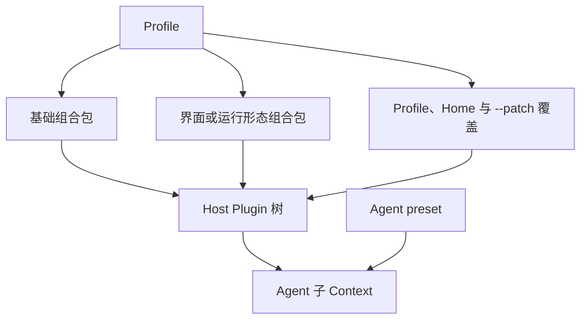

# DeepSeek Harness（dsh）运行时

本文从使用者和集成者视角说明 DeepSeek Harness 的产品定位、安装与运行、插件框架、Agent 执行、内置扩展、程序化入口和权限边界。编写、测试和分发 Plugin 的代码路径见 [DeepSeek Harness Plugin 开发](dsh-plugin.md)。

## <a id="product-position"></a>产品定位

DeepSeek Harness（`dsh`）是 DeepSeek 开源的 agent harness（把模型、工具调用、会话、权限和界面组织成可执行 Agent 的运行壳）。它建立在 Cordis 插件框架上：插件向共享 Context 注册服务、类型化事件和可逆的副作用，模型适配、system prompt、工具、agent loop、Session、持久化、沙箱、审批和界面都通过插件树组合。

项目处于 developer preview（开发者预览），会继续发生兼容性破坏；Session 格式也没有跨版本兼容承诺。仓库采用 MIT 许可，官方安装入口是 npm 包 [`@deepseek-ai/dsh`](https://registry.npmjs.org/%40deepseek-ai%2Fdsh)。

> 来源：[DeepSeek Harness 的产品定位、预览状态、运行入口与许可](https://github.com/deepseek-ai/deepseek-harness/blob/b150a551b8d465e31e418e1b2eaf5e79bbb7d28e/README.md#L5-L57)；[Cordis 插件框架的核心概念](https://github.com/deepseek-ai/deepseek-harness/blob/b150a551b8d465e31e418e1b2eaf5e79bbb7d28e/docs/cordis-primer.zh.md#L1-L13)。

## <a id="install-and-run"></a>安装与运行

运行要求是 Node.js `^22.19.0 || >=24.0.0`。npm 包提供已经构建的 CLI；源码 checkout 需要先生成 Host、Client 和前端产物。没有版本号的包规格会跟随 registry 的 dist-tag，显式的 `<version>` 则固定这次安装或运行所用的发布版本。

### 安装方式

| 安装方式 | 命令 | 依赖解析时机 | 使用场景 |
|---|---|---|---|
| npm 临时运行 | `npx @deepseek-ai/dsh@<version> web` | 尚无可复用的 `_npx` 安装树时 | 官方快速启动入口 |
| pnpm 临时运行 | `pnpm dlx @deepseek-ai/dsh@<version> web` | 尚无对应的 dlx 临时项目时 | 临时验证；当前发布版已通过 Linux Web 与 PTY smoke test |
| npm 全局安装 | `npm install --global @deepseek-ai/dsh@<version>`，随后运行 `dsh web` | 安装或升级阶段 | 需要固定可执行路径的服务 |
| 源码构建 | `pnpm install && pnpm run build`，随后运行 `pnpm dsh web` | checkout 的安装与构建阶段 | 源码开发、锁文件复现或源码审计 |

源码模式以仓库根 `package.json` 的 `packageManager` 字段确定 pnpm 版本。`pnpm run build` 生成 CLI 所需的 Host、Client 和前端产物；`pnpm dsh web` 使用已有产物。

> 来源：[官方 npm 与源码运行方式](https://github.com/deepseek-ai/deepseek-harness/blob/b150a551b8d465e31e418e1b2eaf5e79bbb7d28e/README.md#L13-L37)；[Node 与 pnpm 版本约束](https://github.com/deepseek-ai/deepseek-harness/blob/b150a551b8d465e31e418e1b2eaf5e79bbb7d28e/package.json#L1-L10)；[CLI 的可执行入口](https://github.com/deepseek-ai/deepseek-harness/blob/b150a551b8d465e31e418e1b2eaf5e79bbb7d28e/apps/cli/package.json#L11-L18)。

### npm 首次安装的依赖解析

这里的问题发生在 npm 尚未完成安装树的首次安装阶段。`npx` 成功建立对应的 `_npx` 安装树后，同一 cache 与 package spec 下的后续调用可以复用它；`npm install -g` 也只在安装或升级时解析依赖。下面的实测描述首次安装为何可能长时间没有进度。

| 实测 | 条件 | 结果 |
|---|---|---|
| 隔离 `npx --yes @deepseek-ai/dsh@0.1.1-rc.2 --version` | Node 24、npm 11.17.0、Arborist 9.8.0、独立 HOME 与空 cache | 150 秒观察窗内未完成，停在 `idealTree`，`_npx` 安装树仍为空 |
| 更换 Node 后重复 | Node 26；npm、npx、Arborist 版本及相关文件哈希与上一轮相同 | 155 秒内仍未完成，安装树仍为空 |
| 复用上一轮下载 cache | 128 个 cache hit、0 个 miss | 95 秒内仍停在相同阶段；下载命中没有跳过依赖树构造 |
| 真实用户环境首次运行 | Node 22.23.1、npm 11.18.0、已有混合 cache | 最终成功；npm 父进程启动约 14 分 50 秒后才出现 dsh 子进程，dsh 自身启动只占最后几秒 |

同一套隔离测试还覆盖了从 `0.0.1-rc.1` 到 `0.1.1-rc.2` 的多个版本；除早期版本另有未发布 package 的 404 外，其余版本都在 150 秒观察窗内停留于 `idealTree`。慢解析跨越多个预发布版本，当前 tag 是其中之一。

运行状态把耗时进一步定位到 npm：进程持续占用约一个逻辑核，磁盘计数停止增长，npm timing 最后停在 `idealTree:buildDeps` 与 `placeDep ROOT @deepseek-ai/dsh-base`。一段 Node Inspector CPU profile 中，`URL`、Arborist 的 `getBundler` 和 `SemVer` 占主要 self samples；调用链集中在 `CanPlaceDep → satisfiedBy → depValid` 与 `canPlacePeers → inBundle → getBundler`。

发布版的内部依赖闭包包含 199 个 package、1472 条内部边，其中 1138 条是 peer dependency；`@deepseek-ai/cordis` 被 192 个内部包引用，图中还存在强连通环。实测因此把瓶颈定位为 Arborist 在 CPU 上反复进行 peer placement、bundle 归属与 package spec/semver 判断。它尚未锁定某一条 peer 环或某一次 fixed point 是总耗时的唯一决定因素。

几组对照进一步限定了结论：Node 24 与 26 的相同 npm/Arborist 实现都出现慢解析，单独更换 Node 没有消除现象；只有下载 cache、尚无完整 `_npx` 安装树时，npm 仍会重建 `idealTree`；真实环境最终成功则说明求解可以收敛。因此准确结论是“首次依赖树构造可能极慢且缺少进度反馈”，具体触发条件仍未归因到单一变量。

`legacy-peer-deps` 在约 67 秒内完成安装，却在启动时缺少 `@deepseek-ai/cordis-plugin-group`：`dsh-app-boot` 会静态 import 该包，而 manifest 只把它声明为 peer，跳过 peer 安装便没有补齐运行时依赖。`install-strategy=nested`、`shallow` 与隔离 npm 12 也没有在各自观察窗内完成。作为另一条包管理器路径，`pnpm dlx` 的冷 store 用时约 47 秒、热 store 约 1 秒，并通过 Web 与 PTY smoke test；这项对照验证了 pnpm 路径可用，npm Arborist 的具体触发条件仍由 npm 侧证据界定。

官方 packed-install gate 把所有 workspace tarball 同时列为顶层依赖，预先满足了许多 peer，也补齐了按包名动态加载的 package；普通用户只安装 `@deepseek-ai/dsh` 时解析的是另一张依赖图。packed-install CI 覆盖全 tarball 顶层依赖图，单包 consumer 需要独立验证。

> 来源：[官方安装入口](https://github.com/deepseek-ai/deepseek-harness/blob/b150a551b8d465e31e418e1b2eaf5e79bbb7d28e/README.md#L13-L37)；[`dsh` 聚合包依赖](https://github.com/deepseek-ai/deepseek-harness/blob/b150a551b8d465e31e418e1b2eaf5e79bbb7d28e/apps/cli/package.json#L20-L103)；[`dsh-app-boot` 的 peer 声明](https://github.com/deepseek-ai/deepseek-harness/blob/b150a551b8d465e31e418e1b2eaf5e79bbb7d28e/packages/boot/app-boot/package.json#L31-L61)；[packed-install consumer 的构造](https://github.com/deepseek-ai/deepseek-harness/blob/b150a551b8d465e31e418e1b2eaf5e79bbb7d28e/scripts/release/verify-packed-install.ts#L88-L109)；相关用户报告见 [Discussion #176](https://github.com/deepseek-ai/deepseek-harness/discussions/176)、[#223](https://github.com/deepseek-ai/deepseek-harness/discussions/223) 和 [#1032](https://github.com/deepseek-ai/deepseek-harness/discussions/1032)。

### 安装脚本授权

普通 npm 安装使用官方命令即可；`@deepseek-ai/dsh` 本身不要求用户把一批依赖手工加入 `--allow-scripts`。npm 的该选项是 lifecycle script（安装期脚本）白名单，授权对象应是实际拥有脚本、且部署确实需要执行脚本的依赖。

源码构建使用仓库自己的 pnpm 策略。固定 tag 中的 `pnpm-workspace.yaml` 记录已经审核的 `allowBuilds` 条目，也显式拒绝随依赖带入但不需要执行的脚本；部署直接沿用该文件，避免把 npm warning 翻译成另一套全量授权。

`pnpm dlx` 与 `pnpm add -g` 使用不同的链接布局。上游 [Discussion #55](https://github.com/deepseek-ai/deepseek-harness/discussions/55) 记录了 `pnpm add -g` 的兼容性问题：在 pnpm 的全局链接布局中，dsh 按包名执行的动态 `import` 无法解析相应 package。该问题针对全局安装布局；`pnpm dlx` 使用的是独立临时项目布局。

> 来源：[官方源码的 `allowBuilds`](https://github.com/deepseek-ai/deepseek-harness/blob/b150a551b8d465e31e418e1b2eaf5e79bbb7d28e/pnpm-workspace.yaml#L35-L55)。

### Web 与 headless

| 运行形态 | 启动方式 | 适用场景 |
|---|---|---|
| Web | `dsh web` 或 `dsh --profile web` | 交互式会话、设置、trajectory 和 Plugin UI；默认监听 `127.0.0.1:3080` |
| headless | `dsh --profile headless "<task>"` | 一次性任务；等待 Agent idle 后输出最后一条 assistant 文本，不启动 HTTP 服务 |

`dsh web` 和 `dsh --profile headless` 都把启动命令所在目录设为 Agent 的默认 workspace。先进入目标项目再启动 dsh，Agent 的相对文件路径和命令便以该项目目录为起点：

```sh
cd /path/to/project
dsh web
```

这里的 workspace 表示 Agent 操作的项目目录。Plugin 的运行实例、配置项和可安装 package 之间的关系见 Plugin 开发篇的 [Plugin、Loader entry 与 package](dsh-plugin.md#plugin-entry-package)。

Web 与 headless 是两个 Profile（启动时选用的具名插件组合）。两者加载共同的基础组合包；Web 再加入浏览器应用和 HTTP 服务，headless 再加入一次性 runner，并在 Agent idle 后输出结果。

> 来源：[npm 与源码启动命令](https://github.com/deepseek-ai/deepseek-harness/blob/b150a551b8d465e31e418e1b2eaf5e79bbb7d28e/README.md#L13-L37)；[Profile boot、Web alias 与 headless 行为](https://github.com/deepseek-ai/deepseek-harness/blob/b150a551b8d465e31e418e1b2eaf5e79bbb7d28e/apps/cli/reference/README.zh.md#L7-L32)。

### <a id="systemd-user-service"></a>systemd 用户服务

dsh 的配置、凭据和 Session 都归启动它的普通用户。systemd user service（用户级服务）以同一身份托管 Web 进程；linger 让该用户的 manager 在无人登录时继续运行并参与开机启动。

服务入口可以指向 npm 全局安装的 `dsh`，也可以指向固定源码 checkout 构建出的 `apps/cli/lib/bin.js`。两条路径都在部署阶段完成依赖解析，并把 `WorkingDirectory` 留给 Agent 的项目 workspace。

#### 运行入口与工作目录

NVM 可以同时保存多个 Node 版本。部署时先解析实际使用的 Node 与 dsh 路径，再把绝对路径写入 unit：

```sh
nvm version default
command -v node
command -v dsh
readlink -f "$(command -v dsh)"
```

systemd user manager 直接执行 `ExecStart`，不会加载交互 shell 的 NVM 初始化。npm 全局安装的 `dsh` 使用 `#!/usr/bin/env node`，所以 unit 同时需要固定 `dsh` 的绝对路径，并在 `PATH` 中包含相应 Node 的 `bin` 目录。

源码入口由绝对 Node 路径执行 `<source-checkout>/apps/cli/lib/bin.js`。源码 checkout 按其 `packageManager` 字段选择 pnpm，并在每次切换 tag 后重新安装与构建。Agent 的默认 workspace 来自启动 cwd，因此 `WorkingDirectory` 应指向实际项目目录，与 dsh 的安装或源码目录分开。

> 来源：[Node 与 pnpm 版本约束](https://github.com/deepseek-ai/deepseek-harness/blob/b150a551b8d465e31e418e1b2eaf5e79bbb7d28e/package.json#L1-L10)；[CLI 的 `bin` 入口](https://github.com/deepseek-ai/deepseek-harness/blob/b150a551b8d465e31e418e1b2eaf5e79bbb7d28e/apps/cli/package.json#L11-L18)；[所有运行模式的默认 workspace](https://github.com/deepseek-ai/deepseek-harness/blob/b150a551b8d465e31e418e1b2eaf5e79bbb7d28e/apps/cli/reference/README.zh.md#L81-L85)。

#### 用户管理器与 linger

```sh
loginctl show-user "$USER" -p Linger
sudo loginctl enable-linger "$USER"
loginctl show-user "$USER" -p Linger    # 应为 Linger=yes
```

开启 linger 需要管理员权限。`Linger=yes` 时，user manager 可以在没有登录会话时运行；`Linger=no` 时，其生命周期跟随用户登录。systemd 用户服务的一般生命周期、网络顺序和凭据边界归 `software` skill 维护。

#### 服务配置

先创建 Agent workspace，再把 `<node-bin-dir>` 和 `<dsh-executable>` 换成前面解析出的绝对路径：

```sh
install -d -m 0755 "$HOME/dsh-workspace"
```

```ini
[Unit]
Description=DeepSeek Harness Web

[Service]
WorkingDirectory=%h/dsh-workspace
Environment=PATH=<node-bin-dir>:/usr/local/bin:/usr/bin:/bin
ExecStart=<dsh-executable> web --no-open --host 127.0.0.1 --port 3080
Restart=always
RestartSec=5

[Install]
WantedBy=default.target
```

保存为：

```text
~/.config/systemd/user/dsh.service
```

这几项各有独立用途：

| 配置 | 作用 |
|---|---|
| `PATH` 与绝对 `ExecStart` | 固定 Node 和 dsh 入口，并提供 Plugin、MCP 与子进程继承的命令路径 |
| `WorkingDirectory` | 设置 Agent 默认 workspace |
| `--no-open --host 127.0.0.1` | 以无浏览器、仅回环地址的方式启动 Web |
| `Restart=always` | clean exit 或失败后重新启动；显式 stop 仍会停止服务 |
| `default.target` | 把 unit 挂到 user manager 的启用目标 |

若选用固定源码 tag，只替换 `ExecStart`，其余 service 语义不变：

```ini
ExecStart=<node-executable> <source-checkout>/apps/cli/lib/bin.js web --no-open --host 127.0.0.1 --port 3080
```

`pnpm dlx` 在 service 启动时仍可能下载和解析 package；固定入口把这些工作留在部署阶段。遥测模式及 `DSH_TELEMETRY_DISABLED` 的作用见[遥测数据](#telemetry-data)。

#### 启用与验收

先停止占用同一地址和端口的手工 dsh 进程，再加载并启动 unit：

```sh
install -d -m 0755 "$HOME/.config/systemd/user"
systemd-analyze --user verify "$HOME/.config/systemd/user/dsh.service"
systemctl --user daemon-reload
systemctl --user enable --now dsh.service
```

验收同时覆盖 unit 状态和 Web 响应：

```sh
systemctl --user show dsh.service \
  -p LoadState -p UnitFileState -p ActiveState -p SubState \
  -p MainPID -p ExecMainStatus -p NRestarts -p FragmentPath
curl -fsS -o /dev/null -w 'HTTP %{http_code}\n' http://127.0.0.1:3080/
```

预期是 `enabled`、`active/running`、`NRestarts=0` 和 HTTP 200。失败时用 `systemctl --user status dsh.service` 与 `journalctl --user -u dsh.service` 查看 `EADDRINUSE`、入口路径或依赖加载错误。再执行一次 `systemctl --user restart dsh.service`，确认服务独立于当前交互 shell。

#### 升级、回滚与数据

升级前先停 unit并备份实际的 DSH home（默认 `~/.dsh`）。npm 全局路径显式安装目标版本：

```sh
systemctl --user stop dsh.service
npm install --global @deepseek-ai/dsh@<new-verified-version>
dsh --version
systemctl --user start dsh.service
```

源码路径切到明确 tag，重新执行 `pnpm install --frozen-lockfile && pnpm run build`，再启动并重复验收。显式版本让升级发生在部署操作中；developer preview 的 Session 数据在跨版本恢复前仍需核对兼容性。

卸载 executable 或 unit 会保留 `~/.dsh` 中的 Session、配置和凭据。运行时卸载与数据删除是两个独立操作；回滚同样安装明确的旧版本或切回旧 tag。

### <a id="web-trusted-host"></a>Web 域名信任与反向代理

默认回环监听可以通过 SSH tunnel 交给远端浏览器：

```sh
ssh -N -L 3080:127.0.0.1:3080 <host>
```

浏览器随后访问本机 `http://127.0.0.1:3080`。通过非 loopback 域名访问时，用可重复的 `--trusted-host <host[:port]>` 声明 `/api` 接受的 authority；值是规范化的裸主机名或 `host:port`。请求的 `Host` 需要命中回环地址或该清单，浏览器携带 `Origin` 时还需要与 `Host` 使用相同 authority。

```sh
dsh web --trusted-host <public-host>
```

`trusted-host` 提供 DNS rebinding（DNS 重绑定）与同源校验。TLS 和身份认证由外层部署提供。`settings.*`、`credentials.*`、预设编辑、宿主文件选择和模型端点探测保持 loopback 限制，因此普通远程访问把密钥与持久设置留在服务主机完成。

已经由反向代理完成强认证、又确实需要远程设置 UI 时，可以让代理在鉴权后把上游 `Host` 与 `Origin` 改写成 loopback。这样会绕过 dsh 对配置平面的 loopback 限制，必须保证所有 HTTP 与 WebSocket 路径都先经过认证，且后端端口不能被不受信任的客户端直接访问：

```caddyfile
https://<public-host> {
	authorize with <policy>
	reverse_proxy <private-upstream>:3080 {
		header_up Host 127.0.0.1:3080
		header_up Origin http://127.0.0.1:3080
	}
}
```

> 来源：[Web CLI 的 `--trusted-host` 参数](https://github.com/deepseek-ai/deepseek-harness/blob/b150a551b8d465e31e418e1b2eaf5e79bbb7d28e/packages/bundle/web-app/src/startup.ts#L43-L79)；[authority、Origin 与 cross-site 检查](https://github.com/deepseek-ai/deepseek-harness/blob/b150a551b8d465e31e418e1b2eaf5e79bbb7d28e/packages/client/connection/src/api-request-trust.ts#L40-L122)；[配置与凭据方法的 loopback 边界](https://github.com/deepseek-ai/deepseek-harness/blob/b150a551b8d465e31e418e1b2eaf5e79bbb7d28e/packages/client/connection/src/index.ts#L69-L148)；[Web server 的 TLS 与认证边界](https://github.com/deepseek-ai/deepseek-harness/blob/b150a551b8d465e31e418e1b2eaf5e79bbb7d28e/packages/host/webserver/README.zh.md#L19-L22)。

## <a id="runtime-composition"></a>Cordis 插件框架

Cordis 是 DeepSeek Harness 底层以 vendor 方式引入的插件框架。Plugin（插件）向 Context（共享服务容器）贡献服务、类型化事件和可逆注册；Fiber（生命周期单元）负责插件的加载与卸载。运行中的 dsh 是一棵插件树：Profile 与组合包在启动时组成 Host，Agent preset 再为具体 Agent 加入 prompt、tools 和策略。



### Profile 与组合包

| 对象 | 作用 | 载体 |
|---|---|---|
| Plugin | 提供服务、事件监听、工具、策略或 UI | TypeScript / JavaScript module |
| 组合包（Bundle） | 分发一层可安装的 Plugin 配置 | 带 `dsh.bundle` manifest 的 package |
| Profile | 选择组合包并保存部署覆盖 | `$DSH_HOME/profiles/<name>` |
| Agent preset | 决定一个 Session 中的 Agent 使用哪些 prompt、tools 与策略 | preset 目录中的 Cordis composition |

Profile 从空条目列表开始按顺序应用配置层：

1. Profile manifest 中列出的各个组合包 patch；
2. Profile 自己的 `cordis.patch.yml`；
3. Harness home 下的全局 `cordis.patch.yml`；
4. 命令行通过 `--patch` 临时加载的 overlay。

后层按 row id 覆盖前层；`config` 是整项替换。普通 dependency 只有在 package manifest 声明 `dsh.bundle` 后才会成为 Profile 的配置层。

```sh
dsh plugin --profile web add <package-or-git-spec>
dsh plugin --profile web remove <package>
dsh --profile web --dump-config
```

### Plugin、Context 与 Fiber

每个已加载 Plugin 都在一个 Cordis Context 中运行，并由 Fiber 管理生命周期。Plugin 通过 Context 注册 service、event listener 或 effect；Fiber 卸载时撤销这些注册。热替换实现以及叠加审批、重试、日志或压缩策略都沿用这套生命周期。

运行时篇只解释这些对象怎样配合。Plugin 的模块形式、配置、依赖和热更新写法见 [模块、配置与生命周期](dsh-plugin.md#plugin-runtime)。

> 来源：[Cordis 的插件、Context、依赖、事件与可逆注册](https://github.com/deepseek-ai/deepseek-harness/blob/b150a551b8d465e31e418e1b2eaf5e79bbb7d28e/docs/cordis-primer.zh.md#L5-L13)；[Profile 与组合包的加载顺序](https://github.com/deepseek-ai/deepseek-harness/blob/b150a551b8d465e31e418e1b2eaf5e79bbb7d28e/docs/architecture.zh.md#L15-L37)。

### <a id="agent-preset"></a>Agent preset

Agent preset（智能体预设）是创建 Agent 时选用的一份 Cordis 组合配方，存放为一个包含 `agent.cordis.yml` 的目录；其中的 Plugin rows 决定 Agent 可见的工具、persona、system prompt、压缩策略、workflow 和 Subagent 入口，可选的 `preset.yml` 提供显示名称与说明。Profile 决定整个 dsh Host 进程及共享服务怎样启动；preset 决定选择它的 Agent 看到哪些工具和提示，以及挂载哪些 Agent 侧 Plugin。

官方随附四种 preset：

| ID | 显示名称 | 模型获得的工作方式 |
|---|---|---|
| [`standard`](https://github.com/deepseek-ai/deepseek-harness/blob/b150a551b8d465e31e418e1b2eaf5e79bbb7d28e/apps/cli/config/agent-presets/standard/preset.yml#L1-L3) | 标准模式 | 完整 coding agent，包括文件编辑、Shell、检索、Skills、计划、目标、Subagent 和 workflow |
| [`code`](https://github.com/deepseek-ai/deepseek-harness/blob/b150a551b8d465e31e418e1b2eaf5e79bbb7d28e/apps/cli/config/agent-presets/code/preset.yml#L1-L3) | PTC 模式 | 在标准能力上通过 Code Mode SDK 呈现工具，由 TypeScript 程序组合多步操作 |
| [`minimal`](https://github.com/deepseek-ai/deepseek-harness/blob/b150a551b8d465e31e418e1b2eaf5e79bbb7d28e/apps/cli/config/agent-presets/minimal/preset.yml#L1-L3) | 极简模式 | 固定 system prompt，只提供 persistent Bash 与 `str_replace_editor` |
| [`cordis`](https://github.com/deepseek-ai/deepseek-harness/blob/b150a551b8d465e31e418e1b2eaf5e79bbb7d28e/apps/cli/config/agent-presets/cordis/preset.yml#L1-L3) | 创造模式 | 在标准能力上增加运行时检查、动态 Plugin 实验和自定义 preset 创作能力 |

Session 创建时加入所选 preset 的组合。尚未产生内容的 Session 可以原子切换 preset；已经产生内容的 Session 保持原能力集合，使日志中的工具调用与恢复后的工具定义一致。preset 文件的新版本由之后创建或加入的新 Session 使用。用户自建 preset 通常放在 `$DSH_HOME/.agent-presets/<id>/`，由随附 preset 复制后修改。

#### <a id="creation-mode"></a>创造模式

`cordis` preset 是 standard coding agent 加上运行时自省、动态 Plugin 和 preset 创作能力。它除了辅助 Plugin 开发，还可以承担以下工作：

| 用途 | 能做什么 | 持久性 |
|---|---|---|
| 运行时检查与排障 | 查看当前加载的 Plugin、可用能力、工具、界面扩展位置和失败状态 | 只读取运行状态，不修改配置 |
| 临时调整 | 在运行中的 DSH 里增加小工具、提示内容、事件处理或局部界面，用于验证想法 | 可以先临时停用并在之后重新启用；删除实验或重启 DSH 后不再保留 |
| Agent 定制 | 复制已有 Agent preset，再调整工具、角色说明、提示内容、压缩策略或子智能体入口，并验证组合能否挂载 | 写入用户 preset，供之后创建的 Session 使用 |
| Plugin 开发 | 先观察 DSH 的实际扩展位置，再快速制作临时原型 | 何时使用、何时不用及如何落成正式 Plugin，见开发篇的[创造模式中的 Plugin 开发](dsh-plugin.md#creation-mode-plugin-development) |

创造模式主要调整当前 Agent 和临时扩展。跨 Session 共用的持久化、权限或模型路由由 Host 组合负责。动态 Plugin 会接触真实运行时，安全上按 shell 权限看待；需要长期维护、测试和发布的功能可以落成源码 Plugin。

> 来源：[Agent preset 的组成、挂载与切换](https://github.com/deepseek-ai/deepseek-harness/blob/b150a551b8d465e31e418e1b2eaf5e79bbb7d28e/packages/preset/agent-presets/README.zh.md#L5-L85)；[创造模式的定位](https://github.com/deepseek-ai/deepseek-harness/blob/b150a551b8d465e31e418e1b2eaf5e79bbb7d28e/apps/cli/config/agent-presets/cordis/preset.yml#L1-L3)；[动态 Plugin 的运行、内存生命周期与信任立场](https://github.com/deepseek-ai/deepseek-harness/blob/b150a551b8d465e31e418e1b2eaf5e79bbb7d28e/packages/extensions/cordis-host-runner/README.zh.md#L7-L32)。

## <a id="agent-execution"></a>Agent 执行与会话

### 轮次流程

一个轮次（turn）是 Agent 从领取输入到没有后续工作为止的一次响应过程；一个步骤（step）是其中的一次模型请求及其工具调用。工具结果可能要求再次请求模型，因此一个轮次可以包含多个步骤。

默认智能体循环（agent loop）推进这条流程，Plugin 则在 prompt 组装、模型请求、工具执行和轮次收尾等扩展点加入策略。审批、重试、超时、压缩和观测通过 service 或 event 与循环组合。

### Session 日志与持久化

Session 是只追加的事件日志。模型历史、Trajectory、恢复、分叉、回放和遥测都从同一条记录推导；**model-visible means logged** 表示进入模型请求的信息必须能够从日志重建。

默认 Profile 为每个 Session 保存一份 `.jsonl.zstd` 日志。可选的 SQLite `SessionPersistence` provider 可以把多个 Session 集中到一个数据库，随产品交付的组合当前不启用它。两种 backend 共享同一套逻辑事件语义；预发布存储格式不提供跨 schema 迁移。

开发需要持久保存的新事件、从日志计算状态或回放历史时，转到 [会话数据 Plugin](dsh-plugin.md#session-data-plugins)。

> 来源：[官方轮次流程与会话日志](https://github.com/deepseek-ai/deepseek-harness/blob/b150a551b8d465e31e418e1b2eaf5e79bbb7d28e/docs/architecture.zh.md#L65-L100)；[默认 Profile 的 JSONL provider](https://github.com/deepseek-ai/deepseek-harness/blob/b150a551b8d465e31e418e1b2eaf5e79bbb7d28e/packages/bundle/base/cordis.patch.yml#L98-L101)；[JSONL 的每 Session 布局与默认压缩](https://github.com/deepseek-ai/deepseek-harness/blob/b150a551b8d465e31e418e1b2eaf5e79bbb7d28e/packages/session/session-persistence-jsonl/README.zh.md#L5-L17)；[SQLite provider 的启用边界](https://github.com/deepseek-ai/deepseek-harness/blob/b150a551b8d465e31e418e1b2eaf5e79bbb7d28e/packages/session/session-persistence-sqlite/README.zh.md#L5-L7)。

## <a id="builtin-extensions"></a>内置扩展

这些能力在实现上仍是 Plugin，但本节只讲部署者和使用者看到的行为。对应 package 的开发模式会在开发篇作为 Tool、Provider 或协议驱动案例出现。

### 模型配置

Web 的 **Settings → Models** 可以配置 DeepSeek、已安装 catalog provider 和自定义兼容端点。Settings 只保存 credential reference；密钥写入 `$DSH_HOME/.credentials.yaml`，页面读回的是脱敏描述而不是明文。

自定义 provider 需要 Provider ID、base URL、API 协议、凭据和模型列表。手工添加的模型默认按 text-only 处理；需要图片输入时，必须在模型或 route metadata 中显式声明，dsh 不会探测端点能力。模型和凭据变化在下一次请求生效，不要求重启服务。

> 来源：[模型、凭据、自定义 provider 与图片能力配置](https://github.com/deepseek-ai/deepseek-harness/blob/b150a551b8d465e31e418e1b2eaf5e79bbb7d28e/docs/user/guide/providers.zh.md#L5-L80)。

### Skills

`dsh-skill-filesystem` 按顺序扫描项目的 `.dsh/skills`、项目的 `.agents/skills`、显式自定义目录、`$DSH_HOME/skills`，以及 `$DSH_AGENTS_HOME/skills`（默认 `~/.agents/skills`）。较早的根在同名 Skill 冲突时优先。

Skill 支持 `<name>/SKILL.md` 目录 bundle 和 `<name>.md` 平铺文件；发现深度为一层。Provider 监听目录成员和 `SKILL.md` frontmatter 的变化。每次调用都会重新读取正文，因此正文与 `references/`、`scripts/`、`assets/` 的更新不需要重建目录；这些资源的变化本身也不会改变目录摘要。

> 来源：[Skill 根目录、优先级、格式与加载生命周期](https://github.com/deepseek-ai/deepseek-harness/blob/b150a551b8d465e31e418e1b2eaf5e79bbb7d28e/packages/skill/skill-filesystem/README.zh.md#L29-L67)。

### MCP

内置 MCP client 支持 `stdio` 和 `streamable-http`。每个 server 以独立 Plugin 连接并把远端工具注册进 `ctx.tools`，公开名称带 server namespace，避免不同 server 的同名工具冲突。

当前桥接面是 **Tools**；Resources 与 Prompts 尚无 Harness 消费接口。执行期规范值保留完整 JSON MCP blocks 和可选 `structuredContent`。进入模型历史时，文本与资源链接转成文本；挂载附件存储且调用模型明确声明图片输入能力时，PNG、JPEG、WebP 和 GIF 会成为持久图片块。音频、嵌入资源和不受支持的 block 会变成明确的诊断文本。

默认 Profile 不启动任何 MCP server。`stdio` server 是 Host 直接启动的可执行程序，不受 Agent 工具沙箱约束。

> 来源：[MCP transport、工具命名、结果映射与图片准入](https://github.com/deepseek-ai/deepseek-harness/blob/b150a551b8d465e31e418e1b2eaf5e79bbb7d28e/packages/mcp/mcp-client/README.zh.md#L5-L32)，以及[工具结果与已知边界](https://github.com/deepseek-ai/deepseek-harness/blob/b150a551b8d465e31e418e1b2eaf5e79bbb7d28e/packages/mcp/mcp-client/README.zh.md#L62-L117)。

### Subagent

`ctx.subagents` 允许多个命名 provider 并存。每个面向模型的 Subagent tool row 静态绑定一个 provider；部署可以注册多条具有不同 `toolName` 的工具，把不同进程和传输方式同时提供给 Agent。

| provider | child 形态 | 上下文关系 |
|---|---|---|
| spawn in-process | 当前 dsh 进程中的新 Agent | 继承 cwd、lineage、模型与 Host 服务，不继承父对话 |
| fork in-process | 当前进程中的新 Agent | 以父 Session 已完成的 turns 作为一次性 seed |
| [ACP](https://github.com/deepseek-ai/deepseek-harness/blob/b150a551b8d465e31e418e1b2eaf5e79bbb7d28e/packages/subagent/subagent-acp/README.zh.md#L5-L21) | 新 subprocess 中的 Agent | 独立 runtime、Session、模型和工具，通过 ACP 驱动 |
| [Codex](https://github.com/deepseek-ai/deepseek-harness/blob/b150a551b8d465e31e418e1b2eaf5e79bbb7d28e/packages/subagent/subagent-codex/README.zh.md#L5-L18) | 真实 Codex app-server child | 独立产品上下文，parent 主要获得最终结果 |
| [Claude Code](https://github.com/deepseek-ai/deepseek-harness/blob/b150a551b8d465e31e418e1b2eaf5e79bbb7d28e/packages/subagent/subagent-claude-code/README.zh.md#L5-L18) | 官方 Claude Agent SDK child | 独立产品上下文，认证与配置由 Claude Code 负责 |
| [dsh SDK](https://github.com/deepseek-ai/deepseek-harness/blob/b150a551b8d465e31e418e1b2eaf5e79bbb7d28e/packages/subagent/subagent-dsh-sdk/README.zh.md#L5-L23) | TypeScript SDK 启动的 dsh runtime | 独立完整 Plugin 树，通过 SDK 协议驱动 |

Provider 可以声明 structured output、persona、tool filter、depth limit 或 continuation 等能力；调用者要求 provider 不支持的能力时应显式失败，而不是静默忽略。

Codex 与 Claude Code provider 作为彼此独立的可选 Profile 组合包分发。安装组合包会让 Host 注册休眠 provider；复制 Agent preset 并启用对应 tool row，才会把工具提供给之后创建的 Session。

> 来源：[Subagent provider 家族与可选组合包](https://github.com/deepseek-ai/deepseek-harness/blob/b150a551b8d465e31e418e1b2eaf5e79bbb7d28e/packages/subagent/README.zh.md#L5-L21)；[in-process spawn 与 fork 的上下文差异](https://github.com/deepseek-ai/deepseek-harness/blob/b150a551b8d465e31e418e1b2eaf5e79bbb7d28e/packages/subagent/subagent-in-process-driver/README.zh.md#L5-L63)。

## <a id="programmatic-access"></a>程序化接入

这些入口驱动的是完整 Harness，而不是直接调用模型 API。外部程序创建或连接 Agent、发送输入、观察 Session event，并负责 runtime subprocess 的配置和生命周期。

### ACP

内置 ACP server 通过 JSON-RPC stdio 提供基础自动化：客户端可以创建 fresh Session，发送文本与受支持的光栅图片，接收已提交的 assistant 文本与图片，处理一次性 permission request，并取消工作。图片能力只在挂载持久附件存储、且确切模型 route 声明支持图片输入时公布。

ACP 面向自动化传输。历史 Session 的 list/resume/delete/fork、reasoning、tool activity、plans、titles 和 UI presentation 留在其他界面；一个连接拥有其创建的全部 Session，并在断开时负责清理。

> 来源：[ACP 的协议范围、图片准入、生命周期和已知限制](https://github.com/deepseek-ai/deepseek-harness/blob/b150a551b8d465e31e418e1b2eaf5e79bbb7d28e/packages/acp/acp/README.zh.md#L5-L83)。

### TypeScript 与 Python SDK

| SDK | 客户端接口 | runtime 来源 |
|---|---|---|
| TypeScript | 高层 `DeepSeekHarness.run()`；低层 `HarnessClient` 协议 API | 调用者显式提供 command 与 args |
| Python | 高层 turns API 与低层 JSON-RPC client | 可随 Python distribution 取得匹配的 runtime binary |

两者都通过 stdio JSON-RPC 驱动 subprocess。高层 API 可以把一次调用定义为“消息入队到下一次全 Agent idle”的活动区间，但结果不是严格归因于单个 prompt：steering、注入内容或其他排队输入也可能在该区间内贡献输出。低层 client 则暴露 enqueue receipt、event stream、notification 和显式 teardown。

TypeScript SDK 是纯 client library，不向 Cordis 注册 Plugin；它启动的 child 才是完整 Harness。Python 侧把 SDK 与可分发 runtime 拆成两个 package，方便应用不依赖源码 checkout。

> 来源：[TypeScript SDK 的高低层接口与进程生命周期](https://github.com/deepseek-ai/deepseek-harness/blob/b150a551b8d465e31e418e1b2eaf5e79bbb7d28e/packages/sdk/client/README.zh.md#L5-L49)；[Python SDK 与 runtime package 的分工](https://github.com/deepseek-ai/deepseek-harness/blob/b150a551b8d465e31e418e1b2eaf5e79bbb7d28e/python/README.zh.md#L5-L16)。

## <a id="trust-boundaries"></a>信任边界

Host Plugin、Agent 工具、MCP server 和遥测处理的是不同权限主体。工具沙箱不是进程总沙箱，也不能撤销已经授予 Plugin 或安装脚本的 Host 权限。

### Plugin 与安装脚本

#### Host 进程权限

普通第三方 Plugin 在 `dsh` Host 进程中运行，拥有启动该进程的用户权限。它可以注册工具或监听器，也可以直接执行自身代码；tool approval 只约束 Agent 通过工具管线发起的调用。

创造模式通过 `cordis_define` 记录、再由 `cordis_run` 激活的动态 Plugin，其 Host 代码在 VM 中执行。VM 限制直接使用 Node 全局，并向代码提供 Cordis service façade（受控服务外观）；这些服务仍能触达存活运行时，因此 VM 不构成安全边界。动态 Plugin 按临时 Host Plugin 的权限评估。

#### Git 依赖的构建授权

从 Git 安装 TypeScript Plugin 时，包通常依赖 `prepare` 生成构建产物。pnpm 会要求用户在 Profile 的 `pnpm-workspace.yaml` 中加入 `allowBuilds`；这项授权意味着安装期直接执行 package 代码，发生在 Agent sandbox 之外。

不希望用户授权构建脚本时，应发布已经包含产物的 npm package 或 tarball。具体流程见开发篇的 [打包与安装](dsh-plugin.md#packaging-and-installation)。

> 来源：[Git 安装的构建脚本与授权边界](https://github.com/deepseek-ai/deepseek-harness/blob/b150a551b8d465e31e418e1b2eaf5e79bbb7d28e/docs/user/develop/basic/publish.md#L153-L178)；[动态 Cordis VM 的信任立场](https://github.com/deepseek-ai/deepseek-harness/blob/b150a551b8d465e31e418e1b2eaf5e79bbb7d28e/packages/extensions/cordis-host-runner/README.zh.md#L26-L32)。

### Agent 工具执行

#### 工具沙箱与审批

新 Session 默认使用 `workspace-write`，限制 Bash 和 filesystem mutation 的文件写入范围。该文件策略允许读取与网络访问；进程可见性由 sandbox backend 决定：bwrap 使用私有 PID namespace 隐藏 Host 进程，Landlock 与 Seatbelt 保持 Host 进程可见。Sandbox backend 负责执行层隔离，approval service 负责一次工具调用的 allow / ask / deny 决策。

部分平台只能提供有限隔离。没有可用 backend 时，负责强制隔离的执行器应显式失败，而不是悄悄退回无约束执行。

#### MCP 进程权限

`stdio` MCP server 是 Host 启动的独立可执行程序。Agent 看到的是它桥接出的 tool，但 server 本身不在 Agent 工具沙箱里；HTTP MCP server 则把同等信任转移到远端服务和认证 header。默认 Profile 因此不启用任何 MCP server。

> 来源：[CLI 对默认权限、网络与进程可见性的说明](https://github.com/deepseek-ai/deepseek-harness/blob/b150a551b8d465e31e418e1b2eaf5e79bbb7d28e/apps/cli/reference/README.zh.md#L81-L91)；[sandbox policy 的文件操作边界](https://github.com/deepseek-ai/deepseek-harness/blob/b150a551b8d465e31e418e1b2eaf5e79bbb7d28e/packages/sandbox/sandbox-policy/README.zh.md#L59-L68)。

### <a id="telemetry-data"></a>遥测数据

Session telemetry 默认是 `DISABLED`，启动 Web 或运行 Agent 时数据留在本地。显式启用时：

- `FULL` 持续把投影后的 Session records 交给 OpenTelemetry backend；
- `FEEDBACK_ONLY` 只在记录反馈时回放并导出相关 Session log 后缀。

Telemetry seam 提供 `sessionTelemetry/record` waterfall，让部署挂载脱敏规则；官方默认组合没有挂载任何规则。因此上传模式会按捕获值转发 message、tool arguments/results、文件内容和 workspace path 中可能存在的敏感信息。`DSH_TELEMETRY_MODE` 选择模式，任意非空的 `DSH_TELEMETRY_DISABLED` 都会强制关闭，collector 由 `DSH_TELEMETRY_OTLP_URL` 选择。

> 来源：[默认遥测模式、环境变量与数据边界](https://github.com/deepseek-ai/deepseek-harness/blob/b150a551b8d465e31e418e1b2eaf5e79bbb7d28e/apps/cli/reference/README.zh.md#L89-L91)；[脱敏扩展点与默认无规则的边界](https://github.com/deepseek-ai/deepseek-harness/blob/b150a551b8d465e31e418e1b2eaf5e79bbb7d28e/packages/session/session-telemetry/README.zh.md#L37-L53)。
