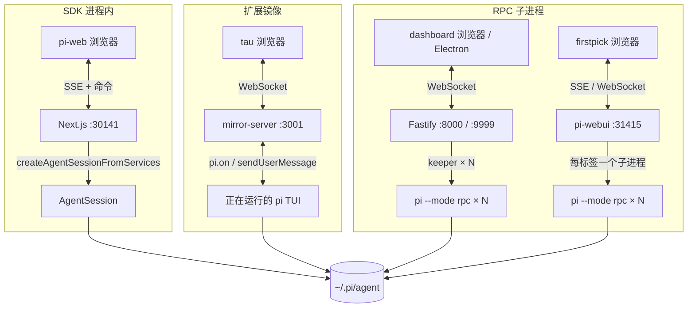

# pi — 极简可扩展编码 agent（harness / runtime 参考）

> **harness skill 的 reference。** 面向要理解/调试/对比编码 agent runtime 的工程师，覆盖：pi 的定位与设计取舍、runtime 架构、
> 配置与指令发现、五种调用形态（TUI / print / JSON / RPC / SDK）、Provider 的 OAuth 与 API key/token 鉴权（切模型 · 上下文 · effort）、
> 扩展与 skill 系统与自研插件、多 agent 协同、手机远控，以及生态与社区。
>
> **来源基线**：全文 runtime 主体为 `earendil-works/pi`（原 `badlogic/pi-mono`）@ `8479bd8`（2026-07-11），npm `@earendil-works/pi-coding-agent` v0.80.6；Provider 鉴权与 `/login` 一节已单独复核到 [v0.84.3](https://github.com/earendil-works/pi/tree/v0.84.3)（`4e58f324`，2026-08-24）；MIT。
> ⚠️ 时效：模型名（`gpt-5.6-*`、`claude-sonnet-5`、`claude-opus-4.8`）、版本号、star 数、画廊包数（~5.1k）都会变；标注"快照"处以你查证当时为准。
>
> **集成状态图例**（全文用）：🟩 Core（主仓内置） · 🟦 官方示例（`examples/`，需自行拷贝） · 🟨 官方实验包（API 不稳定） · 🟧 独立 first-party 仓库 · ⬜ 社区包/项目。

---

## 与别家 harness 的关键不同 · 上手注意

用 pi 前先记住这几个「和别家不一样、最容易踩」的点（每条的源码/文档实锤见对应正文）：

- **指令文件只认 `AGENTS.md` / `CLAUDE.md`，没有 `PI.md`**；从 cwd 向上走到**文件系统根**（非 git 根）逐层拼接。→ 见 [配置与指令发现](#config-discovery)
- **上下文长度不是旗标**，是模型属性 `contextWindow`（可在 `models.json` 覆盖）+ 自动压缩，没有 `--context-window`。→ 见 [Provider 与凭据](#provider-creds)、[接自定义模型](pi-custom-model.md#context-window)
- **自定义 provider 不会把 `GET /v1/models` 自动导入 `/model`**；`models.json` 里必须显式列出每个模型。→ 见 [接自定义模型](pi-custom-model.md#models-fields)
- **`reasoning:true` 只是能力声明，`compat.thinkingFormat` 才决定请求怎么写**；自定义域名常识别不出厂商，漏配就「选 `off` 仍思考 / 选 `low` 仍不思考」。→ 见 [接自定义模型](pi-custom-model.md#thinking-layers)
- **effort 在 UI 里叫 "thinking level"**（`off|minimal|low|medium|high|xhigh|max` 七档），不是统一的 `reasoning_effort`。→ 见 [接自定义模型](pi-custom-model.md#thinking-layers)
- **`/login` 会先让你选择鉴权方式**：**Sign in with an account** 走 OAuth，**Sign in with an API key** 直接使用 key/token，之后 pi 只列出支持该方式的 provider。OAuth 和 API key 描述的是“怎么取得请求凭据”，不是计费类别；两者是否使用不同账单或额度池，要按 provider 分别判断。→ 见 [Provider 与凭据](#provider-creds)、[用 Codex 订阅](#codex-sub)、[用 Copilot 订阅](#copilot-sub)
- **信任（trust）不是沙箱**：只决定加不加载项目级 `.pi/*` 与 `.agents/skills`，不限制工具能干什么；要隔离请上容器。→ 见 [安全 · 信任 · 隔离](#security-trust)
- **核心没有内置 Web UI / MCP / sub-agent / 权限弹窗**——都靠扩展或社区包补（`Mode` 只有 `text|json|rpc`）。→ 见 [Primitives, not features](#primitives)、[调用形态](#invocation-modes)、[Web 界面](#web-ui)

---

## 定位与设计取向

pi 是 Mario Zechner（`badlogic`，libGDX 作者）2025-08 发布、现由 **Earendil** 维护、Armin Ronacher（`mitsuhiko`）共同维护的**终端编码 agent CLI**。
核心极小（LLM ↔ 4 个工具 ↔ 会话树），一切工作流靠 TS 扩展与 skill 补齐。官网 <https://pi.dev>，文档 <https://pi.dev/docs/latest>，RFC/路线图 <https://rfc.earendil.com/keyword/pi/>。

> 身份/安装/模型目录：`earendil-works/pi` README 与 `packages/coding-agent/package.json`、`pi.dev/docs/latest/{providers,usage}`；本地 clone HEAD `8479bd84743e8889f728acb21a62794102db0529`；`packages/coding-agent/README.md`（四内置工具、OpenClaw SDK、footer、`PI_CACHE_RETENTION`）；root `README.md:11,47-49`（治理、RFC）。

### <a id="primitives"></a>"Primitives, not features"

pi 的核心哲学是**中心极小**：给你原语，让你把 agent 适配到工作流，而不是反过来。README 明确列出*故意不做*的东西，每条都给替代方案：

> `packages/coding-agent/README.md` Philosophy 段。

| 故意不内置 | 官方建议替代 |
|---|---|
| **No MCP** | 用带 README 的 CLI 工具（见 Skills），或装扩展补 MCP（见 [MCP 支持](#mcp-adapter)） |
| **No sub-agents** | tmux 起多个 pi 实例，或用扩展/社区包自己实现（见 [多 agent 协同](#multi-agent)） |
| **No permission popups** | 跑容器里，或用扩展自建确认流（如示例 `permission-gate`） |
| **No plan mode** | 计划写进文件，或用扩展（示例 `plan-mode/`） |
| **No built-in to-dos**（"会干扰模型"） | 用扩展（示例 `todo.ts` / 社区 `rpiv-todo`） |
| **No background bash** | 用 tmux，保证完全可观测、可直接介入 |

设计缘由（作者博客）：Claude Code 等系统提示词长达数百行且每版都变、难做精确上下文工程；MCP 往往吃上万 token 且不可组合
（Playwright MCP 13k–18k token vs 等价 bash CLI+README ~225 token）。pi 反其道：**极短系统提示词 + 4 内置工具 + 一切靠 TS 扩展**，
且扩展能被 pi 自己写出来（自扩展闭环）。内置工具默认 `read`/`write`/`edit`/`bash`（源码另导出 `grep`/`find`/`ls`）。

> Mario Zechner, "What if you don't need MCP at all?"（2025-11-02）<https://mariozechner.at/posts/2025-11-02-what-if-you-dont-need-mcp/>；Mario Zechner, "What I learned building an opinionated and minimal coding agent"（2025-11-30）<https://mariozechner.at/posts/2025-11-30-pi-coding-agent/>；`packages/coding-agent/README.md`（四内置工具、OpenClaw SDK、footer、`PI_CACHE_RETENTION`）；root `README.md:11,47-49`（治理、RFC）。

### 定位与对比

常与 **opencode**、**Codex CLI** 并称终端 agent"第一梯队"，是其中少见的非 VC 出身。与 **Claude Code** 的对比是它的起点：

| 维度 | pi | Claude Code | opencode | Codex CLI | Copilot CLI |
|---|---|---|---|---|---|
| 系统提示词 | 极短、稳定 | 数百行、每版变 | 中 | 中 | 中 |
| 扩展性 | TS 扩展 + skill（全 OS 权限） | 插件 + MCP | 插件 + MCP | 较封闭 | 较封闭 |
| MCP | 显式不内置（可扩展补） | 内置 | 内置 | — | — |
| 鉴权入口 | OAuth：Claude/Copilot/Kimi/Codex/OpenRouter/Radius/xAI；API key/token：多家 | Claude 账号 / API key | 多家 | OpenAI 账号 / API key | GitHub 账号 / token |
| 会话模型 | JSONL **树**（可分叉） | 线性 | 线性 | 线性 | 线性 |
| 语言/生态 | TypeScript | — | Go | — | — |

好评点：上下文高效（4 工具+极短提示，实测省约一半上下文）、稳定（不闪不崩、"写得像优秀软件"）、可魔改、能烧现有订阅省钱。
弹点：名字不可 Google、故意砍功能、拒绝 MCP、新贡献者 issue/PR 默认被自动关闭。

> mariozechner.at 博客系列、Armin Ronacher <https://lucumr.pocoo.org/2026/1/31/pi/>、HN <https://news.ycombinator.com/item?id=46844822>、YouTube "Pi Building Pi"。

### 许可与治理

**当下 5 个已发布包全部 MIT**（root `LICENSE` + 各 `packages/*/package.json`）。作者 2026-04 加入 Earendil、仓库迁到 `earendil-works/pi`，
路线图规划为 **MIT 核心 + Fair Source 增值层 + 专有云层**（尚未落地）。长期计划见 RFC 站点。新贡献者的 issue/PR 默认自动关闭、每日集中审。

> root `LICENSE:1` + `packages/{agent,ai,coding-agent,orchestrator,tui}/package.json` 的 `license: MIT`；"I've sold out" <https://mariozechner.at/posts/2026-04-08-ive-sold-out/>；`packages/coding-agent/README.md`（四内置工具、OpenClaw SDK、footer、`PI_CACHE_RETENTION`）；root `README.md:11,47-49`（治理、RFC）。

---

## Runtime 架构

### Monorepo 分包（🟩）

| npm 包 | 目录 | 职责 |
|---|---|---|
| `@earendil-works/pi-coding-agent` | `packages/coding-agent/` | **主 CLI**（`bin: pi`）：TUI/print/json/rpc、会话树、包管理、skill/扩展加载、SDK 出口 |
| `@earendil-works/pi-agent-core` | `packages/agent/` | **agent runtime 库**：agent loop、工具执行、context 变换、transport 抽象、prompt 模板 |
| `@earendil-works/pi-ai` | `packages/ai/` | **统一 LLM API**：内置 / 动态 provider 目录、多种 wire API、OAuth/apiKey 鉴权、模型目录、token/成本核算、thinking level 抽象 |
| `@earendil-works/pi-tui` | `packages/tui/` | **终端 UI 库**：差分渲染、markdown、宽字符布局 |
| `@earendil-works/pi-orchestrator`（🟨） | `packages/orchestrator/` | **多实例进程督程**（实验性，API 不稳定，见 [pi-orchestrator](#pi-orchestrator)） |

### 数据流与 agent loop


**一个 turn**（`packages/agent/src/agent-loop.ts:169-224`）：只要还有工具调用或排队消息 → `streamAssistantResponse` → 从 assistant 消息 filter 出
`toolCall` → `executeToolCalls` → `toolResult` 追加进 context → 触发 `turn_end`，直到无更多工具调用。provider 调用前先跑 `transformContext`/`convertToLlm`
再 `streamFunction(model, llmContext, …)`。

> `packages/agent/src/agent-loop.ts`:169-224、288-314；`harness/agent-harness.ts`:314-385。

### 会话树（🟩）

追加式 **JSONL**，每条 entry 带 `id` + `parentId` 构成**树**，非破坏式分叉：

> `packages/coding-agent/src/core/session-manager.ts`:46-51、861-884、946-980；`docs/session-format.md`。

```ts
// packages/coding-agent/src/core/session-manager.ts:46
export interface SessionEntryBase { type: string; id: string; parentId: string | null; timestamp: string; }
```

- 落盘 `~/.pi/agent/sessions/--<cwd 转义>--/<timestamp>_<uuid>.jsonl`，一行一 JSON；**新会话文件名即刻分配，但直到出现第一条 assistant 消息才落盘**。header 含 version/sessionId/timestamp/cwd/可选 parentSession。
  > `packages/coding-agent/src/core/session-manager.ts`:46-51、861-884、946-980；`docs/session-format.md`。
- 会话目录优先级：`--session-dir` → `PI_CODING_AGENT_SESSION_DIR` → `settings.json.sessionDir`。
  > `packages/coding-agent/src/config.ts`:487-560；`src/core/{settings-manager.ts:131-197,package-manager.ts:172-188}`；`docs/settings.md:12-18,204-210`。
- 斜杠命令：`/new`、`/fork <某条 user 消息>`、`/clone`（当前 leaf 复制）、`/tree`（分支选择器）、`/resume`（选 JSONL 恢复）。
  > `packages/coding-agent/src/core/session-manager.ts`:46-51、861-884、946-980；`docs/session-format.md`。

#### 回读会话做收尾审计

长会话被压缩后，不能只凭当前上下文盘点“做了什么 / 漏了什么”。pi 的 JSONL 本身就是事实源：

- 先在 `~/.pi/agent/sessions/--<cwd>--/*.jsonl` 中按最近修改时间找候选，再用**最近一条用户原文**反查当前文件；不要拿对话里出现的历史 UUID 当当前 session。
- `type:"message"` 里有 `message.role` 与内容块；另有 `model_change`、`thinking_level_change`、`session_info`、`compaction` 等条目。发生分叉时，从当前 leaf 沿 `parentId` 回溯，而不是把文件内所有分支混成一条线。
- 失败的 assistant entry 常见 `content:[]`、`stopReason:"error"`、token usage 为 0，真正异常在 `errorMessage`；“屏幕没字”不等于模型返回空文本。
- `compaction` 摘要是有损材料，只用来导航；仍要逐条核对原始 user message，并以文件/配置/API/Git 实况验证承诺是否落地。
- 导出前先脱敏 `sk-*`、Authorization、内部 URL、预算与账户字段。live store 可能还没写入最后一个进行中的 turn，需用当前上下文补齐。

`chronicle` 当前有 Copilot CLI、Claude Code、Codex CLI adapter，尚无 Pi adapter。在补 adapter 前，可直接按上述 schema 写一个只读 JSONL 提取器；正式接入时应在共享数据层产出 agent-neutral 时间线，不要把 Pi schema 分别复制进 Markdown、HTML 等前端。

### <a id="config-discovery"></a>配置与指令发现

配置根默认 `~/.pi/agent/`（`PI_CODING_AGENT_DIR` 可覆盖）。

> `packages/coding-agent/src/config.ts`:487-560；`src/core/{settings-manager.ts:131-197,package-manager.ts:172-188}`；`docs/settings.md:12-18,204-210`。

```
~/.pi/agent/
  auth.json      凭据（apiKey + OAuth token）
  settings.json  全局设置    models.json 自定义 provider/模型 override    trust.json 信任
  keybindings.json  快捷键覆盖
  sessions/ extensions/ skills/ prompts/ themes/ agents/ npm/ git/ bin/ tools/
  SYSTEM.md  APPEND_SYSTEM.md      系统提示词覆盖/追加
  AGENTS.md | CLAUDE.md            全局指令
<project>/.pi/                     同上项目级子集（需 /trust 信任才加载）
<project 及祖先>/AGENTS.md|CLAUDE.md     项目指令
<project 及祖先>/.agents/skills/         标准 skill 目录
```

三种"向上找"的边界**不同**，务必分清（历史上最易错）：

| 发现对象 | 向上到哪 | 拼接/优先 |
|---|---|---|
| **`AGENTS.md` / `CLAUDE.md` 指令** | **文件系统根**（无 git 感知） | 全局在前，再从根到叶拼接；候选名单只有 AGENTS/CLAUDE 大小写变体，**无 `PI.md`**  |

> `packages/coding-agent/src/core/resource-loader.ts`:67-120、965-990；`docs/usage.md:99-102`；`.agents/skills` 边界 `src/core/package-manager.ts:427-460`。
| **`.agents/skills/`** | **git 仓库根**（无 git 时到 FS 根） | 见 [Skill / prompt / theme](#skill-mechanism) 的 skill 优先级  |

> `packages/coding-agent/src/config.ts`:487-560；`src/core/{settings-manager.ts:131-197,package-manager.ts:172-188}`；`docs/settings.md:12-18,204-210`。
| **`.pi/SYSTEM.md` / `.pi/APPEND_SYSTEM.md`** | 项目级 | 受信任时项目**整体替换**全局同名文件（不叠加）  |

> `packages/coding-agent/src/core/resource-loader.ts`:67-120、965-990；`docs/usage.md:99-102`；`.agents/skills` 边界 `src/core/package-manager.ts:427-460`。

设置优先级：**项目 > 全局**；资源精确顺序 项目 settings → 项目自动发现 → 用户 settings → 用户自动发现 → 包提供（`lower rank = higher precedence`）。项目级资源需 `/trust`。

> `packages/coding-agent/src/config.ts`:487-560；`src/core/{settings-manager.ts:131-197,package-manager.ts:172-188}`；`docs/settings.md:12-18,204-210`。

### 工具执行与 TUI

- **工具执行**：默认**并行**（`Promise.all`，保序），除非全局 `toolExecution:"sequential"` 或某工具声明 `executionMode:"sequential"`。取消经 `AbortSignal` 传到每个 `execute`；bash abort/超时杀整棵进程树。结果**双通道**：`content`（回模型的文本/图像）与 `details`（给 UI/日志的结构化数据）分离。
  > `packages/agent/src/agent-loop.ts`:413-428、491-556；`packages/agent/src/types.ts`:349-361、381-387；`packages/coding-agent/src/core/tools/bash.ts`:82-148。
- **TUI**：线性 append（非全屏接管），维护 `previousLines` 缓冲、diff 只重绘变化行、整段渲染用同步输出 `CSI ?2026h/l` 消闪；组件级缓存。
  > `packages/tui/src/tui.ts`:292-300、1284-1309、1367-1549。

### 平台与安装

- **Node ≥ 22.19.0**（root 与 coding-agent 包 `engines`）。
  > `packages/coding-agent/docs/windows.md`:3-16；`docs/settings.md:184-190`（`shellPath`）；`docs/index.md:15-18`；`package.json`/`packages/coding-agent/package.json` `engines.node ">=22.19.0"`。
- 安装：`curl -fsSL https://pi.dev/install.sh | sh`（Linux/macOS），或 `npm install -g --ignore-scripts @earendil-works/pi-coding-agent`。
  > 身份/安装/模型目录：`earendil-works/pi` README 与 `packages/coding-agent/package.json`、`pi.dev/docs/latest/{providers,usage}`；本地 clone HEAD `8479bd84743e8889f728acb21a62794102db0529`。
- **Windows 需要一个 bash**：查找顺序 = `settings.json` 的 `shellPath` → Git Bash `C:\Program Files\Git\bin\bash.exe` → PATH 上的 `bash.exe`（Cygwin/MSYS2/WSL）。
  > `packages/coding-agent/docs/windows.md`:3-16；`docs/settings.md:184-190`（`shellPath`）；`docs/index.md:15-18`；`package.json`/`packages/coding-agent/package.json` `engines.node ">=22.19.0"`。

---

## <a id="invocation-modes"></a>调用形态

| 形态 | 命令 / API | 传输 | 会话持久化 | 典型用途 | 状态 |
|---|---|---|---|---|---|
| 交互 TUI | `pi` | 终端 | 是 | 人日常用 | 🟩 |
| print | `pi -p "…"`（非 TTY 自动进入） | stdout | 可选 | 脚本 / CI | 🟩 |
| JSON | `pi --mode json -p "…"` | stdout（JSONL 事件） | 可选 | 机器消费 | 🟩 |
| RPC | `pi --mode rpc` | stdin/stdout（JSONL） | 是 | 编辑器/Web/移动端后端 | 🟩 |
| SDK | `createAgentSession()` | 进程内 | 是 | 嵌入你的 Node 程序 | 🟩 |

`Mode` 类型只有 `"text" | "json" | "rpc"`（`--mode`）；`--print`/`-p` 是**正交**的单发开关。**非交互自动化**：stdin **或** stdout 任一非 TTY 会自动进入 print，即使没给 `-p`。官方 README 把它概括为"四种模式"（interactive、print/JSON、RPC、SDK），本文按更细的 5 行拆开。

> `packages/coding-agent/src/cli/args.ts`:10、74-278；`src/main.ts:100-110`（非 TTY 自动 print）；`src/modes/{print-mode.ts,index.ts}`、`src/core/slash-commands.ts:19-42`。

- **交互 TUI**（默认）：`pi` / `pi "初始提示"`；`-c`/`--continue` 续、`--resume` 选、`--fork <id>` 分叉。会话树 + 斜杠命令 + 快捷键（可在 `keybindings.json` 改）。
  > `packages/coding-agent/src/cli/args.ts`:10、74-278；`src/main.ts:100-110`（非 TTY 自动 print）；`src/modes/{print-mode.ts,index.ts}`、`src/core/slash-commands.ts:19-42`；斜杠命令/CLI 旗标/快捷键：`packages/coding-agent/src/core/slash-commands.ts:19-42`；`src/cli/args.ts:74-278`；`docs/keybindings.md:1-153`；`src/core/keybindings.ts:64-207`。
- **print**：`pi -p "prompt"`；`echo x | pi -p`；`pi -p @prompt.md`。跑完打印最终文本即退。
  > `packages/coding-agent/src/cli/args.ts`:10、74-278；`src/main.ts:100-110`（非 TTY 自动 print）；`src/modes/{print-mode.ts,index.ts}`、`src/core/slash-commands.ts:19-42`。
- **JSON**：`pi --mode json -p "…"`，逐事件 JSONL 到 stdout（`agent_start`/`message_update`/`tool_execution_*`/`agent_end`/`agent_settled`…）。
  > `packages/coding-agent/src/cli/args.ts`:10、74-278；`src/main.ts:100-110`（非 TTY 自动 print）；`src/modes/{print-mode.ts,index.ts}`、`src/core/slash-commands.ts:19-42`。
- **RPC**（远控/嵌入关键）：见 [RPC 协议](#rpc)。
- **SDK**（同进程）：见 [SDK 嵌入](#sdk)。

> ⚠️ **print/JSON/RPC 不弹信任提示**。若项目未存过信任决定，项目级 `.pi/*` 资源会被**静默忽略**。自动化里用 `--approve`/`-a`、`--no-approve`/`-na` 或 `settings.json.defaultProjectTrust` 显式表态。

> `packages/coding-agent/src/config.ts`:487-560；`src/core/{settings-manager.ts:131-197,package-manager.ts:172-188}`；`docs/settings.md:12-18,204-210`。

### <a id="rpc"></a>RPC 协议（🟩）

严格 JSONL（一行一 JSON，只以 `\n` 分隔，刻意不用 `readline` 以免被 JSON 串内 U+2028/2029 切断）。命令带 `type`（可选 `id`），响应 `{type:"response", command, success, data?/error?}`，事件即 `AgentSessionEvent`。入口既可 `pi --mode rpc`，也可专用 `rpc-entry`。

> `packages/coding-agent/src/modes/rpc/rpc-types.ts`:20-72；`rpc-mode.ts`、`jsonl.ts`、`src/rpc-entry.ts`；`pi.dev/docs/latest/rpc`。

**全部 31 个命令**（`packages/coding-agent/src/modes/rpc/rpc-types.ts:20-72`）：

> `packages/coding-agent/src/modes/rpc/rpc-types.ts`:20-72；`rpc-mode.ts`、`jsonl.ts`、`src/rpc-entry.ts`；`pi.dev/docs/latest/rpc`。

```
提示/打断: prompt · steer · follow_up · abort · new_session
队列模式:  set_steering_mode · set_follow_up_mode
状态/查询: get_state · get_session_stats · get_tree · get_entries · get_messages
           get_fork_messages · get_last_assistant_text · get_commands
模型:      set_model · cycle_model · get_available_models
effort:    set_thinking_level · cycle_thinking_level
压缩:      compact · set_auto_compaction
重试:      set_auto_retry · abort_retry
bash:      bash · abort_bash
会话:      export_html · switch_session · fork · clone · set_session_name
```

扩展可反向发 UI 请求（`extension_ui_request`：select/confirm/input/editor/notify/setStatus/setWidget/setTitle/set_editor_text），调用方以 `extension_ui_response` 回。
一次最小交换：写 `{"type":"prompt","message":"…"}` → 立即收 `{"type":"response",…,"success":true}` → 随后异步收 `agent_start`…`agent_settled`（`agent_settled` = 可发下一条）。**pocket-pi（⬜ 安卓）就是驱动 `pi --mode rpc`**。

> `packages/coding-agent/src/modes/rpc/rpc-types.ts`:20-72；`rpc-mode.ts`、`jsonl.ts`、`src/rpc-entry.ts`；`pi.dev/docs/latest/rpc`；`badlogic/pi-telegram`（README:68-135 + `index.ts:867-875` 配对、events、`telegram_attach`、旧 scope peerDeps）；`earendil-works/pi-chat`（README:176-197 + `index.ts:683-697`、`src/{runtime,gondolin,secrets.ts:10-45}`）；`packages/coding-agent/docs/termux.md:16-100`；社区 `CelestialCreator/pocket-pi`、`a2ajinkya/phone-pi`。

### <a id="sdk"></a>SDK 嵌入（🟩）

最高层入口 `createAgentSession()`（`packages/coding-agent/src/index.ts:192-219`，re-export 自 `core/sdk.ts`），整个 agent 跑进程内。**OpenClaw 即以 SDK 方式嵌入 pi**（README 明列）。

> `packages/coding-agent/src/index.ts`:192-219（`core/sdk.ts`）；`examples/sdk/{01-minimal,12-full-control,13-session-runtime}.ts`、`examples/sdk/README.md`；`packages/coding-agent/README.md`（四内置工具、OpenClaw SDK、footer、`PI_CACHE_RETENTION`）；root `README.md:11,47-49`（治理、RFC）。

```ts
import { createAgentSession } from "@earendil-works/pi-coding-agent";
const { session } = await createAgentSession();
session.subscribe((e) => {
  if (e.type === "message_update" && e.assistantMessageEvent.type === "text_delta")
    process.stdout.write(e.assistantMessageEvent.delta);
});
await session.prompt("What files are in the current directory?");
session.dispose();
```

多会话（new/fork/resume）用 `createAgentSessionRuntime()`；要完全掌控鉴权/模型/资源用 `createAgentSessionServices` + 传 `authStorage`/`modelRegistry`/`resourceLoader`/`sessionManager`/`settingsManager`。SDK 示例 `examples/sdk/01-minimal.ts`…`13-session-runtime.ts` 覆盖自定义模型/提示/skill/工具/扩展/上下文文件/鉴权/设置/会话/完全控制。

> `packages/coding-agent/src/index.ts`:192-219（`core/sdk.ts`）；`examples/sdk/{01-minimal,12-full-control,13-session-runtime}.ts`、`examples/sdk/README.md`。

> **核心无 Web 传输**：没有内置 HTTP server。"Web" 靠 ① `/share` → `pi.dev/session/#<id>` 渲染 HTML；② `--mode rpc` 让外部 Web 后端驱动；③ 社区前端（pi-web / tau / dashboard / firstpick，**见 [Web 界面](#web-ui)**）。

> `packages/coding-agent/src/cli/args.ts`:10、74-278；`src/main.ts:100-110`（非 TTY 自动 print）；`src/modes/{print-mode.ts,index.ts}`、`src/core/slash-commands.ts:19-42`；`badlogic/pi-telegram`（README:68-135 + `index.ts:867-875` 配对、events、`telegram_attach`、旧 scope peerDeps）；`earendil-works/pi-chat`（README:176-197 + `index.ts:683-697`、`src/{runtime,gondolin,secrets.ts:10-45}`）；`packages/coding-agent/docs/termux.md:16-100`；社区 `CelestialCreator/pocket-pi`、`a2ajinkya/phone-pi`。

---

## Provider 鉴权方式

### <a id="provider-creds"></a>Provider 与凭据

`pi-ai` 的 `Provider` 可以同时暴露 `auth.oauth` 和 `auth.apiKey`。不带 provider 参数执行 `/login` 时，pi 先让人选 **Sign in with an account**（OAuth）或 **Sign in with an API key**，再只列出实现了该鉴权方法的 provider。这两个选项只区分凭据的获取和传递方式；它们是否落到不同的订阅额度、credits 或 API 账单，由 provider 的账号体系决定。

v0.84.3 选择 OAuth 后会列出下列 provider：

| Provider | OAuth 登录 | API key / token 登录 | 计费 / 额度关系 |
|---|---|---|---|
| [Anthropic (`anthropic`)](https://github.com/earendil-works/pi/blob/v0.84.3/packages/ai/src/providers/anthropic.ts#L43-L58) | Claude Pro/Max 账号；`isSubscription: true` | `ANTHROPIC_API_KEY` | 分开：OAuth 使用 Claude 账号的 Extra Usage，key 使用 Anthropic API 账单 |
| [GitHub Copilot (`github-copilot`)](https://github.com/earendil-works/pi/blob/v0.84.3/packages/ai/src/providers/github-copilot.ts#L9-L17) | GitHub 设备码登录，再换 Copilot token；`isSubscription: true` | `COPILOT_GITHUB_TOKEN` 原样作为 bearer；还需使用[匹配账号的端点](auth.md#copilot-endpoints) | 同一套 Copilot 订阅权益；差别在 token 的获取和存储 |
| [Kimi For Coding (`kimi-coding`)](https://github.com/earendil-works/pi/blob/v0.84.3/packages/ai/src/providers/kimi-coding.ts#L8-L22) | Kimi Code 设备码登录；`isSubscription: true` | `KIMI_API_KEY` | 不能只看凭据类型判断：Coding 分发 key 也可使用 Coding plan / booster 额度，以 [`/usages` 返回](kimi.md#usages) 为准 |
| [OpenAI Codex (`openai-codex`)](https://github.com/earendil-works/pi/blob/v0.84.3/packages/ai/src/providers/openai-codex.ts#L8-L20) | ChatGPT Plus/Pro；`isSubscription: true` | 该 provider 不支持；OpenAI API key 走 `openai` provider | 使用 ChatGPT 账号的 Codex 权益 |
| [OpenRouter (`openrouter`)](https://github.com/earendil-works/pi/blob/v0.84.3/packages/ai/src/providers/openrouter.ts#L8-L21) | PKCE 登录后铸造用户可控的 API key | `OPENROUTER_API_KEY` | 都从 OpenRouter credits 扣费；OAuth 只是代你生成 key |
| [Radius (`radius`)](https://github.com/earendil-works/pi/blob/v0.84.3/packages/ai/src/providers/radius.ts#L20-L33) | `pi-messages` gateway OAuth | `RADIUS_API_KEY` | 由具体 gateway 定义 |
| [xAI (`xai`)](https://github.com/earendil-works/pi/blob/v0.84.3/packages/ai/src/providers/xai.ts#L7-L22) | SuperGrok / X Premium 账号；`isSubscription: true` | `XAI_API_KEY` | 分开：OAuth 使用 Grok 账号的周额度 / Extra Usage Credits，key 使用 xAI API 账单 |

`isSubscription: true` 只是 pi 给 OAuth 凭据加的运行时标记，用于识别 Anthropic、GitHub Copilot、Kimi For Coding、OpenAI Codex 和 xAI 的账号权益；它不能代替 provider 的计费规则，也不能用来推断 API key 落到哪个额度池。

> Anthropic 的 Extra Usage 说明、OpenRouter 铸造 key 的行为见 [v0.84.3 provider 文档](https://github.com/earendil-works/pi/blob/v0.84.3/packages/coding-agent/docs/providers.md#L28-L49)；xAI 明确说明 Grok 与 API [共用账号但分开计费](https://docs.x.ai/console/faq/accounts)；Kimi Coding key 的额度语义见同 skill 的 [Kimi Code reference](kimi.md#usages)。

> [v0.84.3 的 provider 文档](https://github.com/earendil-works/pi/blob/v0.84.3/packages/coding-agent/docs/providers.md#L14-L49) 在 Subscriptions 列表中漏了 Kimi For Coding；同版本的 `kimi-coding.ts` 已注册 `oauth` 且设置 `isSubscription: true`，而 [`/login` 列表是直接从 `provider.auth.oauth` 生成的](https://github.com/earendil-works/pi/blob/v0.84.3/packages/coding-agent/src/modes/interactive/interactive-mode.ts#L5391-L5425)；故本表以同 tag 源码和实际 UI 为准。

在 OAuth provider 列表里，状态描述的是“这个 provider 当前有什么凭据”：`unconfigured` 表示尚无有效凭据，`stored` 表示已存 OAuth 凭据，`API key configured` 表示当前使用 API key，但该 provider 另外支持 OAuth。每个 provider 在 `auth.json` 中只有一个带类型的凭据；重新选另一种方法登录会替换它。

> 状态的类型不匹配分支见 [OAuth selector](https://github.com/earendil-works/pi/blob/v0.84.3/packages/coding-agent/src/modes/interactive/components/oauth-selector.ts#L164-L180)；OAuth / API key 两种鉴权方式的选择见 [login auth-type selector](https://github.com/earendil-works/pi/blob/v0.84.3/packages/coding-agent/src/modes/interactive/interactive-mode.ts#L5480-L5554)。

凭据/设置三文件（`~/.pi/agent/`）：`auth.json`（凭据）、`settings.json`（默认 provider/model、thinking、compaction…）、`models.json`（自定义 provider / 模型 override，如本地 ollama、改 `contextWindow`）。

> [Provider 凭据文档](https://github.com/earendil-works/pi/blob/v0.84.3/packages/coding-agent/docs/providers.md#L94-L185)；[provider 与凭据存储接口](https://github.com/earendil-works/pi/blob/v0.84.3/packages/ai/src/models.ts#L99-L201)。

**鉴权解析顺序**（先命中先用）：① `--api-key` 运行期覆盖 → ② `auth.json` 的单个已存凭据（`api_key` 或 `oauth`）→ ③ 环境变量 → ④ `models.json`/扩展注册的 provider key。**已存凭据会盖过环境变量**；OAuth 刷新失败也不会静默回退到 env key。

> [Provider 凭据解析](https://github.com/earendil-works/pi/blob/v0.84.3/packages/ai/src/auth/resolve.ts#L45-L112)；[CLI / 文件配置的顺序](https://github.com/earendil-works/pi/blob/v0.84.3/packages/coding-agent/docs/providers.md#L310-L317)。

**`pi-ai` 内部**：统一 `openai-completions`/`mistral-conversations`/`openai-responses`/`azure-openai-responses`/`openai-codex-responses`/`anthropic-messages`/`bedrock-converse-stream`/`google-generative-ai`/`google-vertex`/`pi-messages` 这些 wire API；流式工具参数用 `partial-json` 容错解析；全链路 abort（`stopReason:"aborted"`）；**跨 provider 上下文接力**（保留 thinking 块/工具调用/结果，可中途换家）；token/成本核算。

> [wire API 类型](https://github.com/earendil-works/pi/blob/v0.84.3/packages/ai/src/types.ts#L15-L31)；`partial-json` / abort / 跨 provider 序列化的其余引用仍按全文 v0.80.6 基线。

### <a id="codex-sub"></a>用 OpenAI Codex 官方订阅（ChatGPT Plus/Pro）

pi 跑**自己**的 OAuth（不复用官方 Codex CLI 的 `~/.codex/auth.json`）：`pi` → `/login` → 选 **"ChatGPT Plus/Pro (Codex)"**。两种方式：

> `packages/ai/src/utils/oauth/openai-codex.ts`:455-463、536-603；`providers/openai-codex.ts`、`providers/openai-codex.models.ts`。

- **browser（PKCE）**：起本地回调 `localhost:1455`，浏览器完成 openai 登录；**也可直接粘贴授权码或整个 redirect URL**（与回调竞速，先到先用）——所以**在别处有浏览器时，headless 机器同样能用这条路**。
- **device_code**：给 user code + `https://auth.openai.com/codex/device`，pi 轮询。

token 换取后写入 `auth.json`（含 JWT 提取的 `accountId`），base URL 走 `chatgpt.com/backend-api`。用：`pi --model openai-codex/gpt-5.5` 或 `/model`。
可用模型（快照）：`gpt-5.4`/`gpt-5.4-mini`/`gpt-5.5`（272K）、`gpt-5.6-luna`/`sol`/`terra`（372K）、`gpt-5.3-codex-spark`（128K）。

> `packages/ai/src/utils/oauth/openai-codex.ts`:455-463、536-603；`providers/openai-codex.ts`、`providers/openai-codex.models.ts`。

### <a id="copilot-sub"></a>用 GitHub Copilot 订阅

`/login` → **"GitHub Copilot"**：

> `packages/ai/src/utils/oauth/github-copilot.ts`:251-280；`providers/github-copilot.ts:13-17`；`packages/ai/src/auth/helpers.ts:16-21`；`providers/github-copilot.models.ts`。

1. 可填 GitHub Enterprise 域名（留空即 github.com）。
2. **device code**：POST `github.com/login/device/code`（Copilot 的 VSCode client_id，scope `read:user`），拿 user_code + `github.com/login/device`，轮询换 GitHub token。
3. 用 GitHub token 向 `api.github.com/copilot_internal/v2/token` 换**短时 Copilot token**（带 VSCode 版本头），并自动对需策略确认的模型 POST `{state:"enabled"}`。
4. base URL 从 token 的 `proxy-ep` 动态解析（如 `api.individual.githubcopilot.com`），过期用存下的 GitHub token 刷新。
5. 用：`pi --model github-copilot/gpt-5.5` 或 `/model`。若报 "model not supported"，去 VS Code 的 Copilot Chat 模型选择器 Enable。

**headless**：`COPILOT_GITHUB_TOKEN` 被原样作为 bearer，不经过 OAuth 处理器的 token 交换；不能仅凭 `gho_` 前缀判断是否可直连。API key 路径的固定 individual 默认主机可能与账号不符，需同时核对[账号端点](auth.md#copilot-endpoints)。OAuth 登录会把账号可用模型 ID 存入 `availableModelIds`，但这不等于实时纠正打包目录中的协议映射。

> `packages/ai/src/utils/oauth/github-copilot.ts`:251-280；`providers/github-copilot.ts:13-17`；`packages/ai/src/auth/helpers.ts:16-21`；`providers/github-copilot.models.ts`。

### 自定义 provider

切模型（`Ctrl+L` / `--model` / scoped 循环集）、选上下文长度与压缩、effort 七档 thinking level 的设置与三层机制、以及把任意 OpenAI/Anthropic 兼容端点接进 pi（`models.json` 配置 + 端点真伪探针 + USTC 实测快照）——都整理进专门文档：[**pi-custom-model.md**](pi-custom-model.md)。

---

## 扩展 / skill / 插件系统

### 扩展（🟩，dev 面向 TS）

一个扩展 = **默认导出工厂函数**的 TS/JS 模块，参数 `ExtensionAPI`；由 **`jiti`** 运行期转译加载（无需预编译）。核心依赖注入方式**随构建不同**：编译成 Bun 单文件时用 `virtualModules`，Node/开发时用指向 `node_modules` 的 alias。

> `packages/coding-agent/src/core/extensions/loader.ts`:389-395（Bun `virtualModules` vs Node alias）、141-145（`clearExtensionCache`）。

```ts
import type { ExtensionAPI } from "@earendil-works/pi-coding-agent";
export default function (pi: ExtensionAPI) { /* 注册工具/命令/事件… */ }
```

**`ExtensionAPI` 全部方法**（`packages/coding-agent/src/core/extensions/types.ts:1165-1398`）：

> `packages/coding-agent/src/core/extensions/types.ts`:435-499、1165-1398（`ExtensionAPI`/`defineTool`/`ToolDefinition`）。

```
on                              订阅生命周期事件（见 5.3）
registerTool / registerCommand / registerShortcut / registerFlag / getFlag
registerMessageRenderer / registerEntryRenderer          自定义 TUI 渲染
sendMessage / sendUserMessage / appendEntry              注入消息/条目
setSessionName / getSessionName / setLabel               会话元数据
exec                                                     跑子进程
getActiveTools / getAllTools / setActiveTools / getCommands   工具/命令自省与开关
setModel / getThinkingLevel / setThinkingLevel           改模型/effort
registerProvider / unregisterProvider                    动态注册 provider
events                                                   跨扩展事件总线
```

工具用 `defineTool()`（**仅类型推断辅助**）声明、`pi.registerTool()` 注册。`ToolDefinition` 字段：`name`/`label`/`description`/`promptSnippet`/`promptGuidelines`/`parameters`(TypeBox)/`executionMode`/`renderShell`/`prepareArguments`/`execute(toolCallId, params, signal, onUpdate, ctx)`/`renderCall`/`renderResult`。

> `packages/coding-agent/src/core/extensions/types.ts`:435-499、1165-1398（`ExtensionAPI`/`defineTool`/`ToolDefinition`）。

最小工具扩展（仓库自带 `hello.ts`）：

> `packages/coding-agent/examples/extensions/hello.ts`；`examples/extensions/README.md:17-138`（分类目录：Lifecycle&Safety / Custom Tools / Commands&UI / Git / … 含 permission-gate、todo、dynamic-tools、plan-mode、git-checkpoint、custom-provider-gitlab-duo）。

```ts
import { Type } from "@earendil-works/pi-ai";
import { defineTool, type ExtensionAPI } from "@earendil-works/pi-coding-agent";
const helloTool = defineTool({
  name: "hello", label: "Hello", description: "A simple greeting tool",
  parameters: Type.Object({ name: Type.String({ description: "Name to greet" }) }),
  async execute(_id, params) {
    return { content: [{ type: "text", text: `Hello, ${params.name}!` }], details: { greeted: params.name } };
  },
});
export default function (pi: ExtensionAPI) { pi.registerTool(helloTool); }
```

### 生命周期事件（通知 vs 可拦截/改写）

`types.ts` 恰好导出 **33** 个事件；其中 **15** 个具有决策/取消/改写/替换/处理语义（其余为通知）：

> `packages/coding-agent/src/core/extensions/types.ts`:505-541、661-675、829-833、1049-1112、1170-1211（33 事件、结果契约）；`docs/extensions.md`。

| 事件 | 时机 | 能力 |
|---|---|---|
| `project_trust` | 进入新 cwd、加载项目资源前 | 决定/推迟项目信任 |
| `resources_discover` | `session_start` 后 | 注入 `{skillPaths,promptPaths,themePaths}` |
| `session_before_switch` / `_fork` / `_compact` / `_tree` | 对应操作前 | 取消或替换该操作 |
| `input` | 收到用户输入、命令检查后、skill/模板展开前 | `transform` 改写，或 `handled` 直接短路 agent |
| `before_agent_start` | agent loop 启动前 | 注入消息 + 替换系统提示词（链式） |
| `context` | 每次 LLM 调用前（拿 messages 深拷贝） | 过滤/重写发给 LLM 的消息数组 |
| `before_provider_headers` / `before_provider_request` | 发 HTTP 前 | 改 header / 替换 payload |
| `message_end` | 消息定稿 | 替换定稿消息（须保持 role） |
| `tool_call` | 工具执行前（`input` 可变） | **阻断**（`{block:true,reason}`）或就地改参数 |
| `tool_result` | 工具执行后（中间件链） | patch 结果 `{content?,details?,isError?}` |
| `user_bash` | 用户 `!cmd` | 重定向/替换用户 bash |

其余 18 个通知类：`session_start`/`session_info_changed`/`session_compact`/`session_tree`/`session_shutdown`/`after_provider_response`/`agent_start`/`agent_end`/`agent_settled`/`turn_start`/`turn_end`/`message_start`/`message_update`/`tool_execution_start`/`_update`/`_end`/`model_select`/`thinking_level_select`。这些钩子就是 pi"用扩展补齐一切"（权限、上下文注入、审计、MCP 适配、子 agent）的技术底座。

> `packages/coding-agent/src/core/extensions/types.ts`:505-541、661-675、829-833、1049-1112、1170-1211（33 事件、结果契约）；`docs/extensions.md`。

### <a id="skill-mechanism"></a>Skill / prompt / theme（🟩 机制）

四类资产各司其职：

> `packages/coding-agent/docs/{extensions.md,packages.md}`、`pi.dev/docs/latest/{extensions,packages}`。

| 资产 | 形式 | 何时用 | 执行 |
|---|---|---|---|
| **Skill** | `SKILL.md` + 可选脚本/引用 | 可复用任务工作流（带 setup、脚本、参考文档） | agent 按需 `read` 正文、`bash` 跑脚本 |
| **Extension** | TS 模块 | 钩 runtime（拦工具/注入上下文/自定义工具·UI·权限/集成） | jiti 加载，全 OS 权限 |
| **Prompt 模板** | `.md`（可带 frontmatter） | `/name` 触发的可复用提示 | 纯文本替换 |
| **Theme** | `.json`（51 个色值 token） | 改配色 | 启动加载，保存即热重载 |

**Skill = Agent Skills 标准**（<https://agentskills.io/specification>），与 Claude Code / Codex CLI / Amp 跨兼容。

> `packages/coding-agent/src/core/skills.ts`:295-306、410-424；`docs/skills.md:24-62`；`CHANGELOG.md:4306`（移除 `{baseDir}`）；`src/core/agent-session.ts:1273`；`src/core/{package-manager.ts:172-183,resource-loader.ts:416-418}`；`badlogic/pi-skills` README + `*/SKILL.md`；`agentskills.io/specification`。

- frontmatter：`name`（**可选**，缺省回退父目录名；非法名只告警仍加载）、`description`（**硬必需**，缺失/空则整个 skill 不加载）、可选 `license`/`compatibility`/`metadata`/`allowed-tools`/`disable-model-invocation`。
- **渐进式披露**：启动只把各 skill 的 `<name>/<description>/<location>` 注入系统提示词的 `<available_skills>`；正文与引用文件由 agent 需要时 `read` 加载。
- ⚠️ **`{baseDir}` 占位符已移除**（CHANGELOG 记录），skill 应写**相对路径**；`/skill:` 显式展开时 pi 会追加一句"References are relative to `<绝对目录>`"的文本提示。`badlogic/pi-skills` 的 README 仍写着旧的 `{baseDir}` 用法（**陈旧，别照抄**）。
  > `packages/coding-agent/src/core/skills.ts`:295-306、410-424；`docs/skills.md:24-62`；`CHANGELOG.md:4306`（移除 `{baseDir}`）；`src/core/agent-session.ts:1273`；`src/core/{package-manager.ts:172-183,resource-loader.ts:416-418}`；`badlogic/pi-skills` README + `*/SKILL.md`；`agentskills.io/specification`。
- **发现与冲突（首次命中者胜）**：优先级 项目 settings > 项目自动发现（`.pi/skills/`）> 用户 settings > 用户自动发现（`~/.pi/agent/skills/`、`~/.agents/skills/`）> 包提供；`-e` 临时资源前插；**`--skill <path>` 追加在最后（同名冲突会输）**。含 `SKILL.md` 的目录即 skill 根并停止下探；尊重 `.gitignore`。
  > `packages/coding-agent/src/core/skills.ts`:295-306、410-424；`docs/skills.md:24-62`；`CHANGELOG.md:4306`（移除 `{baseDir}`）；`src/core/agent-session.ts:1273`；`src/core/{package-manager.ts:172-183,resource-loader.ts:416-418}`；`badlogic/pi-skills` README + `*/SKILL.md`；`agentskills.io/specification`。
- **跨 harness 复用**：直接把 `settings.json` 的 `skills` 数组指向 `~/.claude/skills`、`~/.codex/skills` 即可复用 Claude Code / Codex 的 skill 库。
  > `packages/coding-agent/src/core/skills.ts`:295-306、410-424；`docs/skills.md:24-62`；`CHANGELOG.md:4306`（移除 `{baseDir}`）；`src/core/agent-session.ts:1273`；`src/core/{package-manager.ts:172-183,resource-loader.ts:416-418}`；`badlogic/pi-skills` README + `*/SKILL.md`；`agentskills.io/specification`。

**prompt 模板**：文件名即 `/命令`；frontmatter `description`/`argument-hint` 可选；替换支持 `$1`/`$2`/`$@`/`$ARGUMENTS`/`${1:-default}`/`${@:N}`/`${@:N:L}`。**theme**：JSON（`name`+可选 `vars`+必需 `colors`，51 个 token，可选 `thinkingMax`），改动约 100ms 自动热重载。

> `packages/coding-agent/docs/prompt-templates.md:7-74`、`packages/agent/src/harness/prompt-templates.ts:249-267`；`docs/themes.md:3-238`、`src/modes/interactive/theme/theme.ts:31-95,886-956`。

`badlogic/pi-skills`（🟧，~2159★）：brave-search、browser-tools（CDP 浏览器自动化）、gccli/gdcli/gmcli（Google 日历/云盘/Gmail）、transcribe（Groq Whisper）、vscode（diff）、youtube-transcript。

> `packages/coding-agent/src/core/skills.ts`:295-306、410-424；`docs/skills.md:24-62`；`CHANGELOG.md:4306`（移除 `{baseDir}`）；`src/core/agent-session.ts:1273`；`src/core/{package-manager.ts:172-183,resource-loader.ts:416-418}`；`badlogic/pi-skills` README + `*/SKILL.md`；`agentskills.io/specification`。

### 插件发布与分发

- **渠道：npm，打 `pi-package` keyword**（无专属 scope）；官方画廊 <https://pi.dev/packages>（快照约 5.1k 包，按**月**下载排序）。
  > `packages/coding-agent/docs/packages.md`:55-172；`src/package-manager-cli.ts:77-289`；`src/core/package-manager.ts:48-53,614-619,1435-1446`；`pi.dev/packages`（快照）。
- **安装**：`pi install <source> [-l|--local] [--approve|-a | --no-approve|-na]`，`source` = `npm:@foo/bar[@ver]` / `git:host/user/repo[@ref]` / `https://…` / 本地路径。`-l` 装到项目 `.pi/`。**本地路径是"引用"不是拷贝**。另有**全局旗标** `pi -e/--extension <path>`（本次临时加载一个扩展，也是 `pi update` 的选项）——它**不是** `pi install` 的子旗标，也没有 `-e/--exact`。版本钉住写在 source 里（`npm:@x@1.2.3` 钉住、跳过 `pi update`；git `@ref` 钉住）。
  > `packages/coding-agent/docs/packages.md`:55-172；`src/package-manager-cli.ts:77-289`；`src/core/package-manager.ts:48-53,614-619,1435-1446`；`pi.dev/packages`（快照）。
- **包清单**：`package.json` 加 `"keywords":["pi-package"]` 与可选 `"pi": { extensions, skills, prompts, themes, video, image }`；无 `pi` 字段则按约定自动发现——`extensions/` 收 **`.ts` 与 `.js`**，`skills/` **递归找 `SKILL.md` 且加载顶层 `.md`**，`prompts/*.md`，`themes/*.json`。核心依赖放 `peerDependencies`（**四个 pi 包 + `typebox`**，由 pi 提供），第三方依赖放 `dependencies`（装包时 `npm install --omit=dev`）。画廊预览靠 `pi.video`/`pi.image`。
  > `packages/coding-agent/docs/packages.md`:55-172；`src/package-manager-cli.ts:77-289`；`src/core/package-manager.ts:48-53,614-619,1435-1446`；`pi.dev/packages`（快照）。
- **管理**：`pi list` / `pi update [--all]` / `pi remove` / `pi config`（TUI 开关资源，`-l` 项目级）。
- **⚠️ `pi remove` 卸不干净（三层残留，实测 2026-07）**：`remove`/`uninstall` 只做“除名”——把包从 `~/.pi/agent/settings.json` 的 `packages[]` 划掉、并从 `~/.pi/agent/npm/package.json` deps 移除后跑 npm 卸包。它**不碰**下面三处，需手动清（删文件一律 `trash-put` 不用 `rm`）：
  1. **扩展自建的运行时目录**：扩展在自己代码里 `mkdir` 的数据目录（如 `~/.pi/<扩展名>/`，含 config/logs/runtime/会话映射）不在卸载器认知内——它只认 settings 登记的包，扩展跑起来自己造的目录一概不管。
  2. **npm 空壳目录**：npm 卸包后，空的 scope 文件夹（`~/.pi/agent/npm/node_modules/@scope/`）及被它带进来、无人再引用的传递依赖（如某扩展拉的 `@agentclientprotocol/sdk`）常留下空目录不回收。
  3. **卸载前就在跑的 pi 进程仍持有该扩展**（最隐蔽、现场实证）：扩展经 **jiti 加载进进程堆内存**，`pi remove` 只改磁盘配置、影响**将来**的启动，**杀不掉已在跑的进程里的扩展**。那个旧 pi（尤其挂在某 `pts/*` 的长期交互会话）只要还活着，就会**持续重建**你刚删掉的运行时目录（表现为“删了又长出来")。判据：`ls -la ~/.pi/<扩展名>` 的 mtime 是“你删除之后”的时间；`ps -eo pid,lstart,args | grep pi` 找出**启动时刻早于你 `pi remove` 时刻**的 pi 进程即元凶。真正清除顺序：先结束这些旧 pi 进程（`kill <PID>`，交互会话须先征得用户同意），再 `trash-put` 该目录，然后等几秒复查未重生。卸载后才启动的 pi 不加载该扩展、不会重建。

### <a id="popular-plugins"></a>生态热门插件（快照，会变）

| 包 | ~月下载 | 作用 | 装 |
|---|---|---|---|
| `@hypabolic/pi-hypa` | ~198K | 上下文压缩（确定性压缩 shell 输出、上下文感知文件工具） | `pi install npm:@hypabolic/pi-hypa` |
| `pi-web-access` | ~136K | 网络搜索（Brave/Tavily/Perplexity/Exa/OpenAI）+ URL/PDF/YouTube/GitHub 抓取 | `pi install npm:pi-web-access` |
| `pi-mcp-adapter` | ~124K | 接入 MCP server（见 [MCP 支持](#mcp-adapter)） | `pi install npm:pi-mcp-adapter` |
| `context-mode` | ~117K | MCP + FTS5 知识库 + 沙箱执行，号称省 ~98% 上下文 | `pi install npm:context-mode` |
| `pi-subagents` | ~111K | 子 agent 委派（见 [社区包](#orchestration-community)） | `pi install npm:pi-subagents` |
| `@tintinweb/pi-subagents` | ~40K | Claude Code 风子 agent + FleetView（见 [社区包](#orchestration-community)） | `pi install npm:@tintinweb/pi-subagents` |
| `bigpowers` | ~35K | 73 个工程方法学 skill 包 | `pi install npm:bigpowers` |
| `@ayulab/pi-rewind` | ~32K | `/rewind` 检查点回溯 | `pi install npm:@ayulab/pi-rewind` |
| `@plannotator/pi-extension` | ~30K | 交互式计划评审 / PR 评审 | `pi install npm:@plannotator/pi-extension` |
| `pi-lens` | ~30K | 实时代码反馈（LSP/biome/ruff/类型检查/ast-grep） | `pi install npm:pi-lens` |
| `@juicesharp/rpiv-todo` | ~28K | 存活于 `/reload` 与压缩的 todo 覆盖层 | `pi install npm:@juicesharp/rpiv-todo` |
| `@remnic/plugin-pi` | ~27K | 持久记忆 | `pi install npm:@remnic/plugin-pi` |
| `@gotgenes/pi-permission-system` | ~24K | 工具访问控制 / 权限策略 | `pi install npm:@gotgenes/pi-permission-system` |
| `pi-simplify` | ~23K | 改动后清晰度/可维护性复审 | `pi install npm:pi-simplify` |
| `@ff-labs/pi-fff` | ~22K | FFF 模糊文件/内容搜索 | `pi install npm:@ff-labs/pi-fff` |
| `@quintinshaw/pi-dynamic-workflows` | ~22K | Code-mode 大规模 fan-out + `/deep-research`（见 [社区包](#orchestration-community)） | `pi install npm:@quintinshaw/pi-dynamic-workflows` |
| `pi-hermes-memory` | ~15K | 持久记忆 + 会话搜索 + 密钥扫描 | `pi install npm:pi-hermes-memory` |
| `cc-safety-net` | ~9K | 拦截破坏性 git/文件系统命令 | `pi install npm:cc-safety-net` |

下载量为 `pi.dev/packages` 快照（月），会变；名字/排名仅供参考。

> `packages/coding-agent/docs/packages.md`:55-172；`src/package-manager-cli.ts:77-289`；`src/core/package-manager.ts:48-53,614-619,1435-1446`；`pi.dev/packages`（快照）。

### 开发闭环

```
写：~/.pi/agent/extensions/x.ts（或项目 .pi/extensions/x.ts）——自动发现
试：pi -e ./x.ts            # 全局旗标临时加载；不写 settings，但同会话内 /reload 仍会重载它
装：pi install ./pkg        # 全局；pi install -l ./pkg 装到项目
热重载：/reload             # 重载全部扩展/skill/prompt/theme，触发 session_shutdown(reason:"reload")→session_start→resources_discover
发：package.json 打 pi-package keyword → npm publish
```
无 `pi init` 脚手架（手动建包）。主题文件保存即热重载（无需 `/reload`）。

> `packages/coding-agent/docs/{extensions.md,packages.md}`、`pi.dev/docs/latest/{extensions,packages}`。

### <a id="mcp-adapter"></a>MCP 支持（⬜ 靠适配器补）

核心刻意不内置 MCP。社区 `pi-mcp-adapter`（⬜）以扩展形式把 MCP server 接进来：默认暴露一个 `mcp` 代理工具（search/describe/call，参数走 JSON 串），或用 `directTools` 把选定 MCP 工具注册成 pi 原生工具。装：`pi install npm:pi-mcp-adapter` 后重启。

> `packages/coding-agent/docs/usage.md:303-307`（核心无 MCP）；`nicobailon/pi-mcp-adapter` README + `index.ts:254-363`。

### <a id="security-trust"></a>安全 · 信任 · 隔离

- **Project Trust 只是资源加载门**：决定是否加载项目级 `.pi/settings.json`、`.pi/{extensions,skills,prompts,themes}`、`.pi/SYSTEM.md`/`APPEND_SYSTEM.md`、项目 `.agents/skills`、以及缺失的项目包。**它不是沙箱**，不限制模型让工具做什么；内置工具以 pi 进程权限读写文件、跑 shell。
  > `packages/coding-agent/docs/security.md`:5-37（信任门 + "not a sandbox"）。
- **要真隔离用容器**，官方给三种模式：**Gondolin**（本地 Linux 微 VM，host 跑 pi、内置工具路由进 VM）、**Plain Docker**（整个 pi 进程进容器）、**OpenShell**（带文件/进程/网络/凭据/推理管控的策略沙箱）。[pi-chat](#pi-chat) 用的就是 Gondolin（模式一）。
  > `packages/coding-agent/docs/containerization.md`:9-82（Gondolin / Plain Docker / OpenShell）。

---

## <a id="multi-agent"></a>多 agent 协同

pi 无内置 sub-agent；生态四条路径，共同不变量：**除非显式 fork，子 agent 都拿全新空上下文**。

> README Philosophy（No sub-agents / No background bash）；`docs/tmux.md`（仅按键编码）。

### <a id="pi-orchestrator"></a>`@earendil-works/pi-orchestrator`（🟨 实验性）

一个**进程督程**（非 LLM 级编排）：`orchestrator serve` 起 Unix socket（`~/.pi/orchestrator/orchestrator.sock`），`spawn`/`list`/`status`/`stop`/`rpc`/`rpc-stream` 管理一池 `pi --mode rpc` 子进程，把外部 CLI 桥接到它们的 JSONL RPC，可选向 `radius.pi.dev` 注册云端在线态。**只管进程生命周期与 IPC 中继**，不做任务路由/父 agent。README 明标 API 不稳定。

> `packages/orchestrator/{README.md,src/cli.ts,src/rpc-process.ts,src/types.ts,src/ipc/protocol.ts}`。

### 官方 subagent 示例扩展（🟦）

`examples/extensions/subagent/`：把每个子 agent 做成一个 `pi --mode json -p --no-session` 子进程（全新上下文），父读子进程的 `message_end`/`tool_result_end` 事件实时汇报、abort 经 SIGTERM 传递。三模式：single / parallel（≤8 任务、并发 4）/ chain（顺序，前一步文本填 `{previous}`）。
agent 用 `.md` frontmatter 定义（`name`/`description`/`tools`/`model`+正文）。发现层**只有**用户级 `~/.pi/agent/agents/*.md` 与最近的项目 `.pi/agents/*.md`；**随仓库附带的 scout/planner/reviewer/worker 是"示例"，需自行拷贝/软链才生效**（默认 user-only，项目级要 `agentScope:"both"|"project"`，属信任边界）。附 `/implement`、`/scout-and-plan`、`/implement-and-review` 预设。

> `packages/coding-agent/examples/extensions/subagent/{index.ts,agents.ts:97-115,agents/*.md,README.md:55-65}`。

### <a id="pi-flow"></a>`@kky42/pi-flow`（异构后端子 agent，⬜ 社区 · 实测 2026-07 跑通）

**唯一把子 agent 派给异构外部 CLI**（而非只 pi-to-pi）的 ⬜ 包:`backend` 可选 `pi`（默认,进程内子会话）/ `codex`（spawn `codex exec --json …[resume]`）/ `claude`（`claude -p --output-format stream-json …[--resume]`）——一个协调 pi 能把不同 lane 派给不同 harness+模型。**无 `copilot` 后端**,补一个走 `copilot --acp` 的后端是自然缺口（ACP 接入形态见 [sdk.md](sdk.md)）。

- **触发机制（源码确证,无"唤起"入口）**:只 `registerTool`（`Agent` 单发 + `workflow` fan-out）+ `registerFlag`（`--max-concurrent-subagents`/`--subagent-timeout-ms`）,**无 slash 命令/快捷键**——调用完全由 LLM 自主。每回合 `before_agent_start` 注入一段 `# Subagent Delegation` guidance、**列出当前可用 profile**——这是模型"发现"子 agent 的唯一途径（不是开关,是每轮喂名单;要显式用就直说"用 Agent 委派给 X"）。
- **profile = 一个 md**:`~/.pi/agent/subagents/<name>.md`,**文件名即 `subagent_type`**;frontmatter `description`（必需,才进 guidance 名单）/`backend`/`model`/`thinking`/`tools`（仅 pi 后端限工具白名单）,正文为角色提示。内置 `general-purpose`。
- **`Agent` 参数**:`description`（进度显示）/`subagent_type`/`prompt`（自包含,子不见父对话）/`session_key`（可选）。**多轮 review-and-revise** 靠同一 `session_key` → 后端原生续接（codex `exec resume`、claude `--resume`)。
- **源码级约束**:① pi 后端子 agent **收不到 `Agent`**（不可套娃);外部 CLI 后端用各自工具面。② `session_key` 省略 = 一次性、无父上下文。③ codex/claude 后端以 approvals/sandbox **bypass** 运行（须信任环境）。④ `Agent`/`workflow` 前台阻塞返回、共享全局并发上限、超额排队。
- **形态定性（对照 [sdk.md](sdk.md) 的接入形态,关键）**:codex/claude 外部后端 = **「CLI 子进程一次性(one-shot)」**——prompt 写 stdin 后即 `stdin.end()` 关闭,故**可观测**（实时读 `--json`/`stream-json` 事件做进度/token）、**可 abort**（`SIGTERM`→`SIGKILL` 树杀）,但**不可 steer**（无回传通道中途改指令）;多轮只能**回合之间** `session_key`→`codex exec resume`/`claude --resume`,非回合之内。**只有 pi 后端**用进程内 SDK `createAgentSession`。**三后端均不碰 ACP、也不用 codex/claude 官方 agent SDK**——要"能介入回合中"须改走 ACP（如 `copilot --acp`）或各家 SDK。
- **headless**:`@kky42/pi-flow/headless` 的 `executeWorkflow()` 供调度器无 TUI 复用同一 profile 路径。

> pi-flow `README.md`、`src/pi-subagent.ts`（注册 `Agent`/`workflow`/flag、`before_agent_start`→`injectSubagentGuidance`）、`src/prompts.ts`（`buildCoordinatorPrompt`/`AGENT_PROMPT_*`/workflow 契约）、`src/core/{codex.ts,claude.ts}`（拼 `codex exec`/`claude -p` 参数与流式解析）、`src/profiles.ts`（`~/.pi/agent/subagents/*.md` + 内置 `general-purpose`）;本地实测（pi 0.80.6 / codex 0.144.1 / pi-flow 2.1.1:`Agent{subagent_type:codex}`→`codex exec`→返回 + usage）。

### <a id="orchestration-community"></a>社区包（编排范式,⬜）

| 包 | ~月下载 | 范式 | 亮点 |
|---|---|---|---|
| `pi-subagents`（nicobailon） | ~111K | 父 agent 委派 + 链 + 并行 + 后台/异步 + 澄清 TUI | watchdog 对抗式复审、`contact_supervisor` 子父通信、`context:"fork"` 继承并清洗父上下文、模型 scope 白名单 |
| `@tintinweb/pi-subagents` | ~40K | Claude Code 风（`Agent`/`get_subagent_result`/`steer_subagent`） | 上方 live widget + 下方 FleetView 可导航、运行中 steer、cron/interval 定时、`isolation:"worktree"` git worktree 隔离 |
| `@quintinshaw/pi-dynamic-workflows` | ~22K | **Code-mode**：LLM 写 JS 脚本调 `agent()`/`parallel()`/`pipeline()`/`phase()`，中间结果留 JS 变量不进聊天 | ≤16 并发/1000 总量、journaled 断点续跑、真实成本核算、`/deep-research`、`/code-review`（7 路并行 finder） |


**驱动与交互形态（实测源码）**:上列三者**均以 pi 进程内 SDK `createAgentSession` 起子 pi**,故都拿得到 session 对象、能 **`session.steer()`（运行中插话）+ `session.abort()`**——正是 [sdk.md](sdk.md) 说的「SDK client」红利（能介入回合中）;**代价是只同构 pi-to-pi**（pi 的 SDK 只能造 pi）。反观 [pi-flow](#pi-flow):它为**异构**（派给 codex/claude）改走各家 CLI 的非交互单发口子,**因此丢了 steer**（只剩观测+abort）。→「**既异构又能中途介入**」需要给外部 agent 一个统一交互协议——**ACP 或各家 agent SDK**,而这四个包**无一采用**,正是给 pi 补一个走 `copilot --acp` 后端的价值所在。

> npm/GitHub：`nicobailon/pi-subagents`（`src/subagent/runner.ts:52` `createAgentSession`、`src/agents/{manager,orchestrator}.ts` `session.steer/abort`,纯 pi）、`tintinweb/pi-subagents`（`src/agent-runner.ts:227` `createAgentSession`、`:248/271` `session.steer`）、`QuintinShaw/pi-dynamic-workflows`（`src/core/agent-runner.ts` `createAgentSession`+`session.steer`,code-mode）——均纯 pi、无 ACP;本地 clone 实测核实（2026-07）。

### tmux 裸模式

README 一句话："用 tmux 起多个 pi 实例"；仓库 `docs/tmux.md` 只讲按键编码。实践即每 agent 一个命名 tmux 会话，人可 `tmux attach` 直接观测/介入（pi-chat 的 `/chat-spawn-all` 就是它的产品化）。

> README Philosophy（No sub-agents / No background bash）；`docs/tmux.md`（仅按键编码）。

---

## <a id="web-ui"></a>Web 界面 / 在浏览器里用 pi

核心**不内置 Web UI / HTTP server**（`Mode` 只有 `text|json|rpc`，见 [调用形态](#invocation-modes)）。社区网页前端主要复用三类原语：[`--mode rpc`](#rpc)（JSONL/stdio）、[SDK `createAgentSession()`](#sdk)、扩展事件 API（`pi.on(...)`）；通常也直接读取 `~/.pi/agent` 的会话 JSONL、`auth.json` 与 `models.json`，因此能沿用已有登录和历史会话。

### <a id="webui-overview"></a>网页前端总览

下表取 npm 最新版；Star 是 **2026-07-14** 的 GitHub 仓库快照。`@firstpick/pi-package-webui` 位于 monorepo，25★ 指整个 [`Firstp1ck/npm-packages`](https://github.com/Firstp1ck/npm-packages)，满足“非个位数”门槛。

| 工具 | npm · ★ · license | 驱动 pi 的方式 | 传输 · 端口 | 会话 | 文件 / 终端 | 远程与安全 |
|---|---|---|---|---|---|---|
| [**agegr/pi-web**](https://github.com/agegr/pi-web) | `@agegr/pi-web` 0.7.11 · 1,168★ · MIT | **SDK 进程内**：`createAgentSessionServices` → `createAgentSessionFromServices` | Next.js · **SSE** · :30141 | 历史会话树、切换、fork；非并发多聊 | diff / 图 / PDF / DOCX；无终端 | 默认 localhost；`-H` 可改 |
| [**deflating/tau**](https://github.com/deflating/tau) | `tau-mirror` 1.0.9 · 276★ · MIT\* | **进程内扩展**：镜像正在跑的 TUI，浏览器消息注入同一会话 | 原生 SPA · **WebSocket** · :3001 | 一次镜像一个活动会话；历史只读 | 文件树 / 图 / 行内 diff；无 PDF、无终端 | 默认 `0.0.0.0`；Basic Auth、QR、Tailscale、PWA |
| [**BlackBelt/pi-agent-dashboard**](https://github.com/BlackBeltTechnology/pi-agent-dashboard) | `@blackbelt-technology/pi-agent-dashboard` 0.5.4 · 189★ · MIT | **keeper sidecar → N×`pi --mode rpc`**；另加载桥扩展 | Fastify + WS · :8000 UI / :9999 pi 桥；Electron | 并行管理多会话 | node-pty/xterm 终端、Monaco、diff、PDF | 默认 `127.0.0.1`；mDNS、zrok |
| [**@firstpick/pi-package-webui**](https://github.com/Firstp1ck/npm-packages/tree/69bd74fc78c3bda0642d4a201a9c9ae09ecc4c43/pi-package-webui) | `@firstpick/pi-package-webui` 0.6.6 · 25★（monorepo）· MIT | **pi 扩展启动器 → `pi-webui` → `pi --mode rpc`** | SSE / WebSocket（可选）· :31415 | 多标签，可从会话文件恢复 | 工作区导航、上传、worktree；无终端 | 默认 `127.0.0.1`；Remote PIN / LAN 由 companion 包提供 |

`tau` 的 `package.json` 和 README 声明 MIT，但[核验时的仓库根目录](https://github.com/deflating/tau/tree/f68152d5435bb7175613d5de76f7b3638cce0a96)未附标准 `LICENSE` 文件，GitHub API 因此识别为无许可；表中以 `MIT*` 区分“作者声明”与“仓库授权文件”。

#### 驱动链路



### <a id="webui-askuser"></a>扩展交互协议（`ask_user`）

`ask_user` / `question` 不是一种固定 UI，而是“工具向人索取输入”的能力。pi 的 RPC 协议把标准交互定义为 `select`、`confirm`、`input`、`editor` 请求，前端再用 `extension_ui_response` 回值；通知、状态栏、widget 与标题更新也是同一协议的非阻塞方法。官方类型见 [`RpcExtensionUIRequest` / `RpcExtensionUIResponse`](https://github.com/earendil-works/pi/blob/8479bd84743e8889f728acb21a62794102db0529/packages/coding-agent/src/modes/rpc/rpc-types.ts#L225-L275)。

因此，“扩展工具能加载”不等于“网页里能回答问题”：网页后端还要给 extension runner 绑定 UI context，浏览器要渲染 request，并把 response 路由回原请求。官方示例 [`question.ts`](https://github.com/earendil-works/pi/blob/8479bd84743e8889f728acb21a62794102db0529/packages/coding-agent/examples/extensions/question.ts#L44-L74) 和 [`questionnaire.ts`](https://github.com/earendil-works/pi/blob/8479bd84743e8889f728acb21a62794102db0529/packages/coding-agent/examples/extensions/questionnaire.ts#L84-L95) 使用 TUI 自定义组件，并显式拒绝 `ctx.mode !== "tui"`；它们不能直接代表 RPC 网页兼容性。

| 网页 UI | 浏览器交互 | 方法 | 实现边界 |
|---|---|---|---|
| **pi-agent-dashboard** | ✅ | `confirm` · `select` · **`multiselect`** · `input` · **`batch`** | 自带 `ask_user` 工具；`multiselect` 是 dashboard 在标准协议之外补的桥接方法，浏览器与 TUI 都有渲染器 |
| **@firstpick/pi-package-webui** | ✅ | `select` · `confirm` · `input` · `editor` | 直接实现标准四种阻塞请求 |
| **agegr/pi-web** | ✅ | `select` · `confirm` · `input` · `editor` | server 建 UI context；client 渲染 request 并回 response；另支持 notify/status/widget 等非阻塞 UI |
| **tau** | ⚠️ 仅终端链路可用 | TUI 的 `ctx.ui.*` | 浏览器端虽有四种 dialog renderer，但 mirror server 只转发固定 agent/session 事件，未把 extension UI request/response 接进链路 |

选择取决于交互形态：标准单选、确认、文本输入可用 pi-web 或 firstpick；原生复选与批量问卷用 dashboard；tau 适合“浏览器旁观 + 终端回答”。标准协议本身没有 `multiselect`，通用插件如何降级由插件决定，不应假定一定转成文本输入。

另一个活跃候选 [`jmfederico/pi-web`](https://github.com/jmfederico/pi-web)（256★，2026-07-14 快照）目前只在 [`bindExtensions`](https://github.com/jmfederico/pi-web/blob/a1f749cdb6e185270a955e77848b364a2c3c68bb/src/server/sessions/piSessionService.ts#L1725-L1733) 传 `onError`，没有 UI context，故扩展工具可加载、浏览器却不能承接 `ask_user`。[`@cnbattle/pi-web`](https://github.com/cnbattle/pi-web) 仅 0★，未进入主表。

> 源码核验：pi-web v0.7.11 的 [extension runner 绑定](https://github.com/agegr/pi-web/blob/v0.7.11/lib/rpc-manager.ts#L169-L200)、[UI context](https://github.com/agegr/pi-web/blob/v0.7.11/lib/rpc-manager.ts#L703-L731) 与 [client response](https://github.com/agegr/pi-web/blob/v0.7.11/hooks/useAgentSession.ts#L642-L655)；dashboard v0.5.4 的 [`ask_user` 方法](https://github.com/BlackBeltTechnology/pi-agent-dashboard/blob/v0.5.4/packages/extension/src/ask-user-tool.ts#L1-L44) 与 [`multiselect` 桥](https://github.com/BlackBeltTechnology/pi-agent-dashboard/blob/v0.5.4/packages/extension/src/multiselect-polyfill.ts#L1-L24)；firstpick 的 [阻塞方法集合](https://github.com/Firstp1ck/npm-packages/blob/69bd74fc78c3bda0642d4a201a9c9ae09ecc4c43/pi-package-webui/bin/pi-webui.mjs#L150-L165)、[pending request 转发](https://github.com/Firstp1ck/npm-packages/blob/69bd74fc78c3bda0642d4a201a9c9ae09ecc4c43/pi-package-webui/bin/pi-webui.mjs#L7221-L7280) 与 [response 路由](https://github.com/Firstp1ck/npm-packages/blob/69bd74fc78c3bda0642d4a201a9c9ae09ecc4c43/pi-package-webui/bin/pi-webui.mjs#L11711-L11728)；tau 的 [固定事件转发列表](https://github.com/deflating/tau/blob/f68152d5435bb7175613d5de76f7b3638cce0a96/extensions/mirror-server.ts#L337-L359)、[浏览器 renderer](https://github.com/deflating/tau/blob/f68152d5435bb7175613d5de76f7b3638cce0a96/public/app.js#L420-L439) 与 [response 发送端](https://github.com/deflating/tau/blob/f68152d5435bb7175613d5de76f7b3638cce0a96/public/dialogs.js#L191-L197)。

### agegr/pi-web

⬜ 社区。最像“把单人版 CLI 搬进网页”：`npx @agegr/pi-web@latest` 后打开 `http://localhost:30141`；`--port/-p` 与 `--hostname/-H` 可改监听。

- **驱动**：不 spawn pi 子进程，而在 Next.js server 内先 `createAgentSessionServices({cwd, agentDir})`，再 `createAgentSessionFromServices({services,…})`；浏览器的 prompt、steer、切模型、compact、fork 都落到该进程内会话。
- **会话与文件**：读取 `~/.pi/agent/sessions`，按项目显示历史会话树，可从历史消息续跑或 fork；文件查看覆盖 source、diff、图、音频、PDF 与 DOCX。多会话是“列出并切换”，不是并发多聊。
- **工作区**：worktree 是一等对象，侧栏能列同一仓库的多个 checkout，并选择在哪个 worktree 开新会话。
- **取舍**：依赖当前 scope 的 `@earendil-works/pi-coding-agent` 与 `pi-ai`；没有内置终端。

> 源码（v0.7.11）：[两段式 SDK 初始化](https://github.com/agegr/pi-web/blob/v0.7.11/lib/rpc-manager.ts#L961-L968)、[SSE 事件路由](https://github.com/agegr/pi-web/blob/v0.7.11/app/api/agent/%5Bid%5D/events/route.ts#L7-L70)、[会话 / 文件 / worktree 功能](https://github.com/agegr/pi-web/blob/v0.7.11/README.md#L40-L53)、[PDF / DOCX / 音频类型](https://github.com/agegr/pi-web/blob/v0.7.11/lib/file-types.ts#L1-L57)、[worktree 行为](https://github.com/agegr/pi-web/blob/v0.7.11/docs/worktrees.md#L1-L27)。

### deflating/tau

⬜ 社区。它不是另起 agent，而是给当前 TUI 会话增加浏览器“第二块屏”：`pi install npm:tau-mirror` 后正常启动 pi，状态栏给出 URL，`/qr` 生成手机二维码。

- **驱动**：`package.json` 把 `extensions/mirror-server.ts` 注册成 pi 扩展；扩展订阅当前会话的 agent / turn / message / tool 等事件并广播，浏览器消息经 `pi.sendUserMessage` 回到同一会话。浏览器不能真正切换活动会话，历史会话只读。
- **前端与手机**：原生 JavaScript SPA + WebSocket，带 manifest 与 service worker，可装成 PWA；自动探测 Tailscale `100.x.x.x` 地址并生成 LAN / Tailscale QR。
- **网络**：默认监听 `0.0.0.0:3001`；可改 `TAU_HOST`，或用 `TAU_USER` / `TAU_PASS` 开 Basic Auth。默认设置适合手机直连，也意味着局域网可见范围更大。
- **取舍**：无内置终端、无 PDF；License 只在元数据 / README 声明 MIT，仓库缺标准授权文件。

> 源码（commit `f68152d`）：[扩展清单](https://github.com/deflating/tau/blob/f68152d5435bb7175613d5de76f7b3638cce0a96/package.json#L1-L27)、[同会话镜像与只读历史](https://github.com/deflating/tau/blob/f68152d5435bb7175613d5de76f7b3638cce0a96/README.md#L3-L19)、[session / diff / 文件功能](https://github.com/deflating/tau/blob/f68152d5435bb7175613d5de76f7b3638cce0a96/README.md#L49-L76)、[监听与 Basic Auth](https://github.com/deflating/tau/blob/f68152d5435bb7175613d5de76f7b3638cce0a96/README.md#L90-L102)、[QR 页面](https://github.com/deflating/tau/blob/f68152d5435bb7175613d5de76f7b3638cce0a96/extensions/mirror-server.ts#L870-L887)、[Tailscale 检测](https://github.com/deflating/tau/blob/f68152d5435bb7175613d5de76f7b3638cce0a96/extensions/mirror-server.ts#L1685-L1700)、[PWA manifest](https://github.com/deflating/tau/blob/f68152d5435bb7175613d5de76f7b3638cce0a96/public/manifest.json#L1-L28)。

### BlackBelt/pi-agent-dashboard

⬜ 社区。定位是多会话督程：`npm install -g @blackbelt-technology/pi-agent-dashboard && pi-dashboard`，默认打开 `http://localhost:8000`；另有 Electron 与 Docker 形态。

- **驱动**：每个 headless 会话先起 keeper sidecar，keeper 再起 `pi --mode rpc` 并持有 stdin；server 重启后可重连 keeper。另有 tmux 策略，并通过 SDK 加载桥扩展。
- **服务与界面**：Fastify 分别监听 :8000 浏览器网关与 :9999 pi 桥；React 19 + Vite 前端，内置 node-pty/xterm 终端、Monaco、diff 与 PDF 预览。
- **编排扩展**：包含 flows、subagents、OpenSpec、mDNS 与 zrok；适合同时观察和操控多个 pi，会比单会话网页前端更重。
- **存储与网络**：复用 `~/.pi/agent/sessions`，把凭据同步到运行中会话；自身配置在 `~/.pi/dashboard/config.json`。默认绑定 `127.0.0.1`，Docker 才通常改成 `0.0.0.0`。

> 源码（v0.5.4）：[keeper 默认 RPC 参数与子进程](https://github.com/BlackBeltTechnology/pi-agent-dashboard/blob/v0.5.4/packages/server/src/rpc-keeper/keeper.cjs#L202-L239)、[终端 / diff / flows / OpenSpec / 远程能力](https://github.com/BlackBeltTechnology/pi-agent-dashboard/blob/v0.5.4/README.md#L181-L201)、[端口配置](https://github.com/BlackBeltTechnology/pi-agent-dashboard/blob/v0.5.4/README.md#L232-L239)、[React / xterm / diff 依赖](https://github.com/BlackBeltTechnology/pi-agent-dashboard/blob/v0.5.4/packages/client/package.json#L30-L70)、[架构文档](https://github.com/BlackBeltTechnology/pi-agent-dashboard/blob/v0.5.4/docs/architecture.md)。

### <a id="webui-firstpick"></a>@firstpick/pi-package-webui

⬜ 社区。它是 [`Firstp1ck/npm-packages`](https://github.com/Firstp1ck/npm-packages/tree/69bd74fc78c3bda0642d4a201a9c9ae09ecc4c43/pi-package-webui) monorepo 的子包。安装成 pi 扩展后可运行 `/webui-start` / `/webui-status`；也可全局安装并直接运行 `pi-webui`。

- **驱动**：扩展先 spawn `pi-webui` 服务；服务为每个标签启动一个 `pi --mode rpc`，并显式重建要加载的 extension / skill / prompt / theme 资源。它与 dashboard 同属 RPC 子进程范式，但没有 keeper 层。
- **会话与传输**：默认 `127.0.0.1:31415`；支持 SSE、WebSocket、带缓存 WebSocket 与自动选择。多标签可在重启后从会话文件恢复。
- **附带能力**：上传、workspace 导航、[git worktree](https://github.com/Firstp1ck/npm-packages/blob/69bd74fc78c3bda0642d4a201a9c9ae09ecc4c43/pi-package-webui/lib/git-worktrees.mjs)、Mermaid、[自然对话 / 语音](https://github.com/Firstp1ck/npm-packages/blob/69bd74fc78c3bda0642d4a201a9c9ae09ecc4c43/pi-package-webui/public/voice-conversation.mjs)；一组 `@firstpick/pi-extension-*` 以 optional dependencies 捆绑。远程 LAN、二维码与 PIN 由同仓 [`@firstpick/pi-package-remote-webui`](https://github.com/Firstp1ck/npm-packages/tree/69bd74fc78c3bda0642d4a201a9c9ae09ecc4c43/pi-package-remote-webui) 提供。
- **取舍**：原生实现标准四种交互请求；无内置终端。功能集中，但安装面和可选扩展比 pi-web 更大，社区规模也较小。

> 源码（commit `69bd74fc`）：[包清单与扩展入口](https://github.com/Firstp1ck/npm-packages/blob/69bd74fc78c3bda0642d4a201a9c9ae09ecc4c43/pi-package-webui/package.json#L1-L38)、[扩展启动器默认值](https://github.com/Firstp1ck/npm-packages/blob/69bd74fc78c3bda0642d4a201a9c9ae09ecc4c43/pi-package-webui/index.ts#L13-L28)、[扩展 spawn 服务](https://github.com/Firstp1ck/npm-packages/blob/69bd74fc78c3bda0642d4a201a9c9ae09ecc4c43/pi-package-webui/index.ts#L533-L548)、[传输选项与阻塞交互](https://github.com/Firstp1ck/npm-packages/blob/69bd74fc78c3bda0642d4a201a9c9ae09ecc4c43/pi-package-webui/bin/pi-webui.mjs#L142-L165)、[RPC 子进程参数](https://github.com/Firstp1ck/npm-packages/blob/69bd74fc78c3bda0642d4a201a9c9ae09ecc4c43/pi-package-webui/bin/pi-webui.mjs#L6617-L6625)、[SSE 端点](https://github.com/Firstp1ck/npm-packages/blob/69bd74fc78c3bda0642d4a201a9c9ae09ecc4c43/pi-package-webui/bin/pi-webui.mjs#L10844-L10858)、[安装与监听说明](https://github.com/Firstp1ck/npm-packages/blob/69bd74fc78c3bda0642d4a201a9c9ae09ecc4c43/pi-package-webui/README.md#L17-L72)。

### <a id="web-ui-legacy"></a>历史组件库 `@earendil-works/pi-web-ui`

主仓曾有 `packages/web-ui`（npm `@earendil-works/pi-web-ui`）——**mini-lit 浏览器组件库**（`ChatPanel`/`AgentInterface`/消息渲染/IndexedDB 存储/artifact/JS REPL）。**它不是"在浏览器里驱动本地 pi"的工具**：package.json 无 `pi` 字段（非扩展）、不依赖 `pi-coding-agent`、不碰 `~/.pi/agent`/文件系统；agent **跑在浏览器里**（key 存 IndexedDB、经 CORS 代理直连厂商）。它是 `pi-tui`（终端渲染库）的**网页孪生**，用来搭"自己的 claude.ai 式网页 app"。

- **删除**：2026-05-20 `b141e1fa`——全仓转"无构建 strip-only TS"时，它是唯一需浏览器构建（`tsc`+`tailwind`→`dist/`）的包，被清出；npm 上**未 deprecate**，冻结于 `@mariozechner/pi-web-ui@0.73.1` / `@earendil-works/pi-web-ui@0.75.3`。
- **真正归宿**：Mario 自己的浏览器扩展产品 **`badlogic/sitegeist`**（~718★ · AGPL-3.0 · sitegeist.ai · **Chrome/Edge 侧边栏 manifest v3** · 原商业产品 **2026-03-18 转开源**）——其 `package.json` 以 `file:../pi-mono/packages/web-ui` 直连本包、`src/` **28 文件** `import … from "@mariozechner/pi-web-ui"`、`ChatPanel` 即 `sidepanel.ts` 主 UI。即 web-ui 是 sitegeist 的 UI 内核；从终端 pi 的 monorepo 移走与 coding agent 无关（`coding-agent` 从不依赖它）。**上一节四款社区前端均不依赖它**——pi-web 与 dashboard 用 React 自研、tau 与 firstpick 用原生 JavaScript；唯 tau 源码仍 `import type` 旧 scope `@mariozechner/pi-coding-agent`（仅类型声明、运行时零占用、与被删的 web-ui 组件库无关）。

> 源码：[删除前 README 的 `ChatPanel` / `AgentInterface` / IndexedDB](https://github.com/earendil-works/pi/blob/a7d8dd3d5db7d66aa5cc6886e32768b1196ce91f/packages/web-ui/README.md#L1-L153)、[删除 commit `b141e1fa`](https://github.com/earendil-works/pi/commit/b141e1fa2460868686ffd19c5d4ced743eee6c24)、sitegeist 的 [`file:` 依赖](https://github.com/badlogic/sitegeist/blob/104788c68e624a9705a9ee90f1d0b0176ad28747/package.json#L10-L22) 与 [`ChatPanel` 主界面](https://github.com/badlogic/sitegeist/blob/104788c68e624a9705a9ee90f1d0b0176ad28747/src/sidepanel.ts#L14-L23)。

---

## 远程控制与移动端

**手机远控电脑上的 pi 可行**，两条主线**都基于扩展事件 API**（不是 RPC）：注入用户消息 + 订阅事件回推。

> `badlogic/pi-telegram`（README:68-135 + `index.ts:867-875` 配对、events、`telegram_attach`、旧 scope peerDeps）；`earendil-works/pi-chat`（README:176-197 + `index.ts:683-697`、`src/{runtime,gondolin,secrets.ts:10-45}`）；`packages/coding-agent/docs/termux.md:16-100`；社区 `CelestialCreator/pocket-pi`、`a2ajinkya/phone-pi`。

### `badlogic/pi-telegram`（🟧）

单文件扩展（~253★，快照），跑在你桌面/服务器已有的 pi 会话内：起 Telegram Bot 长轮询，把每条 DM 经 `pi.sendUserMessage()` 注入为 user turn，订阅 `message_update`/`agent_end` 把流式输出（节流 750ms 编辑同一条消息）回推手机。

> `badlogic/pi-telegram`（README:68-135 + `index.ts:867-875` 配对、events、`telegram_attach`、旧 scope peerDeps）；`earendil-works/pi-chat`（README:176-197 + `index.ts:683-697`、`src/{runtime,gondolin,secrets.ts:10-45}`）；`packages/coding-agent/docs/termux.md:16-100`；社区 `CelestialCreator/pocket-pi`、`a2ajinkya/phone-pi`。

- 装：`pi install git:github.com/badlogic/pi-telegram`；`/telegram-setup`（填 bot token，存 `~/.pi/agent/telegram.json`）→ `/telegram-connect`。
- **配对**：手机 DM bot 发**第一条私聊消息（任意内容，README 建议 `/start`）**的人，其 numeric user id 被锁为 `allowedUserId`，其余人被拒。"同时只连一个 pi 会话"是操作建议、非强制锁。
- 手机能做：发文本/图片/文件、收流式输出、`stop`/`/stop` 打断、`/compact`、`/status`、忙时排队、pi 用 `telegram_attach` 回传文件。
- ⚠️ 该仓库 `peerDependencies` 仍写旧 scope `@mariozechner/*`（主仓已迁 `@earendil-works/*`），装时留意。

### <a id="pi-chat"></a>`earendil-works/pi-chat`（🟧）

Discord 频道 + Telegram，**每频道一个 pi 进程（tmux 隔离）+ 一个 Gondolin 微 VM（Alpine+bash）**，read/write/edit/bash 全路由进 VM 的虚拟文件系统，agent 只见 `/workspace`、`/shared`。

> `badlogic/pi-telegram`（README:68-135 + `index.ts:867-875` 配对、events、`telegram_attach`、旧 scope peerDeps）；`earendil-works/pi-chat`（README:176-197 + `index.ts:683-697`、`src/{runtime,gondolin,secrets.ts:10-45}`）；`packages/coding-agent/docs/termux.md:16-100`；社区 `CelestialCreator/pocket-pi`、`a2ajinkya/phone-pi`。

- `/chat-spawn-all` 用 `tmux new-session -d` 为每频道起 worker（`pi --session … --chat-conversation <id>`），`session_start` 自动连；`/chat-open-all` 起平铺仪表盘；worker 每 15s 写状态快照。
- **两套独立密钥系统，别混**：
  1. **Config secrets**（`/chat-config` 配）：经 Gondolin **host-scoped HTTP hook** 只在对允许主机的出站请求里注入占位符，**agent 永远看不到真值**。
  2. **Runtime secrets**（`pi.dev/secret` 交换）：agent 调 `chat_request_secret` → 生成临时 RSA-2048 keypair、给 `pi.dev/secret#<hash>` URL → 用户浏览器端 RSA-OAEP+AES-256-GCM 加密 → 回贴 `!secret:<id>:<payload>` → pi-chat 摄入前拦截解密、**明文写 `/workspace/.secrets/<name>` 供 agent 使用**（私钥只在内存）。
- 远程命令：`stop`/`new`/`compact`/`status`（`parseControlCommand` 于常规摄入前处理）。

### Android / Termux 直接跑

官方支持：`pkg install nodejs termux-api git`（Node ≥22.19.0）→ **`npm install -g --ignore-scripts @earendil-works/pi-coding-agent`**（`--ignore-scripts` 必需，安卓 ARM64 上原生依赖不可用）→ `pi`。剪贴板走 `termux-clipboard-*`。

> `badlogic/pi-telegram`（README:68-135 + `index.ts:867-875` 配对、events、`telegram_attach`、旧 scope peerDeps）；`earendil-works/pi-chat`（README:176-197 + `index.ts:683-697`、`src/{runtime,gondolin,secrets.ts:10-45}`）；`packages/coding-agent/docs/termux.md:16-100`；社区 `CelestialCreator/pocket-pi`、`a2ajinkya/phone-pi`。

- ⬜ **pocket-pi**：自打包 APK（Termux+Node+pi+web dashboard），用 **`pi --mode rpc`** 子进程 + BlackBelt 的 `pi-agent-dashboard`（WebView，见 [Web 界面](#web-ui)）驱动，并把相机/麦克风/定位/通知/无障碍 UI 自动化等手机能力暴露给 agent。⬜ **phone-pi**：一组移动向 skill/扩展。
  > `badlogic/pi-telegram`（README:68-135 + `index.ts:867-875` 配对、events、`telegram_attach`、旧 scope peerDeps）；`earendil-works/pi-chat`（README:176-197 + `index.ts:683-697`、`src/{runtime,gondolin,secrets.ts:10-45}`）；`packages/coding-agent/docs/termux.md:16-100`；社区 `CelestialCreator/pocket-pi`、`a2ajinkya/phone-pi`。

### 其他

DIY：`ssh` + `tmux attach`（手机 SSH 客户端如 Termius）；`--mode rpc` + 自建 Web/移动前端；Telegram bot 本身即推送通知。

> `badlogic/pi-telegram`（README:68-135 + `index.ts:867-875` 配对、events、`telegram_attach`、旧 scope peerDeps）；`earendil-works/pi-chat`（README:176-197 + `index.ts:683-697`、`src/{runtime,gondolin,secrets.ts:10-45}`）；`packages/coding-agent/docs/termux.md:16-100`；社区 `CelestialCreator/pocket-pi`、`a2ajinkya/phone-pi`。

---

## 社区与维护

- **维护**：仓库 2025-08-09 建、HEAD 2026-07-11（约 11 个月）、v0.80.6、近日几乎每天提交；~70K★。核心 Mario + Armin + David Brailovsky 等 + 大量外部贡献者。
  > mariozechner.at 博客系列、Armin Ronacher <https://lucumr.pocoo.org/2026/1/31/pi/>、HN <https://news.ycombinator.com/item?id=46844822>、YouTube "Pi Building Pi"。
- **身份关系**：**Mario Zechner = GitHub `badlogic`**（个人主账号，name "Mario Zechner"、博客 mariozechner.at；个人项目 **sitegeist**/mini-lit/pi-skills/pi-telegram 挂此）。**`earendil-works`** 是承载 pi 的组织（earendil.com；Mario 主导，pi 仓库 3486 提交，第二为 Flask/Jinja 作者 Armin Ronacher 431）。pi 由 `@mariozechner/pi-mono` 迁入组织后成 `@earendil-works/pi`（npm scope 亦随迁）。`github.com/mariozechner` 是较新次要账号（bio "Security defense repo for PI"），非其主账号。
  > `gh api users/badlogic`（name "Mario Zechner"、blog mariozechner.at）、`orgs/earendil-works`（earendil.com）、`git shortlog -sne`（Mario 3486 / Armin 431）。
- **CHANGELOG 要点**：0.79.0 加项目信任 + 缓存命中 footer `CH`；0.80.0 pi-ai compat 迁 `@earendil-works/pi-ai/compat` + 修 Codex WebSocket 重连；0.80.3 Claude Sonnet 5 + RPC `get_entries`/`get_tree`；0.80.6 `max` thinking + 输入 token 分级定价；历史上完成 `@mariozechner/*` → `@earendil-works/*` scope 迁移（`pi update --self` 支持）。
  > `packages/coding-agent/CHANGELOG.md`:5-802（0.79.0 / 0.80.0 / 0.80.3 / 0.80.6 / scope 迁移 781-802）。
- **一手源**：作者博客 mariozechner.at（"…minimal coding agent" 2025-11-30、"…don't need MCP" 2025-11-02、"I've sold out" 2026-04-08）、Armin 的 <https://lucumr.pocoo.org/2026/1/31/pi/>、HN 头版帖（421 分/173 评）、YouTube "Pi Building Pi"。
  > mariozechner.at 博客系列、Armin Ronacher <https://lucumr.pocoo.org/2026/1/31/pi/>、HN <https://news.ycombinator.com/item?id=46844822>、YouTube "Pi Building Pi"。

---

## 附录：命令 · 旗标 · 快捷键

- **内置斜杠命令（22）**：`/settings /model /scoped-models /export /import /share /copy /name /session /changelog /hotkeys /fork /clone /tree /trust /login /logout /new /compact /resume /reload /quit`；另有 `/skill:<name> [args]` 与 prompt 模板 `/<模板名>`。
  > 斜杠命令/CLI 旗标/快捷键：`packages/coding-agent/src/core/slash-commands.ts:19-42`；`src/cli/args.ts:74-278`；`docs/keybindings.md:1-153`；`src/core/keybindings.ts:64-207`。
- **CLI 旗标**：`--help/-h`、`--version/-v`、`--mode <text|json|rpc>`、`--print/-p`、`--continue/-c`、`--resume/-r`、`--provider`、`--model`、`--api-key`、`--system-prompt`、`--append-system-prompt`、`--name/-n`、`--no-session`、`--session`、`--session-id`、`--fork`、`--session-dir`、`--models`、`--list-models`、`--verbose`、`--approve/-a`、`--no-approve/-na`、`--offline`、`--extension/-e`、`--skill`、`--theme`、`--export`、`--prompt-template`/`--no-prompt-templates`，以及工具/资源开关旗标。
  > 斜杠命令/CLI 旗标/快捷键：`packages/coding-agent/src/core/slash-commands.ts:19-42`；`src/cli/args.ts:74-278`；`docs/keybindings.md:1-153`；`src/core/keybindings.ts:64-207`。
- **常用快捷键**（可在 `~/.pi/agent/keybindings.json` 改）：`Ctrl+L` 模型选择；`Ctrl+P`/`Shift+Ctrl+P` 循环 scoped 模型；`Shift+Tab` 循环 thinking level；`Ctrl+C` 中止当前 run；`Ctrl+X` 复制；`Alt+Enter`/`Shift+Enter`/`Ctrl+J` 换行；`Esc` 取消；`Ctrl+D`/`Ctrl+Z` 退出/挂起；tree/scoped-model 选择器各自的过滤键。
  > 斜杠命令/CLI 旗标/快捷键：`packages/coding-agent/src/core/slash-commands.ts:19-42`；`src/cli/args.ts:74-278`；`docs/keybindings.md:1-153`；`src/core/keybindings.ts:64-207`。
- **官方示例扩展分类**（🟦 `packages/coding-agent/examples/extensions/`，需自行拷贝）：Lifecycle & Safety、Custom Tools、Commands & UI、Git Integration、System Prompt & Compaction、System Integration、Resources、Messages & Communication、Session Metadata、Custom Providers、External Dependencies；代表：`permission-gate`、`todo`、`dynamic-tools`、`plan-mode/`、`git-checkpoint`、`custom-provider-gitlab-duo/`。SDK 示例 `examples/sdk/01-minimal.ts` … `13-session-runtime.ts`。
  > `packages/coding-agent/examples/extensions/hello.ts`；`examples/extensions/README.md:17-138`（分类目录：Lifecycle&Safety / Custom Tools / Commands&UI / Git / … 含 permission-gate、todo、dynamic-tools、plan-mode、git-checkpoint、custom-provider-gitlab-duo）。

---

## 关键仓库 / 资源

| 仓库/资源 | 说明 | 状态 |
|---|---|---|
| [earendil-works/pi](https://github.com/earendil-works/pi) | 主 monorepo（原 badlogic/pi-mono） | 🟩 |
| `@earendil-works/pi-orchestrator` | 多实例督程 | 🟨 |
| `examples/extensions/subagent/` 等 | 官方示例扩展/SDK 示例 | 🟦 |
| [badlogic/pi-skills](https://github.com/badlogic/pi-skills) | first-party skill 集 | 🟧 |
| [badlogic/pi-telegram](https://github.com/badlogic/pi-telegram) | Telegram 远控 | 🟧 |
| [earendil-works/pi-chat](https://github.com/earendil-works/pi-chat) | Discord/Telegram 多渠道 + VM 隔离 | 🟧 |
| [agegr/pi-web](https://github.com/agegr/pi-web) | 网页 UI（SDK 进程内驱动 + 读会话）→ [Web 界面](#web-ui) | ⬜ |
| [deflating/tau](https://github.com/deflating/tau) | 网页镜像正在跑的 TUI（进程内扩展） | ⬜ |
| [BlackBeltTechnology/pi-agent-dashboard](https://github.com/BlackBeltTechnology/pi-agent-dashboard) | 多会话网页督程（spawn N×rpc）；pocket-pi 内嵌 | ⬜ |
| [Firstp1ck/npm-packages `pi-package-webui`](https://github.com/Firstp1ck/npm-packages/tree/69bd74fc78c3bda0642d4a201a9c9ae09ecc4c43/pi-package-webui) | 网页 UI（扩展 `/webui-start`→spawn rpc）；原生 `ask_user`，见 [扩展交互协议](#webui-askuser) | ⬜ |
| [jmfederico/pi-web](https://github.com/jmfederico/pi-web) | 网页 UI（持久会话）；无 `ask_user` 桥（见 [扩展交互协议](#webui-askuser)） | ⬜ |
| [badlogic/sitegeist](https://github.com/badlogic/sitegeist) | 浏览器 AI 助手（被删 `pi-web-ui` 的真正归宿） | ⬜ |
| `pi-subagents` / `@tintinweb/pi-subagents` / `@quintinshaw/pi-dynamic-workflows` / `pi-mcp-adapter` / `@hypabolic/pi-hypa` / `pi-web-access` / `context-mode` / `pi-lens` / `@gotgenes/pi-permission-system` … | 见 [生态热门插件](#popular-plugins) | ⬜ |
| npm `pi-package` keyword · 画廊 <https://pi.dev/packages> · RFC <https://rfc.earendil.com/keyword/pi/> | 发布/发现/路线图 | — |

---

## 置信度

- **高**（本地 clone + 上游锁定源码直证）：分包、agent loop、会话树与回读 schema、配置/指令发现、五模式与 31 条 RPC 命令、SDK、provider/OAuth（含 v0.84.3 的账号列表、订阅标记与状态语义）、鉴权顺序、thinking level / `thinkingLevelMap` / `thinkingFormat` 的职责与各 serializer 分支、33 事件/15 可改写、扩展与 skill、subagent/orchestrator、远控、**四款社区网页前端的驱动方式（SDK 进程内 / 进程内扩展镜像 / N×`--mode rpc` / 扩展启动器→rpc）与端口**、**网页 `ask_user` 交互协议兼容性（pi-web·firstpick·dashboard 支持、tau 仅终端、jmfederico 无桥；源码 `extension_ui_request`/`setUIContext`/`EXTENSION_UI_BLOCKING_METHODS` 直证）**、`pi-web-ui` 组件库性质与删除时点/原因及其归宿 sitegeist（git+npm+API 直证）、信任非沙箱、三种容器化、平台要求。
- **中/快照**：画廊 ~5.1k 包数与各包月下载、popular 排名（随时间变）。
- **随时间变化**：模型名/上下文窗口/版本号/star 数。
- **存疑**：`pi-skills` README 的 `{baseDir}` 说法与主仓行为不一致（已在正文标注）；OpenClaw 组织变动仅作者一手推文；Reddit 讨论未抓取核实；`pi-web-ui` 从 monorepo 删除后 sitegeist 如何适配无公开记录——其公开仓库 HEAD 停在 2026-03-18（**删除前**），仍以 `file:../pi-mono/packages/web-ui` 链接、未 vendored。
