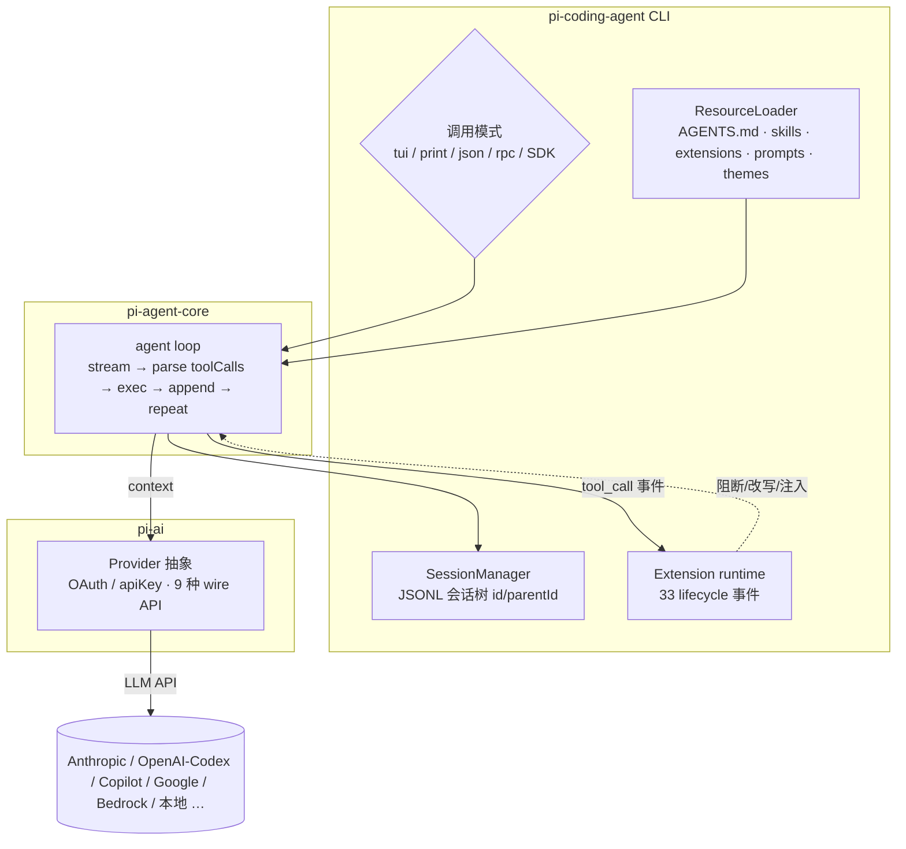

# pi — 极简可扩展编码 agent（harness / runtime 参考）

> **harness skill 的 reference。** 面向要理解/调试/对比编码 agent runtime 的工程师，覆盖：pi 的定位与设计取舍、runtime 架构、
> 配置与指令发现、五种调用形态（TUI / print / JSON / RPC / SDK）、接入 **Codex / Copilot 官方订阅**（切模型 · 上下文 · effort）、
> 扩展与 skill 系统与自研插件、多 agent 协同、手机远控，以及生态与社区。
>
> **来源基线**：`earendil-works/pi`（原 `badlogic/pi-mono`）@ `8479bd8`（2026-07-11），npm `@earendil-works/pi-coding-agent` v0.80.6，MIT。
> 本文源码引用均来自本地全量 clone：`~/projects/readonly-repos/{pi,pi-telegram,pi-chat,pi-skills}`，行号对应上述 commit。
> ⚠️ 时效：模型名（`gpt-5.6-*`、`claude-sonnet-5`、`claude-opus-4.8`）、版本号、star 数、画廊包数（~5.1k）都会变；标注"快照"处以你查证当时为准。
>
> **集成状态图例**（全文用）：🟩 Core（主仓内置） · 🟦 官方示例（`examples/`，需自行拷贝） · 🟨 官方实验包（API 不稳定） · 🟧 独立 first-party 仓库 · ⬜ 社区包/项目。

---

## 0. TL;DR 与高频坑

pi 是 Mario Zechner（`badlogic`，libGDX 作者）2025-08 发布、现由 **Earendil** 维护、Armin Ronacher（`mitsuhiko`）共同维护的**终端编码 agent CLI**。
核心极小（LLM ↔ 4 个工具 ↔ 会话树），一切工作流靠 TS 扩展与 skill 补齐。官网 <https://pi.dev>，文档 <https://pi.dev/docs/latest>，RFC/路线图 <https://rfc.earendil.com/keyword/pi/>。[^id][^readme]

**先记住这些坑（都经源码核实）**：

- **指令文件只认 `AGENTS.md` / `CLAUDE.md`，没有 `PI.md`**；从 cwd 向上走到**文件系统根**（非 git 根）逐层拼接。[^resource]
- **上下文长度不是旗标**，是模型属性 `contextWindow`（可在 `models.json` 覆盖）+ 自动压缩，没有 `--context-window`。[^providers]
- **自定义 provider 不会把 `GET /v1/models` 自动导入 `/model`**；`models.json` 里仍须显式列出每个模型。模型列表接口只适合人工/脚本探查，不能当作可信能力目录。[^customprov]
- **`reasoning:true` 只是能力声明，`compat.thinkingFormat` 才决定请求怎么写**；自定义域名常无法自动识别厂商，漏配后会出现“选 `off` 仍思考 / 选 `low` 仍不思考”。[^effort]
- **effort 在 UI 里叫 "thinking level"**（`off|minimal|low|medium|high|xhigh|max`），再由 `thinkingLevelMap` 映射档位、由 `thinkingFormat` 序列化成各家的线格式；不是统一的 `reasoning_effort`。[^effort]
- **订阅接入用 pi 自己的 OAuth**，不复用官方 Codex/Copilot CLI 的凭据文件。[^codex][^copilot]
- **信任（trust）不是沙箱**：它只决定是否加载项目级 `.pi/*` 与 `.agents/skills`，不限制工具能干什么；工具以 pi 进程权限读写文件、跑 shell。要隔离请上容器。[^security]
- **核心没有内置 Web UI / MCP / sub-agent / 权限弹窗**——都靠扩展或社区包补（`Mode` 只有 `text|json|rpc`）。[^philosophy][^modes]

**能力 / 入口一览**：

| 形态 | 命令 / API | 传输 | 会话持久化 | 典型用途 | 状态 |
|---|---|---|---|---|---|
| 交互 TUI | `pi` | 终端 | 是 | 人日常用 | 🟩 |
| print | `pi -p "…"`（非 TTY 自动进入） | stdout | 可选 | 脚本 / CI | 🟩 |
| JSON | `pi --mode json -p "…"` | stdout（JSONL 事件） | 可选 | 机器消费 | 🟩 |
| RPC | `pi --mode rpc` | stdin/stdout（JSONL） | 是 | 编辑器/Web/移动端后端 | 🟩 |
| SDK | `createAgentSession()` | 进程内 | 是 | 嵌入你的 Node 程序 | 🟩 |

---

## 1. 它是什么 / 设计取向

### 1.1 "Primitives, not features"

pi 的核心哲学是**中心极小**：给你原语，让你把 agent 适配到工作流，而不是反过来。README 明确列出*故意不做*的东西，每条都给替代方案：[^philosophy]

| 故意不内置 | 官方建议替代 |
|---|---|
| **No MCP** | 用带 README 的 CLI 工具（见 Skills），或装扩展补 MCP（见 §5.7） |
| **No sub-agents** | tmux 起多个 pi 实例，或用扩展/社区包自己实现（§7） |
| **No permission popups** | 跑容器里，或用扩展自建确认流（如示例 `permission-gate`） |
| **No plan mode** | 计划写进文件，或用扩展（示例 `plan-mode/`） |
| **No built-in to-dos**（"会干扰模型"） | 用扩展（示例 `todo.ts` / 社区 `rpiv-todo`） |
| **No background bash** | 用 tmux，保证完全可观测、可直接介入 |

设计缘由（作者博客）：Claude Code 等系统提示词长达数百行且每版都变、难做精确上下文工程；MCP 往往吃上万 token 且不可组合
（Playwright MCP 13k–18k token vs 等价 bash CLI+README ~225 token）。pi 反其道：**极短系统提示词 + 4 内置工具 + 一切靠 TS 扩展**，
且扩展能被 pi 自己写出来（自扩展闭环）。内置工具默认 `read`/`write`/`edit`/`bash`（源码另导出 `grep`/`find`/`ls`）。[^blog-mcp][^blog-pi][^readme]

### 1.2 定位与对比

常与 **opencode**、**Codex CLI** 并称终端 agent"第一梯队"，是其中少见的非 VC 出身。与 **Claude Code** 的对比是它的起点：

| 维度 | pi | Claude Code | opencode | Codex CLI | Copilot CLI |
|---|---|---|---|---|---|
| 系统提示词 | 极短、稳定 | 数百行、每版变 | 中 | 中 | 中 |
| 扩展性 | TS 扩展 + skill（全 OS 权限） | 插件 + MCP | 插件 + MCP | 较封闭 | 较封闭 |
| MCP | 显式不内置（可扩展补） | 内置 | 内置 | — | — |
| 订阅接入 | Codex/Copilot/Claude Pro-Max 全 OAuth | Claude 订阅 | 多家 | 仅 OpenAI | 仅 GitHub |
| 会话模型 | JSONL **树**（可分叉） | 线性 | 线性 | 线性 | 线性 |
| 语言/生态 | TypeScript | — | Go | — | — |

好评点：上下文高效（4 工具+极短提示，实测省约一半上下文）、稳定（不闪不崩、"写得像优秀软件"）、可魔改、能烧现有订阅省钱。
弹点：名字不可 Google、故意砍功能、拒绝 MCP、新贡献者 issue/PR 默认被自动关闭。[^community]

### 1.3 许可与治理

**当下 5 个已发布包全部 MIT**（root `LICENSE` + 各 `packages/*/package.json`）。作者 2026-04 加入 Earendil、仓库迁到 `earendil-works/pi`，
路线图规划为 **MIT 核心 + Fair Source 增值层 + 专有云层**（尚未落地）。长期计划见 RFC 站点。新贡献者的 issue/PR 默认自动关闭、每日集中审。[^license][^readme]

---

## 2. Runtime 架构

### 2.1 Monorepo 分包（🟩）

| npm 包 | 目录 | 职责 |
|---|---|---|
| `@earendil-works/pi-coding-agent` | `packages/coding-agent/` | **主 CLI**（`bin: pi`）：TUI/print/json/rpc、会话树、包管理、skill/扩展加载、SDK 出口 |
| `@earendil-works/pi-agent-core` | `packages/agent/` | **agent runtime 库**：agent loop、工具执行、context 变换、transport 抽象、prompt 模板 |
| `@earendil-works/pi-ai` | `packages/ai/` | **统一 LLM API**：35 个 provider、9 种 wire API、OAuth/apiKey 鉴权、模型目录、token/成本核算、thinking level 抽象 |
| `@earendil-works/pi-tui` | `packages/tui/` | **终端 UI 库**：差分渲染、markdown、宽字符布局 |
| `@earendil-works/pi-orchestrator`（🟨） | `packages/orchestrator/` | **多实例进程督程**（实验性，API 不稳定，见 §7.1） |

### 2.2 数据流与 agent loop



**一个 turn**（`packages/agent/src/agent-loop.ts:169-224`）：只要还有工具调用或排队消息 → `streamAssistantResponse` → 从 assistant 消息 filter 出
`toolCall` → `executeToolCalls` → `toolResult` 追加进 context → 触发 `turn_end`，直到无更多工具调用。provider 调用前先跑 `transformContext`/`convertToLlm`
再 `streamFunction(model, llmContext, …)`。[^loop]

### 2.3 会话树（🟩）

追加式 **JSONL**，每条 entry 带 `id` + `parentId` 构成**树**，非破坏式分叉：[^session]

```ts
// packages/coding-agent/src/core/session-manager.ts:46
export interface SessionEntryBase { type: string; id: string; parentId: string | null; timestamp: string; }
```

- 落盘 `~/.pi/agent/sessions/--<cwd 转义>--/<timestamp>_<uuid>.jsonl`，一行一 JSON；**新会话文件名即刻分配，但直到出现第一条 assistant 消息才落盘**。header 含 version/sessionId/timestamp/cwd/可选 parentSession。[^session]
- 会话目录优先级：`--session-dir` → `PI_CODING_AGENT_SESSION_DIR` → `settings.json.sessionDir`。[^config]
- 斜杠命令：`/new`、`/fork <某条 user 消息>`、`/clone`（当前 leaf 复制）、`/tree`（分支选择器）、`/resume`（选 JSONL 恢复）。[^session]

#### 2.3.1 回读会话做收尾审计

长会话被压缩后，不能只凭当前上下文盘点“做了什么 / 漏了什么”。pi 的 JSONL 本身就是事实源：

- 先在 `~/.pi/agent/sessions/--<cwd>--/*.jsonl` 中按最近修改时间找候选，再用**最近一条用户原文**反查当前文件；不要拿对话里出现的历史 UUID 当当前 session。
- `type:"message"` 里有 `message.role` 与内容块；另有 `model_change`、`thinking_level_change`、`session_info`、`compaction` 等条目。发生分叉时，从当前 leaf 沿 `parentId` 回溯，而不是把文件内所有分支混成一条线。
- 失败的 assistant entry 常见 `content:[]`、`stopReason:"error"`、token usage 为 0，真正异常在 `errorMessage`；“屏幕没字”不等于模型返回空文本。
- `compaction` 摘要是有损材料，只用来导航；仍要逐条核对原始 user message，并以文件/配置/API/Git 实况验证承诺是否落地。
- 导出前先脱敏 `sk-*`、Authorization、内部 URL、预算与账户字段。live store 可能还没写入最后一个进行中的 turn，需用当前上下文补齐。

现有 `dredge-up` 脚本的数据层只解析 Copilot CLI；在补 pi adapter 前，可直接按上述 schema 写一个只读 JSONL 提取器。渲染层应消费 agent-neutral 中间结构，不要把 pi schema 再复制进每个前端。

### 2.4 配置与指令发现（harness 重点）

配置根默认 `~/.pi/agent/`（`PI_CODING_AGENT_DIR` 可覆盖）。[^config]

```
~/.pi/agent/
  auth.json      凭据（apiKey + OAuth token）
  settings.json  全局设置    models.json 自定义 provider/模型 override    trust.json 信任
  keybindings.json  快捷键覆盖
  sessions/ extensions/ skills/ prompts/ themes/ agents/ npm/ git/ bin/ tools/
  SYSTEM.md  APPEND_SYSTEM.md      系统提示词覆盖/追加
  AGENTS.md | CLAUDE.md            全局指令
<project>/.pi/                     同上项目级子集（需 /trust 信任才加载）
<project 及祖先>/AGENTS.md|CLAUDE.md     项目指令
<project 及祖先>/.agents/skills/         标准 skill 目录
```

三种"向上找"的边界**不同**，务必分清（历史上最易错）：

| 发现对象 | 向上到哪 | 拼接/优先 |
|---|---|---|
| **`AGENTS.md` / `CLAUDE.md` 指令** | **文件系统根**（无 git 感知） | 全局在前，再从根到叶拼接；候选名单只有 AGENTS/CLAUDE 大小写变体，**无 `PI.md`** [^resource] |
| **`.agents/skills/`** | **git 仓库根**（无 git 时到 FS 根） | 见 §5.2 skill 优先级 [^config] |
| **`.pi/SYSTEM.md` / `.pi/APPEND_SYSTEM.md`** | 项目级 | 受信任时项目**整体替换**全局同名文件（不叠加） [^resource] |

设置优先级：**项目 > 全局**；资源精确顺序 项目 settings → 项目自动发现 → 用户 settings → 用户自动发现 → 包提供（`lower rank = higher precedence`）。项目级资源需 `/trust`。[^config]

### 2.5 工具执行与 TUI

- **工具执行**：默认**并行**（`Promise.all`，保序），除非全局 `toolExecution:"sequential"` 或某工具声明 `executionMode:"sequential"`。取消经 `AbortSignal` 传到每个 `execute`；bash abort/超时杀整棵进程树。结果**双通道**：`content`（回模型的文本/图像）与 `details`（给 UI/日志的结构化数据）分离。[^toolexec]
- **TUI**：线性 append（非全屏接管），维护 `previousLines` 缓冲、diff 只重绘变化行、整段渲染用同步输出 `CSI ?2026h/l` 消闪；组件级缓存。[^tui]

### 2.6 平台与安装

- **Node ≥ 22.19.0**（root 与 coding-agent 包 `engines`）。[^platform]
- 安装：`curl -fsSL https://pi.dev/install.sh | sh`（Linux/macOS），或 `npm install -g --ignore-scripts @earendil-works/pi-coding-agent`。[^id]
- **Windows 需要一个 bash**：查找顺序 = `settings.json` 的 `shellPath` → Git Bash `C:\Program Files\Git\bin\bash.exe` → PATH 上的 `bash.exe`（Cygwin/MSYS2/WSL）。[^platform]

---

## 3. 五种调用形态

`Mode` 类型只有 `"text" | "json" | "rpc"`（`--mode`）；`--print`/`-p` 是**正交**的单发开关。**非交互自动化**：stdin **或** stdout 任一非 TTY 会自动进入 print，即使没给 `-p`。官方 README 把它概括为"四种模式"（interactive、print/JSON、RPC、SDK），本文按更细的 5 行拆开。[^modes]

- **交互 TUI**（默认）：`pi` / `pi "初始提示"`；`-c`/`--continue` 续、`--resume` 选、`--fork <id>` 分叉。会话树 + 斜杠命令 + 快捷键（可在 `keybindings.json` 改）。[^modes][^ops]
- **print**：`pi -p "prompt"`；`echo x | pi -p`；`pi -p @prompt.md`。跑完打印最终文本即退。[^modes]
- **JSON**：`pi --mode json -p "…"`，逐事件 JSONL 到 stdout（`agent_start`/`message_update`/`tool_execution_*`/`agent_end`/`agent_settled`…）。[^modes]
- **RPC**（远控/嵌入关键）：见 §3.1。
- **SDK**（同进程）：见 §3.2。

> ⚠️ **print/JSON/RPC 不弹信任提示**。若项目未存过信任决定，项目级 `.pi/*` 资源会被**静默忽略**。自动化里用 `--approve`/`-a`、`--no-approve`/`-na` 或 `settings.json.defaultProjectTrust` 显式表态。[^config]

### 3.1 RPC 协议（🟩）

严格 JSONL（一行一 JSON，只以 `\n` 分隔，刻意不用 `readline` 以免被 JSON 串内 U+2028/2029 切断）。命令带 `type`（可选 `id`），响应 `{type:"response", command, success, data?/error?}`，事件即 `AgentSessionEvent`。入口既可 `pi --mode rpc`，也可专用 `rpc-entry`。[^rpc]

**全部 31 个命令**（`packages/coding-agent/src/modes/rpc/rpc-types.ts:20-72`）：[^rpc]

```
提示/打断: prompt · steer · follow_up · abort · new_session
队列模式:  set_steering_mode · set_follow_up_mode
状态/查询: get_state · get_session_stats · get_tree · get_entries · get_messages
           get_fork_messages · get_last_assistant_text · get_commands
模型:      set_model · cycle_model · get_available_models
effort:    set_thinking_level · cycle_thinking_level
压缩:      compact · set_auto_compaction
重试:      set_auto_retry · abort_retry
bash:      bash · abort_bash
会话:      export_html · switch_session · fork · clone · set_session_name
```

扩展可反向发 UI 请求（`extension_ui_request`：select/confirm/input/editor/notify/setStatus/setWidget/setTitle/set_editor_text），调用方以 `extension_ui_response` 回。
一次最小交换：写 `{"type":"prompt","message":"…"}` → 立即收 `{"type":"response",…,"success":true}` → 随后异步收 `agent_start`…`agent_settled`（`agent_settled` = 可发下一条）。**pocket-pi（⬜ 安卓）就是驱动 `pi --mode rpc`**。[^rpc][^remote]

### 3.2 SDK 嵌入（🟩）

最高层入口 `createAgentSession()`（`packages/coding-agent/src/index.ts:192-219`，re-export 自 `core/sdk.ts`），整个 agent 跑进程内。**OpenClaw 即以 SDK 方式嵌入 pi**（README 明列）。[^sdk][^readme]

```ts
import { createAgentSession } from "@earendil-works/pi-coding-agent";
const { session } = await createAgentSession();
session.subscribe((e) => {
  if (e.type === "message_update" && e.assistantMessageEvent.type === "text_delta")
    process.stdout.write(e.assistantMessageEvent.delta);
});
await session.prompt("What files are in the current directory?");
session.dispose();
```

多会话（new/fork/resume）用 `createAgentSessionRuntime()`；要完全掌控鉴权/模型/资源用 `createAgentSessionServices` + 传 `authStorage`/`modelRegistry`/`resourceLoader`/`sessionManager`/`settingsManager`。SDK 示例 `examples/sdk/01-minimal.ts`…`13-session-runtime.ts` 覆盖自定义模型/提示/skill/工具/扩展/上下文文件/鉴权/设置/会话/完全控制。[^sdk]

> **核心无 Web 传输**：没有内置 HTTP server。"Web" 靠 ① `/share` → `pi.dev/session/#<id>` 渲染 HTML；② `--mode rpc` 让外部 Web 后端驱动；③ 社区前端（pocket-pi 的 dashboard 等）。[^modes][^remote]

---

## 4. 接入模型 / 官方订阅（切模型 · 上下文 · effort）

### 4.1 Provider 与凭据

`pi-ai` 用统一 `Provider` 抽象，鉴权分 `apiKey`/`oauth`。共 **35 个内置 provider id**；**订阅制（OAuth `/login`）三家**：`openai-codex`（ChatGPT Plus/Pro）、`anthropic`（Claude Pro/Max）、`github-copilot`。其余走 apiKey（openai、azure-openai-responses、google、google-vertex、amazon-bedrock、mistral、groq、cerebras、xai、openrouter、deepseek、nvidia、kimi-coding、minimax(-cn)、moonshotai(-cn)、huggingface、fireworks、together、opencode(-go)、cloudflare-*、zai(-coding-cn)、ant-ling、vercel-ai-gateway、xiaomi* 等）。[^providers][^prov-all]

凭据/设置三文件（`~/.pi/agent/`）：`auth.json`（凭据）、`settings.json`（默认 provider/model、thinking、compaction…）、`models.json`（自定义 provider / 模型 override，如本地 ollama、改 `contextWindow`）。[^providers]

**鉴权解析顺序**（先命中先用）：① `--api-key` 运行期覆盖 → ② `auth.json` 的 apiKey → ③ `auth.json` 的 OAuth → ④ 环境变量 → ⑤ `models.json`/扩展注册的 provider key。**注意：已存的凭据会盖过环境变量**。[^authorder]

**`pi-ai` 内部**：统一 9 种 wire API（`openai-completions`/`mistral-conversations`/`openai-responses`/`azure-openai-responses`/`openai-codex-responses`/`anthropic-messages`/`bedrock-converse-stream`/`google-generative-ai`/`google-vertex`）；流式工具参数用 `partial-json` 容错解析；全链路 abort（`stopReason:"aborted"`）；**跨 provider 上下文接力**（保留 thinking 块/工具调用/结果，可中途换家）；token/成本核算。[^piai]

### 4.2 用 OpenAI Codex 官方订阅（ChatGPT Plus/Pro）

pi 跑**自己**的 OAuth（不复用官方 Codex CLI 的 `~/.codex/auth.json`）：`pi` → `/login` → 选 **"ChatGPT Plus/Pro (Codex)"**。两种方式：[^codex]

- **browser（PKCE）**：起本地回调 `localhost:1455`，浏览器完成 openai 登录；**也可直接粘贴授权码或整个 redirect URL**（与回调竞速，先到先用）——所以**在别处有浏览器时，headless 机器同样能用这条路**。
- **device_code**：给 user code + `https://auth.openai.com/codex/device`，pi 轮询。

token 换取后写入 `auth.json`（含 JWT 提取的 `accountId`），base URL 走 `chatgpt.com/backend-api`。用：`pi --model openai-codex/gpt-5.5` 或 `/model`。
可用模型（快照）：`gpt-5.4`/`gpt-5.4-mini`/`gpt-5.5`（272K）、`gpt-5.6-luna`/`sol`/`terra`（372K）、`gpt-5.3-codex-spark`（128K）。[^codex]

### 4.3 用 GitHub Copilot 订阅

`/login` → **"GitHub Copilot"**：[^copilot]

1. 可填 GitHub Enterprise 域名（留空即 github.com）。
2. **device code**：POST `github.com/login/device/code`（Copilot 的 VSCode client_id，scope `read:user`），拿 user_code + `github.com/login/device`，轮询换 GitHub token。
3. 用 GitHub token 向 `api.github.com/copilot_internal/v2/token` 换**短时 Copilot token**（带 VSCode 版本头），并自动对需策略确认的模型 POST `{state:"enabled"}`。
4. base URL 从 token 的 `proxy-ep` 动态解析（如 `api.individual.githubcopilot.com`），过期用存下的 GitHub token 刷新。
5. 用：`pi --model github-copilot/gpt-5.5` 或 `/model`。若报 "model not supported"，去 VS Code 的 Copilot Chat 模型选择器 Enable。

**headless**：设环境变量 `COPILOT_GITHUB_TOKEN`——它被**直接当作 Copilot 凭据使用**（须已是可用的 Copilot token）；上面 device-code→copilot token 的交换只发生在交互 `/login` 那条路。可用模型（快照，随账号）：GPT 系、Claude 系（sonnet-5/opus-4.8/haiku-4.5…）、Gemini 系、kimi-k2.7-code 等；登录后 pi 把账号实际可用模型存进凭据 `availableModelIds`。[^copilot]

### 4.4 切模型

- **交互**：`Ctrl+L` 或 `/model`（跨 provider 模糊搜）；`Ctrl+P` / `Shift+Ctrl+P` 循环"收藏/scoped"模型；`/scoped-models` 配循环集。[^modes][^ops]
- **旗标**：`pi --provider openai-codex --model gpt-5.5`，或合写 `pi --model openai-codex/gpt-5.5`，或带 effort `pi --model openai-codex/gpt-5.5:high`。[^providers]
- **默认**：`settings.json` 的 `defaultProvider`/`defaultModel`；循环集 `--models "github-copilot/*,openai-codex/gpt-5.5"` 或 `enabledModels`。[^providers]

### 4.5 选上下文长度

**无 `--context-window` 旗标**；上下文窗口是**模型属性** `contextWindow`。手段：① `models.json` 的 `modelOverrides` 改某模型 `contextWindow`；
② 自动压缩：`settings.json.compaction.{enabled,reserveTokens(默认 16384),keepRecentTokens(默认 20000)}`，触发条件 `contextTokens > contextWindow - reserveTokens`；手动 `/compact [指令]`；
③ footer 实时显示用量（`↑`输入 `↓`输出 `R`缓存读 `W`缓存写 `CH`命中率）；`/session` 看 token 与成本。`PI_CACHE_RETENTION=long` 延长直连 provider 的 prompt 缓存（Anthropic 1h / OpenAI 24h）。[^providers][^ops]

### 4.6 选 effort（"thinking level"）

七档 `off | minimal | low | medium | high | xhigh | max`。设置入口：`pi --thinking high`、`pi --model "provider/model:high"`、交互 `Shift+Tab`、`settings.json.defaultThinkingLevel`。[^effort]

thinking 的**三层机制**（`reasoning` 能力声明 / `thinkingLevelMap` 档位映射 / `compat.thinkingFormat` 线格式方言）、各方言实际发什么字段、以及 `anthropic-messages` 的独立 serializer——都属**配自定义模型**时才要拧的旋钮，连同「off 仍思考 / low 仍不思考」这类误配坑，整体见 [pi-custom-model.md](pi-custom-model.md) §3。

### 4.7 自定义 provider（`models.json`）+ 端点探针 + 实战快照 → 见 `pi-custom-model.md`

把任意 OpenAI/Anthropic 兼容端点接进 pi 的全部细节——`models.json` 写法与全字段、`api` 选型与 baseUrl `/v1` 拼接坑、`cost` 与缓存计费、thinking 三层与线格式方言、两入口（openai-completions ↔ anthropic-messages）对照、接入前的端点真伪探针，以及 USTC LiteLLM 网关 2026-07 的实测快照（别名↔后端、规格、¥ 费率、图片/工具/缓存/thinking 端到端、最终配置）——整体移到专门文档：[**pi-custom-model.md**](pi-custom-model.md)。

---

## 5. 扩展 / skill / 插件系统

### 5.1 扩展（🟩，dev 面向 TS）

一个扩展 = **默认导出工厂函数**的 TS/JS 模块，参数 `ExtensionAPI`；由 **`jiti`** 运行期转译加载（无需预编译）。核心依赖注入方式**随构建不同**：编译成 Bun 单文件时用 `virtualModules`，Node/开发时用指向 `node_modules` 的 alias。[^extloader]

```ts
import type { ExtensionAPI } from "@earendil-works/pi-coding-agent";
export default function (pi: ExtensionAPI) { /* 注册工具/命令/事件… */ }
```

**`ExtensionAPI` 全部方法**（`packages/coding-agent/src/core/extensions/types.ts:1165-1398`）：[^extapi]

```
on                              订阅生命周期事件（见 5.3）
registerTool / registerCommand / registerShortcut / registerFlag / getFlag
registerMessageRenderer / registerEntryRenderer          自定义 TUI 渲染
sendMessage / sendUserMessage / appendEntry              注入消息/条目
setSessionName / getSessionName / setLabel               会话元数据
exec                                                     跑子进程
getActiveTools / getAllTools / setActiveTools / getCommands   工具/命令自省与开关
setModel / getThinkingLevel / setThinkingLevel           改模型/effort
registerProvider / unregisterProvider                    动态注册 provider
events                                                   跨扩展事件总线
```

工具用 `defineTool()`（**仅类型推断辅助**）声明、`pi.registerTool()` 注册。`ToolDefinition` 字段：`name`/`label`/`description`/`promptSnippet`/`promptGuidelines`/`parameters`(TypeBox)/`executionMode`/`renderShell`/`prepareArguments`/`execute(toolCallId, params, signal, onUpdate, ctx)`/`renderCall`/`renderResult`。[^extapi]

最小工具扩展（仓库自带 `hello.ts`）：[^hello]

```ts
import { Type } from "@earendil-works/pi-ai";
import { defineTool, type ExtensionAPI } from "@earendil-works/pi-coding-agent";
const helloTool = defineTool({
  name: "hello", label: "Hello", description: "A simple greeting tool",
  parameters: Type.Object({ name: Type.String({ description: "Name to greet" }) }),
  async execute(_id, params) {
    return { content: [{ type: "text", text: `Hello, ${params.name}!` }], details: { greeted: params.name } };
  },
});
export default function (pi: ExtensionAPI) { pi.registerTool(helloTool); }
```

### 5.2 生命周期事件：33 个，其中 15 个能拦截/改写

`types.ts` 恰好导出 **33** 个事件；其中 **15** 个具有决策/取消/改写/替换/处理语义（其余为通知）：[^events]

| 事件 | 时机 | 能力 |
|---|---|---|
| `project_trust` | 进入新 cwd、加载项目资源前 | 决定/推迟项目信任 |
| `resources_discover` | `session_start` 后 | 注入 `{skillPaths,promptPaths,themePaths}` |
| `session_before_switch` / `_fork` / `_compact` / `_tree` | 对应操作前 | 取消或替换该操作 |
| `input` | 收到用户输入、命令检查后、skill/模板展开前 | `transform` 改写，或 `handled` 直接短路 agent |
| `before_agent_start` | agent loop 启动前 | 注入消息 + 替换系统提示词（链式） |
| `context` | 每次 LLM 调用前（拿 messages 深拷贝） | 过滤/重写发给 LLM 的消息数组 |
| `before_provider_headers` / `before_provider_request` | 发 HTTP 前 | 改 header / 替换 payload |
| `message_end` | 消息定稿 | 替换定稿消息（须保持 role） |
| `tool_call` | 工具执行前（`input` 可变） | **阻断**（`{block:true,reason}`）或就地改参数 |
| `tool_result` | 工具执行后（中间件链） | patch 结果 `{content?,details?,isError?}` |
| `user_bash` | 用户 `!cmd` | 重定向/替换用户 bash |

其余 18 个通知类：`session_start`/`session_info_changed`/`session_compact`/`session_tree`/`session_shutdown`/`after_provider_response`/`agent_start`/`agent_end`/`agent_settled`/`turn_start`/`turn_end`/`message_start`/`message_update`/`tool_execution_start`/`_update`/`_end`/`model_select`/`thinking_level_select`。这些钩子就是 pi"用扩展补齐一切"（权限、上下文注入、审计、MCP 适配、子 agent）的技术底座。[^events]

### 5.3 Skill / prompt / theme（🟩 机制）

四类资产各司其职：[^skilldev]

| 资产 | 形式 | 何时用 | 执行 |
|---|---|---|---|
| **Skill** | `SKILL.md` + 可选脚本/引用 | 可复用任务工作流（带 setup、脚本、参考文档） | agent 按需 `read` 正文、`bash` 跑脚本 |
| **Extension** | TS 模块 | 钩 runtime（拦工具/注入上下文/自定义工具·UI·权限/集成） | jiti 加载，全 OS 权限 |
| **Prompt 模板** | `.md`（可带 frontmatter） | `/name` 触发的可复用提示 | 纯文本替换 |
| **Theme** | `.json`（51 个色值 token） | 改配色 | 启动加载，保存即热重载 |

**Skill = Agent Skills 标准**（<https://agentskills.io/specification>），与 Claude Code / Codex CLI / Amp 跨兼容。[^skills]

- frontmatter：`name`（**可选**，缺省回退父目录名；非法名只告警仍加载）、`description`（**硬必需**，缺失/空则整个 skill 不加载）、可选 `license`/`compatibility`/`metadata`/`allowed-tools`/`disable-model-invocation`。
- **渐进式披露**：启动只把各 skill 的 `<name>/<description>/<location>` 注入系统提示词的 `<available_skills>`；正文与引用文件由 agent 需要时 `read` 加载。
- ⚠️ **`{baseDir}` 占位符已移除**（CHANGELOG 记录），skill 应写**相对路径**；`/skill:` 显式展开时 pi 会追加一句"References are relative to `<绝对目录>`"的文本提示。`badlogic/pi-skills` 的 README 仍写着旧的 `{baseDir}` 用法（**陈旧，别照抄**）。[^skills]
- **发现与冲突（首次命中者胜）**：优先级 项目 settings > 项目自动发现（`.pi/skills/`）> 用户 settings > 用户自动发现（`~/.pi/agent/skills/`、`~/.agents/skills/`）> 包提供；`-e` 临时资源前插；**`--skill <path>` 追加在最后（同名冲突会输）**。含 `SKILL.md` 的目录即 skill 根并停止下探；尊重 `.gitignore`。[^skills]
- **跨 harness 复用**：直接把 `settings.json` 的 `skills` 数组指向 `~/.claude/skills`、`~/.codex/skills` 即可复用 Claude Code / Codex 的 skill 库。[^skills]

**prompt 模板**：文件名即 `/命令`；frontmatter `description`/`argument-hint` 可选；替换支持 `$1`/`$2`/`$@`/`$ARGUMENTS`/`${1:-default}`/`${@:N}`/`${@:N:L}`。**theme**：JSON（`name`+可选 `vars`+必需 `colors`，51 个 token，可选 `thinkingMax`），改动约 100ms 自动热重载。[^prompttheme]

`badlogic/pi-skills`（🟧，~2159★）：brave-search、browser-tools（CDP 浏览器自动化）、gccli/gdcli/gmcli（Google 日历/云盘/Gmail）、transcribe（Groq Whisper）、vscode（diff）、youtube-transcript。[^skills]

### 5.4 插件发布在哪里 / 怎么发

- **渠道：npm，打 `pi-package` keyword**（无专属 scope）；官方画廊 <https://pi.dev/packages>（快照约 5.1k 包，按**月**下载排序）。[^packages]
- **安装**：`pi install <source> [-l|--local] [--approve|-a | --no-approve|-na]`，`source` = `npm:@foo/bar[@ver]` / `git:host/user/repo[@ref]` / `https://…` / 本地路径。`-l` 装到项目 `.pi/`。**本地路径是"引用"不是拷贝**。另有**全局旗标** `pi -e/--extension <path>`（本次临时加载一个扩展，也是 `pi update` 的选项）——它**不是** `pi install` 的子旗标，也没有 `-e/--exact`。版本钉住写在 source 里（`npm:@x@1.2.3` 钉住、跳过 `pi update`；git `@ref` 钉住）。[^packages]
- **包清单**：`package.json` 加 `"keywords":["pi-package"]` 与可选 `"pi": { extensions, skills, prompts, themes, video, image }`；无 `pi` 字段则按约定自动发现——`extensions/` 收 **`.ts` 与 `.js`**，`skills/` **递归找 `SKILL.md` 且加载顶层 `.md`**，`prompts/*.md`，`themes/*.json`。核心依赖放 `peerDependencies`（**四个 pi 包 + `typebox`**，由 pi 提供），第三方依赖放 `dependencies`（装包时 `npm install --omit=dev`）。画廊预览靠 `pi.video`/`pi.image`。[^packages]
- **管理**：`pi list` / `pi update [--all]` / `pi remove` / `pi config`（TUI 开关资源，`-l` 项目级）。

### 5.5 生态热门插件（按月下载 · 快照，会变）

| 包 | ~月下载 | 作用 | 装 |
|---|---|---|---|
| `@hypabolic/pi-hypa` | ~198K | 上下文压缩（确定性压缩 shell 输出、上下文感知文件工具） | `pi install npm:@hypabolic/pi-hypa` |
| `pi-web-access` | ~136K | 网络搜索（Brave/Tavily/Perplexity/Exa/OpenAI）+ URL/PDF/YouTube/GitHub 抓取 | `pi install npm:pi-web-access` |
| `pi-mcp-adapter` | ~124K | 接入 MCP server（见 §5.7） | `pi install npm:pi-mcp-adapter` |
| `context-mode` | ~117K | MCP + FTS5 知识库 + 沙箱执行，号称省 ~98% 上下文 | `pi install npm:context-mode` |
| `pi-subagents` | ~111K | 子 agent 委派（见 §6.3） | `pi install npm:pi-subagents` |
| `@tintinweb/pi-subagents` | ~40K | Claude Code 风子 agent + FleetView（见 §6.3） | `pi install npm:@tintinweb/pi-subagents` |
| `bigpowers` | ~35K | 73 个工程方法学 skill 包 | `pi install npm:bigpowers` |
| `@ayulab/pi-rewind` | ~32K | `/rewind` 检查点回溯 | `pi install npm:@ayulab/pi-rewind` |
| `@plannotator/pi-extension` | ~30K | 交互式计划评审 / PR 评审 | `pi install npm:@plannotator/pi-extension` |
| `pi-lens` | ~30K | 实时代码反馈（LSP/biome/ruff/类型检查/ast-grep） | `pi install npm:pi-lens` |
| `@juicesharp/rpiv-todo` | ~28K | 存活于 `/reload` 与压缩的 todo 覆盖层 | `pi install npm:@juicesharp/rpiv-todo` |
| `@remnic/plugin-pi` | ~27K | 持久记忆 | `pi install npm:@remnic/plugin-pi` |
| `@gotgenes/pi-permission-system` | ~24K | 工具访问控制 / 权限策略 | `pi install npm:@gotgenes/pi-permission-system` |
| `pi-simplify` | ~23K | 改动后清晰度/可维护性复审 | `pi install npm:pi-simplify` |
| `@ff-labs/pi-fff` | ~22K | FFF 模糊文件/内容搜索 | `pi install npm:@ff-labs/pi-fff` |
| `@quintinshaw/pi-dynamic-workflows` | ~22K | Code-mode 大规模 fan-out + `/deep-research`（见 §6.3） | `pi install npm:@quintinshaw/pi-dynamic-workflows` |
| `pi-hermes-memory` | ~15K | 持久记忆 + 会话搜索 + 密钥扫描 | `pi install npm:pi-hermes-memory` |
| `cc-safety-net` | ~9K | 拦截破坏性 git/文件系统命令 | `pi install npm:cc-safety-net` |

下载量为 `pi.dev/packages` 快照（月），会变；名字/排名仅供参考。[^packages]

### 5.6 开发闭环

```
写：~/.pi/agent/extensions/x.ts（或项目 .pi/extensions/x.ts）——自动发现
试：pi -e ./x.ts            # 全局旗标临时加载；不写 settings，但同会话内 /reload 仍会重载它
装：pi install ./pkg        # 全局；pi install -l ./pkg 装到项目
热重载：/reload             # 重载全部扩展/skill/prompt/theme，触发 session_shutdown(reason:"reload")→session_start→resources_discover
发：package.json 打 pi-package keyword → npm publish
```
无 `pi init` 脚手架（手动建包）。主题文件保存即热重载（无需 `/reload`）。[^skilldev]

### 5.7 MCP 支持（⬜ 靠适配器补）

核心刻意不内置 MCP。社区 `pi-mcp-adapter`（⬜）以扩展形式把 MCP server 接进来：默认暴露一个 `mcp` 代理工具（search/describe/call，参数走 JSON 串），或用 `directTools` 把选定 MCP 工具注册成 pi 原生工具。装：`pi install npm:pi-mcp-adapter` 后重启。[^mcp]

### 5.8 安全 · 信任 · 隔离（harness 必读）

- **Project Trust 只是资源加载门**：决定是否加载项目级 `.pi/settings.json`、`.pi/{extensions,skills,prompts,themes}`、`.pi/SYSTEM.md`/`APPEND_SYSTEM.md`、项目 `.agents/skills`、以及缺失的项目包。**它不是沙箱**，不限制模型让工具做什么；内置工具以 pi 进程权限读写文件、跑 shell。[^security]
- **要真隔离用容器**，官方给三种模式：**Gondolin**（本地 Linux 微 VM，host 跑 pi、内置工具路由进 VM）、**Plain Docker**（整个 pi 进程进容器）、**OpenShell**（带文件/进程/网络/凭据/推理管控的策略沙箱）。§7.2 的 pi-chat 用的就是 Gondolin（模式一）。[^containers]

---

## 6. 多 agent 协同

pi 无内置 sub-agent；生态四条路径，共同不变量：**除非显式 fork，子 agent 都拿全新空上下文**。[^ma-sum]

### 6.1 `@earendil-works/pi-orchestrator`（🟨 实验性）

一个**进程督程**（非 LLM 级编排）：`orchestrator serve` 起 Unix socket（`~/.pi/orchestrator/orchestrator.sock`），`spawn`/`list`/`status`/`stop`/`rpc`/`rpc-stream` 管理一池 `pi --mode rpc` 子进程，把外部 CLI 桥接到它们的 JSONL RPC，可选向 `radius.pi.dev` 注册云端在线态。**只管进程生命周期与 IPC 中继**，不做任务路由/父 agent。README 明标 API 不稳定。[^orchestrator]

### 6.2 官方 subagent 示例扩展（🟦）

`examples/extensions/subagent/`：把每个子 agent 做成一个 `pi --mode json -p --no-session` 子进程（全新上下文），父读子进程的 `message_end`/`tool_result_end` 事件实时汇报、abort 经 SIGTERM 传递。三模式：single / parallel（≤8 任务、并发 4）/ chain（顺序，前一步文本填 `{previous}`）。
agent 用 `.md` frontmatter 定义（`name`/`description`/`tools`/`model`+正文）。发现层**只有**用户级 `~/.pi/agent/agents/*.md` 与最近的项目 `.pi/agents/*.md`；**随仓库附带的 scout/planner/reviewer/worker 是"示例"，需自行拷贝/软链才生效**（默认 user-only，项目级要 `agentScope:"both"|"project"`，属信任边界）。附 `/implement`、`/scout-and-plan`、`/implement-and-review` 预设。[^subagent]

### 6.3 社区包（三种编排范式，⬜）

| 包 | ~月下载 | 范式 | 亮点 |
|---|---|---|---|
| `pi-subagents`（nicobailon） | ~111K | 父 agent 委派 + 链 + 并行 + 后台/异步 + 澄清 TUI | watchdog 对抗式复审、`contact_supervisor` 子父通信、`context:"fork"` 继承并清洗父上下文、模型 scope 白名单 |
| `@tintinweb/pi-subagents` | ~40K | Claude Code 风（`Agent`/`get_subagent_result`/`steer_subagent`） | 上方 live widget + 下方 FleetView 可导航、运行中 steer、cron/interval 定时、`isolation:"worktree"` git worktree 隔离 |
| `@quintinshaw/pi-dynamic-workflows` | ~22K | **Code-mode**：LLM 写 JS 脚本调 `agent()`/`parallel()`/`pipeline()`/`phase()`，中间结果留 JS 变量不进聊天 | ≤16 并发/1000 总量、journaled 断点续跑、真实成本核算、`/deep-research`、`/code-review`（7 路并行 finder） |

[^ma-community]

### 6.4 tmux 裸模式

README 一句话："用 tmux 起多个 pi 实例"；仓库 `docs/tmux.md` 只讲按键编码。实践即每 agent 一个命名 tmux 会话，人可 `tmux attach` 直接观测/介入（pi-chat 的 `/chat-spawn-all` 就是它的产品化）。[^ma-sum]

---

## 7. 远程控制与移动端

**手机远控电脑上的 pi 可行**，两条主线**都基于扩展事件 API**（不是 RPC）：注入用户消息 + 订阅事件回推。[^remote]

### 7.1 `badlogic/pi-telegram`（🟧，~253★）——最简单

单文件扩展，跑在你桌面/服务器已有的 pi 会话内：起 Telegram Bot 长轮询，把每条 DM 经 `pi.sendUserMessage()` 注入为 user turn，订阅 `message_update`/`agent_end` 把流式输出（节流 750ms 编辑同一条消息）回推手机。[^remote]

- 装：`pi install git:github.com/badlogic/pi-telegram`；`/telegram-setup`（填 bot token，存 `~/.pi/agent/telegram.json`）→ `/telegram-connect`。
- **配对**：手机 DM bot 发**第一条私聊消息（任意内容，README 建议 `/start`）**的人，其 numeric user id 被锁为 `allowedUserId`，其余人被拒。"同时只连一个 pi 会话"是操作建议、非强制锁。
- 手机能做：发文本/图片/文件、收流式输出、`stop`/`/stop` 打断、`/compact`、`/status`、忙时排队、pi 用 `telegram_attach` 回传文件。
- ⚠️ 该仓库 `peerDependencies` 仍写旧 scope `@mariozechner/*`（主仓已迁 `@earendil-works/*`），装时留意。

### 7.2 `earendil-works/pi-chat`（🟧）——多渠道 + 强隔离

Discord 频道 + Telegram，**每频道一个 pi 进程（tmux 隔离）+ 一个 Gondolin 微 VM（Alpine+bash）**，read/write/edit/bash 全路由进 VM 的虚拟文件系统，agent 只见 `/workspace`、`/shared`。[^remote]

- `/chat-spawn-all` 用 `tmux new-session -d` 为每频道起 worker（`pi --session … --chat-conversation <id>`），`session_start` 自动连；`/chat-open-all` 起平铺仪表盘；worker 每 15s 写状态快照。
- **两套独立密钥系统，别混**：
  1. **Config secrets**（`/chat-config` 配）：经 Gondolin **host-scoped HTTP hook** 只在对允许主机的出站请求里注入占位符，**agent 永远看不到真值**。
  2. **Runtime secrets**（`pi.dev/secret` 交换）：agent 调 `chat_request_secret` → 生成临时 RSA-2048 keypair、给 `pi.dev/secret#<hash>` URL → 用户浏览器端 RSA-OAEP+AES-256-GCM 加密 → 回贴 `!secret:<id>:<payload>` → pi-chat 摄入前拦截解密、**明文写 `/workspace/.secrets/<name>` 供 agent 使用**（私钥只在内存）。
- 远程命令：`stop`/`new`/`compact`/`status`（`parseControlCommand` 于常规摄入前处理）。

### 7.3 Android / Termux 直接跑

官方支持：`pkg install nodejs termux-api git`（Node ≥22.19.0）→ **`npm install -g --ignore-scripts @earendil-works/pi-coding-agent`**（`--ignore-scripts` 必需，安卓 ARM64 上原生依赖不可用）→ `pi`。剪贴板走 `termux-clipboard-*`。[^remote]

- ⬜ **pocket-pi**：自打包 APK（Termux+Node+pi+web dashboard），用 **`pi --mode rpc`** 子进程 + BlackBelt 的 `pi-agent-dashboard`（WebView）驱动，并把相机/麦克风/定位/通知/无障碍 UI 自动化等手机能力暴露给 agent。⬜ **phone-pi**：一组移动向 skill/扩展。[^remote]

### 7.4 其他

DIY：`ssh` + `tmux attach`（手机 SSH 客户端如 Termius）；`--mode rpc` + 自建 Web/移动前端；Telegram bot 本身即推送通知。[^remote]

---

## 8. 社区与维护

- **维护**：仓库 2025-08-09 建、HEAD 2026-07-11（约 11 个月）、v0.80.6、近日几乎每天提交；~70K★。核心 Mario + Armin + David Brailovsky 等 + 大量外部贡献者。[^community]
- **CHANGELOG 要点**：0.79.0 加项目信任 + 缓存命中 footer `CH`；0.80.0 pi-ai compat 迁 `@earendil-works/pi-ai/compat` + 修 Codex WebSocket 重连；0.80.3 Claude Sonnet 5 + RPC `get_entries`/`get_tree`；0.80.6 `max` thinking + 输入 token 分级定价；历史上完成 `@mariozechner/*` → `@earendil-works/*` scope 迁移（`pi update --self` 支持）。[^changelog]
- **一手源**：作者博客 mariozechner.at（"…minimal coding agent" 2025-11-30、"…don't need MCP" 2025-11-02、"I've sold out" 2026-04-08）、Armin 的 <https://lucumr.pocoo.org/2026/1/31/pi/>、HN 头版帖（421 分/173 评）、YouTube "Pi Building Pi"。[^community]

---

## 9. 兼容网关 / 模型真伪审计 → 见 `pi-custom-model.md` §5.1

「逆向刻画一个 LLM 推理端点」的通用方法论（证据梯级、非自欺探针套件、网关运营侧信息泄露清单）已并入 [pi-custom-model.md](pi-custom-model.md) §5.1——与「怎么把这个端点接进 pi」放在同一份，不再单列。

---

## 附录：命令 · 旗标 · 快捷键速查

- **内置斜杠命令（22）**：`/settings /model /scoped-models /export /import /share /copy /name /session /changelog /hotkeys /fork /clone /tree /trust /login /logout /new /compact /resume /reload /quit`；另有 `/skill:<name> [args]` 与 prompt 模板 `/<模板名>`。[^ops]
- **CLI 旗标**：`--help/-h`、`--version/-v`、`--mode <text|json|rpc>`、`--print/-p`、`--continue/-c`、`--resume/-r`、`--provider`、`--model`、`--api-key`、`--system-prompt`、`--append-system-prompt`、`--name/-n`、`--no-session`、`--session`、`--session-id`、`--fork`、`--session-dir`、`--models`、`--list-models`、`--verbose`、`--approve/-a`、`--no-approve/-na`、`--offline`、`--extension/-e`、`--skill`、`--theme`、`--export`、`--prompt-template`/`--no-prompt-templates`，以及工具/资源开关旗标。[^ops]
- **常用快捷键**（可在 `~/.pi/agent/keybindings.json` 改）：`Ctrl+L` 模型选择；`Ctrl+P`/`Shift+Ctrl+P` 循环 scoped 模型；`Shift+Tab` 循环 thinking level；`Ctrl+C` 中止当前 run；`Ctrl+X` 复制；`Alt+Enter`/`Shift+Enter`/`Ctrl+J` 换行；`Esc` 取消；`Ctrl+D`/`Ctrl+Z` 退出/挂起；tree/scoped-model 选择器各自的过滤键。[^ops]
- **官方示例扩展分类**（🟦 `packages/coding-agent/examples/extensions/`，需自行拷贝）：Lifecycle & Safety、Custom Tools、Commands & UI、Git Integration、System Prompt & Compaction、System Integration、Resources、Messages & Communication、Session Metadata、Custom Providers、External Dependencies；代表：`permission-gate`、`todo`、`dynamic-tools`、`plan-mode/`、`git-checkpoint`、`custom-provider-gitlab-duo/`。SDK 示例 `examples/sdk/01-minimal.ts` … `13-session-runtime.ts`。[^hello]

---

## 关键仓库 / 资源

| 仓库/资源 | 说明 | 状态 |
|---|---|---|
| [earendil-works/pi](https://github.com/earendil-works/pi) | 主 monorepo（原 badlogic/pi-mono） | 🟩 |
| `@earendil-works/pi-orchestrator` | 多实例督程 | 🟨 |
| `examples/extensions/subagent/` 等 | 官方示例扩展/SDK 示例 | 🟦 |
| [badlogic/pi-skills](https://github.com/badlogic/pi-skills) | first-party skill 集 | 🟧 |
| [badlogic/pi-telegram](https://github.com/badlogic/pi-telegram) | Telegram 远控 | 🟧 |
| [earendil-works/pi-chat](https://github.com/earendil-works/pi-chat) | Discord/Telegram 多渠道 + VM 隔离 | 🟧 |
| `pi-subagents` / `@tintinweb/pi-subagents` / `@quintinshaw/pi-dynamic-workflows` / `pi-mcp-adapter` / `@hypabolic/pi-hypa` / `pi-web-access` / `context-mode` / `pi-lens` / `@gotgenes/pi-permission-system` … | 见 §5.5 生态热门插件 | ⬜ |
| npm `pi-package` keyword · 画廊 <https://pi.dev/packages> · RFC <https://rfc.earendil.com/keyword/pi/> | 发布/发现/路线图 | — |

---

## 置信度

- **高**（本地 clone `8479bd8` 源码直证）：分包、agent loop、会话树与回读 schema、配置/指令发现、五模式与 31 条 RPC 命令、SDK、provider/OAuth、鉴权顺序、thinking level / `thinkingLevelMap` / `thinkingFormat` 的职责与各 serializer 分支、33 事件/15 可改写、扩展与 skill、subagent/orchestrator、远控、信任非沙箱、三种容器化、平台要求。
- **中/快照**：画廊 ~5.1k 包数与各包月下载、popular 排名（随时间变）。
- **随时间变化**：模型名/上下文窗口/版本号/star 数。
- **实测快照（非源码）**：自定义 provider 的 baseUrl/SDK 拼法为源码证；USTC/LiteLLM 的模型映射、header、tool/cache/image/thinking 等实测快照已移入 [pi-custom-model.md](pi-custom-model.md)（2026-07 对具体端点和 pi v0.80.6 的实跑，随 ACL、router、LiteLLM 与底模版本变化）。`/model/info` 是强路由证据，但不能密码学证明权重。
- **尚未闭环**：完整 1M context / 128K–384K output 未做昂贵的极限压力测试（只验证了参数过校验，未真的生成到上限）。GLM-5.2 与 `thinkingFormat:"zai"` 已在恢复后经 pi 端到端复测通过。
- **存疑**：`pi-skills` README 的 `{baseDir}` 说法与主仓行为不一致（已在正文标注）；OpenClaw 组织变动仅作者一手推文；Reddit 讨论未抓取核实。

---

## 脚注

[^id]: 身份/安装/模型目录：`earendil-works/pi` README 与 `packages/coding-agent/package.json`、`pi.dev/docs/latest/{providers,usage}`；本地 clone HEAD `8479bd84743e8889f728acb21a62794102db0529`。
[^readme]: [`packages/coding-agent/README.md`](https://github.com/earendil-works/pi/blob/8479bd8/packages/coding-agent/README.md)（四内置工具、OpenClaw SDK、footer、`PI_CACHE_RETENTION`）；root `README.md:11,47-49`（治理、RFC）。
[^philosophy]: `packages/coding-agent/README.md` Philosophy 段。
[^blog-mcp]: Mario Zechner, "What if you don't need MCP at all?"（2025-11-02）<https://mariozechner.at/posts/2025-11-02-what-if-you-dont-need-mcp/>。
[^blog-pi]: Mario Zechner, "What I learned building an opinionated and minimal coding agent"（2025-11-30）<https://mariozechner.at/posts/2025-11-30-pi-coding-agent/>。
[^license]: root `LICENSE:1` + `packages/{agent,ai,coding-agent,orchestrator,tui}/package.json` 的 `license: MIT`；"I've sold out" <https://mariozechner.at/posts/2026-04-08-ive-sold-out/>。
[^loop]: [`packages/agent/src/agent-loop.ts`](https://github.com/earendil-works/pi/blob/8479bd8/packages/agent/src/agent-loop.ts):169-224、288-314；`harness/agent-harness.ts`:314-385。
[^session]: [`packages/coding-agent/src/core/session-manager.ts`](https://github.com/earendil-works/pi/blob/8479bd8/packages/coding-agent/src/core/session-manager.ts):46-51、861-884、946-980；`docs/session-format.md`。
[^config]: [`packages/coding-agent/src/config.ts`](https://github.com/earendil-works/pi/blob/8479bd8/packages/coding-agent/src/config.ts):487-560；`src/core/{settings-manager.ts:131-197,package-manager.ts:172-188}`；`docs/settings.md:12-18,204-210`。
[^resource]: [`packages/coding-agent/src/core/resource-loader.ts`](https://github.com/earendil-works/pi/blob/8479bd8/packages/coding-agent/src/core/resource-loader.ts):67-120、965-990；`docs/usage.md:99-102`；`.agents/skills` 边界 `src/core/package-manager.ts:427-460`。
[^toolexec]: `packages/agent/src/agent-loop.ts`:413-428、491-556；`packages/agent/src/types.ts`:349-361、381-387；`packages/coding-agent/src/core/tools/bash.ts`:82-148。
[^tui]: `packages/tui/src/tui.ts`:292-300、1284-1309、1367-1549。
[^platform]: [`packages/coding-agent/docs/windows.md`](https://github.com/earendil-works/pi/blob/8479bd8/packages/coding-agent/docs/windows.md):3-16；`docs/settings.md:184-190`（`shellPath`）；`docs/index.md:15-18`；`package.json`/`packages/coding-agent/package.json` `engines.node ">=22.19.0"`。
[^modes]: [`packages/coding-agent/src/cli/args.ts`](https://github.com/earendil-works/pi/blob/8479bd8/packages/coding-agent/src/cli/args.ts):10、74-278；`src/main.ts:100-110`（非 TTY 自动 print）；`src/modes/{print-mode.ts,index.ts}`、`src/core/slash-commands.ts:19-42`。
[^ops]: 斜杠命令/CLI 旗标/快捷键：`packages/coding-agent/src/core/slash-commands.ts:19-42`；`src/cli/args.ts:74-278`；`docs/keybindings.md:1-153`；`src/core/keybindings.ts:64-207`。
[^rpc]: [`packages/coding-agent/src/modes/rpc/rpc-types.ts`](https://github.com/earendil-works/pi/blob/8479bd8/packages/coding-agent/src/modes/rpc/rpc-types.ts):20-72；`rpc-mode.ts`、`jsonl.ts`、`src/rpc-entry.ts`；`pi.dev/docs/latest/rpc`。
[^sdk]: [`packages/coding-agent/src/index.ts`](https://github.com/earendil-works/pi/blob/8479bd8/packages/coding-agent/src/index.ts):192-219（`core/sdk.ts`）；`examples/sdk/{01-minimal,12-full-control,13-session-runtime}.ts`、`examples/sdk/README.md`。
[^providers]: [`packages/coding-agent/docs/providers.md`](https://github.com/earendil-works/pi/blob/8479bd8/packages/coding-agent/docs/providers.md):14-22、`docs/{settings.md,models.md,compaction.md}`；`packages/ai/src/models.ts`。
[^prov-all]: `packages/ai/src/providers/all.ts:69-107`、`packages/ai/src/types.ts:32-67`（35 个 `KnownProvider` id）、`packages/ai/src/env-api-keys.ts:64-173`。
[^authorder]: `packages/coding-agent/src/core/auth-storage.ts:465-472`、`src/core/model-registry.ts:825-834`。
[^piai]: `packages/ai/README.md:1-4,227-232,1046-1058,1186-1230`；`packages/ai/src/types.ts:15-24,352-372`；`src/utils/json-parse.ts:97-124`；`src/api/{openai-completions.ts:189-192,443-467,bedrock-converse-stream.ts:239-242}`；`src/models.ts:386-405`。
[^codex]: [`packages/ai/src/utils/oauth/openai-codex.ts`](https://github.com/earendil-works/pi/blob/8479bd8/packages/ai/src/utils/oauth/openai-codex.ts):455-463、536-603；`providers/openai-codex.ts`、`providers/openai-codex.models.ts`。
[^copilot]: [`packages/ai/src/utils/oauth/github-copilot.ts`](https://github.com/earendil-works/pi/blob/8479bd8/packages/ai/src/utils/oauth/github-copilot.ts):251-280；`providers/github-copilot.ts:13-17`；`packages/ai/src/auth/helpers.ts:16-21`；`providers/github-copilot.models.ts`。
[^effort]: `packages/ai/src/types.ts`（`ThinkingLevel`/`ModelThinkingLevel`）、`packages/agent/src/types.ts:289`；`packages/ai/src/api/{openai-codex-responses.ts:516-525,anthropic-messages.ts:796-1022,openai-completions.ts:600-668}`；`packages/ai/src/models.ts:408-418`（clamp）；`cli/args.ts`（`--thinking`）。
[^customprov]: `models.json` 自定义 provider：`packages/coding-agent/docs/{models.md,custom-provider.md}`（`providers.<id>.{baseUrl,api,apiKey,models,compat}`、`api` 取值即 4.1 那 9 种 wire API）；baseUrl 经官方 SDK 拼接——`packages/ai/src/api/openai-completions.ts:532-534`（`new OpenAI({baseURL: model.baseUrl})`，SDK 接 `/chat/completions`）、`anthropic-messages.ts:854`（`baseURL: model.baseUrl`，`@anthropic-ai/sdk` 自补 `/v1/messages`）。
[^extloader]: [`packages/coding-agent/src/core/extensions/loader.ts`](https://github.com/earendil-works/pi/blob/8479bd8/packages/coding-agent/src/core/extensions/loader.ts):389-395（Bun `virtualModules` vs Node alias）、141-145（`clearExtensionCache`）。
[^extapi]: [`packages/coding-agent/src/core/extensions/types.ts`](https://github.com/earendil-works/pi/blob/8479bd8/packages/coding-agent/src/core/extensions/types.ts):435-499、1165-1398（`ExtensionAPI`/`defineTool`/`ToolDefinition`）。
[^hello]: [`packages/coding-agent/examples/extensions/hello.ts`](https://github.com/earendil-works/pi/blob/8479bd8/packages/coding-agent/examples/extensions/hello.ts)；`examples/extensions/README.md:17-138`（分类目录：Lifecycle&Safety / Custom Tools / Commands&UI / Git / … 含 permission-gate、todo、dynamic-tools、plan-mode、git-checkpoint、custom-provider-gitlab-duo）。
[^events]: `packages/coding-agent/src/core/extensions/types.ts`:505-541、661-675、829-833、1049-1112、1170-1211（33 事件、结果契约）；`docs/extensions.md`。
[^skilldev]: `packages/coding-agent/docs/{extensions.md,packages.md}`、`pi.dev/docs/latest/{extensions,packages}`。
[^skills]: [`packages/coding-agent/src/core/skills.ts`](https://github.com/earendil-works/pi/blob/8479bd8/packages/coding-agent/src/core/skills.ts):295-306、410-424；`docs/skills.md:24-62`；`CHANGELOG.md:4306`（移除 `{baseDir}`）；`src/core/agent-session.ts:1273`；`src/core/{package-manager.ts:172-183,resource-loader.ts:416-418}`；`badlogic/pi-skills` README + `*/SKILL.md`；`agentskills.io/specification`。
[^prompttheme]: `packages/coding-agent/docs/prompt-templates.md:7-74`、`packages/agent/src/harness/prompt-templates.ts:249-267`；`docs/themes.md:3-238`、`src/modes/interactive/theme/theme.ts:31-95,886-956`。
[^packages]: [`packages/coding-agent/docs/packages.md`](https://github.com/earendil-works/pi/blob/8479bd8/packages/coding-agent/docs/packages.md):55-172；`src/package-manager-cli.ts:77-289`；`src/core/package-manager.ts:48-53,614-619,1435-1446`；`pi.dev/packages`（快照）。
[^mcp]: `packages/coding-agent/docs/usage.md:303-307`（核心无 MCP）；`nicobailon/pi-mcp-adapter` README + `index.ts:254-363`。
[^security]: [`packages/coding-agent/docs/security.md`](https://github.com/earendil-works/pi/blob/8479bd8/packages/coding-agent/docs/security.md):5-37（信任门 + "not a sandbox"）。
[^containers]: [`packages/coding-agent/docs/containerization.md`](https://github.com/earendil-works/pi/blob/8479bd8/packages/coding-agent/docs/containerization.md):9-82（Gondolin / Plain Docker / OpenShell）。
[^ma-sum]: README Philosophy（No sub-agents / No background bash）；`docs/tmux.md`（仅按键编码）。
[^orchestrator]: [`packages/orchestrator/{README.md,src/cli.ts,src/rpc-process.ts,src/types.ts,src/ipc/protocol.ts}`](https://github.com/earendil-works/pi/tree/8479bd8/packages/orchestrator)。
[^subagent]: [`packages/coding-agent/examples/extensions/subagent/{index.ts,agents.ts:97-115,agents/*.md,README.md:55-65}`](https://github.com/earendil-works/pi/tree/8479bd8/packages/coding-agent/examples/extensions/subagent)。
[^ma-community]: npm/GitHub：`nicobailon/pi-subagents`、`tintinweb/pi-subagents`、`QuintinShaw/pi-dynamic-workflows`（README + npm 版本/下载）。
[^remote]: `badlogic/pi-telegram`（README:68-135 + `index.ts:867-875` 配对、events、`telegram_attach`、旧 scope peerDeps）；`earendil-works/pi-chat`（README:176-197 + `index.ts:683-697`、`src/{runtime,gondolin,secrets.ts:10-45}`）；`packages/coding-agent/docs/termux.md:16-100`；社区 `CelestialCreator/pocket-pi`、`a2ajinkya/phone-pi`。
[^changelog]: [`packages/coding-agent/CHANGELOG.md`](https://github.com/earendil-works/pi/blob/8479bd8/packages/coding-agent/CHANGELOG.md):5-802（0.79.0 / 0.80.0 / 0.80.3 / 0.80.6 / scope 迁移 781-802）。
[^community]: mariozechner.at 博客系列、Armin Ronacher <https://lucumr.pocoo.org/2026/1/31/pi/>、HN <https://news.ycombinator.com/item?id=46844822>、YouTube "Pi Building Pi"。
