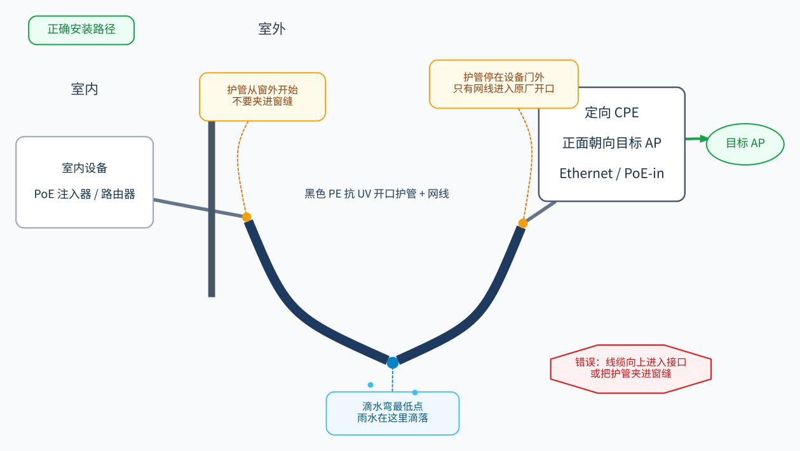

# 外部 Wi-Fi 接入本地网络

把外部 Wi-Fi 接入本地网络时，由 station（无线客户端）连接上游 AP，再把网络交给本地有线 LAN、下游 AP、无线 Mesh 或终端。负责上游无线的设备可以只做桥接，也可以同时承担路由、NAT、DHCP、防火墙或 VPN；它可以运行厂商固件、RouterOS、OpenWrt 或其他具备相应无线客户端能力的系统。

这个结构不同于只强调扩大覆盖范围的消费级“无线放大器”：上游关联、本地网关、认证、无线电位置、室内覆盖和链路观测都可以拆到不同设备上。本文说明通用数据路径、认证阶段、无线链路、测量方法、CPE 选型、户外安装和无线 Mesh，并以校园链路记录一次选型过程。OpenWrt 的安装恢复、UCI/wpad、代理实现、状态命令和长期监控见 [OpenWrt 设备管理](openwrt.md)。

## <a id="architecture"></a>设备角色与数据路径

链路由上游 Wi-Fi AP、上游接入设备、本地有线网络和下游终端组成。下游 AP 只负责本地无线覆盖时，应工作在 AP 模式，不再运行第二套 DHCP 和 NAT。


### <a id="roles"></a>AP、station、网关与 CPE

AP 是 Access Point（无线接入点），负责广播 SSID 并让无线终端接入已有局域网。station 是无线客户端，负责连接 AP。网关则负责把一个 IP 网络的流量转发到另一个网络；在家庭和小型网络中，它通常还同时提供 DHCP、防火墙和 NAT。

这三者是网络角色，不是互斥的设备类别。CPE（Customer Premises Equipment，用户侧设备）同样是部署角色，不代表固定功能集：有的 CPE 只是 AP/Client 网桥，有的提供 WISP 路由和 NAT，RouterOS 或 OpenWrt 设备还可以提供 DHCP、防火墙、VPN 和脚本。判断能力时应看精确型号、固件和许可证，而不是只看商品标题中的“CPE”或“网桥”。

当前拓扑中的对象分工如下：

| 对象 | 主要职责 | 不应承担的职责 |
|---|---|---|
| 外部 AP | 提供上游 Wi-Fi 接入；地址由其所在网络的 DHCP 或其他机制分配 | 不需要为本地网部署配套设备 |
| 上游接入设备 / CPE | 作为 station 连接上游；采用路由方案时还作为本地网关，完成认证、地址获取、转发和链路观测 | 不必同时承担本地无线覆盖 |
| 下游 AP | 把本地有线 LAN 转成室内 Wi-Fi，并扩展网口 | AP 模式下不再运行独立 DHCP/NAT |
| 本地终端 | 从本地网络取得地址并访问上游 | 不直接保存每个上游网络的配置 |

AP 与 station 说明无线连接的方向；路由、NAT 或桥接则说明上下游怎样交换数据。同一设备可以同时承担上游 station 和下游 AP，但若两者共用同一无线电，就会共享信道时间，扫描和重连也会影响本地覆盖。使用不同无线电或独立设备可以避免这种直接争用；实际能否并发仍取决于硬件、驱动和固件。

在 OpenWrt 中，AP 和 station 分别对应 `wifi-iface` 的 `mode='ap'` 与 `mode='sta'`；承载无线 WAN 的逻辑接口通常称为 WWAN，具体对象见 [无线配置与 wpad](openwrt.md#wireless-wpad)。

### <a id="deployment-models"></a>单机、分体与无线 Mesh

角色可以集中在一台设备上，也可以按无线电位置和覆盖需求拆开：

| 部署形态 | 角色组合 | 主要边界 |
|---|---|---|
| 单机 | 同一设备承担 station、网关和本地 AP | 配置和状态集中；共用同一 radio 时，上下游共享信道时间，扫描或重连会影响本地终端 |
| 分体 | 一台设备承担 station/网关，另一台设备只做下游 AP | 上游接入和室内覆盖可分别选位置与无线电；无线关联质量需要从下游 AP 单独采集 |
| 分体加无线 Mesh | 窗边设备承担上游接入和网关，室内主节点与卫星节点使用无线回程 | 不要求房间间预埋网线；双频设备的回程与终端共享无线电时间 |

下游 AP 可以放在适合室内覆盖的位置，上游接入设备或定向 CPE（Customer Premises Equipment，带定向天线、用于连接远端 AP 的用户侧无线终端）则可以放在上游信号最好的位置，两者用网线连接。玻璃、金属窗框和墙体会改变衰减与反射，几十厘米的位置变化也可能明显改变实际链路；扫描信号强度只能作为选点线索，最终仍要通过关联、DHCP、重传、上下行吞吐和连续延迟验证。

### <a id="routing-bridging"></a>路由、桥接与伪桥接

普通 Wi-Fi station 的客户端帧不能自动把网线后方多个终端的 MAC 透明送给上游，因此最通用的实现是建立独立子网并路由转发。OpenWrt 的[无线客户端配置](https://openwrt.org/docs/guide-user/network/wifi/connect_client_wifi?rev=1705097879)是这一路径的一个具体实现。

WDS/四地址桥接是在无线帧中保留下游终端身份的透明桥接方式，需要两端兼容；`relayd` 则用代理 ARP 等三层机制模拟同一网段。RouterOS 的 `station-pseudobridge` 是另一种兼容非 MikroTik AP 的折中：它对 IPv4 做 MAC 地址转换，并只为其他协议保留一个默认下游 MAC。官方文档明确把它限定为单个下游设备或没有更好桥接方式时的方案，并建议能路由时优先使用普通 `station`。

| 模式 | 上游看到的身份 | 下游地址 | 上游要求 | 适用边界 |
|---|---|---|---|---|
| 路由 + NAT | 上游接入设备的无线地址和 MAC | 本地独立子网 | 标准 AP | 公共网络、企业网络、Wi-Fi 转网线 |
| WDS / 四地址桥接 | 下游终端原始 MAC | 上游网段 | AP 与 station 双方兼容四地址 | 自己管理两端设备的桥接链路 |
| `relayd` | 由代理 ARP 等机制模拟 | 通常为上游网段 | 不要求 WDS | 必须保留上游地址、且能接受复杂排障 |
| RouterOS `station-pseudobridge` | IPv4按学习表转换；其他协议主要映射一个下游MAC | 通常为上游网段 | 标准802.11 AP | 后方只有一个路由器WAN口时较合适；非IPv4和多设备透明性有限 |
| RouterOS `station-pseudobridge-clone` | station使用指定或首个下游设备的MAC关联 | 通常为上游网段 | 标准802.11 AP | 让单个下游设备看起来直接关联上游；更换设备会改变无线身份 |

> Linux wireless 文档要求 AP 和客户端双方都启用四地址帧才能透明桥接；厂商的 proprietary bridge 模式也可能无法跨品牌工作。OpenWrt 的 [WDS](https://openwrt.org/docs/guide-user/network/wifi/wifiextenders/wds?rev=1746783203)和 [`relayd`](https://openwrt.org/docs/guide-user/network/wifi/relay_configuration?rev=1752850857)文档说明 OpenWrt 路径；MikroTik 的 [Wireless Station Modes](https://help.mikrotik.com/docs/spaces/ROS/pages/122388518/Wireless+Station+Modes)说明标准三地址帧、伪桥接和 clone 的边界。

### <a id="nat-gateway"></a>NAT、默认网关与代理位置

企业无线认证、NAT、代理和室内 Mesh 不必运行在同一台设备上。无线关联阶段的认证必须由拥有 station 的设备完成；NAT和透明代理则必须位于本地终端的实际默认网关或转发路径上。

| 组合 | 上游接入设备 | 默认网关 / NAT | 本地覆盖 | 主要边界 |
|---|---|---|---|---|
| CPE路由 | CPE完成关联和EAP | CPE | 下游AP或Mesh只桥接 | 链路最标准；代理能力取决于CPE固件 |
| CPE伪桥接 | CPE完成关联和EAP | 下游路由器 | 下游路由器同时做Mesh主节点 | 一层NAT；伪桥接与CPE管理路径需要验收 |
| CPE加独立网关 | CPE完成关联和EAP，可桥接或路由 | 独立OpenWrt/x86网关 | 厂商AP/Mesh | 可以同时保留完整透明代理和厂商Mesh，代价是增加设备 |
| CPE路由加下游路由 | CPE | CPE和下游路由器各一层 | 下游路由器Mesh | 双重NAT；普通网页通常可用，端口映射和P2P更复杂 |

RouterOS v7可以把整个LAN路由进WireGuard，RouterOS v6/v7也可使用各版本支持的OpenVPN或IPsec，因此“路由器级代理”如果实际是路由型VPN，不一定需要OpenWrt。Mihomo、sing-box、Clash订阅、VLESS/Hysteria2节点和基于域名的透明分流则需要相应代理核心；Lite5这类小型RouterOS CPE不能直接提供这套软件生态。OpenWrt的VPN、PBR和透明代理实现见[局域网流量的统一出口](openwrt.md#lan-egress)，Mihomo的TUN、DNS和规则边界见[Mihomo / Clash](mihomo.md)。

### <a id="downstream-ap"></a>下游 AP、双重 NAT 与设备可见性

若上游接入设备已经在无线 WAN 与本地 LAN 之间做 NAT，下游路由器继续以 WAN 路由模式接入，就会形成双重 NAT。普通网页访问通常仍能工作，但端口映射、P2P、部分游戏和跨网段设备发现会变复杂。

设备可见性也会随模式改变。下游设备工作在 AP 模式时，会透明桥接 Ethernet 与 Wi-Fi；无线终端直接从上游网关取得地址，并把出网流量交给这个网关。下游设备若保持路由/NAT 模式，上游网关通常只能看到下游路由器的 WAN 身份，无法逐台区分其后方终端。OpenWrt 的 [Bridged AP 文档](https://openwrt.org/docs/guide-user/network/wifi/wifiextenders/bridgedap)明确把 AP 定义为只桥接有线 LAN 与 SSID，不承担路由、DHCP、DNS 或防火墙。

下游设备进入 AP 模式后的目标状态是：

- DHCP 由上游接入设备提供；
- 所有终端位于同一本地 LAN 子网；
- 下游设备只做 Wi-Fi AP 和交换机；
- 上游接入设备的管理地址可从下游 Wi-Fi 直接访问；
- 网线接法按下游设备的 AP 模式说明决定，不能假设一定使用 WAN 或 LAN 口。

切换后应分别检查终端地址、默认网关、DNS、上游接入设备的管理页和公网访问。只看到下游 SSID 不代表 AP 模式已经正确完成。

OpenWrt 上的 station、WWAN、防火墙、回退和重启验收见[外部 Wi-Fi 上联配置](openwrt.md#wifi-uplink)。

## <a id="authentication"></a>上游认证与网络身份

外部 Wi-Fi 的链路层关联、网络层地址和上层认证是三个阶段。排障时应先判断失败发生在哪一层，不能把“拿不到 DHCP”误判成 Portal 问题。

### <a id="auth-stages"></a>无线关联、地址获取与上层认证

上游网络可能组合多种认证方式，它们不是互斥的产品类型：

| 认证位置 | 常见方案 | 链路设备需要的能力 | 成功标志 |
|---|---|---|---|
| 无线关联与加密 | 开放网络、WPA2/WPA3 Personal | station 与相应密码套件 | 已关联到目标 AP |
| 无线接入控制 | WPA2-Enterprise、PEAP、TTLS、TLS | EAP supplicant（无线客户端认证程序）、账号或客户端证书、服务器证书校验 | EAP 成功并进入可获取地址的状态 |
| 取得地址之后 | Captive Portal | DHCP、HTTP 跳转以及浏览器或登录脚本 | Portal 会话放行实际流量 |

例如开放网络可以在关联后再要求 Portal，Personal 网络也可能叠加网页认证。仅看到 Wi-Fi 已连接，不能证明 DHCP、Portal 或公网访问已经成功。

桥接设备也必须处理无线关联阶段。CPE不是把原始无线电波直接变成网线；它先作为station完成802.11关联、加密和EAP，再把已经解密的以太网帧交给下游。Eduroam的PEAP发生在这一步，因此桥后的OpenWrt、BE3600或电脑不能替一个不支持EAP的CPE完成认证。

### <a id="portal"></a>Captive Portal 与共享会话

Captive Portal 是“连上 Wi-Fi 后，再由网页完成的强制认证门户”。开放热点通常先完成无线连接和 DHCP，再通过 HTTP 重定向进入 Portal。路由 + NAT 后，上游通常只看到上游接入设备的无线地址和 MAC，因此一次认证可能供多个下游终端共享。

这个行为取决于 Portal 是否绑定 MAC、IP、Cookie、账号、设备数或其他特征，必须现场验证。稳妥流程是：

1. 从下游终端访问一个纯 HTTP 页面；
2. 完成 Portal 认证；
3. 用另一台终端验证是否共享；
4. 重连和会话过期后再次验证。

直接打开某个已知 Portal IP 可能进入错误的认证系统，或因系统无法反查当前 MAC 而失败。应优先让目标网络自己的 HTTP 重定向给出入口。

若 Portal 把无线 MAC 当作设备身份，随机 MAC、MAC clone 或更换无线接口都会影响会话。需要稳定复用会话时应保持上游 MAC 稳定；只有网络策略允许且原设备已经离线时才考虑克隆，避免两个在线设备使用同一 MAC。

### <a id="enterprise-auth"></a>WPA2-Enterprise 与 Eduroam

WPA2-Enterprise 是基于 802.1X（端口接入控制框架）的企业 Wi-Fi 认证，由账号、证书和 EAP（Extensible Authentication Protocol，可扩展认证协议）共同完成。PEAP 是把账号认证放进 TLS（Transport Layer Security，加密通道）的 EAP 方法，MSCHAPv2 则常作为隧道内的用户名/密码认证。

链路设备需要同时具备station模式、目标EAP方法、内层认证和服务器证书处理能力。只写“支持WPA2”通常表示Personal预共享密钥，不足以证明支持WPA2-Enterprise。OpenWrt 的完整 wpad 变体、具体包名和 UCI 字段见 [无线配置与 wpad](openwrt.md#wireless-wpad)。本节只确认三个结果：EAP成功、上游接口取得地址、服务器证书按预期处理。

Eduroam是这类网络的常见实例。账号格式、EAP方法、CA和服务器域名由用户所属机构决定，不能把另一所学校的参数直接套用。一次EAP成功后，下游仍需经过DHCP或其他地址配置才能进入IP网络。

### <a id="certificates"></a>服务器证书、凭据与 MAC 身份

服务器证书校验不能省略。OpenWrt 25.12.5 的 station 脚本会传递 `ca_cert`、`domain_match` 和 `domain_suffix_match`；上游 [wpa_supplicant 配置](https://w1.fi/cgit/hostap/plain/wpa_supplicant/wpa_supplicant.conf?id=ca266cc24d8705eb1a2a0857ad326e48b1408b20)明确指出，不设置 CA 时服务器证书不会被验证。优先使用受信 CA 加服务器域名限制；无法部署私有 CA 时，可以按该版本支持的格式固定服务器证书：

```text
ca_cert="hash://server/sha256/<certificate-sha256>"
```

证书 pin 会在服务器换证后失效，因此恢复资料中要记录 pin 的来源和更新方法。不要用关闭验证来换取短期连通。

企业账号、热点密码和证书通常会保存在上游接入设备中；OpenWrt 会把相应配置保存为 root 可读。写入时避免让凭据进入 shell 历史、命令参数或调试日志；使用受控输入，并确认备份文件的访问权限。

旧设备或旧无线栈可能只实现PEAP用户名/密码而缺少明确的服务器证书校验。例如RouterOS旧`wireless`包提供PEAP/MSCHAPv2，但其文档中的`tls-mode`明确围绕EAP-TLS描述；不能据此假定PEAP服务器证书已经得到与新`wifi`包相同的验证。遇到这类设备时，应把“能够登录”和“能够安全验证服务器身份”分开评估。

Portal和企业认证也会受到无线MAC变化影响。更换CPE、启用随机MAC或使用`station-pseudobridge-clone`后，上游看到的设备身份可能改变，Portal会话、DHCP租约或网络策略需要重新验证。MAC clone只应在网络策略允许且原设备已离线时使用。

### <a id="upstream-profiles"></a>多上游配置与故障切换

可以保存一条禁用的备用上游配置，主上游失败时手动切换。禁用配置条目只表示内容已保存，**不是自动故障切换**；自动切换还需要优先级、健康检查、认证状态和回切条件。

OpenWrt上的Travelmate可以管理多个上游、自动重连、发现开放热点并调用外部Portal脚本；厂商旅行路由器也可能提供BSSID锁定、MAC策略和登录模式。无论使用哪种实现，切换条件都应区分“听到SSID”“完成关联”“取得地址”“认证后可用”，不能只按RSSI选择网络。

## <a id="radio-metrics"></a>无线链路与漫游

无线信号不能只看一个 RSSI（Received Signal Strength Indicator，接收信号强度指标）数字。不同系统可以提供相同类别的链路指标；OpenWrt 25.12.5 锁定的 [iwinfo `f5dd57a`](https://github.com/openwrt/iwinfo/blob/f5dd57a84cc31a403a1383dd14944fa2e2b5824a/iwinfo_cli.c)分别报告 signal、noise、MCS、NSS 和信道宽度，并按 `signal - noise` 显示 SNR（Signal-to-Noise Ratio，信噪比）。

### <a id="propagation"></a>距离、遮挡与自由空间损耗

无遮挡只表示路径上没有明显实体，并不消除距离造成的扩散损耗。ITU-R P.525给出的自由空间传播关系表明，在频率不变时距离翻倍约增加6dB路径损耗；在100米、5GHz附近，自由空间损耗约为86dB。这个数值只描述理想路径，不包含AP天线方向、墙体、玻璃、树木、金属窗框和多径。

建筑材料造成的实际损耗依频率、厚度、含水量、入射角和镀层变化。普通玻璃与带金属膜的Low-E玻璃不能视为同一种材料；现场若出现“开窗可见、关窗几乎消失”，只能确认窗体路径造成显著附加损耗，不能仅凭RSSI反推出玻璃材质或精确dB。

几十厘米的位置变化也可能改变反射路径、菲涅尔区遮挡和天线附近金属耦合。选点时应横向和垂直移动设备，用稳定后的RSSI、SNR、重传和第一跳延迟寻找可重复的峰值，不以一次瞬时读数决定安装点。

> 自由空间传播公式见[ITU-R P.525](https://www.itu.int/rec/R-REC-P.525/en)。材料损耗若要量化，应使用目标频率和类似结构的测量报告；本文不提供一张对所有玻璃和墙体通用的固定损耗表。

### <a id="antenna-orientation"></a>天线方向、极化与多径

常见棒状偶极天线的主要辐射方向位于天线侧面，轴向尖端附近是低增益方向。把天线尖端直接指向远端AP通常不是正确“瞄准”方式；保持棒体竖直时，其主要覆盖面大致位于水平方向，朝上或朝下不会改变极化方向。

极化是否匹配取决于双方天线设计和安装，不能仅凭“校园AP”推断固定极化。多天线设备还会利用MIMO和多径；远距离弱链路可先比较全部竖直、不同机身朝向和少量位置移动，再以实际SNR、空间流和重传选择，而不是把某一姿态写成所有设备的固定答案。

天线附近的墙体、金属窗框、空调外机、栏杆和电源部件会改变方向图。安装时应让天线或CPE正面朝目标方向，避免机身和大面积金属挡在主要路径上，并给支架留出调整角度的空间。

### <a id="rssi-snr"></a>RSSI、噪声与信噪比

| 指标 | 含义 | 使用方式 |
|---|---|---|
| signal / RSSI | 接收信号强度，单位 dBm（相对 1 mW 的对数功率单位） | 越接近 0 通常越强，但不能单独判断双向质量 |
| noise | 接收机看到的噪声底，同样使用 dBm | 越低代表背景噪声越弱 |
| SNR | `signal - noise`，单位 dB | 决定可用调制余量，需和重传、MCS 一起看 |

例如某次现场状态为 `signal=-79 dBm`、`noise=-91 dBm`，按 iwinfo 口径 SNR 约为 12 dB；同时上行降到较低 MCS并出现大量重传。这个例子说明弱信噪比与降速同时发生，不构成所有设备通用的阈值表。RSSI只能给出接收功率，无法单独推出网速上限；还需要噪声、信道宽度、空间流、调制、重传和对端能力。

### <a id="phy"></a>信道宽度、空间流、MCS 与 PHY

- **信道宽度**表示一次使用多少频谱，例如 20、40 或 80 MHz。更宽可以提高容量，也更容易受到同频资源和监管范围限制。
- **NSS（空间流数）**表示并行发送的独立数据流数量。NSS 1 与 NSS 2 的可用容量不同，但能否使用多流取决于双方天线、信道和链路条件。
- **MCS（调制编码方案索引）**表示每个符号承载的数据量和纠错强度。较低 MCS 更稳健、速率更低；较高 MCS 需要更好的信噪比。
- **PHY rate（物理层速率）**是无线电当前使用的底层传输档位，不是应用实际可用带宽。

现场曾观察到 `40 MHz / NSS 1 / VHT-MCS 0–2`，驱动报告的 PHY 上行在十几到数十 Mbps 间变化。这个组合描述的是当时协商档位，不是可直接套用到其他标准、GI（guard interval，保护间隔）或设备的固定换算表。

驱动的`expected throughput`通常是根据当前档位、重传和实现内部状态计算的估计值，可能显示出不是标准802.11档位的数值。它适合观察趋势，不能替代主动下载或NDT7。

### <a id="retries-throughput"></a>重传、延迟、丢包与吞吐

应用吞吐低于PHY速率是正常现象：无线需要前导码、帧间隔、信道竞争、确认帧和重传，而且收发共享空口时间。不同标准、聚合大小、干扰和业务方向会改变效率，因此不能用固定百分比把PHY直接换算成网速。

重传指标解释链路为什么“协商速率不低，实际网速却很差”：

- `tx retries`：发送需要重试的次数；
- `tx failed`：最终未被确认的发送；
- packet loss：在更上层测到的丢包；
- latency/jitter：排队、退避和重传造成的时延与波动。

累计重试计数必须比较一段时间内的增量，不能只看开机以来的绝对值。

端到端网速还会受到上游账号策略、AP负载、内部路由、公共出口和测速服务器限制。无线链路改善后若PHY、重传和第一跳都恢复正常，而应用吞吐仍平坦贴近固定值，才继续验证策略限速；不能因一次低速测试就把原因归给AP负载或账号。

### <a id="roaming"></a>WNM、能力变化与漫游缓存

OpenWrt/hostapd 使用以下名称描述不同代际能力：

| 名称 | 对应标准 | 常见能力范围 |
|---|---|---|
| legacy | 802.11a/b/g 等 pre-HT 速率 | 不使用 HT/VHT/HE 的旧式速率与能力表示 |
| HT | 802.11n | 20/40 MHz、MCS 与多空间流 |
| VHT | 802.11ac | 更宽信道和更高阶调制 |
| HE | 802.11ax | 更高效率的多用户和调度能力 |

legacy 不是 HT/VHT/HE 同一命名体系里的新一代标准，而是驱动对“不带这些高吞吐能力”的旧模式的统称。日志写 `VHT -> legacy` 时，只能确定客户端当时不再看到 VHT/HT 能力；它不自动证明 AP永久降级，也可能来自瞬时 beacon 不一致、信道切换或驱动解析结果。

模式名称本身不是质量分。若同一 BSSID 的能力广播在 VHT、HT 或 legacy 间异常变化，客户端驱动可能重建关联；是否断开取决于 AP、驱动和实现。

WNM（Wireless Network Management，无线网络管理）允许 AP 或网络控制器（controller，集中管理多台 AP 的系统）向客户端发送管理建议。BSS Transition Management 是其中用于引导客户端选择其他 AP 的机制；`Disassociation Imminent` 则表示当前 AP预告即将断开。

完整 wpa_supplicant 构建会处理这类通知。上游 [WNM 实现](https://w1.fi/cgit/hostap/plain/wpa_supplicant/wnm_sta.c?id=ca266cc24d8705eb1a2a0857ad326e48b1408b20)记录了相应事件。客户端可以选择候选 AP或拒绝部分请求，但不能阻止上游发送通知。

企业网络每次漫游都重新完成完整 EAP 会增加中断时间。下面几种机制尝试复用或提前准备认证结果：

| 机制 | 人话解释 | 依赖 |
|---|---|---|
| PMKSA caching | 记住已经和某个 AP协商出的主密钥 | 客户端与 AP都保留缓存 |
| RSN preauthentication | 还没切换 AP前，先完成下一台 AP的 802.1X/EAP | 同一 ESS、网络和 RADIUS 认证服务器支持 |
| OKC | 把同一组网络里的其他 AP也视为可复用密钥的候选 | 客户端与 AP/网络控制器兼容 |
| 802.11r FT | 使用专门的 Fast Transition 流程快速换 AP | AP/网络控制器广播并配置 FT |

PMKSA 是 Pairwise Master Key Security Association（成对主密钥安全关联）；RSN 是 Robust Security Network（WPA2 使用的安全网络框架）；OKC 是 Opportunistic Key Caching（机会式密钥缓存）；FT 是 Fast Transition（快速切换）。这些机制只可能缩短兼容网络中的重认证，不能阻止 WNM 通知或 AP主动断开。

OpenWrt 25.12.5 的 station 配置接受 `ieee80211r` 并生成 FT key management，但启用前应确认目标网络广播 FT。上游 wpa_supplicant 还支持 `proactive_key_caching=1`，但标准 station UCI 映射中没有同名字段；不要假设未知 UCI option 会自动生效。

定向CPE和BSSID锁定可以降低弱信号、方向性干扰或无意义漫游，但不能阻止控制器发送WNM，也不能修复AP自身能力广播或故障。企业认证缓存只能缩短兼容漫游中的重认证时间。

### <a id="bssid-ht20"></a>BSSID 锁定与 HT20

BSSID 是一台具体 AP无线接口的 MAC 地址。同一 SSID（网络名称）可能由多台 BSSID共同提供。固定 BSSID 可以阻止客户端自动换到同名 AP，但目标 AP故障时也失去自动回退；wpa_supplicant 对固定 BSSID 的漫游请求可能直接拒绝。

HT20 表示把 802.11n 高吞吐模式限制在 20 MHz 信道。它可以作为排查宽信道干扰或 VHT/HT 能力变化的 A/B 变量，但会降低 PHY 上限。本次案例没有完成 HT20 长测，因此不能把它写成通用修复。

把这些指标落实到 OpenWrt 状态命令、分层延迟与下载、NDT7 和 A/B 测试时，见 [OpenWrt 链路诊断](openwrt.md#link-measurement)；事件日志与长期历史见 [网络日志与监控](openwrt.md#link-dashboard)。

## <a id="measurement"></a>链路测量与验证

测量的目标是沿实际数据路径定位瓶颈，并为设备或位置变化建立可复核的A/B对照。先判断无线是否完成双向关联，再判断地址、认证、内部网络和公共互联网；不要用一个测速数字替代整条链路。

### <a id="ab-conditions"></a>可比较的 A/B 条件

每轮只改变一个变量，并尽量保持相同终端、账号、SSID、BSSID策略、测试目标、文件大小和时段：

- 2.4GHz与5GHz；
- 室内、开窗、窗外和不同安装点；
- 自动BSSID与固定BSSID；
- 宽信道与HT20；
- 普通全向路由器与定向CPE；
- CPE路由、伪桥接和下游路由器NAT。

记录中应同时写明设备、位置、频率、信道、认证方式和样本时长。发生在不同日期、不同AP或不同账号状态下的结果只能作为线索，不能直接计算设备增益。

### <a id="association-testing"></a>扫描、关联与双向链路

扫描结果只表示接收端听到了AP的beacon及其中的SSID、BSSID和信道。完整可用链路至少还要验证：

1. station完成关联和必要的EAP；
2. 上游接口取得地址和默认路由；
3. 小包与接近MTU的大包能够通过第一跳；
4. 上行PHY、重传和失败包没有持续触底；
5. DNS、内部服务和公共互联网分别可用。

某个网络扫描RSSI很强，却在关联后一秒内beacon loss或拿不到DHCP，不能被描述为“覆盖很好”。同理，0% ping丢包也不能单独证明持续吞吐正常。

### <a id="layered-testing"></a>分层延迟、下载与基准测试

按路径由近到远选择目标：

| 层次 | 目标 | 回答的问题 |
|---|---|---|
| 本地LAN | 同一局域网内的服务 | 下游AP、网线和本地交换是否正常 |
| 无线第一跳 | 上游默认网关 | 无线双向链路是否丢包或抖动 |
| 同一管理域 | 学校、企业或运营方内部服务 | 接入层、认证后网络和内部路由是否正常 |
| 公共互联网 | 稳定公共IP或外部静态文件 | 公共出口和外部路径是否正常 |
| NDT7等基准 | 测速平台 | 测试时段的端到端应用吞吐和负载延迟 |

ping适合观察延迟和丢包，持续静态文件下载适合观察容量和中断，NDT7适合给端到端基准。三者回答的问题不同。具体OpenWrt命令和主动任务互斥见[OpenWrt链路诊断](openwrt.md#link-measurement)。

### <a id="rate-shape"></a>吞吐曲线与策略限速

总平均速度会掩盖掉线和短时退避。下载期间按秒记录接口字节、RSSI、MCS和重传增量，可以观察速度变化的形状：

- 无线链路不稳通常伴随吞吐抖动、MCS变化、重传增加和延迟尖峰；
- 长时间平坦贴近某个固定值、同时SNR和重传正常，才值得继续验证账号或控制器限速；
- 上游拥塞也会产生波动，因此曲线形状只能帮助缩小范围，不能单独证明策略实现。

若同一SSID在近距离明显更快，而远距离的上行档位和重传同时恶化，距离、遮挡或干扰是更直接的解释。若无线指标恢复后仍维持相同低速，再检查网络策略和出口。

### <a id="stability-testing"></a>稳定性长测与故障事件

永久安装或购买验收不应只依赖20到30个ping包。长测至少覆盖一段真实业务时长，并同步记录：

- signal、noise、SNR、PHY、MCS/NSS和重传增量；
- 第一跳和公网延迟、抖动与丢包；
- WNM、beacon loss、能力变化、EAP、DHCP和重新关联事件；
- 断线开始、恢复地址和业务恢复的时间；
- 主动扫描、测速或配置变更是否与卡顿重叠。

定向CPE的验收应在相同上游和测试目标下与原设备对照。只有到货后的实际A/B才能给出收益；在此之前不写成功概率或承诺网速。

## <a id="dashboard"></a>整网设备可见性与统计

统计“连接这个网络的所有设备”时，要先区分设备清单、经网关流量、无线关联质量和事件历史。它们来自不同位置，没有一个接口能单独给出完整答案：

| 信息 | 网关侧 | AP 侧 | 主要边界 |
|---|---|---|---|
| IP、MAC、主机名、DHCP lease | 主要来源 | 可能只有管理页中的局部信息 | 静态地址和长期离线设备不一定出现在 DHCP lease 中 |
| 经网关的上传、下载和连接 | 可以按终端记账 | AP 模式通常不负责 | 同一 LAN 内直接转发的流量可能不经过网关 |
| SSID、radio、RSSI、关联速率 | 独立 AP 场景下无法推导 | 当前关联 AP 的主要来源 | 只能描述连接到该 AP 的无线终端 |
| 认证、断开、DHCP 和驱动事件 | 网关记录自己处理的事件 | AP 记录自己的关联事件 | 分体部署需要汇总两台设备的日志 |

### <a id="gateway-observation"></a>网关侧的设备与流量

下游设备处于 AP 模式、所有终端使用同一 LAN，并把外部流量交给同一网关时，网关可以逐台观察终端，而不是只看到 AP。设备清单通常要合并 DHCP lease、邻居表和近期流量：

- DHCP lease 提供已分配地址、MAC、主机名和租期，但不覆盖静态地址；
- IPv4 ARP / IPv6 neighbour 表提供同一链路上近期出现的 IP 与 MAC 绑定，动态条目会随可达性状态和缓存回收而变化；
- 经 conntrack 路由的流量可以按 IP/MAC 做累计记账，但没有产生这类流量的设备不会自动出现。

OpenWrt 的具体状态来源见 [设备、接口与客户端状态](openwrt.md#network-state)，现成采集器见 [OpenWrt 采集组件](openwrt.md#monitoring-collectors)。

### <a id="ap-observation"></a>AP 侧的无线关联

RSSI、当前收发速率、连接时长和重传等信息来自终端实际关联的 AP。若同一台 OpenWrt 同时承担网关和 AP，这些数据可以在一台设备上读取；若使用独立 AP，则必须从该 AP 的 API、SNMP、日志或 exporter（把设备状态转换为监控指标的采集端）采集。

网关只能看到从 AP 桥接过来的以太网帧，不能据此反推出每台终端的无线信号和 MCS。独立 AP 的原厂固件若没有可用的状态接口，网关侧仍能统计终端地址和经网关流量，但无法补齐无线关联质量。

### <a id="observation-boundaries"></a>设备记录、在线状态和流量统计范围

分体部署时，同一台手机会在网关和 AP 上留下两份不同的记录：

| 来源 | 可能记录的内容 |
|---|---|
| 网关 | `MAC=A`、`IP=192.168.1.23`、主机名、DHCP 租期，以及经网关的上传和下载量 |
| AP | `MAC=A`、连接的 SSID 和频段、RSSI、关联速率、连接时长和重传 |

两边出现相同 MAC，且采集时间重叠时，可以把它们合成一条设备记录。IP 会随 DHCP 变化，主机名也可能修改或重复，因此应同时保存记录来源、首次看到时间和最后看到时间，不能只靠 IP 或主机名合并。

MAC 本身也不是永久设备编号。手机可能为每个 Wi-Fi 使用私有 MAC 地址（系统为保护隐私生成的地址）；忘记网络或启用周期轮换后，同一台手机会以新 MAC 再次出现。Apple 的 [Private Wi-Fi Address](https://support.apple.com/en-us/102509)就支持固定和周期轮换地址。因此监控页面应把 MAC 表述为“当前观察到的网络身份”，不要直接等同于永久设备或使用者。

网关流量只统计经过网关的通信。例如手机访问互联网时，流量会经过网关；手机向同一 LAN 中的 NAS 备份文件时，AP 或交换机可以在本地直接转发，网关可能完全看不到。若要统计这部分局域网流量，还需要 AP、交换机端口计数、流量镜像（把端口流量复制给监控设备）或其他二层采集，不能只依赖 `nlbwmon`。

“在线”也不能只看一项数据：

| 观察结果 | 实际含义 |
|---|---|
| AP 显示已关联 | 无线终端此刻仍连接该 AP |
| neighbour（邻居表）状态为 reachable | 网关近期确认终端可达 |
| neighbour 状态为 stale | 记录暂未刷新，不等于设备已经离线 |
| DHCP lease 尚未到期 | 地址租约仍有效，不证明设备此刻醒着 |
| 所有采集数据同时中断 | 可能是采集器或网络故障，状态应为“未知”，不能判定所有设备离线 |

因此设备页面至少应区分“当前连接”“最近看到”“离线”和“采集状态未知”，并始终显示最后更新时间；采集断档期间不沿用旧值伪装实时状态。

## <a id="cpe"></a>定向 CPE 的能力与选型

定向CPE是把无线客户端、定向天线、室外外壳和网口组合在一起的用户侧设备。它把接收和发射集中到目标方向，适合改善长距离、遮挡或方向性干扰造成的链路预算；它不能改变上游账号策略、WNM通知、AP能力广播或公共出口。

### <a id="cpe-role"></a>CPE 角色与功能范围

CPE不是“把无线信号原样变成网线”的无状态转换器。它必须先完成无线扫描、关联、加密和必要的EAP；之后才以桥接或路由方式交付数据。不同固件提供的功能差异很大：

| 固件形态 | 常见能力 | 主要边界 |
|---|---|---|
| 监控网桥固件 | AP、Client、WDS、信号状态 | 可能没有NAT、DHCP、企业EAP或VPN |
| WISP/旅行路由固件 | station、NAT、DHCP、防火墙、Portal辅助 | EAP、证书、脚本和恢复能力随型号变化 |
| RouterOS | station、路由/NAT、DHCP、防火墙、RouterOS v7的WireGuard、脚本 | 不能直接等同于Mihomo/OpenClash软件生态；版本、许可和无线包影响功能 |
| OpenWrt | station、完整wpad、路由、代理包、状态接口 | 必须有精确设备支持，闪存/RAM还要容纳目标软件 |

RouterOS旧`wireless`包的[安全配置](https://help.mikrotik.com/docs/spaces/ROS/pages/8978446/Wireless+Interface)列出`wpa2-eap`、PEAP、EAP-TTLS/MSCHAPv2以及station使用的用户名和密码字段；新`wifi`包另有自己的EAP与证书选项。购买前应按设备实际无线包核对，而不是只看RouterOS版本号。

RouterOS v7提供WireGuard。仍运行v6的设备如需使用WireGuard，应先备份配置并按[官方迁移说明](https://help.mikrotik.com/docs/spaces/ROS/pages/115736772/Upgrading+to+v7)升级到v7，再按[WireGuard文档](https://help.mikrotik.com/docs/spaces/ROS/pages/69664792/WireGuard)完成配置。

### <a id="single-pair"></a>单台 station 与成对网桥

| 目标 | 本地设备数量 | 对端要求 |
|---|---:|---|
| 连接现有标准AP，再本地路由/NAT | 一台CPE | 对端提供标准Wi-Fi |
| 建立自己管理的透明点对点桥 | 通常两台配套设备 | 双方兼容四地址、WDS或厂商协议 |

连接校园、酒店或公共AP时，只需要本地一台支持标准station的CPE。“必须买一对”适用于自己建设两端链路，不适用于连接已经存在的AP。某些成对监控网桥也允许把其中一台改为普通Client，但必须从手册确认它能扫描并选择任意SSID。

### <a id="cpe-firmware"></a>桥接固件、路由固件与企业认证

开放Portal网络只要求CPE先完成开放关联，网页认证可以由下游终端或网关处理；Eduroam等WPA2-Enterprise网络则要求CPE自身支持PEAP/TTLS/TLS、内层认证和证书处理。桥后OpenWrt不能替一个不支持EAP的CPE完成链路层认证。

OpenWrt支持也要落实到精确型号和硬件版本。设备出现在Firmware Selector只证明存在官方镜像；小闪存CPE即使能启动OpenWrt，也未必能容纳完整wpad、Mihomo、sing-box和大型规则数据库。RouterOS设备则应核对旧`wireless`包与新`wifi`包支持的EAP和证书选项。

### <a id="cpe-radio"></a>频段、信道、增益与波束宽度

“5 GHz CPE”不保证覆盖所有 5 GHz 信道。不同地区和 SKU（具体销售型号/地区版本）可能只开放部分 5.2/5.8 GHz 范围；购买前先扫描现场 AP 的信道，再核对设备的精确频率范围和监管区域。

5.15–5.25GHz和5.735–5.835GHz都属于日常所称的5GHz Wi-Fi频段，只是中间信道受地区监管、DFS和产品认证影响。型号宣传中的“5G”还可能指蜂窝移动网络，购买时应确认写的是5GHz 802.11无线网桥，而不是插SIM卡的5G CPE。

EIRP（Equivalent Isotropically Radiated Power，等效全向辐射功率）把发射功率和天线增益合并表示。定向天线的接收增益会提高目标方向的信号并抑制其他方向干扰；发射侧受监管和固件功率控制，不能把标称天线增益简单等同于上行增加相同dB。

波束宽度是相对主轴下降到指定功率处的角度，通常以半功率宽度表示。宽波束更容易覆盖未知AP方向和安装误差，窄波束通常能提供更高增益和更强方向性，但需要精确寻找AP。距离只有100米并不自动意味着应选择极窄波束；AP位置是否已知、反射路径和支架可调范围同样重要。

按平面几何估算，距离为`d`、全波束角为`θ`时，半功率覆盖宽度约为`2d·tan(θ/2)`。在100米处，37°水平波束约覆盖67米，31°垂直波束约覆盖56米；这只是方向图尺度，不表示范围内信号完全相同，也不包含旁瓣和反射。

### <a id="cpe-management"></a>初始配置、管理地址与 BSSID

CPE应先在室内桌面上配置，再安装到室外。常见流程是把电脑接到PoE注入器的LAN/DATA口，给电脑设置与设备管理地址同网段的静态地址，登录Web、WinBox或SSH，完成管理员密码、国家/频率、station、EAP和管理地址配置。

管理IP只用于配置设备，不一定是下游终端的默认网关：

- CPE处于路由模式时，管理IP通常也是本地LAN网关；
- CPE处于桥接或伪桥接模式时，默认网关位于下游路由器或上游网络；
- 下游路由器做NAT后，位于其WAN侧的CPE管理地址可能无法从LAN直接访问，需要静态路由、管理VLAN或临时直连。

同一SSID可能有多台BSSID。扫描时应记录候选BSSID、频率和信号；固定BSSID能避免无意义漫游，但目标AP故障时也失去自动回退。先保存自动选择配置，再把固定BSSID作为可回退的A/B变量。

### <a id="cpe-checklist"></a>购买前检查与退换边界

购买前核对：

- 现场信道是否在设备频率范围内；
- station/WISP（以 Wi-Fi 作为 WAN）模式是否可用；
- WPA2-Enterprise/EAP 与证书验证是否满足上游；
- 精确型号、硬件版本、国际版/地区版和OpenWrt支持状态；
- 固件是否提供桥接、伪桥接、NAT、DHCP、VPN和管理路径；
- 网口速率、PoE电压和供电方式；
- 天线增益、波束宽度和安装方向；
- 是否能固定 BSSID、导出日志、备份配置，并通过恢复网页、备用分区或其他明确入口从错误配置和升级失败中恢复；
- 是否保留可退换或现场试用条件。

CPE更可能改善弱信号、低SNR、高重传和方向性干扰。它不能保证消除AP发出的WNM通知、AP能力广播异常、账号限速或公共出口拥塞。应使用[链路测量与验证](#measurement)中的同目标A/B判断收益。

## <a id="outdoor-installation"></a>室外安装与穿窗布线

户外可靠性由设备外壳、接口朝向、供电附件、线缆护套、机械固定和建筑条件共同决定。IP等级不能替代正确安装；标为室外的CPE也不应浸水或让水沿网线直接进入接口。

### <a id="weatherproofing"></a>防护等级、外壳与凝露

不少定向CPE本身就是带一体化天线的室外设备。例如[SXTsq Lite5](https://mikrotik.com/product/RBSXTsq5nD)官方称其为weatherproof outdoor device；其他型号可能标为IP54、IP55或IP65。防护能力必须按精确型号核对，不能由“CPE”这个类别推断统一等级。原生室外CPE应按厂商方向安装、关闭接口盖并让接口朝下，通常不需要再放进密封箱；IP54/IP55/IP65也不表示设备可以浸水。[IEC 60529](https://webstore.iec.ch/en/publication/2452)定义的是外壳在规定试验条件下的防护等级。

把普通室内路由器临时放到室外时，才需要单独的非金属户外箱。PC或ASA常用于耐候外壳；金属箱会屏蔽无线。箱体还要处理遮阳、透气或排水、线缆格兰头和内部散热，不能只靠“完全密封”解决问题。长期方案仍应优先使用原生室外CPE。

外壳对无线的影响取决于材料、厚度、频率、含水状态，以及它与天线的相对位置。金属会强烈反射和屏蔽无线；薄而干燥的非金属外壳通常影响较小，但“塑料”或“黑色”本身不能保证射频透明，紧贴一体化天线的箱体还可能改变方向图。开口PE护管只包住CPE下方的网线、没有遮住天线正面时，信号影响通常不是首要变量；把整台定向CPE装进额外防水箱则需要在同一位置比较安装前后的RSSI、SNR、重传和吞吐。

> [ITU-R P.2040-4](https://www.itu.int/rec/R-REC-P.2040-4-202509-I/en)汇总建筑材料的电磁参数和传输损耗，[NISTIR 6055](https://doi.org/10.6028/NIST.IR.6055)还在0.5–2GHz和3–8GHz测量了不同厚度及含水状态的材料。两者共同说明外壳损耗必须结合材料、结构、频率和受潮状态判断，不能给所有塑料箱套用一个固定值。

### <a id="poe"></a>主动 PoE、被动 PoE 与供电附件

PoE只是“数据和直流电共用网线”的总称，不同制式不能混接：

| 类型 | 送电方式 | 典型设备行为 |
|---|---|---|
| IEEE 802.3af/at/bt主动PoE | 先检测和协商，再按标准电压送电 | 未识别到标准PD时通常不供电 |
| 被动PoE | 注入器按固定电压和极性直接送电 | 无协商保护；电压、极性和引脚错误可能损坏设备 |

PoE injector（注入器/合路器）把电源加入网线，通常有LAN/DATA、PoE和DC/AC输入；splitter（分离器）在设备端把PoE拆成独立数据和DC插头。商家可能把两者都称作“PoE分离器”，应根据端口和数据方向判断。

优先使用设备随附或厂商认可的电源和PoE注入器。替代电源不能只比较电压和额定电流，还要同时核对稳压输出、极性、Passive PoE引脚、连接器、隔离与安全认证以及持续功率；更高的电流额定值只表示电源可提供的上限，不单独证明兼容。

Omada [POE170S规格](https://www.omadanetworks.com/us/business-networking/omada-accessory-poe-adapter/poe170s/#specifications)明确说明它是最高60W的802.3af/at/bt主动PoE，并且不兼容Passive PoE及其他非标准设备。因此它不能直接替代Lite5或TP-Link监控网桥附带的24V被动PoE注入器。

### <a id="outdoor-cable"></a>网线外皮、开口护管与穿窗段

Cat5e/Cat6描述传输性能，不代表外皮耐候。白色PVC跳线适合室内；完好外皮不会因为普通雨淋立即失效，但长期日晒、冷热循环和机械摩擦仍会使不具备户外等级的材料老化。黑色PE或明确标注Outdoor/UV Resistant的护套更适合长期日晒；颜色本身不能替代抗UV规格。室外只有约0.5–1米、设备功率较低时，抗UV、8芯导通、接头完整和不被窗框剪伤比“必须纯铜”更重要；长距离PoE才需要重点核对AWG、导体电阻和铜包铝压降。

已经铺好的完整网线不必为了短距离室外暴露段重新压接。可以购买不含网线的黑色PE抗UV开口波纹管，从侧面掰开后把现有网线塞入，主要增加防晒和轻度机械保护；开口护管本身不防水、不提高网线的户外等级，也不能修复已经破损的外皮。内径和长度应按实际线径、弯曲路径和设备接口空间选择，不把某个案例尺寸写成通用规格。

安装顺序是：

1. 穿过窗缝的位置仍使用能安全关窗的扁平线、已有孔洞或规范开孔；更粗的波纹管从窗外受夹点之后才开始。
2. 掰开护管，把现有网线从侧面压入；让开口朝下或朝侧面，避免形成向上积水的槽。
3. 让网线和护管一起在CPE接口前形成一个小滴水弯。护管默认在原厂Ethernet门外终止，只有网线按设备原设计穿过开口；任何做法都必须保证门能完整关闭、排水方向正确且不违反线缆弯曲半径。
4. 用黑色且明确标注抗UV的扎带承托户外段，在护管两端用少量自融防水胶带或自粘橡胶带固定开口；胶带只固定兼容的过渡处，不把开口护管伪装成密封管。扎带只固定线缆，不承担CPE重量，也不要勒紧网线。

普通透明胶带没有长期户外固定所需的耐候性，日晒后容易失去黏性或脆裂。不要用胶带或护管包裹整台CPE：原生室外CPE应依靠自身外壳和接口盖防护，包裹会妨碍散热、排水、检查和维护。护管也不能解决关窗夹线问题；加装后反而更粗，因此只套窗外那一段。

所谓“过窗网线”没有统一标准，常见商品只是更薄的8芯扁平跳线。使用现有扁平线前应：

1. 透过水晶头或用1–8灯测试仪确认8芯全通；
2. 在两个千兆设备之间确认能稳定协商1Gbps，以验证四对数据线；
3. 先断电放入窗户密封条，缓慢关窗，检查是否需要额外用力以及是否出现深压痕；
4. 关窗状态再次测试导通和网络；
5. 接入被动PoE后观察接头和受压处是否异常发热。

Lite5自身只有百兆网口，因此千兆测试应在其他两台千兆设备之间完成。扁平PVC线穿出窗外后可以按上面的方式在室外段套抗UV开口护管，但不要把更粗的护管夹在窗缝中。

### <a id="drip-loop"></a>滴水弯、接口朝向与接头防水

滴水弯不是额外管件，而是让网线在进入设备前先向下留出一个U形最低点。雨水沿线缆流到最低点后滴落，不再顺势进入接口。



> 该图由Graphviz 2.43.0根据[DOT源文件](../assets/cpe-drip-loop.dot)生成，不按比例，只表示护管边界和排水路径，不代表完整安装。滴水弯没有统一尺寸；实际只需形成明确低点，同时满足线缆弯曲半径、不拉扯接口且不形成受风摆动的大环。

设备接口应朝下；使用开口护管时，网线与护管一起形成滴水弯，但进入设备密封结构的部分仍按厂商说明处理。完整网线优于室外中间接头；必须转接时使用与接口匹配的户外防水直通件，并把接头放在不积水的位置。普通透明胶带不适合作为长期户外密封；需要包覆时使用自融防水胶带并保留可检查性。

### <a id="mounting"></a>支架、抱箍与安全绳

CPE通常通过抱箍固定到短立杆。窗边方案只能使用有明确额定载荷、抗风条件和防脱设计，并获建筑管理方及当地规范允许的支架；不能夹玻璃、纱窗或排水孔，也不应依赖吸盘、双面胶和普通白色扎带长期承重。

正面朝向目标AP，接口朝下，并与大面积金属窗框、栏杆和空调外机保持适当距离。高空安装应使用独立安全绳连接到建筑结构，即使主支架失效也不会坠落。外墙存在保温层、瓷砖或未知结构时，应由熟悉外墙锚固的人员施工。

> [SXTsq系列安装说明](https://help.mikrotik.com/docs/spaces/UM/pages/14221556/SXTsq-series)要求专业安装、遵守当地及国家电气规范、使用正确安装件，并让设备与人体保持至少20cm距离；设备接地点应连接到塔体或建筑的正规接地系统，以降低ESD和雷击损坏风险。不要把栏杆、暖气管或水管当作临时接地。

## <a id="local-coverage"></a>本地无线覆盖与 Mesh

上游CPE通常位于窗边或室外最佳接收点，室内AP则位于覆盖更合适的位置。没有预埋网线时，可以让窗边主节点通过无线Mesh覆盖其他房间，而CPE与主节点之间只保留一段短网线。

### <a id="ap-backhaul"></a>AP 模式与无线回程

下游设备处于AP模式时，不运行第二套NAT和DHCP，所有终端使用上游网关。厂商Mesh通常要求参与节点运行同一厂商固件；刷入OpenWrt的节点不能直接加入小米等专有Mesh，恢复原厂后才可能重新组网。

如果主节点必须保持路由模式才能建立厂商Mesh，而上游CPE也在做NAT，就会出现双重NAT。另一条路径是让CPE使用伪桥接，把上游地址交给Mesh主路由器；具体选择取决于伪桥接兼容性、AP模式Mesh能力和管理需求。

### <a id="mesh-capacity"></a>双频 Mesh 的信道时间

双频Mesh没有独立回程radio时，5GHz通常同时承载节点回程和终端业务。每一帧需要在回程和接入之间占用空口时间，吞吐和延迟取决于节点间SNR、信道占用、业务方向和重传；不能给所有户型写一个固定折损百分比。

Mesh卫星应放在仍能稳定接收主节点的位置，而不是直接放进最差房间。先确认回程链路，再观察远端终端的实际收益。

### <a id="gateway-mesh-proxy"></a>网关、代理与 Mesh 的角色组合

| 组合 | Eduroam认证 | NAT/默认网关 | 代理能力 | Mesh |
|---|---|---|---|---|
| Lite5路由 | Lite5 | Lite5 | RouterOS v7可做WireGuard等路由型VPN；不能直接运行Mihomo订阅生态 | BE3600可作为AP/Mesh主节点，需实测AP模式组网 |
| Lite5伪桥接 | Lite5 | BE3600 | 取决于BE3600原厂固件 | BE3600路由模式做Mesh主节点 |
| Lite5伪桥接加OpenWrt网关 | Lite5 | 独立OpenWrt设备 | 可运行PBR、sing-box或Mihomo透明代理 | BE3600和原厂AX3000T继续做厂商Mesh |
| Lite5路由加BE3600路由 | Lite5 | 两台设备各一层NAT | 全局VPN可在Lite5；BE3600后方在Lite5看来通常只有一个WAN身份 | Mesh容易保留，但形成双重NAT |
| AX3000T OpenWrt网关 | Lite5或AX3000T，取决于上游方式 | AX3000T | 完整OpenWrt代理生态 | AX3000T不能同时作为小米原厂Mesh节点 |

因此Mesh与路由器级代理不是天然二选一。若Lite5运行RouterOS v7且代理服务端提供WireGuard，它可以作为全LAN VPN网关；若必须使用Mihomo、VLESS、Hysteria2或复杂域名分流，可以在CPE和Mesh之间增加一台双网口OpenWrt网关。设备可以都放在窗边，房间之间仍使用无线回程。

## <a id="campus-case"></a>校园无线接入案例

本案例记录一次实际部署和后续CPE选型，用于展示测量方法怎样改变配置选择。设备、位置、上游策略和测试服务器都只代表当时条件；已实测、已下单和计划验证分别标明。

### AX3000T、BE3600 与上游链路

部署使用一台刷入 OpenWrt 25.12.5 的小米 AX3000T 作为无线接入网关：5 GHz station 连接校园上游，WWAN 加入 WAN 防火墙并做 NAT，三个 LAN 输出独立子网。小米 BE3600 后来成功切为 AP 模式，把网线转换成室内 Wi-Fi并扩展网口，终端直接从 AX3000T 获取地址。

AX3000T 自身不广播本地 SSID。这样无线接入和室内覆盖由两台设备分别承担，不需要同一 radio 同时做上游 station 和下游 AP。

BE3600 处于 AP 模式后，AX3000T 可以逐台看到终端的 DHCP、邻居和经网关流量；若不另外读取 BE3600 的管理数据，AX3000T 仍不知道每台终端在 BE3600 上的 RSSI、关联速率和重传。

住宅没有预埋房间网线，后续目标从“AX3000T与BE3600有线分体”调整为“窗边CPE/网关加室内无线Mesh”。AX3000T已保存完整原厂分区备份，但尚未恢复原厂；恢复后才可能作为小米Mesh节点，BE3600与AX3000T的跨型号无线Mesh仍需实配。

### 2.4 GHz 与 5 GHz 实测

同一位置的受控实连曾得到：

| 频段 | signal | 第一跳大包 | 平均延迟 | 驱动 expected throughput |
|---|---:|---:|---:|---:|
| 2.4 GHz | 约 −54 dBm | 10% 丢包 | 163.6 ms | 约 5.7 Mbps |
| 5 GHz | 约 −65 dBm | 0% 丢包 | 7.0 ms | 约 187.7 Mbps |

2.4 GHz 扫描看起来更强，却有低上行档位和高重传；5 GHz RSSI更弱但双向链路明显更好。后来在另一位置测试两个 2.4 GHz 开放 SSID时，也曾看到约 −65 dBm beacon，却只能关联约一秒，随后 beacon loss、认证超时且拿不到 DHCP。

这些结果说明扫描 RSSI不能替代实连、DHCP、重传和第一跳测试。

固定的当前窗外位置后来复测约为`−81 dBm`、驱动expected throughput约`5.24 Mbps`、主动下载约`2.35 Mbps`；更差时曾出现`−88～−97 dBm`、约6%丢包和62ms平均延迟。旧“好位置”曾达到约`−65 dBm`、第一跳0%丢包和4–7ms，但部分短时公网下载仍只有2–5Mbps。不同测试发生在不同认证和连接阶段，不能由这组数字单独判定账号限速；它们共同证明当前位置无线余量不足。

### Portal 与 Eduroam 实测

开放访客网经下游终端完成 Portal 后，单次 NDT7 曾测得约 14.49 Mbps 下载、18.86 Mbps 上传。这个结果证明 Portal 后的数据路径可用，不代表长期稳定值。

5 GHz eduroam 使用 PEAP/MSCHAPv2和服务器证书 pin 后，实测约为：

| 指标 | 结果 |
|---|---:|
| signal | 约 −74 至 −77 dBm |
| NDT7 下载 / 上传 | 13.14 / 6.57 Mbps |
| 第一跳平均延迟 | 11.5 ms |
| 公网平均延迟 | 48.3 ms |
| 30 包公网丢包 | 0% |

中国科学技术大学的[Eduroam使用指南存档](https://web.archive.org/web/20211027072612id_/https://ustcnet.ustc.edu.cn/2016/0405/c11182a119841/page.htm)记录了PEAP、WPA2-Enterprise、AES和`<网络通用户名>@ustc.edu.cn`格式。旧指南要求Windows关闭服务器证书校验；本次OpenWrt部署改用服务器证书pin，避免把“旧客户端能连通”写成当前安全建议。

另一开放校园网无需再次 Portal 即可访问公网，但同一时段 NDT7 只有约 0.42/1.01 Mbps，第一跳和公网延迟也更高，因此没有被选为主上游。不同上游测试发生在不同连接阶段，不能把这些数字当作严格实验室横评。

Portal的一次认证能否供所有NAT后终端共享，应在最终CPE和网关拓扑上重新验证；更换无线MAC、CPE或NAT位置都可能使原会话失效。Eduroam则由station设备直接完成EAP，不经过浏览器Portal。

### WNM、能力变化与断线

eduroam 运行期间，日志出现 AP发出的 WNM `Disassociation Imminent`。真正断线的两次事件分别表现为同一 AP能力从 VHT 变为 HT，以及从 VHT 变为 legacy；本机 mac80211 驱动随后断开、重新选 AP、完成 EAP 和 DHCP。两次完整恢复约需 5–6 秒；没有真正断线的 WNM 事件也伴随 150–220 ms 延迟尖峰和高重传。

因此故障不是单一“认证慢”：

- 弱信号和重传造成持续抖动；
- AP/网络控制器的漫游引导造成候选扫描；
- AP能力广播变化触发客户端重建关联；
- EAP 与 DHCP 决定完整断线后的恢复时长。

活动 5 GHz radio 的周期扫描后来被关闭，NDT7 改为手动运行，避免监控工具本身制造游戏卡顿。

### CPE 候选与购买快照（2026-08）

选型要求逐步收敛为：5GHz定向天线、单台station、室外外壳、PoE、网口输出、PEAP/MSCHAPv2，以及在无室内布线条件下与本地无线Mesh组合。下面是本次检索和官方规格形成的快照，价格随渠道变化：

| 型号 | 无线与天线 | EAP/系统能力 | PoE与外壳 | 本次价格信息与结论 |
|---|---|---|---|---|
| [TP-Link TL-CPE501](https://www.tp-link.com.cn/product_1770.html) | 802.11ac、11dBi、双百兆；band1/band4 | 原厂Client可连开放/PSK AP；未提供PEAP，Firmware Selector无官方OpenWrt | 24V被动PoE、IP55 | 官方商城双机套装曾为¥337；适合Portal试验，不满足Eduroam |
| [TP-Link TL-S5G-5KM](https://www.tp-linkshop.com.cn/Products/Details/1820) | 802.11ac、14dBi、双千兆 | 监控网桥固件，未提供PEAP或官方OpenWrt | 12–24V被动PoE、IP55 | 官方商城双机套装曾为¥679；增益高于CPE501，仍不满足Eduroam |
| [TP-Link CPE510](https://www.tp-link.com/us/business-networking/pharos-cpe/cpe510/) | 802.11n、13dBi、百兆 | 原厂未见PEAP；v1/v2/v3有官方OpenWrt，但8MiB Flash限制完整代理软件 | 24V被动PoE、IPX5 | 新货公开页面约¥600以上；只有低价二手才有成本优势 |
| [TP-Link CPE710](https://www.tp-link.com/us/business-networking/pharos-cpe/cpe710/) | 802.11ac、23dBi、千兆、窄波束 | 原厂未见PEAP；v1/v2有官方OpenWrt | 24V被动PoE、IP65 | 国内精确SKU和实时价格未可靠核实；射频余量高，成本也高 |
| [MikroTik SXTsq Lite5](https://mikrotik.com/product/RBSXTsq5nD) `RBSXTsq5nD` | 802.11n、16dBi、百兆 | RouterOS旧`wireless`支持PEAP/MSCHAPv2、NAT和DHCP；RouterOS v7支持WireGuard；无官方OpenWrt | 10–30V被动PoE、IP54 | 用户以¥400下单国际版；本案例的成本型选择 |
| [MikroTik SXTsq 5 ac](https://mikrotik.com/product/sxtsq_5_ac) `RBSXTsqG-5acD` | 802.11ac、16dBi、千兆 | RouterOS；有官方OpenWrt，256MiB RAM与16MiB Flash | 10–28V被动PoE、IP55 | 官方标为停产型号；OpenWrt可用，但完整代理软件仍受Flash限制 |
| [MikroTik SXTsq 5 ax](https://mikrotik.com/product/sxtsq_5ax) `SXTsq-5axD` | 802.11ax、16dBi、千兆 | RouterOS新`wifi`包、Level 4；当前Firmware Selector无官方OpenWrt | 12–28V被动PoE、IP55 | 官方建议价$65；新无线栈与存储更充裕，国内价格高于Lite5 |
| [MikroTik LHG 5](https://mikrotik.com/product/RBLHG-5nD) `RBLHG-5nD` | 802.11n、24.5dBi、百兆、窄波束 | RouterOS旧`wireless`支持PEAP/MSCHAPv2 | 11–30V被动PoE、IP54 | 射频增益高，但体积、对准和安装成本更高 |

> MikroTik型号的频率还要区分US锁频版和International版。Lite5国际版官方频率范围为5150–5875MHz，具体可用信道仍受国家配置和法规限制。OpenWrt支持状态是2026-08-18的[Firmware Selector](https://firmware-selector.openwrt.org/)快照，应在购买或刷机前重新核对。

> 来源口径：型号列链接的实时产品页用于进入当前规格；OpenWrt 25.12.5支持状态按固定版本的[ath79 profiles](https://downloads.openwrt.org/releases/25.12.5/targets/ath79/generic/profiles.json)和[ipq40xx MikroTik profiles](https://downloads.openwrt.org/releases/25.12.5/targets/ipq40xx/mikrotik/profiles.json)核对；RouterOS EAP与WireGuard分别以上文链接的官方手册为准。公开价格页面没有全部归档，用户成交价也只能标为用户提供，因此价格只表示本次选购上下文，不是可复核的长期规格。

### SXTsq Lite5 的供电与计划拓扑

已下单设备为`RBSXTsq5nD`，用户提供的成交价为¥400。商家清单写“百兆PoE分离器、24V 0.5A 3C电源、软管卡箍、原装主机”；从数据方向看，这个所谓“分离器”应是把24V加入网线的被动PoE注入器。MikroTik官方包装使用24V 0.38A适配器、PoE injector和金属抱箍；商家电源标为0.5A只说明电流上限更高，不能单独证明其稳压、极性、PoE引脚、连接器和安全认证与原装附件等价。到货后优先使用原装或厂商认可附件，并逐项核对实物标签。

商家和官方清单都没有列出以太网线，因此PoE注入器到Lite5、以及注入器到下游设备的网线需要另备。Lite5的百兆网口把公网路径上限限制在约100Mbps量级；相对于本案例现有十几Mbps以内的上游，它不是当前首要瓶颈。

> 本案例只保护现有白色网线的窗外约半米：可搜索`PE抗UV开口波纹管 10mm 网线保护套`，选择黑色PE、明确抗UV、开口式或剖开式，按实测线径在10mm或12mm内径中选择，购买1米即可覆盖暴露段和小滴水弯。护管从窗外受夹点之后开始，在Lite5的Ethernet门外终止；两端用少量自融防水胶带或自粘橡胶带固定，并用黑色抗UV扎带承托。它不含网线、不防水，也不能解决关窗夹线。

Lite5只有Ethernet/PoE-IN口，没有独立DC输入。室内部署为：

```text
下游网关或AP ── DATA/LAN口 [PoE注入器] PoE口 ── Lite5
                              ↑
                         24V电源适配器
```

设备到货后有三条主要拓扑：

| 拓扑 | 一层NAT位置 | 代理能力 | 当前未验证项 |
|---|---|---|---|
| Lite5路由 → BE3600 AP/Mesh → AX3000T原厂节点 | Lite5 | RouterOS v7的WireGuard等路由型VPN | BE3600在AP模式下能否与AX3000T组成无线Mesh |
| Lite5 `station-pseudobridge-clone` → BE3600路由/Mesh | BE3600 | 受BE3600原厂固件限制 | Eduroam后的伪桥接、DHCP、IPv6与Lite5管理路径 |
| Lite5伪桥接 → 双网口OpenWrt代理网关 → BE3600 AP/Mesh | OpenWrt网关 | Mihomo、sing-box、PBR和完整透明代理 | 增加设备；BE3600 AP模式Mesh仍需验证 |

Lite5本身不能直接运行Mihomo、OpenClash或Clash订阅生态。升级并验证RouterOS v7后，若代理服务端提供WireGuard，Lite5可作为全LAN VPN网关；若必须使用VLESS、Hysteria2、复杂域名规则或fake-IP，应把OpenWrt代理网关放在CPE和Mesh之间。

### CPE 到货后的验收项目

到货后先在室内完成以下检查，再安装到窗外：

1. 核对产品码`RBSXTsq5nD`、International频率范围、RouterOS许可和附件；
2. 记录当前RouterOS版本，先创建备份并导出配置；若从v6升级到v7，再按官方迁移说明执行，并确认Netinstall恢复入口；
3. 配置WPA2-EAP、PEAP、MSCHAPv2和USTC身份，确认EAP、DHCP、DNS和公网；
4. 记录是否支持预期的服务器证书处理；不把关闭校验写成安全完成；
5. 测试普通`station`路由模式的NAT、DHCP和管理地址；需要WireGuard时确认系统已运行RouterOS v7并单独验收；
6. 若需要BE3600做主路由，再单独测试`station-pseudobridge-clone`；
7. 在相同安装点比较AX3000T与Lite5的RSSI、SNR、PHY、重传增量、第一跳和持续下载；
8. 运行至少半小时稳定性测试，记录WNM、能力变化、EAP重连和业务恢复时间；
9. 确认窗缝扁平线在关窗状态下8芯导通、网络稳定且PoE接头不发热；
10. 最终安装由合格人员检查接口朝下、Ethernet门闭合、滴水弯、正规接地、20cm人体距离、支架、抱箍和独立安全绳，并确认符合建筑管理要求及当地规范。

定向CPE预计能改善弱SNR、上行档位、重传和方向性干扰，但不能保证消除学校AP的WNM通知或能力广播变化。完成上述A/B之前，不给出成功概率或承诺网速。
