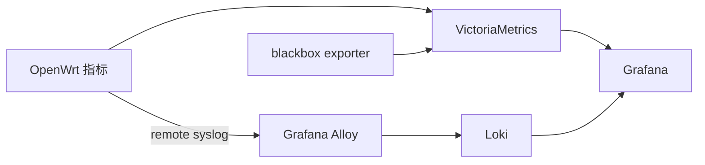

# OpenWrt 设备管理

OpenWrt 是面向路由器和嵌入式网络设备的 Linux 发行版。本文说明设备支持、安装与恢复、系统维护、网络配置、外部 Wi-Fi 上联、链路诊断和监控，最后以小米 AX3000T 记录设备专属的刷写与恢复边界。AP/station角色、认证阶段、无线传播、CPE、PoE、户外安装和Mesh拓扑见[外部 Wi-Fi 接入本地网络](external-wifi-access.md)。

## <a id="system"></a>系统组成与设备支持

本节先说明 OpenWrt 的系统边界和主要组件，再说明设备支持为什么必须落实到精确型号和硬件版本。

### 系统组件

[OpenWrt 25.12.5 的项目说明](https://github.com/openwrt/openwrt/blob/v25.12.5/README.md#L3-L10)将其定义为面向嵌入式设备的 Linux 操作系统。通过 SSH 登录路由器时，管理的是设备上直接运行的 OpenWrt 系统。

OpenWrt 提供 Linux 内核、可写配置层和软件包管理，可以组合 DHCP、DNS、防火墙、VLAN、多 WAN、VPN、无线 AP、无线客户端和策略路由。常见组件的分工如下：

- [OpenWrt 主项目](https://git.openwrt.org/openwrt/openwrt/tree/?h=v25.12.5)：Linux 发行版、构建系统、目标设备和基础软件包。
- [LuCI](https://git.openwrt.org/project/luci/tree/?id=128a7812f4be233c5dd7f7466f534fd888785caf)：OpenWrt 的网页管理界面。
- [UCI](https://git.openwrt.org/project/uci/tree/?id=66127cd76c5d0bd46d5a90302cc6110f53a4e2f8)：OpenWrt 的统一配置系统，持久配置通常位于 `/etc/config/*`。
- [ubus](https://git.openwrt.org/project/ubus/tree/?id=24864e7840b3a02a9ef76284a373f6b2f00b8a9b)：OpenWrt 的进程通信和服务调用总线。
- [Dropbear 2025.89](https://github.com/mkj/dropbear/tree/DROPBEAR_2025.89)：第三方轻量 SSH 项目；OpenWrt 维护自己的[集成配置](https://github.com/openwrt/openwrt/tree/v25.12.5/package/network/services/dropbear)。

OpenWrt 的自由度来自完整的网络操作系统。设备实际能使用哪些功能，仍取决于硬件支持状态、驱动、闪存和内存。

### 设备支持范围

OpenWrt 镜像必须匹配精确型号和硬件版本。相同商品名可能使用不同的 SoC、闪存芯片、网口交换芯片或无线芯片；其中一个版本受支持，不代表所有同名机器都能使用相同镜像。

> SoC（System on Chip，系统级芯片）是路由器的主芯片，通常集成 CPU、网络处理和部分硬件控制功能。SoC 决定基础硬件平台，但不能单独确定镜像：使用同一 SoC 的设备仍可能采用不同的闪存、交换芯片、无线芯片和分区布局。

选购或安装前至少确认：

- OpenWrt 官方的 [Table of Hardware](https://openwrt.org/toh/start) 或 [Firmware Selector](https://firmware-selector.openwrt.org/) 中存在这款设备的准确条目；
- 当前稳定版支持该硬件版本，而不只是开发分支或论坛补丁；
- 闪存、内存、网口数量和速率满足用途；OpenWrt 的 [8/64 警告](https://openwrt.org/supported_devices/864_warning?rev=1766225423)将 16 MiB 闪存和 64 MiB 内存视为不自行裁剪镜像时的最低参考，并指出更低配置可能不稳定或失去后续支持；
- 设备页给出可执行的首次安装方法和故障恢复入口；
- 无线、网口交换芯片、指示灯、按键和硬件加速等设备功能已有相应驱动。

确认支持状态后，还要阅读设备页的安装与恢复说明。若安装依赖原厂固件漏洞，升级原厂固件可能会关闭该入口，因此操作方法必须同时匹配设备型号和原厂固件版本。具体入口统一见[安装、升级与恢复](#installation)。

设备出现在Firmware Selector只证明官方构建支持该硬件，不代表它适合安装所有附加软件。完整wpad、Mihomo、sing-box、GeoIP/规则数据库和长期日志都需要额外闪存与内存；小闪存CPE即使能启动OpenWrt，也可能只能使用定制精简镜像。

### <a id="hardware"></a>设备角色与硬件条件

设备选择由角色、接口、驱动支持和恢复能力共同决定；规格高低本身不能替代这些边界。

不同角色关注的硬件条件不同：

- 主路由涉及 WAN/LAN 速率、硬件加速、智能队列管理（SQM）和长期稳定性；
- 无线 AP 涉及无线驱动、频段、空间流数量和安装位置；
- 旅行路由器涉及无线 WAN、网页认证（Captive Portal）、MAC 地址克隆、便携供电和多个上游网络切换；
- 实验平台涉及串口、恢复分区、可更换存储、SFP、M.2 和无线模块；
- x86 软路由涉及 CPU、网卡驱动和存储，无线功能可由独立 AP 提供。

**设备形态。**常见设备可以按出厂系统和硬件形态区分：

| 形态 | 例子 | 安装与维护边界 | 来源 |
|---|---|---|---|
| OpenWrt 原生设备 | OpenWrt One | 出厂预装 OpenWrt 和 LuCI；NAND 用于正常系统，NOR 用于独立恢复，并带 USB-C 串口；物理网口为一个 WAN 和一个 LAN | [OpenWrt One 设备页](https://openwrt.org/toh/openwrt/one?rev=1785956951) |
| 厂商维护的 OpenWrt 分支 | GL.iNet Flint 2 | 原厂系统是 OpenWrt 分支；可从原厂网页写入官方 sysupgrade 镜像，U-Boot 恢复网页不依赖当前系统 | [Flint 2 设备页](https://openwrt.org/toh/gl.inet/gl-mt6000?rev=1784246533) |
| 旅行路由器 | GL.iNet Beryl AX 等 | 把现有 Wi-Fi 作为上游，再提供自己的 LAN 和 AP；网页认证、企业认证和 MAC 策略随型号与固件变化 | [固件 4 Repeater 文档](https://docs.gl-inet.com/router/en/4/interface_guide/internet_repeater/) |
| 开发板型路由器 | Banana Pi BPI-R4 | 可从 SPI-NAND、eMMC 或 microSD 启动，并提供 SFP 和可选无线模块；机箱、模块和安装流程需要自行组合 | [BPI-R4 设备页](https://openwrt.org/toh/sinovoip/bananapi_bpi-r4?rev=1786132584) |
| x86 主机 | 通用 Intel / AMD 主机 | 将 combined 磁盘镜像写入硬盘或 SSD；需要自行核对网卡、存储和其他驱动 | [x86 安装文档](https://openwrt.org/docs/guide-user/installation/openwrt_x86?rev=1763692173) |
| 上游支持的消费路由器 | Table of Hardware 中的具体型号 | 硬件版本、首次安装和恢复方法都以设备页为准 | [Table of Hardware](https://openwrt.org/toh/start) |

厂商系统和官方 OpenWrt 即使共享代码基础，也可能使用不同内核、驱动和功能界面，不能把一方的功能状态直接套到另一方。

**旅行路由器。**旅行路由器把外部 Wi-Fi 作为上游，再建立自己控制的 LAN。这个角色要求设备支持 station、WWAN、防火墙和上游认证；若还要向本地广播 Wi-Fi，需要核对无线电数量和并发模式。完整的数据路径、认证和链路测量见 [外部 Wi-Fi 接入本地网络](external-wifi-access.md)。

## <a id="installation"></a>安装、升级与恢复

首次安装、系统升级和故障恢复属于同一固件生命周期，但使用的镜像、前置条件和失败边界不同。

### 首次安装方法

不同型号第一次安装 OpenWrt 的方法不同，没有一套通用命令。先在 [Table of Hardware](https://openwrt.org/toh/start) 或 [Firmware Selector](https://firmware-selector.openwrt.org/) 找到准确型号，再按照设备页给出的镜像、网口、IP 地址、按键时序和恢复方法操作。[通用安装说明](https://openwrt.org/docs/guide-user/installation/generic.flashing?rev=1631788605)只用于理解常见入口，不能替代设备页。

常见入口包括：

- 在原厂网页中上传设备页指定的首次安装镜像；
- 进入 bootloader（启动程序）提供的恢复网页、TFTP、串口或其他恢复环境；
- 通过厂商提供的 SSH、开发模式或解锁接口取得写入权限；
- 利用设备页明确记录的原厂固件漏洞取得 SSH，再备份分区并写入镜像；
- 通过 UART 串口加载临时系统或直接写入闪存；
- 将镜像写入硬盘、SSD、SD 卡或 eMMC，再从该存储设备启动。

不要因为另一款设备使用相同 SoC 就照搬分区号、启动变量或恢复文件。除非设备页明确要求，否则不要修改 bootloader；出现读写错误、闪存纠错（ECC）错误、镜像校验不一致或兼容性错误时应立即停止。

### 镜像类型

镜像名称表示构建时预定的用途，但设备页始终具有最终决定权：

| 镜像类型 | 通常用途 | 例外与边界 | 来源 |
|---|---|---|---|
| `factory` | 从厂商系统第一次安装 OpenWrt | 只有设备页明确要求时使用；并非所有设备都按此命名 | [sysupgrade 命令行文档](https://openwrt.org/docs/guide-user/installation/sysupgrade.cli?rev=1786636501) |
| `sysupgrade` | 升级已经运行的 OpenWrt | 部分设备也用它完成首次安装，例如 Flint 2 | [sysupgrade 命令行文档](https://openwrt.org/docs/guide-user/installation/sysupgrade.cli?rev=1786636501)、[Flint 2 设备页](https://openwrt.org/toh/gl.inet/gl-mt6000?rev=1784246533) |
| `combined` | x86 等平台的整盘镜像，包含启动和系统分区 | 首次安装与升级通常使用同一文件系统类型和启动方式的 combined 镜像 | [sysupgrade 命令行文档](https://openwrt.org/docs/guide-user/installation/sysupgrade.cli?rev=1786636501) |

镜像文件名是设备构建流程的结果，不应仅根据“第一次安装”或“升级”自行推断。

### <a id="system-upgrade"></a>系统升级

sysupgrade 会替换 OpenWrt 系统和 Linux 内核。升级前应完成：

1. 用 `ubus call system board` 核对设备 profile（官方构建条目）、当前版本、目标平台和根文件系统类型。
2. 阅读目标版本的发行说明和设备页，确认能否保留现有配置。
3. 保存配置备份、已安装软件包清单，以及当前版本的可重新安装镜像。
4. 将目标镜像放入 `/tmp`，确认 RAM 足够，并把镜像散列与官方 `sha256sums` 对照。

下面的命令只读取状态或验证镜像，不会执行升级：

```sh
ubus call system board
free
sha256sum /tmp/<sysupgrade-image>
sysupgrade -T /tmp/<sysupgrade-image>
```

确认设备、散列和 `sysupgrade -T` 都无误后，下面的命令才会真正写入固件：

```sh
sysupgrade -v /tmp/<sysupgrade-image>
```

`-T` 是只验证不写入的选项，`-v` 只是增加输出详细度；没有 `-T` 时，命令会继续执行升级，见 [25.12.5 的 sysupgrade 参数](https://github.com/openwrt/openwrt/blob/v25.12.5/package/base-files/files/sbin/sysupgrade#L39-L60)。只有明确要丢弃旧配置时才加 `-n`。

“保留设置”只会保存 sysupgrade 选定的配置文件，不会保留所有后来安装的软件包或任意数据文件。[sysupgrade 升级说明](https://openwrt.org/docs/guide-user/installation/generic.sysupgrade?rev=1786216890)记录了配置、软件包和数据文件的边界。执行升级时，sysupgrade 会[关闭现有 shell 会话](https://github.com/openwrt/openwrt/blob/v25.12.5/package/base-files/files/sbin/sysupgrade#L428-L444)；连接断开本身不能证明失败，应等待设备重新启动后再检查版本、存储和网络。

### 配置与恢复资料

升级和风险操作前应保存配置备份、已安装软件包清单、当前可重新安装镜像，以及设备页中的恢复入口。需要保留原厂系统的设备还应备份 bootloader、无线校准数据和设备专属分区，并在另一台机器上验证文件长度与散列。

### 故障恢复

“恢复出厂设置”、重新安装 OpenWrt 和恢复厂商系统是三件不同的事：

- OpenWrt 的恢复出厂设置通常只清空 OpenWrt 配置；
- 重新安装 OpenWrt 需要设备支持的 sysupgrade、failsafe（故障安全模式）、bootloader 恢复或串口路径；
- 恢复厂商系统取决于原厂 bootloader、恢复分区、厂商镜像、本机校准数据和设备专属恢复入口是否仍可用。

安装或升级前应保存配置备份、当前可用镜像和设备恢复方法。需要备份 bootloader、无线校准数据或原厂分区的设备，还应在写入前完成备份并验证可读性。

## <a id="management"></a>系统配置与维护

本节区分命令环境、持久配置、运行时服务和远程访问，避免把 LuCI、UCI、ubus 和 SSH 当成同一层能力。

### 命令环境与软件包

OpenWrt 25.12.5 的 [root 登录 shell](https://github.com/openwrt/openwrt/blob/v25.12.5/package/base-files/files/etc/passwd#L1)是 `/bin/ash`，[BusyBox](https://github.com/openwrt/openwrt/blob/v25.12.5/package/utils/busybox/Makefile#L8-L15)提供精简的核心命令，[procd](https://github.com/openwrt/openwrt/blob/v25.12.5/package/system/procd/Makefile#L40-L53)负责系统进程管理，因此不能直接照搬 Bash + systemd 的服务器教程。

25.12 使用 `apk` 管理软件包；旧教程中的 `opkg` 命令不能直接照搬。[apk 迁移说明](https://openwrt.org/docs/guide-user/additional-software/opkg-to-apk-cheatsheet?rev=1774185420)明确警告不要用 `apk upgrade` 批量升级整机，安全的整机升级路径是 LuCI Attended Sysupgrade、`owut` 或 [Firmware Selector](https://firmware-selector.openwrt.org/)。

安装附加包时，应使用与当前 OpenWrt 版本和架构匹配的签名仓库或定制镜像；软件包 revision、依赖和签名不一致时应停止，而不是强制安装。

### LuCI、UCI 与 ubus

LuCI 是网页管理界面，通常通过 UCI 写入持久配置；UCI 管理 `/etc/config/*`；ubus 则让服务注册对象、查询运行状态并调用方法。三者相互配合，但不是同一层接口：

```sh
uci show network
uci show wireless
ubus call system board
ubus call network.interface.lan status
```

[UCI 文档](https://openwrt.org/docs/guide-user/base-system/uci?rev=1781542470)说明了集中配置和 `uci commit` 的语义；25.12.5 的[软件包定义](https://github.com/openwrt/openwrt/blob/v25.12.5/package/system/uci/Makefile#L14-L17)锁定官方 Git 服务器中的 [UCI `66127cd`](https://git.openwrt.org/project/uci/tree/?id=66127cd76c5d0bd46d5a90302cc6110f53a4e2f8)。[ubus 文档](https://openwrt.org/docs/techref/ubus?rev=1734385933)说明了服务注册、状态查询和方法调用；25.12.5 的[软件包定义](https://github.com/openwrt/openwrt/blob/v25.12.5/package/system/ubus/Makefile#L6-L12)锁定 [ubus `24864e7`](https://git.openwrt.org/project/ubus/tree/?id=24864e7840b3a02a9ef76284a373f6b2f00b8a9b)。

用 `uci set` 等命令修改配置后，要用 `uci commit <package>` 写入持久配置，再通过对应 init 脚本重新加载或重启服务。

### Dropbear SSH

OpenWrt 默认使用 Dropbear 提供 SSH。访问范围同时受 Dropbear 监听位置和防火墙区域控制。

#### 监听范围与防火墙

[Dropbear 2025.89](https://github.com/mkj/dropbear/tree/DROPBEAR_2025.89)是独立的第三方轻量 SSH 服务，OpenWrt 负责把它接入 UCI、procd 和防火墙。25.12.5 的[默认配置](https://github.com/openwrt/openwrt/blob/v25.12.5/package/network/services/dropbear/files/dropbear.config#L1-L9)启用端口 22、普通密码认证和 root 密码认证；没有限制接口时，Dropbear 会监听设备上的可用地址。

25.12.5 的[默认防火墙](https://github.com/openwrt/openwrt/blob/v25.12.5/package/network/config/firewall/files/firewall.config#L1-L24)允许 LAN 访问路由器本身，并拒绝 WAN 入站。无线 WAN 只有在归入 WAN 防火墙区域后才遵循这组规则。监听范围和防火墙是两道独立限制。

绑定到 LAN 的无线 AP 客户端与有线 LAN 客户端处于同一管理边界，默认可以尝试连接 22 端口。如果 Dropbear 仍允许 root 密码登录，知道 root 密码的 LAN 客户端就能取得系统管理权限。guest（访客）网络能否访问 SSH，取决于其防火墙区域是否允许访问路由器本身。

#### <a id="ssh-security"></a>公钥认证与密码认证

SSH 涉及两类不同密钥：

- 路由器首次启动时生成的 Dropbear 主机密钥，用于让客户端确认服务器身份；
- 管理电脑持有的客户端私钥及其公钥，其中私钥留在管理电脑，公钥写入路由器的 `/etc/dropbear/authorized_keys`。

[OpenWrt 公钥认证文档](https://openwrt.org/docs/guide-user/security/dropbear.public-key.auth?rev=1771861590)允许复用管理电脑上已有、准备给该路由器使用的密钥，也可以新建密钥。复用同一密钥的管理成本较低，但密钥泄露会影响更多设备；按设备或设备组拆分密钥可以缩小影响范围，但需要维护更多密钥。

25.12.5 的 Dropbear 配置在非 `SMALL_FLASH` 构建中[默认启用 Ed25519](https://github.com/openwrt/openwrt/blob/v25.12.5/package/network/services/dropbear/Config.in#L879-L889)；小闪存构建应先确认实际支持的算法。确定密钥类型后，上传公钥并强制验证一条不允许密码回退的新连接：

```sh
ssh-keygen -t ed25519 -f ~/.ssh/openwrt-router
cat ~/.ssh/openwrt-router.pub | ssh root@openwrt.lan \
  'umask 077; cat >> /etc/dropbear/authorized_keys; chmod 600 /etc/dropbear/authorized_keys'
ssh -i ~/.ssh/openwrt-router -o IdentitiesOnly=yes \
  -o PasswordAuthentication=no -o BatchMode=yes root@openwrt.lan 'echo key-ok'
```

私钥带保护口令（passphrase）时，先把它加载到 ssh-agent；常驻 agent 和非交互解锁由 `software` skill 的 SSH 能力覆盖。只有看到 `key-ok` 后，才在路由器上执行：

```sh
uci set dropbear.main.DirectInterface='lan'
uci set dropbear.main.PasswordAuth='off'
uci set dropbear.main.RootPasswordAuth='off'
uci commit dropbear
/etc/init.d/dropbear restart
```

25.12.5 的 Dropbear 脚本会把 `DirectInterface='lan'` 转成实际 LAN 网卡，见[接口绑定](https://github.com/openwrt/openwrt/blob/v25.12.5/package/network/services/dropbear/files/dropbear.init#L197-L250)和[认证参数](https://github.com/openwrt/openwrt/blob/v25.12.5/package/network/services/dropbear/files/dropbear.init#L302-L326)。已有系统若没有名为 `main` 的配置节，应先用 `uci show dropbear` 查看真实名称。

关闭 Dropbear 密码认证不会删除 `/etc/shadow` 中的 root 密码，LuCI 等使用系统密码的入口仍可继续使用它。

### 指示灯与硬件功能

指示灯是否可用，取决于设备树和驱动是否描述了对应硬件。受支持的 LED 通常出现在 `/sys/class/leds/`，并通过 `/etc/config/system` 或 LuCI 的 LED Configuration 绑定启动、网络和无线触发器，详见 [LED 配置文档](https://openwrt.org/docs/guide-user/base-system/led_configuration?rev=1765317685)。

OpenWrt 可以提供标准状态灯，但不保证复刻厂商固件的全部颜色、动画或专有联动。

## <a id="network-surfaces"></a>网络配置与状态接口

OpenWrt 把物理接口、逻辑网络、防火墙区域、无线配置和运行状态分开管理。理解这些层次可以避免把“无线客户端”“WAN 角色”“某个物理网口”和“设备清单”当成同一个对象。

### LAN、WAN、WWAN 与防火墙区域

OpenWrt 把网络对象拆成几个层次：

- **LAN**（local area network，本地网络）是终端接入的一侧，通常由 OpenWrt 提供 DHCP 和默认网关。
- **WAN**（wide area network，上游网络）是通往外部网络的一侧；它是逻辑角色，不等于固定的物理网口。
- **WWAN**（wireless WAN，无线 WAN）是由 Wi-Fi 客户端连接承载的 WAN 接口。
- **防火墙区域**把一个或多个接口归为同一安全边界，并决定入站、转发和 NAT。

`/etc/config/network` 定义接口和地址获取方式，`/etc/config/firewall` 决定区域、转发和 NAT。把外部 Wi-Fi 变成网线输出时，通用数据路径见 [设备角色与数据路径](external-wifi-access.md#architecture)，OpenWrt 配置流程见 [外部 Wi-Fi 上联配置](#wifi-uplink)。

### <a id="lan-egress"></a>局域网流量的统一出口

OpenWrt 可以让整个局域网共用 VPN 或代理出口，因为终端通常已经把它当作默认网关；路由器可以在转发过程中选择出口、修改路由或把流量交给本机代理程序。这不是一个单独的“全局代理”开关，而是软件包、隧道接口、防火墙和策略路由共同实现的能力。

需要先区分三种做法：

| 做法 | 终端是否配置代理 | 路由器承担的工作 | 主要边界 |
|---|---|---|---|
| VPN 隧道出口 | 不需要 | 把全部或选定终端的 IP 流量路由到 WireGuard、OpenVPN 等隧道 | 上游必须提供 VPN；是否覆盖 IPv6、DNS 和故障回退取决于完整配置 |
| 显式 HTTP/SOCKS 代理 | 需要 | 在路由器上提供代理监听端口 | 未配置代理的应用仍走普通 WAN，不等于整个局域网已被接管 |
| 透明代理或 TUN | 通常不需要 | 用防火墙、策略路由或 TUN 把转发流量交给本机代理核心 | 必须分别处理 TCP、UDP、DNS、IPv4、IPv6、本地网段绕行和代理失效行为 |

[OpenWrt 的 WireGuard 客户端文档](https://openwrt.org/docs/guide-user/services/vpn/wireguard/client?rev=1780858975)使用 `0.0.0.0/0` 和 `::/0` 建立全流量路由；[PBR 文档](https://openwrt.org/docs/guide-user/network/routing/pbr_app?rev=1765197438)则示范把整个 LAN 子网送到指定 VPN。官方 packages 仓库中的 [`pbr`](https://github.com/openwrt/packages/blob/af41897f31a4b5405acb0ca9d7ecdd357d193a9d/net/pbr/README.md#L7-L15)还可以按 IP、MAC、端口、协议或域名选择 WAN、VPN 或隧道。

透明代理需要额外的代理核心和接管规则。OpenWrt 的官方 packages 仓库包含依赖 `kmod-tun` 的 [`sing-box`](https://github.com/openwrt/packages/blob/af41897f31a4b5405acb0ca9d7ecdd357d193a9d/net/sing-box/Makefile#L28-L46)，而 OpenWrt 自身的 [`fw4`/nftables](https://openwrt.org/docs/guide-user/firewall/overview?rev=1755099165)负责包分类、NAT 和转发规则；安装代理程序本身并不会自动完成整网接管。Mihomo 的显式代理、TUN 路由、DNS 和泄漏边界见 [TUN 与系统路由](mihomo.md#tun-routing)。

其他路由器能否提供同样能力，主要取决于固件，不只取决于硬件。厂商固件若没有可安装软件包、TUN 设备、自定义防火墙规则、策略路由和服务管理入口，通常只能使用厂商预置的 VPN 或代理功能；支持 VPN client 或策略路由的型号则可能覆盖其中一部分。OpenWrt 的[软件包管理](https://openwrt.org/docs/guide-user/additional-software/managing_packages?rev=1769013285)和可配置网络栈，正是它与这类封闭固件的主要差别。

### <a id="wireless-wpad"></a>无线配置与 wpad

`/etc/config/wireless` 中常见的对象是：

- **radio**：一张物理无线电，例如 2.4 GHz 或 5 GHz；
- **`wifi-iface`**：运行在 radio 上的一条无线配置；
- **`mode='ap'`**：把这条 `wifi-iface` 映射为 AP 角色；
- **`mode='sta'`**：把这条 `wifi-iface` 映射为 station 角色。

AP、station、路由和桥接的通用关系，以及共享同一无线电时的影响，见 [设备角色与数据路径](external-wifi-access.md#architecture)。OpenWrt 能否在同一 radio 上并发这些模式，取决于驱动和硬件。

**wpad** 是 OpenWrt 打包的无线认证组件，同时包含 hostapd（主要服务 AP 模式）和 wpa_supplicant（主要服务 station 模式）的能力。25.12.5 的 [wpad 包定义](https://github.com/openwrt/openwrt/blob/v25.12.5/package/network/services/hostapd/Makefile#L269-L320)区分 basic 和 full 变体：`wpad-basic-mbedtls` 等精简变体覆盖普通 Personal 网络；PEAP、TTLS、TLS、MSCHAPv2 等企业认证方法需要 `wpad-openssl`、`wpad-mbedtls` 或 `wpad-wolfssl` 等完整变体。

替换 wpad 前先模拟软件包事务。下面以 `wpad-openssl` 为例：

```sh
apk add --simulate wpad-openssl
apk add wpad-openssl
```

只有模拟结果显示当前 wpad 变体、依赖和 `hostapd-common` 能在同一事务中形成匹配版本时，才执行第二条命令；不要先手工删除当前 wpad。若事务牵涉无关核心包或版本不一致，应停止并改用匹配当前 OpenWrt 版本的签名仓库或定制镜像。

PEAP/MSCHAPv2 的最小 UCI 关系如下，账号和密码应通过受控输入写入，避免进入命令历史：

```sh
uci set wireless.enterprise.encryption='wpa2'
uci set wireless.enterprise.eap_type='peap'
uci set wireless.enterprise.auth='MSCHAPV2'
uci set wireless.enterprise.identity='<identity>'
uci set wireless.enterprise.password='<password>'
```

服务器证书还需要 `ca_cert` 及域名限制，或经过验证的服务器证书 pin。完整认证流程、缓存和漫游边界见 [通过上游认证](external-wifi-access.md#authentication)和[理解无线链路](external-wifi-access.md#radio-metrics)。

EAP发生在station与上游AP建立无线连接时，因此必须由运行这条`wifi-iface`的设备完成。下游路由器不能通过以太网替一个不支持PEAP的CPE完成Eduroam认证；通用链路顺序见[无线关联、地址获取与上层认证](external-wifi-access.md#auth-stages)。

### <a id="network-state"></a>设备、接口与客户端状态

OpenWrt 没有一个天然完整的“所有设备”列表。接口状态、地址租约、二层邻居、无线关联和经网关流量来自不同子系统，应按用途组合：

| 来源 | 可以回答的问题 | 主要边界 |
|---|---|---|
| `ubus call network.device status`、`network.interface.<name> status` | 设备、接口、地址、路由、协议状态和 uptime | 只表示查询时刻，不提供历史 |
| `/proc/net/dev`、`/sys/class/net/<iface>/statistics/` | 每个接口的字节、包、错误和丢弃计数 | 不能把接口总量自动分摊到终端 |
| `/tmp/dhcp.leases` | DHCP 分配的 IP、MAC、主机名和租期 | 不覆盖静态地址，也不是长期连接历史 |
| `ip neigh show` | 同一链路上近期解析出的 IPv4/IPv6 地址与 MAC | 动态条目会进入 reachable、stale、failed 等状态并被回收，见 [`ip-neighbour(8)`](https://man7.org/linux/man-pages/man8/ip-neighbour.8.html) |
| bridge FDB（forwarding database，转发表；安装相应 bridge 工具后可用 `bridge fdb show` 查看） | Linux bridge 学到的 MAC 与端口 | 不能直接给出主机名、IP 或无线质量，动态项同样会老化 |
| `iwinfo`、`iw dev <iface> station dump` | OpenWrt 自己 radio 上的关联客户端、信号、速率和重传 | 看不到独立 AP 上的无线关联 |
| conntrack | 正在经网关路由的连接与计数 | 不覆盖同一 bridge 内直接转发的流量，也不是长期记账数据库 |

快速盘点时可以先并列读取这些来源，再用 MAC、IP、接口和时间关联，而不是把某一个输出当作完整真相：

```sh
ubus call network.device status
ubus call network.interface.lan status
cat /tmp/dhcp.leases
ip neigh show
```

网关和独立 AP 各自能看到哪些字段，见 [整网设备可见性与统计](external-wifi-access.md#dashboard)；持续采集和历史保存见 [网络日志与监控](#link-dashboard)。

## <a id="wifi-uplink"></a>外部 Wi-Fi 上联配置

本节把[外部 Wi-Fi 接入本地网络](external-wifi-access.md)的数据路径落实为OpenWrt配置。上游关联、NAT、桥接、Portal和Eduroam的通用原理以external文档为准；这里仅记录管理路径、UCI对象、状态确认和回退流程。

### 管理路径与配置备份

配置前始终保留一条不会随上游无线切换而消失的管理路径。最稳妥的是电脑直接连接OpenWrt LAN，确认管理地址和SSH可用，再保存配置备份。

开始前确认：

- LAN与上游网络不使用同一子网；
- 当前配置和已知可用上游可以恢复；
- 电脑不会因默认路由切换而失去管理路径；
- 无线切换期间，下游短暂断网是预期现象。

测试新的SSID、频段、企业认证或BSSID时，不要直接覆盖唯一可用配置。可以保留旧`wifi-iface`并暂时禁用，验证新条目后再提交；失败时使用`uci revert wireless`或恢复备份。

### station、WWAN 与防火墙

OpenWrt需要同时完成无线、网络和防火墙三层配置：

| 配置层 | 必要关系 |
|---|---|
| 无线 | `wifi-iface`使用`mode='sta'`，绑定`network='wwan'` |
| 网络 | `network.wwan`使用DHCP或上游要求的协议 |
| 防火墙 | `wwan`属于启用masquerading的WAN区，允许LAN转发到WAN |

在LuCI中，对应路径是 **Network → Wireless → Scan → Join Network**，为station创建或选择`wwan`，再确认它位于WAN防火墙区域。保存前检查LAN与上游子网不冲突。

完成后并列确认无线、地址和路由：

```sh
ubus call network.wireless status
ubus call network.interface.wwan status
ip route
```

WWAN取得地址只证明关联和DHCP成功；Portal或企业认证仍要分别验证。

### Portal 与企业认证的 OpenWrt 配置

开放Portal网络通常不需要在`wifi-iface`保存账号。station完成开放关联和DHCP后，由下游浏览器通过目标网络自己的HTTP重定向进入Portal；一次认证能否供NAT后终端共享必须现场测试。

WPA2-Enterprise需要完整wpad、EAP字段和服务器证书约束。替换包前按[无线配置与wpad](#wireless-wpad)模拟事务；配置成功后同时检查：

```sh
logread | grep -E 'wpa_supplicant|EAP|CTRL-EVENT'
ubus call network.interface.wwan status
```

日志中的`CTRL-EVENT-CONNECTED`或EAP success不能替代地址和公网测试；同样，拿到DHCP地址也不能证明服务器身份已经正确验证。

### 下游 AP 与重启验收

OpenWrt LAN应使用与上游不同的子网并运行DHCP。下游设备切到AP模式后，终端应直接取得OpenWrt LAN地址；若仍获得下游设备自己的网段，说明第二层路由或DHCP尚未关闭。

最终配置应经过：

1. `wifi reload`后自动重连；
2. 完整重启后自动恢复关联、需要的EAP和地址获取；
3. 检查Captive Portal会话是否仍有效；失效时按网络要求由用户重新登录，不把网页认证假定为自动完成；
4. 下游终端重新取得地址、DNS和默认网关；
5. 从下游Wi-Fi访问OpenWrt管理地址和公网；
6. 使用与业务时长相称的连续延迟、丢包和下载测试。

厂商Mesh、无线回程和无预埋网线时的拓扑见[本地无线覆盖与Mesh](external-wifi-access.md#local-coverage)。

## <a id="link-measurement"></a>OpenWrt 链路诊断

无线指标、A/B条件和分层测试方法见[无线链路与漫游](external-wifi-access.md#radio-metrics)和[链路测量与验证](external-wifi-access.md#measurement)。本节只说明如何使用OpenWrt状态接口和命令执行这些测试。

### 无线状态与被动采样

先读取不改变关联的状态：

```sh
ubus call network.interface.wwan status
iw dev
iw dev <station-iface> link
iw dev <station-iface> station dump
iw dev <station-iface> survey dump
iwinfo <station-iface> info
```

这些命令分别给出地址、路由、SSID/BSSID、频率、信号、MCS/NSS、重传和噪声。连续采样时，从 `/sys/class/net/<station-iface>/statistics/{rx,tx}_bytes` 读取相邻差值，换算当前接口流量。

### 主动扫描与任务互斥

主动扫描会占用无线电资源并增加延迟，具体影响依驱动而异。业务运行时默认不扫描当前关联的radio；若有独立闲置radio，只扫描闲置radio，并设置硬超时和缓存。

链路面板、延迟精测和NDT7也应互斥：

- 活动radio不做周期扫描；
- 闲置radio使用较长扫描间隔；
- NDT7运行时暂停其他主动任务，必要时降低面板轮询；
- 任务结束或失败后恢复被动采集；
- 所有后台任务使用进程锁和总时限。

扫描卡住时只终止对应的具体进程并重新检查无线状态；不要用无范围的进程名杀法，也不要直接重载配置掩盖原因。扫描结果的通用语义见[扫描、关联与双向链路](external-wifi-access.md#association-testing)。

### 事件日志与周期采样

OpenWrt的事件日志、当前状态和周期采样不会自动互相替代：

| 数据类型 | 回答的问题 | 常见边界 |
|---|---|---|
| 事件日志 | 为什么发生关联、认证、DHCP 或断开事件 | 通常只保留近期记录，重启或缓冲覆盖后消失 |
| 当前状态 | 现在连接哪个 AP、使用什么速率和信号 | 只表示查询时刻，不能还原之前的变化 |
| 周期采样 | 断开前 signal、MCS、重传、流量和延迟怎样变化 | 必须主动保存，采样频率和存储位置需要单独设计 |
| 基准测试历史 | 某次测试的下载、上传和负载延迟 | 只代表测试时段，不等于持续可用带宽 |

OpenWrt 的具体日志命令、历史边界和远程保存方法见 [网络日志与监控](#link-dashboard)。

### 分层延迟与内容下载

目标层级及各自回答的问题见[分层延迟、下载与基准测试](external-wifi-access.md#layered-testing)。先读取WWAN自己的状态，使用其中的`l3_device`和默认路由`nexthop`；不能用全局默认路由代替，因为VPN、PBR或多WAN可能使用其他路由表：

```sh
ubus call network.interface.wwan status
ip -4 route show table all dev <wwan-l3-device>
ip -6 route show table all dev <wwan-l3-device>
```

从`ubus`结果的`route`数组选择目标为`0.0.0.0/0`或`::/0`的WWAN下一跳；IPv6链路本地网关还要保留对应接口作用域。分别对第一跳、内部目标和公共目标测试小包及接近MTU的大包。BusyBox `ping` 的参数能力随构建变化，先查看本机帮助，不假设支持小数间隔：

```sh
ping -c 30 <wwan-gateway>
ping -c 30 -s 1400 <wwan-gateway>
ping -c 30 <internal-target>
ping -c 30 <public-target>
```

持续下载使用大小相同或同源的静态文件和HTTP Range固定样本长度：

```sh
curl --interface <lan-address> \
  --resolve <internal-host>:80:<verified-ip> \
  --range 0-4999999 \
  -o /dev/null \
  http://<internal-host>/<large-file>
```

其余层次保持相同Range、文件大小和协议。下载期间每秒读取station的`rx_bytes`并同步保存RSSI、MCS和重传增量，避免总平均速度掩盖掉线。

运行 mihomo fake-IP（DNS 返回占位地址）或 TUN（虚拟网卡隧道）的环境，不能用普通 53 端口查询判断真实地址。先用 DoH（DNS over HTTPS，通过 HTTPS 查询 DNS）获取真实地址，或使用已核验 IP 配合 `curl --resolve`；完整 DNS 流向见 [Mihomo / Clash](mihomo.md)。

### NDT7 与 A/B 执行

[M-Lab NDT](https://www.measurementlab.net/tests/ndt/)是主动的大流量容量测试。NDT7 使用一条加密测试连接测量应用层有效吞吐，并报告下载、上传、负载延迟和 TCP 重传相关指标。

NDT7 会主动占满链路，不能当作“实时流量”持续运行。适合的流程是：

1. 由用户手动触发；
2. 暂停其他主动延迟和扫描任务；
3. 使用官方 reference client，通过 M-Lab Locate 选择服务器；
4. 设置总超时；
5. 只有同时得到服务器、下载和上传结果时才写入历史；
6. Locate 超时或全零摘要应显示失败，不得塑造成成功。

```sh
<ndt7-client> -format=json -timeout=60s
```

NDT7 的 loaded latency（负载延迟）是测速占满链路时的延迟，不能替代空闲公网 RTT（Round-Trip Time，往返时延）。高带宽链路一次 NDT7 会传输大量数据，因此默认只按需运行。

在OpenWrt上执行[可比较的A/B条件](external-wifi-access.md#ab-conditions)时，每轮至少保存signal、noise、SNR、信道宽度、NSS、MCS、重传增量、第一跳丢包、内部下载、外部下载和NDT7。先检查关联、EAP/Portal和DHCP，再运行吞吐测试。

## <a id="link-dashboard"></a>网络日志与监控

整台路由器的监控不是把所有字段写进一张表，而是把不同数据按生成方式分别采集，再在时间线上关联：

| 数据类别 | 典型内容 | 合适的保存方式 |
|---|---|---|
| 设备指标 | CPU、内存、温度、接口、radio、关联客户端 | 周期采样的时序数据库 |
| 客户端流量 | 按 IP/MAC/协议统计的经网关用量 | 专用流量记账，再导出累计值 |
| 日志事件 | netifd、hostapd/wpa_supplicant、DHCP、内核和防火墙事件 | remote syslog 与日志存储 |
| 主动探测 | 网关、公网、DNS、HTTP 的延迟和可用性 | 有明确观察点和频率的探测任务 |

现有 HTML 链路面板仍用于观察一条上游无线链路；整网设备历史和多设备筛选由标准采集器与外部存储承担。

### <a id="openwrt-logs"></a>OpenWrt 日志与远程保存

OpenWrt 会记录近期系统事件，但不会默认保存完整的信号和流量时间序列。官方[系统日志说明](https://openwrt.org/docs/guide-user/base-system/log.essentials)指出，默认 `logd` 把固定大小的记录保存在 RAM 环形缓冲中，`logread` 可以读取、写文件或转发到远端。

| 数据 | 默认历史 | 查看位置 | 主要边界 |
|---|---|---|---|
| netifd、wpa_supplicant/hostapd、EAP、DHCP、WNM | 近期事件 | `logread` | 环形缓冲覆盖或重启后消失 |
| 内核和无线驱动 | 近期事件 | `dmesg`、`logread` | 可见 beacon loss、能力变化和断开 |
| 接口、SSID、BSSID、地址 | 无 | `ubus`、`iw` | 只表示查询时刻 |
| signal、MCS/NSS、PHY、重传 | 无时序历史 | `iw station dump` 等 | 必须周期采样才能还原变化 |
| DHCP lease | 当前租约 | `/tmp/dhcp.leases` | 不是完整设备历史 |

实时跟踪和筛选无线相关日志只需要：

```sh
logread -f
logread | grep -E 'hostapd|wpa_supplicant|netifd|EAP|DHCP|WNM'
```

需要长期保存时，把系统事件通过 `/etc/config/system` 中的 remote syslog（把日志发送到外部日志服务器）配置发送到常开 LAN 主机。TCP 更强调送达，UDP 对路由器和接收端的耦合更小；高日志量本身也会增加负担，应按事件价值控制级别。持续把日志或高频样本写进路由器内置闪存会增加磨损，长期数据应优先写到外部存储。

### <a id="monitoring-collectors"></a>OpenWrt 采集组件

采集器应按缺口组合，不需要让两套工具重复采集相同的 CPU 和接口指标。Exporter 是把本机状态暴露为标准监控指标的轻量服务。

| 组件 | 主要用途 | 不覆盖的内容 |
|---|---|---|
| `prometheus-node-exporter-lua` 及其可选 collector | 轻量导出系统、接口、conntrack、radio 和关联客户端指标 | 不直接提供完整设备清单、长期历史或每客户端经网关用量 |
| `nlbwmon` | 按 IP、MAC 和协议累计经 conntrack 的客户端流量 | 不是实时无线质量、完整抓包或同一网桥内流量 |
| collectd + `luci-app-statistics` | 路由器本机 RRD（固定大小的环形时序数据库）图表，以及接口、温度、ping、conntrack、SQM/qdisc 等插件 | 本地 RRD 不等于外部长期历史；与 exporter 重叠的插件不必重复启用 |
| 直接状态采样 / textfile collector（读取文本指标文件的采集模块） | 补充 MCS、NSS、重传增量、WWAN uptime 和现场专用字段 | 需要自己定义采样、失败语义和字段稳定性 |

OpenWrt packages 中的 `prometheus-node-exporter-lua` 版本和基础依赖见[包定义](https://github.com/openwrt/packages/blob/4238239218d4fe7cdffb6b53fa29c52c2d3cc0a7/utils/prometheus-node-exporter-lua/Makefile#L7-L38)，radio 和关联客户端由 [`wifi` / `wifi_stations` 可选包](https://github.com/openwrt/packages/blob/4238239218d4fe7cdffb6b53fa29c52c2d3cc0a7/utils/prometheus-node-exporter-lua/Makefile#L216-L236)提供。其中 [`wifi_stations.lua`](https://github.com/openwrt/packages/blob/4238239218d4fe7cdffb6b53fa29c52c2d3cc0a7/utils/prometheus-node-exporter-lua/files/usr/lib/lua/prometheus-collectors/wifi_stations.lua?plain=1#L5-L69)导出关联数量、signal、inactive time、expected throughput、收发速率、包和字节，但不导出 MCS、NSS 或重传；名称相近的 [`hostapd_ubus_stations.lua`](https://github.com/openwrt/packages/blob/4238239218d4fe7cdffb6b53fa29c52c2d3cc0a7/utils/prometheus-node-exporter-lua/files/usr/lib/lua/prometheus-collectors/hostapd_ubus_stations.lua?plain=1#L5-L68)当前导出的是 RRM capability（无线资源测量能力标志），不能把它当作速率或重传采集器。

`nlbwmon` 是依赖 conntrack netlink 的 [OpenWrt Traffic Usage Monitor](https://github.com/openwrt/packages/blob/633cd89a22df5bff0d585c565c0f96587de89644/net/nlbwmon/Makefile#L3-L42)；其上游说明记录了按 IP、MAC、协议和周期保存数据的[统计模型](https://github.com/jow-/nlbwmon/blob/29236be687927b0c81ee6e2642e7caa8787c4ad3/README.md#L3-L15)，以及 JSON/CSV [查询命令](https://github.com/jow-/nlbwmon/blob/29236be687927b0c81ee6e2642e7caa8787c4ad3/README.md#L78-L123)。collectd 的 OpenWrt 构建包含 interface、iwinfo、netlink、ping、rrdtool 和 write_prometheus 等[可选插件](https://github.com/openwrt/packages/blob/45c9d0b9c86aeb54735459a04e411b6560ed4c51/utils/collectd/Makefile#L137-L213)。

单台或少量路由器可以先用 `prometheus-node-exporter-lua` 加 `nlbwmon`；只有需要本机 RRD、路由器观察点的 ping 或 SQM/qdisc 指标时，再启用相应 collectd 插件。Exporter 的[默认配置](https://github.com/openwrt/packages/blob/4238239218d4fe7cdffb6b53fa29c52c2d3cc0a7/utils/prometheus-node-exporter-lua/files/etc/config/prometheus-node-exporter-lua#L1-L5)只监听 loopback（回环接口）的 9100 端口；需要外部抓取时才改为管理 LAN 或受控代理，并用防火墙只允许监控主机访问，不能直接暴露到 WAN。

### <a id="monitoring-storage"></a>外部存储、可视化与主动探测

一台常开的 NAS、迷你主机或树莓派可以把指标、日志和主动探测集中起来：



[VictoriaMetrics v1.150.0](https://github.com/VictoriaMetrics/VictoriaMetrics/blob/v1.150.0/docs/victoriametrics/README.md#L428-L432)可以直接抓取 Prometheus 格式指标，Grafana 负责按路由器、接口、radio 和客户端筛选；Grafana Alloy 的 [`loki.source.syslog`](https://github.com/grafana/alloy/blob/2eeaa3e33b85f065833d47ec2beeac2ed2b764a7/docs/sources/reference/components/loki/loki.source.syslog.md#L13-L17)接收 RFC 3164/5424 日志并转给 Loki（日志存储）。[blackbox exporter 0.27.0](https://github.com/prometheus/blackbox_exporter/blob/v0.27.0/README.md#L7-L8)从监控主机执行 HTTP、DNS、TCP 或 ICMP 探测；它测量的是“监控主机到目标”的路径，不能替代路由器自身发出的第一跳或公网 ping。

下面的频率是本仓用于单台或少量路由器的起始口径，不是行业标准：

| 数据 | 起始频率 | 调整方向 |
|---|---:|---|
| 系统、接口、radio、关联客户端 | 约 15 秒 | 故障复现时可临时缩短；长期不要无差别使用 5 秒 |
| DHCP、neighbour、bridge FDB | 30–60 秒 | 设备变化慢时进一步放宽 |
| `nlbwmon` 累计量 | 1–5 分钟 | 用于用量趋势，不冒充瞬时速率 |
| 日志 | 事件驱动 | 按子系统和级别过滤 |
| 活动扫描 | 活动 radio 默认不周期执行 | 闲置 radio 才使用低频扫描 |
| NDT7 | 仅手动触发 | 与其他主动任务互斥 |

保留策略应按序列数量、采样频率和外部磁盘容量设置。常见做法是短期保留细粒度原始值，再用 recording rule（预先计算并保存聚合结果的规则）或聚合任务保存较长周期；“原始 7 天、分钟聚合 90 天”可以作为估算起点，不应写成所有部署的固定要求。采集端停机时保留明确的数据空洞，不用最后一次旧值补齐。

> 多台 OpenWrt 还需要统一注册、配置、地图和告警时，可以评估 [OpenWISP Monitoring 1.2.1](https://github.com/openwisp/openwisp-monitoring/blob/1.2.1/docs/user/intro.rst#L7-L28)。该版本包括接口、Wi-Fi 客户端、neighbour、DHCP、ping 和历史图表，并说明时序存储只支持 InfluxDB；它是完整管理平台，不是单台路由器的轻量 exporter 替代品。

> GitHub stars 快照截止 **2026-08-18**，数据来自各仓库的 GitHub 元数据。Stars 会持续变化，只表示公开关注度，不代表质量、安全性或对当前拓扑的适用排名。

| 仓库 | 本节中的角色 | GitHub stars |
|---|---|---:|
| [`grafana/grafana`](https://github.com/grafana/grafana) | 指标与日志仪表盘 | 76,259 |
| [`grafana/loki`](https://github.com/grafana/loki) | 日志存储与查询 | 28,753 |
| [`VictoriaMetrics/VictoriaMetrics`](https://github.com/VictoriaMetrics/VictoriaMetrics) | Prometheus 兼容时序存储 | 17,553 |
| [`prometheus/blackbox_exporter`](https://github.com/prometheus/blackbox_exporter) | HTTP、DNS、TCP、ICMP 主动探测 | 5,824 |
| [`openwrt/packages`](https://github.com/openwrt/packages) | OpenWrt exporter、collectd、`nlbwmon` 等包定义 | 4,581 |
| [`grafana/alloy`](https://github.com/grafana/alloy) | syslog 接收与日志管道 | 3,444 |
| [`openwisp/openwisp-monitoring`](https://github.com/openwisp/openwisp-monitoring) | 多台 OpenWrt 的集中监控平台 | 235 |
| [`jow-/nlbwmon`](https://github.com/jow-/nlbwmon) | 按客户端累计经网关流量 | 220 |

### 链路面板运行位置与访问地址

现有链路面板运行在 OpenWrt 设备本机，专门观察当前上游无线链路，而不是充当整网设备中心。HTML 页面由路由器的轻量 Web 服务（例如 uhttpd）提供，状态接口在路由器上读取 `ubus`、`iw` 和网卡计数器；浏览器只是显示这些数据，管理电脑关机不会让路由器端页面消失。

OpenWrt 链路面板模板见 [openwrt-link-dashboard.html](../assets/openwrt-link-dashboard.html)。模板不包含真实 SSID、设备名、Portal 地址或采集后端；页面顶部配置对象定义 API 路径、网络标签、延迟目标和过期时间。

终端要先接入 OpenWrt 的 LAN，或接入已经桥到该 LAN 的下游 AP。随后在浏览器打开：

```text
http://<openwrt-lan-ip>:<dashboard-port>/
```

`<openwrt-lan-ip>` 通常是终端网络详情中的默认网关，也是 LuCI 管理地址；`<dashboard-port>` 是部署面板时为 uhttpd 或其他 Web 服务设置的端口。

下游设备仍处于路由模式时，双重 NAT 和防火墙可能阻止访问上一级 OpenWrt；切为 AP 模式后，终端与 OpenWrt 位于同一 LAN，访问最直接。需要从 LAN 之外访问时，可以另建受控代理或隧道。Dashboard 可能暴露 SSID、BSSID、内网地址和链路状态，默认应绑定管理 LAN 或指定接口，并用防火墙限制访问；不能把无认证的 `0.0.0.0` 监听作为通用默认值。

本次校园案例曾为调试启动一个无认证、监听`0.0.0.0:3080`的临时Node服务。它只适合受控短测，结束后应停止；持久面板应迁到OpenWrt本机或受控监控主机，并限制到管理LAN。

### 链路面板实时数据来源

状态接口在 OpenWrt 本机按需读取：

| 数据 | OpenWrt 来源 |
|---|---|
| WWAN 地址和连接状态 | `ubus call network.interface.wwan status` |
| SSID、BSSID、信号、MCS/NSS、PHY 和重传 | `iw dev <iface> link` / `iw dev <iface> station dump` |
| 当前流量 | `/sys/class/net/<iface>/statistics/` |
| 候选网络 | 非活动 radio 的扫描缓存 |
| 实时延迟 | 路由器主动发出的小样本 ping |
| NDT7 | 用户手动触发的主动基准 |

这些是实时查询，不是从 `logread` 回放出来的历史。MCS、NSS 和重传等现成 exporter 未覆盖的字段应由面板状态接口直接读取，或转换为 textfile 指标。字段缺失或状态接口超时时，前端应显示不可用，不用 `0` 伪装测量结果。

### 陈旧状态与数据缺口

STALE 表示实时数据已超过更新期限；采集缺口则表示某段时间根本没有样本。超过可配置时间没有新状态时，面板必须：

- 显示 OFFLINE/STALE，并标出最后更新时间；
- 清空信号、流量、实时延迟和连接详情，不沿用旧值；
- 保留明确标记为历史的 NDT7 结果；
- 数据恢复后自动重新填充。

扫描偶尔漏掉 beacon 时，不应立刻把网络显示为消失。对每个 SSID/频段保留可配置的 last-seen TTL，并显示“最近看到”；连续过期后才清空。

面板的实时曲线通常只存在于当前浏览器内存，页面关闭后默认丢失。`logread` 可能仍保留同一时段的断开、WNM、EAP 和 DHCP 事件，却不能重建每秒曲线；外部时序库停机形成的数据空洞也不能用最后值补成“持续正常”。事件历史、实时曲线和长期时序应分别展示，再按时间关联。

### HTML 模板与数据接口

[openwrt-link-dashboard.html](../assets/openwrt-link-dashboard.html) 内置演示数据，可以直接打开检查布局；配置真实 API（Application Programming Interface，供页面读取数据的接口）后才进入实时模式。适配时只需要实现状态、延迟和基准测试三类 JSON（结构化数据格式），不必复制现场专用的后端脚本或 SSH 代理。

页面采用低噪声深色布局，以当前信号、链路档位、实时流量和基准测试为主，不使用与操作无关的装饰卡片。模板中的 0–100 信号分数只是可配置的展示映射，不是行业标准；数值变化有平滑过渡，STALE 与测试暂停使用明确状态，不让动画掩盖数据含义。

## <a id="ax3000t"></a>小米 AX3000T 案例

本节只记录 AX3000T 独有的硬件差异和一次实际安装结果。通用安装、升级和 SSH 认证分别见[安装、升级与恢复](#installation)和[公钥认证与密码认证](#ssh-security)；无线接入网络见 [外部 Wi-Fi 接入本地网络](external-wifi-access.md)。

### 硬件版本与原厂固件

RD03 国行和 RD23 国际版使用 MediaTek MT7981B 主芯片，官方 OpenWrt 支持。RD03v2 改用 Qualcomm 平台，当前不受支持；包装 SKU `DVB4510CN` 或条码结尾 `706330` 可用于识别。不要把 RD03/RD23 镜像写入 RD03v2。[AX3000T 设备页](https://openwrt.org/toh/xiaomi/ax3000t?rev=1780820319)记录了这组边界。

原厂固件版本决定能否在不拆机的情况下，利用原厂网页接口开启 SSH：

| 机型与固件 | 设备页记录的入口 |
|---|---|
| RD03 1.0.47 | `misystem/arn_switch` |
| RD03 1.0.64、1.0.84、1.0.90、1.0.91、1.0.98 | `xqsystem/start_binding` |
| RD03 1.0.106 | 无已知 API；需降级或 UART |
| RD23 1.0.31、1.0.49、1.0.55、1.0.76 | `xqsystem/start_binding` |
| RD23 1.0.90、1.0.91、1.0.92、1.0.97、1.0.103、1.0.104 | `xqsystem/get_icon` |

表中的固件版本与 API 对应关系来自 [AX3000T 设备页](https://openwrt.org/toh/xiaomi/ax3000t?rev=1780820319)。

25.12.5 已支持设备页列出的 ESMT、Winbond、Foresee 闪存芯片，以及 MT7531AE、AN8855 网口交换芯片。安装前仍应读取机器里的真实硬件信息，不按商品名猜测。

### Windows 单网线管理

[AX3000T 设备页](https://openwrt.org/toh/xiaomi/ax3000t?rev=1780820319)说明原厂固件会动态分配网口的 WAN/LAN 角色。电脑单线直连时，路由器可能把该端口当作 WAN，路由器和电脑都在等待对方分配地址，Windows 最后只得到 `169.254.x.x` 自分配地址。

优先换插其他端口或临时连接原厂 Wi-Fi。必须维持有线连接时，Windows 可临时运行一个只给这台路由器分配地址的 DHCP 服务；有线口不设默认网关，也不启用 Windows 网络共享（ICS）或网络桥接。电脑休眠或 DHCP 程序停止后，临时地址可能失效。

复杂 PowerShell 应落成 `.ps1` 并用 `-File -NonInteractive` 执行；Windows 参数、编码和提权边界由 `software` skill 覆盖。

### 原厂系统盘点与备份

取得 SSH 后，先确认当前从哪套原厂系统启动、闪存分区编号，以及准备写入的备用槽是否正在使用：

```sh
cat /proc/cmdline
cat /proc/mtd
ubinfo -a
```

实际案例备份了 BL2、Nvram、Bdata、Factory、FIP、两个保存原厂系统的 UBI 槽、保存原厂配置的 overlay、data 和 KF，共十个关键分区，并在路由器与电脑两端交叉校验。`Bdata`、`Factory`、`Nvram` 和无线校准数据只能用于原设备恢复。

正在使用的原厂配置区 overlay/data 连续读取两次，两个文件的校验值一致后才接受。老 Dropbear 或临时 OpenWrt 没有 SFTP 服务时，Windows OpenSSH 使用 `scp -O` 兼容旧式 SCP 传输。

### 保留原厂启动程序的安装

案例保留小米原厂 bootloader（路由器上电后最先运行的启动程序），使用官方 25.12.5 中不带 `ubootmod` 的 AX3000T 镜像。安装分两步：先写入 initramfs factory 临时镜像，再从临时系统安装 squashfs sysupgrade 正式镜像。

根据当前活动槽，只写另一槽：

| 当前启动标记 | 临时镜像写入位置 | 下一启动槽的两个变量 |
|---|---|---|
| `firmware=1 mtd=ubi1` | `/dev/mtd8` | `0` / `0` |
| `firmware=0 mtd=ubi` | `/dev/mtd9` | `1` / `1` |

这组槽位与变量对应关系来自 [AX3000T 设备页](https://openwrt.org/toh/xiaomi/ax3000t?rev=1780820319)；写入前仍要以本机 `/proc/cmdline` 和 `/proc/mtd` 为准。

关键写入命令只有：

```sh
ubiformat <未使用的-mtd-分区> -y -f /tmp/<临时-openwrt-镜像.ubi>
```

写入成功后，按官方设备页为目标槽设置 `flag_boot_rootfs` 和 `flag_last_success`。这两个变量告诉原厂启动程序下次进入哪个槽；还要启用等待启动和 UART 恢复相关变量，标记启动成功，并清零两个尝试失败计数。每个变量都回读无误后才重启，不能只修改其中一部分。

临时系统必须确认设备型号正确、系统确实运行在内存中的 initramfs 模式、网口交换芯片正常、三个 LAN、一个 WAN、两张无线电和 LuCI 均存在，再按[系统升级](#system-upgrade)中的验证步骤检查并安装正式系统。

### 正式安装后的原厂恢复

临时阶段只覆盖没有启动的备用槽，当前原厂系统、原厂配置区 overlay 和 data 仍在。正式安装会把原厂 `mtd8` 改作 OpenWrt 内核区域，并把原厂 `mtd9 + mtd10 + mtd11` 合并成新的持久数据区域，见 [AX3000T DTS](https://github.com/openwrt/openwrt/blob/v25.12.5/target/linux/mediatek/dts/mt7981b-xiaomi-mi-router-ax3000t.dts#L18-L34)和[升级脚本](https://github.com/openwrt/openwrt/blob/v25.12.5/target/linux/mediatek/filogic/base-files/lib/upgrade/platform.sh#L48-L96)。

因此正式安装后，不能只改一个启动槽变量就完整回到原厂系统。恢复依赖这台机器自己的备份，以及 AX3000T 设备页记录的 TFTP 或 UART 路径；恢复地址、文件名和分区参数不能从其他小米型号推断。

### 原厂固件的 Mesh 能力

小米原厂Mesh属于厂商固件能力，刷入OpenWrt的AX3000T不能直接加入这套专有Mesh。需要把AX3000T作为BE3600等小米路由器的Mesh节点时，必须先按本机备份和设备专属流程恢复原厂系统，再恢复出厂设置并在主节点附近完成配对。

恢复原厂会失去OpenWrt上的完整wpad、PBR、sing-box/Mihomo、状态接口和自定义监控能力。Mesh与路由器级透明代理并非只能二选一：可以让AX3000T恢复原厂参与Mesh，同时在CPE和Mesh主节点之间增加一台双网口OpenWrt网关；也可以让运行RouterOS v7并已验证WireGuard的上游CPE承担路由型VPN。通用角色组合见[网关、代理与Mesh的角色组合](external-wifi-access.md#gateway-mesh-proxy)。

同一厂商的不同代际路由器是否支持混合Mesh仍取决于具体地区版和固件。BE3600与AX3000T的组合应以实际配对为准，不能仅由两台设备各自写有“支持Mesh”推导兼容。

### 安装后的功能验收

本次设备为 RD03、原厂固件 1.0.64、MT7981 主芯片、MT7531AE 网口交换芯片和 128 MiB NAND 闪存。官方 25.12.5 按保留原厂启动程序的两阶段方式安装后：

- 正式系统使用只读的 squashfs 基础系统，并叠加可写的 UBIFS 配置层，可写空间约 60.7 MiB；
- NAND 没有坏块或读写错误，重启后配置保持；
- 靠近电源的端口为 WAN，三个中间口为 LAN；
- 两张无线电、LuCI、SSH 和端口均正常；
- 已用个人热点完成 5 GHz station → WWAN/NAT → 有线 LAN 的安装阶段验收，并确认重启后自动恢复；
- 已设置 root 密码并拒绝空密码 SSH；关闭密码认证并只保留公钥登录尚需按[公钥认证与密码认证](#ssh-security)完成；
- 后续外部Wi-Fi、企业认证、下游AP、链路测量、CPE选型和Mesh计划已移入[校园无线接入案例](external-wifi-access.md#campus-case)，避免把安装验收与长期网络方案混在一起。

AX3000T 的公共设备树定义了蓝色和黄色状态灯：启动、failsafe 和升级使用黄色，正常运行使用蓝色，见[状态灯别名](https://github.com/openwrt/openwrt/blob/v25.12.5/target/linux/mediatek/dts/mt7981b-xiaomi-mi-router-common.dtsi#L9-L16)和[GPIO LED 定义](https://github.com/openwrt/openwrt/blob/v25.12.5/target/linux/mediatek/dts/mt7981b-xiaomi-mi-router-common.dtsi#L44-L57)。这些是标准 Linux 状态灯，不保证复刻小米原厂的全部动画。

这次安装阶段短测只证明了无线客户端、NAT 和持久重连可用；链路质量与定向 CPE 的判断方法见 [OpenWrt 链路诊断](#link-measurement)和[定向 CPE 的能力与选型](external-wifi-access.md#cpe)。
