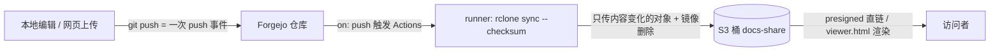

# docs-share：私有 Git 仓库 → S3 直链分享站

把一批要在公网呈现的 Markdown / HTML 放进一个**私有 Git 仓库**；每次 `git push` 或在 Git 网页端上传/编辑文件，CI 自动把仓库内容**增量同步**到一个 S3 兼容对象存储的桶里（桶结构与仓库树一一对应）。对外**不靠反向代理鉴权**，而是用 S3 **presigned 直链**（URL 自带签名 + 有效期）分享。`.md` 在桶里原样存储——直接取对象得到原始 Markdown，套一个 `viewer.html` 则由 markdeep 客户端渲染成排版页面。

适用场景：想要"gh-pages 式自动发布 + 私密分享"，但不想给每个文件配反代 basic_auth、也不想靠"路径猜不到"那种弱隐私。

## 架构与数据流



- **同步方向单向**：Git 仓库是唯一真相源，桶是它的镜像。不要直接往桶里写内容（会被下次同步用 `--remove` 抹掉）。
- **桶私有**：除 `viewer.html` 一个对象匿名可读外，其余对象只能凭 presigned 链接访问。

## 名词：AK / SK 是什么

- **AK = Access Key ID，SK = Secret Access Key**，是 S3（及兼容实现）的一对凭据，相当于对象存储 HTTP API 的"用户名 / 密码"。
- 客户端用 **SK** 对请求做 **SigV4 签名**（HMAC，不在网络上明文传 SK），服务端用请求里携带的 **AK** 找到对应 SK 验签。
- **presigned URL**（预签名直链）= 把这套签名连同 `X-Amz-Expires`（有效期）塞进 URL 查询参数。任何人拿到这条 URL，在有效期内即可访问该对象，无需自己持有 AK/SK——这就是"URL 里给一段密钥就能访问"的实现。
- **root key vs 受限 key**：管理员 key（建桶 / 发 key / 配策略）权限极大，**绝不交给 CI、绝不进 git**。给 CI 的应是一把**绑了 policy、只能读写目标桶**的受限 access key（S3 术语 service account / access key pair）。

## 从零部署（持 root key 的人执行一次）

下面 `<...>` 为按部署填的值；`<S3_ENDPOINT>` 用**公网**端点（presigned 链接要让外部能解析），`<MESH_ENDPOINT>` 用 CI runner 能直连的内网端点（省一跳）。S3 兼容服务可用 MinIO `mc` 操作。

**1. 装 mc 并配 root alias（仅本地临时用，做完即删）**

```bash
curl -sSL -o ~/.local/bin/mc https://dl.min.io/client/mc/release/linux-amd64/mc && chmod +x ~/.local/bin/mc
mc alias set rootadmin <S3_ENDPOINT> <ROOT_AK> <ROOT_SK>
mc ls rootadmin                      # 只读确认连通，并看清已有哪些桶以免误伤
```

**2. 建桶**（桶名 = Git 仓库名，本部署为 `docs-share`）

```bash
mc mb rootadmin/docs-share
```

**3. 建受限 access key（只能碰 docs-share），并实测隔离**

`policy.json`：

```json
{ "Version": "2012-10-17",
  "Statement": [
    { "Effect": "Allow", "Action": ["s3:ListBucket","s3:GetBucketLocation"],
      "Resource": ["arn:aws:s3:::docs-share"] },
    { "Effect": "Allow", "Action": ["s3:GetObject","s3:PutObject","s3:DeleteObject"],
      "Resource": ["arn:aws:s3:::docs-share/*"] }
  ] }
```

```bash
mc admin accesskey create rootadmin/ --access-key <CI_AK> --secret-key <CI_SK> \
  --policy policy.json --name docs-share-ci
# 实测隔离：用受限 key 必须只能碰 docs-share
mc alias set ci <S3_ENDPOINT> <CI_AK> <CI_SK>
mc ls ci/docs-share          # 期望 OK
mc ls ci/<其它桶名>           # 期望 Access Denied —— 不被拒就说明 policy 没生效，别往下走
```

> 受限 key 是否被**真正强制**取决于 S3 实现：上线前务必跑通"访问别的桶被拒"这一步，再把它交给 CI。

**4. 让 `viewer.html` 单对象匿名可读**（其余对象保持私有）

`viewer-policy.json`（只放行这一个对象的匿名 GET）：

```json
{ "Version": "2012-10-17",
  "Statement": [ { "Effect": "Allow", "Principal": {"AWS": ["*"]},
    "Action": ["s3:GetObject"], "Resource": ["arn:aws:s3:::docs-share/viewer.html"] } ] }
```

```bash
mc anonymous set-json viewer-policy.json rootadmin/docs-share
```

**5. 建 Git 仓库（私有）并设 CI secrets**

在 Forgejo（或任何带 Actions/CI 的 Git 服务）建私有仓库 `docs-share`，把受限 key 写成仓库级 secret：`RUSTFS_CI_AK` / `RUSTFS_CI_SK`。endpoint、桶名不是 secret，可直接写进 workflow。

**6. 仓库内容**

- `.forgejo/workflows/sync.yml`（见下「同步流水线」）
- `viewer.html`（见下「markdeep 渲染」）
- 内容按目录命名空间隔离（`demo/`、`notes/` …），不要在根目录平铺。

**7. push 后验证**：Action 成功 → `mc ls --recursive ci/docs-share` 应见仓库树（`.git*` / `.forgejo*` 已排除）。

做完后**把本地 root alias 删掉**，root key 不留盘：`mc alias rm rootadmin`。受限 `ci` alias 保留，供日后生成分享链接。

## 同步流水线（`.forgejo/workflows/sync.yml`）

```yaml
name: sync-to-s3
on:
  push:
    branches: [main]
jobs:
  sync:
    runs-on: docker
    steps:
      - uses: actions/checkout@v4
      - name: install rclone
        run: |
          apt-get update -qq && apt-get install -y -qq rclone >/dev/null
      - name: incremental checksum sync
        env:
          RCLONE_S3_PROVIDER: Other
          RCLONE_S3_ACCESS_KEY_ID: ${{ secrets.RUSTFS_CI_AK }}
          RCLONE_S3_SECRET_ACCESS_KEY: ${{ secrets.RUSTFS_CI_SK }}
          RCLONE_S3_ENDPOINT: <S3_ENDPOINT>     # CI 能直连的话用内网 <MESH_ENDPOINT> 更省一跳
          RCLONE_S3_REGION: us-east-1
          BUCKET: docs-share
        run: |
          rclone sync --checksum -v \
            --exclude '.git/**' --exclude '.forgejo/**' \
            ./ ":s3:${BUCKET}"
```

**为什么是 `rclone sync --checksum` 而不是 `mc mirror` / `rsync`（关键踩坑）**：`actions/checkout` 每次把所有文件以**当前时间**写入工作区，mtime 全被重置。任何**按 size+mtime 判断变化**的工具（`mc mirror`、默认 `rsync`）都会把整棵树判为"已变"→**每次全量重传**，不是真增量。`rclone --checksum` 改为**按内容哈希**（对比 S3 ETag/MD5）判断，无视 mtime，只传内容真的变了的对象。验证方法：内容不变再触发一次同步，桶里对象的 Last-Modified 应**纹丝不动**（0 传输）。`rclone sync` 同时镜像删除（仓库删的对象桶里也删）。

## markdeep 渲染（`viewer.html`）

`.md` 在桶里**原样存储**（下载即原始 Markdown）；渲染交给一个通用 viewer 页客户端完成，因此**不要**把文件命名成 `.md.html`、也**不要**把 markdeep 的 `<script>` 写进 `.md` 里（否则下载到的不是纯 md）。

`viewer.html` 思路：读 `?doc=<URL>` → `fetch` 取原始 md 文本 → 把文本作为 body 内容交给 markdeep 渲染。它是桶内**唯一匿名可读**的对象；当 `?doc=` 指向**同源**的 presigned 链接时，`fetch` 不跨域、无 CORS 问题；markdeep 脚本本身从 CDN 以 `<script>` 方式加载（脚本加载不受 CORS 限制）。

```html
<!DOCTYPE html><html lang="zh-CN"><head><meta charset="utf-8">
<meta name="viewport" content="width=device-width, initial-scale=1"><title>Markdeep Viewer</title></head>
<body><script>
(function () {
  var doc = new URLSearchParams(location.search).get('doc');
  if (!doc) { document.body.textContent = '缺少 ?doc=<url>'; return; }
  fetch(doc).then(function (r) {
    if (!r.ok) throw new Error('HTTP ' + r.status + '（presigned 可能过期）');
    return r.text();
  }).then(function (t) {
    document.body.innerHTML = '';
    document.body.appendChild(document.createTextNode(t));   // markdeep 把 body 文本当 md 源渲染
    window.markdeepOptions = { tocStyle: 'auto', mode: 'markdown' };
    var s = document.createElement('script');
    s.src = 'https://casual-effects.com/markdeep/latest/markdeep.min.js'; s.charset = 'utf-8';
    document.head.appendChild(s);
  }).catch(function (e) { document.body.textContent = '渲染失败：' + e.message; });
})();
</script></body></html>
```

## 日常使用（**不需要 root key、也不需要 CI token**）

这是本设计的关键：日常上传 / 下载 / 分享都只用两样**会持久存在**的东西——Git 的 SSH key，和本地 mc 里那把**受限** `ci` alias。root key 与 CI token 只在「从零部署」时用一次。

- **新增 / 批量更新内容**：`git clone`（走 SSH key）→ 编辑（一次改多个文件都行）→ **一次 `git push`**。
  - **一次 push 推多个 commit 只触发一次同步**：`on: push` 按 **push 事件**触发，不是按 commit；一条 `git push` 里有 N 个 commit 也只跑一次 Action。而且 `rclone sync` 是「对齐到最终状态」的幂等操作，同步的是 push 后的最终树，不在乎中间有几个 commit。
- **下载源文件**：`git pull` / `git clone`。
- **生成分享直链**（持受限 `ci` alias 的机器执行；该 alias 把受限 key 存在 `~/.mc/config.json`，跨会话持久）：

```bash
# 原始直链（下载 = 原始 md / html），7 天有效
mc share download --expire 168h ci/docs-share/demo/guide.md
```

- **分享渲染后的 md**：把上面的 presigned 链接 urlencode 后拼到 viewer：

```bash
RAW=$(mc share download --expire 168h ci/docs-share/demo/guide.md | sed -n 's/.*Share: *//p')
ENC=$(python3 -c "import urllib.parse,sys;print(urllib.parse.quote(sys.argv[1],safe=''))" "$RAW")
echo "<S3_ENDPOINT>/docs-share/viewer.html?doc=$ENC"
```

- **撤销分享**：presigned 链接到期自动失效；要立刻作废所有在途链接，用 root key `mc admin accesskey rm` 删掉受限 key 再重发一把（会让所有已发链接同时失效）。

## markdeep 写作惯例：依据引用 vs 说明脚注（可选）

下面这套只在**同时满足**两个条件时启用：① 用户明确要求"有依据 / 挂来源 / 每条都要出处"；且 ② 这份 md **只通过 markdeep 渲染查看**（不发到 GitHub / VS Code / CommonMark 环境）。

**如果目标是 GFM 兼容**（要发到 GitHub issue、wiki、VS Code 原生预览、或不确定读者用什么渲染器），**不要用 `[#key]`**——CommonMark 不识别，读者只会看到字面的 `[#key]`；给来源直接用普通内联链接 `[说明文字](url)`，也不要做 `**Bibliography**:` 段。

启用 markdeep 引用体系时，两套标识刻意区分用途：

- **外部依据（URL 可核的断言 / 数字 / 官方原话）** → `[#key]`，文末 `**Bibliography**:` 统一列条目。断言后直接跟 `[#key]`，多源并列用逗号 `[#a, #b]`。条目格式：`[#key]: 作者/机构, "标题", 年. URL`。
- **补充说明（展开解释 / 计算口径 / 风险提示，非引用）** → 脚注 `[^1]` / `[^name]`，正文插标识、文末或段末写 `[^name]: 说明`。**脚注在 GFM 2021-09 后也支持，GFM 模式可保留脚注**，只需丢掉 `[#key]`。

语义区别：`[#key]` 回答"这条我从哪看到的"（markdeep 自动汇总到 Bibliography）；`[^name]` 回答"这条要额外解释一下"（**定义行放哪、就在哪渲染**）。

### markdeep 引用 vs GitHub/CommonMark 不兼容点

| 语法点 | Markdeep | CommonMark / GFM |
| --- | --- | --- |
| `[#Key]` 引用 | 识别为学术引用 | 仅当存在 `[#Key]: url` 定义才解析为 shortcut link，否则字面显示 |
| `[#A, #B]`（单括号内逗号） | ✅ 支持 | ❌ 逗号不是合法 label 分隔 |
| `[#Key]: 作者, 年, 标题, URL` 自由混排 | ✅ markdeep 自抽 URL | ❌ CommonMark 要求冒号后紧跟 URL |
| `**Bibliography**:` 段 | ✅ 生成编号 + 反链 | ❌ 仅一段加粗文字 |
| 脚注 `[^name]` | ✅ | ✅（GFM 2021-09 起） |

依据：[CommonMark 0.31.2 spec](https://spec.commonmark.org/0.31.2/)、[GitHub Footnotes 2021-09-30](https://github.blog/changelog/2021-09-30-footnotes-now-supported-in-markdown-fields/)、[Markdeep features](https://casual-effects.com/markdeep/features.md.html)。

### 研报长文模板（作者固化风格，可选）

研报类长文骨架（用户写作惯例，非 markdeep 要求）：

- **文件头 metadata 行**（三项 `·` 分隔一行）：`**最后更新日期**：YYYY-MM-DD　·　**作者**：<name>　·　**话题**：<简述>`，接一行 `---`。
- 首节固定「零、TL;DR」：每条结论一整句（粗体关键词前置、带数字），启用引用体系时末尾必挂 `[#key]`。
- 子节 `### 1.1`；段间 `---` 分隔；表格最后一列统一叫"来源"。
- 行内：原文直引用 `> 原文：**"..."**[#key]`；小结段用粗体标签开头（`**推论**：`/`**策略**：`）；来源分级标记 `【官方】`/`【第三方】`/`【推算】`。
- 结尾：`---` + `**Bibliography**:`（条目一行一条、条间空行）+ 再一个 `---` + `**变更说明**`。

## 排障 / 要点速查

- **改了内容 push 后桶没更新**：看 Action run 是否成功；rclone `-v` 日志看传输了哪些对象。
- **所有对象 Last-Modified 每次都变**：说明用了按 mtime 判断的工具（`mc mirror` 等）→ 换 `rclone --checksum`。
- **presigned 链接 403 / 过期**：`X-Amz-Expires` 到期重新生成；或受限 key 被删/改 policy。
- **viewer 打开空白 / 报错**：`?doc=` 必须是**可 fetch** 的 URL（私有桶用 presigned）；presigned 与 viewer **同源**才无 CORS；浏览器需能访问 markdeep CDN。
- **桶里混进了 `.git` / workflow 文件**：检查 rclone 的 `--exclude` 是否覆盖 `.git/**` 与 CI 目录。
- **想给 CI 直连内网端点省一跳**：runner 在能直达对象存储内网地址的网络里时，把 `RCLONE_S3_ENDPOINT` 换成内网 `<MESH_ENDPOINT>`；但 presigned 分享链接必须用**公网** `<S3_ENDPOINT>`，否则外部打不开。

> 把 Markdown 导出为 PDF 见 `pdf-export.md`；源文件格式转换见 `format-conversion.md`。S3 兼容存储（RustFS / MinIO `mc`）的 versioning、软删/硬删、`ListObjectsV2` 截断等底层行为见 `rustfs.md`。
