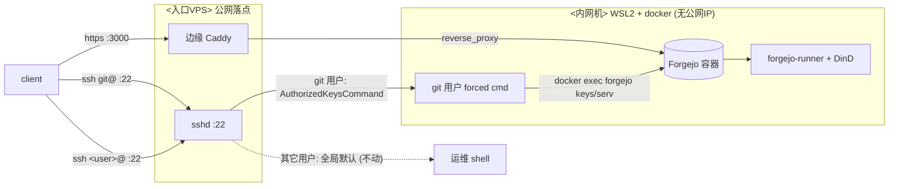

# 自建 Forgejo（内网 WSL2 机）+ 公网 22 SSH relay + CI runner

> 这是一份可照着部署的指南，用占位符代替具体主机/IP/用户名，换台机器时按自己环境替换：
>
> - `<内网机>`：Forgejo 实际运行的机器（本部署是团队后端机：Windows host + 内嵌 WSL2 Ubuntu + Docker Desktop，在 EasyTier mesh 内，无独立公网 IP）。
> - `<MESH_IP>`：`<内网机>` 的 mesh IP（relay 的目的地址）。
> - `<MESH_SSH_PORT>`：`<内网机>` 上 sshd 监听、relay 连进去的端口（按你内网机实际填，本部署是 2222；地位同 `<MESH_IP>`，环境相关）。
> - `<user>`：`<内网机>` 上的部署/运维用户（在 docker 组，免 sudo 跑 docker）。
> - `<入口VPS>`：唯一有公网 IP 的机器，做公网入口（本部署是一台 RHEL 系、未备案的云 VPS）。
> - `<PUBLIC_IP>`：`<入口VPS>` 的公网 IP。
>
> 其余端口 22 / 3000 / 2376 是设计固定值，按原样保留即可。

## 为什么选 Forgejo（选型背景）

- **Forgejo** 是 Gitea 的社区硬分叉，非营利的 **Codeberg** 平台就跑它（[codeberg.org](https://codeberg.org/)）。自建可得到和 Codeberg 同款软件。
- **2025–2026 一批 FOSS 项目从 GitHub 迁向 Codeberg(Forgejo)**：标杆是 Zig 语言 2025-11 迁过去（[codeberg.org/ziglang/zig](https://codeberg.org/ziglang/zig)，仓库 `created 2025-11-25`、`original_url` 指向原 GitHub 仓可佐证）。社区讨论里逃离 GitHub 的常见原因是 Actions/可用性不稳、平台劣化、强推 AI、价值观分歧（这些是社区舆论，未逐条核证）。GitLab、sourcehut 是另两个去向。
- **对自建的意义**：Forgejo + `forgejo-runner` 让 CI 完全跑在自己机器上，不受第三方平台掉线影响。
- 选型结论：**Forgejo + forgejo-runner（server / runner 分离）**，本部署即此架构。

## 目标与难点

`<内网机>` 用 docker compose 跑 Forgejo，但它没有公网 IP；唯一的公网落点是 `<入口VPS>`。要在不破坏 `<入口VPS>` 自身运维的前提下，把三件事透到内网：

- `ssh <user>@<PUBLIC_IP>` → 仍是 `<入口VPS>` 自己的运维 shell（**不能被破坏**）。
- `git clone git@<PUBLIC_IP>:user/repo.git` → 透到内网 Forgejo，且走**标准 22 端口**（clone URL 不带端口号）。
- web UI + git-over-HTTPS → 经边缘 Caddy 反代（`https://<PUBLIC_IP>:3000/`；本部署 VPS 未备案，只能用 IP + `tls internal` 自签证书，client 需 `-k`）。

git 和运维都要用 22 端口，没法简单端口转发。核心做法是 **SSH passthrough + 跨机 relay**：`<入口VPS>` 的 sshd 按**登录用户名**分流——`git` 用户的请求经一条到 `<内网机>` 的 SSH relay 转发进 Forgejo 容器，其它用户走全局默认 shell，完全不受影响。

## 整体架构

一句话：**公网入口 `<入口VPS>` 按"用谁的身份登录"分流**——`git@` 走 git 服务（经 relay 转到内网 Forgejo），`<user>@` 走正常运维 shell，`https://…:3000` 走 web。Forgejo 本体和 CI 都在内网 `<内网机>` 的 docker 里。



> relay 这一跳（`<入口VPS>` → `<内网机>`）走 EasyTier mesh，不经公网。

`git clone git@<PUBLIC_IP>:…` 实际分两步，都由 `<入口VPS>` 的脚本经 relay 转发到内网、再 `docker exec` 进 Forgejo 容器：

1. **查 key**：sshd 的 `AuthorizedKeysCommand` 当场问"这把公钥是谁的"→ relay → `docker exec forgejo forgejo keys` 查 Forgejo 数据库 → 返回一行带 forced command 的 `authorized_keys`。
2. **跑 git**：那行 forced command → relay → `docker exec -i forgejo forgejo serv key-N` 收发 git 数据。

> **为什么在 Forgejo 网页端加一把 SSH key，公网入口机马上就认得？** 因为入口机的 `git` 用户**没有** `authorized_keys` 文件——sshd 配的是 `AuthorizedKeysCommand`，每次连接**当场**经 relay 查 Forgejo 数据库里的公钥表（网页端加的 key 正存在这里）。key 始终只在 Forgejo 数据库里，**从不拷到入口机**。

下面按 ①内网机 Forgejo → ②web 入口 → ③SSH relay → ④CI 的顺序部署。

## ① 内网机：Forgejo + PostgreSQL

`<内网机>` 上建个目录（本部署是 `~/forgejo/`，路径随意），放下面的 `docker-compose.yml`。这份文件**一次写全**，含后面 ④ 要用的 `docker-in-docker` / `runner` 两个容器（先只起 `server` `db`，runner 要注册后再起）。其中 `server`+`db` 来自官方 [docker.md](https://forgejo.org/docs/latest/admin/installation/docker/) 的 PostgreSQL 示例，`docker-in-docker`+`runner` 来自官方 [Actions runner 文档](https://forgejo.org/docs/latest/admin/actions/installation/docker/)：

```yaml
networks:
  forgejo:
    external: false

volumes:
  docker_certs:

services:
  server:
    image: codeberg.org/forgejo/forgejo:15
    container_name: forgejo
    environment:
      - USER_UID=1000
      - USER_GID=1000
      - FORGEJO__database__DB_TYPE=postgres
      - FORGEJO__database__HOST=db:5432
      - FORGEJO__database__NAME=forgejo
      - FORGEJO__database__USER=forgejo
      - FORGEJO__database__PASSWD=${POSTGRES_PASSWORD}
      - FORGEJO__server__DOMAIN=<PUBLIC_IP>
      - FORGEJO__server__ROOT_URL=https://<PUBLIC_IP>:3000/
      - FORGEJO__server__HTTP_PORT=3000
      - FORGEJO__server__SSH_DOMAIN=<PUBLIC_IP>
      - FORGEJO__server__SSH_PORT=22
      - FORGEJO__server__START_SSH_SERVER=false
      - FORGEJO__server__DISABLE_SSH=false
      - FORGEJO__service__DISABLE_REGISTRATION=true
      - FORGEJO__security__INSTALL_LOCK=true
      - FORGEJO__session__COOKIE_NAME=forgejo_<unique>
    restart: unless-stopped
    networks:
      - forgejo
    volumes:
      - ./data:/data
      - /etc/timezone:/etc/timezone:ro
      - /etc/localtime:/etc/localtime:ro
    ports:
      - "127.0.0.1:3000:3000"
    depends_on:
      - db

  db:
    image: postgres:14
    container_name: forgejo-db
    restart: unless-stopped
    environment:
      - POSTGRES_USER=forgejo
      - POSTGRES_PASSWORD=${POSTGRES_PASSWORD}
      - POSTGRES_DB=forgejo
    networks:
      - forgejo
    volumes:
      - ./postgres:/var/lib/postgresql/data

  docker-in-docker:
    image: data.forgejo.org/oci/docker:dind
    container_name: forgejo-dind
    hostname: docker
    privileged: true
    restart: unless-stopped
    environment:
      - DOCKER_TLS_CERTDIR=/certs
    networks:
      - forgejo
    volumes:
      - docker_certs:/certs
      - ./dind:/var/lib/docker

  runner:
    image: data.forgejo.org/forgejo/runner:12
    container_name: forgejo-runner
    restart: unless-stopped
    depends_on:
      - server
      - docker-in-docker
    environment:
      - DOCKER_HOST=tcp://docker:2376
      - DOCKER_CERT_PATH=/certs/client
      - DOCKER_TLS_VERIFY=1
    networks:
      - forgejo
    volumes:
      - ./runner:/data
      - docker_certs:/certs
    command: forgejo-runner --config /data/config.yml daemon
```

换机要改的值：

- `DOMAIN` / `ROOT_URL` / `SSH_DOMAIN` → 你的 `<PUBLIC_IP>`（或域名）。`SSH_PORT=22` 是 Forgejo 生成 clone URL 用的展示值，配合 22 relay。
- `START_SSH_SERVER=false`：**关掉 Forgejo 内置 SSH server**（容器没公网、也不监听 22），但 `DISABLE_SSH=false` 保留 SSH 克隆能力——git transport 由 relay + `forgejo serv` 承担（见 ③）。
- `COOKIE_NAME` 设成一个**独特名**（见「关键坑 · cookie 改名」）。
- `POSTGRES_PASSWORD` 放同目录 `.env`（`POSTGRES_PASSWORD=...`，权限 600），compose 用 `${POSTGRES_PASSWORD}` 引用。
- 镜像 tag `forgejo:15` 里的 `15` 会自动跟最新 15.x。撰写时最新已发布大版本是 15；官方文档示例里出现的 `16` 当时还没发布镜像，按实际能拉到的大版本填。

起服务：`docker compose up -d server db`，再 `curl -I http://127.0.0.1:3000/` 应得 200。

### 镜像与数据目录：用非 rootless，注意挂载路径

Forgejo 官方镜像有两种（[官方 docker.md](https://forgejo.org/docs/latest/admin/installation/docker/)）：

- **非 rootless**（`forgejo:15`，本部署用这个）：容器以 root 启动再降权到 `git`，数据目录是 **`/data`**（`GITEA_CUSTOM=/data/gitea`，git 仓库落在 `/data/git/repositories/`）。
- **rootless**（`forgejo:15-rootless`）：全程不以 root 跑，数据目录是 `/var/lib/gitea`，要额外配 `user: 1000:1000`、SSH 映射到 `:2222`。

**为什么用非 rootless**：本部署跑在 Docker Desktop / WSL2 + bind mount 下，rootless 镜像常因宿主目录属主/权限重映射出问题（官方文档专门提醒过这类权限坑）；而本部署只把 `./data` 一个目录挂进容器、不碰宿主敏感路径，root 容器的额外风险很小。

> **别和 "rootless Docker" 混了——这是两个不同的层：**
> - **镜像 rootless**（本节说的 `-rootless` 后缀）：只管**容器内 app 进程**用 uid 1000 还是容器 root，**不改变**你启动容器要不要权限——两种镜像都一样 `docker compose up`。
> - **引擎 rootless**（rootless Docker / Podman）：让 docker 守护进程以**普通用户**跑，**用它无需 root 或 `docker` 组**。这才是决定"要不要 sudo"的层，也是多租户 / 拿不到 root 的共享机给你的模式。
>
> 所以 rootless **镜像**的安全收益主要在 **rootful 引擎**上才明显（本部署即此：在 `docker` 组 ≈ 有 root，容器内 root = 宿主/VM 的 root，这时换 rootless 镜像才算纵深防御）。而在 **rootless 引擎**下，连非 rootless 镜像的容器 root 也被 user namespace 重映射成普通 uid，宿主已被引擎保护，镜像选哪个更无所谓。本部署是**单租户 + rootful 引擎 + 自己人才在 docker 组**，故这层纵深防御省得起。

**挂载路径必须匹配镜像类型**：非 rootless 就写 `./data:/data`。最容易踩的坑是给非 rootless 镜像错写成 `./data:/var/lib/gitea`——容器根本不读这个路径，会自己在 `/data` 上挂一个 **docker 匿名卷**：数据看着正常，其实落在匿名卷里，`docker compose down -v` 或换 compose 就丢、也难备份。自查：

```
docker inspect forgejo --format '{{range .Mounts}}{{.Source}} -> {{.Destination}}{{println}}{{end}}'
```

要能看到 `… -> /data`；且宿主 `./data` 里应有 `git/ gitea/ ssh/` 三块，空的就是挂错了（修复见「关键坑 · 数据落进匿名卷」）。

## ② web 公网入口：Caddy 反代 + 默认中文

web UI + git-over-HTTPS 经 `<入口VPS>` 的边缘 Caddy 反代到 `<内网机>:3000`。Forgejo 容器只把 3000 发布到 `127.0.0.1:3000`（compose 里的 `ports: "127.0.0.1:3000:3000"`），不直接对外，对外只经 Caddy。Caddy → `<内网机>` 的具体链路（mesh / Windows portproxy / wslrelay / WSL→容器端口形态）是通用 WSL/Docker 网络问题，见 [`network.md`](network.md) 的「WSL / Docker 服务暴露（入站）」。

把整站默认语言设成简体中文：在 Caddy 里 forgejo 的 `reverse_proxy` 子块加 `header_up Accept-Language "zh-CN"`，压过浏览器的 `Accept-Language`。未登录/未设语言的用户即默认中文；用户在右下角切过语言后会写 cookie，cookie 优先级更高、记住其选择。

## ③ 公网 SSH relay：VPS sshd 分流 + 中转脚本

整套的核心，三部分：`<入口VPS>` 的 sshd 分流、`<入口VPS>` 的两个中转脚本、`<内网机>` 的 authorized_keys 内联转发。

### (a) `<入口VPS>` sshd：给 git 用户单独分流

先建一个本机 `git` 用户（`useradd git`，家目录放 relay 私钥，见 (b)）。在 `<入口VPS>` 的 `sshd_config` 末尾加一段 `Match User git`——只影响登录名 `git`，全局配置和其它用户完全不动：

```
# >>> forgejo-relay BEGIN
# 把登录用户 git 限制为"只能走 Forgejo git transport（经 relay 到内网）"
Match User git
    AuthorizedKeysCommand /usr/local/bin/forgejo-authkeys %u %t %k
    AuthorizedKeysCommandUser git
    AuthorizedKeysFile none
    PasswordAuthentication no
    KbdInteractiveAuthentication no
    X11Forwarding no
    AllowTcpForwarding no
    PermitTTY no
# <<< forgejo-relay END
```

- `AuthorizedKeysCommand` 让 sshd 每次连接**动态查 key**（不读静态文件，故 `AuthorizedKeysFile none`），`%u %t %k` = 用户名 / key 类型 / key blob。
- `AuthorizedKeysCommandUser git`：这条查询命令以 `git` 身份跑。
- 改 sshd 要稳：先备份 → `sshd -t` 校验通过 → `systemctl reload sshd`（reload 不断现有连接，配错也不会立刻锁死你）。SSH 服务名因发行版而异（见「关键坑 · 发行版差异」）。云厂商的 VNC / 串口控制台是改坏时的最后兜底。

### (b) `<入口VPS>` 两个中转脚本

这两个脚本**就是单机 Forgejo 里 `forgejo keys` / `forgejo serv` 两个功能的"跨机版"**：单机部署时 sshd 直接调 forgejo 二进制的这俩子命令；这里 VPS 上没有 forgejo，于是用两个 shell 脚本把请求经 relay 转给内网机容器里的 `forgejo keys` / `forgejo serv` 执行。脚本本身只做 ssh 转发——**VPS 不需要任何 forgejo 二进制**，公网那台越干净越安全。

`/usr/local/bin/forgejo-authkeys`（sshd 查 key 时调，把 `keys` 请求经 relay 转给内网，再把内网返回的 key id 拼成一行带 forced command 的 authorized_keys 回给 sshd）：

```bash
#!/usr/bin/env bash
# VPS sshd 的 AuthorizedKeysCommand（以 git 身份跑，参数 = %u %t %k）。
# = 单机 Forgejo 里 `forgejo keys` 的跨机版：把 (类型,公钥) 经 relay 转给内网机
#   容器查，再把返回的 key-N 改写成一行指向本机 forgejo-serv 的 authorized_keys。
set -uo pipefail
RELAY="ssh -i /home/git/.ssh/relay_key -p <MESH_SSH_PORT> -o IdentitiesOnly=yes -o ControlMaster=no -o ControlPath=none -o BatchMode=yes -o StrictHostKeyChecking=accept-new -o ConnectTimeout=8 <user>@<MESH_IP>"
keyid="$($RELAY "keys ${2:-} ${3:-}" 2>/dev/null | grep -m1 -oE 'key-[0-9]+')" || exit 0   # 查不到 / relay 失败 → 干净拒绝
printf 'command="/usr/local/bin/forgejo-serv %s",no-port-forwarding,no-X11-forwarding,no-agent-forwarding,no-pty,restrict %s %s\n' "$keyid" "$2" "$3"
```

`/usr/local/bin/forgejo-serv`（上面拼出的 forced command 的目标；把客户端真正的 git 命令 base64 后经 relay 转给内网的 `serv`）：

```bash
#!/usr/bin/env bash
# 上面那行 authorized_keys 的 forced command（参数 = key-N）。
# = 单机 Forgejo 里 `forgejo serv` 的跨机版：把客户端真正的 git 命令
#   （在 $SSH_ORIGINAL_COMMAND 里）base64 后经 relay 转给内网机容器执行。
set -uo pipefail
exec ssh -i /home/git/.ssh/relay_key -p <MESH_SSH_PORT> \
  -o IdentitiesOnly=yes -o ControlMaster=no -o ControlPath=none \
  -o BatchMode=yes -o StrictHostKeyChecking=accept-new -o ConnectTimeout=8 \
  <user>@<MESH_IP> "serv ${1:?keyid} $(printf '%s' "${SSH_ORIGINAL_COMMAND:-}" | base64 -w0)"
```

两脚本 `chmod 755`、root 拥有。relay 私钥 `/home/git/.ssh/relay_key`（600、git 拥有）+ 预填 `known_hosts`。git 命令必须 base64：它含空格和引号，跨两跳 SSH + shell 会被切碎，base64 成一个整块最稳。那串 `-o ControlMaster=no …` 见「关键坑 · ControlMaster」。

### (c) `<内网机>`：authorized_keys 内联转发

relay 的另一端落在 `<内网机>` 的 `<user>`（用它当 relay 端点，免 sudo）。在 `<user>` 的 `~/.ssh/authorized_keys` 里给 relay 公钥加**一行 forced command**，把 relay 请求 dispatch 成对 Forgejo 容器的 `docker exec`：

```
command="/usr/bin/bash -c 'set -- $SSH_ORIGINAL_COMMAND; a=${1:-}; if [ \"$a\" = keys ]; then exec docker exec -u git forgejo forgejo keys -e git -u git -t \"$2\" -k \"$3\" --config /data/gitea/conf/app.ini; elif [ \"$a\" = serv ]; then exec docker exec -i -u git -e SSH_ORIGINAL_COMMAND=\"$(printf %s \"$3\" | base64 -d)\" forgejo forgejo serv \"$2\" --config /data/gitea/conf/app.ini; else echo \"relay: bad action\" >&2; exit 1; fi'",no-port-forwarding,no-X11-forwarding,no-agent-forwarding,no-pty,restrict ssh-ed25519 <relay-pubkey> forgejo-relay@<入口VPS>
```

- `<内网机>` 收到的请求要递进 Forgejo 容器，靠 `docker exec`（只能在容器外的宿主上跑，所以这段逻辑在宿主、不在容器里）。
- **一把 key 承载两种操作**：`set -- $SSH_ORIGINAL_COMMAND` 拆出 action，`keys` / `serv` 两路分别 `docker exec`，其它输入一律 `relay: bad action` 拒绝。这个 dispatch 去不掉——请求是动态的、藏在 `$SSH_ORIGINAL_COMMAND` 里，没法写死成一条裸命令。
- `serv` 那路 `docker exec` **必须带 `-i`**（保留 stdin），否则 push 会挂死（见「关键坑」）。
- **直接内联进 `command=` 而不另放脚本**：省一个文件、改 key 时一处可见。`command=` 外层是双引号、内部只能用 `\"` 转义双引号，所以主体用单引号包 `bash -c '...'`（主体内不含单引号才成立）。`forgejo serv` / `forgejo keys` 是 Forgejo 的原生子命令（官方 SSH 直连模式内部也是调它们），这里把它们"借"出来用。

**验收**：把客户端公钥加到某个 Forgejo 账户后，`ssh <user>@<PUBLIC_IP>` 仍是运维 shell、`git clone git@<PUBLIC_IP>:user/repo.git` 能拉到仓库即通。

## ④ CI：Forgejo Actions runner（DinD 隔离）

Forgejo Actions 自 `Forgejo v1.21` 起**默认启用**（[官方 Actions admin 文档](https://forgejo.org/docs/latest/admin/actions/)：「As of Forgejo v1.21, Actions is enabled by default」），无需改 `app.ini`。Forgejo 本体不跑 job，靠独立的 **forgejo-runner**。① 的 compose 已含两个容器：

- `docker-in-docker`（`data.forgejo.org/oci/docker:dind`，privileged，hostname 必须是 `docker`）：**独立的 docker daemon 跑在容器里**，job 容器都在它里面起、与宿主 docker 隔离。TLS 证书经 `docker_certs` 卷共享。
- `runner`（`data.forgejo.org/forgejo/runner:12`）：`DOCKER_HOST=tcp://docker:2376` 指向 DinD。

> 用 **DinD + TLS（2376）** 而非官方 [runner docker 文档](https://forgejo.org/docs/latest/admin/actions/installation/docker/) 最简示例的明文 `2375 --tls=false`：privileged 的 DinD 守护进程 ≈ 近乎宿主 root 的能力，明文 2375 无认证、同网络任何容器都能控制它；TLS 让只有持 `docker_certs` 证书的 runner 连得上。带 TLS 的多容器写法对应官方 runner 仓库的 [`examples/docker-compose`](https://code.forgejo.org/forgejo/runner/src/branch/main/examples/docker-compose)。

注册三步：

1. **生成 token**（全局 runner token，admin 级）：
   ```
   docker exec -u git forgejo forgejo actions generate-runner-token
   ```
   （web 界面拿的 secret 与 CLI token 不是一回事；自动化用 CLI token。）
2. **注册**（创建 `./runner/.runner`）。instance URL 用**容器内部地址** `http://forgejo:3000`（HTTP 明文走 compose 网络，避开公网自签 TLS）：
   ```
   docker compose run --rm runner forgejo-runner register --no-interactive \
     --instance http://forgejo:3000 --token <TOKEN> --name dind-<host> \
     --labels "docker:docker://data.forgejo.org/oci/node:20-bookworm,ubuntu-latest:docker://data.forgejo.org/oci/node:20-bookworm"
   ```
   label 形如 `name:docker://image`：把 `ubuntu-latest` 映射到一个 node 镜像，这样 `runs-on: ubuntu-latest` 能用、`actions/checkout`（需 node 运行时）也跑得起来。
3. **配置 + 启动**：`docker compose run --rm runner forgejo-runner generate-config > runner/config.yml`，把 `container.network` 改成 `"host"`（见下），再 `docker compose up -d docker-in-docker runner`。

### runner 网络的关键设计

job 容器跑在 **DinD 的独立 daemon** 里，DinD 的网络命名空间默认解析不到宿主 compose 网络上的 `forgejo`。解法：

- DinD 容器挂到 Forgejo 的 compose 网络（compose 项目名前缀，本部署是 `forgejo_forgejo`）→ DinD 能解析 `forgejo:3000`。
- runner config `container.network: "host"` → job 容器共享 DinD 的 netns → job 内 `actions/checkout` 能从 `http://forgejo:3000` clone（内部 HTTP，无 TLS 验证问题）。

> **host vs bridge（为什么不能用默认）**：这是 **docker 套娃的两层网络**——job 容器由 **DinD 内层 docker daemon** 创建、待在内层 bridge（实测 `172.17.0.0/16`），而 `forgejo` 在**外层 compose** 网络（实测 `172.20.0.0/16`），两层互不相通。用默认 `network: ""`（自动建网）或 `bridge`，job 待在内层 bridge 只能 NAT **向外**出公网、却**够不到内部 `forgejo:3000`**（clone 失败；装了 Mihomo/Clash 之类的机器上 `forgejo` 还会被兜底解析成连不通的 fake-ip `198.18.x`，看着"解析成功"实则连不上）。`host` 让 job 共享 **DinD 容器自己的 netns**，而 DinD 本身在外层 compose 里 → job 借它的身份才直连得上 `forgejo`。代价：job 与 DinD 共享网络栈、隔离略松，换来内部直连。**设置点就是 `runner/config.yml` 的 `container.network: "host"`**（`generate-config` 默认 `""`，需手改，即 ③ 第 3 步）。

runner 日志里会看到 `task N repo is <repo> https://data.forgejo.org http://forgejo:3000`：前者是 `DEFAULT_ACTIONS_URL`（`uses:` 不带 host 时去 data.forgejo.org 拉公共 action），后者是内部实例地址。

### 验收

push 一个最小 workflow（`.forgejo/workflows/ci.yml`，`on: [push]` + 几个 `run: echo`）到任一启用了 Actions 的仓库：

```
docker logs forgejo-runner            # task N picked up
docker exec forgejo-db psql -U forgejo -t -c \
  "select id,name,status from action_run_job order by id desc limit 1;"
```

`action_run_job.status` 枚举：`1=Success 2=Failure 3=Cancelled 4=Skipped 5=Waiting 6=Running 7=Blocked`。首跑会慢（DinD 内首次拉 node 镜像），状态 6→1 即通。

### 资源 / 并发

- 并发：runner config `runner.capacity`（默认 1，同时几个 job）。
- CPU / 内存 / 文件系统配额：给 `docker-in-docker` 和 job 容器加 docker 资源限制（compose `deploy.resources` 或 runner config `container.options` 注入 `--cpus` / `--memory`）。资源充裕默认不设限。
- DinD 的 `/var/lib/docker` 用 `./dind` bind mount 持久化，避免每次重启重拉镜像。

### 查看 / 拉取 action 运行日志

REST API（`/api/v1/.../actions/tasks`、`/actions/runs`、`/actions/runs/{id}`）只返回 run 的**状态与元数据**，swagger 里**没有**下载日志正文的端点。正文只有两条路：

- **Web UI**（`/{owner}/{repo}/actions/runs/{run_index}/jobs/{job_index}`）是 **web 端点，只认登录 session cookie，不认 API token**——带 `Authorization: token` 访问 web 路径会被当成匿名，私有仓库对匿名返回 **404**（不泄露存在性，跟匿名访问私有仓库主页一致）。所以"直接 curl raw-log URL"对**公开**仓库成立，对**私有**仓库得先模拟登录拿 cookie（GET 取 `_csrf` → POST `/user/login` → 存 cookie，还要过可能的 2FA），脆。

- **读服务器端日志文件**（脚本化最稳）：日志按 job 落在 `<forgejo-data>/gitea/actions_log/<owner>/<repo>/<NN>/<task_id>.log.zst`，**zstd 压缩**。`<NN>` 是 `task_id` 的零填充两位前缀目录（`2 → 02/2.log.zst`、`123 → 12/123.log.zst`）；这条相对路径直接存在 `action_task.log_filename` 字段。forgejo 容器是 alpine、**不带 zstd**，在宿主或带 zstd 的环境解：

  ```bash
  # 由 repo 反查最近一次 job 的日志相对路径
  docker exec forgejo-db psql -U forgejo -d forgejo -At -c \
    "SELECT t.log_filename FROM action_task t JOIN repository r ON r.id=t.repo_id \
     WHERE r.lower_name='<repo>' ORDER BY t.id DESC LIMIT 1;"   # -> <owner>/<repo>/NN/<id>.log.zst

  # 解压 + 去掉 ANSI 颜色码（宿主有 zstd 时）
  zstd -dc "<forgejo-data>/gitea/actions_log/<owner>/<repo>/NN/<id>.log.zst" | sed 's/\x1b\[[0-9;]*m//g'
  # 无 zstd：python3 -c 'import zstandard,sys; sys.stdout.buffer.write(zstandard.ZstdDecompressor().decompress(open(sys.argv[1],"rb").read(), max_output_size=50_000_000))' <file>
  ```

> `action_run.index`（仓库内 run 序号，= Web URL 里的 `{run_index}`）与全局 `action_run.id` 不是一回事；按 repo 反查日志走 `action_task` 表最直接。`action_run_job.status` 枚举见上节验收。

## 关键坑

### ControlMaster 复用绕过 relay（最隐蔽）

`<内网机>` 的 `~/.ssh/config` 若有 `Host * ControlMaster auto`，会让任何 ssh 调用**复用已存在的 master 连接**，从而绕过 `-i relay_key`（用默认 key）、绕过 forced command（落到普通 shell），relay 行为完全错乱且难排查。所以 relay 方向的 ssh 必须显式禁用 mux：`-o ControlMaster=no -o ControlPath=none -o IdentitiesOnly=yes -o BatchMode=yes`（③(b) 的两个脚本已内置）。

### serv 必须流式透传 stdin

git 的 `upload-pack` / `receive-pack` 是双向流。③(c) 里 `serv` 那路 `docker exec` **必须带 `-i`**，否则 push（receive-pack）会挂死。`keys` 那路无所谓。

### 入口机发行版差异

下面几点取决于 `<入口VPS>` 是什么发行版（本部署恰好是 RHEL 系，`ID_LIKE="rhel fedora centos anolis"`）：

- **SSH 服务名**：RHEL 系是 `sshd`（`systemctl reload sshd`）；Debian/Ubuntu 的 systemd unit 反而叫 `ssh.service`（`sshd.service` 只是 alias）——反直觉，reload 前先 `systemctl list-units '*ssh*'` 确认。二进制和配置两边都是 `sshd` / `sshd_config`。
- **sshd_config 结构**：本部署入口机主文件无 `Include`、无 `/etc/ssh/sshd_config.d/`，故 `Match` 段直写主文件末尾；很多发行版有 `sshd_config.d/` drop-in 目录，那就优先放 drop-in。无论哪种，改前用 `sshd -T` 看**有效合并配置**。（`/etc/ssh/ssh_config` 的 `Include` 是**客户端**配置，与 sshd 无关。）
- **SELinux / AppArmor**：本部署 SELinux 是 Disabled，`/usr/local/bin/` 自定义脚本无 label 顾虑；若你的机器 SELinux enforcing，自定义路径脚本可能被拦（需合适 context / `restorecon`），AppArmor 同理留意。

### cookie 改名（登录 500）

同一个公网 IP 上若先后跑过别的 Gitea/Forgejo，浏览器会按**域名/IP（不分端口）**残留默认名 `i_like_gitea` 的旧 session cookie。Forgejo 接管后拿这个 64 字符旧 cookie 去换新 session id，长度校验失败 → `RegenerateSession: invalid 'sid' ... 64 != 16` → `POST /user/login` **500**（密码其实是对的，这步在密码验证通过之后才执行）。无痕窗口/换浏览器正常就是这个特征。根治：① 的 compose 里把 `COOKIE_NAME` 设成独特名，和旧 `i_like_gitea` 脱钩，recreate 容器即可（无需用户清浏览器）。

### 数据落进匿名卷 → 迁回 bind mount

若 data 挂错（见 ① 的镜像/挂载说明）、数据落进了匿名卷，迁回：① `docker compose stop server` ② `docker cp forgejo:/data/. ./data/`（`docker cp` 走 docker API，能跨 Docker Desktop 的 VM 边界）③ 改 compose 挂载为 `./data:/data` ④ `docker compose up -d server` ⑤ 验证宿主 `./data` 有数据、不是全新装、loopback 200 ⑥ 旧匿名卷 dangling 后 `docker volume rm <id>`（**别用 `docker volume prune`**，会误删同机其它项目的 dangling 卷）。
