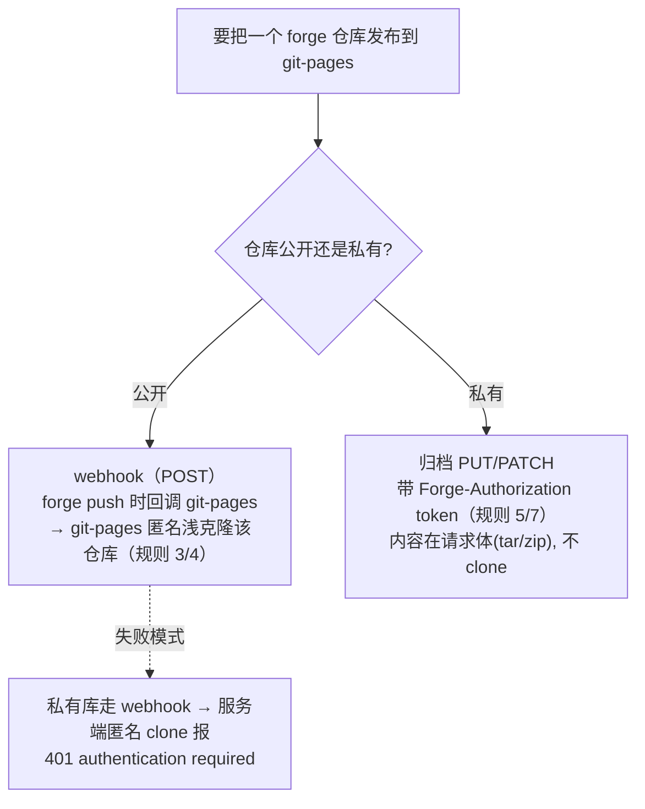

# git-pages —— 给 Git forge 补静态站托管（GitHub Pages 替代品）

> 一句话：Forgejo / Gitea 本身**没有**原生 Pages 功能，[git-pages](https://codeberg.org/git-pages/git-pages)（官网 [git-pages.org](https://git-pages.org/)，0BSD（0-clause BSD）许可，Go，作者 Catherine 'whitequark'）是一个**单独部署、配合 forge 使用**的服务：一次 HTTP 请求或 git push 就能发布静态站，内容存进它自己的存储（文件系统或 S3），**不挂靠可公开浏览的 git 分支**，所以能做"路径不可猜"的分享。Codeberg 官方的 `*.codeberg.page` 现在就是用它跑的。

按你的身份读：只想**用 Codeberg 官方托管**看「用 Codeberg 官方托管」一节（零运维）；**自建了 Forgejo/Gitea** 想配自己的 Pages 看「自建」一节（装 git-pages、反代、鉴权）。背景概念、S3 桶布局、鉴权源码剖析在对应小节。

**跟本 skill `docs-share.md`（rclone→S3 presigned 直链）那套的取舍**：docs-share 那套是"仓库树整体镜像进 S3 桶 + 签名链接分享"，`.md` 靠边缘 Caddy Accept-rewrite + markdeep 客户端渲染，默认私有、逐文件签名带有效期；git-pages 这套是"forge 里的仓库直接变网站"，文件按路径原样 serve（图片/资源即普通文件，**不用**再把图片内联成 data-URI），域名/TLS 全自动。想"push 完就有个能直接点开的网页站点、路径即 URL"选 git-pages；想"逐文件签名 + 有效期 + 默认不可读"选 docs-share 那套。

> 本文所有 git-pages 源码断言均**核验于 upstream `main` 提交 `7d3368e`（2026-07-13）**；行号/文件链接见文末「参考源码位置」，锁到该 commit（仓库的 `latest` tag 是滚动的，故锚 SHA 不锚 tag）。早期横向对比数据（star / license / release）核验于 2026-07-04，会随时间浮动。

---

## 背景速览

### Codeberg Pages、Pages v2、git-pages 三个名字的关系

**Codeberg Pages** 是非营利代码托管平台 [Codeberg](https://codeberg.org/) 给用户提供的静态站托管服务，相当于"Codeberg 版的 GitHub Pages"（Codeberg 跑的是 **Forgejo**——Gitea 的社区硬分叉，这段背景见本 skill `git-server.md` 的「同源与现状」一节）。对本文最关键的一点：**Codeberg Pages 的后端是开源的 `git-pages`，同一套服务你能照搬到自己的 Forgejo/Gitea 上自建**（就是下面「自建」一节要做的事）。常被混为一谈的三个名字：

- **Pages Server v2** —— 旧后端**代码库**（仓库 [`Codeberg/pages-server`](https://codeberg.org/Codeberg/pages-server)，EUPL-1.2）。2024-11 起进入维护模式，见置顶 issue [#399 "We will not accept new features!"](https://codeberg.org/Codeberg/pages-server/issues/399)；仓库首页写着 "This code is in maintenance mode… **Codeberg Pages itself is in the process of migrating to the new git-pages server**"。
- **git-pages** —— 新后端**代码库**，v2 的官方继任者。[官方文档](https://docs.codeberg.org/codeberg-pages/) 原文："Codeberg Pages **has recently migrated** from the legacy v2 codebase to the newer git-pages codebase"、"**Since December 2025**, Codeberg offers a new Pages service based on git-pages… It is free/libre open source software."
- **Codeberg Pages** —— Codeberg 面向用户的**服务品牌**（不是代码库）。今天它 = **git-pages（新迁移的站点）+ 老 v2（未迁移的存量站点）并存**，底层跑在 git-pages 上。迁移是**单向、要用户主动推一次才生效**的软切换（[迁移文档](https://docs.codeberg.org/codeberg-pages/migrating-from-pages-v2/)："your old v2 Pages deployment will continue working indefinitely"）。

一句话理顺：**代码库这条线是 Pages Server v2 → git-pages 的新旧更替**；而 **Codeberg Pages 是服务品牌、不是任何一个代码库**——始终是同一个服务，只是把底层后端从 v2 换成了 git-pages。想确认某站切没切，看 HTTP 响应头 `Server`：`pages-server` 是老后端、`git-pages` 是新后端。（Codeberg 未公布 codeberg.page 托管量，官方唯一量化数字是平台总量"[50,000+ 用户](https://blog.codeberg.org/the-hardest-scaling-issue.html)"，该博文 2023-01 发，如今应更多。）

### v2 → git-pages 的破坏性变更

迁移前值得先知道（均据[迁移文档](https://docs.codeberg.org/codeberg-pages/migrating-from-pages-v2/)）：

- **内容不再自动拉取**。v2 会替你把仓库内容取过去发布；git-pages 改成推送模型——**每次更新后你必须主动"推一下"**（配一个 webhook，或用 Forgejo Actions）它才会更新（"Content is no longer fetched automatically"）。
- **`raw.codeberg.page` 取消**。先交代 **CORS（Cross-Origin Resource Sharing，跨源资源共享）**：浏览器默认按"同源策略"拦跨源读取——`https://a.com` 页面里的 JS 用 `fetch()` 读 `https://b.com` 的文件会被拦，除非 `b.com` 在**响应头**里加 `Access-Control-Allow-Origin` 放行（这个头只能被读取方 `b.com` 设）。v2 为此单独给一个 `raw.codeberg.page` 裸内容域名，凡经它取的响应**一律带 `Access-Control-Allow-Origin: *`**——任何外部站点都能跨源读。git-pages 取消该域名，**改由站点作者在站点根 `_headers` 文件里、按路径自行声明发不发 CORS 头、对哪个源开**（Netlify 风格，见下「HTTP API」）——从"一个裸域名对所有源无差别放开"收成"作者精确控制哪条路径放行哪个源"。
- **不能再用 `/仓库/@分支` 直接翻任意 repo/branch**。v2 允许 `用户名.codeberg.page/仓库/@分支/…` 访问任意仓库任意分支——等于把整个 forge 当免费 CDN，是常见滥用向量；git-pages 改为**只服务你显式部署过的那个站点**（"Serving arbitrary resources from Codeberg was a common abuse vector"）。

迁移本身**零停机、单向软切换**：老 v2 站无限期继续可用，一旦你改用任一新发布方式，该站从此改由 git-pages 服务。也正因 v2 这些设计缺陷（含被滥用的访问方式），**新站点如今一律建在 git-pages 上、v2 只维护存量**。

### 免费与配额对比（vs GitHub Pages）

真正的区别不在收费（都免费），而在**配额是否公开**、**私有站要不要钱**——Codeberg 没公布数字，无从比大小（下表能查到的角度都列，未公开的直接标）：

| 维度 | [GitHub Pages](https://docs.github.com/en/pages/getting-started-with-github-pages/what-is-github-pages) | Codeberg Pages（git-pages）|
|---|---|---|
| 收费 | 免费 | 免费 |
| 私有仓库发布 Pages | 需 Pro/Team/Enterprise 付费 | 不分公开/私有、无付费分级 |
| 配额是否公开 | ✅ 明文：站点 1GB、带宽 100GB/月（软限）、构建 10 次/小时——[limits 文档](https://docs.github.com/en/pages/getting-started-with-github-pages/github-pages-limits) | ❌ 未公布数字，只有"合理使用 / 反滥用"口径 |
| 自定义域名 + HTTPS | ✅ 免费、自动签证书 | ✅ 免费、自动签证书（DNS 记录授权）|
| 站点公开性 | 公开，**即使仓库私有也公开**（[配置发布源文档](https://docs.github.com/en/pages/getting-started-with-github-pages/configuring-a-publishing-source-for-your-github-pages-site)的 warning）| 公开；官方托管**无内建访问控制**（自建可加）|
| 后端能否自托管 | ❌ 专有 | ✅ git-pages 开源（0BSD），可自建 |
| 运营方 | GitHub / Microsoft（商业公司）| Codeberg e.V.（柏林注册非营利协会，纯捐款）|

### 发布模型：推送式 vs 分支拉取

这是 git-pages 与 GitHub Pages 最本质、也最容易搞混的差别。

**git-pages：推送式，且"发布"与"源码托管"分开。** git-pages 把**发布**（deploy，交出构建产物）和**源码托管**（git 仓库存源文件）拆成两件事：你把产物**主动推**给 git-pages（HTTP `PUT`/`PATCH`、webhook `POST`，或官方 CLI / Forgejo Action），它存进自己的私有存储（文件系统或 S3），**中间不经过任何可对外浏览的 git 仓库**。两个直接后果：

- **内容不会被自动拉取**：git-pages 不轮询你的仓库，每次更新都要主动"推一下"才生效。
- **路径可以做到"不可猜"**：私有存储没有"列目录 / 列所有站点"接口，路径不泄露就无从枚举——和"S3 桶不开 listing、只靠随机 key"同理。注意这**不是**签名/限时的 presigned URL：路径一旦泄露内容即公开，"降低被撞见概率" ≠ 访问控制。前提是别把同一份内容**也**挂在公开可浏览的 git 分支上，否则 forge 文件浏览器照样翻得到（这正是下面几个"从分支发布"的工具做不到不可猜路径的原因）。

**GitHub Pages：两种"发布源"可切换。** Settings → Pages → Source 里二选一：**Deploy from a branch**（推到某分支即自动发布，属"分支/拉取式"，会自动跑 Jekyll）；**GitHub Actions**（workflow 把产物打成 artifact 再 deploy，更接近 git-pages 的"推送式"）。⚠️ [配置发布源文档](https://docs.github.com/en/pages/getting-started-with-github-pages/configuring-a-publishing-source-for-your-github-pages-site)里有显式 Warning：**GitHub Pages 站点一旦发布就公网公开，哪怕源码仓库是私有的**——别把敏感内容留在发布仓库里。

| 维度 | git-pages（推送式）| GitHub Pages |
|---|---|---|
| 发布源 | 只有一种：`PUT`/`PATCH`/webhook/CLI/Action 主动推产物 | 两种可切：分支源 / GitHub Actions |
| 产物与源码的关系 | **分离**：产物进 Pages 私有存储，可不挂公开分支 | 分支源＝产物就是某分支；Actions＝产物打成 artifact |
| 是否自动发布 | 否，必须 webhook/Action 触发 | 分支源＝推到分支即自动发；Actions＝workflow 触发 |
| 构建在哪 | 你自己在 CI 里构建，git-pages 只收产物 | 分支源可自动跑 Jekyll；Actions＝你自定义构建 |
| "不可猜路径" | ✅ 私有存储、无 listing | ❌ 站点公开、URL 规则固定；私有仓库的站点仍公开可见 |

### 同类自建工具横向对比

Codeberg 官方在用的是 **git-pages**。另外三个是跟 Codeberg 无关、给**自建 Gitea/Forgejo** 用的第三方项目，能力跨度极大——从"4 个环境变量的极简静态托管"到"带 JS 动态路由 + 反代 + OAuth 的准应用服务器"都有（✓/✗ 按当时各仓 `main` 源码核验）：

| 维度 | [**git-pages**](https://codeberg.org/git-pages/git-pages) | [d7z-project/gitea-pages](https://github.com/d7z-project/gitea-pages) | [deadnews/gitea-pages](https://github.com/deadnews/gitea-pages) | [MexHigh/Forge-Pages](https://github.com/MexHigh/Forge-Pages) |
|---|---|---|---|---|
| 许可 | 0BSD | Apache-2.0 | MIT | AGPL-3.0 |
| Star / 最新 release | 424★ · v0.9.1 | 17★ · v0.0.2 | 8★ · v1.0.1 | 2★ · 无 release（GitHub 是[MIRROR]）|
| 语言 / 依赖体量 | Go，独立后端 | Go，**重**（goja + goja_nodejs + websocket + lru + afero + gitea SDK）| Go，**极轻**（仅 gitea SDK 依赖，几百行核心，distroless 静态镜像）| Go，轻（oauth2 + scs + yaml）|
| 定位 | 通用、可横向扩展、官方生产级 | homelab 全功能"准应用服务器" | 极简静态托管 | 小众自托管，卖点是 OAuth2 私有页 |
| 内容怎么进来（发布模型）| **推**产物到 Pages 存储（`PUT`/`PATCH`/webhook/CLI/Action），不必挂公开分支 | 从 `gh-pages` **分支**经 Gitea API 读 | 从 `gh-pages` **分支**经 Gitea API 读 | **推** `POST /deploy`（tar.gz），不必挂公开分支 |
| 发布鉴权（**谁能推**，写侧）| DNS challenge / forge token / **Forge Wildcard** / `PAGES_INSECURE`（四选一，见下「鉴权方案」；Forge Wildcard = forge 通配多租户，一个域名后缀下各用户各发各站，本文档也用它）| 靠 forge repo 写权限（谁能推 `gh-pages` 谁能发）| 靠 forge repo 写权限（同左）| workflow token（如 `${{ forgejo.token }}`）校验对该 repo 的写权限 |
| 静态托管 | ✓ | ✓ | ✓ | ✓ |
| JS 动态路由 | ✗ | ✓ **Goja 引擎**（按路由挂 JS handler）| ✗ | ✗ |
| 反向代理 | ✗ | ✓ 按路由反代到上游 | ✗ | ✗ |
| WebSocket / SSE | ✗ | ✓ JS realtime | ✗ | ✗ |
| 自定义域名 | ✓（DNS 记录授权）| ✓（CNAME alias，写在 `.pages.yaml`）| ✗ | ✓（`<owner>` 子域名，需通配 DNS）|
| 私有页 / 访问控制（**谁能看**，读侧）| ✗ **无登录鉴权**：只有 `_headers` 里的 `Basic-Auth` 伪头，且 README/源码明说"**非安全特性**、明文存储、仅防搜索引擎收录"——真正"看不看得到"靠"不可猜路径" | ✓ **Gitea OAuth 登录**：`private: true` 的站要求登录，按当前用户对该 repo 的 read 权限放行 | ✗ 无：服务端 token 读得到的仓库，谁都能看 | ✓ **Forgejo/Gitea OAuth2**（`protect` 参数 / `.protect` 文件）：仅对该 repo 有 read/pull 权限者可见 |
| 缓存 | 产物即存储 | **TTL 缓存**（默认约 1min，memory/redis）| **无缓存**，每请求实时读 Gitea API | 产物存本地 fs |
| 存储后端 | 文件系统 / **S3** | memory/local/etcd/badger/**S3**/overlay + redis | 无（实时读 Gitea）| 本地文件系统 |
| 路径可否不可猜（obscurity，**不是**访问控制）| ✅ 私有存储、无 listing | ❌ 内容在公开分支，forge 可翻 | ❌ 同左 | ◑ `additional_base_path` 可加随机段，且产物不挂公开分支 |
| 生命周期 | `Expires:` 头 + `DELETE` | 无站点 TTL | 无站点 TTL | `DELETE`（无 TTL）|
| 配置复杂度 | `config.toml` | `config.yaml` + 分支内 `.pages.yaml`（面大）| **4 个环境变量**（极简）| `config.yml` + 通配 DNS |

> **表里三行"鉴权/隐私"管的是不同的事**（最容易看拧）：**发布鉴权（写侧）**="谁能把站点推上去"；**访问控制（读侧）**="谁能看已发布的站点"，这才是**私有页**；**不可猜路径**=一种**弱隐私**（security-through-obscurity），**不是**访问控制。三者正交。关键结论：**git-pages 写侧很强（DNS challenge / forge token…），但读侧没有真正的登录鉴权**——只给"不可猜路径" + `_headers` 的 `Basic-Auth` 伪头（官方明说非安全、明文、仅防爬虫）。**要"登录才能看"的真·私有页，得用 d7z 或 Forge-Pages 的 forge OAuth**（deadnews 完全没有）。

各家一句话取舍：

- **deadnews/gitea-pages**——极简派：4 个环境变量、单静态二进制 distroless、无缓存每次实时读 Gitea，适合"就是发点静态 HTML、推到 `gh-pages` 就行"。代价：**无鉴权**（服务端 token 能读的仓库谁都能访问，别裸暴露公网）、无自定义域名、无动态能力。
- **d7z-project/gitea-pages**——比名字强得多的**准应用服务器**：按路由挂 Goja JS 处理器 / 反代 / 模板 / 重定向，另带 WebSocket、SSE、受限 `fetch`、按 repo 隔离的 KV，私有页走 Gitea OAuth。想要"静态站 + 少量动态 / 鉴权"时最全。代价：配置面大、依赖重。
- **Forge-Pages**——四个里唯一和 git-pages 一样"推产物、不挂公开分支"的第三方（`POST /deploy` + tar.gz）；用 workflow token 校验写权限，`additional_base_path` 给"一仓多版本 / PR 预览"各自独立不可猜路径，私有页走 OAuth2。URL 是 `https://<owner>.<base>/<repo>/*`，需通配 DNS。

---

## 用 Codeberg 官方托管

只想用 Codeberg 现成托管：建仓库、推、访问、绑域名，零运维。

### 建仓库

用户主站放仓库 `pages`（发布后 = `https://<用户名>.codeberg.page/`）；项目站放任意仓库（= `.../<仓库名>/`）。

### 三种发布方式

**手动推 `pages` 分支 + webhook**（最朴素，适合手写 HTML）：把内容放 `pages` 分支，给仓库配一个 push webhook 指到 Codeberg 的 Pages 端点，push 即发布。

**Forgejo Actions + 官方 Action**（适合静态站生成器）：CI 里用 [git-pages/action](https://codeberg.org/git-pages/action)，`with: { site, token: ${{ forge.token }}, source }`，把构建产物推上去；Forgejo Actions 的自动 token 就够，无需手建。

**git-pages-cli 手推**（本地 / 脚本一次性发）：[git-pages-cli](https://codeberg.org/git-pages/git-pages-cli) `--upload-dir <目录>` 直接把本地目录推上去。

**发布哪份内容、走哪个分支**：用户主站从仓库 `pages` 取；项目站默认从该仓库的 `pages` 分支取。产物树的**根**才是站点根（未必是仓库根，取决于你把 `_site`/`dist` 里哪一层推上去）。

### 访问 URL 规则

发布后地址（[codeberg.page 首页](https://codeberg.page/)）：`https://<用户名>.codeberg.page[/<仓库名>]`。

- `https://alice.codeberg.page/` —— 用户主站（仓库 `pages`）。
- `https://alice.codeberg.page/myrepo/` —— 项目站。
- ~~`/@分支`~~ —— **旧 v2 行为，git-pages 已弃用**：[迁移文档](https://docs.codeberg.org/codeberg-pages/migrating-from-pages-v2/)明确 "You can no longer use the `/repository/@branch` access"。（首页模板至今仍印 `[/@BRANCH]`，但那是过时文案：实测真分支 `/@main/`、瞎编分支、普通假路径返回**逐字节相同的 404**——`@` 已无选分支语义，照用即 404。）
- 用户名/仓库名带点号（`.`）会撞 Let's Encrypt 通配证书，改用 `https://pages.codeberg.org/user.name/`（[troubleshooting](https://docs.codeberg.org/codeberg-pages/troubleshooting/)）。

### 自定义域名

跟 v2 一个区别：**v2 要在仓库根放 `.domains` 文件**列出绑定的域名；**git-pages 改用 DNS 记录本身做授权**，那个文件不再需要（[自定义域名文档](https://docs.codeberg.org/codeberg-pages/using-custom-domain/) "it is no longer necessary to have a `.domains` file… You may remove it if you are migrating…"）。加一条指向 Codeberg 的记录（三选一）：

| 场景 | 记录类型 | 值 |
|---|---|---|
| 子域名 | `CNAME` | `codeberg.page.` |
| 裸域名 / 已有其他记录 | `ALIAS`（或 Cloudflare flattened CNAME） | `codeberg.page.` |
| 都不支持时 | `A` + `AAAA` | `217.197.84.141` / `2a0a:4580:103f:c0de::2` |

坑：① 有 [CAA 记录](https://letsencrypt.org/docs/caa/) 的必须显式放行 Let's Encrypt，否则签证书失败；② 你的域名开了 DNSSEC 而 `codeberg.page` 没签，得改用 A/AAAA。

**第二步——授权 TXT**（[自定义域名文档](https://docs.codeberg.org/codeberg-pages/using-custom-domain/) "Step 2"）：上面的 CNAME/A 只把流量导到 Codeberg，**还要再加一条 TXT 证明"这个仓库有权发布到这个域名"**，否则被拒（值填仓库 HTTPS clone URL；每个子域名如 `www` 各一条）：

- 手推 `pages` / webhook：`_git-pages-repository.yourdomain.com. TXT "https://codeberg.org/<用户名>/<仓库>.git"`（**不需 token**）。
- Forgejo Actions：`_git-pages-forge-allowlist.yourdomain.com. TXT "https://codeberg.org/<用户名>/<仓库>.git"`。

### 404 页与重定向

放在**站点根**（[高级用法文档](https://docs.codeberg.org/codeberg-pages/advanced-usage/)）：

- **`404.html`** —— 自定义 404 页。
- **`_redirects`** —— 每行 `from  to  [status]`（`#` 注释）。status：`200`=不改 URL 取另一路径内容（SPA 回退）、`301`=永久跳、`302`=临时跳。例：

  ```
  /example        https://example.com/   301   # 单条跳转
  /*              /index.html            200   # SPA：所有路径回退到 index
  /articles/*     /posts/:splat          302   # :splat 保留通配部分
  ```

---

## 自建：Forgejo/Gitea + 自部署 git-pages

面向"自己有 Forgejo/Gitea，想配一套自己域名的 Pages"的管理员。**两个角色**：**你（管理员）**把 git-pages 当新服务部署一次（装 + 反代 + 选鉴权），这台 forge 才"有了 Pages 能力"；之后**仓库用户**用哪种方式推，取决于你选的鉴权方案，用户侧体验和 Codeberg 用户一样。

### 装 git-pages（binary / Docker / Nix / 源码）

官方 CI 产出 **4 个平台预编译二进制**（Go 静态编译、零依赖），发布在 [Codeberg Releases](https://codeberg.org/git-pages/git-pages/releases)（`git-pages.linux-amd64` / `linux-arm64` / `darwin-arm64` / `windows-amd64.exe`，linux-amd64 约 30MB）：

- **二进制直下**（最轻）→ 丢进 `/usr/local/bin/`；
- **Docker** `codeberg.org/git-pages/git-pages:latest`；
- **Nix**（声明式包管理）：仓库根有 `flake.nix`，装了 Nix 直接 `nix run` 一次拉起、不往系统散装依赖；
- **源码** `go install codeberg.org/git-pages/git-pages@latest`（需 Go ≥ 1.25）。

**standalone vs supervisord**——看 `Dockerfile` 结尾：默认 `CMD ["git-pages"]` 是 standalone（只跑 git-pages，纯 HTTP `:3000`，不带 TLS）；可选 `supervisord` 同时拉起 git-pages + 打包的 Caddy(ACME)。**只要你前面已有 Caddy/nginx 做边缘 TLS，就用默认 standalone**——让边缘反代把域名转到 `:3000`，别让它自带 Caddy 抢 80/443（`conf/supervisord.conf` + `conf/Caddyfile` 那套 on_demand_tls + certmagic-s3 只在没有别的反代时才用）。

> git-pages **不自带 systemd unit**（仓库只有 Dockerfile + supervisord，没有 `.service`），自建要**自己写一个**：`ExecStart` 指到二进制、传 `-config` / `-secrets`，用专用 `User=` 跑。S3 key 这类敏感值走 `-secrets` 文件、配 systemd `LoadCredential=` 注入最干净——但 `LoadCredential` 有版本门槛（systemd ≥ 247）和老发行版静默失败的坑，完整写法与回退方案见本 skill `service.md` 的 systemd `LoadCredential` 一节。

### config.toml + S3 后端

启动参数（`src/main.go`）：`-config`（默认 `config.toml`）、`-secrets`（默认 `$CREDENTIALS_DIRECTORY/secrets.toml`——**原生适配 systemd `LoadCredential`**，密钥只挂给该服务的私有运行时目录，不落持久化明文）、`-no-config`（全用环境变量）。段结构与键名照搬 `conf/config.example.toml` 的 `[server]` / `[storage]` / `[storage.s3]` / `[limits]`，下面只做三处自建常见改动（把 `type` 从 example 默认的 `'fs'` 改 `'s3'`、换本地值并对明文 HTTP 端点开 `insecure`、密钥挪进 `secrets.toml`）：

```toml
[server]
pages   = 'tcp/localhost:3000'   # 站点服务口（反代打这里）
caddy   = 'tcp/localhost:3001'   # on-demand-tls 询问口；不用自带 Caddy 时设 "-" 关掉
metrics = 'tcp/localhost:3002'

[storage]
type = 's3'                      # 或 'fs'（[storage.fs] root='./data'）

[storage.s3]                     # 接任意 S3 兼容存储（RustFS/MinIO/Garage…）
endpoint          = '<host:port>'
access-key-id     = '...'        # 建议改放 secrets.toml
secret-access-key = '...'
bucket            = 'git-pages'
region            = 'us-east-1'
insecure          = true         # 自建 endpoint 走明文 HTTP（RustFS/MinIO 本地口）必须开；
                                 # 默认按 https 连，连 http 端口会静默报 Access Denied（backend_s3.go: Secure = !insecure）

[limits]
max-site-size    = '128M'
allow-expiration = false         # 想用 Expires: 头做过期，打开这个
allow-basic-auth = false
```

`secrets.toml`（chmod 600，只放密钥；systemd `LoadCredential` 挂进来）：

```toml
[storage.s3]
access-key-id     = 'AKxxxx'
secret-access-key = 'xxxxxx'
```

#### secrets.toml 必须放桶级受限 key，别用存储 root key

**这是重要的安全边界，别图省事直接填 root key。** S3 兼容对象存储（如 RustFS）一般分两类凭据：

- **root / admin key**——能建桶、发 key、设 bucket policy，对**所有桶**有全权；只在部署那一刻临时用（建桶 + 发受限 key），用完即从客户端删掉，绝不长期留存。
- **桶级受限 key**——只能读写指定的那**一个**桶，是日常唯一该长期存在的凭据。

git-pages 跑在公网 VPS，S3 后端通常是内网另一台机的对象存储。secrets.toml 一旦塞 root key，**VPS 被拿下 = 攻击者拿到整个对象存储所有桶的读写 / 删除权**（不止 pages 桶）；填受限 key 则把爆炸半径锁死在 `git-pages` 这一个桶内。

**最小权限策略（RustFS 实测，2026-07-14）。** git-pages 会自己往桶里写 `blob/`（内容）、`site/`（manifest 清单）、`meta/`，删站 / 过期还要删对象——所以**读 / 写 / 删 / 列举都得有**，只读不够；罐头策略 `readwrite`/`readonly` 是 `arn:aws:s3:::*`（全桶）不能用。桶未开 versioning 时不需要 `s3:*ObjectVersion` / `s3:*BucketVersioning` 那几个 action。下面 5 个 action 足够（桶名按实际替换）：

```json
{
  "Version": "2012-10-17",
  "Statement": [
    { "Effect": "Allow",
      "Action": ["s3:GetObject", "s3:PutObject", "s3:DeleteObject"],
      "Resource": ["arn:aws:s3:::git-pages/*"] },
    { "Effect": "Allow",
      "Action": ["s3:ListBucket", "s3:GetBucketLocation"],
      "Resource": ["arn:aws:s3:::git-pages"] }
  ]
}
```

用 mc 落地（root alias 用完即弃、别留客户端）：

```bash
mc admin policy create ROOT git-pages git-pages-policy.json
mc admin user add    ROOT git-pages "$(openssl rand -hex 24)"   # AK=git-pages，SK 随机
mc admin policy attach ROOT git-pages --user git-pages
```

**换 key 后必做 crosscheck。** 用受限 key 建个 mc alias，确认①能对本桶 put/get/rm、②对**其它桶** `mc ls`/`mc pipe` 一律 `Access Denied`。RustFS 权限**惰性生效**——git-pages 启动只连不鉴权，日志 `serve: ready` **不代表 key 能用**，真正验证要打一个实际站点请求（读 `site/<domain>/.index` + `blob/`）看到 HTTP 200 有内容才算通。换 key 步骤：备份旧 `secrets.toml` → `install -o git-pages -g git-pages -m 600` 装新文件 → `systemctl restart git-pages` → curl 一个已知站点验 200。

> release 落后 `main` 多少：实测（2026-07-04）**v0.9.1 是目前唯一 release**，`main` 领先约 21 commit，但 `config.example.toml` 的键几乎没动，只多 3 个（`[[wildcard]]` 的 `preview-domain`/`max-preview-lifetime`、`[limits]` 的 `allow-expiration`）。落盘前跑 `git-pages -config <file> -print-config` 验证——能解析就打印 effective 配置、非法键逐条点名。

### S3 桶内部布局与 serve 心智模型

请求 `https://<user>.<zone>/<project>/<path>`：git-pages 按 wildcard 模式把 host+path 映射到一个 **manifest（站点清单）**，再从 manifest 找文件 serve。**没有 manifest 就 404**——git-pages 不按需 clone、不即时构建，内容必须**事先推上去**。排障时直接 `mc ls` 看桶（S3 后端）：

| key | 是什么 |
|---|---|
| `blob/sha256/xx/yy/<hash>` | 内容寻址的文件本体，按 sha256 去重（多站点共享同一文件只存一份）|
| `site/<domain>/.index` | 根路径 `/` 的 manifest（protobuf，引用 blob）；**有它 = 首页有内容** |
| `site/<domain>/<project>` | 具名子项目 `/<project>/` 的 manifest |
| `site/<domain>/.exists` | 域名存在标记（0 字节）|
| `meta/…` | 时间戳 / feature 标记 |
| `audit/<id>` | 审计记录（可选）|

**`.exists` 的用途 = Caddy on-demand TLS 的 ask 校验**（`src/caddy.go`）：Caddy 收到某域名 TLS 握手 → 问 git-pages 的 caddy/ask 口"该发证 / serve 这个域名吗" → git-pages `StatObject site/<domain>/.exists` 存在即放行。所以它**故意独立于内容**、且**删站/过期时只删 manifest、保留 `.exists`**（`DeleteManifest`/`ExpireManifest` 只移除 `.index`；否则删个站会连带打断该域名的 TLS）。

由此一个反直觉现象：**桶里某域名只有 `.exists`、没有 `.index`** ≠ "从没构建过"，而是"**曾成功部署过、后来 manifest 被删或过期**"（`Update()` 写序是先 `StoreManifest`(→`.index`) 再 `CreateDomain`(→`.exists`)，故 `.exists` 存在必然部署成功过至少一次）——残留的 `.exists` + 变孤儿的 blob 等 GC。

### 边缘反代 Caddyfile

git-pages 跑 standalone、监听 `:3000`（`config.default.toml` 绑 `tcp/localhost:3000` 仅本机；官方 Docker 的 `config.docker.toml` 绑 `tcp/:3000` = 容器内所有接口，靠不发布端口隔离），由你现有 Caddy 顶前面做 TLS + 反代。两种写法：

**单个固定域名 + 真证书**（有公网 DNS 指过来）：

```caddyfile
pages.example.com {
    reverse_proxy 127.0.0.1:3000
}
```

**通配 / on-demand**（一个 Caddy 服务多个 pages 子域名）——**on-demand TLS** 是 Caddy 的特性：不预签，**等第一个 HTTPS 请求进来、按 SNI 主机名当场现签**（适合子域名动态、数量未知）。风险是随便一个主机名来访都触发签发、撞 Let's Encrypt 限额，所以 Caddy 允许配一个询问端点：签之前先问"这域名该不该签"。git-pages 正好提供这个口（`[server] caddy` 那个地址），让 Caddy 只给**已发布的站**签：

```caddyfile
{
    on_demand_tls {
        permission http http://127.0.0.1:3001   # git-pages 的 caddy 口，问它该不该签
    }
}

*.pages.example.com {
    tls { on_demand }
    reverse_proxy 127.0.0.1:3000
}
```

> 通配块按 Host/SNI 路由、与别的站共用 Caddy 的 `:443`（不占独立端口）；**不写 `authorize with`**——pages 本就是公开静态站、不设登录墙。首次 HTTPS 发布有鸡生蛋问题：git-pages **在站点发布前无法为该域名申请证书**（[git-pages-cli 文档](https://codeberg.org/git-pages/git-pages-cli)）。首发要么走明文 HTTP，要么用 CLI 的 `--server <已有证书的域名>` 指一个已有证书的 host 中转。

> ⚠️ **on-demand 的 permission 口是命门，必须收紧、也怕后端挂**（两个方向的坑）：
> - **不收紧 = 签证风暴**：`permission` 若指向一个"来者不拒"的端点（或干脆没配），任意野域名来握手都会触发签发，撞 Let's Encrypt 限额（`too many certificates` / 子域名标签数超限的 `too many subdomain labels`，最长 **30 天**退避），还会持续占 Caddy 内部 certmagic 的 obtain 锁，和 `caddy reload` 卡死高度同时段。所以**一定**把 permission 指到 git-pages 的 `:3001`（它只对真发布过的站 `StatObject .exists` 放行），别用宽松兜底。运维现象与根因详见 `vps-maintenance` skill 的 [`references/caddy.md`](../../vps-maintenance/references/caddy.md) 「`on_demand_tls`」「reload 卡住」两节。
> - **收紧后又 fail-closed**：permission 口一旦答不了（git-pages 挂了、或它连不上 S3 后端 `StatObject` 超时），Caddy 就**签不出证书 → 整个 `*.pages` 站点直接 TLS 握手失败、不可达**。这不是风暴而是"静默全挂"，排查时先 `curl http://127.0.0.1:3001/?domain=<某已发布域名>` 看 ask 口是否 200，再看 git-pages ↔ S3 后端是否通。

### 要改哪些 DNS 记录

`<域名>` = 站点根域、`<edge>` = 边缘反代公网 IP、`<host>` = 完整站点域名。按选的模式加：

每种模式都要一条把域名指向边缘的**解析记录**（A/AAAA/CNAME）；**额外的 `_git-pages-*` TXT 只有 DNS Challenge / Allowlist 那两类才要**，通配多租户和单域名固定站都不用。「要 TXT?」列一眼看清：

| 场景 | 解析记录（都要）| 要 TXT? | 额外 TXT 记录 |
|---|---|---|---|
| **通配多租户 = Forge Wildcard（方案 C，最常用）** | `*.pages.<域名>` A/AAAA → `<edge>`（或 CNAME 到边缘主机名）| **否** | 无——鉴权靠请求里的 forge token，DNS 只管解析 |
| **单域名固定站** | `pages.<域名>` A/AAAA/CNAME → `<edge>` | **否** | 无 |
| **DNS Challenge（方案 A）** | 上面那条 | **是** | `_git-pages-challenge.<host>` TXT = CLI `--challenge` 算出的哈希（口令可多条 TXT）|
| **Forge Allowlist（方案 B）/ 免 token Repository Allowlist** | 上面那条 | **是** | `_git-pages-forge-allowlist.<host>` 或 `_git-pages-repository.<host>` TXT = 仓库 clone URL（只授权根 / `.index` 站）|
| **自定义域名接到某租户** | `<自定义域名>` CNAME → 边缘 | 看所选方案 | 用方案 A/B 才加对应 TXT；用方案 C 则无（同 Codeberg 托管版）|

> 有 DNS 服务商 API（如 Spaceship）时，解析记录 + TXT 都能脚本化下发——前提是那把 API key 对 `<域名>` 本身有 DNS 写权限（只授权别的域名会 404 `SOA ... not found`）。

### 选一种"谁能推"的鉴权方案

**归档直传 / 删除**类请求（tar/zip 的 PUT/PATCH、DELETE）的鉴权入口是 `authorizeDNSChallengeOrForgeWithToken`（`src/auth.go`），**按顺序**尝试 `PAGES_INSECURE → DNS Challenge → Forge Wildcard → Forge DNS Allowlist`，第一个通过即放行。挑一种：

> 注意：**推 git 仓库 / webhook**（PUT body 为仓库 URL、POST webhook）走的是另一个函数 `AuthorizeUpdateFromRepository`，多一种**免 token、免 forge API** 的方式——在 `_git-pages-repository.<域名>` TXT 里列出允许的 clone URL 即可（README Authorization 第 3 条）。想"webhook 推 `pages` 分支就发布"、又不想建任何密钥的自建场景，这条最省事。下表对照的是归档直传路径。

| 方案 | 密钥类型 | 额外鉴权 DNS(TXT) | 要不要 forge API | 适合 |
|---|---|---|---|---|
| **DNS Challenge** | 自签口令（你随便定）| 是（1 条 TXT）| 否 | 单站、脚本发、最少依赖 |
| **Forge Token + DNS Allowlist** | forge access token | 是（1 条 TXT）| 是 | 复用 forge 账号权限、能按账号撤销（"deploy token"）|
| **Forge Wildcard**（= 通配多租户）| forge token（含 CI 自动 token）| 否 | 是 | 一个域名后缀、无数用户各发各站（多租户）|
| **边缘 ****** `PAGES_INSECURE`** | 你在 Caddy 里定的 ****** | 否 | 否 | 不想碰 DNS，安全全押在反代上 |

> 「额外鉴权 DNS(TXT)」列指的是**除基础解析记录外，还要不要加 `_git-pages-*` TXT**。四种模式都得先有一条把域名指向边缘的 A/AAAA/CNAME（那是解析、不是鉴权）；只有 DNS Challenge / Allowlist 需要再加鉴权 TXT。Forge Wildcard 虽然要一条 `*.pages.<域名>` 通配解析，但那仍是解析记录、**没有鉴权 TXT**，故填「否」。

**DNS Challenge（自签口令）**——本质是"把一个口令的哈希写进 DNS TXT"。用官方 CLI 一条命令生成口令 + 现成 TXT：

```bash
git-pages-cli https://pages.example.com --challenge
# 输出：password: 28a616f4-...（口令，自己收好）
#       _git-pages-challenge.pages.example.com. 3600 IN TXT "a59ecb..."（把这条加到 DNS）
```

TXT 加到 DNS 后，发布带口令即可（`net.LookupTXT` 返回该名下**所有** TXT，命中任意一条即过——同名挂多条 = 多个口令，适合轮换）：

```bash
git-pages-cli https://pages.example.com --password <口令> --upload-dir ./_site
# 或裸 curl：
curl https://pages.example.com/ -X PUT --data-binary @site.tar.gz \
  -H 'Content-Type: application/x-tar+gzip' -H 'Authorization: Pages <口令>'
```

口令别名 `--password-file` / `GIT_PAGES_PASSWORD` 环境变量，避免进 argv。与 Let's Encrypt 的 DNS-01 challenge **不是一回事**（LE 是实时一次性验证域名控制权；这里是永久 TXT，每次发布现查现比）。

**Forge Token + DNS Allowlist（"deploy token"）**——不自己造口令，用 forge 的 access token 当发布凭据，git-pages 去问 forge"这 token 对这仓库有没有 push 权限"。① Forgejo 建 token：Settings → Applications → Access tokens，勾 **user: Read** + **repository: Read and write**；② DNS 加 `_git-pages-forge-allowlist.pages.example.com. TXT "https://git.example.com/user/repo.git"`（可多条）；③ 发布 `git-pages-cli … --token <forge-token> --upload-dir ./_site`。**好处**：撤销某人只需在 forge 改，不用换口令。**代价**：多一个"必须活着的 forge API"运行时依赖；源码 `if projectName != ".index"` 写死——**只能授权根/索引站点，不能给子项目单独授权**。token 别名 `GIT_PAGES_TOKEN` 环境变量。

**Forge Wildcard（多租户）**——就是 Codeberg 给每个用户发 `<用户名>.codeberg.page` 的机制，`config.toml` 配 `[[wildcard]]`：

```toml
[[wildcard]]
domain        = "pages.example.com"
clone-url     = "https://git.example.com/<user>/<project>.git"
index-repo    = "pages"
authorization = "forgejo"
```

请求进来时按 **host 子域名标签 = 用户名** + **路径首段 = 项目名** 套 `clone-url` 模板**现算**仓库：**根 `/`** → 项目名取 `.index` → 用 `index-repo`（如 `pages`）→ 仓库 `<user>/pages`，分支取 `index-repo-branch`；**`/<项目>/`** → 仓库 `<user>/<项目>`，**分支在代码里硬编码为 `pages`**（`src/wildcard.go`：`.index` 用 `IndexBranch`，否则 `branch = "pages"`）。算出仓库后拿请求带的 forge token 核权限。CI 里用官方 [git-pages/action](https://codeberg.org/git-pages/action) 时 Forgejo Actions 的自动 token 就够，还支持 PR 预览站。单站场景**别用它**——它要求"后缀前恰好多一段子域名"，固定单域名套不上。

> **多 forge 并存 + 排序坑（实测 v0.9.1）**：可配多个 `[[wildcard]]` 段让不同 forge 各自多租户（如 forgejo 用 `pages.example.com`、gitea 用 `gitea.pages.example.com`）。但**若一个 domain 是另一个的后缀，务必把更长/更具体的排前面**——否则短后缀那段会先匹配到长后缀租户的 host：实测把"host 去掉 domain 后缀"的**整段前缀**当 user（如 `alice.gitea.pages.example.com` 落到 `pages.example.com` 段时被当 user=`alice.gitea`），clone-url 算错、鉴权失败。
>
> **GitHub 做多租户**要单独说：GitHub 不认 gogs 兼容 API（`authorization` 不能设成任何 forge），只能走 **Wildcard Match content（下面 8 条规则的规则 4）**——`[[wildcard]]` 的 `authorization` **留空**，然后 `POST` 一个 GitHub push webhook（body 含 `repository.clone_url` + `ref`，头 `X-GitHub-Event: push`、`Content-Type: application/json`），git-pages 按模板匹配 clone-url（**免 token、免 forge API**）后现克隆该**公开** repo 的对应分支。实测能从公网直接 clone GitHub 公开库并发布。

**边缘 Bearer + `PAGES_INSECURE`**——`PAGES_INSECURE=1` 让 git-pages **无条件放行**所有到达它的请求（`authorizeInsecure`）。配合 git-pages 只监听 `127.0.0.1` + Caddy 只对带正确 Bearer 令牌的写请求放行，就成了"Caddy 是唯一关卡"：

```caddyfile
pages.example.com {
    @write method PUT PATCH POST DELETE
    @noauth not header Authorization "Bearer <token>"
    handle @write {
        handle @noauth { respond 403 }
    }
    reverse_proxy 127.0.0.1:3000
}
```

**代价**：安全**单点**押在"Caddy 配置写对 + git-pages 永不暴露公网"上——Caddy 一旦漏配或 git-pages 意外监听公网，`PAGES_INSECURE` 谁来都放行，没有第二道防线。DNS Challenge / Forge Token 那几种即使 Caddy 出错，git-pages 自己那道校验仍独立生效。**生产慎用，仅在你完全掌控反代时用**。

**完整鉴权规则表（README 的 8 条，按判断顺序）**——上面四个是最实用的；完整看，内容更新鉴权 README 列了 8 条按序尝试的规则（`src/auth.go` 逐条对应）：

| # | 规则（README）| 触发方法 | 载体 | 调 forge API? | 对 GitHub | 关键限制 |
|---|---|---|---|---|---|---|
| 1 | Development Mode | 任意 | `PAGES_INSECURE=1`（"边缘 Bearer"是 **Caddy 层**附加约定，git-pages 代码里无对应实现）| 否 | ✓ | 无条件放行，生产禁用 |
| 2 | DNS Challenge | PUT/PATCH/DELETE/POST | `_git-pages-challenge.<host>` TXT + 口令（`Authorization: Pages <口令>`，或 Basic `Base64("Pages:<口令>")` 给发不了自定义头的 GitHub/Gogs）| 否 | ✓ | 绝对权限；PUT/POST 限分支 `pages` |
| 3 | DNS Allowlist（repo）| PUT / POST | `_git-pages-repository.<host>` TXT 列 clone URL | **否、免 token** | ✓ | **仅根 / `.index` 站**；**不能 DELETE** |
| 4 | Wildcard Match（content）| **仅 POST**(webhook) | `[[wildcard]]` 配置 + webhook payload | **否** | ✓（收 GitHub payload）| 只走 webhook，REST 不行 |
| 5 | Forge Auth（wildcard）| PUT/PATCH/DELETE | `[[wildcard]]` + `Forge-Authorization` 头 | **是**（Gogs/Gitea/Forgejo 兼容 API）| ✗ | 多租户；archive 路径 |
| 6 | Forge Auth（wildcard, preview）| PUT/PATCH/DELETE | `[[wildcard]].preview-domain` + token，走 `/api/v1/actions/run` | **是** | ✗ | **仅 Forgejo 16+、需 feature flag**；PR 预览站 |
| 7 | Forge Auth（DNS allowlist）| PUT/PATCH/DELETE | `_git-pages-forge-allowlist.<host>` TXT + `Forge-Authorization` 头 | **是** | ✗ | **仅根 / `.index` 站** |
| 8 | Default Deny | — | — | — | — | 其余一律拒 |

对照上面四方案：DNS Challenge = 规则 2，Forge Token = 规则 7，Forge Wildcard = 规则 5，边缘 Bearer = 规则 1，另有免 token 的 repository allowlist = 规则 3。

> **两条"仅根站"限制同源**：规则 3 与规则 7 都调同一个 `authorizeDNSAllowlist(r, scope)`（`src/auth.go:200`），`.index`-only 检查（`if projectName != ".index"`，`src/auth.go:218`）写在共享函数里，所以两者都**只授权根 / 索引站点、不能给 `/子项目/` 单独授权**。
>
> **对 GitHub 一句话**：能"发布"（规则 2/3/4 都收 GitHub payload），但**不能复用 GitHub 的权限校验**——规则 5/6/7 的 forge-token 走 Gogs/Gitea/Forgejo 兼容 API（`src/forge_api.go` 的 `makeGogsAPIRequest` 打 `/api/v1/…`，无任何 GitHub 代码路径）。

### 怎么推：客户端与 HTTP API

三种客户端底层都是打同一套 HTTP 接口：

- **裸 curl**：`curl https://pages.example.com/ -X PUT --data-binary @site.tar.gz -H 'Content-Type: application/x-tar+gzip' -H 'Authorization: Pages <口令>'`（DNS Challenge 方案）。body 也可是 `application/zip`。
- **git-pages-cli**：`--upload-dir <目录>` / `--upload-git <仓库URL>` / `--delete` / `--dry-run`（只验权不落盘）/ `--expires 14`（临时站，需服务端开 `allow-expiration`）。
- **Forgejo Action** `git-pages/action@v2`：CI 里最省事，`with: { site, token: ${{ forge.token }}, source }`。

**HTTP API（底层 wire 协议）**——**读**走 `GET`/`HEAD`（按 host + 可选 project name 选站返回文件；`/.git-pages/health`、`/.git-pages/manifest.json`、`/.git-pages/manifest.pb`、保留的 `/.git-pages/archive.tar`）。**写**（发布 / 下线）按 HTTP 方法 + body 类型分 5 个入口通道（`ServePages` 分发，`src/pages.go`）——`git-pages-cli` 和官方 Action 都不是独立通道，只是驱动这些通道的客户端（Action 是 cli 的 wrapper）：

| 写入通道 | body | 干什么 | 谁驱动 |
|---|---|---|---|
| **PUT**（仓库 URL）| clone URL 文本 | 服务端**浅克隆**（`depth=1`、单分支）后全量替换 | curl / `cli --upload-git` |
| **PUT**（归档）| tar / tar+gzip / tar+zstd / **zip** | 全量替换 | curl / `cli --upload-dir` / Action |
| **PATCH**（归档）| tar / tar+gzip / tar+zstd（**无 zip**）| 增量合并（char device(0,0)=whiteout 删；`Atomic: yes/no`；输掉竞态返回 `409` 重试）| `cli --upload-dir --path` / Action `path:` |
| **POST**（webhook）| Forgejo/Gitea/Gogs/**GitHub** push payload | 按事件头（`X-*-Event`）触发，仅处理**授权分支**（通常 `pages`；wildcard index 站可配 `index-repo-branch`）| forge webhook |
| **DELETE**（或空 body PUT）| — | 下线站点 | curl / `cli --delete` |

特殊头/文件：`Expires: <HTTP-date>`（配 `allow-expiration`）、`Dry-Run: yes`（只验权不落盘）；站点根 Netlify 风 `_redirects` / `_headers`（`_headers` 里 `Basic-Auth:` 伪头**明文存储、非安全特性**，仅防搜索引擎）。所有更新原子生效。两个"不支持"原因不同：**SHA-256 Git 哈希**是暂时受 [go-git 限制](https://github.com/go-git/go-git/issues/706)（将来自动获得）；**Git LFS** 是**有意不支持**（单厂商规格、无稳定 Go API、有反射型 HTTP DoS 滥用风险）。

### 私有库从 CI 发布（Forgejo Action 实例）

**最关键的实践决策：公开库 vs 私有库走不同发布路径。** 上面「怎么推」里"webhook（POST）"和"归档 PUT"对"仓库是否公开"要求完全不同：



> ⚠️ **坑：仓库"公开"是必要不充分条件。** 上图按仓库可见性分岔，但 forge **实例级**开关 `[service] REQUIRE_SIGNIN_VIEW = true`（Gitea/Forgejo 两家同，默认 `false`）会让**未登录连公开仓库都读不到**——此时 git-pages 匿名 clone 公开库**照样 401**，行为等同私有库，只能走归档 PUT。即"仓库设成 public 了 webhook 却仍 401"的隐形原因。判据：匿名 `curl -sI <clone-url>/info/refs?service=git-upload-pack` 或匿名打 `/api/v1/version` 返回 401/403，就是实例开了这开关（详见 `git-server.md` ③ 登录）。

webhook / PUT-仓库-URL 路径让 git-pages **自己去 clone** 仓库——**对私有库匿名 clone 会 401**。私有库要走**归档 PUT**：CI 有仓库读权限 → 本地打成 tar → 带 forge token PUT 上去（内容在请求体，不 clone）。可直接套用的 Forgejo Action 骨架（从 `main` 直接打包发布，归档模式不经 `pages` 分支）：

```yaml
name: publish-to-git-pages
on:
  push:
    branches: [main]
jobs:
  publish:
    runs-on: docker
    steps:
      - uses: actions/checkout@v4
      # 可选：生成一个根 index.html 导航页等构建步骤 …
      - name: package + publish
        env:
          GITPAGES_TOKEN: ${{ secrets.GITPAGES_TOKEN }}   # 对本仓有 push 权限的 forge PAT
        run: |
          command -v curl >/dev/null || { apt-get update -qq; apt-get install -y -qq curl >/dev/null; }
          tar --exclude='./.git' -cf "${RUNNER_TEMP:-/tmp}/site.tar" .
          code=$(curl -s -m 300 -o /tmp/resp -w "%{http_code}" -X PUT \
            "https://<user>.<zone>/<project>/" \
            -H "Forge-Authorization: token ${GITPAGES_TOKEN}" \
            -H "Content-Type: application/x-tar" \
            --data-binary @"${RUNNER_TEMP:-/tmp}/site.tar")
          cat /tmp/resp; [ "$code" = "200" ] || exit 1
```

- **token**：一个 forge PAT（scope 含 `read:user` + 对仓库的读/`write:repository`），存成仓库 Actions secret（如 `GITPAGES_TOKEN`）。git-pages 只 GET forge API（`/api/v1/user` + `/api/v1/repos/<owner>/<repo>` 验 `permissions.push`）、不改仓库，但它检查的是"该 token 身份对仓库有没有 push 权限"。Forgejo 设仓库 secret 用 API：`PUT /api/v1/repos/<owner>/<repo>/actions/secrets/<NAME>`，体 `{"data":"<值>"}`，token auth 即可。
- **dry-run 定位**：任一发布请求加头 `Dry-Run: yes`（curl 里 `-H 'Dry-Run: 1'` 也行，非空即触发），git-pages 只跑到鉴权+映射校验就返回 `dry-run ok`、不落库。排 401 / 映射不对 / token 权限时先 dry-run 看卡哪一环。

### 生命周期（过期 / 下线 / 管理员直删）

- **过期**：发布带 `Expires: <HTTP-date>` 头（或 CLI `--expires <天>`），需 `config.toml` 开 `allow-expiration`；过期站由定时任务 `git-pages -site-expire` 清。
- **下线**：`DELETE`（或 CLI `--delete`，或 PUT 空 body）——站点不可访问，数据保留一段不确定时间后彻底清除。
- **管理员直删（不走 HTTP 鉴权，本机跑）**：`git-pages -config … -secrets … -delete-site <ref>`（`ref` 形如 `域名` 或 `域名/.index`）。⚠️ `-delete-site` 是 `main` 里较新加的，**release 二进制可能没有**（实测 v0.9.1 即无）。这种情况改用 `git-pages … -update-site <ref> <空.tar>`：**空 tar 归档 = 删除**（日志出 `ok: deleted`）。那个空文件要带 `.tar` 后缀（git-pages 靠扩展名判 content-type，喂 `/dev/null` 会报 "cannot determine content type"）。适合"没 `-delete-site` 又不方便走 HTTP DELETE"（HTTP 下线要过 `AuthorizeDeletion` 鉴权，一个没有 forge-token / DNS-challenge 的裸租户站未必删得掉）的场景。

---

## 排障 / 踩过的坑

- **私有库配了 webhook → 每次 push 失败 `git clone: ... 401 authentication required`**：webhook / PUT-仓库-URL 路径是匿名浅克隆，对私有库无效（见上「私有库从 CI 发布」）。改用归档 PUT。dry-run 会显示 `no access to <owner>/<repo> or invalid token`。
- **`--upload-git --token X` 里的 token 被静默忽略**：`cli --upload-git` **不在本地 clone**，只是把仓库 URL 当 body PUT、由服务端克隆——走 `AuthorizeUpdateFromRepository`，PUT 时压根不读 `Forge-Authorization`（`src/auth.go` 的 allowlist 分支限 PUT/POST、wildcard-match 限 POST）。**forge-token 鉴权只在归档（PUT/PATCH archive）路径上有意义**。
- **`git archive` 打的 tar 让 git-pages 报 `tar: unsupported type 'g'`**：`git archive` 会塞一个 `pax_global_header`（type `g`），git-pages 跳过它、**不影响发布**（仍 200）。想干净就用 `tar` 直接打（如上 Action），不带 pax header。
- **生成文件索引时中文/非 ASCII 文件名链接损坏**：`git ls-files` 默认把非 ASCII 路径**加引号 + 八进制转义**输出（`"...\345\276..."`），当成文件名会生成 `%22...%5C345...` 的坏链接。用 `git -c core.quotePath=false ls-files` 拿真实 UTF-8 名，再对每段做 URL 编码。
- **用 Forgejo 容器 CLI 铸 token 报 "not supposed to be run as root"**：`docker exec` 默认 root，而 Forgejo 拒绝以 root 跑。加 `-u git`：`docker exec -u git <forgejo容器> forgejo admin user generate-access-token --username <U> --scopes read:user,write:repository --raw`。
- **runner 单并发（`capacity: 1`）时，一个卡死的 job 堵死所有构建**：若同仓另有别的 push 触发的 workflow（如遗留的 rclone sync）打到一个**挂掉的后端**（连不上时会长时间重试/卡住），它占住唯一 runner 槽，**后续所有 job（含 git-pages 发布）都排不上**。清卡死 job：`docker exec <dind容器> docker stop <job容器id>`（runner 感知后把该 run 记 failed、释放槽）。迁移期把不再需要的旧 workflow 触发从 `on: push` 改成 `on: workflow_dispatch`（停自动、留手动），比直接删文件更可逆。（Forgejo Actions runner / DinD / token 机制细节见本 skill `git-server.md`。）
- **连 S3 后端静默 Access Denied**：自建 endpoint 走明文 HTTP（RustFS/MinIO 本地口）时 `[storage.s3] insecure = true` 必须开，否则默认按 https 连、连 http 端口报 Access Denied（`backend_s3.go`: `Secure = !insecure`）。S3 客户端行为坑另见本 skill `rustfs.md`。

---

## 鉴权机制源码剖析（`src/auth.go`）

`src/auth.go` 里发布鉴权分两条代码路径：**归档直传 / 删除**走 `AuthorizeUpdateFromArchive` / `AuthorizeDeletion` → `authorizeDNSChallengeOrForgeWithToken`（下面前四条按序尝试）；**推仓库 URL / webhook** 走 `AuthorizeUpdateFromRepository`（另一组机制）。README 的 Authorization 段对内容更新列了 8 条规则，本节只覆盖归档路径那几条 + webhook 路径。上面「选一种鉴权方案」是"怎么用"，这里是"源码怎么判"。

- **Development Mode（`PAGES_INSECURE=1`）** —— `authorizeInsecure`：环境变量置真则无条件放行。对应"边缘 Bearer"方案。
- **DNS Challenge** —— `authorizeDNSChallenge`：
  ```go
  challengeHostname := fmt.Sprintf("_git-pages-challenge.%s", host)
  actualChallenges, _ := net.LookupTXT(challengeHostname)          // 该名下全部 TXT
  expectedChallenge := sha256(host + " " + param)                  // param = 你传的口令
  if !slices.Contains(actualChallenges, expectedChallenge) { 拒绝 } // 命中任意一条即可
  ```
  支持 `Authorization: Pages <口令>` 或 `Authorization: Basic base64("Pages:<口令>")`（非 Forgejo forge 用）。多 TXT = 多口令。
- **Forge Wildcard（依赖 `[[wildcard]]`）** —— `[[wildcard]]` 是 TOML 的**数组表**（可多段）。`authorizeForgeWildcard` + `src/wildcard.go` 的 `Matches`（要求"后缀前恰好多一段"，多出的当用户名）/ `ApplyTemplate`（套 clone-url 现算仓库）→ 拿 `Forge-Authorization` token 问 forge API 权限。**每次请求现算归属，不预登记**。
- **Forge DNS Allowlist（不需要 `[[wildcard]]`）** —— `authorizeForgeDNSAllowlist` → `authorizeDNSAllowlist`：查 `_git-pages-forge-allowlist.<域名>` 的 TXT（**每条值 = 仓库 clone URL**，逐条 `url.Parse`，只收绝对 URL）。再 `authorizeGogsUser` 拿 token 问 forge：先 `FetchGogsAuthorizedUser` 查 token 是谁、是 owner 直接放行，否则 `CheckGogsRepositoryPushPermission` 查协作者权限（函数名 "Gogs" 是历史遗留，Gitea/Forgejo/Gogs API 兼容）。`if projectName != ".index"` 写死——只授权根站点。
- **元数据检索** —— `AuthorizeMetadataRetrieval`：保护"能枚举站点内容"的接口（`/.git-pages/manifest.json` 等）。除 DNS challenge 外，wildcard 站点在**没设 Basic-Auth 时**也可能经 `authorizeWildcardMatchHost` 放行 metadata——即这类站点的目录清单未必私密。
- **推仓库 URL / webhook 路径（`AuthorizeUpdateFromRepository`）** —— 先 `authorizeDNSAllowlist(r, "git-pages-repository")` 查 `_git-pages-repository.<域名>` 的 TXT（每条 = 允许的 clone URL，**不需要 token、不问 forge API**，自建 webhook 场景最省事）；再 `authorizeWildcardMatchSite`（webhook 通配匹配）。

各写入通道 → 鉴权函数：**PUT（仓库 URL）/ POST（webhook）** → `AuthorizeUpdateFromRepository`；**PUT / PATCH（归档）** → `AuthorizeUpdateFromArchive`；**DELETE** → `AuthorizeDeletion`。

---

## 参考源码位置

源码架构（顺着各文件职责读，不必克隆）。以下链接锁到 commit `7d3368e`（2026-07-13 核验的 upstream `main`；`latest` tag 滚动、故锚 SHA）：

- [`src/auth.go`](https://codeberg.org/git-pages/git-pages/src/commit/7d3368e196073588c229aa8e0e65c3ede10e3342/src/auth.go) —— 内容更新鉴权（README 那 8 条按序规则）
- [`src/pages.go`](https://codeberg.org/git-pages/git-pages/src/commit/7d3368e196073588c229aa8e0e65c3ede10e3342/src/pages.go) —— `putPage`/`patchPage`/`postPage`/`deletePage` 四个 HTTP 通道分发（`ServePages`）
- [`src/wildcard.go`](https://codeberg.org/git-pages/git-pages/src/commit/7d3368e196073588c229aa8e0e65c3ede10e3342/src/wildcard.go) —— 通配匹配 `Matches` / `ApplyTemplate`（项目站分支硬编码 `pages`）
- [`src/caddy.go`](https://codeberg.org/git-pages/git-pages/src/commit/7d3368e196073588c229aa8e0e65c3ede10e3342/src/caddy.go) —— on-demand TLS ask 端点（`StatObject .exists`）
- [`src/backend_s3.go`](https://codeberg.org/git-pages/git-pages/src/commit/7d3368e196073588c229aa8e0e65c3ede10e3342/src/backend_s3.go) —— S3 后端、桶布局、`insecure` → `Secure`
- [`src/forge_api.go`](https://codeberg.org/git-pages/git-pages/src/commit/7d3368e196073588c229aa8e0e65c3ede10e3342/src/forge_api.go) —— `makeGogsAPIRequest` / `CheckGogsRepositoryPushPermission`
- [`src/config.go`](https://codeberg.org/git-pages/git-pages/src/commit/7d3368e196073588c229aa8e0e65c3ede10e3342/src/config.go) —— 配置结构体 + `toml:`/`env:` 标签
- [`src/main.go`](https://codeberg.org/git-pages/git-pages/src/commit/7d3368e196073588c229aa8e0e65c3ede10e3342/src/main.go) —— 启动参数与 `-update-site`/`-delete-site` 等管理子命令
- [`conf/config.example.toml`](https://codeberg.org/git-pages/git-pages/src/commit/7d3368e196073588c229aa8e0e65c3ede10e3342/conf/config.example.toml)、[`Dockerfile`](https://codeberg.org/git-pages/git-pages/src/commit/7d3368e196073588c229aa8e0e65c3ede10e3342/Dockerfile)（standalone vs supervisord）

相关仓库：[git-pages](https://codeberg.org/git-pages/git-pages) / [git-pages-cli](https://codeberg.org/git-pages/git-pages-cli) / [action](https://codeberg.org/git-pages/action)。README 是最新的一手权威（HTTP API、8 条鉴权规则），但仓库文件链接同样别指 `branch/main`——要引具体行按 `y` 取 commit permalink。
