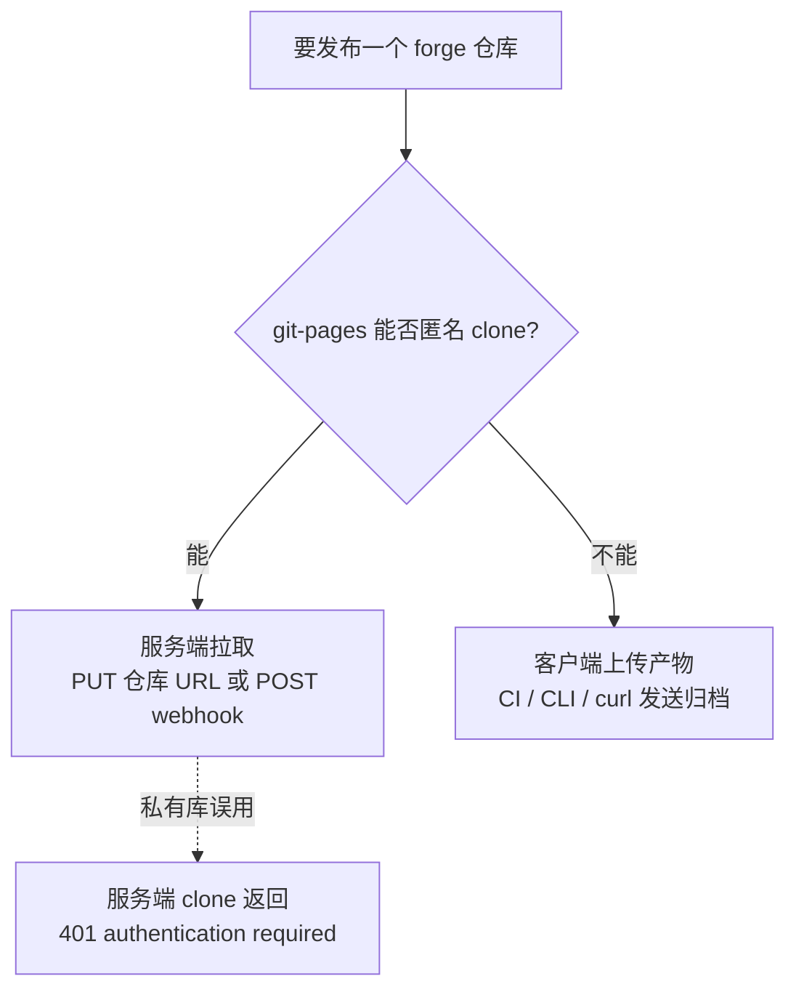
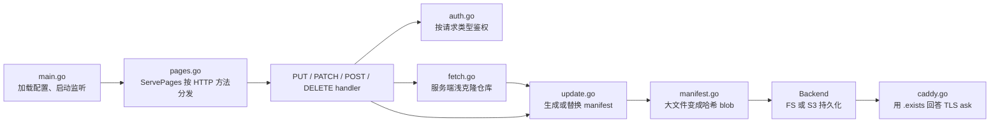

# git-pages：Git forge 的静态站托管服务

> Forgejo / Gitea 本身没有原生 Pages 功能。[git-pages](https://codeberg.org/git-pages/git-pages)（Go，作者 Catherine “whitequark”，[0BSD 许可](https://codeberg.org/git-pages/git-pages/src/commit/7d3368e196073588c229aa8e0e65c3ede10e3342/LICENSE.txt#L1-L14)，[官网](https://git-pages.org/)）是一个单独部署、配合 Git forge（Git 代码托管平台）使用的静态站服务：客户端直接上传构建产物，或由 git push 触发 webhook / CI 上传；内容进入 git-pages 自己的文件系统或 S3 后端，不必存放在公开可浏览的发布分支。Codeberg 的 `*.codeberg.page` 也运行在这套后端上。

按使用场景阅读：

- 只使用现成服务：看 [Codeberg 官方托管](#codeberg-hosted)。
- 给自建 Forgejo / Gitea 增加 Pages：看 [Forgejo/Gitea 自建](#self-hosted)。
- 核对实现与版本边界：看 [源码导读](#source-guide)。

**与本 skill 的 [docs-share](docs-share.md) 对比**：docs-share 是"仓库树同步到 S3 + presigned URL 按文件分享"，默认私有、链接带有效期；git-pages 是"把构建产物发布成网站"，文件路径就是 URL，图片和其他资源无需内联，域名与 TLS 可自动化。前者适合逐文件授权，后者适合 push 后直接得到可浏览站点。git-pages 可以用高熵路径降低被枚举的概率，但这不等于访问控制。

> 本文的 git-pages 源码断言核验于 upstream commit [`7d3368e`](https://codeberg.org/git-pages/git-pages/commit/7d3368e196073588c229aa8e0e65c3ede10e3342)（2026-07-13 核验）；关键断言在正文就近链接到该快照的具体行段。横向对比中的 star / release 等动态数据核验于 2026-07-04。

---

## <a id="background"></a>定位与迁移背景

### <a id="naming-migration"></a>名称与迁移关系

**Codeberg Pages** 是非营利代码托管平台 [Codeberg](https://codeberg.org/) 提供的静态站托管服务，相当于"Codeberg 版的 GitHub Pages"。Codeberg 使用 Forgejo；Forgejo 与 Gitea 的关系见本 skill 的 [git-server](git-server.md)。关键事实是：Codeberg Pages 的新后端就是开源的 `git-pages`，同一套服务也能部署在自己的 Forgejo / Gitea 旁边。常被混为一谈的名称分别是：

- **Pages Server v2** —— 旧后端**代码库**（仓库 [`Codeberg/pages-server`](https://codeberg.org/Codeberg/pages-server)，EUPL-1.2）。2024-11 起进入维护模式，见置顶 issue [#399 "We will not accept new features!"](https://codeberg.org/Codeberg/pages-server/issues/399)；仓库首页写着 "This code is in maintenance mode… **Codeberg Pages itself is in the process of migrating to the new git-pages server**"。
- **git-pages** —— 新后端**代码库**，v2 的官方继任者。Codeberg 文档说明它已从旧 v2 后端迁向 git-pages，并从 2025 年 12 月起提供这套新服务（[固定文档快照](https://codeberg.org/Codeberg/Documentation/src/commit/bbf5e3ab104b9a9f4ffb056ed0dd16f6d35d9af9/content/codeberg-pages/migrating-from-pages-v2.md#L25-L35)）。
- **Codeberg Pages** —— Codeberg 面向用户的**服务品牌**（不是代码库）。迁移期间，新站和已切换站点使用 git-pages，尚未切换的存量站仍由 v2 提供；第一次采用新发布方式后，该站转到 git-pages（[迁移文档固定快照](https://codeberg.org/Codeberg/Documentation/src/commit/bbf5e3ab104b9a9f4ffb056ed0dd16f6d35d9af9/content/codeberg-pages/migrating-from-pages-v2.md#L38-L50)）。

一句话理顺：**代码库这条线是 Pages Server v2 → git-pages 的新旧更替**；而 **Codeberg Pages 是服务品牌、不是任何一个代码库**——始终是同一个服务，只是把底层后端从 v2 换成了 git-pages。想确认某站切没切，看 HTTP 响应头 `Server`：`pages-server` 是老后端、`git-pages` 是新后端。（Codeberg 未公布 codeberg.page 托管量，官方唯一量化数字是平台总量"[50,000+ 用户](https://blog.codeberg.org/the-hardest-scaling-issue.html)"，该博文 2023-01 发，如今应更多。）

### <a id="v2-migration"></a>Pages Server v2 迁移差异

迁移前值得先知道（均据 [Codeberg 迁移文档固定快照](https://codeberg.org/Codeberg/Documentation/src/commit/bbf5e3ab104b9a9f4ffb056ed0dd16f6d35d9af9/content/codeberg-pages/migrating-from-pages-v2.md#L25-L40)）：

- **内容不再自动拉取**。v2 会替你获取仓库内容；git-pages 改成推送模型，每次更新都需要 webhook、Forgejo Actions 或客户端主动通知 / 上传。
- **`raw.codeberg.page` 取消**。CORS（Cross-Origin Resource Sharing，跨源资源共享）决定浏览器能否让一个站点的脚本读取另一个来源的响应。v2 的 `raw.codeberg.page` 会统一开放跨源读取；git-pages 改由站点作者通过 `_headers` 按路径设置响应头。文件格式与安全边界见 [响应头与 Basic-Auth 限制](#site-response-headers)。
- **不能再用 `/仓库/@分支` 直接翻任意 repo/branch**。v2 允许 `用户名.codeberg.page/仓库/@分支/…` 访问任意仓库任意分支——等于把整个 forge 当免费 CDN，是常见滥用向量；git-pages 改为**只服务你显式部署过的那个站点**（"Serving arbitrary resources from Codeberg was a common abuse vector"）。

迁移本身是单向软切换：旧 v2 站会继续工作；第一次使用新发布方式后，该站改由 git-pages 服务。响应头 `Server: pages-server` / `Server: git-pages` 可用于确认当前后端（[迁移文档](https://codeberg.org/Codeberg/Documentation/src/commit/bbf5e3ab104b9a9f4ffb056ed0dd16f6d35d9af9/content/codeberg-pages/migrating-from-pages-v2.md#L38-L50)）。

### <a id="hosted-comparison"></a>Codeberg Pages 与 GitHub Pages

真正的区别不在收费（都免费），而在**配额是否公开**、**私有仓库发布是否需要付费**。Codeberg 没有公布可直接比较的配额数字：

| 维度 | [GitHub Pages](https://github.com/github/docs/blob/b78592c31a1589588c2e5a05d38968c215cf2698/content/pages/getting-started-with-github-pages/what-is-github-pages.md#L24-L30) | Codeberg Pages（git-pages）|
|---|---|---|
| 收费 | 免费 | 免费 |
| 私有仓库发布 Pages | 需 Pro/Team/Enterprise 等付费计划（[计划范围](https://github.com/github/docs/blob/b78592c31a1589588c2e5a05d38968c215cf2698/data/reusables/gated-features/pages.md#L1)） | 不分公开/私有、无付费分级 |
| 配额是否公开 | ✅ 明文：站点 1GB、带宽 100GB/月（软限）、构建 10 次/小时（[固定文档快照](https://github.com/github/docs/blob/b78592c31a1589588c2e5a05d38968c215cf2698/content/pages/getting-started-with-github-pages/github-pages-limits.md#L19-L30)） | ❌ 未公布数字，只有"合理使用 / 反滥用"口径 |
| 自定义域名 + HTTPS | ✅ 免费、自动签证书 | ✅ 免费、自动签证书（DNS 记录授权）|
| 站点公开性 | GitHub Free 上公网公开；私有仓库生成的站点默认仍公开（企业方案另有私有发布能力，[固定 warning](https://github.com/github/docs/blob/b78592c31a1589588c2e5a05d38968c215cf2698/data/reusables/pages/private_pages_are_public_warning.md#L1-L5)） | 公开；官方托管无内建访问控制 |
| 后端能否自托管 | ❌ 专有 | ✅ git-pages 开源（0BSD），可自建 |
| 运营方 | GitHub / Microsoft（商业公司）| Codeberg e.V.（柏林注册非营利协会，纯捐款）|

### <a id="publishing-model"></a>发布模型与内容可见性

这是 git-pages 与 GitHub Pages 的核心差异。

**git-pages：推送式，且"发布"与"源码托管"分开。** git-pages 把**发布**（deploy，交出构建产物）和**源码托管**（git 仓库存源文件）拆成两件事：你把产物**主动推**给 git-pages（HTTP `PUT`/`PATCH`、webhook `POST`，或官方 CLI / Forgejo Action），它存进自己的私有存储（文件系统或 S3），**中间不经过任何可对外浏览的 git 仓库**。两个直接后果：

- **内容不会被自动拉取**：git-pages 不轮询你的仓库，每次更新都要主动"推一下"才生效。
- **高熵路径可以降低枚举概率**：私有存储没有公开的“列出全部站点”入口，随机路径不泄露时较难被发现。这不是签名 / 限时的 presigned URL；路径一旦泄露，内容仍然公开，因此“降低枚举概率”不等于访问控制。同一份内容若也位于公开 git 分支，仍可通过 forge 文件浏览器找到。

**GitHub Pages：发布源可在分支和 GitHub Actions 之间选择。** `Deploy from a branch` 从指定分支 / 目录发布；自定义 Actions workflow 则构建 artifact 后部署，更接近 git-pages 的推送模型（[固定文档快照](https://github.com/github/docs/blob/b78592c31a1589588c2e5a05d38968c215cf2698/content/pages/getting-started-with-github-pages/configuring-a-publishing-source-for-your-github-pages-site.md#L20-L70)）。GitHub Free 上的 Pages 站点公网可见，即使源仓库是私有仓库。

| 维度 | git-pages（推送式）| GitHub Pages |
|---|---|---|
| 发布源 | 只有一种：`PUT`/`PATCH`/webhook/CLI/Action 主动推产物 | 两种可切：分支源 / GitHub Actions |
| 产物与源码的关系 | **分离**：产物进 Pages 私有存储，可不挂公开分支 | 分支源＝产物就是某分支；Actions＝产物打成 artifact |
| 是否自动发布 | 否，必须 webhook/Action 触发 | 分支源＝推到分支即自动发；Actions＝workflow 触发 |
| 构建在哪 | 你自己在 CI 里构建，git-pages 只收产物 | 分支源可自动跑 Jekyll；Actions＝你自定义构建 |
| "不可猜路径" | ✅ 私有存储、无 listing | ❌ 站点公开、URL 规则固定；私有仓库的站点仍公开可见 |

### <a id="self-hosted-comparison"></a>自建实现对比

Codeberg 官方在用的是 **git-pages**。另外三个是跟 Codeberg 无关、给**自建 Gitea/Forgejo** 用的第三方项目，能力跨度极大——从"4 个环境变量的极简静态托管"到"带 JS 动态路由 + 反代 + OAuth 的准应用服务器"都有（✓/✗ 按当时各仓 `main` 源码核验）：

| 维度 | [**git-pages**](https://codeberg.org/git-pages/git-pages) | [d7z-project/gitea-pages](https://github.com/d7z-project/gitea-pages) | [deadnews/gitea-pages](https://github.com/deadnews/gitea-pages) | [MexHigh/Forge-Pages](https://github.com/MexHigh/Forge-Pages) |
|---|---|---|---|---|
| 许可 | 0BSD | Apache-2.0 | MIT | AGPL-3.0 |
| Star / 最新 release | 424★ · v0.9.1 | 17★ · v0.0.2 | 8★ · v1.0.1 | 2★ · 无 release（GitHub 是[MIRROR]）|
| 语言 / 依赖体量 | Go，独立后端 | Go，**重**（goja + goja_nodejs + websocket + lru + afero + gitea SDK）| Go，**极轻**（仅 gitea SDK 依赖，几百行核心，distroless 静态镜像）| Go，轻（oauth2 + scs + yaml）|
| 定位 | 通用、可横向扩展、官方生产级 | homelab 全功能"准应用服务器" | 极简静态托管 | 小众自托管，卖点是 OAuth2 私有页 |
| 内容怎么进来（发布模型）| **推**产物到 Pages 存储（`PUT`/`PATCH`/webhook/CLI/Action），不必挂公开分支 | 从 `gh-pages` **分支**经 Gitea API 读 | 从 `gh-pages` **分支**经 Gitea API 读 | **推** `POST /deploy`（tar.gz），不必挂公开分支 |
| 发布鉴权（**谁能推**，写侧）| DNS challenge / repository allowlist / forge token / Forge Wildcard / `PAGES_INSECURE`（见 [发布鉴权](#publishing-auth)） | 靠 forge repo 写权限（谁能推 `gh-pages` 谁能发）| 靠 forge repo 写权限（同左）| workflow token（如 `${{ forgejo.token }}`）校验对该 repo 的写权限 |
| 静态托管 | ✓ | ✓ | ✓ | ✓ |
| JS 动态路由 | ✗ | ✓ **Goja 引擎**（按路由挂 JS handler）| ✗ | ✗ |
| 反向代理 | ✗ | ✓ 按路由反代到上游 | ✗ | ✗ |
| WebSocket / SSE | ✗ | ✓ JS realtime | ✗ | ✗ |
| 自定义域名 | ✓（DNS 记录授权）| ✓（CNAME alias，写在 `.pages.yaml`）| ✗ | ✓（`<owner>` 子域名，需通配 DNS）|
| 私有页 / 访问控制（**谁能看**，读侧）| ✗ **无登录鉴权**：只有 `_headers` 里的 `Basic-Auth` 伪头，且 [README/源码](https://codeberg.org/git-pages/git-pages/src/commit/7d3368e196073588c229aa8e0e65c3ede10e3342/README.md#L117-L126)明说它不是安全特性、凭据明文存储，仅适合防搜索引擎收录；真正的隐私只来自降低路径枚举概率 | ✓ **Gitea OAuth 登录**：`private: true` 的站要求登录，按当前用户对该 repo 的 read 权限放行 | ✗ 无：服务端 token 读得到的仓库，谁都能看 | ✓ **Forgejo/Gitea OAuth2**（`protect` 参数 / `.protect` 文件）：仅对该 repo 有 read/pull 权限者可见 |
| 缓存 | 产物即存储 | **TTL 缓存**（默认约 1min，memory/redis）| **无缓存**，每请求实时读 Gitea API | 产物存本地 fs |
| 存储后端 | 文件系统 / **S3** | memory/local/etcd/badger/**S3**/overlay + redis | 无（实时读 Gitea）| 本地文件系统 |
| 路径可否不可猜（obscurity，**不是**访问控制）| ✅ 私有存储、无 listing | ❌ 内容在公开分支，forge 可翻 | ❌ 同左 | ◑ `additional_base_path` 可加随机段，且产物不挂公开分支 |
| 生命周期 | `Expires:` 头 + `DELETE` | 无站点 TTL | 无站点 TTL | `DELETE`（无 TTL）|
| 配置复杂度 | `config.toml` | `config.yaml` + 分支内 `.pages.yaml`（面大）| **4 个环境变量**（极简）| `config.yml` + 通配 DNS |

> **表里三行"鉴权/隐私"管的是不同的事**（最容易看拧）：**发布鉴权（写侧）**="谁能把站点推上去"；**访问控制（读侧）**="谁能看已发布的站点"，这才是**私有页**；**不可猜路径**=一种**弱隐私**（security-through-obscurity），**不是**访问控制。三者正交。关键结论：**git-pages 写侧很强（DNS challenge / forge token…），但读侧没有真正的登录鉴权**——只给"不可猜路径" + `_headers` 的 `Basic-Auth` 伪头（官方明说非安全、明文、仅防爬虫）。**要"登录才能看"的真·私有页，得用 d7z 或 Forge-Pages 的 forge OAuth**（deadnews 完全没有）。

各家一句话取舍：

- **deadnews/gitea-pages**——极简派：4 个环境变量、单静态二进制 distroless、无缓存每次实时读 Gitea，适合只托管静态 HTML、由 `gh-pages` 分支发布的场景。代价是没有访问鉴权（服务端 token 能读取的仓库可被任何访客访问），不适合直接暴露在不受保护的公网入口，也没有自定义域名或动态能力。
- **d7z-project/gitea-pages**——比名字强得多的**准应用服务器**：按路由挂 Goja JS 处理器 / 反代 / 模板 / 重定向，另带 WebSocket、SSE、受限 `fetch`、按 repo 隔离的 KV，私有页走 Gitea OAuth。想要"静态站 + 少量动态 / 鉴权"时最全。代价：配置面大、依赖重。
- **Forge-Pages**——四个里唯一和 git-pages 一样"推产物、不挂公开分支"的第三方（`POST /deploy` + tar.gz）；用 workflow token 校验写权限，`additional_base_path` 给"一仓多版本 / PR 预览"各自独立不可猜路径，私有页走 OAuth2。URL 是 `https://<owner>.<base>/<repo>/*`，需通配 DNS。

---

## <a id="codeberg-hosted"></a>Codeberg 官方托管

只想用 Codeberg 现成托管：建仓库、推、访问、绑域名，零运维。

### <a id="codeberg-site-mapping"></a>仓库与站点映射

Codeberg 官方文档把站点分成用户 / 组织主站和项目站（[固定文档快照](https://codeberg.org/Codeberg/Documentation/src/commit/bbf5e3ab104b9a9f4ffb056ed0dd16f6d35d9af9/content/codeberg-pages/index.md#L39-L84)）：

- `https://alice.codeberg.page/` —— 用户主站；仓库名为 `pages`。
- `https://alice.codeberg.page/myrepo/` —— 项目站；仓库名为 `myrepo`。
- 用户主站从 `pages` 仓库发布；项目站默认从对应仓库的 `pages` 分支发布。无论哪种方式，上传产物树的根才是站点根，不一定是仓库根。
- ~~`/@分支`~~ —— 这是旧 v2 行为；git-pages 不再支持 `/repository/@branch` 访问任意仓库 / 分支（[迁移文档](https://codeberg.org/Codeberg/Documentation/src/commit/bbf5e3ab104b9a9f4ffb056ed0dd16f6d35d9af9/content/codeberg-pages/migrating-from-pages-v2.md#L32-L35)）。实测 `/@main/`、不存在的分支和普通不存在路径返回相同 404，`@` 已没有选分支语义。
- 用户名或仓库名含点号（`.`）会形成通配证书覆盖不到的多级子域名；可改用 `https://pages.codeberg.org/user.name/`（[排障文档](https://codeberg.org/Codeberg/Documentation/src/commit/bbf5e3ab104b9a9f4ffb056ed0dd16f6d35d9af9/content/codeberg-pages/troubleshooting.md#L9-L15)）。

### <a id="codeberg-publishing"></a>发布方式

**手动推 `pages` 分支 + webhook**（最朴素，适合手写 HTML）：把内容放 `pages` 分支，给仓库配一个 push webhook 指到 Codeberg 的 Pages 端点，push 即发布。

**Forgejo Actions + 官方 Action**（适合静态站生成器）：CI 里用 [`git-pages/action@v2.2.0`](https://codeberg.org/git-pages/action/src/commit/2b24bbb7ff943d3c8fe1df91326adec66daea6dd/action.yml)，`with: { site, token: ${{ forge.token }}, source }`，把构建产物推上去；Forgejo Actions 的自动 token 就够，无需手建。

**git-pages-cli 手推**（本地 / 脚本一次性发）：[`git-pages-cli` v1.10.0](https://codeberg.org/git-pages/git-pages-cli/src/commit/a63042dcc9c1419967ded3ce389dae1bab39724e/README.md#L58-L81) 用 `--upload-dir <目录>` 直接上传本地目录。

### <a id="codeberg-custom-domain"></a>自定义域名与 DNS 授权

v2 使用仓库根的 `.domains` 文件；git-pages 改由 DNS 记录授权，因此迁移后可删除 `.domains`（[固定文档快照](https://codeberg.org/Codeberg/Documentation/src/commit/bbf5e3ab104b9a9f4ffb056ed0dd16f6d35d9af9/content/codeberg-pages/using-custom-domain.md#L141-L159)）。

先添加把流量导向 Codeberg 的解析记录：

| 场景 | 记录类型 | 值 |
|---|---|---|
| 子域名 | `CNAME` | `codeberg.page.` |
| 裸域名 / 已有其他记录 | `ALIAS`（或 Cloudflare flattened CNAME） | `codeberg.page.` |
| 都不支持时 | `A` + `AAAA` | `217.197.84.141` / `2a0a:4580:103f:c0de::2` |

选择依据（[解析记录文档](https://codeberg.org/Codeberg/Documentation/src/commit/bbf5e3ab104b9a9f4ffb056ed0dd16f6d35d9af9/content/codeberg-pages/using-custom-domain.md#L50-L139)）：

- `codeberg.page` 已启用 DNSSEC；签名 zone 的子域名优先使用 CNAME。
- 部分 DNS 服务商的 ALIAS / flattened CNAME 与 DNSSEC 不兼容；这种情况用 A/AAAA。
- A/AAAA 地址将来可能变化，需要跟随 Codeberg 公告更新。
- zone 已设置 CAA 时，要按 Codeberg 文档同时允许 Let's Encrypt 的生产和 staging 账户，否则自动签证书会失败（[CAA 配置](https://codeberg.org/Codeberg/Documentation/src/commit/bbf5e3ab104b9a9f4ffb056ed0dd16f6d35d9af9/content/codeberg-pages/using-custom-domain.md#L25-L33)）。

解析记录只负责把请求送到 Codeberg；还要用 TXT 指定哪个仓库有权发布到该域名（[授权步骤](https://codeberg.org/Codeberg/Documentation/src/commit/bbf5e3ab104b9a9f4ffb056ed0dd16f6d35d9af9/content/codeberg-pages/using-custom-domain.md#L141-L202)）。每个主机名（例如裸域和 `www`）各配一条：

- 手推 `pages` / webhook：`_git-pages-repository.yourdomain.com. TXT "https://codeberg.org/<用户名>/<仓库>.git"`（**不需 token**）。
- Forgejo Actions：`_git-pages-forge-allowlist.yourdomain.com. TXT "https://codeberg.org/<用户名>/<仓库>.git"`。

首次发布自定义域名还有 TLS 循环依赖：webhook 第一次用 HTTP；Action 则把 `site` 设为自定义域名、把 `server` 设为 `codeberg.page`（[官方步骤](https://codeberg.org/Codeberg/Documentation/src/commit/bbf5e3ab104b9a9f4ffb056ed0dd16f6d35d9af9/content/codeberg-pages/using-custom-domain.md#L204-L218)）。

---

## <a id="site-files"></a>站点文件约定

这些文件同时适用于 Codeberg 官方托管和自建 git-pages。

### <a id="site-redirects"></a>404 与重定向

放在站点根（[Codeberg 高级用法固定快照](https://codeberg.org/Codeberg/Documentation/src/commit/bbf5e3ab104b9a9f4ffb056ed0dd16f6d35d9af9/content/codeberg-pages/advanced-usage.md#L9-L44)）：

- **`404.html`** —— 自定义 404 页。
- **`_redirects`** —— 每行 `from  to  [status]`（`#` 注释）。status：`200`=不改 URL 取另一路径内容（SPA 回退）、`301`=永久跳、`302`=临时跳。例：

  ```
  /example        https://example.com/   301   # 单条跳转
  /*              /index.html            200   # SPA：所有路径回退到 index
  /articles/*     /posts/:splat          302   # :splat 保留通配部分
  ```

### <a id="site-response-headers"></a>响应头与 Basic-Auth 限制

浏览器同源策略默认阻止 `https://a.example` 的脚本读取 `https://b.example`；只有 `b.example` 在响应中返回合适的 `Access-Control-Allow-Origin` 等 CORS 头才会放行。v2 的 `raw.codeberg.page` 对所有来源统一开放，git-pages 则让站点作者在根目录 `_headers` 中按路径设置允许的响应头，也可配置 COOP/COEP。

`Basic-Auth:` 是 `_headers` 的一个伪头，只有服务端启用 `[limits].allow-basic-auth` 才生效；凭据以明文写进站点内容，任何能更新站点的人都能读取，因此它只适合降低搜索引擎收录等低风险场景，不是可靠的访问控制（[git-pages README](https://codeberg.org/git-pages/git-pages/src/commit/7d3368e196073588c229aa8e0e65c3ede10e3342/README.md#L117-L126)）。

---

## <a id="self-hosted"></a>Forgejo/Gitea 自建

面向"自己有 Forgejo/Gitea，想配一套自己域名的 Pages"的管理员。**两个角色**：**你（管理员）**把 git-pages 当新服务部署一次（装 + 反代 + 选鉴权），这台 forge 才"有了 Pages 能力"；之后**仓库用户**用哪种方式推，取决于你选的鉴权方案，用户侧体验和 Codeberg 用户一样。

### <a id="install-runtime"></a>安装与运行形态

本文区分两个版本基线：

| 基线 | 用途 | 版本边界 |
|---|---|---|
| **v0.9.1 release** | 优先用于稳定部署 | 需要 Go 1.25；没有 `preview-domain`、站点过期、`-delete-site` 等后续能力 |
| **源码快照 `7d3368e`** | 本文源码断言的核验对象 | 比 v0.9.1 多 54 个提交；新增 preview、过期和管理命令，尚未进入 v0.9.1 |

安装方法（上游也按 binary / package / container / source 分类，[README](https://codeberg.org/git-pages/git-pages/src/commit/7d3368e196073588c229aa8e0e65c3ede10e3342/README.md#L24-L43)）：

- **预编译二进制**：从 [v0.9.1 release](https://codeberg.org/git-pages/git-pages/releases/tag/v0.9.1) 下载；CI 构建 `linux-amd64`、`linux-arm64`、`darwin-arm64`、`windows-amd64.exe`（[构建矩阵](https://codeberg.org/git-pages/git-pages/src/commit/7d3368e196073588c229aa8e0e65c3ede10e3342/.forgejo/workflows/ci.yaml#L63-L70)），linux-amd64 约 30 MB。
- **Docker**：使用固定 release tag `codeberg.org/git-pages/git-pages:v0.9.1`；只有明确接受滚动更新时才用 `:latest`。
- **Nix**：仓库包含 [`flake.nix`](https://codeberg.org/git-pages/git-pages/src/commit/7d3368e196073588c229aa8e0e65c3ede10e3342/flake.nix#L1-L89)，可在固定 tag / commit 的 checkout 中运行 `nix run`。
- **源码**：稳定版用 `go install codeberg.org/git-pages/git-pages@v0.9.1`；需要本文快照能力时用 `go install codeberg.org/git-pages/git-pages@7d3368e196073588c229aa8e0e65c3ede10e3342`。两者都要求 Go ≥ 1.25。

容器默认运行 standalone：只启动 git-pages，监听 HTTP `:3000`；把命令改为 `supervisord` 才会同时启动内置 Caddy 并占用 80/443（[Dockerfile](https://codeberg.org/git-pages/git-pages/src/commit/7d3368e196073588c229aa8e0e65c3ede10e3342/Dockerfile#L29-L53)、[supervisord 配置](https://codeberg.org/git-pages/git-pages/src/commit/7d3368e196073588c229aa8e0e65c3ede10e3342/conf/supervisord.conf#L1-L16)）。内置 Caddy 配置启用 on-demand TLS，并用 certmagic-s3 保存证书（[Caddyfile](https://codeberg.org/git-pages/git-pages/src/commit/7d3368e196073588c229aa8e0e65c3ede10e3342/conf/Caddyfile#L1-L29)）。已有 Caddy / nginx 时使用 standalone，让现有边缘反代转发到 `:3000`；内置 Caddy 适合没有其他 TLS 入口的独立部署。

仓库没有 systemd unit。自行创建 unit 时，`ExecStart` 传 `-config` / `-secrets`，并用专用 `User=` 运行。S3 凭据可通过 systemd `LoadCredential=` 注入；该功能需要 systemd ≥ 247，旧发行版可能静默跳过凭据加载。兼容写法见本 skill 的 [service](service.md)。

### <a id="service-config"></a>服务配置与 S3 后端

[`src/main.go`](https://codeberg.org/git-pages/git-pages/src/commit/7d3368e196073588c229aa8e0e65c3ede10e3342/src/main.go#L226-L277) 定义 `-config`、`-secrets` 和 `-no-config`；未显式传 `-secrets` 时，会检查 `$CREDENTIALS_DIRECTORY/secrets.toml`（[加载逻辑](https://codeberg.org/git-pages/git-pages/src/commit/7d3368e196073588c229aa8e0e65c3ede10e3342/src/main.go#L334-L361)）。配置结构见 [`src/config.go`](https://codeberg.org/git-pages/git-pages/src/commit/7d3368e196073588c229aa8e0e65c3ede10e3342/src/config.go#L62-L160)，完整示例见 [`conf/config.example.toml`](https://codeberg.org/git-pages/git-pages/src/commit/7d3368e196073588c229aa8e0e65c3ede10e3342/conf/config.example.toml#L1-L68)。下面把默认文件系统后端改成 S3，并把密钥拆进 `secrets.toml`：

```toml
# 源码快照使用站点过期功能时还要取消下一行注释：
# features = ['expiration']

[server]
pages   = 'tcp/localhost:3000'   # 站点服务口（反代打这里）
caddy   = 'tcp/localhost:3001'   # on-demand-tls 询问口；不用自带 Caddy 时设 "-" 关掉
metrics = 'tcp/localhost:3002'

[storage]
type = 's3'                      # 或 'fs'（[storage.fs] root='./data'）

[storage.s3]                     # 接任意 S3 兼容存储（RustFS/MinIO/Garage…）
endpoint          = '<host:port>'
access-key-id     = '...'        # 建议改放 secrets.toml
secret-access-key = '...'
bucket            = 'git-pages'
region            = 'us-east-1'
insecure          = true         # 仅明文 HTTP endpoint 开启

[limits]
max-site-size    = '128M'
# 源码快照需要过期功能时再取消下一行注释：
# allow-expiration = true         # 同时需要顶层 features = ['expiration']
allow-basic-auth = false
```

`insecure = true` 会让 MinIO 客户端使用 HTTP；默认 `false` 使用 HTTPS（[`Secure: !config.Insecure`](https://codeberg.org/git-pages/git-pages/src/commit/7d3368e196073588c229aa8e0e65c3ede10e3342/src/backend_s3.go#L155-L168)）。它只表示传输协议，不会放宽 S3 权限。

`secrets.toml` 只放密钥，文件权限设为 600；使用 systemd 时可由 `LoadCredential` 挂入：

```toml
[storage.s3]
access-key-id     = '<access-key-id>'
secret-access-key = '<secret-access-key>'
```

#### <a id="s3-credentials"></a>S3 凭据权限边界

S3 兼容对象存储（如 RustFS）一般分两类凭据：

- **root / admin key**——能建桶、发 key、设 bucket policy，对所有桶有管理权限；只需要在初始化时使用。
- **桶级受限 key**——只允许 git-pages 访问指定桶，适合作为服务的长期凭据。

如果 git-pages 所在主机被入侵，root key 会把影响范围扩大到整个对象存储；桶级 key 把权限限制在 `git-pages` 桶。

**最小权限策略（RustFS 实测，2026-07-14）**：git-pages 要读写 `blob/`、`site/`、`meta/`，并在删站 / 过期时删除对象，因此需要对象读、写、删和桶列举权限。RustFS 的 `readwrite` / `readonly` 罐头策略覆盖 `arn:aws:s3:::*`，范围比单桶需要的权限更大；桶未启用 versioning 时，也不需要 `s3:*ObjectVersion` / `s3:*BucketVersioning`。下面五个 action 足够（桶名按实际替换）：

```json
{
  "Version": "2012-10-17",
  "Statement": [
    { "Effect": "Allow",
      "Action": ["s3:GetObject", "s3:PutObject", "s3:DeleteObject"],
      "Resource": ["arn:aws:s3:::git-pages/*"] },
    { "Effect": "Allow",
      "Action": ["s3:ListBucket", "s3:GetBucketLocation"],
      "Resource": ["arn:aws:s3:::git-pages"] }
  ]
}
```

用 `mc` 创建策略和用户：

```bash
mc admin policy create ROOT git-pages git-pages-policy.json
mc admin user add    ROOT git-pages "$(openssl rand -hex 24)"   # AK=git-pages，SK 随机
mc admin policy attach ROOT git-pages --user git-pages
```

策略和用户建好后，可以从客户端移除保存 root 凭据的 alias，减少长期留存的管理权限。

换 key 的可复现顺序是：备份旧 `secrets.toml` → 以服务用户和 600 权限安装新文件 → `systemctl restart git-pages` → 请求一个已发布站点。随后做双向交叉验证：受限 key 应能对目标桶 put/get/rm，对其他桶的 `mc ls` / `mc pipe` 应返回 `Access Denied`。RustFS 会在真正访问对象时才暴露部分权限错误，因此 `serve: ready` 不代表 key 已可用；站点请求需要同时读到 manifest 和 blob 才算验证完成。

如果明文 HTTP endpoint 出现看似无关的 `Access Denied`，先核对 `[storage.s3].insecure = true`；如果仍失败，再用同一受限 key 分别通过 `mc` 和实际站点请求验证。更完整的 S3 客户端行为见本 skill 的 [rustfs](rustfs.md)。

> **版本差异**：`preview-domain`、`max-preview-lifetime`、`allow-expiration`、`-delete-site`、`-site-expire` 属于 v0.9.1 之后的源码快照能力（[配置结构](https://codeberg.org/git-pages/git-pages/src/commit/7d3368e196073588c229aa8e0e65c3ede10e3342/src/config.go#L81-L89)、[管理命令](https://codeberg.org/git-pages/git-pages/src/commit/7d3368e196073588c229aa8e0e65c3ede10e3342/src/main.go#L247-L277)）。落盘前运行 `git-pages -config <file> -print-config`，让当前二进制直接验证可识别的键。

### <a id="s3-layout"></a>请求与 S3 对象的映射

请求 `https://<user>.<zone>/<project>/<path>` 会先映射到 manifest（站点清单），再由 manifest 找到文件内容；没有 manifest 就返回 404。git-pages 不按需构建，内容必须事先发布。S3 key 的命名来自 [`backend_s3.go`](https://codeberg.org/git-pages/git-pages/src/commit/7d3368e196073588c229aa8e0e65c3ede10e3342/src/backend_s3.go#L233-L238)：

| key | 是什么 |
|---|---|
| `blob/sha256/xx/yy/<hash>` | 内容寻址的文件本体；[`StoreManifest`](https://codeberg.org/git-pages/git-pages/src/commit/7d3368e196073588c229aa8e0e65c3ede10e3342/src/manifest.go#L379-L425) 把大文件变成哈希引用，后端按哈希去重 |
| `site/<domain>/.index` | 根路径 `/` 的 manifest（protobuf，引用 blob）；存在即表示首页有内容 |
| `site/<domain>/<project>` | 具名子项目 `/<project>/` 的 manifest |
| `site/<domain>/.exists` | 域名存在标记（0 字节），供 TLS ask 检查 |
| `meta/…` | feature 标记与最后更新时间等元数据 |
| `audit/<id>` | 可选审计记录 |

更新顺序是先存 manifest，再创建 `.exists`（[`Update()`](https://codeberg.org/git-pages/git-pages/src/commit/7d3368e196073588c229aa8e0e65c3ede10e3342/src/update.go#L54-L82)）。Caddy ask 端点先查缓存，再通过后端检查 `.exists`（[`ServeCaddy`](https://codeberg.org/git-pages/git-pages/src/commit/7d3368e196073588c229aa8e0e65c3ede10e3342/src/caddy.go#L12-L61)、[`CheckDomain`](https://codeberg.org/git-pages/git-pages/src/commit/7d3368e196073588c229aa8e0e65c3ede10e3342/src/backend_s3.go#L756-L804)）。

删除或过期只删除 manifest（[`DeleteManifest` / `ExpireManifest`](https://codeberg.org/git-pages/git-pages/src/commit/7d3368e196073588c229aa8e0e65c3ede10e3342/src/backend_s3.go#L640-L674)），不会删除 `.exists`。所以“只有 `.exists`、没有 `.index`”通常表示该域名曾发布成功，后来站点被删除或过期；内容 blob 可能暂时成为待清理的不可达对象。

### <a id="caddy-proxy"></a>Caddy 反向代理与按需 TLS

standalone 默认监听 `tcp/localhost:3000`；官方容器配置改为 `tcp/:3000`，依靠容器网络和“不发布后端端口”隔离（[`config.default.toml`](https://codeberg.org/git-pages/git-pages/src/commit/7d3368e196073588c229aa8e0e65c3ede10e3342/conf/config.default.toml#L4-L9)、[`config.docker.toml`](https://codeberg.org/git-pages/git-pages/src/commit/7d3368e196073588c229aa8e0e65c3ede10e3342/conf/config.docker.toml#L1-L4)）。已有 Caddy 时，由它负责 TLS 和反向代理。

**单个固定域名 + 真证书**（有公网 DNS 指过来）：

```caddyfile
pages.example.com {
    reverse_proxy 127.0.0.1:3000
}
```

**通配域名 + on-demand TLS**：on-demand TLS（按需签证书）不会预先枚举子域名，而是在首次 HTTPS 请求到达时按 SNI 主机名申请证书。Caddy 可在签发前调用 permission / ask 端点；git-pages 的 `[server].caddy` 端口只对已存在的域名放行：

```caddyfile
{
    on_demand_tls {
        permission http http://127.0.0.1:3001   # git-pages 的 caddy 口，问它该不该签
    }
}

*.pages.example.com {
    tls { on_demand }
    reverse_proxy 127.0.0.1:3000
}
```

> 通配块按 Host / SNI 路由，与其他站共用 `:443`；Pages 内容默认公开，除非确实要增加读侧访问控制，否则不需要额外的 `authorize with` 登录墙。首次发布存在 TLS 循环依赖：站点尚不存在时，git-pages 不允许为该域名签证书。可先用 HTTP，或让 CLI 的 `--server <已有证书的主机名>` 建立 TLS 连接、同时保留站点 Host（[CLI 实现](https://codeberg.org/git-pages/git-pages-cli/src/commit/a63042dcc9c1419967ded3ce389dae1bab39724e/main.go#L417-L424)）。

permission / ask 端点有两种相反的失败模式：

- 端点过于宽松时，任意主机名都可能触发证书申请，造成 CA 限流和 Caddy obtain 锁堆积。常见错误包括 `too many certificates`、`too many subdomain labels`，退避最长可达 30 天；同一时段的 obtain 锁还可能拖住 `caddy reload`。permission 应指向 git-pages 的 `:3001`。Caddy 限流和 reload 排障见 `vps-maintenance` skill 的 Caddy 运维章节。
- 端点不可用时，Caddy 会拒绝签发（fail closed），整个通配站点可能在 TLS 握手阶段不可达。先运行 `curl 'http://127.0.0.1:3001/?domain=<已发布域名>'`，再检查 git-pages 到 S3 的 `CheckDomain` 链路。

### <a id="dns-records"></a>DNS 解析与发布授权

`<域名>` 表示站点根域，`<edge>` 表示边缘反代公网 IP，`<host>` 表示完整站点域名。所有部署先配置解析：

| 站点形态 | 解析记录 |
|---|---|
| 通配多租户 | `*.pages.<域名>` A/AAAA → `<edge>`，或 CNAME → 边缘主机名 |
| 单个固定域名 | `pages.<域名>` A/AAAA/CNAME → `<edge>` |
| 自定义域名 | `<自定义域名>` A/AAAA/CNAME → `<edge>` |

解析只解决“请求到哪台机器”；是否还需要 `_git-pages-*` TXT 由鉴权方式决定：

| 鉴权方式 | 额外 TXT | 作用 |
|---|---|---|
| DNS Challenge | `_git-pages-challenge.<host>` = CLI 生成的哈希 | 用口令直接授权发布 / 删除，可并存多条用于轮换 |
| Forge DNS Allowlist | `_git-pages-forge-allowlist.<host>` = 仓库 clone URL | 用 forge token 校验该仓库的 push 权限；只授权根站 |
| Repository Allowlist | `_git-pages-repository.<host>` = 仓库 clone URL | webhook / 仓库 URL 发布，免 token；只授权根站 |
| Forge Wildcard | 无 | 按 host + path 从 `[[wildcard]]` 推导仓库，再用 forge token 校验 |
| `PAGES_INSECURE` + 反代兜底 | 无 | git-pages 不鉴权，由反代承担写请求鉴权 |

DNS 服务商 API 可以同时下发解析记录和 TXT；API key 需要覆盖目标 zone。若只授权了其他域名，常见表现是 `SOA ... not found`。

### <a id="publishing-api"></a>发布路径与客户端

git-pages 只有两种内容进入方式：**服务端拉取仓库**，或**客户端上传产物**。`[[wildcard]]` 不是第三种发布方式；它是在 HTTP 请求到达后，根据 host + path 推导仓库，可同时参与 webhook 拉取和归档上传的鉴权。

[`ServePages`](https://codeberg.org/git-pages/git-pages/src/commit/7d3368e196073588c229aa8e0e65c3ede10e3342/src/pages.go#L930-L977) 按 HTTP 方法分发请求：

| 发布路径 | HTTP / body | 内容由谁取得 | 触发者 / 客户端 | 仓库可见性 | 鉴权族 |
|---|---|---|---|---|---|
| 服务端拉取 | PUT：仓库 clone URL | git-pages 浅克隆指定分支 | curl / `cli --upload-git` | 必须可匿名 clone | [仓库来源授权](#repository-auth) |
| 服务端拉取 | POST：push webhook JSON | git-pages 从 payload 取 clone URL 后浅克隆 | Forgejo/Gitea/Gogs/GitHub webhook | 必须可匿名 clone | [仓库来源授权](#repository-auth) |
| 客户端上传 | PUT：tar / tar+gzip / tar+zstd / zip | 客户端先 checkout / 构建 / 打包 | curl / `cli --upload-dir` / Action / CI | 公开、私有均可 | [通用授权](#shared-auth) 或 [Forge token 授权](#archive-auth) |
| 客户端上传 | PATCH：tar / tar+gzip / tar+zstd | 客户端生成增量归档 | `cli --upload-dir --path` / Action `path:` | 公开、私有均可 | [通用授权](#shared-auth) 或 [Forge token 授权](#archive-auth) |
| 下线 | DELETE（或空 body PUT） | 不再提供内容 | curl / `cli --delete` | 无关 | 与归档上传相同 |

#### <a id="repository-visibility"></a>服务端拉取仓库

PUT 仓库 URL 和 POST webhook 都由 git-pages 自己克隆仓库（[`AuthorizeUpdateFromRepository`](https://codeberg.org/git-pages/git-pages/src/commit/7d3368e196073588c229aa8e0e65c3ede10e3342/src/auth.go#L417-L479)）。克隆固定为 `depth=1`、单分支、不取 tag（[`CloneOptions`](https://codeberg.org/git-pages/git-pages/src/commit/7d3368e196073588c229aa8e0e65c3ede10e3342/src/fetch.go#L55-L72)），得到的新 manifest 会全量替换旧站点（[`UpdateFromRepository`](https://codeberg.org/git-pages/git-pages/src/commit/7d3368e196073588c229aa8e0e65c3ede10e3342/src/update.go#L118-L147)）。

PUT 可用 `Branch` 头指定分支，缺省为 `pages`。POST 通过 `X-Forgejo-Event` / `X-GitHub-Event` / `X-Gitea-Event` / `X-Gogs-Event` 识别 webhook，只接受 push 事件（[`postPage`](https://codeberg.org/git-pages/git-pages/src/commit/7d3368e196073588c229aa8e0e65c3ede10e3342/src/pages.go#L810-L839)），并按站点映射检查分支——项目站固定为 `pages`，wildcard 根站可用 `index-repo-branch`。



仓库设为 public 仍不一定能匿名 clone：Gitea / Forgejo 的实例级 `[service] REQUIRE_SIGNIN_VIEW = true` 会要求登录后才能读取公开仓库。匿名请求 `<clone-url>/info/refs?service=git-upload-pack` 或 `/api/v1/version` 返回 401/403 时，应改用客户端上传。该开关的服务端背景见本 skill 的 [git-server](git-server.md)。

`git-pages-cli --upload-git <URL> --token <token>` 不会在本地 clone；CLI 只是把 URL 作为 PUT body 交给服务端，服务端克隆时也不会使用这个 forge token。因此私有仓库走这条路径仍会 401。

#### <a id="client-upload"></a>客户端上传产物

客户端先取得站点内容，再把归档放进请求体：

- **裸 curl**：`curl https://pages.example.com/ -X PUT --data-binary @site.tar.gz -H 'Content-Type: application/x-tar+gzip' -H 'Authorization: Pages <口令>'`。body 也可使用 zip。
- **git-pages-cli v1.10.0**：`--upload-dir <目录>` / `--delete` / `--dry-run` / `--expires 14`（[参数定义](https://codeberg.org/git-pages/git-pages-cli/src/commit/a63042dcc9c1419967ded3ce389dae1bab39724e/main.go#L43-L58)）。
- **Forgejo Action v2.2.0**：[`action.yml`](https://codeberg.org/git-pages/action/src/commit/2b24bbb7ff943d3c8fe1df91326adec66daea6dd/action.yml#L1-L35) 实际启动 git-pages-cli 容器；CI 也可以直接调用 CLI 或 curl。它们都是客户端上传，不是新的传输协议。

PUT 归档会全量替换站点；PATCH 会增量合并，不支持 zip。PATCH 用 character device `(0,0)` 作为 whiteout 删除标记，需要 `Atomic: yes|no`，输掉并发竞态时返回 `409`，客户端应原样重试。

CI 打包有两个常见现象：

- `git archive` 生成的 tar 可能带 `pax_global_header`（type `g`）；git-pages 会报告 `tar: unsupported type 'g'` 但跳过该条目，发布仍可成功。想避免告警可用普通 `tar` 打包。
- 生成文件索引时，`git ls-files` 默认会引用并八进制转义非 ASCII 路径；使用 `git -c core.quotePath=false ls-files` 取得真实 UTF-8 文件名，再逐路径段做 URL 编码。

#### <a id="private-repo-action"></a>私有仓库的 Forgejo Action

私有仓库由 CI checkout 后上传归档，不经过 `pages` 分支：

```yaml
name: publish-to-git-pages
on:
  push:
    branches: [main]
jobs:
  publish:
    runs-on: docker
    steps:
      - uses: actions/checkout@v4
      # 可选：生成一个根 index.html 导航页等构建步骤 …
      - name: package + publish
        env:
          GITPAGES_TOKEN: ${{ secrets.GITPAGES_TOKEN }}   # 对本仓有 push 权限的 forge PAT
        run: |
          command -v curl >/dev/null || { apt-get update -qq; apt-get install -y -qq curl >/dev/null; }
          tar --exclude='./.git' -cf "${RUNNER_TEMP:-/tmp}/site.tar" .
          code=$(curl -s -m 300 -o /tmp/resp -w "%{http_code}" -X PUT \
            "https://<user>.<zone>/<project>/" \
            -H "Forge-Authorization: token ${GITPAGES_TOKEN}" \
            -H "Content-Type: application/x-tar" \
            --data-binary @"${RUNNER_TEMP:-/tmp}/site.tar")
          cat /tmp/resp; [ "$code" = "200" ] || exit 1
```

- **token**：使用对目标仓库有 push 权限的 forge PAT，scope 包含 `read:user` 与仓库 write，存为仓库 Actions secret（如 `GITPAGES_TOKEN`）。git-pages 只调用 `/api/v1/user` 和 `/api/v1/repos/<owner>/<repo>` 读取身份与 `permissions.push`，不会修改仓库（[`forge_api.go`](https://codeberg.org/git-pages/git-pages/src/commit/7d3368e196073588c229aa8e0e65c3ede10e3342/src/forge_api.go#L17-L103)）。Forgejo 仓库 secret 可通过 `PUT /api/v1/repos/<owner>/<repo>/actions/secrets/<NAME>` 写入。
- **dry-run**：请求头 `Dry-Run: yes`（任意非空值都会触发）只执行鉴权和映射，不落库；适合定位 401、wildcard 映射和 token 权限（[README](https://codeberg.org/git-pages/git-pages/src/commit/7d3368e196073588c229aa8e0e65c3ede10e3342/README.md#L113-L116)）。token 无权访问推导出的仓库时，响应可能是 `no access to <owner>/<repo> or invalid token`（[`forge_api.go`](https://codeberg.org/git-pages/git-pages/src/commit/7d3368e196073588c229aa8e0e65c3ede10e3342/src/forge_api.go#L90-L105)）。
- **容器内生成 token**：Forgejo 拒绝以 root 运行管理 CLI。容器默认用户是 root 时，使用 `docker exec -u git <forgejo容器> forgejo admin user generate-access-token --username <U> --scopes read:user,write:repository --raw`。
- **runner 单并发**：`capacity: 1` 时，一个长期卡住的 workflow 会占满唯一槽位，后续发布全部排队。停止对应 job 容器后 runner 会把 run 标为 failed 并释放槽；迁移期可把不再自动运行的旧 workflow 改为 `on: workflow_dispatch`。Runner / DinD / token 机制见本 skill 的 [git-server](git-server.md)。

#### <a id="publishing-http-details"></a>读取、特殊头与格式限制

读请求走 `GET` / `HEAD`，按 host 和可选 project name 返回站点文件；保留端点包括 `/.git-pages/health`、`/.git-pages/manifest.json`、`/.git-pages/manifest.pb` 和 `/.git-pages/archive.tar`。

`Dry-Run: yes` 只运行鉴权，不修改内容；`Expires: <HTTP-date>` 需要源码快照同时开启 `features = ['expiration']` 和 `[limits].allow-expiration = true`。所有内容更新以 manifest 切换为原子边界，具体保证取决于存储后端（[README](https://codeberg.org/git-pages/git-pages/src/commit/7d3368e196073588c229aa8e0e65c3ede10e3342/README.md#L100-L126)）。`_redirects` / `_headers` 见 [站点文件约定](#site-files)。

SHA-256 Git object 支持仍受 go-git 能力限制；Git LFS 则因协议/API 与反射型 HTTP DoS 风险被明确排除（[上游说明](https://codeberg.org/git-pages/git-pages/src/commit/7d3368e196073588c229aa8e0e65c3ede10e3342/README.md#L123-L126)）。

### <a id="publishing-auth"></a>发布鉴权

发布路径决定进入哪组鉴权函数；本节只讨论请求如何获得授权，内容传输见 [发布路径与客户端](#publishing-api)。

#### <a id="auth-entrypoints"></a>鉴权入口

| 发布路径 / 请求 | 鉴权入口 | 按序尝试的机制 |
|---|---|---|
| 服务端拉取：PUT 仓库 URL / POST webhook | [`AuthorizeUpdateFromRepository`](https://codeberg.org/git-pages/git-pages/src/commit/7d3368e196073588c229aa8e0e65c3ede10e3342/src/auth.go#L417-L479) | `PAGES_INSECURE` → DNS Challenge → Repository Allowlist → POST Wildcard Match |
| 客户端上传：PUT / PATCH 归档 | [`AuthorizeUpdateFromArchive`](https://codeberg.org/git-pages/git-pages/src/commit/7d3368e196073588c229aa8e0e65c3ede10e3342/src/auth.go#L729-L804) | `PAGES_INSECURE` → DNS Challenge → Forge Wildcard → Forge DNS Allowlist |
| DELETE | [`AuthorizeDeletion`](https://codeberg.org/git-pages/git-pages/src/commit/7d3368e196073588c229aa8e0e65c3ede10e3342/src/auth.go#L806-L808) | 与归档上传相同 |
| GET `/.git-pages/*` | [`AuthorizeMetadataRetrieval`](https://codeberg.org/git-pages/git-pages/src/commit/7d3368e196073588c229aa8e0e65c3ede10e3342/src/auth.go#L367-L415) | Development Mode → DNS Challenge → Wildcard Match（metadata） |

| 鉴权机制 | 服务端拉取 | 归档上传 / 删除 | 凭据 | 额外 DNS TXT | forge API | 典型场景 |
|---|---|---|---|---|---|---|
| `PAGES_INSECURE` | ✓ | ✓ | git-pages 无凭据；反代可另加共享密钥 | 无 | 否 | 由可信反代统一保护写请求 |
| DNS Challenge | ✓ | ✓ | 自签口令 | `_git-pages-challenge.<host>` | 否 | 单站、脚本发布 |
| Repository Allowlist | PUT / POST | — | 无 | `_git-pages-repository.<host>` | 否 | 可匿名 clone 的固定根站 |
| Wildcard Match（content） | 仅 POST | — | webhook payload | 无 | 否 | 可匿名 clone 的通配多租户 |
| Forge Wildcard | — | ✓ | forge token | 无 | 是 | 通配多租户的 CI / 客户端上传 |
| Forge DNS Allowlist | — | ✓ | forge token | `_git-pages-forge-allowlist.<host>` | 是 | 固定根站的 CI / 客户端上传 |

#### <a id="shared-auth"></a>通用授权

`PAGES_INSECURE` 和 DNS Challenge 都适用于服务端拉取、归档上传与删除。

**`PAGES_INSECURE` + 反代兜底** —— [`authorizeInsecure`](https://codeberg.org/git-pages/git-pages/src/commit/7d3368e196073588c229aa8e0e65c3ede10e3342/src/auth.go#L36-L45) 在 `PAGES_INSECURE=1` 时无条件放行。采用该模式时，让 git-pages 只监听回环地址，由 Caddy 对写方法校验共享密钥：

```caddyfile
pages.example.com {
    @write method PUT PATCH POST DELETE
    @noauth not header Authorization "Bearer <共享密钥>"
    handle @write {
        handle @noauth { respond 403 }
    }
    reverse_proxy 127.0.0.1:3000
}
```

客户端发布时带 `-H 'Authorization: Bearer <共享密钥>'`。这个方案只有 Caddy 一层校验：如果写方法匹配漏配，或 git-pages 后端端口意外暴露公网，请求将直接通过。DNS Challenge / Forge token 则仍由 git-pages 自身校验。

**DNS Challenge（自签口令）** —— [`authorizeDNSChallenge`](https://codeberg.org/git-pages/git-pages/src/commit/7d3368e196073588c229aa8e0e65c3ede10e3342/src/auth.go#L131-L198) 把 `sha256("<host> <口令>")` 与 `_git-pages-challenge.<host>` 的 TXT 集合比对。CLI 可生成随机口令和 zone file 记录（[CLI 实现](https://codeberg.org/git-pages/git-pages-cli/src/commit/a63042dcc9c1419967ded3ce389dae1bab39724e/main.go#L291-L302)）：

```bash
git-pages-cli https://pages.example.com --challenge
# 输出：password: 28a616f4-...（口令，自己收好）
#       _git-pages-challenge.pages.example.com. 3600 IN TXT "a59ecb..."（把这条加到 DNS）
```

TXT 加到 DNS 后，发布带口令即可：

```bash
git-pages-cli https://pages.example.com --password <口令> --upload-dir ./_site
# 或裸 curl：
curl https://pages.example.com/ -X PUT --data-binary @site.tar.gz \
  -H 'Content-Type: application/x-tar+gzip' -H 'Authorization: Pages <口令>'
```

`net.LookupTXT` 会返回该名称下的全部 TXT；任意一条匹配即可通过：

```go
challengeHostname := fmt.Sprintf("_git-pages-challenge.%s", host)
actualChallenges, _ := net.LookupTXT(challengeHostname)          // 该名下全部 TXT
expectedChallenge := sha256(host + " " + param)                  // param = 你传的口令
if !slices.Contains(actualChallenges, expectedChallenge) { 拒绝 } // 命中任意一条即可
```

所以同名多条 TXT 可以同时保留新旧口令，便于轮换。支持 `Authorization: Pages <口令>`，也支持 `Authorization: Basic base64("Pages:<口令>")`（用于无法发送自定义 scheme 的 webhook）。CLI 可用 `--password-file` 或 `GIT_PAGES_PASSWORD`，避免把口令放进 argv（[CLI 读取逻辑](https://codeberg.org/git-pages/git-pages-cli/src/commit/a63042dcc9c1419967ded3ce389dae1bab39724e/main.go#L229-L249)）。这与 Let's Encrypt DNS-01 不同：DNS-01 是签证书时的一次性域名验证；这里的 TXT 是每次发布都会查询的长期凭据。

#### <a id="repository-auth"></a>仓库来源授权

服务端拉取在 DNS Challenge 之后尝试两种“仓库来源是否匹配”的授权，不读取 `Forge-Authorization`：

- **Repository Allowlist**：PUT 仓库 URL 和 POST webhook 都可使用。git-pages 查询 `_git-pages-repository.<host>`，TXT 每条值必须是绝对 clone URL；请求中的 URL 命中即可。它免 token、免 forge API，但 [`authorizeDNSAllowlist`](https://codeberg.org/git-pages/git-pages/src/commit/7d3368e196073588c229aa8e0e65c3ede10e3342/src/auth.go#L200-L246) 只允许根 / `.index` 站点。
- **Wildcard Match（content）**：仅 POST webhook 使用。git-pages 先由 host + path 套 `[[wildcard]]` 得到预期仓库和分支，再与 webhook payload 的 `repository.clone_url` / `ref` 比较。这里的 wildcard 只做映射与匹配；它不会监听 push，也不会主动拉仓库。

GitHub 不提供 Gogs 兼容 API，因此多租户发布使用 Wildcard Match：`[[wildcard]].authorization` 留空，由 GitHub push webhook 触发，匹配后匿名克隆公开仓库。该路径免 token、免 forge API，对应 [鉴权规则](#auth-order) 中的 Wildcard Match。

#### <a id="archive-auth"></a>Forge token 授权

归档 PUT / PATCH 和 DELETE 在通用授权未通过后，依次尝试 Forge Wildcard 与 Forge DNS Allowlist（[`authorizeDNSChallengeOrForgeWithToken`](https://codeberg.org/git-pages/git-pages/src/commit/7d3368e196073588c229aa8e0e65c3ede10e3342/src/auth.go#L729-L777)）。两者都读取 `Forge-Authorization`，并通过 forge API 验证 token 对目标仓库的 push 权限。

**Forge Token + DNS Allowlist（deploy token）** —— [`authorizeForgeDNSAllowlist`](https://codeberg.org/git-pages/git-pages/src/commit/7d3368e196073588c229aa8e0e65c3ede10e3342/src/auth.go#L700-L727) 先读取 `_git-pages-forge-allowlist.<host>` 中的绝对 clone URL，再把 `Forge-Authorization` token 交给 forge API 核对 push 权限。配置步骤：① Forgejo 建 access token，授予 user read 和目标仓库 write；② DNS 加 `_git-pages-forge-allowlist.pages.example.com. TXT "https://git.example.com/user/repo.git"`；③ `git-pages-cli … --token <forge-token> --upload-dir ./_site`。API 先读取当前用户，再读取仓库 `permissions.push`（[`forge_api.go`](https://codeberg.org/git-pages/git-pages/src/commit/7d3368e196073588c229aa8e0e65c3ede10e3342/src/forge_api.go#L17-L103)；函数名保留了 Gogs 历史命名，但 Gogs / Gitea / Forgejo 共用这组 API）。撤销权限可直接在 forge 完成；代价是发布依赖 forge API 可用。DNS allowlist 只授权根 / `.index` 站点，不能给子项目单独授权。CLI 也支持 `GIT_PAGES_TOKEN`。

**Forge Wildcard（多租户）** —— [`authorizeForgeWildcard`](https://codeberg.org/git-pages/git-pages/src/commit/7d3368e196073588c229aa8e0e65c3ede10e3342/src/auth.go#L638-L698) 按 `[[wildcard]]` 从 host / path 推导仓库，再用 forge token 校验权限。`[[wildcard]]` 是 TOML 数组表，可配置多段：

```toml
[[wildcard]]
domain        = "pages.example.com"
clone-url     = "https://git.example.com/<user>/<project>.git"
index-repo    = "pages"
authorization = "forgejo"
```

[`Matches` / `ApplyTemplate`](https://codeberg.org/git-pages/git-pages/src/commit/7d3368e196073588c229aa8e0e65c3ede10e3342/src/wildcard.go#L37-L84) 要求 host 比 domain 后缀多一个标签，并把它作为用户名：根 `/` 映射到 `.index`，使用 `index-repo` 和 `index-repo-branch`；`/<项目>/` 映射到 `<user>/<项目>`，分支固定为 `pages`。仓库归属每次请求现算，不需要预登记。Forgejo Actions 的自动 token 可直接用于这条路径；源码快照还支持 Forgejo 16+ 的 PR preview。固定单域名不符合“后缀前多一个用户名标签”的匹配条件，不适合 Forge Wildcard。

> **多 forge 排序（v0.9.1 实测）**：可以为不同 forge 配多段 `[[wildcard]]`。若一个 domain 是另一个的后缀，把更长、更具体的 domain 放前面；否则短后缀可能先匹配，把 `alice.gitea.pages.example.com` 的用户名误算成 `alice.gitea`，进而生成错误 clone URL。

#### <a id="auth-order"></a>鉴权规则与判定顺序

git-pages README 的 Authorization 段列出内容更新的完整判定顺序，源码按相同顺序执行（[固定 README 行段](https://codeberg.org/git-pages/git-pages/src/commit/7d3368e196073588c229aa8e0e65c3ede10e3342/README.md#L137-L163)）：

| # | 规则（README）| 触发方法 | 载体 | 调 forge API? | 对 GitHub | 关键限制 |
|---|---|---|---|---|---|---|
| 1 | Development Mode | 任意 | `PAGES_INSECURE=1`（反代兜底是 Caddy 层附加约定，git-pages 代码里无对应实现）| 否 | ✓ | 无条件放行 |
| 2 | DNS Challenge | PUT/PATCH/DELETE/POST | `_git-pages-challenge.<host>` TXT + 口令（`Authorization: Pages <口令>`，或 Basic `Base64("Pages:<口令>")` 给发不了自定义头的 GitHub/Gogs）| 否 | ✓ | 绝对权限；PUT/POST 限分支 `pages` |
| 3 | DNS Allowlist（repo）| PUT / POST | `_git-pages-repository.<host>` TXT 列 clone URL | **否、免 token** | ✓ | **仅根 / `.index` 站**；**不能 DELETE** |
| 4 | Wildcard Match（content）| **仅 POST**(webhook) | `[[wildcard]]` 配置 + webhook payload | **否** | ✓（收 GitHub payload）| 只走 webhook，REST 不行 |
| 5 | Forge Auth（wildcard）| PUT/PATCH/DELETE | `[[wildcard]]` + `Forge-Authorization` 头 | **是**（Gogs/Gitea/Forgejo 兼容 API）| ✗ | 多租户；archive 路径 |
| 6 | Forge Auth（wildcard, preview）| PUT/PATCH/DELETE | `[[wildcard]].preview-domain` + token，走 `/api/v1/actions/run` | **是** | ✗ | **仅 Forgejo 16+、需 feature flag**；PR 预览站 |
| 7 | Forge Auth（DNS allowlist）| PUT/PATCH/DELETE | `_git-pages-forge-allowlist.<host>` TXT + `Forge-Authorization` 头 | **是** | ✗ | **仅根 / `.index` 站** |
| 8 | Default Deny | — | — | — | — | 其余一律拒 |

与前面的适用矩阵对应：`PAGES_INSECURE` = 规则 1，DNS Challenge = 规则 2，Repository Allowlist = 规则 3，Wildcard Match = 规则 4，Forge Wildcard = 规则 5/6，Forge DNS Allowlist = 规则 7。

> 规则 3 与规则 7 都调用 [`authorizeDNSAllowlist`](https://codeberg.org/git-pages/git-pages/src/commit/7d3368e196073588c229aa8e0e65c3ede10e3342/src/auth.go#L200-L246)；其中 `.index` 检查写在共享函数里，所以两者都只授权根站，不能单独授权 `/子项目/`。
>
> GitHub 可以通过规则 2/3/4 发布，但不能复用 GitHub 权限校验。规则 5/6/7 调用的是 Gogs / Gitea / Forgejo 兼容的 `/api/v1/…`（[`makeGogsAPIRequest`](https://codeberg.org/git-pages/git-pages/src/commit/7d3368e196073588c229aa8e0e65c3ede10e3342/src/forge_api.go#L17-L31)），没有 GitHub API 分支。

#### <a id="metadata-auth"></a>元数据读取权限

`/.git-pages/manifest.json`、`manifest.pb`、archive 等接口可以枚举站点内容，走独立的 [`AuthorizeMetadataRetrieval`](https://codeberg.org/git-pages/git-pages/src/commit/7d3368e196073588c229aa8e0e65c3ede10e3342/src/auth.go#L367-L415)。除 Development Mode 和 DNS Challenge 外，wildcard 站点在未使用 `Basic-Auth:` 时也会放行 metadata；因此这类站点的目录清单不应视为私密。

### <a id="site-lifecycle"></a>站点过期与下线

- **过期**：源码快照需要同时开启 `features = ['expiration']` 和 `[limits].allow-expiration = true`。发布时带 `Expires: <HTTP-date>`，或 CLI `--expires <天>`；定时运行 `git-pages -site-expire` 才会清理过期站（[请求处理](https://codeberg.org/git-pages/git-pages/src/commit/7d3368e196073588c229aa8e0e65c3ede10e3342/src/pages.go#L500-L527)、[清理命令](https://codeberg.org/git-pages/git-pages/src/commit/7d3368e196073588c229aa8e0e65c3ede10e3342/src/main.go#L701-L739)）。
- **HTTP 下线**：`DELETE`、CLI `--delete` 或空 body PUT 会让站点立即不可访问；底层数据可能保留一段不确定时间（[README](https://codeberg.org/git-pages/git-pages/src/commit/7d3368e196073588c229aa8e0e65c3ede10e3342/README.md#L110-L116)）。
- **管理员下线**：源码快照支持 `git-pages -config … -secrets … -delete-site <ref>`（[实现](https://codeberg.org/git-pages/git-pages/src/commit/7d3368e196073588c229aa8e0e65c3ede10e3342/src/main.go#L247-L255)），不走 HTTP 鉴权。v0.9.1 没有 `-delete-site`；可改用 `-update-site <ref> <空.tar>`，空 tar 会删除站点。文件要带 `.tar` 后缀，因为管理命令按扩展名判断 content type；`/dev/null` 会得到 `cannot determine content type`。

---

## <a id="source-guide"></a>源码导读

本节是阅读地图，不代替正文中的就近证据。基线为 [`7d3368e`](https://codeberg.org/git-pages/git-pages/commit/7d3368e196073588c229aa8e0e65c3ede10e3342)；它比 [v0.9.1](https://codeberg.org/git-pages/git-pages/src/tag/v0.9.1) 多 54 个提交，包含尚未进入 release 的 preview、expiration 和管理命令。

### <a id="source-request-flow"></a>请求处理主链



| 想追的问题 | 从这里开始 | 接着看 |
|---|---|---|
| 服务如何加载配置与密钥 | [`main.go` 参数和配置加载](https://codeberg.org/git-pages/git-pages/src/commit/7d3368e196073588c229aa8e0e65c3ede10e3342/src/main.go#L226-L361) | [`config.go` 配置结构](https://codeberg.org/git-pages/git-pages/src/commit/7d3368e196073588c229aa8e0e65c3ede10e3342/src/config.go#L62-L180) |
| 请求如何进入各方法 handler | [`ServePages`](https://codeberg.org/git-pages/git-pages/src/commit/7d3368e196073588c229aa8e0e65c3ede10e3342/src/pages.go#L930-L977) | [`PUT`](https://codeberg.org/git-pages/git-pages/src/commit/7d3368e196073588c229aa8e0e65c3ede10e3342/src/pages.go#L533-L617) / [`PATCH`](https://codeberg.org/git-pages/git-pages/src/commit/7d3368e196073588c229aa8e0e65c3ede10e3342/src/pages.go#L619-L689) / [`DELETE`](https://codeberg.org/git-pages/git-pages/src/commit/7d3368e196073588c229aa8e0e65c3ede10e3342/src/pages.go#L769-L795) / [`POST`](https://codeberg.org/git-pages/git-pages/src/commit/7d3368e196073588c229aa8e0e65c3ede10e3342/src/pages.go#L797-L929) |
| 服务端如何拉取仓库 | [`FetchRepository`](https://codeberg.org/git-pages/git-pages/src/commit/7d3368e196073588c229aa8e0e65c3ede10e3342/src/fetch.go#L55-L72) | [`UpdateFromRepository`](https://codeberg.org/git-pages/git-pages/src/commit/7d3368e196073588c229aa8e0e65c3ede10e3342/src/update.go#L118-L147) |
| 发布如何落成 manifest | [`Update()`](https://codeberg.org/git-pages/git-pages/src/commit/7d3368e196073588c229aa8e0e65c3ede10e3342/src/update.go#L54-L107) | [`StoreManifest`](https://codeberg.org/git-pages/git-pages/src/commit/7d3368e196073588c229aa8e0e65c3ede10e3342/src/manifest.go#L379-L425) 与 [`Backend` 接口](https://codeberg.org/git-pages/git-pages/src/commit/7d3368e196073588c229aa8e0e65c3ede10e3342/src/backend.go#L101-L149) |

### <a id="source-auth-flow"></a>鉴权与 forge 映射

| 责任 | 源码入口 | 关键边界 |
|---|---|---|
| 仓库 URL / webhook | [`AuthorizeUpdateFromRepository`](https://codeberg.org/git-pages/git-pages/src/commit/7d3368e196073588c229aa8e0e65c3ede10e3342/src/auth.go#L417-L479) | DNS Challenge → repository allowlist → POST wildcard match |
| 归档 / 删除 | [`authorizeDNSChallengeOrForgeWithToken`](https://codeberg.org/git-pages/git-pages/src/commit/7d3368e196073588c229aa8e0e65c3ede10e3342/src/auth.go#L729-L808) | insecure → DNS Challenge → Forge Wildcard → Forge DNS Allowlist |
| DNS allowlist | [`authorizeDNSAllowlist`](https://codeberg.org/git-pages/git-pages/src/commit/7d3368e196073588c229aa8e0e65c3ede10e3342/src/auth.go#L200-L246) | 只授权 `.index`；TXT 值必须是绝对 URL |
| wildcard 映射 | [`Matches` / `ApplyTemplate`](https://codeberg.org/git-pages/git-pages/src/commit/7d3368e196073588c229aa8e0e65c3ede10e3342/src/wildcard.go#L37-L84) | 根站用 `index-repo-branch`，项目站固定 `pages` |
| forge 权限检查 | [`forge_api.go`](https://codeberg.org/git-pages/git-pages/src/commit/7d3368e196073588c229aa8e0e65c3ede10e3342/src/forge_api.go#L17-L103) | 只实现 Gogs / Gitea / Forgejo 兼容 `/api/v1` |
| 元数据读取 | [`AuthorizeMetadataRetrieval`](https://codeberg.org/git-pages/git-pages/src/commit/7d3368e196073588c229aa8e0e65c3ede10e3342/src/auth.go#L367-L415) | wildcard 公共站在无 Basic-Auth 时可读取 manifest |

完整规则的规范性描述在固定快照的 [README Authorization](https://codeberg.org/git-pages/git-pages/src/commit/7d3368e196073588c229aa8e0e65c3ede10e3342/README.md#L137-L163)。

### <a id="source-storage-runtime"></a>存储、TLS 与运行配置

| 责任 | 源码 / 配置 | 读法 |
|---|---|---|
| S3 连接协议 | [`NewS3Backend`](https://codeberg.org/git-pages/git-pages/src/commit/7d3368e196073588c229aa8e0e65c3ede10e3342/src/backend_s3.go#L155-L180) | `insecure` 取反后传给 MinIO `Secure` |
| 对象命名 | [`blob` / `site` 前缀](https://codeberg.org/git-pages/git-pages/src/commit/7d3368e196073588c229aa8e0e65c3ede10e3342/src/backend_s3.go#L233-L238) | manifest 统一放在 `site/`，内容 blob 按哈希分层 |
| manifest 删除与过期 | [`DeleteManifest` / `ExpireManifest`](https://codeberg.org/git-pages/git-pages/src/commit/7d3368e196073588c229aa8e0e65c3ede10e3342/src/backend_s3.go#L640-L674) | 只删 manifest，不删 `.exists` |
| 域名存在标记 | [`CheckDomain` / `CreateDomain`](https://codeberg.org/git-pages/git-pages/src/commit/7d3368e196073588c229aa8e0e65c3ede10e3342/src/backend_s3.go#L756-L799) | `.exists` 是 TLS ask 的持久标记 |
| TLS ask | [`ServeCaddy`](https://codeberg.org/git-pages/git-pages/src/commit/7d3368e196073588c229aa8e0e65c3ede10e3342/src/caddy.go#L12-L61) | 缓存初筛后调用 backend `CheckDomain` |
| 配置样例 | [`config.default.toml`](https://codeberg.org/git-pages/git-pages/src/commit/7d3368e196073588c229aa8e0e65c3ede10e3342/conf/config.default.toml#L1-L38) / [`config.example.toml`](https://codeberg.org/git-pages/git-pages/src/commit/7d3368e196073588c229aa8e0e65c3ede10e3342/conf/config.example.toml#L1-L68) / [`config.docker.toml`](https://codeberg.org/git-pages/git-pages/src/commit/7d3368e196073588c229aa8e0e65c3ede10e3342/conf/config.docker.toml#L1-L4) | 分清默认值、演示配置和容器监听地址 |
| 容器运行形态 | [`Dockerfile`](https://codeberg.org/git-pages/git-pages/src/commit/7d3368e196073588c229aa8e0e65c3ede10e3342/Dockerfile#L29-L53) / [`supervisord.conf`](https://codeberg.org/git-pages/git-pages/src/commit/7d3368e196073588c229aa8e0e65c3ede10e3342/conf/supervisord.conf#L1-L16) | 默认 standalone；supervisord 才同时启动 Caddy |

相关项目：[git-pages](https://codeberg.org/git-pages/git-pages)、[git-pages-cli v1.10.0](https://codeberg.org/git-pages/git-pages-cli/src/tag/v1.10.0)、[git-pages/action v2.2.0](https://codeberg.org/git-pages/action/src/tag/v2.2.0)。
