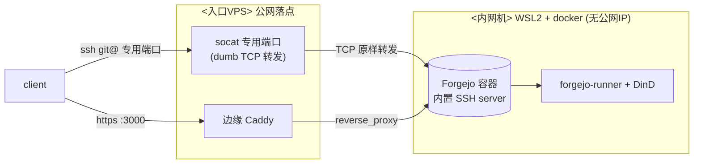
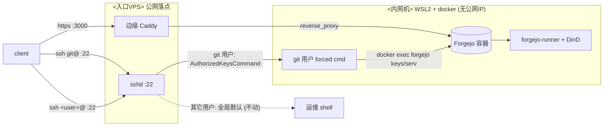

# 自建 Forgejo（内网 WSL2 机）+ 公网 git-SSH（内置 / relay 二选一）+ CI runner

> 这是一份可照着部署的指南，用占位符代替具体主机/IP/用户名，换台机器时按自己环境替换：
>
> - `<内网机>`：Forgejo 实际运行的机器（本部署是团队后端机：Windows host + 内嵌 WSL2 Ubuntu + Docker Desktop，在 EasyTier mesh 内，无独立公网 IP）。
> - `<MESH_IP>`：`<内网机>` 的 mesh IP（relay 的目的地址）。
> - `<MESH_SSH_PORT>`：`<内网机>` 上 sshd 监听、relay 连进去的端口（按你内网机实际填，本部署是 2222；地位同 `<MESH_IP>`，环境相关）。
> - `<user>`：`<内网机>` 上的部署/运维用户（在 docker 组，免 sudo 跑 docker）。
> - `<入口VPS>`：唯一有公网 IP 的机器，做公网入口（本部署是一台 RHEL 系、未备案的云 VPS）。
> - `<PUBLIC_IP>`：`<入口VPS>` 的公网入口地址，**可以是 IP，也可以是域名**（本部署后来改用了域名）。web 入口与 SSH 入口还能拆到不同主机（下文称 `<WEB_HOST>` / `<SSH_HOST>`）；最简单的单机情形里三者就是同一个值。
>
> - `<SSH_PORT>`：git-over-SSH 对外端口。两种方案取值不同（见 ③）：**relay 方案**复用标准 **22**；**内置 SSH 方案**用一个**专用端口**（22 留给入口机自己的运维 sshd，本部署用的是 222）。
>
> 其余端口 3000 / 2376 是设计固定值，按原样保留即可。

## 为什么选 Forgejo（选型背景）

- **Forgejo** 是 Gitea 的社区硬分叉，非营利的 **Codeberg** 平台就跑它（[codeberg.org](https://codeberg.org/)）。自建可得到和 Codeberg 同款软件。
- **2025–2026 一批 FOSS 项目从 GitHub 迁向 Codeberg(Forgejo)**：标杆是 Zig 语言 2025-11 迁过去（[codeberg.org/ziglang/zig](https://codeberg.org/ziglang/zig)，仓库 `created 2025-11-25`、`original_url` 指向原 GitHub 仓可佐证）。社区讨论里逃离 GitHub 的常见原因是 Actions/可用性不稳、平台劣化、强推 AI、价值观分歧（这些是社区舆论，未逐条核证）。GitLab、sourcehut 是另两个去向。
- **对自建的意义**：Forgejo + `forgejo-runner` 让 CI 完全跑在自己机器上，不受第三方平台掉线影响。
- 选型结论：**Forgejo + forgejo-runner（server / runner 分离）**，本部署即此架构。

### Forgejo 与 Gitea 现状差异（2026-06 实查两边源码）

二者 2024-02 硬分叉（共同祖先 `6992ef98`），功能高度重叠——Actions CI、~24 种包仓库、PR/Issue/Wiki/Projects、Mermaid/asciinema、色盲主题都各有。clone 两边完整源码 `git grep` 核对后，**用户层面**值得知道的差异：

| 维度 | Forgejo | Gitea |
| --- | --- | --- |
| License | **GPLv3+**（强 copyleft，二开须开源） | **MIT**（宽松，可闭源分发） |
| 联邦化 ActivityPub（跨实例关注 / star） | ✅ 有，admin 带 Federation 管理页 | ❌ 仅 webfinger/actor 残桩 |
| 存储配额 Quota（按用户/组织限额） | ✅ 有（`models/quota`） | ❌ 无 |
| 内容举报 / 审核 Moderation | ✅ 有（v14 起） | ❌ 无 |
| `.glb`/`.gltf` 3D 模型预览 | ✅ 有（v12 起） | ❌ 仅 mimetype |
| Jupyter `.ipynb` 渲染 | ❌ 无 | ✅ 有（`modules/markup/jupyter`） |
| Git LFS over SSH（`git-lfs-transfer`） | ❌ 仅残留 | ✅ 有 |
| 包仓库独有生态 | ALT Linux | Terraform module |
| Actions 日志 REST API（见下节） | **v16 起**（per-job 文本 + per-run zip） | **v1.24 起**（per-job 文本） |
| 前端构建链 | Webpack + npm | Vite + pnpm |

> 一句话选型：要联邦化 / 配额 / 审核 / 3D 预览选 **Forgejo**；要看 Jupyter / 用 SSH 传 LFS 选 **Gitea**；要闭源二次开发只有 **Gitea(MIT)**。其余日常功能基本对等。

## 目标与难点

`<内网机>` 用 docker compose 跑 Forgejo，但它没有公网 IP；唯一的公网落点是 `<入口VPS>`。要在不破坏 `<入口VPS>` 自身运维的前提下，把三件事透到内网：

- `ssh <user>@<PUBLIC_IP>` → 仍是 `<入口VPS>` 自己的运维 shell（**不能被破坏**）。
- `git clone` 透到内网 Forgejo（端口随方案：**A 用一个专用端口、B 复用标准 22**，见 ③）。
- web UI + git-over-HTTPS → 经边缘 Caddy 反代（`https://<PUBLIC_IP>:3000/`；本部署 VPS 未备案，只能用 IP + `tls internal` 自签证书，client 需 `-k`）。

git-SSH 的难点全在「入口机的 22 已经是它自己的运维 sshd」这一条上，两套方案各自绕开它：

- **方案 A（本部署在用）**：git 走一个**专用端口**，入口机对该端口做**无脑 TCP 转发**（不碰 sshd），git 落到 Forgejo 内置 SSH server。最简单；代价是 clone URL 带端口（`ssh://…:<port>/`）。
- **方案 B**：要 git 也复用**标准 22**（clone URL 不带端口、像 GitHub）。靠 **SSH passthrough + 跨机 relay**：入口机 sshd 按**登录用户名**分流——`git` 用户的请求经 relay 转进 Forgejo 容器，其它用户走全局默认 shell，完全不受影响。

## 整体架构

Forgejo 本体 + web + CI 都在内网 `<内网机>` 的 docker 里（①②④），唯一的公网落点是 `<入口VPS>`。**web/HTTPS 统一走 ② 的边缘 Caddy 反代**；**git-over-SSH 有两套方案、二选一**（③）——下面两张图分别是它们的链路（运维 shell、web 都不受影响）。

**方案 A：内置 SSH + dumb TCP 转发（本部署在用，更简单）**——入口机只做一层无脑 TCP 转发，git 落到 Forgejo 自己的内置 SSH server。



**方案 B：公网 SSH relay（复用 22，clone URL 无端口短地址）**——入口机 sshd 按登录名分流，`git@` 经 relay 查 key / 跑 git，`<user>@` 仍是正常运维 shell。



> 两方案里"转发/relay 这一跳"（`<入口VPS>` → `<内网机>`）都走 EasyTier mesh，不经公网。

**方案 B 的两步**（方案 A 没有这套——Forgejo 内置 server 直接查库、连入口机都不碰）：`git clone git@<PUBLIC_IP>:…` 实际分两步，都由 `<入口VPS>` 的脚本经 relay 转发到内网、再 `docker exec` 进 Forgejo 容器：

1. **查 key**：sshd 的 `AuthorizedKeysCommand` 当场问"这把公钥是谁的"→ relay → `docker exec forgejo forgejo keys` 查 Forgejo 数据库 → 返回一行带 forced command 的 `authorized_keys`。
2. **跑 git**：那行 forced command → relay → `docker exec -i forgejo forgejo serv key-N` 收发 git 数据。

> **方案 B：为什么网页端加一把 SSH key，公网入口机马上就认得？** 因为入口机的 `git` 用户**没有** `authorized_keys` 文件——sshd 配的是 `AuthorizedKeysCommand`，每次连接**当场**经 relay 查 Forgejo 数据库里的公钥表（网页端加的 key 正存在这里）。key 始终只在 Forgejo 数据库里，**从不拷到入口机**。

下面按 ①内网机 Forgejo → ②web 入口 → ③git-SSH（二选一）→ ④CI 的顺序部署。两套 git-SSH 方案的取舍对比与做法见 ③。

## ① 内网机：Forgejo + PostgreSQL

`<内网机>` 上建个目录（本部署是 `~/forgejo/`，路径随意），放下面的 `docker-compose.yml`。这份文件**一次写全**，含后面 ④ 要用的 `docker-in-docker` / `runner` 两个容器（先只起 `server` `db`，runner 要注册后再起）。其中 `server`+`db` 来自官方 [docker.md](https://forgejo.org/docs/latest/admin/installation/docker/) 的 PostgreSQL 示例，`docker-in-docker`+`runner` 来自官方 [Actions runner 文档](https://forgejo.org/docs/latest/admin/actions/installation/docker/)：

```yaml
networks:
  forgejo:
    external: false

volumes:
  docker_certs:

services:
  server:
    image: codeberg.org/forgejo/forgejo:15
    container_name: forgejo
    environment:
      - USER_UID=1000
      - USER_GID=1000
      - FORGEJO__database__DB_TYPE=postgres
      - FORGEJO__database__HOST=db:5432
      - FORGEJO__database__NAME=forgejo
      - FORGEJO__database__USER=forgejo
      - FORGEJO__database__PASSWD=${POSTGRES_PASSWORD}
      - FORGEJO__server__DOMAIN=<WEB_HOST>
      - FORGEJO__server__ROOT_URL=https://<WEB_HOST>/
      - FORGEJO__server__HTTP_PORT=3000
      - FORGEJO__server__SSH_DOMAIN=<SSH_HOST>
      - FORGEJO__server__SSH_PORT=22
      - FORGEJO__server__START_SSH_SERVER=false
      - FORGEJO__server__DISABLE_SSH=false
      - FORGEJO__service__DISABLE_REGISTRATION=true
      - FORGEJO__security__INSTALL_LOCK=true
      - FORGEJO__session__COOKIE_NAME=forgejo_<unique>
    restart: unless-stopped
    networks:
      - forgejo
    volumes:
      - ./data:/data
      - /etc/timezone:/etc/timezone:ro
      - /etc/localtime:/etc/localtime:ro
    ports:
      - "127.0.0.1:3000:3000"
    depends_on:
      - db

  db:
    image: postgres:14
    container_name: forgejo-db
    restart: unless-stopped
    environment:
      - POSTGRES_USER=forgejo
      - POSTGRES_PASSWORD=${POSTGRES_PASSWORD}
      - POSTGRES_DB=forgejo
    networks:
      - forgejo
    volumes:
      - ./postgres:/var/lib/postgresql/data

  docker-in-docker:
    image: data.forgejo.org/oci/docker:dind
    container_name: forgejo-dind
    hostname: docker
    privileged: true
    restart: unless-stopped
    environment:
      - DOCKER_TLS_CERTDIR=/certs
    networks:
      - forgejo
    volumes:
      - docker_certs:/certs
      - ./dind:/var/lib/docker

  runner:
    image: data.forgejo.org/forgejo/runner:12
    container_name: forgejo-runner
    restart: unless-stopped
    depends_on:
      - server
      - docker-in-docker
    environment:
      - DOCKER_HOST=tcp://docker:2376
      - DOCKER_CERT_PATH=/certs/client
      - DOCKER_TLS_VERIFY=1
    networks:
      - forgejo
    volumes:
      - ./runner:/data
      - docker_certs:/certs
    command: forgejo-runner --config /data/config.yml daemon
```

换机要改的值：

- **`ROOT_URL` / `SSH_DOMAIN` / `DOMAIN` 三者含义不同**，都可填 IP 或**域名**（本部署用的就是域名，且 web 与 SSH 还指向不同主机）；别一股脑填同一个值。理解关键：**"网页 URL""HTTPS clone 地址""SSH clone 地址"是三件事，但只有第一件是功能性的，后两件本质是展示**——
  - **`ROOT_URL`（功能性，最重要）** = 网页对外地址。浏览器地址栏、页面/邮件里生成的所有链接、**GitHub OAuth 回调的 base**（回调 = `<ROOT_URL>/user/oauth2/<name>/callback`）都用它；**HTTPS clone 地址不是独立配置项，而是由它派生**（`<ROOT_URL><owner>/<repo>.git`）。所以"改 HTTPS clone 显示"≡"改 `ROOT_URL`"，而改 `ROOT_URL` 会连带影响 web 访问和 OAuth。它必须和浏览器**实际**访问方式逐字一致：经边缘域名 + 443 就写 `https://<WEB_HOST>/`；边缘在非标端口上自签（如 `:3000`）就写 `https://<WEB_HOST>:3000/`。改了它，GitHub OAuth App 的回调 URL 要同步改。
  - **`SSH_DOMAIN`（+ `SSH_PORT`，纯展示）** = 只决定仓库页「Clone」框里 SSH 地址显示成 `git@<SSH_DOMAIN>:…`（端口取 `SSH_PORT`、形式见下「scp-like vs ssh://」）。**实际 SSH 连到哪，由 `<SSH_HOST>` 的 DNS + 入口机那一跳决定，Forgejo 不参与**——所以它可以指向和 web **完全不同的主机**（本部署 web 走一台边缘、SSH 直连另一台境内机，就是靠这里拆开的）。单独改它只动仓库页显示、不影响连通。`SSH_PORT` 是展示端口；和内置 SSH server 的真实监听口 `SSH_LISTEN_PORT` 是两回事——**relay 方案**（③ B）`START_SSH_SERVER=false`、用不到 `SSH_LISTEN_PORT`，`SSH_PORT=22` 只为展示；**内置方案**（③ A）`START_SSH_SERVER=true`、`SSH_PORT` 填专用端口、`SSH_LISTEN_PORT` 填容器内高端口。
  - **`DOMAIN`（默认值种子）** = 仅在 `ROOT_URL` / `SSH_DOMAIN` 没显式设时，拿它推默认值（`ROOT_URL` 默认 `{PROTOCOL}://{DOMAIN}:{HTTP_PORT}/`，`SSH_DOMAIN` 默认取 `DOMAIN`）。两者都显式写了时，`DOMAIN` 基本不再单独起作用；填成 web host 保持整洁即可。
- `START_SSH_SERVER` / `DISABLE_SSH`：选哪条 git-SSH 路线（见 ③ 二选一）。**relay 方案**（B）`START_SSH_SERVER=false`（关掉内置 server，容器不监听 SSH，git transport 由 relay + `forgejo serv` 承担）；**内置方案**（A）`START_SSH_SERVER=true`（起内置 server，另配 `SSH_PORT` / `SSH_LISTEN_PORT` 与端口发布，见 ③ 方案 A）。两者都要 `DISABLE_SSH=false` 才保留 SSH 克隆能力。
- `COOKIE_NAME` 设成一个**独特名**（见「关键坑 · cookie 改名」）。
- `POSTGRES_PASSWORD` 放同目录 `.env`（`POSTGRES_PASSWORD=...`，权限 600），compose 用 `${POSTGRES_PASSWORD}` 引用。
- 镜像 tag `forgejo:15` 里的 `15` 会自动跟最新 15.x。撰写时最新已发布大版本是 15；官方文档示例里出现的 `16` 当时还没发布镜像，按实际能拉到的大版本填。

起服务：`docker compose up -d server db`，再 `curl -I http://127.0.0.1:3000/` 应得 200。

### SSH 克隆地址形式：scp-like vs `ssh://`（`USE_COMPAT_SSH_URI`）

Web 上「Clone」按钮给的 SSH 地址有两种写法，由 `[repository] USE_COMPAT_SSH_URI` + `SSH_PORT` 共同决定。生成逻辑就三个分支（Forgejo 15 / Gitea 1.22 源码 `models/repo/repo.go` 的 `ComposeSSHCloneURL`）：

| 条件 | 生成形式 |
|---|---|
| `SSH_PORT != 22` | `ssh://git@<host>:<port>/<owner>/<repo>.git`（带端口，只能 `ssh://`） |
| `SSH_PORT == 22` 且 `USE_COMPAT_SSH_URI = true` | `ssh://git@<host>/<owner>/<repo>.git`（无端口的 `ssh://`） |
| `SSH_PORT == 22` 且 `USE_COMPAT_SSH_URI = false` | `git@<host>:<owner>/<repo>.git`（**scp-like**，即 GitHub 那种） |

**想要 GitHub 那种 scp-like 短形式** → 显式设 `USE_COMPAT_SSH_URI=false`（本部署经 compose 注入）：

```yaml
- FORGEJO__repository__USE_COMPAT_SSH_URI=false
```

改完 `docker compose up -d server` 重建容器即可；可用 `docker exec -u git forgejo grep -i USE_COMPAT_SSH_URI /data/gitea/conf/app.ini` 确认落盘，再查 API `ssh_url` 字段验证生成形式。

**为什么默认是 `ssh://` 形式、这名字为什么叫「compat」**：

- **Forgejo 默认 `true`**（`modules/setting/repository.go` 里 `UseCompatSSHURI: true`）——所以**开箱即 `ssh://` 形式**，即便 22 端口、即便没写这一行。注意 **Gitea 默认是 `false`**（scp-like），两个项目默认值相反，从 Gitea 迁来会"莫名其妙变形式"。
- **「compat」=「兼容早期 Gitea 的展示行为」**：这个开关由 Gitea [PR #2356](https://github.com/go-gitea/gitea/pull/2356)（2017-08 合入）引入。早期 Gitea **一直只用 `ssh://` 显式 URI**；后来把默认改成了 scp-like 短形式（更贴近 GitHub 习惯），于是加这个开关让你能**强制切回旧的 `ssh://` 形式**——"compat" 指的就是兼容这套老的 `ssh://` URI 展示，名字和直觉相反（compat 反而是 `ssh://`，不是 scp-like）。

> 两种写法在 22 端口下**功能完全等价**，落到同一个仓库。区别只在：scp-like 语法**无法表达端口**——所以一旦 `SSH_PORT != 22`，无论 `USE_COMPAT_SSH_URI` 设什么都只会给带端口的 `ssh://` 形式。本部署若 web 与 SSH 分流到不同入口（如 web 走域名经边缘反代、SSH 直连另一台），`SSH_DOMAIN` 单独指向 SSH 入口、`SSH_PORT=22` 保持，配 `USE_COMPAT_SSH_URI=false` 即得 `git@<ssh-host>:<owner>/<repo>.git`。

**源码核实（2026-06，对照 [go-gitea/gitea](https://github.com/go-gitea/gitea) + [forgejo/forgejo](https://codeberg.org/forgejo/forgejo) 当前源码）**：上表三分支两家**逐字一致**，都出自 `models/repo/repo.go` 的 `ComposeSSHCloneURL`——`if setting.SSH.Port != 22` 时强制走带端口 `ssh://`（源码注释原文 `// non-standard port, it must use full URI`），22 端口才在 `UseCompatSSHURI` 上二选一。所以"是 Gitea 还是 Forgejo"**不影响分支判断、只影响默认值**。Gitea 还自带单元测试 `models/repo/repo_test.go` 的 `TestComposeSSHCloneURL`，把结果钉成行为契约，可直接当真值表照搬：

| `SSH.Domain` | `SSH.Port` | `UseCompatSSHURI` | 断言输出 |
|---|---|---|---|
| `domain` | 22 | `false` | `git@domain:user/repo.git` |
| `domain` | 22 | `true` | `ssh://git@domain/user/repo.git` |
| `domain` | 123 | `false` | `ssh://git@domain:123/user/repo.git` |
| `domain` | 123 | `true` | `ssh://git@domain:123/user/repo.git`（与上行**相同** → 非 22 端口下开关失效）|
| `::1` | 22 | `false` | `git@[::1]:user/repo.git`（IPv6 host 自动包 `[]`）|
| `::1` | 123 | `false` | `ssh://git@[::1]:123/user/repo.git` |

**默认值的精确出处**（决定 app.ini 不写这条时取什么）——两家都在 `modules/setting/repository.go`，**写法不同、结果相反**：

| | ini 解析行 | 缺省值 |
|---|---|---|
| **Forgejo** | `Repository.UseCompatSSHURI = sec.Key("USE_COMPAT_SSH_URI").MustBool(true)` | **`true`**（`ssh://`）|
| **Gitea** | `... .MustBool()`（**无参**，取零值；结构体默认也是 `false`）| **`false`**（scp-like）|

**Gitea 独有的 `(DOER_USERNAME)` 变体**（和本部署的 SSH 反代/relay 架构相关）：Gitea 的签名是 `ComposeSSHCloneURL(doer, owner, repo)`，比 Forgejo 的 `ComposeSSHCloneURL(owner, repo)` 多收一个 `doer`——当 `SSH_USER`（`setting.SSH.User`）设成字面量 `(DOER_USERNAME)` 时，clone 地址里的 SSH 用户名替换成**当前登录用户名**（给"按用户预先准备公钥"的 SSH 反代用），拿不到 doer 时回落内置用户。Forgejo 没有这个分支。

### 镜像与数据目录：用非 rootless，注意挂载路径

Forgejo 官方镜像有两种（[官方 docker.md](https://forgejo.org/docs/latest/admin/installation/docker/)）：

- **非 rootless**（`forgejo:15`，本部署用这个）：容器以 root 启动再降权到 `git`，数据目录是 **`/data`**（`GITEA_CUSTOM=/data/gitea`，git 仓库落在 `/data/git/repositories/`）。
- **rootless**（`forgejo:15-rootless`）：全程不以 root 跑，数据目录是 `/var/lib/gitea`，要额外配 `user: 1000:1000`、SSH 映射到 `:2222`。

**为什么用非 rootless**：本部署跑在 Docker Desktop / WSL2 + bind mount 下，rootless 镜像常因宿主目录属主/权限重映射出问题（官方文档专门提醒过这类权限坑）；而本部署只把 `./data` 一个目录挂进容器、不碰宿主敏感路径，root 容器的额外风险很小。

> **别和 "rootless Docker" 混了——这是两个不同的层：**
> - **镜像 rootless**（本节说的 `-rootless` 后缀）：只管**容器内 app 进程**用 uid 1000 还是容器 root，**不改变**你启动容器要不要权限——两种镜像都一样 `docker compose up`。
> - **引擎 rootless**（rootless Docker / Podman）：让 docker 守护进程以**普通用户**跑，**用它无需 root 或 `docker` 组**。这才是决定"要不要 sudo"的层，也是多租户 / 拿不到 root 的共享机给你的模式。
>
> 所以 rootless **镜像**的安全收益主要在 **rootful 引擎**上才明显（本部署即此：在 `docker` 组 ≈ 有 root，容器内 root = 宿主/VM 的 root，这时换 rootless 镜像才算纵深防御）。而在 **rootless 引擎**下，连非 rootless 镜像的容器 root 也被 user namespace 重映射成普通 uid，宿主已被引擎保护，镜像选哪个更无所谓。本部署是**单租户 + rootful 引擎 + 自己人才在 docker 组**，故这层纵深防御省得起。

**挂载路径必须匹配镜像类型**：非 rootless 就写 `./data:/data`。最容易踩的坑是给非 rootless 镜像错写成 `./data:/var/lib/gitea`——容器根本不读这个路径，会自己在 `/data` 上挂一个 **docker 匿名卷**：数据看着正常，其实落在匿名卷里，`docker compose down -v` 或换 compose 就丢、也难备份。自查：

```
docker inspect forgejo --format '{{range .Mounts}}{{.Source}} -> {{.Destination}}{{println}}{{end}}'
```

要能看到 `… -> /data`；且宿主 `./data` 里应有 `git/ gitea/ ssh/` 三块，空的就是挂错了（修复见「关键坑 · 数据落进匿名卷」）。

### 登录与注册控制（OAuth / 禁密码 / 禁注册）

相关开关（本部署经 compose `FORGEJO__<section>__<KEY>` 注入，如 `FORGEJO__service__DISABLE_REGISTRATION`）：

- `[service] DISABLE_REGISTRATION = true` —— 关掉自助注册（没人能填表开新账号）。
- `[service] ENABLE_INTERNAL_SIGNIN = false` —— 关掉内置密码登录，**只剩外部认证源**（GitHub OAuth 等）。
- `[service] REQUIRE_SIGNIN_VIEW = true` —— **登录才可见**：未登录连公开仓库 / issue / 代码都看不到。默认 `false`（公开内容匿名可读）；**面向真实用户、不想裸奔的服务建议开 `true`**。
- `[oauth2_client] ENABLE_AUTO_REGISTRATION = true` —— 新 OAuth 用户**自动建号**（用户名取自 `[oauth2_client] USERNAME`，默认 GitHub nickname），免关联、免密码。默认 `false`。

OAuth 登录源用 CLI 加（等价 Web「站点管理 → 认证源」，**不在 `/api/v1`**）：

```bash
docker exec -u git forgejo forgejo admin auth add-oauth \
  --name github --provider github --key <CLIENT_ID> --secret <CLIENT_SECRET>
```

GitHub OAuth App 回调填 `<ROOT_URL>/user/oauth2/<name>/callback`（`<name>` 要和 `--name` 一致）。

**准入门槛**：`DISABLE_REGISTRATION=true` 且未开自动注册（`[oauth2_client] ENABLE_AUTO_REGISTRATION` 默认 false）时，陌生 GitHub 账号首次登录会被要求「关联到已有账号」——必须输入一个**已有 Forgejo 账号的用户名+密码**才能绑进来；没有已有账号密码的陌生人光有 GitHub 进不来。一个 GitHub 身份只能绑一个账号（`external_login_user.external_id` 唯一），关联只能本人走一次 OAuth 完成，CLI / admin 无法代绑。

**开 / 不开自动注册的取舍**：`ENABLE_AUTO_REGISTRATION=true` = **任何** GitHub 账号登录即自动建号、纯 OAuth 自助进（配合 `ENABLE_INTERNAL_SIGNIN=false` 就完全不维护用户名+密码）。但公网实例等于**全世界 GitHub 用户都能进来**建号、占 CI 算力，而 GitHub OAuth 无 org/team claim 可用 `--required-claim` 卡白名单（挡不住陌生人）。所以：

> - **公开社区** → 开 `ENABLE_AUTO_REGISTRATION=true`，这么配合理。
> - **私有 / 小团队** → **千万别开**，维持 `DISABLE_REGISTRATION=true` + auto-registration 关 + admin 预先建好号 + 成员手动关联，才挡得住陌生人。

> ⚠️ 设 `ENABLE_INTERNAL_SIGNIN=false`（只留 OAuth）**前，所有要用 web 的账号都得先绑好 OAuth**。坑在于 `link_account`（关联已有账号）页复用登录页同一个 `signin_inner` 模板、用户名密码框被同一个 `{{if .EnableInternalSignIn}}` 包着——一旦关掉，**没绑的账号连「GitHub 登录 → 输密码关联」这条补绑路也断了**（关联页同样没有密码框），只能临时把开关改回 `true` 开个窗口补绑、或 admin 改 DB 伪造绑定。admin 自己尤其要先绑，否则直接把自己锁在 web 外。

### 登录维持时间：`SESSION_LIFE_TIME` vs `LOGIN_REMEMBER_DAYS`（含"老是掉登录"根治）

两个**完全独立**的机制，别混（源码 `modules/setting/{session,security}.go`、`routers/web/auth/`、`models/auth/session.go`）：

| | `[session] SESSION_LIFE_TIME` | `[security] LOGIN_REMEMBER_DAYS` |
|---|---|---|
| 管的东西 | **当前会话**（"我现在是登录态"）的服务端寿命 | **「记住我」长效 cookie**（`persistent`，存 DB 的 LTA token） |
| cookie | `COOKIE_NAME`，只存 session id；**无 Max-Age = 浏览器会话 cookie** | `COOKIE_REMEMBER_NAME`，**带 Max-Age = N 天的持久 cookie** |
| 默认 | 86400s = **1 天** | Forgejo **31 天**（Gitea 旧默认是 7） |
| 过期方式 | **滑动**：每次请求把 `Expiry` 刷成当前时间，最后一次活动后再过 `SESSION_LIFE_TIME` 才失效（≈"闲置超时"，正是 GitHub 的"用着就不掉"） | session 没了（过期/被清/存储丢）时，`autoSignIn` 读这个 cookie → 查 DB 验证 → **静默重建一个新 session**，免密码 |
| 何时设置 | 登录即建 | **仅密码登录且勾选「记住此设备」时**才写 |
| 扛重启吗 | 看 `PROVIDER`：`memory` 重启即清空（全员掉登录）；`db`/`file` 才扛得住 | 扛：它直查 DB 用户表，与 session 存储无关 |

**一句话区别**：`SESSION_LIFE_TIME` 是"当前这次登录能闲置多久"；`LOGIN_REMEMBER_DAYS` 是"掉了之后还能免密自动登回来多久"。前者是前线，后者是后备网。

**关键坑 —— OAuth 登录不触发 remember-me**：`handleOAuth2SignIn`（GitHub OAuth 登录路径）只 `updateSession` 设 uid，**从不调 `SetLTACookie`**——所以走 GitHub OAuth 进来的用户**根本不会有 `persistent` cookie**，`LOGIN_REMEMBER_DAYS` 对他们形同虚设（它只对密码登录 + 勾「记住我」生效，如本地 admin）。**OAuth 实例的登录维持 = 只看 `SESSION_LIFE_TIME` + session 存储是否持久。**

**要达到"几天不掉、用着自动续、像 GitHub"——按下面配（compose 注入 `FORGEJO__<section>__<KEY>`）**：

```yaml
- FORGEJO__session__PROVIDER=db              # 关键!! 会话存进 Postgres,容器重启不再清登录
- FORGEJO__session__SESSION_LIFE_TIME=2592000 # 30 天(秒);滑动,即"闲置 30 天才掉"
- FORGEJO__session__GC_INTERVAL_TIME=86400    # 过期会话清理频率,无关寿命
- FORGEJO__security__LOGIN_REMEMBER_DAYS=30   # 仅对密码登录的「记住我」有效(OAuth 用户无感)
```

- **默认 `PROVIDER=memory` 是"老是掉登录"的头号元凶**：每次 `docker compose up`/重建容器，内存里所有会话全没，全员被登出。**改成 `db` 是治本**（用现有 Postgres，自动建 `session` 表，重启/重建都不掉）。`file`（落 `/data/gitea/sessions`，本部署 `./data` 已 bind mount）同样扛重启，但 `db` 更干净，首选。
- 改这几项要 `docker compose up -d server` 重建容器生效——**切 `memory`→`db` 这一下会把现存内存会话清掉、全员需再登录一次**，之后才稳。
- session cookie 无 Max-Age（Gitea 没暴露这个开关），**理论上彻底关掉浏览器会丢**；但现代浏览器的"恢复上次标签页"会把会话 cookie 带回来，体感上不掉。OAuth 实例没有 remember-me 这层后备，要更强的"关浏览器也不掉"只能靠浏览器自身的会话恢复。

## ② web 公网入口：Caddy 反代 + 默认中文

web UI + git-over-HTTPS 经 `<入口VPS>` 的边缘 Caddy 反代到 `<内网机>:3000`。Forgejo 容器只把 3000 发布到 `127.0.0.1:3000`（compose 里的 `ports: "127.0.0.1:3000:3000"`），不直接对外，对外只经 Caddy。Caddy → `<内网机>` 的具体链路（mesh / Windows portproxy / wslrelay / WSL→容器端口形态）是通用 WSL/Docker 网络问题，见 [`network.md`](network.md) 的「WSL / Docker 服务暴露（入站）」。

把整站默认语言设成简体中文：在 Caddy 里 forgejo 的 `reverse_proxy` 子块加 `header_up Accept-Language "zh-CN"`，压过浏览器的 `Accept-Language`。未登录/未设语言的用户即默认中文；用户在右下角切过语言后会写 cookie，cookie 优先级更高、记住其选择。

## ③ git-over-SSH：内置 SSH 还是 relay（二选一）

git 的 SSH 传输有两条独立路线，**二选一**即可，web/HTTPS（②）不受影响。先看取舍再往下做：

| 维度 | 方案 A：内置 SSH + dumb TCP 转发 | 方案 B：公网 SSH relay |
|---|---|---|
| 入口 VPS 角色 | 纯 TCP 转发（一个 socat 单元），**完全不碰 sshd** | sshd 按登录名 `git` 分流 + 两个 relay 脚本 |
| 用哪个端口 | 一个**专用端口** `<SSH_PORT>`（入口机 22 留给运维 sshd） | 复用标准 **22** |
| clone URL | `ssh://git@<SSH_HOST>:<SSH_PORT>/owner/repo.git`（带端口） | `git@<SSH_HOST>:owner/repo.git`（scp-like 短地址，像 GitHub） |
| 入口机要装啥 | 只一个 socat 转发单元 | `git` 用户 + `AuthorizedKeysCommand` + 两个脚本 + relay 私钥 |
| 公钥怎么认 | Forgejo 内置 server 直接查自己数据库 | 入口机每次连接经 relay 现查容器 `forgejo keys` |
| 复杂度 / 维护面 | 低 | 高（多机、多脚本、有 ControlMaster 等坑） |
| 什么时候选 | 能接受非 22 端口、想最简单直接 | clone URL 必须走标准 22 / 要 GitHub 式无端口短地址 |

> 两方案 Forgejo 都要 `DISABLE_SSH=false`。区别只在 `START_SSH_SERVER`（A=`true` 起内置 server；B=`false`，git transport 由 relay + `forgejo serv` 承担）和入口机那一跳怎么搭。上面 ① 的 compose 是按 B 写的，选 A 就按「方案 A」改那几个 `FORGEJO__server__*` 并多发布一个端口。

### 方案 A：内置 SSH server + 入口机 dumb TCP 转发

最省事的一条：Forgejo 跑**自己的内置 SSH server**，入口 VPS 只做一层**无脑 TCP 端口转发**——不碰 sshd、不查 key、不装 forgejo 二进制。因为入口机的 22 已经是它自己的运维 sshd，这套用一个**专用端口** `<SSH_PORT>`（如 222 / 2222）。

**Forgejo 容器**：在 ① 的 compose 上改这几个环境变量——

```yaml
      - FORGEJO__server__START_SSH_SERVER=true        # 起内置 SSH server
      - FORGEJO__server__SSH_PORT=<SSH_PORT>          # 对外展示 + clone URL 用的端口
      - FORGEJO__server__SSH_LISTEN_PORT=<容器内端口>  # 容器内真实监听口（高端口，见下）
      - FORGEJO__server__SSH_DOMAIN=<SSH_HOST>        # clone URL 里显示的主机
      - FORGEJO__server__DISABLE_SSH=false
```

ports 里把内置 server 发布出来（发布到本机回环，对外由入口机转发；WSL 场景见下）：

```yaml
    ports:
      - "127.0.0.1:3000:3000"
      - "127.0.0.1:<SSH_PORT>:<容器内端口>"
```

要点：

- **`SSH_PORT`（展示）≠ `SSH_LISTEN_PORT`（容器内真实监听）**：容器以非 root（`USER_UID=1000`）跑、绑不了 <1024 的口，所以 `SSH_LISTEN_PORT` 用高端口（如 2222），再把它 publish 成 host 的 `<SSH_PORT>`。
- **`SSH_PORT != 22` ⇒ clone URL 自动是带端口的 `ssh://git@<SSH_HOST>:<SSH_PORT>/...`**（`USE_COMPAT_SSH_URI` 在非 22 下失效，见上「scp-like vs ssh://」真值表）。想要无端口 scp-like 短地址，要么走方案 B 的 22，要么你有一台**专门的 SSH 入口主机、其 22 空着**——那就把 `<SSH_PORT>` 设 22、转发该主机的 22。
- **主机密钥**：内置 server 用 `<data>/ssh/ssh_host_*`。容器以 uid 1000 跑，这些 key 必须能被 uid 1000 读——若原来是 `root:root 600`，`docker exec -u root <容器> chown -R 1000:1000 /data/ssh` 修一下，否则 server 起不来。容器日志出现 `SSH server started on :<容器内端口>` 即成功。

**入口 VPS：一个 dumb TCP 转发（systemd + socat）**，把公网 `<SSH_PORT>` 原样转到内网机同端口，全程不碰 sshd：

```ini
# /etc/systemd/system/forgejo-ssh-forward.service
[Unit]
Description=TCP forward :<SSH_PORT> -> Forgejo built-in SSH on <内网机>:<SSH_PORT>
After=network-online.target
Wants=network-online.target

[Service]
Type=simple
ExecStart=/usr/bin/socat -d -d TCP-LISTEN:<SSH_PORT>,fork,reuseaddr,keepalive TCP:<内网机地址>:<SSH_PORT>,keepalive
Restart=on-failure
RestartSec=2s
DynamicUser=yes
AmbientCapabilities=CAP_NET_BIND_SERVICE      # 仅当 <SSH_PORT> < 1024 才需要
CapabilityBoundingSet=CAP_NET_BIND_SERVICE
NoNewPrivileges=yes
ProtectSystem=strict
ProtectHome=yes
PrivateTmp=yes

[Install]
WantedBy=multi-user.target
```

`systemctl enable --now forgejo-ssh-forward`，再放行云防火墙/安全组的 `<SSH_PORT>` 入站。**验收**：从任意公网机 `ssh -p <SSH_PORT> -T git@<SSH_HOST>` 应回 Forgejo 的 `Permission denied (publickey)`（没登记 key 时）或欢迎语（登记了 key）；`ssh -v` 里出现 `remote software version Go` 说明确实打到了 Forgejo 内置 server（OpenSSH 会显示 `OpenSSH_...`，借此区分是不是打串到运维 sshd）。公钥在 Forgejo 网页端登记即可（内置 server 直接查库，无需碰入口机）。

**内网机在 WSL2（NAT）+ Windows 入口的特例**：`<内网机地址>` 要填 Windows 宿主的网卡 IP（mesh / LAN），WSL 内的容器端口得经 Windows `netsh portproxy` + wslrelay 才能从宿主 IP 进。这条链路有个 **SSH 专属坑**，详见 [`network.md`](network.md)「WSL/Docker 服务暴露（入站）」：

> 这条链路经 Windows `netsh portproxy` + wslrelay。docker 发布 `0.0.0.0:<SSH_PORT>:<容器内端口>` 或 `127.0.0.1:<…>` 均可（实测无差别）；portproxy **`connectaddress=127.0.0.1`**（走 wslrelay、**不漂移**，别用会随 WSL 重启变化的 eth0 IP）。wslrelay 有个全双工死锁坑（WSL #10688）：仅"双向同时大流量 + 程序不积极收 socket"才触发，git-over-SSH / HTTP 实测不中招、与发布地址无关，详见 [`network.md`](network.md)「全双工大流量下 wslrelay 死锁」。

### 方案 B：公网 SSH relay（sshd 分流 + 中转脚本）

整套的核心，三部分：`<入口VPS>` 的 sshd 分流、`<入口VPS>` 的两个中转脚本、`<内网机>` 的 authorized_keys 内联转发。

#### (a) `<入口VPS>` sshd：给 git 用户单独分流

先建一个本机 `git` 用户（`useradd git`，家目录放 relay 私钥，见 (b)）。在 `<入口VPS>` 的 `sshd_config` 末尾加一段 `Match User git`——只影响登录名 `git`，全局配置和其它用户完全不动：

```
# >>> forgejo-relay BEGIN
# 把登录用户 git 限制为"只能走 Forgejo git transport（经 relay 到内网）"
Match User git
    AuthorizedKeysCommand /usr/local/bin/forgejo-authkeys %u %t %k
    AuthorizedKeysCommandUser git
    AuthorizedKeysFile none
    PasswordAuthentication no
    KbdInteractiveAuthentication no
    X11Forwarding no
    AllowTcpForwarding no
    PermitTTY no
# <<< forgejo-relay END
```

- `AuthorizedKeysCommand` 让 sshd 每次连接**动态查 key**（不读静态文件，故 `AuthorizedKeysFile none`），`%u %t %k` = 用户名 / key 类型 / key blob。
- `AuthorizedKeysCommandUser git`：这条查询命令以 `git` 身份跑。
- 改 sshd 要稳：先备份 → `sshd -t` 校验通过 → `systemctl reload sshd`（reload 不断现有连接，配错也不会立刻锁死你）。SSH 服务名因发行版而异（见「关键坑 · 发行版差异」）。云厂商的 VNC / 串口控制台是改坏时的最后兜底。

#### (b) `<入口VPS>` 两个中转脚本

这两个脚本**就是单机 Forgejo 里 `forgejo keys` / `forgejo serv` 两个功能的"跨机版"**：单机部署时 sshd 直接调 forgejo 二进制的这俩子命令；这里 VPS 上没有 forgejo，于是用两个 shell 脚本把请求经 relay 转给内网机容器里的 `forgejo keys` / `forgejo serv` 执行。脚本本身只做 ssh 转发——**VPS 不需要任何 forgejo 二进制**，公网那台越干净越安全。

`/usr/local/bin/forgejo-authkeys`（sshd 查 key 时调，把 `keys` 请求经 relay 转给内网，再把内网返回的 key id 拼成一行带 forced command 的 authorized_keys 回给 sshd）：

```bash
#!/usr/bin/env bash
# VPS sshd 的 AuthorizedKeysCommand（以 git 身份跑，参数 = %u %t %k）。
# = 单机 Forgejo 里 `forgejo keys` 的跨机版：把 (类型,公钥) 经 relay 转给内网机
#   容器查，再把返回的 key-N 改写成一行指向本机 forgejo-serv 的 authorized_keys。
set -uo pipefail
RELAY="ssh -i /home/git/.ssh/relay_key -p <MESH_SSH_PORT> -o IdentitiesOnly=yes -o ControlMaster=no -o ControlPath=none -o BatchMode=yes -o StrictHostKeyChecking=accept-new -o ConnectTimeout=8 <user>@<MESH_IP>"
keyid="$($RELAY "keys ${2:-} ${3:-}" 2>/dev/null | grep -m1 -oE 'key-[0-9]+')" || exit 0   # 查不到 / relay 失败 → 干净拒绝
printf 'command="/usr/local/bin/forgejo-serv %s",no-port-forwarding,no-X11-forwarding,no-agent-forwarding,no-pty,restrict %s %s\n' "$keyid" "$2" "$3"
```

`/usr/local/bin/forgejo-serv`（上面拼出的 forced command 的目标；把客户端真正的 git 命令 base64 后经 relay 转给内网的 `serv`）：

```bash
#!/usr/bin/env bash
# 上面那行 authorized_keys 的 forced command（参数 = key-N）。
# = 单机 Forgejo 里 `forgejo serv` 的跨机版：把客户端真正的 git 命令
#   （在 $SSH_ORIGINAL_COMMAND 里）base64 后经 relay 转给内网机容器执行。
set -uo pipefail
exec ssh -i /home/git/.ssh/relay_key -p <MESH_SSH_PORT> \
  -o IdentitiesOnly=yes -o ControlMaster=no -o ControlPath=none \
  -o BatchMode=yes -o StrictHostKeyChecking=accept-new -o ConnectTimeout=8 \
  <user>@<MESH_IP> "serv ${1:?keyid} $(printf '%s' "${SSH_ORIGINAL_COMMAND:-}" | base64 -w0)"
```

两脚本 `chmod 755`、root 拥有。relay 私钥 `/home/git/.ssh/relay_key`（600、git 拥有）+ 预填 `known_hosts`。git 命令必须 base64：它含空格和引号，跨两跳 SSH + shell 会被切碎，base64 成一个整块最稳。那串 `-o ControlMaster=no …` 见「关键坑 · ControlMaster」。

#### (c) `<内网机>`：authorized_keys 内联转发

relay 的另一端落在 `<内网机>` 的 `<user>`（用它当 relay 端点，免 sudo）。在 `<user>` 的 `~/.ssh/authorized_keys` 里给 relay 公钥加**一行 forced command**，把 relay 请求 dispatch 成对 Forgejo 容器的 `docker exec`：

```
command="/usr/bin/bash -c 'set -- $SSH_ORIGINAL_COMMAND; a=${1:-}; if [ \"$a\" = keys ]; then exec docker exec -u git forgejo forgejo keys -e git -u git -t \"$2\" -k \"$3\" --config /data/gitea/conf/app.ini; elif [ \"$a\" = serv ]; then exec docker exec -i -u git -e SSH_ORIGINAL_COMMAND=\"$(printf %s \"$3\" | base64 -d)\" forgejo forgejo serv \"$2\" --config /data/gitea/conf/app.ini; else echo \"relay: bad action\" >&2; exit 1; fi'",no-port-forwarding,no-X11-forwarding,no-agent-forwarding,no-pty,restrict ssh-ed25519 <relay-pubkey> forgejo-relay@<入口VPS>
```

- `<内网机>` 收到的请求要递进 Forgejo 容器，靠 `docker exec`（只能在容器外的宿主上跑，所以这段逻辑在宿主、不在容器里）。
- **一把 key 承载两种操作**：`set -- $SSH_ORIGINAL_COMMAND` 拆出 action，`keys` / `serv` 两路分别 `docker exec`，其它输入一律 `relay: bad action` 拒绝。这个 dispatch 去不掉——请求是动态的、藏在 `$SSH_ORIGINAL_COMMAND` 里，没法写死成一条裸命令。
- `serv` 那路 `docker exec` **必须带 `-i`**（保留 stdin），否则 push 会挂死（见「关键坑」）。
- **直接内联进 `command=` 而不另放脚本**：省一个文件、改 key 时一处可见。`command=` 外层是双引号、内部只能用 `\"` 转义双引号，所以主体用单引号包 `bash -c '...'`（主体内不含单引号才成立）。`forgejo serv` / `forgejo keys` 是 Forgejo 的原生子命令（官方 SSH 直连模式内部也是调它们），这里把它们"借"出来用。

**验收**：把客户端公钥加到某个 Forgejo 账户后，`ssh <user>@<PUBLIC_IP>` 仍是运维 shell、`git clone git@<PUBLIC_IP>:user/repo.git` 能拉到仓库即通。

## ④ CI：Forgejo Actions runner（DinD 隔离）

Forgejo Actions 自 `Forgejo v1.21` 起**默认启用**（[官方 Actions admin 文档](https://forgejo.org/docs/latest/admin/actions/)：「As of Forgejo v1.21, Actions is enabled by default」），无需改 `app.ini`。Forgejo 本体不跑 job，靠独立的 **forgejo-runner**。① 的 compose 已含两个容器：

- `docker-in-docker`（`data.forgejo.org/oci/docker:dind`，privileged，hostname 必须是 `docker`）：**独立的 docker daemon 跑在容器里**，job 容器都在它里面起、与宿主 docker 隔离。TLS 证书经 `docker_certs` 卷共享。
- `runner`（`data.forgejo.org/forgejo/runner:12`）：`DOCKER_HOST=tcp://docker:2376` 指向 DinD。

> 用 **DinD + TLS（2376）** 而非官方 [runner docker 文档](https://forgejo.org/docs/latest/admin/actions/installation/docker/) 最简示例的明文 `2375 --tls=false`：privileged 的 DinD 守护进程 ≈ 近乎宿主 root 的能力，明文 2375 无认证、同网络任何容器都能控制它；TLS 让只有持 `docker_certs` 证书的 runner 连得上。带 TLS 的多容器写法对应官方 runner 仓库的 [`examples/docker-compose`](https://code.forgejo.org/forgejo/runner/src/branch/main/examples/docker-compose)。

注册三步：

1. **生成 token**（全局 runner token，admin 级）：
   ```
   docker exec -u git forgejo forgejo actions generate-runner-token
   ```
   （web 界面拿的 secret 与 CLI token 不是一回事；自动化用 CLI token。）
2. **注册**（创建 `./runner/.runner`）。instance URL 用**容器内部地址** `http://forgejo:3000`（HTTP 明文走 compose 网络，避开公网自签 TLS）：
   ```
   docker compose run --rm runner forgejo-runner register --no-interactive \
     --instance http://forgejo:3000 --token <TOKEN> --name dind-<host> \
     --labels "docker:docker://data.forgejo.org/oci/node:20-bookworm,ubuntu-latest:docker://data.forgejo.org/oci/node:20-bookworm"
   ```
   label 形如 `name:docker://image`：把 `ubuntu-latest` 映射到一个 node 镜像，这样 `runs-on: ubuntu-latest` 能用、`actions/checkout`（需 node 运行时）也跑得起来。
3. **配置 + 启动**：`docker compose run --rm runner forgejo-runner generate-config > runner/config.yml`，把 `container.network` 改成 `"host"`（见下），再 `docker compose up -d docker-in-docker runner`。

### runner 网络的关键设计

job 容器跑在 **DinD 的独立 daemon** 里，DinD 的网络命名空间默认解析不到宿主 compose 网络上的 `forgejo`。解法：

- DinD 容器挂到 Forgejo 的 compose 网络（compose 项目名前缀，本部署是 `forgejo_forgejo`）→ DinD 能解析 `forgejo:3000`。
- runner config `container.network: "host"` → job 容器共享 DinD 的 netns → job 内 `actions/checkout` 能从 `http://forgejo:3000` clone（内部 HTTP，无 TLS 验证问题）。

> **host vs bridge（为什么不能用默认）**：这是 **docker 套娃的两层网络**——job 容器由 **DinD 内层 docker daemon** 创建、待在内层 bridge（实测 `172.17.0.0/16`），而 `forgejo` 在**外层 compose** 网络（实测 `172.20.0.0/16`），两层互不相通。用默认 `network: ""`（自动建网）或 `bridge`，job 待在内层 bridge 只能 NAT **向外**出公网、却**够不到内部 `forgejo:3000`**（clone 失败；装了 Mihomo/Clash 之类的机器上 `forgejo` 还会被兜底解析成连不通的 fake-ip `198.18.x`，看着"解析成功"实则连不上）。`host` 让 job 共享 **DinD 容器自己的 netns**，而 DinD 本身在外层 compose 里 → job 借它的身份才直连得上 `forgejo`。代价：job 与 DinD 共享网络栈、隔离略松，换来内部直连。**设置点就是 `runner/config.yml` 的 `container.network: "host"`**（`generate-config` 默认 `""`，需手改，即 ③ 第 3 步）。

runner 日志里会看到 `task N repo is <repo> https://data.forgejo.org http://forgejo:3000`：前者是 `DEFAULT_ACTIONS_URL`（`uses:` 不带 host 时去 data.forgejo.org 拉公共 action），后者是内部实例地址。

### 验收

push 一个最小 workflow（`.forgejo/workflows/ci.yml`，`on: [push]` + 几个 `run: echo`）到任一启用了 Actions 的仓库：

```
docker logs forgejo-runner            # task N picked up
docker exec forgejo-db psql -U forgejo -t -c \
  "select id,name,status from action_run_job order by id desc limit 1;"
```

`action_run_job.status` 枚举：`1=Success 2=Failure 3=Cancelled 4=Skipped 5=Waiting 6=Running 7=Blocked`。首跑会慢（DinD 内首次拉 node 镜像），状态 6→1 即通。

### 资源 / 并发

- 并发：runner config `runner.capacity`（默认 1，同时几个 job）。
- CPU / 内存 / 文件系统配额：给 `docker-in-docker` 和 job 容器加 docker 资源限制（compose `deploy.resources` 或 runner config `container.options` 注入 `--cpus` / `--memory`）。资源充裕默认不设限。
- DinD 的 `/var/lib/docker` 用 `./dind` bind mount 持久化，避免每次重启重拉镜像。

### 查看 / 拉取 action 运行日志

**先按版本判断走哪条路**——能用 REST API 就别碰服务器文件：

| 平台 / 版本 | 看 action 日志的办法 |
| --- | --- |
| **Gitea ≥ v1.24**（含当前 v1.26） | ✅ Token REST API，早就有 |
| **Forgejo ≥ v16** | ✅ Token REST API（[PR #12666](https://codeberg.org/forgejo/forgejo/pulls/12666)，2026-05-30 入 main、随 v16 发布）：**运行中拉增量、结束后拉全量都行** |
| **Forgejo ≤ v15** | ❌ 无 REST 日志端点：基本**只能网页端**交互看（带 token 的 CLI/脚本走不通），或进 docker / 读服务器文件 |

> 旧版 git-server 笔记说"REST API 没有下载日志正文的端点"——那只对 **Forgejo ≤v15** 成立，**v16 已打破**（Gitea 更是早有）。v15 想脱离浏览器、脚本化看日志确实难（路 2 解释为什么 token 在 web 端点不管用）。

#### 路 1：REST API（Forgejo ≥v16 / Gitea ≥v1.24，推荐——一个 PAT 搞定，不进服务器）

带一个对该仓库有**读权限**的 PAT（`Authorization: token <PAT>`）即可，全程在任意机器上跑：

```bash
# 1) 由 run 反查 job_id
curl -H "Authorization: token <PAT>" \
  https://<your-forgejo>/api/v1/repos/<owner>/<repo>/actions/runs/<run_id>/jobs
# 2) 单个 job 的纯文本日志（Forgejo & Gitea 都有这条）
curl -H "Authorization: token <PAT>" \
  https://<your-forgejo>/api/v1/repos/<owner>/<repo>/actions/jobs/<job_id>/logs
# 3) 整个 run 打包 zip（Forgejo ≥v16 独有；Gitea 目前只有 per-job）
curl -H "Authorization: token <PAT>" -L -o run-logs.zip \
  https://<your-forgejo>/api/v1/repos/<owner>/<repo>/actions/runs/<run_id>/logs
```

实测（Forgejo `16.0-test`，本机走公网 + PAT、**未在服务器上执行任何代码**）：per-job 返回 `200 text/plain`，支持 `?step=N` 取单步、`Range: bytes=a-b` 返回 `206` 分段；per-run 返回 `200 application/zip`（`PK` 头）。Gitea 侧是 swagger operation `downloadActionsRunJobLogs`，返回日志 blob。注意实例若开 `REQUIRE_SIGNIN_VIEW`，连 `/api/v1/version` 都要带 token（匿名 403）。

**运行中也能看、不必等跑完**：实测在 job `status=running` 期间反复打 per-job logs 端点，会返回**已产出的部分日志**且随执行增长（一次 34s 的 run：t=5s 已有 50 行、边跑边长到 79 行，完成瞬间补齐到 209 行）。但它是 **runner 周期性 flush 的缓冲分块、不是逐行实时**——有几秒延迟，且最冗长那一步的输出可能压到收尾才刷出来。要做"tail -f"式跟随就配 `Range: bytes=<上次偏移>-` 每次只取增量。（v15 及以前这些都没有：脱离浏览器看不了，只能进容器边 `tail` 边 `zstd -dc` 那个 `.log.zst`。）

> 升级 Forgejo v15→v16 是一次性 DB 迁移、**不支持降级**：换 image 前先 `docker exec <db> pg_dump -U <user> -Fc <db> > db.dump` + 备份 `./data`（含 `gitea/conf/app.ini` 里的 `SECRET_KEY`）。正式版 `codeberg.org/forgejo/forgejo:16` 出来前要尝鲜，可用预发布 `codeberg.org/forgejo-experimental/forgejo:16.0`（main 的 nightly，已带本 API；迁移只动 DB，不碰 `./data/ssh` 与 repo）。

#### 路 2：Forgejo ≤v15 兜底（没有 token API 时）

- **Web UI**（`/{owner}/{repo}/actions/runs/{run_index}/jobs/{job_index}`）是 **web 端点，只认登录 session cookie，不认 API token**——带 `Authorization: token` 访问 web 路径会被当成匿名，私有仓库对匿名返回 **404**（不泄露存在性）。所以"直接 curl raw-log URL"对**公开**仓库成立，对**私有**仓库得先模拟登录拿 cookie（GET 取 `_csrf` → POST `/user/login` → 存 cookie，还要过可能的 2FA），脆。登录用户用浏览器交互看日志则一直没问题。

- **读服务器端日志文件**（脚本化最稳，但需进机器/容器）：日志按 job 落在 `<forgejo-data>/gitea/actions_log/<owner>/<repo>/<NN>/<task_id>.log.zst`，**zstd 压缩**。`<NN>` 是 `task_id` 的零填充两位前缀目录（`2 → 02/2.log.zst`、`123 → 12/123.log.zst`）；这条相对路径直接存在 `action_task.log_filename` 字段。forgejo 容器是 alpine、**不带 zstd**，在宿主或带 zstd 的环境解：

  ```bash
  # 由 repo 反查最近一次 job 的日志相对路径
  docker exec forgejo-db psql -U forgejo -d forgejo -At -c \
    "SELECT t.log_filename FROM action_task t JOIN repository r ON r.id=t.repo_id \
     WHERE r.lower_name='<repo>' ORDER BY t.id DESC LIMIT 1;"   # -> <owner>/<repo>/NN/<id>.log.zst

  # 解压 + 去掉 ANSI 颜色码（宿主有 zstd 时）
  zstd -dc "<forgejo-data>/gitea/actions_log/<owner>/<repo>/NN/<id>.log.zst" | sed 's/\x1b\[[0-9;]*m//g'
  # 无 zstd：python3 -c 'import zstandard,sys; sys.stdout.buffer.write(zstandard.ZstdDecompressor().decompress(open(sys.argv[1],"rb").read(), max_output_size=50_000_000))' <file>
  ```

> `action_run.index`（仓库内 run 序号，= Web URL 里的 `{run_index}`）与全局 `action_run.id` 不是一回事；按 repo 反查日志走 `action_task` 表最直接。`action_run_job.status` 枚举见上节验收。

## 关键坑

### ControlMaster 复用绕过 relay（最隐蔽）

`<内网机>` 的 `~/.ssh/config` 若有 `Host * ControlMaster auto`，会让任何 ssh 调用**复用已存在的 master 连接**，从而绕过 `-i relay_key`（用默认 key）、绕过 forced command（落到普通 shell），relay 行为完全错乱且难排查。所以 relay 方向的 ssh 必须显式禁用 mux：`-o ControlMaster=no -o ControlPath=none -o IdentitiesOnly=yes -o BatchMode=yes`（③(b) 的两个脚本已内置）。

### serv 必须流式透传 stdin

git 的 `upload-pack` / `receive-pack` 是双向流。③(c) 里 `serv` 那路 `docker exec` **必须带 `-i`**，否则 push（receive-pack）会挂死。`keys` 那路无所谓。

### 入口机发行版差异

下面几点取决于 `<入口VPS>` 是什么发行版（本部署恰好是 RHEL 系，`ID_LIKE="rhel fedora centos anolis"`）：

- **SSH 服务名**：RHEL 系是 `sshd`（`systemctl reload sshd`）；Debian/Ubuntu 的 systemd unit 反而叫 `ssh.service`（`sshd.service` 只是 alias）——反直觉，reload 前先 `systemctl list-units '*ssh*'` 确认。二进制和配置两边都是 `sshd` / `sshd_config`。
- **sshd_config 结构**：本部署入口机主文件无 `Include`、无 `/etc/ssh/sshd_config.d/`，故 `Match` 段直写主文件末尾；很多发行版有 `sshd_config.d/` drop-in 目录，那就优先放 drop-in。无论哪种，改前用 `sshd -T` 看**有效合并配置**。（`/etc/ssh/ssh_config` 的 `Include` 是**客户端**配置，与 sshd 无关。）
- **SELinux / AppArmor**：本部署 SELinux 是 Disabled，`/usr/local/bin/` 自定义脚本无 label 顾虑；若你的机器 SELinux enforcing，自定义路径脚本可能被拦（需合适 context / `restorecon`），AppArmor 同理留意。

### cookie 改名（登录 500）

同一个公网 IP 上若先后跑过别的 Gitea/Forgejo，浏览器会按**域名/IP（不分端口）**残留默认名 `i_like_gitea` 的旧 session cookie。Forgejo 接管后拿这个 64 字符旧 cookie 去换新 session id，长度校验失败 → `RegenerateSession: invalid 'sid' ... 64 != 16` → `POST /user/login` **500**（密码其实是对的，这步在密码验证通过之后才执行）。无痕窗口/换浏览器正常就是这个特征。根治：① 的 compose 里把 `COOKIE_NAME` 设成独特名，和旧 `i_like_gitea` 脱钩，recreate 容器即可（无需用户清浏览器）。

### 数据落进匿名卷 → 迁回 bind mount

若 data 挂错（见 ① 的镜像/挂载说明）、数据落进了匿名卷，迁回：① `docker compose stop server` ② `docker cp forgejo:/data/. ./data/`（`docker cp` 走 docker API，能跨 Docker Desktop 的 VM 边界）③ 改 compose 挂载为 `./data:/data` ④ `docker compose up -d server` ⑤ 验证宿主 `./data` 有数据、不是全新装、loopback 200 ⑥ 旧匿名卷 dangling 后 `docker volume rm <id>`（**别用 `docker volume prune`**，会误删同机其它项目的 dangling 卷）。
