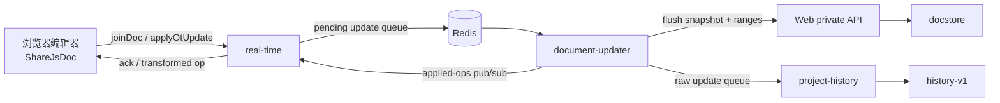

# USTC Overleaf：`olcli`、内部接口与 OT 审阅

本文记录的是中国科学技术大学自建实例
[`https://latex.ustc.edu.cn`](https://latex.ustc.edu.cn)，不是
[`overleaf.com`](https://www.overleaf.com) 官方托管服务。实测时间为
**2026-07-21**，使用 USTC 提供的 `olcli-ustc 0.7.0`。

还要区分两层“官方”：

- [`@aloth/olcli`](https://github.com/aloth/olcli) 是本文所说的**上游版**，
  作者是 Alexander Loth，不是 Overleaf 公司维护的官方 CLI。
- `olcli-ustc` 是 USTC 站点基于该上游版制作的定制构建。

## 实例与客户端

### <a id="upstream-comparison"></a>USTC 构建与上游版

上游 `v0.7.0` 对应 commit
[`6efd99e9c94df600546d3b69f2f119b6638cd00c`](https://github.com/aloth/olcli/tree/6efd99e9c94df600546d3b69f2f119b6638cd00c)。
USTC tarball 与该版本逐文件比较后，核心同步、编译、上传和评论功能相同，
主要差异集中在实例默认值与无头认证：

| 维度 | 上游 `@aloth/olcli 0.7.0` | USTC `olcli-ustc 0.7.0` |
| --- | --- | --- |
| npm 包名 | `@aloth/olcli` | `olcli-ustc` |
| 默认实例 | `https://www.overleaf.com` | `https://latex.ustc.edu.cn` |
| 默认 session cookie | `overleaf_session2` | `overleaf.sid` |
| 浏览器无头认证 | 手工提供 session cookie | 新增 `/agent/setup` 一次性 token 与 `/agent/exchange` |
| 集群会话 | 普通 session cookie | 额外保存并续用 `lb_srv_id` |
| Cookie 更新 | 基础 `Set-Cookie` 处理 | 增加回调持久化、重试与会话 Cookie 刷新 |
| 安装来源 | npm / Homebrew | USTC 站点托管的 tarball |

上游默认 URL 与 cookie 名可在
[`src/config.ts`](https://github.com/aloth/olcli/blob/6efd99e9c94df600546d3b69f2f119b6638cd00c/src/config.ts#L40-L75)
中直接看到；USTC tarball 的对应默认值改成了学校实例，同时新增 token 与
`lb_srv_id` 逻辑。

USTC 下载 URL 是滚动的 `latest`，版本号仍写 `0.7.0`，仅看版本号不足以
识别包内容。2026-07-21 实测快照：

| 文件 | SHA-256 |
| --- | --- |
| `agent/bundle.tar.gz` | `482453e3e664a0ee5edc31576f34ea240a81a37815374dc1352ffa1433061704` |
| `agent/olcli-ustc-latest.tgz` | `be9323fb8718a9a55981a58ec40c93292d17ffc1c5a1a8d42cdabe9ee154c02e` |

> 来源：USTC 的 [Agent 安装页](https://latex.ustc.edu.cn/agent) 与两个滚动
> 下载端点；哈希只标识该次快照，不代表 URL 以后仍返回同一内容。

### Overleaf 官方托管站

上游版可以操作 Overleaf 官方托管站。它默认指向
`https://www.overleaf.com`，认证帮助要求读取 `overleaf_session2` cookie；
README 也把 session cookie 标为同时适用于 `overleaf.com` 与 self-hosted
实例
（[安装与认证](https://github.com/aloth/olcli/blob/6efd99e9c94df600546d3b69f2f119b6638cd00c/README.md#L44-L85)）。

上游版还能通过 `config set-url` 和 `config set-cookie-name` 指向自建实例
（[配置示例](https://github.com/aloth/olcli/blob/6efd99e9c94df600546d3b69f2f119b6638cd00c/README.md#L217-L232)），
但没有 USTC 的一次性 token 交换和 `lb_srv_id` 会话保持。USTC 构建理论上
也能改 URL 与 cookie 名去连其他实例，但 USTC token 流程不可移植，也没有
在 Overleaf 官方站实测；操作官方站优先用上游版。

### <a id="installation"></a>Skill 与 CLI 安装

USTC bundle 本身就是一个 skill 目录，包含：

- `SKILL.md`
- `install.sh`
- `install.ps1`

下载：

```bash
curl -sSL https://latex.ustc.edu.cn/agent/bundle.tar.gz \
  -o olcli-ustc-bundle.tar.gz
tar xzf olcli-ustc-bundle.tar.gz
```

全局使用时，可把三个文件放到：

```text
~/.agents/skills/olcli-ustc/
```

### nvm 与 npm prefix

USTC 原始 `install.sh` 会执行：

```bash
npm config set prefix "$HOME/.local/olcli-ustc"
npm install -g "$TARBALL"
```

第一条会把 `prefix=...` 持久写进用户级 `~/.npmrc`。nvm 要按当前 Node
版本管理自己的全局 prefix，因此加载 nvm 时会报告：

```text
Your user's .npmrc file has a globalconfig and/or a prefix setting,
which are incompatible with nvm.
```

隔离安装本身没有问题，问题是把隔离目录写成 npm 的**永久默认值**。改为只
影响本次命令：

```bash
INSTALL_DIR="$HOME/.local/olcli-ustc"
mkdir -p "$INSTALL_DIR"
npm install -g --prefix "$INSTALL_DIR" \
  https://latex.ustc.edu.cn/agent/olcli-ustc-latest.tgz
```

安装脚本的等价补丁：

```diff
-npm config set prefix "$INSTALL_DIR"
-npm install -g "$TARBALL"
+npm install -g --prefix "$INSTALL_DIR" "$TARBALL"
```

`-g` 表示安装为该 prefix 下的全局包：模块落在
`$INSTALL_DIR/lib/node_modules/`，命令落在 `$INSTALL_DIR/bin/`；它不表示
系统级安装，也不需要 sudo。

把命令目录加入 shell PATH：

```bash
export PATH="$HOME/.local/olcli-ustc/bin:$PATH"
```

长期使用可把同一行写入 `~/.bashrc` / `~/.zshrc`。验证：

```bash
olcli --version
olcli whoami
olcli list
```

### <a id="authentication"></a>无头认证与凭据

USTC 认证流程：

1. 用户先登录 USTC Overleaf，再在同域访问 `/agent/setup`。
2. 页面生成一次性 token。
3. `olcli auth --token <TOKEN>` 把 token 交给 `/agent/exchange`。
4. 服务返回 `overleaf.sid`，以及集群需要时的 `lb_srv_id`。
5. `olcli` 保存 cookie，随后用 `whoami` / `list` 验证。

token 和 session cookie 都是凭据，不应进入命令历史、共享日志或对话正文；
用当前运行环境提供的带外 secret 注入能力传入。

凭据读取顺序沿用上游：

1. `OVERLEAF_SESSION`
2. 当前目录 `.olauth`
3. `~/.config/olcli-nodejs/config.json`

上游 README 对这三个来源有明确说明
（[Configuration](https://github.com/aloth/olcli/blob/6efd99e9c94df600546d3b69f2f119b6638cd00c/README.md#L217-L224)）。

全局配置内含可直接登录的 session cookie。至少保护父目录和文件：

```bash
chmod 700 ~/.config/olcli-nodejs
chmod 600 ~/.config/olcli-nodejs/config.json
```

`conf` 库更新配置时可能原子重建文件并恢复较宽的文件 mode；父目录保持
`700` 才是更稳定的边界。USTC 2026-07-21 快照的 `--verbose` 还会打印
Cookie header，不要把带凭据的 verbose 输出送进共享 CI 日志或 issue。

## 命令行与内部 HTTP

### <a id="cli-surface"></a>CLI 能力与缺口

上游 `v0.7.0` 的完整命令表见
[README](https://github.com/aloth/olcli/blob/6efd99e9c94df600546d3b69f2f119b6638cd00c/README.md#L123-L151)。
USTC 构建保留了这些能力：

| 类别 | 命令 |
| --- | --- |
| 项目发现 | `list`、`info` |
| 本地同步 | `pull`、`push`、`sync` |
| 单文件 | `upload`、`download`、`rename`、`delete` |
| 构建 | `compile`、`pdf`、`output`、`zip` |
| 评论 | `comments list/add/reply/resolve/reopen/delete` |
| 认证与配置 | `auth`、`whoami`、`logout`、`config`、`check` |
| 忽略规则 | `ignored` |

当前公开 CLI 没有：

- 创建项目命令
- 文本级 `edit` / patch 命令
- 创建 Track Changes 修订的命令
- Accept / Reject 修订的命令

上游自己的 Git remote 文档提醒：远端并发编辑可能冲突，push 会上传本地版本
（[Limitations](https://github.com/aloth/olcli/blob/6efd99e9c94df600546d3b69f2f119b6638cd00c/docs/GIT-REMOTE.md#L70-L74)）。

### <a id="project-creation"></a>项目创建

Overleaf Web 应用有登录后可用的内部 endpoint：

```http
POST /project/new
Content-Type: application/json

{"projectName":"<name>","template":"blank"}
```

路由要求登录并套创建项目 rate limit
（[`router.mjs`](https://github.com/overleaf/overleaf/blob/28ad3b03b71cb4311decdcb55c36b33ec10d72db/services/web/app/src/router.mjs#L537-L542)）；
controller 创建 basic/example project 后返回 `project_id`
（[`ProjectController.mjs`](https://github.com/overleaf/overleaf/blob/28ad3b03b71cb4311decdcb55c36b33ec10d72db/services/web/app/src/Features/Project/ProjectController.mjs#L316-L351)）。

可以复用 `olcli-ustc` 保存的 cookie 与 CSRF，再调用编译后的
`OverleafClient.httpRequest()` / `getHeaders()`：

```js
const response = await client.httpRequest(`${baseUrl}/project/new`, {
  method: 'POST',
  headers: client.getHeaders(true),
  body: JSON.stringify({
    projectName: '<name>',
    template: 'blank',
  }),
  expect: 'json',
})

const projectId = response.body.project_id
```

这两个方法在 TypeScript 源码中是 private
（[`client.ts`](https://github.com/aloth/olcli/blob/6efd99e9c94df600546d3b69f2f119b6638cd00c/src/client.ts#L389-L440)），
只是编译后 JavaScript 仍可访问；这不属于稳定的 `olcli` 公共 API。

### 编译与产物下载

`compile`、`pdf`、`output` 都会触发 Overleaf 编译，但拿回来的东西不同
（[`pdf` / `output`](https://github.com/aloth/olcli/blob/6efd99e9c94df600546d3b69f2f119b6638cd00c/src/cli.ts#L632-L722)、
[`compile`](https://github.com/aloth/olcli/blob/6efd99e9c94df600546d3b69f2f119b6638cd00c/src/cli.ts#L818-L837)）：

| 命令 | 行为 |
| --- | --- |
| `olcli compile [project]` | 触发编译，只打印主 PDF URL，不把文件保存到本地 |
| `olcli pdf [project]` | 触发编译并下载主产物 `output.pdf` |
| `olcli output [type]` | 触发编译，列出产物或下载其中一个指定产物 |

#### 编译入口文件

GUI 通常编译项目设置里的主文档（root document），但有一个临时覆盖规则：
当前打开的文件如果不是已设置的主文档、且自身包含有效的
`\documentclass`，本次编译会改用当前文件
（[`useRootDoc`](https://github.com/overleaf/overleaf/blob/28ad3b03b71cb4311decdcb55c36b33ec10d72db/services/web/frontend/js/shared/hooks/use-root-doc.ts#L12-L32)）。
所以“点到哪个文件就编译哪个”只对能独立编译的主文件成立；打开一个只有
章节内容、没有 `\documentclass` 的 `chapter.tex`，仍会编译项目主文档。

GUI 会把选出的 `rootDoc_id` 和 `rootResourcePath` 放进编译请求
（[`compiler.ts`](https://github.com/overleaf/overleaf/blob/28ad3b03b71cb4311decdcb55c36b33ec10d72db/services/web/frontend/js/features/pdf-preview/util/compiler.ts#L132-L150)）。
要持久切换主文档，可在文件树菜单选择 **Set as Main Document**
（[`file-tree-item-menu-items.tsx`](https://github.com/overleaf/overleaf/blob/28ad3b03b71cb4311decdcb55c36b33ec10d72db/services/web/frontend/js/features/file-tree/components/file-tree-item/file-tree-item-menu-items.tsx#L68-L75)）。

当前 `olcli` 没有 `--root-doc` 或文件参数；它发送
`rootDoc_id: null`
（[`compileProject`](https://github.com/aloth/olcli/blob/6efd99e9c94df600546d3b69f2f119b6638cd00c/src/client.ts#L803-L851)）。
服务端随后使用项目已设置的主文档
（[`ensureRootDocumentIsValid`](https://github.com/overleaf/overleaf/blob/28ad3b03b71cb4311decdcb55c36b33ec10d72db/services/web/app/src/Features/Project/ProjectRootDocManager.mjs#L135-L153)）；
设置缺失或失效时，再自动寻找包含 `\documentclass` 的可用文档
（[`setRootDocAutomatically`](https://github.com/overleaf/overleaf/blob/28ad3b03b71cb4311decdcb55c36b33ec10d72db/services/web/app/src/Features/Project/ProjectRootDocManager.mjs#L36-L49)）。
因此要让 `olcli` 编译指定文件，现成做法是先在 GUI 把它设为主文档；若只想
做一次临时覆盖，则需要扩展 `olcli`，让编译请求传入对应 doc ID。

#### PDF 下载时机

GUI 的下载按钮直接使用当前 PDF 预览持有的 `pdfDownloadUrl`；尚未编译时
按钮不可用，点击下载本身不会再触发一次编译
（[`pdf-hybrid-download-button.tsx`](https://github.com/overleaf/overleaf/blob/28ad3b03b71cb4311decdcb55c36b33ec10d72db/services/web/frontend/js/features/pdf-preview/components/pdf-hybrid-download-button.tsx#L11-L56)）。

`olcli pdf` 不同：它先调用 `compileProject()`，再下载该次编译返回的主
`output.pdf`
（[`downloadPdf`](https://github.com/aloth/olcli/blob/6efd99e9c94df600546d3b69f2f119b6638cd00c/src/client.ts#L803-L851)）。
也就是说，它不是单纯下载 GUI 当前已经显示的旧 PDF。请求启用了 incremental
compile，服务端可能复用缓存，但命令语义仍是“先编译，再下载”；本次编译失败
时也不会自动退回上一次成功的 PDF。

#### `output` 产物选择

`output` 不是一组写死的“支持类型”。每次调用都会重新编译，然后读取这次
编译响应里的 `outputFiles`；项目使用的引擎、宏包、参考文献工具和编译是否
成功，都会影响实际列表
（[`compileWithOutputs`](https://github.com/aloth/olcli/blob/6efd99e9c94df600546d3b69f2f119b6638cd00c/src/client.ts#L2167-L2210)）。

先看当前项目真正生成了什么：

```bash
olcli output --list --project "<project>"
```

不传 `type` 也会列出产物。输出中的每一行包含 Overleaf 返回的 `type` 和
远端路径，例如：

```text
pdf          output.pdf
log          output.log
aux          output.aux
bbl          output.bbl
gz           output.synctex.gz
```

这只是示例；`--list` 的结果才是该项目本次编译的权威列表。`.bbl` 是
BibTeX/Biber 等参考文献流程生成的中间产物，只有项目和本次编译实际产生它时，
`olcli output bbl` 才能下载。它常用于 arXiv 投稿，但不是 `output` 唯一能取的
文件：

```bash
olcli output bbl -o main.bbl --project "<project>"
olcli output log -o build.log --project "<project>"
olcli output aux -o main.aux --project "<project>"
```

选择规则是：取第一项 `file.type === type`，或远端路径以 `.<type>` 结尾；
找不到时会提示先运行 `--list`
（[`output` 选择逻辑](https://github.com/aloth/olcli/blob/6efd99e9c94df600546d3b69f2f119b6638cd00c/src/cli.ts#L657-L722)）。
若不传 `-o`，当前实现把远端路径中的 `output.` 去掉作为本地文件名，例如
`output.log` 保存成 `log`；通常显式指定 `-o` 更清楚。下载论文主 PDF 时优先
使用 `olcli pdf -o paper.pdf`，因为 `pdf` 命令会明确优先选择
`output.pdf`，避免误取项目中的其他 PDF。

#### <a id="client-as-library"></a>把 client 当库用直取 build 产物

`compile`、`pdf`、`output` **三个命令都会触发编译**，`output --list` 也不例外。
别人正在 GUI 里点编译时，这些命令会互相打架；此时需要绕开 CLI 直接发 HTTP。

`OverleafClient` 虽然导出，但**必须用 `OverleafClient.fromSessionCookie()` 构造**。
CLI 自己的 `getClient()` 就走这条路
（`dist/cli.js` 的 `getClient`，取 `lb_srv_id` 后调 `fromSessionCookie`）。
直接 `new OverleafClient({ cookies, csrf })` 是**静默失效**的：`getCsrf()` 常返回
空，且缺少 `lb_srv_id` 粘性会话 cookie，服务端对所有请求回**登录页 HTML 且状态码
仍是 200**，看起来像成功。判据是响应体里有 `<title translate="no">登录`，不是状态码。

```js
const P = '<prefix>/lib/node_modules/olcli-ustc/dist';
const { OverleafClient, getBaseUrl, getSessionCookie, getSessionCookieName }
  = await import(`${P}/index.js`);
const { getCookieJar } = await import(`${P}/config.js`);   // 未从包入口导出

const jar = getCookieJar() || {};
const client = await OverleafClient.fromSessionCookie(
  getSessionCookie(), getBaseUrl(), getSessionCookieName(),
  jar['lb_srv_id'] ? { lb_srv_id: jar['lb_srv_id'] } : {});
```

产物只在 **build 作用域**下可取：

| 路径 | 实测结果 |
| --- | --- |
| `/project/<pid>/user/<uid>/build/<buildId>/output/output.log` | 路由存在 |
| `/project/<pid>/build/<buildId>/output/output.log` | 路由存在 |
| `/project/<pid>/output/output.log` | 404，完整 HTML 错误页 |
| `/project/<pid>/output` | 404，完整 HTML 错误页 |

区分「路由不存在」和「build 已失效」看响应体大小：前者是约 11 KB 的 HTML 错误页，
后者是**短纯文本**（实测 146 字节）。`Clear cached files` 会让旧 `buildId` 立即失效。

`buildId` 只出现在 `POST /compile` 的响应里
（`compileWithOutputs` 读 `data.outputFiles` 与 `data.clsiServerId`），
因此**「完全不触发编译就拿到最新日志」做不到**；只能在自己刚编译过、
`buildId` 仍有效的窗口内复用。另注意 `outputFiles[].url` 必须补
`?clsiserverid=<id>` 才能下载，否则一律 404。

两个 `olcli` 未封装、排查时很关键的内部接口：

| 操作 | 请求 | 说明 |
| --- | --- | --- |
| 清缓存 | `DELETE /project/<pid>/output` | 等价 GUI 的 Clear cached files，返回 200 |
| 切 TeX Live 镜像 | `POST /project/<pid>/settings`，body `{"imageName":"texlive-2023"}` | 返回 204 |

可选镜像从项目页的 `ol-allowedImageNames` meta 读取，USTC 实例实测为
`texlive-full`（标称 TeXLive 2025）、`texlive-2024`、`texlive-2023`、
`texlive-2022`、`texlive-2019`。改完镜像必须再 `DELETE /output` 才会重建容器产物，
否则看不出变化。

#### <a id="stale-cache"></a>服务端 latexmk 缓存卡死

编译反复失败、且 `output.stdout` 出现下面这组信号时，是服务端 latexmk 缓存卡住，
不是源文件的问题：

```
Latexmk: Nothing to do for 'main.tex'.
Latexmk: All targets (output.xdv output.pdf) are up-to-date
Collected error summary: xelatex: gave an error in previous invocation of latexmk.
```

latexmk 认为目标已最新而拒绝重跑，同时保留上一轮的错误标记，于是每次都返回
failure。**用 biblatex 时会连带表现为正文引用全变 `?`**：引用要
`xelatex → biber → xelatex → xelatex` 跑满四趟才解析，一趟都不跑则 `.bbl` 被标成
`output.bbl-SAVE-ERROR`，引用退化为 `?`。`-SAVE-ERROR` 后缀是**症状不是病因**，
不必去查 `.bib`。

解法是清缓存后重编。GUI 里是 `Menu → Clear cached files`；`olcli` 没有对应命令，
但内部接口有，且这是命令行唯一的出路：

```js
await client.httpRequest(`${baseUrl}/project/${PID}/output`,
  { method: 'DELETE', headers: client.getHeaders(true) });   // -> 200
```

实测卡死状态下 `DELETE /output` 后立即 `POST /compile`，一次即 `status = success`。
仅把 `incrementalCompilesEnabled` 设为 `false` **不够**，必须真的 DELETE。
另注意 latexmk 卡死时**根本不产出 `output.log`**，所以「先取日志再判断」是走不通的，
必须先清缓存。

这是 latexmk 自身行为、不是 Overleaf 特有：本地也能复现同样三行，同样只能靠
`latexmk -C` 或 `latexmk -g -f` 解开。本地 `latexmkrc` 设 `$pdf_mode = 5` +
`xelatex -no-pdf` **不是诱因**——删掉后仍复现，且 Overleaf 自带配置的目标同样是
`output.xdv output.pdf`，两者并不冲突。

#### <a id="download-flake"></a>`download` 静默失败与回读校验

`olcli download` 连续调用时实测会**静默失败**：不报错、退出码 0，但 `-o` 指定的
文件根本没落盘。若用 `cmp` 做上传后的回读校验，会因取不到文件而报「不一致」，
误判成内容没传上去。循环里要先判存在，失败则退避重试：

```bash
[ -s "$tmp" ] || { sleep 3; continue; }
cmp -s "$tmp" "$f" && echo "  =  $f" || echo "  ≠  $f"
```

同理，`push` 在 `.olcli.json` 缺 `remoteManifest` 时会把**全部**文件当变更重传，
重传本身足以让服务端重走构建。改动少时先逐文件 `download` + `cmp` 比对，
再用 `upload` 定点上传。

### <a id="figures"></a>文件上传与目录路径

`upload <file>` 一次只上传一个文件；多文件同步走 `push` / `sync`。传入相对
路径时，`olcli` 会解析或创建对应的远端子目录
（[上传实现](https://github.com/aloth/olcli/blob/6efd99e9c94df600546d3b69f2f119b6638cd00c/src/client.ts#L1565-L1626)）：

```bash
olcli upload figures/diagram.png <project>
```

LaTeX 中按同一路径引用：

```latex
\usepackage{graphicx}

\begin{figure}[htbp]
  \centering
  \includegraphics[width=0.85\linewidth]{figures/diagram.png}
  \caption{Uploaded through olcli.}
\end{figure}
```

`figures` 只是常见目录名，不是 Overleaf 或 `olcli` 的特殊目录；同样的相对
路径规则也适用于 `chapters/`、`data/` 等目录。USTC 实例中已确认
`figures/` 子目录上传与后续 PDF 编译可用。

#### <a id="sync-root"></a>同步根必须是编译根

Overleaf 的项目根就是编译根，主文档必须在根。若仓库里 LaTeX 工程位于子目录
（如 `paper/`），**必须 `cd paper/` 再 push**。从仓库根推送会把 `paper/` 当普通
子目录原样上传，于是项目里根目录和 `/paper/` **各存一份全量文件**：两份都被
Overleaf 索引，但 `\input{sec-obs}` 只认根目录那份，改错地方就是「改了不生效」。

影子副本会各自漂移，越久越难分辨。判断哪份最新不要读时间戳，用内容哈希反查提交：

```bash
h=$(git hash-object "$remote_copy")
git log --all --format=%h -- "paper/$f" | while read c; do
  [ "$(git rev-parse $c:paper/$f)" = "$h" ] && echo "$c" && break
done
```

`olcli delete <dir>` 可直接删掉整个远端目录，用于清理影子副本。

### <a id="texlive-skew"></a>本地与 Overleaf 的 TeX Live 版本错配

同一份源码本地编译正常、Overleaf 上渲染出乱码时，优先怀疑 TeX Live 版本差异，
而不是源码写错。**决定性判据在 `.aux`**：下载 `output.aux` 与本地 `.aux` 比对同一
标签的写法。实测 `cleveref` 案例：

```
Overleaf : \newlabel{subsec:step1@cref}{{[subsection][1][1]1.1thesubsection\endcsname }...}
本地     : \newlabel{subsec:step1@cref}{{[subsection][1][1]1.1}...}
```

Overleaf 把 `\csname the<counter>\endcsname` 泄漏成字面文本加游离的 `\endcsname`，
于是每个 `\cref` 报一次 `! Extra \endcsname`，正文渲染出 `第 1.1thesubsection 节`。
只影响 `section`／`subsection`，`equation`／`figure`／`table` 正常。

成因：`cleveref` 停更在 2018 年的 v0.21.4；LaTeX2e 2024-11-01 内核起 `\label` 改走
label hook + `\@currentcounter`，内核 firstaid 里那版适配不完整，2025-06-01 之后的
内核才修好（日志可见 `==> First Aid for cleveref.sty applied!`）。

逐镜像实测：

| 镜像 | 内核 | `! Extra \endcsname` |
| --- | --- | --- |
| `texlive-full`（标称 2025） | LaTeX2e 2024-11-01 pl2 | 33 |
| `texlive-2024` | LaTeX2e 2024-11-01 pl2 | 33 |
| `texlive-2023` | LaTeX2e 2023-11-01 pl1 | **0** |

**处置是降到 `texlive-2023`，不是升级。** 标称「TeXLive 2025」的 `texlive-full`
内核仍是 2024-11-01（TL2025 发行时冻结的就是它），**没有任何 Overleaf 镜像能提供
2025-06-01 之后的内核**；本地若是 2025-11-01，那是 `tlmgr` 更新来的，复制不到线上。

> 两条走不通的路：
>
> 1. **把内核 firstaid 的 cleveref 补丁内联进导言区**——实测本地直接编不出来
>    （`Use of \@tempa doesn't match its definition`）。`texmf-dist/tex/latex-dev/firstaid/`
>    下那份与稳定内核实际加载的并非同一版本，手工移植内核内部实现过于脆弱。
> 2. **同一 type 上 `\crefname` 与 `\crefformat` 并用**——`\crefname` 在导言区推迟到
>    `\begin{document}` 才执行，会覆盖 `\crefformat`，哪怕后者写在它后面。中文
>    「第 X 节」需要序号后缀，只有 `\crefformat` 能做；加 `\crefname{subsection}{节}{节}`
>    想兜底，实测反而把引用弄成 `节 1.2`。

## 协作编辑架构

### 实时状态与长期历史

Overleaf 的协作编辑不是单个 REST endpoint，而是两条相关但职责不同的链路：



- **浏览器编辑器**持有当前 snapshot、版本和本地 pending/inflight operation。
  它把编辑送出，等待 ack，同时接收协作者已经变换后的 operation
  （[`share-js-doc.ts`](https://github.com/overleaf/overleaf/blob/28ad3b03b71cb4311decdcb55c36b33ec10d72db/services/web/frontend/js/features/ide-react/editor/share-js-doc.ts#L89-L163)）。
- **real-time** 负责会话、项目/文档权限和 Socket.IO 房间。`joinDoc` 先订阅
  文档的 applied-ops channel，再取 snapshot，避免订阅与返回 snapshot 之间
  漏掉更新
  （[`WebsocketController.js`](https://github.com/overleaf/overleaf/blob/28ad3b03b71cb4311decdcb55c36b33ec10d72db/services/real-time/app/js/WebsocketController.js#L201-L330)）。
  `applyOtUpdate` 补入真实 session 用户与连接 source，然后把 update 放进
  document-updater 的 Redis 队列
  （[`WebsocketController.js`](https://github.com/overleaf/overleaf/blob/28ad3b03b71cb4311decdcb55c36b33ec10d72db/services/real-time/app/js/WebsocketController.js#L558-L675)）。
- **document-updater** 是实时文档状态的权威处理者。它从 Redis 或持久化层
  装载 snapshot，把 operation 变换到当前版本后应用，递增版本，更新评论与
  Track Changes ranges，再把结果写回 Redis
  （[`UpdateManager.js`](https://github.com/overleaf/overleaf/blob/28ad3b03b71cb4311decdcb55c36b33ec10d72db/services/document-updater/app/js/UpdateManager.js#L81-L208)）。
- 应用后的 operation 经 Redis pub/sub 回到 real-time；提交者只收到 ack，
  其他协作者收到完整 operation
  （[`DocumentUpdaterController.js`](https://github.com/overleaf/overleaf/blob/28ad3b03b71cb4311decdcb55c36b33ec10d72db/services/real-time/app/js/DocumentUpdaterController.js#L63-L165)）。
- 当前 snapshot 与 ranges 最终经 Web private API 写入 **docstore**；docstore
  是文本持久化 CRUD 层，不负责并发 OT
  （[`PersistenceManager.js`](https://github.com/overleaf/overleaf/blob/28ad3b03b71cb4311decdcb55c36b33ec10d72db/services/document-updater/app/js/PersistenceManager.js#L121-L185)、
  [`ProjectEntityUpdateHandler.mjs`](https://github.com/overleaf/overleaf/blob/28ad3b03b71cb4311decdcb55c36b33ec10d72db/services/web/app/src/Features/Project/ProjectEntityUpdateHandler.mjs#L146-L181)）。
- 同一批 update 还会进入 **project-history**，被转换、压缩后写入
  **history-v1**，供历史浏览与恢复；它不是实时编辑器当前 snapshot 的来源
  （[`project-history/README.md`](https://github.com/overleaf/overleaf/blob/28ad3b03b71cb4311decdcb55c36b33ec10d72db/services/project-history/README.md#L1-L4)、
  [`UpdateTranslator.js`](https://github.com/overleaf/overleaf/blob/28ad3b03b71cb4311decdcb55c36b33ec10d72db/services/project-history/app/js/UpdateTranslator.js#L19-L130)）。

### <a id="ot-editing"></a>OT 编辑

OT（Operational Transformation）的对象不是“新文件内容”，而是**相对某个
文档版本的操作**。例如“在位置 `p` 插入一段文字”或“删除当前位置上这段
确定的文字”。每次 update 都带基准版本 `v`：

1. `v` 等于当前服务端版本时直接应用。
2. `v` 落后时，服务端取出 `v` 到当前版本之间的 operation。
3. 新 operation 逐个与这些并发 operation 做 transform/rebase。
4. 变换后的 operation 应用到当前 snapshot，文档版本加一。
5. 提交者收到 ack，其他协作者收到变换后的 operation。

旧 ShareJS 模型的变换、重复提交检测、应用和版本递增都集中在
[`model.js`](https://github.com/overleaf/overleaf/blob/28ad3b03b71cb4311decdcb55c36b33ec10d72db/services/document-updater/app/js/sharejs/server/model.js#L130-L260)。
OT 的价值因此不是“能远程插入文字”，而是让两个客户端基于旧 snapshot
同时编辑时，尽量保留双方操作意图，而不是简单后写覆盖先写。

`olcli` 已有建立 project socket、`joinDoc` 和解析两类 snapshot 的内部实现
（[`client.ts`](https://github.com/aloth/olcli/blob/6efd99e9c94df600546d3b69f2f119b6638cd00c/src/client.ts#L1134-L1178)），
但没有公开 `edit` 命令。

#### `sharejs-text-ot`

USTC 2026-07 实例的受控项目返回 `sharejs-text-ot`。一次普通插入：

```js
await client.socketRpc(session, 'applyOtUpdate', [
  docId,
  {
    doc: docId,
    v: joined.version,
    op: [{ p: position, i: insertedText }],
  },
])
```

删除使用 `{ p, d: deletedText }`。评论 range 会跟随这些 operation 变换；
普通 OT 编辑则直接改变正文，不会产生 Accept/Reject 项。

#### `history-ot`

`history-ot` 把正文、评论和 tracked ranges 放进同一 `StringFileData`
snapshot，文本修改使用覆盖整个输入 snapshot 的 scan operation：

```js
{
  doc: docId,
  v: joined.version,
  op: [{
    textOperation: [
      retainBefore,
      insertedText,
      retainAfter,
    ],
  }],
}
```

删除由负数表示。版本落后时，document-updater 使用
`EditOperationTransformer` 逐个 rebase 后再应用
（[`HistoryOTUpdateManager.js`](https://github.com/overleaf/overleaf/blob/28ad3b03b71cb4311decdcb55c36b33ec10d72db/services/document-updater/app/js/HistoryOTUpdateManager.js#L45-L116)）。

### 整份内容更新与实时 OT

`olcli upload`、`push`、`sync` 把本地文件的**完整目标内容**交给 Web upload
接口，但已有文本 doc 并不是直接覆盖 docstore：

1. upload endpoint 以 `replace=true` 调用 `FileSystemImportManager.addEntity`；
   文本 doc 分支随后走 `upsertDoc`
   （[`ProjectUploadController.mjs`](https://github.com/overleaf/overleaf/blob/28ad3b03b71cb4311decdcb55c36b33ec10d72db/services/web/app/src/Features/Uploads/ProjectUploadController.mjs#L84-L142)、
   [`FileSystemImportManager.mjs`](https://github.com/overleaf/overleaf/blob/28ad3b03b71cb4311decdcb55c36b33ec10d72db/services/web/app/src/Features/Uploads/FileSystemImportManager.mjs#L22-L42)）。
2. 同名 doc 已存在时，Web 调 document-updater 的 `setDocument`
   （[`ProjectEntityUpdateHandler.mjs`](https://github.com/overleaf/overleaf/blob/28ad3b03b71cb4311decdcb55c36b33ec10d72db/services/web/app/src/Features/Project/ProjectEntityUpdateHandler.mjs#L386-L492)）。
3. document-updater 用当前 snapshot 与目标全文计算 diff，再把 diff 作为
   ShareJS 或 history-ot operation 应用
   （[`DocumentManager.js`](https://github.com/overleaf/overleaf/blob/28ad3b03b71cb4311decdcb55c36b33ec10d72db/services/document-updater/app/js/DocumentManager.js#L145-L230)）。

所以整份内容更新仍会经过 OT、range 与 history 处理；“上传必然丢评论锚点”
并不成立。它和实时编辑器的差别是：上传只表达“最终整份内容应该长这样”，
不携带本地编辑时的基准版本、pending/inflight 状态与每一步用户意图。如果
本地副本已经落后，服务器会把**当前远端内容**改造成这个旧目标，协作者刚写
的新内容可能在语义上被删除。实时 OT 客户端则持续消费远端 operation，并把
本地 operation rebase 后再提交。

## 评论与修订

### <a id="comments"></a>评论线程与文本锚点

评论由两部分组成：消息线程通过 HTTP 保存，文本锚点作为 OT/range 附着在
文档位置上。`olcli comments add` 先用 `joinDoc` 取得文档内容与版本，再创建
thread message，最后提交锚点 operation
（[`addComment`](https://github.com/aloth/olcli/blob/6efd99e9c94df600546d3b69f2f119b6638cd00c/src/client.ts#L2095-L2127)）。

```bash
olcli comments add main.tex "Please clarify this paragraph" \
  --text "selected source text"
olcli comments list --status open --context 2
olcli comments reply <thread-id> "Reply body"
olcli comments resolve <thread-id>
olcli comments reopen <thread-id>
olcli comments delete <thread-id>
```

Open 与 Resolved 不是两类评论：

1. 新评论创建时是 Open。
2. `comments resolve` 只把同一 thread 改为 Resolved。
3. `reopen` 可把它恢复为 Open。

Resolve 只表示讨论结束，不修改正文，也不等于接受 Track Changes。

### <a id="tracked-changes"></a>普通编辑与 Track Changes

Review 面板里的对象要分开看：

| 对象 | 正文是否变化 | 面板动作 |
| --- | --- | --- |
| 评论 | 不因评论本身变化 | Reply / Resolve / Reopen |
| 普通 OT 编辑 | 直接变化 | 没有 Accept / Reject |
| Track Changes 修订 | 以待审阅修改显示 | Accept / Reject |

旧 `sharejs-text-ot` 的修订仍发送普通 `{p,i}` / `{p,d}`，区别是 update 带
`meta.tc`：

```js
{
  doc: docId,
  v: joined.version,
  op: [{ p: position, i: insertedText }],
  meta: {
    tc: '<18-hex-id-seed>',
  },
}
```

Overleaf 前端正是这样给 update 增加 `meta.tc`
（[`share-js-doc.ts`](https://github.com/overleaf/overleaf/blob/28ad3b03b71cb4311decdcb55c36b33ec10d72db/services/web/frontend/js/features/ide-react/editor/share-js-doc.ts#L89-L107)）。
real-time 看到 `meta.tc` 时要求 review 权限而不是普通 edit 权限
（[`WebsocketController.js`](https://github.com/overleaf/overleaf/blob/28ad3b03b71cb4311decdcb55c36b33ec10d72db/services/real-time/app/js/WebsocketController.js#L654-L675)）。
document-updater 再启用 ranges tracker，用 seed 生成 change ID
（[`RangesManager.js`](https://github.com/overleaf/overleaf/blob/28ad3b03b71cb4311decdcb55c36b33ec10d72db/services/document-updater/app/js/RangesManager.js#L45-L69)）。

seed 是 Mongo ObjectId 风格的前 18 个十六进制字符，最后 6 位留给递增计数
（[`ranges-tracker`](https://github.com/overleaf/overleaf/blob/28ad3b03b71cb4311decdcb55c36b33ec10d72db/libraries/ranges-tracker/index.cjs#L73-L98)）。
在 USTC 实例中，带 `meta.tc` 的插入会进入 `ranges.changes` 并显示为
Accept/Reject 项；这才是“待审阅修改”。

`history-ot` 不再把 tracking 只放在 update metadata 上，而是把 insertion /
retention 的 tracking 属性写进 `TextOperation`，与正文和评论 range 一起
transform。

### Accept 与 Reject

旧 `sharejs-text-ot` 的 Accept 经 Web 转发到 document-updater：

```http
POST /project/<project-id>/doc/<doc-id>/changes/accept
Content-Type: application/json

{"change_ids":["<change-id>"]}
```

前端调用见
[`ranges-context.tsx`](https://github.com/overleaf/overleaf/blob/28ad3b03b71cb4311decdcb55c36b33ec10d72db/services/web/frontend/js/features/review-panel/context/ranges-context.tsx#L341-L367)；
document-updater 提供批量 Accept / Reject endpoint
（[`app.js`](https://github.com/overleaf/overleaf/blob/28ad3b03b71cb4311decdcb55c36b33ec10d72db/services/document-updater/app.js#L172-L202)）。
Reject 会生成撤销候选修改的编辑 operation。

`history-ot` 的 Accept/Reject 都构造 `TextOperation`：接受 insertion 会清掉
tracking，接受 deletion 会真正删除；拒绝 insertion 会删除候选文字，拒绝
deletion 会清掉 deletion tracking
（[history-ot 分支](https://github.com/overleaf/overleaf/blob/28ad3b03b71cb4311decdcb55c36b33ec10d72db/services/web/frontend/js/features/review-panel/context/ranges-context.tsx#L219-L339)）。

接受 insertion 后 Review item 消失、文字保留为普通正文；拒绝 insertion 后
Review item 与候选文字都消失。它们都不同于 `comments resolve`。

## <a id="maintenance"></a>内部接口、并发与凭据

### 公共 CLI 与内部接口

稳定程度要分层：

- `olcli` 命令表是客户端公开界面。
- 编译后可访问的 `OverleafClient` private 方法不是公共库 API。
- USTC `/agent/*`、Overleaf `/project/new`、Socket.IO event、Accept/Reject
  endpoint 都是 Web 应用内部接口，不是官方承诺兼容性的公开 REST API。

升级 USTC Overleaf 或替换 `olcli` 包后，应重新核对 route、CSRF、cookie、
Socket.IO 协议、OT type 和响应格式。

### OT 客户端的并发状态

一次 `joinDoc` 后立即提交一个 operation，适合无并发的受控操作，不等于完整
协作客户端。可靠实现至少还要：

- 维护本地 snapshot 与版本；
- 区分 pending 与 inflight operation；
- 等待 ack 后再推进本地状态；
- 持续接收并应用远端 operation；
- 把本地 pending/inflight 与远端 operation 做 transform；
- 处理 out-of-order message、断线追赶和过旧版本；
- 用 source / `dupIfSource` 防止重试造成重复提交。

Overleaf 浏览器客户端对这些状态有明确实现
（[`share-js-doc.ts`](https://github.com/overleaf/overleaf/blob/28ad3b03b71cb4311decdcb55c36b33ec10d72db/services/web/frontend/js/features/ide-react/editor/share-js-doc.ts#L117-L260)）。
收到版本、权限或过旧 operation 错误后应重新同步，不要静默重放旧位置。

### 滚动包与凭据保护

- USTC tarball 使用滚动 `latest`；升级检查沿用
  [USTC 构建与上游版](#upstream-comparison)中的 SHA-256 与上游 diff，
  不能只看版本号。
- token、session cookie、`.olauth`、全局 config 与 verbose 日志按
  [无头认证与凭据](#authentication)中的边界处理。
- 内部接口脚本应把项目 ID、doc ID 和凭据留在运行环境，不写进 skill 正文。
