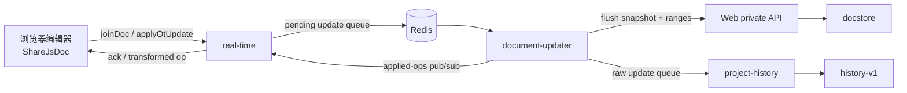

# USTC Overleaf：`olcli`、内部接口与 OT 审阅

本文记录的是中国科学技术大学自建实例
[`https://latex.ustc.edu.cn`](https://latex.ustc.edu.cn)，不是
[`overleaf.com`](https://www.overleaf.com) 官方托管服务。实测时间为
**2026-07-21**，使用 USTC 提供的 `olcli-ustc 0.7.0`。

还要区分两层“官方”：

- [`@aloth/olcli`](https://github.com/aloth/olcli) 是本文所说的**上游版**，
  作者是 Alexander Loth，不是 Overleaf 公司维护的官方 CLI。
- `olcli-ustc` 是 USTC 站点基于该上游版制作的定制构建。

## 实例与客户端

### <a id="upstream-comparison"></a>USTC 构建与上游版

上游 `v0.7.0` 对应 commit
[`6efd99e9c94df600546d3b69f2f119b6638cd00c`](https://github.com/aloth/olcli/tree/6efd99e9c94df600546d3b69f2f119b6638cd00c)。
USTC tarball 与该版本逐文件比较后，核心同步、编译、上传和评论功能相同，
主要差异集中在实例默认值与无头认证：

| 维度 | 上游 `@aloth/olcli 0.7.0` | USTC `olcli-ustc 0.7.0` |
| --- | --- | --- |
| npm 包名 | `@aloth/olcli` | `olcli-ustc` |
| 默认实例 | `https://www.overleaf.com` | `https://latex.ustc.edu.cn` |
| 默认 session cookie | `overleaf_session2` | `overleaf.sid` |
| 浏览器无头认证 | 手工提供 session cookie | 新增 `/agent/setup` 一次性 token 与 `/agent/exchange` |
| 集群会话 | 普通 session cookie | 额外保存并续用 `lb_srv_id` |
| Cookie 更新 | 基础 `Set-Cookie` 处理 | 增加回调持久化、重试与会话 Cookie 刷新 |
| 安装来源 | npm / Homebrew | USTC 站点托管的 tarball |

上游默认 URL 与 cookie 名可在
[`src/config.ts`](https://github.com/aloth/olcli/blob/6efd99e9c94df600546d3b69f2f119b6638cd00c/src/config.ts#L40-L75)
中直接看到；USTC tarball 的对应默认值改成了学校实例，同时新增 token 与
`lb_srv_id` 逻辑。

USTC 下载 URL 是滚动的 `latest`，版本号仍写 `0.7.0`，仅看版本号不足以
识别包内容。2026-07-21 实测快照：

| 文件 | SHA-256 |
| --- | --- |
| `agent/bundle.tar.gz` | `482453e3e664a0ee5edc31576f34ea240a81a37815374dc1352ffa1433061704` |
| `agent/olcli-ustc-latest.tgz` | `be9323fb8718a9a55981a58ec40c93292d17ffc1c5a1a8d42cdabe9ee154c02e` |

> 来源：USTC 的 [Agent 安装页](https://latex.ustc.edu.cn/agent) 与两个滚动
> 下载端点；哈希只标识该次快照，不代表 URL 以后仍返回同一内容。

### Overleaf 官方托管站

上游版可以操作 Overleaf 官方托管站。它默认指向
`https://www.overleaf.com`，认证帮助要求读取 `overleaf_session2` cookie；
README 也把 session cookie 标为同时适用于 `overleaf.com` 与 self-hosted
实例
（[安装与认证](https://github.com/aloth/olcli/blob/6efd99e9c94df600546d3b69f2f119b6638cd00c/README.md#L44-L85)）。

上游版还能通过 `config set-url` 和 `config set-cookie-name` 指向自建实例
（[配置示例](https://github.com/aloth/olcli/blob/6efd99e9c94df600546d3b69f2f119b6638cd00c/README.md#L217-L232)），
但没有 USTC 的一次性 token 交换和 `lb_srv_id` 会话保持。USTC 构建理论上
也能改 URL 与 cookie 名去连其他实例，但 USTC token 流程不可移植，也没有
在 Overleaf 官方站实测；操作官方站优先用上游版。

### <a id="installation"></a>Skill 与 CLI 安装

USTC bundle 本身就是一个 skill 目录，包含：

- `SKILL.md`
- `install.sh`
- `install.ps1`

下载：

```bash
curl -sSL https://latex.ustc.edu.cn/agent/bundle.tar.gz \
  -o olcli-ustc-bundle.tar.gz
tar xzf olcli-ustc-bundle.tar.gz
```

全局使用时，可把三个文件放到：

```text
~/.agents/skills/olcli-ustc/
```

### nvm 与 npm prefix

USTC 原始 `install.sh` 会执行：

```bash
npm config set prefix "$HOME/.local/olcli-ustc"
npm install -g "$TARBALL"
```

第一条会把 `prefix=...` 持久写进用户级 `~/.npmrc`。nvm 要按当前 Node
版本管理自己的全局 prefix，因此加载 nvm 时会报告：

```text
Your user's .npmrc file has a globalconfig and/or a prefix setting,
which are incompatible with nvm.
```

隔离安装本身没有问题，问题是把隔离目录写成 npm 的**永久默认值**。改为只
影响本次命令：

```bash
INSTALL_DIR="$HOME/.local/olcli-ustc"
mkdir -p "$INSTALL_DIR"
npm install -g --prefix "$INSTALL_DIR" \
  https://latex.ustc.edu.cn/agent/olcli-ustc-latest.tgz
```

安装脚本的等价补丁：

```diff
-npm config set prefix "$INSTALL_DIR"
-npm install -g "$TARBALL"
+npm install -g --prefix "$INSTALL_DIR" "$TARBALL"
```

`-g` 表示安装为该 prefix 下的全局包：模块落在
`$INSTALL_DIR/lib/node_modules/`，命令落在 `$INSTALL_DIR/bin/`；它不表示
系统级安装，也不需要 sudo。

把命令目录加入 shell PATH：

```bash
export PATH="$HOME/.local/olcli-ustc/bin:$PATH"
```

长期使用可把同一行写入 `~/.bashrc` / `~/.zshrc`。验证：

```bash
olcli --version
olcli whoami
olcli list
```

### <a id="authentication"></a>无头认证与凭据

USTC 认证流程：

1. 用户先登录 USTC Overleaf，再在同域访问 `/agent/setup`。
2. 页面生成一次性 token。
3. `olcli auth --token <TOKEN>` 把 token 交给 `/agent/exchange`。
4. 服务返回 `overleaf.sid`，以及集群需要时的 `lb_srv_id`。
5. `olcli` 保存 cookie，随后用 `whoami` / `list` 验证。

token 和 session cookie 都是凭据，不应进入命令历史、共享日志或对话正文；
用当前运行环境提供的带外 secret 注入能力传入。

凭据读取顺序沿用上游：

1. `OVERLEAF_SESSION`
2. 当前目录 `.olauth`
3. `~/.config/olcli-nodejs/config.json`

上游 README 对这三个来源有明确说明
（[Configuration](https://github.com/aloth/olcli/blob/6efd99e9c94df600546d3b69f2f119b6638cd00c/README.md#L217-L224)）。

全局配置内含可直接登录的 session cookie。至少保护父目录和文件：

```bash
chmod 700 ~/.config/olcli-nodejs
chmod 600 ~/.config/olcli-nodejs/config.json
```

`conf` 库更新配置时可能原子重建文件并恢复较宽的文件 mode；父目录保持
`700` 才是更稳定的边界。USTC 2026-07-21 快照的 `--verbose` 还会打印
Cookie header，不要把带凭据的 verbose 输出送进共享 CI 日志或 issue。

## 命令行与内部 HTTP

### <a id="cli-surface"></a>CLI 能力与缺口

上游 `v0.7.0` 的完整命令表见
[README](https://github.com/aloth/olcli/blob/6efd99e9c94df600546d3b69f2f119b6638cd00c/README.md#L123-L151)。
USTC 构建保留了这些能力：

| 类别 | 命令 |
| --- | --- |
| 项目发现 | `list`、`info` |
| 本地同步 | `pull`、`push`、`sync` |
| 单文件 | `upload`、`download`、`rename`、`delete` |
| 构建 | `compile`、`pdf`、`output`、`zip` |
| 评论 | `comments list/add/reply/resolve/reopen/delete` |
| 认证与配置 | `auth`、`whoami`、`logout`、`config`、`check` |
| 忽略规则 | `ignored` |

当前公开 CLI 没有：

- 创建项目命令
- 文本级 `edit` / patch 命令
- 创建 Track Changes 修订的命令
- Accept / Reject 修订的命令

`upload <file>` 一次只接收一个文件；批量修改走 `push` / `sync`。上游自己的
Git remote 文档提醒：远端并发编辑可能冲突，push 会上传本地版本
（[Limitations](https://github.com/aloth/olcli/blob/6efd99e9c94df600546d3b69f2f119b6638cd00c/docs/GIT-REMOTE.md#L70-L74)）。

### <a id="project-creation"></a>项目创建

Overleaf Web 应用有登录后可用的内部 endpoint：

```http
POST /project/new
Content-Type: application/json

{"projectName":"<name>","template":"blank"}
```

路由要求登录并套创建项目 rate limit
（[`router.mjs`](https://github.com/overleaf/overleaf/blob/28ad3b03b71cb4311decdcb55c36b33ec10d72db/services/web/app/src/router.mjs#L537-L542)）；
controller 创建 basic/example project 后返回 `project_id`
（[`ProjectController.mjs`](https://github.com/overleaf/overleaf/blob/28ad3b03b71cb4311decdcb55c36b33ec10d72db/services/web/app/src/Features/Project/ProjectController.mjs#L316-L351)）。

可以复用 `olcli-ustc` 保存的 cookie 与 CSRF，再调用编译后的
`OverleafClient.httpRequest()` / `getHeaders()`：

```js
const response = await client.httpRequest(`${baseUrl}/project/new`, {
  method: 'POST',
  headers: client.getHeaders(true),
  body: JSON.stringify({
    projectName: '<name>',
    template: 'blank',
  }),
  expect: 'json',
})

const projectId = response.body.project_id
```

这两个方法在 TypeScript 源码中是 private
（[`client.ts`](https://github.com/aloth/olcli/blob/6efd99e9c94df600546d3b69f2f119b6638cd00c/src/client.ts#L389-L440)），
只是编译后 JavaScript 仍可访问；这不属于稳定的 `olcli` 公共 API。

### <a id="figures"></a>构建产物与图片

`output <type>` 不是只支持 `bbl`：它先编译，再从项目实际返回的输出中按
type 或扩展名匹配。没有 bibliography 的项目本来就不会出现 `.bbl`。

上传相对路径会保留目录结构
（[上传实现](https://github.com/aloth/olcli/blob/6efd99e9c94df600546d3b69f2f119b6638cd00c/src/client.ts#L1565-L1626)）：

```bash
olcli upload figures/diagram.png <project>
```

LaTeX 中按同一路径引用：

```latex
\usepackage{graphicx}

\begin{figure}[htbp]
  \centering
  \includegraphics[width=0.85\linewidth]{figures/diagram.png}
  \caption{Uploaded through olcli.}
\end{figure}
```

USTC 实例中已确认 `figures/` 子目录上传与后续 PDF 编译可用。

## 协作编辑架构

### 实时状态与长期历史

Overleaf 的协作编辑不是单个 REST endpoint，而是两条相关但职责不同的链路：



- **浏览器编辑器**持有当前 snapshot、版本和本地 pending/inflight operation。
  它把编辑送出，等待 ack，同时接收协作者已经变换后的 operation
  （[`share-js-doc.ts`](https://github.com/overleaf/overleaf/blob/28ad3b03b71cb4311decdcb55c36b33ec10d72db/services/web/frontend/js/features/ide-react/editor/share-js-doc.ts#L89-L163)）。
- **real-time** 负责会话、项目/文档权限和 Socket.IO 房间。`joinDoc` 先订阅
  文档的 applied-ops channel，再取 snapshot，避免订阅与返回 snapshot 之间
  漏掉更新
  （[`WebsocketController.js`](https://github.com/overleaf/overleaf/blob/28ad3b03b71cb4311decdcb55c36b33ec10d72db/services/real-time/app/js/WebsocketController.js#L201-L330)）。
  `applyOtUpdate` 补入真实 session 用户与连接 source，然后把 update 放进
  document-updater 的 Redis 队列
  （[`WebsocketController.js`](https://github.com/overleaf/overleaf/blob/28ad3b03b71cb4311decdcb55c36b33ec10d72db/services/real-time/app/js/WebsocketController.js#L558-L675)）。
- **document-updater** 是实时文档状态的权威处理者。它从 Redis 或持久化层
  装载 snapshot，把 operation 变换到当前版本后应用，递增版本，更新评论与
  Track Changes ranges，再把结果写回 Redis
  （[`UpdateManager.js`](https://github.com/overleaf/overleaf/blob/28ad3b03b71cb4311decdcb55c36b33ec10d72db/services/document-updater/app/js/UpdateManager.js#L81-L208)）。
- 应用后的 operation 经 Redis pub/sub 回到 real-time；提交者只收到 ack，
  其他协作者收到完整 operation
  （[`DocumentUpdaterController.js`](https://github.com/overleaf/overleaf/blob/28ad3b03b71cb4311decdcb55c36b33ec10d72db/services/real-time/app/js/DocumentUpdaterController.js#L63-L165)）。
- 当前 snapshot 与 ranges 最终经 Web private API 写入 **docstore**；docstore
  是文本持久化 CRUD 层，不负责并发 OT
  （[`PersistenceManager.js`](https://github.com/overleaf/overleaf/blob/28ad3b03b71cb4311decdcb55c36b33ec10d72db/services/document-updater/app/js/PersistenceManager.js#L121-L185)、
  [`ProjectEntityUpdateHandler.mjs`](https://github.com/overleaf/overleaf/blob/28ad3b03b71cb4311decdcb55c36b33ec10d72db/services/web/app/src/Features/Project/ProjectEntityUpdateHandler.mjs#L146-L181)）。
- 同一批 update 还会进入 **project-history**，被转换、压缩后写入
  **history-v1**，供历史浏览与恢复；它不是实时编辑器当前 snapshot 的来源
  （[`project-history/README.md`](https://github.com/overleaf/overleaf/blob/28ad3b03b71cb4311decdcb55c36b33ec10d72db/services/project-history/README.md#L1-L4)、
  [`UpdateTranslator.js`](https://github.com/overleaf/overleaf/blob/28ad3b03b71cb4311decdcb55c36b33ec10d72db/services/project-history/app/js/UpdateTranslator.js#L19-L130)）。

### <a id="ot-editing"></a>OT 编辑

OT（Operational Transformation）的对象不是“新文件内容”，而是**相对某个
文档版本的操作**。例如“在位置 `p` 插入一段文字”或“删除当前位置上这段
确定的文字”。每次 update 都带基准版本 `v`：

1. `v` 等于当前服务端版本时直接应用。
2. `v` 落后时，服务端取出 `v` 到当前版本之间的 operation。
3. 新 operation 逐个与这些并发 operation 做 transform/rebase。
4. 变换后的 operation 应用到当前 snapshot，文档版本加一。
5. 提交者收到 ack，其他协作者收到变换后的 operation。

旧 ShareJS 模型的变换、重复提交检测、应用和版本递增都集中在
[`model.js`](https://github.com/overleaf/overleaf/blob/28ad3b03b71cb4311decdcb55c36b33ec10d72db/services/document-updater/app/js/sharejs/server/model.js#L130-L260)。
OT 的价值因此不是“能远程插入文字”，而是让两个客户端基于旧 snapshot
同时编辑时，尽量保留双方操作意图，而不是简单后写覆盖先写。

`olcli` 已有建立 project socket、`joinDoc` 和解析两类 snapshot 的内部实现
（[`client.ts`](https://github.com/aloth/olcli/blob/6efd99e9c94df600546d3b69f2f119b6638cd00c/src/client.ts#L1134-L1178)），
但没有公开 `edit` 命令。

#### `sharejs-text-ot`

USTC 2026-07 实例的受控项目返回 `sharejs-text-ot`。一次普通插入：

```js
await client.socketRpc(session, 'applyOtUpdate', [
  docId,
  {
    doc: docId,
    v: joined.version,
    op: [{ p: position, i: insertedText }],
  },
])
```

删除使用 `{ p, d: deletedText }`。评论 range 会跟随这些 operation 变换；
普通 OT 编辑则直接改变正文，不会产生 Accept/Reject 项。

#### `history-ot`

`history-ot` 把正文、评论和 tracked ranges 放进同一 `StringFileData`
snapshot，文本修改使用覆盖整个输入 snapshot 的 scan operation：

```js
{
  doc: docId,
  v: joined.version,
  op: [{
    textOperation: [
      retainBefore,
      insertedText,
      retainAfter,
    ],
  }],
}
```

删除由负数表示。版本落后时，document-updater 使用
`EditOperationTransformer` 逐个 rebase 后再应用
（[`HistoryOTUpdateManager.js`](https://github.com/overleaf/overleaf/blob/28ad3b03b71cb4311decdcb55c36b33ec10d72db/services/document-updater/app/js/HistoryOTUpdateManager.js#L45-L116)）。

### 整份内容更新与实时 OT

`olcli upload`、`push`、`sync` 把本地文件的**完整目标内容**交给 Web upload
接口，但已有文本 doc 并不是直接覆盖 docstore：

1. upload endpoint 以 `replace=true` 调用 `FileSystemImportManager.addEntity`；
   文本 doc 分支随后走 `upsertDoc`
   （[`ProjectUploadController.mjs`](https://github.com/overleaf/overleaf/blob/28ad3b03b71cb4311decdcb55c36b33ec10d72db/services/web/app/src/Features/Uploads/ProjectUploadController.mjs#L84-L142)、
   [`FileSystemImportManager.mjs`](https://github.com/overleaf/overleaf/blob/28ad3b03b71cb4311decdcb55c36b33ec10d72db/services/web/app/src/Features/Uploads/FileSystemImportManager.mjs#L22-L42)）。
2. 同名 doc 已存在时，Web 调 document-updater 的 `setDocument`
   （[`ProjectEntityUpdateHandler.mjs`](https://github.com/overleaf/overleaf/blob/28ad3b03b71cb4311decdcb55c36b33ec10d72db/services/web/app/src/Features/Project/ProjectEntityUpdateHandler.mjs#L386-L492)）。
3. document-updater 用当前 snapshot 与目标全文计算 diff，再把 diff 作为
   ShareJS 或 history-ot operation 应用
   （[`DocumentManager.js`](https://github.com/overleaf/overleaf/blob/28ad3b03b71cb4311decdcb55c36b33ec10d72db/services/document-updater/app/js/DocumentManager.js#L145-L230)）。

所以整份内容更新仍会经过 OT、range 与 history 处理；“上传必然丢评论锚点”
并不成立。它和实时编辑器的差别是：上传只表达“最终整份内容应该长这样”，
不携带本地编辑时的基准版本、pending/inflight 状态与每一步用户意图。如果
本地副本已经落后，服务器会把**当前远端内容**改造成这个旧目标，协作者刚写
的新内容可能在语义上被删除。实时 OT 客户端则持续消费远端 operation，并把
本地 operation rebase 后再提交。

## 评论与修订

### <a id="comments"></a>评论线程与文本锚点

评论由两部分组成：消息线程通过 HTTP 保存，文本锚点作为 OT/range 附着在
文档位置上。`olcli comments add` 先用 `joinDoc` 取得文档内容与版本，再创建
thread message，最后提交锚点 operation
（[`addComment`](https://github.com/aloth/olcli/blob/6efd99e9c94df600546d3b69f2f119b6638cd00c/src/client.ts#L2095-L2127)）。

```bash
olcli comments add main.tex "Please clarify this paragraph" \
  --text "selected source text"
olcli comments list --status open --context 2
olcli comments reply <thread-id> "Reply body"
olcli comments resolve <thread-id>
olcli comments reopen <thread-id>
olcli comments delete <thread-id>
```

Open 与 Resolved 不是两类评论：

1. 新评论创建时是 Open。
2. `comments resolve` 只把同一 thread 改为 Resolved。
3. `reopen` 可把它恢复为 Open。

Resolve 只表示讨论结束，不修改正文，也不等于接受 Track Changes。

### <a id="tracked-changes"></a>普通编辑与 Track Changes

Review 面板里的对象要分开看：

| 对象 | 正文是否变化 | 面板动作 |
| --- | --- | --- |
| 评论 | 不因评论本身变化 | Reply / Resolve / Reopen |
| 普通 OT 编辑 | 直接变化 | 没有 Accept / Reject |
| Track Changes 修订 | 以待审阅修改显示 | Accept / Reject |

旧 `sharejs-text-ot` 的修订仍发送普通 `{p,i}` / `{p,d}`，区别是 update 带
`meta.tc`：

```js
{
  doc: docId,
  v: joined.version,
  op: [{ p: position, i: insertedText }],
  meta: {
    tc: '<18-hex-id-seed>',
  },
}
```

Overleaf 前端正是这样给 update 增加 `meta.tc`
（[`share-js-doc.ts`](https://github.com/overleaf/overleaf/blob/28ad3b03b71cb4311decdcb55c36b33ec10d72db/services/web/frontend/js/features/ide-react/editor/share-js-doc.ts#L89-L107)）。
real-time 看到 `meta.tc` 时要求 review 权限而不是普通 edit 权限
（[`WebsocketController.js`](https://github.com/overleaf/overleaf/blob/28ad3b03b71cb4311decdcb55c36b33ec10d72db/services/real-time/app/js/WebsocketController.js#L654-L675)）。
document-updater 再启用 ranges tracker，用 seed 生成 change ID
（[`RangesManager.js`](https://github.com/overleaf/overleaf/blob/28ad3b03b71cb4311decdcb55c36b33ec10d72db/services/document-updater/app/js/RangesManager.js#L45-L69)）。

seed 是 Mongo ObjectId 风格的前 18 个十六进制字符，最后 6 位留给递增计数
（[`ranges-tracker`](https://github.com/overleaf/overleaf/blob/28ad3b03b71cb4311decdcb55c36b33ec10d72db/libraries/ranges-tracker/index.cjs#L73-L98)）。
在 USTC 实例中，带 `meta.tc` 的插入会进入 `ranges.changes` 并显示为
Accept/Reject 项；这才是“待审阅修改”。

`history-ot` 不再把 tracking 只放在 update metadata 上，而是把 insertion /
retention 的 tracking 属性写进 `TextOperation`，与正文和评论 range 一起
transform。

### Accept 与 Reject

旧 `sharejs-text-ot` 的 Accept 经 Web 转发到 document-updater：

```http
POST /project/<project-id>/doc/<doc-id>/changes/accept
Content-Type: application/json

{"change_ids":["<change-id>"]}
```

前端调用见
[`ranges-context.tsx`](https://github.com/overleaf/overleaf/blob/28ad3b03b71cb4311decdcb55c36b33ec10d72db/services/web/frontend/js/features/review-panel/context/ranges-context.tsx#L341-L367)；
document-updater 提供批量 Accept / Reject endpoint
（[`app.js`](https://github.com/overleaf/overleaf/blob/28ad3b03b71cb4311decdcb55c36b33ec10d72db/services/document-updater/app.js#L172-L202)）。
Reject 会生成撤销候选修改的编辑 operation。

`history-ot` 的 Accept/Reject 都构造 `TextOperation`：接受 insertion 会清掉
tracking，接受 deletion 会真正删除；拒绝 insertion 会删除候选文字，拒绝
deletion 会清掉 deletion tracking
（[history-ot 分支](https://github.com/overleaf/overleaf/blob/28ad3b03b71cb4311decdcb55c36b33ec10d72db/services/web/frontend/js/features/review-panel/context/ranges-context.tsx#L219-L339)）。

接受 insertion 后 Review item 消失、文字保留为普通正文；拒绝 insertion 后
Review item 与候选文字都消失。它们都不同于 `comments resolve`。

## <a id="maintenance"></a>内部接口、并发与凭据

### 公共 CLI 与内部接口

稳定程度要分层：

- `olcli` 命令表是客户端公开界面。
- 编译后可访问的 `OverleafClient` private 方法不是公共库 API。
- USTC `/agent/*`、Overleaf `/project/new`、Socket.IO event、Accept/Reject
  endpoint 都是 Web 应用内部接口，不是官方承诺兼容性的公开 REST API。

升级 USTC Overleaf 或替换 `olcli` 包后，应重新核对 route、CSRF、cookie、
Socket.IO 协议、OT type 和响应格式。

### OT 客户端的并发状态

一次 `joinDoc` 后立即提交一个 operation，适合无并发的受控操作，不等于完整
协作客户端。可靠实现至少还要：

- 维护本地 snapshot 与版本；
- 区分 pending 与 inflight operation；
- 等待 ack 后再推进本地状态；
- 持续接收并应用远端 operation；
- 把本地 pending/inflight 与远端 operation 做 transform；
- 处理 out-of-order message、断线追赶和过旧版本；
- 用 source / `dupIfSource` 防止重试造成重复提交。

Overleaf 浏览器客户端对这些状态有明确实现
（[`share-js-doc.ts`](https://github.com/overleaf/overleaf/blob/28ad3b03b71cb4311decdcb55c36b33ec10d72db/services/web/frontend/js/features/ide-react/editor/share-js-doc.ts#L117-L260)）。
收到版本、权限或过旧 operation 错误后应重新同步，不要静默重放旧位置。

### 滚动包与凭据保护

- USTC tarball 使用滚动 `latest`；升级检查沿用
  [USTC 构建与上游版](#upstream-comparison)中的 SHA-256 与上游 diff，
  不能只看版本号。
- token、session cookie、`.olauth`、全局 config 与 verbose 日志按
  [无头认证与凭据](#authentication)中的边界处理。
- 内部接口脚本应把项目 ID、doc ID 和凭据留在运行环境，不写进 skill 正文。
