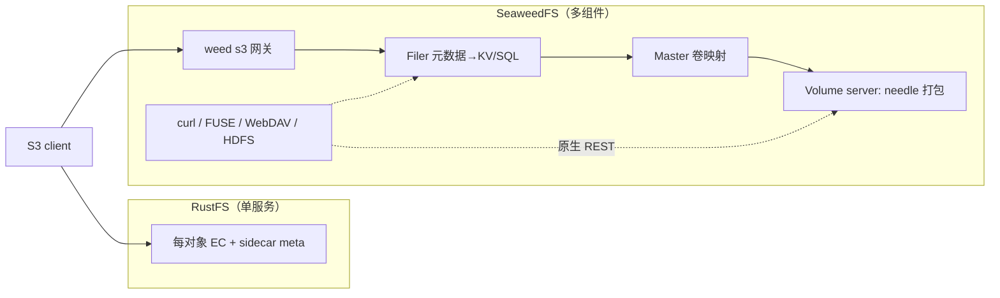

# SeaweedFS（与 RustFS 的区别 + 客户端）

> SeaweedFS（Go，Apache-2.0，[github.com/seaweedfs/seaweedfs](https://github.com/seaweedfs/seaweedfs)）是 Haystack 式 blob 存储 + 可选 Filer，S3 只是它的一个网关。本文聚焦**它和 [RustFS](rustfs.md) 的关键区别**和**客户端怎么连**；S3 通用语义（versioning / 软删硬删 / lifecycle 等）不重复，看 [rustfs.md](rustfs.md)。

## 1. 一句话：两个物种

- **RustFS = MinIO 行为克隆**：S3 优先的对象存储，每个对象旁边一个 sidecar 元数据文件，全时段每对象纠删码。
- **SeaweedFS = blob 存储 + Filer**：海量小文件作为 needle 打包进 ~32GB 大 volume，读 ≈ O(1) 一次磁盘读，内存里每文件 ~16B 索引；目录 / 对象元数据放在**可插拔的 Filer 库**（MySQL / Postgres / Redis / LevelDB / RocksDB…）。S3（`weed s3`）是 Filer 之上的无状态网关，每个桶 = 一个 collection，映射到 `/buckets/<name>`。

这条根因解释了下面几乎所有差异。

## 2. 与 RustFS 的逐项区别

| 维度 | RustFS（MinIO 克隆） | SeaweedFS |
|---|---|---|
| 元数据 | 每对象 sidecar meta 文件，随对象打盘 | needle，~16B 内存索引/文件；目录元数据在可插拔 Filer 库 |
| 海量小文件 | 每元数据 op ≈ 1 次磁盘 seek；list / copy / delete 的 wall-clock ∝ 对象数（[rustfs.md §6](rustfs.md)） | needle 打包，读 ≈ O(1)；专为海量小文件设计，无需自己打 zip 聚合 |
| 纠删码 | 全时段每对象内联 EC | 热数据走副本（卷级 `000`–`200`，机架/机房感知）+ 冷数据可选 **RS(10,4)**（worker 封存触发，1.4× 体积，读约半速多一跳，EC 卷只删不改） |
| 版本存储 | MinIO 式内联版本 | 版本存 `<key>.versions/` 文件夹；VersionId = `v_<32hex>` |
| 生命周期 / GC | S3 lifecycle scanner | 完整 S3 lifecycle（`NoncurrentVersionExpiration`、`ExpiredObjectDeleteMarker`、prefix/tag/size 过滤）**但无 `Transition` / 存储分级**；另有原生 **Volume-TTL**（整卷过期、最便宜，`fs.configure -ttl`） |
| 服务端 copy | `CopyObject` = 读 src + 写 dst（1 Get + 1 Put 打盘）；HDD 高并发易 `500 Io error: timeout`（[rustfs.md §5](rustfs.md)） | 同对象改 meta/tag = 纯元数据（瞬时复用 chunk）；真 copy = 逐 chunk 服务端流式 volume→volume 并行 |
| 删大桶 | `mc rb --force` 硬删所有版本；超大桶用非标 `x-minio-force-delete` header（[rustfs.md §8](rustfs.md)） | `DeleteBucket` 丢整个 collection；用 `leveldb3` Filer 库时每桶独立 DB → 删桶极快 |
| S3 保真度 | 高（MinIO 克隆），`mc` 一等公民 | 广但有缺口：无 `RestoreObject` / `SelectObjectContent` / MFA-delete / 存储分级 transition；`DeleteObject` 会删文件夹 |
| 交互面 | 仅 S3 | 多面：S3 / 原生 REST / Filer HTTP / FUSE / WebDAV / HDFS |
| 运维 CLI | `mc admin`（MinIO admin API） | `weed shell` + Admin / Filer UI |
| 组件数 | 单服务 | master + volume + filer(+元数据库) + admin/worker |

## 3. 客户端 / 怎么连

### 3.1 多前端总览（按场景挑）

它跟 RustFS/MinIO 最大的不同：**S3 只是它多个前端之一**。

| 场景 | 怎么连 | 端口 / 命令 |
|---|---|---|
| 当对象存储用（最常见） | `aws-cli (s3api)` / `boto3` / `rclone` / `s3cmd` / `restic`；任意 AWS SDK；`mc` 通用模式 | S3 网关 `:8333`（`weed s3`） |
| 要极致性能 / 最底层 | `curl` 走 master 拿 `fid`，再 POST/GET/DELETE 到 volume，绕过 S3 | master `:9333/dir/assign` + volume `:8080/<fid>` |
| 按路径读写 + 列目录(JSON) | `curl` 打 Filer HTTP API，GET/PUT/DELETE | Filer `:8888/path/to/file` |
| 当本地文件系统用 | `weed mount`（FUSE）→ 普通 `cp/ls/cat` | — |
| Mac/Windows 映射网络盘 | WebDAV | `:7333` |
| Hadoop/Spark/Flink | HDFS-compatible connector | — |
| 集群运维 / 管理（≈ MinIO 的 `mc admin`） | `weed shell`：`fs.configure` / `volume.*` / `ec.encode` / `s3.bucket.*`；外加 Admin UI、Filer UI | `weed shell` / Web（Admin UI `:23646`） |
| 程序内嵌 SDK | 原生（gRPC/HTTP）或任意 S3 SDK（见 §3.4） | — |

### 3.2 S3 客户端（最常用那一面）

**所有 S3 客户端通用的几条**（SeaweedFS S3 = 默认 path-style 的 S3 兼容端点）：

- **端点**：`http(s)://<host>:8333`，用客户端的 endpoint 选项指它。
- **凭据**：开了鉴权就用配的 AK/SK；即使没开（zero-config 默认 Allow），aws-cli / s3cmd / restic 仍要求填**非空**占位值。
- **region**：填占位 `us-east-1`；SeaweedFS 不校验，但客户端常要求有值。
- **寻址**：默认 **path-style**（`endpoint/bucket/key`），多数客户端要显式开（见下表）。**virtual-hosted-style（`bucket.endpoint`）要先给网关配 `domainNames` 才路由**（源码 `classifyDomainNames`，`s3api_server.go`），不配就只能 path-style。
- **签名**：**SigV4**（推荐）与 **SigV2** 都支持。
- **鉴权模式**：zero-config 默认开放（Allow，策略在内存、重启丢）；要落地/收紧用 `-s3.config`（静态 key JSON）或 `-s3.iam.config`（STS/OIDC），`defaultEffect: Deny` 才真正锁。

**S3 客户端速查**（✓ = 有官方专页）：

| 客户端 | 官方页 | 关键配置 | 备注 |
|---|---|---|---|
| **aws-cli** | ✓ | `--endpoint-url <ep>`；`aws configure set default.s3.signature_version s3v4`；region `us-east-1` | presign / SSE-KMS·C·S3 / STS 都可用 |
| **boto3 / 各语言 AWS SDK** | —（通用 S3） | `endpoint_url=<ep>`；`Config(s3={'addressing_style':'path'}, signature_version='s3v4')` | 任意 AWS SDK 同理 |
| **rclone** | ✓ | `type=s3, provider=Other, endpoint=<ep>, force_path_style=true` | 大文件调 `chunk_size` / `upload_cutoff` |
| **s3cmd** | ✓ | `host_base = host_bucket = <ep>`（两者同值 = path-style）；`signature_v2=False` | 反代子路径才考虑 v2 |
| **restic** | ✓ | repo = `s3:http://<ep>/<bucket>`；**必须**非空 AK/SK | restic 不接受匿名访问 |
| **mc**（MinIO Client） | ✗（社区） | `mc alias set sw http://<ep>:8333 <AK> <SK>` | 标准 S3 命令可用；**`mc admin` / `x-minio-force-delete` 不可用**（见 §3.3） |
| **MinIO 各语言 SDK**（minio-go 等） | ✗（通用 S3） | endpoint + path-style | 同 mc，避开 MinIO admin 扩展即可 |

> **反代子路径坑**：aws-cli / rclone 把 bucket 拼在子路径前，经反代加 `/s3` 前缀时签名会对不上——反代要回传 `X-Forwarded-Prefix: /s3`（s3cmd 还需 `X-Forwarded-Host`）。能用独立子域名或独立端口就别走子路径。

### 3.3 关于 mc（容易误判）

`mc`（MinIO Client）**本质是通用 S3 客户端**，`mc alias set` 后标准 S3 命令（`ls / cp / mirror / rm / stat / version / ilm`）都能打 SeaweedFS。但：

- SeaweedFS 官方**没把 mc 列进客户端文档**（只列 aws-cli / s3cmd / rclone / restic / nodejs）——它在这里只是"又一个 S3 客户端"，不是一等公民。
- **MinIO 专有的部分不工作**：`mc admin *`（SeaweedFS 没实现 MinIO admin API）、以及 `mc rb --force` 依赖的 `x-minio-force-delete` 私有 header。运维要用 `weed shell`，不是 `mc admin`。

### 3.4 原生（非 S3）客户端

要绕过 S3、直接打 needle / filer 的：官方 **Java gRPC 客户端**（Maven `com.seaweedfs:seaweedfs-client`），加一堆社区库（PHP / JS / Go / Python / C# / Rust… 见 wiki [Client Libraries]）。这些走**原生 HTTP/gRPC，不是 S3 SDK**，别和上面的 S3 客户端混。

## 参考

- 仓库 / Wiki：[seaweedfs](https://github.com/seaweedfs/seaweedfs) · [Wiki](https://github.com/seaweedfs/seaweedfs/wiki)
- [Amazon S3 API（支持矩阵）](https://github.com/seaweedfs/seaweedfs/wiki/Amazon-S3-API) · [S3 Object Versioning](https://github.com/seaweedfs/seaweedfs/wiki/S3-Object-Versioning) · [S3 Lifecycle](https://github.com/seaweedfs/seaweedfs/wiki/S3-Lifecycle) · [Lifecycle vs Volume TTL](https://github.com/seaweedfs/seaweedfs/wiki/S3-Lifecycle-vs-Volume-TTL) · [Erasure Coding](https://github.com/seaweedfs/seaweedfs/wiki/Erasure-Coding-for-warm-storage) · [Filer Stores（fast bucket deletion）](https://github.com/seaweedfs/seaweedfs/wiki/Filer-Stores) · [S3 API FAQ](https://github.com/seaweedfs/seaweedfs/wiki/S3-API-FAQ)
- S3 客户端：[aws-cli](https://github.com/seaweedfs/seaweedfs/wiki/AWS-CLI-with-SeaweedFS) · [s3cmd](https://github.com/seaweedfs/seaweedfs/wiki/s3cmd-with-SeaweedFS) · [rclone](https://github.com/seaweedfs/seaweedfs/wiki/rclone-with-SeaweedFS) · [restic](https://github.com/seaweedfs/seaweedfs/wiki/restic-with-SeaweedFS) · [nodejs](https://github.com/seaweedfs/seaweedfs/wiki/nodejs-with-Seaweed-S3) · [S3 Configuration（鉴权模式）](https://github.com/seaweedfs/seaweedfs/wiki/S3-Configuration) · [Client Libraries（原生）](https://github.com/seaweedfs/seaweedfs/wiki/Client-Libraries)
- RustFS 侧细节：[rustfs.md](rustfs.md) · [rustfs-bulk-ops.md](rustfs-bulk-ops.md)
